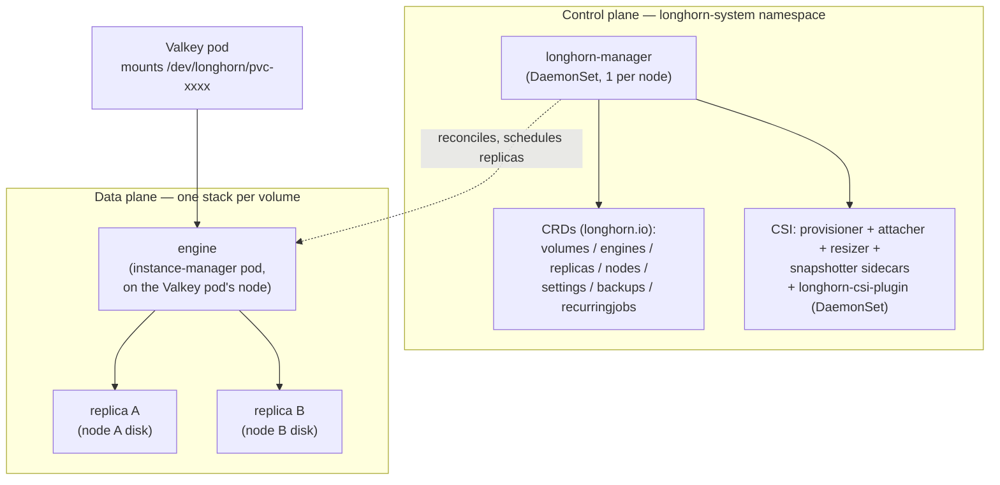
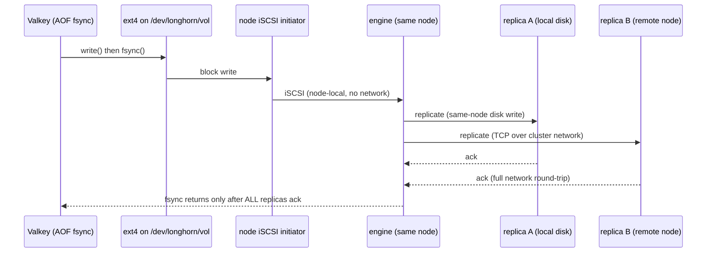

The [Valkey Helm deep dive](/architectures/valkey-helm-deep-dive/) already made the tenant-level call: which StorageClass to ask for, why `numberOfReplicas: 2` beats `3` when Valkey already replicates, and why `dataLocality: best-effort` earns its keep for a latency-sensitive datastore — see [§4, Longhorn: distributed block storage for the AOF/RDB](/architectures/valkey-helm-deep-dive/#4-longhorn-distributed-block-storage-for-the-aofrdb). This page is what lives **underneath** that decision.

You own a namespace, not the cluster, so you will not install Longhorn or prep nodes. But the whole point of running a database on distributed block storage is that when it misbehaves — a volume stuck `degraded`, a pod that won't reattach, an fsync latency cliff — the failure surfaces in *your* Valkey, and "open a ticket" is a weak answer if you can't say what layer broke. This deep dive gives you that vocabulary. Where a topic crosses from your seat into the platform team's, it says so, and then explains it anyway so your ticket carries evidence instead of a shrug.

For the broader "what is Longhorn and when do you reach for it" framing, start at [Storage Controllers](/controllers/storage-controllers/); for the generic CSI attach/detach/provision machinery, [CSI Drivers](/controllers/csi-drivers/). This page assumes both.

## 1. What actually runs

Longhorn is a **microservices** storage system: there is no monolithic storage daemon. Every piece is a Kubernetes workload in the `longhorn-system` namespace, and every volume gets its own tiny, dedicated storage stack.

| Component | What it is | What it does |
|---|---|---|
| `longhorn-manager` | DaemonSet, one pod per node | The brain. Watches the CRDs, schedules replicas, drives the CSI plugin, exports metrics. Talks to its peers on other nodes. |
| **CRDs** (`longhorn.io`) | `volumes`, `engines`, `replicas`, `nodes`, `settings`, `backups`, `snapshots`, `recurringjobs`, `backingimages` | The entire control state. `kubectl -n longhorn-system get volumes.longhorn.io` is your window into it. |
| **engine** | One per attached volume, running inside an `instance-manager` pod on the **workload's** node | The volume's controller. Presents an iSCSI target and fans every write out to the replicas. |
| **replica** | One per copy, on **other** nodes' disks | Stores the actual data as sparse files under the data path (default `/var/lib/longhorn`). |
| `instance-manager` | Pod per node | Hosts the engine and replica processes; the `guaranteedInstanceManagerCPU` setting reserves CPU for it. |
| **CSI plugin** | `longhorn-csi-plugin` DaemonSet + the standard sidecars: `external-provisioner`, `external-attacher`, `external-resizer`, `external-snapshotter` | The bridge between Kubernetes PVC/PV objects and Longhorn CRDs. |
| `longhorn-ui`, `longhorn-driver-deployer` | Deployments | The dashboard, and the bootstrap that registers the CSI driver. |



The consequence worth internalizing: **a Longhorn volume is not a directory on your pod's node.** It is a distributed thing whose pieces live on *other* nodes, stitched together over the network and presented to your pod as a local block device. Everything else on this page follows from that.

## 2. The data path, end to end

Here is what one Valkey `fsync` on the AOF actually costs.

1. Valkey writes to a file on a normal filesystem (ext4 or xfs) that the CSI plugin created on the block device `/dev/longhorn/<pvc-id>`.
2. That block device is an **iSCSI** device. The node's iSCSI **initiator** (`open-iscsi` / `iscsid`, running on the host) is logged into a target exposed by the volume's **engine** — which lives on the same node, so this hop is loopback, not network.
3. The engine fans the write out **synchronously** to every replica: the local one (if `dataLocality` put a copy here) writes to a same-node disk; the remote ones travel as TCP over the **cluster (pod) network** to `instance-manager` pods on other nodes.
4. Each replica appends to its sparse file and acks.
5. Only when **all** replicas have acked does the write complete back up the stack and Valkey's `fsync` return.



Two facts fall out of this diagram, and they are the whole story for a database:

- **Reads** can be served from any replica. With `dataLocality: best-effort`, a replica lives on the Valkey pod's own node, so reads skip the network entirely. For a read-heavy Valkey that is a real latency win.
- **Writes have a floor equal to the round-trip to the slowest replica.** No amount of local disk speed buys it back — the ack you wait for is the remote one. This is exactly why the [Helm deep dive](/architectures/valkey-helm-deep-dive/#4-longhorn-distributed-block-storage-for-the-aofrdb) warns against stacking Longhorn's 3 block replicas *under* Valkey's own primary/replica pair: on the one workload where fsync latency is the entire game, you would be paying a synchronous cross-node round-trip on every write to protect data that is already replicated a layer up. Match `appendfsync` to this reality (see the [Helm deep dive §3](/architectures/valkey-helm-deep-dive/) fsync table) rather than fighting it.

## 3. Linux integration (node territory)

:::note[Platform boundary]
Everything in this section is configured on the **nodes**, not in your namespace. You cannot fix it from a manifest. But when a volume won't attach, this is almost always why — so knowing the shape of it turns "storage is broken" into a precise ticket.
:::

- **`open-iscsi` is mandatory on every node.** Longhorn presents volumes as iSCSI devices; the host needs `iscsid` running and the `iscsi_tcp` kernel module loaded. A node missing it cannot attach any Longhorn volume — the symptom is a pod stuck `ContainerCreating` with a `FailedAttachVolume` / `FailedMount` event mentioning iSCSI. (See [Volume and Storage Failures](/troubleshooting/volume-failures/) for the generic attach-failure playbook.)
- **NFSv4 client for RWX.** ReadWriteMany volumes are served by a `share-manager` pod that re-exports the block volume over NFS; nodes need an NFSv4 client. Valkey wants RWO per pod, so you likely never touch this — but know that RWX is "a single NFS server pod in front of the block volume," with the single-point and performance implications that carries.
- **The `multipathd` trap.** If a node runs `multipathd` (common on bare metal / SAN-adjacent hosts), it can grab `/dev/longhorn/*` devices before Longhorn does, and volumes fail to mount or corrupt. The fix is a node-level multipath blacklist for Longhorn's devices. Classic "works on the dev cluster, breaks on the bare-metal one."
- **Filesystem creation.** The CSI plugin runs `mkfs` on first attach; `fsType` and `mkfsParams` on the StorageClass control it (see §5).
- **Encryption** (`encrypted: "true"`) uses `dm_crypt` on the node with keys from a referenced Secret — real at-rest encryption, but another moving part.
- **Hugepages** are required on nodes that run the **v2 (SPDK) data engine** (§5). The v1 engine does not need them.

## 4. Networking, CNI, and the storage plane

Longhorn's replica traffic — both steady-state synchronous writes and one-off rebuilds — rides the **pod/cluster network** by default. It is just TCP between `instance-manager` pods, so it goes through your CNI like any other pod-to-pod traffic. That has consequences an app team feels:

- **Storage traffic competes with app traffic.** A big rebuild (see §11) can saturate a node's link and starve the very Valkey it is protecting. On a busy cluster this shows up as latency spikes correlated with node events, not load.
- **It is latency- and MTU-sensitive.** Synchronous replication means every write eats a network round-trip; a CNI with high tail latency, a wrong MTU (jumbo-frame mismatch), or a congested overlay hurts write latency directly.
- **A dedicated storage network** (via **Multus**, giving Longhorn a second interface on an isolated VLAN) keeps replication off the app path. This is a platform decision and a common one for storage-heavy clusters — worth *asking* for if your Valkey shares nodes with chatty neighbors.

:::note[Platform boundary]
Whether replication rides the default CNI or a dedicated Multus storage network is set when Longhorn is installed. You can't change it, but you can point at it: "write latency spikes during replica rebuilds; is storage traffic isolated?" is a strong platform ticket.
:::

## 5. The StorageClass — your real surface

The StorageClass is the one Longhorn object a tenant genuinely consumes. Everything above is machinery; this is the dial. A Valkey-tuned class:

```yaml
apiVersion: storage.k8s.io/v1
kind: StorageClass
metadata:
  name: longhorn-valkey            # platform-owned name; you select it by name
provisioner: driver.longhorn.io
allowVolumeExpansion: true         # online growth (default true)
reclaimPolicy: Retain              # keep data if the PVC is deleted (default is Delete!)
volumeBindingMode: WaitForFirstConsumer  # bind after the pod is scheduled — see below
parameters:
  numberOfReplicas: "2"            # block copies on distinct nodes (default 3; range 1–20)
  dataLocality: "best-effort"      # keep one replica on the pod's node → local reads
  staleReplicaTimeout: "30"        # minutes before an unhealthy replica is reaped
  fsType: "ext4"                   # or xfs; pick one and stick to it for the fleet
  replicaAutoBalance: "best-effort"
  unmapMarkSnapChainRemoved: "enabled"  # let TRIM/discard actually reclaim space
```

What each knob *does* (the [Helm deep dive §4](/architectures/valkey-helm-deep-dive/#4-longhorn-distributed-block-storage-for-the-aofrdb) already argued which *values* to pick for Valkey — this is the mechanism):

- **`numberOfReplicas`** — how many synchronous block copies, on distinct nodes. Every write waits for all of them; more copies = more durability *and* more write latency and storage. Default `3`.
- **`dataLocality`** — `disabled` (spread only), `best-effort` (try to keep one replica co-located with the pod for local reads), or `strict-local` (pin the volume to one node — **this loses HA**; the volume can't follow the pod).
- **`staleReplicaTimeout`** — minutes before a replica that went unhealthy (node flap) is deleted and rebuilt elsewhere. Default `30`. Too low and a brief blip triggers a needless rebuild storm; too high and you sit degraded longer.
- **`fsType` / `mkfsParams`** — the filesystem `mkfs` lays down on first attach. `ext4` is the default and safe; `xfs` can suit large sequential workloads. Changing it later means a new volume.
- **`replicaAutoBalance`** — `ignored` / `disabled` / `least-effort` / `best-effort`; lets Longhorn move replicas to rebalance across nodes as capacity changes.
- **`unmapMarkSnapChainRemoved`** — `enabled` lets discard/TRIM propagate so a Valkey that grows then shrinks (big load, then `FLUSHALL`) actually **frees node disk** instead of leaving it allocated.
- **`dataEngine`** — `v1` (default, mature) or `v2` (the SPDK engine — higher IOPS/lower latency, but newer and still maturing; needs hugepages; confirm production-readiness for your version before betting a database on it).
- **`encrypted`**, `diskSelector`, `nodeSelector`, `recurringJobSelector`, `migratable`, `replica{,Zone,Disk}SoftAntiAffinity` round out the set — see the [Longhorn StorageClass reference](https://longhorn.io/docs/1.7.2/references/storage-class-parameters/) for the full list and defaults.

Two built-in fields matter as much as the Longhorn ones:

- **`reclaimPolicy`** defaults to `Delete` — deleting the PVC destroys the data. For a database you almost always want `Retain`.
- **`volumeBindingMode`** — `Immediate` provisions the volume as soon as the PVC is created; `WaitForFirstConsumer` waits until a pod is scheduled, so Longhorn can place replicas with awareness of where the pod landed. For `dataLocality` to reliably put a replica on the pod's node, `WaitForFirstConsumer` is the friendlier choice.

## 6. Installing Longhorn (know the knobs you don't turn)

:::note[Platform boundary]
Installation and the cluster-wide `defaultSettings` are the platform team's job. This section exists so you can ask for the right defaults, not so you run `helm install`.
:::

```bash
helm repo add longhorn https://charts.longhorn.io
helm install longhorn longhorn/longhorn \
  --namespace longhorn-system --create-namespace \
  --version 1.7.2                       # pin it; match the docs you're reading
```

The cluster-wide `defaultSettings` in the chart values decide the behavior your StorageClass inherits when it doesn't override them. The ones that shape a database's life:

- **`defaultReplicaCount`**, **`defaultDataLocality`** — the fallbacks when a class omits them.
- **`storageOverProvisioningPercentage`** — how far Longhorn lets *thin* volumes over-commit a node's disk. Set high, thin volumes can collectively fill a disk and trigger disk pressure.
- **`storageMinimalAvailablePercentage`** — the floor of free space below which Longhorn stops scheduling replicas onto a disk (see the scheduling-failure gotcha in §11).
- **`guaranteedInstanceManagerCPU`** — CPU reserved for the engine/replica processes; starve it and I/O stalls.
- **`replicaSoftAntiAffinity` / `replicaZoneSoftAntiAffinity`** — whether replicas *must* land on distinct nodes/zones or merely *prefer* to. "Soft" means Longhorn will co-locate replicas rather than leave a volume un-schedulable — quietly reducing your redundancy.
- **`backupTarget` / `backupTargetCredentialSecret`** — the S3/NFS backupstore. **If this is empty, "we have backups" is false** no matter what the runbook claims (§9).
- **`node-drain-policy`** — what happens to replicas when a node is drained (§11).

## 7. Valkey-specific mechanics

- **RWO, one volume per pod, via `volumeClaimTemplates`.** A StatefulSet gives each Valkey pod its own PVC named `data-<sts>-<ordinal>` (e.g. `data-valkey-0`). This is the identity that lets a restore pre-seed a pod's disk — see [Restoring into a StatefulSet's PVC](/stateful/backup-and-dr/#restoring-into-a-statefulsets-pvc).
- **RDB fork + copy-on-write on a networked device.** When Valkey `BGSAVE`s, it forks and the child snapshots memory while the parent keeps serving; dirtied pages are copied. On Longhorn the resulting writes still fan out synchronously to replicas — a save under heavy write load amplifies network I/O. Prefer taking RDBs off a *replica*, not the primary.
- **AOF fsync is the latency-sensitive path** (§2). `dataLocality: best-effort` helps reads but never writes — every AOF fsync still waits for the remote replica ack.
- **Multi-Attach on failover.** RWO means exactly one node may mount the volume. If the old pod's node is only *unreachable* (not confirmed dead), Kubernetes won't safely detach, and the new pod stalls with a `Multi-Attach error for volume`. This is the exact scenario in [Pod Stuck Terminating](/troubleshooting/stuck-terminating/) and [Volume Failures](/troubleshooting/volume-failures/) — don't force-delete until the node is fenced, or you risk two Valkeys writing the same disk.
- **Does a cache even need durable storage?** If your Valkey is a pure cache, the honest answer may be "no — use `emptyDir` or fast local-path and skip all of this." Longhorn earns its complexity only when the data must survive node loss. The [Helm deep dive §4 replica-count table](/architectures/valkey-helm-deep-dive/#4-longhorn-distributed-block-storage-for-the-aofrdb) and [Valkey and Redis](/stateful/valkey-and-redis/) make that call; don't reach for replicated block storage by reflex.

## 8. Backups, snapshots, and DR (the mechanics)

The tenant summary — snapshots protect you from yourself, backups protect you from the cluster — is in the [Helm deep dive §4](/architectures/valkey-helm-deep-dive/#4-longhorn-distributed-block-storage-for-the-aofrdb). Here is what's underneath:

- **Snapshot** = a marked point in a volume's **replica chain**, stored *in-cluster on the same replicas*. Cheap, instant, and useless if the cluster/disks die. Great for "undo that bad migration."
- **Backup** = the delta between snapshots, shipped as content-addressed blocks to an external **backupstore** (S3 or NFS). Incremental after the first; this is your real disaster copy.
- **`RecurringJob` CRD** schedules snapshots, backups, and filesystem-trim jobs on a cron, selected onto volumes by label (`recurringJobSelector` on the StorageClass, or a job with `groups`).
- **CSI `VolumeSnapshot`** is the standard-Kubernetes trigger: a `VolumeSnapshot` (class `driver.longhorn.io`) maps to a Longhorn snapshot or backup, so you can drive it from ordinary manifests and restore into a new PVC's `dataSource` — the mechanism behind [Restoring into a StatefulSet's PVC](/stateful/backup-and-dr/#restoring-into-a-statefulsets-pvc).
- **DR volumes** restore a backup in *another* cluster and keep incrementally catching up from the backupstore — a warm standby you activate on disaster.

For a database, coordinate the block snapshot with app state: a raw block snapshot is *crash-consistent* (as if the power was cut). To get an *app-consistent* copy, `BGSAVE` off the replica first, then snapshot. See [Backup and DR](/stateful/backup-and-dr/) for why you want both the block layer and the app layer, and [Storage: PV and PVC](/stateful/storage-pv-pvc/) for the binding mechanics.

## 9. Observability

`longhorn-manager` exposes Prometheus metrics (on port `9500` at `/metrics` — confirm for your version); the platform team usually wires a `ServiceMonitor`:

```yaml
apiVersion: monitoring.coreos.com/v1
kind: ServiceMonitor
metadata:
  name: longhorn
  namespace: longhorn-system
spec:
  selector:
    matchLabels: { app: longhorn-manager }
  endpoints:
    - port: manager   # scrapes longhorn-manager :9500 /metrics
```

The metrics that answer "is my Valkey's storage healthy?":

| Metric | Meaning |
|---|---|
| `longhorn_volume_robustness` | **The one to alert on.** `0=unknown, 1=healthy, 2=degraded, 3=faulted`. `faulted` means data loss risk *now*. |
| `longhorn_volume_state` | `1=creating, 2=attached, 3=detached, 4=attaching, 5=detaching, 6=deleting`. |
| `longhorn_volume_actual_size_bytes` / `_capacity_bytes` | Real space used per replica vs configured size — watch thin volumes approaching capacity. |
| `longhorn_volume_read/write_latency`, `_iops`, `_throughput` | Per-volume I/O; correlate write latency with Valkey's own p99. |
| `longhorn_node_status` | `1/0` per node condition (schedulable, ready, disk pressure). |
| `longhorn_disk_capacity_bytes` / `_usage_bytes` | Per-disk fill — the input to `storageMinimalAvailablePercentage` blocking scheduling. |
| `longhorn_instance_manager_cpu_usage_millicpu` / `_memory_usage_bytes` | Engine/replica resource use; starvation here = I/O stalls. |

Sensible alerts: `robustness == 2` (degraded) for more than a few minutes, `robustness == 3` (faulted) immediately, a node dropping out of `longhorn_node_status`, and disk usage approaching the minimal-available floor. See [Metrics](/observability/metrics/) and [PromQL for Resources](/observability/promql-for-resources/) for the query patterns; the values above encode the same "one number that means healthy" idea as a readiness probe.

The kubectl view, when Prometheus isn't in front of you:

```bash
kubectl -n longhorn-system get volumes.longhorn.io     # ROBUSTNESS + STATE columns
kubectl -n longhorn-system get replicas.longhorn.io    # where the copies live, running?
kubectl -n longhorn-system get engines.longhorn.io
kubectl -n longhorn-system describe volume.longhorn.io <pvc-id>   # events + replica health
```

Plus the Longhorn UI, which visualizes the replica layout and rebuild progress — usually behind platform auth. See the [Longhorn monitoring docs](https://longhorn.io/docs/1.7.2/monitoring/) for the full metric list.

## 10. Gotchas and failure modes

| Symptom | Underlying cause | What to do |
|---|---|---|
| Pod `ContainerCreating`, `FailedAttachVolume` mentioning iSCSI | `open-iscsi`/`iscsid` missing on the node | Platform: install open-iscsi on all nodes. Confirm which node the pod landed on. |
| Volume won't mount / corruption on bare metal | `multipathd` hijacked `/dev/longhorn/*` | Platform: blacklist Longhorn devices in multipath config. |
| Draining a node causes Valkey downtime | Node held the **last healthy replica**; drain policy allowed it | Platform: set `node-drain-policy: block-for-eviction-if-contains-last-replica` so drains evict/rebuild replicas first and block until safe. |
| Volume stuck `degraded`, replica won't schedule | Anti-affinity + too few nodes/disks, or below `storageMinimalAvailablePercentage` | Check `describe volume` events; needs another node/disk or freed space. |
| Node disk fills unexpectedly | Thin volumes over-provisioned past real capacity | Watch `longhorn_disk_usage_bytes`; lower `storageOverProvisioningPercentage`; enable TRIM (`unmapMarkSnapChainRemoved`). |
| Latency spikes tied to node events | **Rebuild storm** saturating the cluster network | Consider a Multus storage network; tune `staleReplicaTimeout` so blips don't trigger rebuilds. |
| `Multi-Attach error for volume` on failover | RWO volume can't detach from an unreachable (not-dead) node | Don't force-delete until the node is fenced — [Stuck Terminating](/troubleshooting/stuck-terminating/). |
| Volume expansion didn't grow the filesystem | Block expanded but fs not resized (offline vs online expansion) | Confirm `allowVolumeExpansion`; some paths need the volume detached/reattached to grow the fs. |
| `strict-local` volume can't follow a drained pod | `dataLocality: strict-local` pins the volume to one node | That's the trade — strict-local buys locality at the cost of HA. |

## 11. Verification drills (break it on purpose)

A build you haven't broken in a drill is a diagram, not a system.

1. **Kill a replica.** Delete one replica pod/process and watch `longhorn_volume_robustness` drop `1 → 2` (degraded), a new replica schedule, the rebuild copy blocks from a healthy replica over the network, then return to `1`. Confirm Valkey never noticed.

   ```mermaid
   sequenceDiagram
       participant M as longhorn-manager
       participant E as engine
       participant RB as failed replica (node B)
       participant RD as new replica (node D)
       Note over RB: node B flaps / replica unhealthy
       M->>E: robustness → degraded (2)
       M->>RD: schedule replacement on a healthy node
       E->>RD: full rebuild — copy blocks from a good replica
       Note over E,RD: rebuild rides the cluster network
       RD-->>E: caught up, in sync
       M->>E: robustness → healthy (1)
   ```

2. **Drain the primary's node.** `kubectl cordon` then `kubectl drain` the node running the Valkey primary; time how long the volume takes to detach and reattach where the pod reschedules, and confirm data is intact. This is the [raw build's drain test](/architectures/valkey-shared-vip/) actually passing instead of turning into a manual promotion — *because* a healthy replica existed elsewhere.
3. **Fill a disk.** Push a node's Longhorn disk past `storageMinimalAvailablePercentage` and watch new replicas fail to schedule (volume goes/stays `degraded`) — so you recognize the signature before it's an incident.
4. **Restore from backup into a scratch namespace.** Create a `VolumeSnapshot`, restore it into a new PVC's `dataSource`, bring up a throwaway Valkey against it, and verify the keys are there. A backup you haven't restored is a hope — see [Restoring into a StatefulSet's PVC](/stateful/backup-and-dr/#restoring-into-a-statefulsets-pvc).

## 12. When not to use Longhorn

Longhorn's superpower is **volume-follows-pod**: node loss stops meaning data loss, and failover stops meaning a manual promotion. You pay for it in synchronous write latency and moving parts. Reach for something else when:

- **Latency is the product.** An ultra-low-latency, high-IOPS Valkey may be better on **local NVMe + app-level replication** (Valkey primary/replica or Cluster), accepting a promotion on node loss instead of paying a network round-trip on every fsync. The v2/SPDK engine narrows this gap but doesn't erase it.
- **A better CSI exists.** On a cloud provider, the managed block CSI (EBS/PD/Disk) or a real SAN is usually the right default; Longhorn shines on bare metal and edge where those aren't available.
- **The dataset is huge or write-hot.** Synchronous N-way replication and rebuild traffic scale with data size and churn; past a point, app-level replication over local disks is cheaper and calmer.

The honest framing: Longhorn trades write latency and operational surface for the convenience of a volume that survives its node. For a Valkey that already replicates at the app layer, that trade is often "2 block replicas for reschedule survival, and let Valkey own real HA" — exactly the call the [Helm deep dive §4](/architectures/valkey-helm-deep-dive/#4-longhorn-distributed-block-storage-for-the-aofrdb) lands on.
