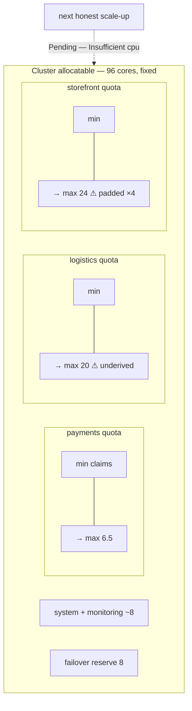

You are here if: you're the SRE who has to make autoscaling safe for five teams at once; or your pods went Pending at the worst moment and you want the systemic fix; or you're reviewing an autoscaling PR and need to know what "done" looks like.

On EKS, `maxReplicas` is a preference — the cluster grows to meet it. On these nodes, it's **a claim on someone else's headroom**. Every ceiling every team sets is a draw against one fixed pool, and the pool doesn't know about any of them until the lunch rush cashes them all at once. This page is the system that keeps those claims honest: one invariant, three guardrails, one recurring conversation, and two artifacts — the golden values and the review checklist — that make the whole thing routine instead of heroic.

## The invariant

```text
Σ over all teams ( maxReplicas × requests-per-pod )
   + system overhead                      (kube-system, monitoring, ingress…)
   + failover reserve                     (one node's worth: its pods must fit elsewhere)
  ≤  cluster allocatable                  (what the nodes offer AFTER kubelet/OS reserves)
```

In plain words: if every autoscaler hit its ceiling simultaneously, would it all fit — with a node down? That's the whole game. Each term: **maxReplicas × requests** is a team's worst-case claim (this is why [padded requests are hoarding at scale](/autoscaling/overview/#the-citizenship-contract) — the padding multiplies); **system overhead** is real and non-negotiable; the **failover reserve** exists because node failures don't schedule around your peaks; **allocatable** is `kubectl describe node` truth, not the hardware invoice.

Watch three teams quietly break it on a 12-node pool (allocatable ≈ 96 cores):

| Team | Workloads' Σ(max × cpu request) | Comment |
|---|---|---|
| payments | 16×250m + 8×200m + 6×150m = **6.5** | derivations on file ✔ |
| logistics | 40×500m = **20** | maxReplicas "just set high to be safe" |
| storefront | 24×1000m = **24** | requests padded 4× over measured use |
| **claims total** | **50.5 cores** | |
| system + monitoring | ~8 | |
| failover reserve (1 node) | 8 | |
| **committed** | **66.5 / 96** | looks fine… |

…until storefront's *measured* need says 6 cores, not 24 — meaning 18 cores of the pool are reserved for padding that will never compute anything, and the *next* team's honest scale-up goes `Pending` anyway. When the invariant breaks for real, the failure sequence is: pods `Pending` with `Insufficient cpu` → the HPA reports `ScalingLimited` ([reading that condition](/troubleshooting/hpa-not-scaling/)) → and if priorities are configured, [preemption](/workloads/scheduling/) starts evicting the lowest tier. Whose pods survive is decided *now*, in this page's guardrails — not during the incident.



## Being a good citizen — the enforcement half

[The overview stated the contract](/autoscaling/overview/#the-citizenship-contract); here's how anyone can *see* compliance. The requested-vs-used gap for a namespace, two ways:

```bash
kubectl top pods -n payments --sum=true
```

```console
$ kubectl top pods -n payments --sum=true
NAME                             CPU(cores)   MEMORY(bytes)
payments-api-7d4b9c8f6d-2mhxl    61m          403Mi
payments-api-7d4b9c8f6d-x8rwp    58m          397Mi
dispatch-worker-5f7b8d9c4-k2j8w  102m         256Mi
                                 ________     ________
                                 221m         1056Mi
```

…against the namespace's reservations (and over time, not a lucky instant — the [consumed-vs-requested queries](/observability/promql-for-resources/) are the authority):

```promql
# Reserved-but-unused CPU in the namespace, as a fraction — the hoarding index
1 - (
  sum(rate(container_cpu_usage_seconds_total{namespace="payments"}[1h]))
  / sum(kube_pod_container_resource_requests{namespace="payments", resource="cpu"})
)
```

A hoarding index around 0.5 at steady state is normal burst headroom. 0.85+ sustained means the namespace is a parking lot — and the *norm* this page establishes is that the quarterly true-up (below) asks about it, neutrally, with the query on screen. Padding stops when it's visible, not when it's forbidden.

## The guardrails

Three objects, each with the trade it imposes stated up front.

**ResourceQuota** — the per-namespace cap that turns the invariant into an enforced budget. On *requests*, deliberately:

```yaml
apiVersion: v1
kind: ResourceQuota
metadata:
  name: payments-quota
  namespace: payments
spec:
  hard:
    requests.cpu: "8"        # the funded claim: must cover Σ(maxReplicas × requests)
    requests.memory: 16Gi    #   for every scaler in the namespace — the JOINT math,
    pods: "60"               #   web AND worker (the web-worker page's failure mode)
    # NOT limits.* quotas here: limits-quotas force every pod to declare limits and
    # meter the sum of *ceilings* nobody reaches at once — with an HPA multiplying
    # pods, that combination overcommits the quota with phantom claims and starves
    # real scale-ups. Meter what the scheduler actually reserves: requests.
```

The trade: teams hit a hard, visible wall (Pending pods at the quota line) instead of silently degrading neighbors. That's the right trade — a wall with your name on it beats a mystery brownout with someone else's — but it means quota sizing is a *commitment*, made in the conversation below.

**LimitRange** — defaults so nothing enters the namespace request-less (a request-less pod would dodge the quota math *and* [blind any HPA it joins](/autoscaling/prerequisites/#1-your-pods-declare-resource-requests)):

```yaml
apiVersion: v1
kind: LimitRange
metadata:
  name: payments-defaults
  namespace: payments
spec:
  limits:
    - type: Container
      defaultRequest: { cpu: 100m, memory: 256Mi }  # a floor, not advice — teams
      default: { memory: 512Mi }                     # should still measure and override
```

**PriorityClass tiers** — who wins when the pool runs tight anyway:

```yaml
apiVersion: scheduling.k8s.io/v1
kind: PriorityClass
metadata:
  name: tier-critical      # 99.9%-SLO, user-facing: payments-api
value: 100000
---
apiVersion: scheduling.k8s.io/v1
kind: PriorityClass
metadata:
  name: tier-standard      # user-relevant, minutes-tolerant: notify-worker
value: 10000
---
apiVersion: scheduling.k8s.io/v1
kind: PriorityClass
metadata:
  name: tier-batch         # deadline-shaped: catalog-indexer, reports
value: 1000
preemptionPolicy: Never    # batch never evicts anyone on arrival — it waits
```

Assignment is justified by **SLO tier** — a 99.9% promise outranks a "fresh within 10 minutes" promise, which outranks "done by 6 a.m." That's [the SLO thread](/autoscaling/slos-for-scaling/) reaching the scheduler: when payments-api's scale-up needs room, the scheduler evicts batch pods to make it (they requeue and resume). The trade batch teams accept: eviction during everyone's peak — priced into their deadline SLOs, stated in their reviews, never a surprise.

On **overcommit**, one paragraph of policy: CPU may be modestly overcommitted (it degrades gracefully — throttling, [visible here](/observability/performance-analysis/)); memory must not be (it degrades by OOMKill — [the QoS mechanics](/workloads/resources-and-qos/)). Concretely: the quota sums can exceed allocatable CPU by a small agreed factor if measured utilization supports it, and must never exceed allocatable memory.

## The capacity conversation

The invariant is arithmetic; keeping it true is a *protocol* between platform and delivery teams:

1. **Teams submit** — with any new or changed scaler: the [classification card](/autoscaling/classify-your-app/#the-classification-card), the [state table](/autoscaling/load-profile/#the-state-table--the-artifact), and the requested floor/ceiling *with derivations*. Everything the reviewer needs already exists if the team walked this section; the submission is stapling, not homework.
2. **Platform maintains the ledger** — the invariant's table, one row per namespace: quota, Σ(max × requests), derivation dates. Whether it's a spreadsheet or a dashboard matters less than that exactly one copy exists and scale-up incidents update it.
3. **Quarterly true-up** — re-run the [load-profile measurements](/autoscaling/load-profile/) against observed reality: peaks that grew (raise the funded claim *before* the Pending pods), floors pinned at min all quarter (give it back), hoarding indexes drifting up (the neutral question). The [drift alerts](/autoscaling/load-profile/#drift-alerts--when-reality-leaves-your-table) keep the quarter honest between true-ups; [cost and rightsizing](/operations/cost-and-rightsizing/) has the PromQL for the meeting.

:::tip[minReplicas honesty]
The ledger's quietest lie is the floor: `minReplicas: 6` where the trough needs 2 reserves four pods' requests every night forever, invisible because nothing ever *fails*. The floor is the trough number, not the comfort number — [the argument in full](/operations/cost-and-rightsizing/).
:::

This protocol *is* [working with the platform team](/operations/working-with-platform-team/), specialized to capacity.

## The golden values

The block teams copy into their charts — pre-tuned so the safe path is the lazy path:

```yaml
# ── golden autoscaling values: copy, then replace every <…> before review ──
autoscaling:
  enabled: false            # off by default: turning it on is a REVIEWED act, not a default
  minReplicas: <n>          # derivation: trough <x> rps ÷ <y> rps/pod, HA floor 2
                            #   state table dated <date> — /autoscaling/load-profile/
  maxReplicas: <n>          # derivation: min( peak math , <external ceiling — NAME it:
                            #   Oracle sessions per DBA ticket <id> / MQ MAXINST per <admin> /
                            #   Redis clients per <owner> > )   ← REQUIRED. A bare number
                            #   here fails review. /autoscaling/<your-archetype>/
  targetCPU: <n>            # derivation: knee <x>% at SLO boundary − lag headroom;
                            #   SLO level: [ user-impact | proxy-PROVISIONAL | system-objective ]
  behavior:                 # JVM-safe defaults — see /autoscaling/spring-boot-scaling/
    scaleUp:
      stabilizationWindowSeconds: 0
      policies: [{ type: Pods, value: 2, periodSeconds: 60 }]
    scaleDown:
      stabilizationWindowSeconds: 300
      policies: [{ type: Pods, value: 1, periodSeconds: 120 }]
priorityClassName: <tier-critical|tier-standard|tier-batch>   # justified by SLO tier
```

The design intent: every `<…>` is a question the team must answer, and the comments say where each answer comes from. A filled-in golden block *is* most of the review.

## The review checklist

The gate, as a copyable artifact — [the prerequisites checklist](/autoscaling/prerequisites/) grown teeth. Paste into the PR; every unchecked box is a conversation, not a rejection — except the four marked ⛔, which block the merge until green (a scaler multiplying a non-idempotent consumer, or an underived ceiling, isn't a follow-up ticket — it's the incident):

```text
AUTOSCALING REVIEW — <service> <date>       reviewer: <you>
[ ] ⛔ Prerequisites all green (the 10-item checklist, run against THIS deployment)
[ ] Classification card attached: safety audit PASSED, archetype named,
    chart grade Silver+  (/autoscaling/classify-your-app/)
[ ] SLO stated, level declared [user-impact | proxy-PROVISIONAL | system-objective],
    and every threshold traceable to it  (/autoscaling/slos-for-scaling/)
[ ] Signal justified against the catalog — incl. why NOT plain CPU, if not CPU-bound
[ ] Metrics pipeline for that signal exists and is alerted on
    (/autoscaling/getting-the-metrics/ meta-alerts)
[ ] State table attached; min/max/target each carry a derivation comment
[ ] ⛔ External ceiling math shown, ceiling OWNER named (DBA / MQ admin / Redis owner)
[ ] ⛔ Consumers: idempotency confirmed in code review; grace-period arithmetic shown
[ ] Graceful shutdown verified UNDER LOAD (Lab-8-style drill, not asserted)
[ ] ⛔ Load test executed WITH the autoscaler enabled, pre-prod: scale-up, wall, scale-down
[ ] Scaling-health dashboard panels + alerts deployed (below)
[ ] priorityClassName assigned and justified by SLO tier
[ ] Ledger updated: this change's Σ(max × requests) delta fits the namespace quota
```

(⛔ = merge-blocker. Everything else may merge with a dated follow-up and a named owner; a blocker can't.)

## Scaling-health observability

The panels a namespace dashboard needs — names and queries ([kube-state-metrics](/observability/metrics/) supplies the `kube_*` series; KEDA, where installed, exports its own):

| Panel | Query |
|---|---|
| Desired vs current vs max | `kube_horizontalpodautoscaler_status_desired_replicas`, `…_status_current_replicas`, `…_spec_max_replicas` — one graph, three lines; the gap *is* the story |
| Scaling events timeline | `changes(kube_horizontalpodautoscaler_status_desired_replicas[1h])` |
| Time at max (per HPA) | `avg_over_time((…status_current_replicas >= bool on() …spec_max_replicas)[1d:])` |
| Quota utilization | `kube_resourcequota{type="used"} / on(resource) kube_resourcequota{type="hard"}` |
| Hoarding index | the reserved-vs-used ratio from the citizenship section |
| Scaler health | mechanism-neutral: `kube_horizontalpodautoscaler_status_condition{condition="ScalingActive",status="false"}`; KEDA track adds `rate(keda_scaler_errors_total[5m])` by scaledObject |

PromQL note: `[1d:]` is the same subquery shape used in the load-profile page — evaluate the expression across one day, using Prometheus's default query step, then feed that range into `avg_over_time`.

## Who owns what

The section's most important boundary table:

| Concern | PLATFORM | DELIVERY TEAM |
|---|---|---|
| The invariant, the ledger, quota sizing, priority tiers, true-up cadence | ✔ | |
| Node capacity truth (`allocatable`), failover reserve policy | ✔ | |
| Derivations: SLO, state table, ceilings, classification card | | ✔ |
| Honest requests and floors (the citizenship contract) | | ✔ |
| The review itself | SRE facilitates | team owns the answers |
| Renegotiating a ceiling with its external owner (DBA, MQ admin) | | ✔ (platform can't do this for you) |

## Alerts

```promql
# Any HPA pinned at max for 1h — a ceiling is load-bearing somewhere; the
# capacity conversation is due BEFORE this becomes Pending pods
max by (horizontalpodautoscaler, namespace) (
  kube_horizontalpodautoscaler_status_current_replicas
  >= bool on(horizontalpodautoscaler, namespace) kube_horizontalpodautoscaler_spec_max_replicas
) == 1
```

```promql
# Namespace quota > 85% used — the next scale-up may hit the wall
max by (namespace, resource) (
  kube_resourcequota{type="used"} / on(namespace, resource) kube_resourcequota{type="hard"}
) > 0.85
```

```promql
# Pods Pending on capacity WHILE any HPA wants more — the invariant is breaking right now
(sum(kube_pod_status_phase{phase="Pending"}) > 0)
and on()
(sum(kube_horizontalpodautoscaler_status_desired_replicas
   - kube_horizontalpodautoscaler_status_current_replicas) > 0)
```

```promql
# The slow-burn version: total funded claims trending toward allocatable —
# Σ(desired × requests) per namespace vs cluster allocatable, reviewed monthly.
# A SKETCH, knowingly: avg-request-per-namespace × Σdesired is only honest while a
# namespace's pods are similarly sized. Mixed pod sizes need the per-workload join
# (HPA → its target Deployment → that pod template's requests) — the ledger's own
# table does that exactly; this query is the between-reviews trend line, not the ledger.
sum by (namespace) (
  kube_horizontalpodautoscaler_status_desired_replicas
  * on(namespace) group_left() avg by (namespace) (kube_pod_container_resource_requests{resource="cpu"})
)
```

## Where next

- **Next in the journey:** [Autoscaling on One Page](/autoscaling/cheat-sheet/) — everything above, condensed to the tables you'll actually keep open.
- **The lateral jump:** rolling this out and meeting resistance? The artifacts are the argument: run one team through [the whole journey](/autoscaling/overview/#the-maturity-ladder), then show the ledger before/after.
