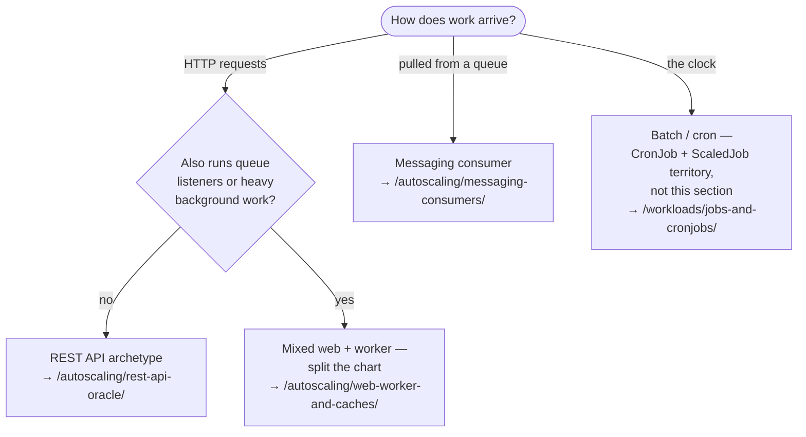

You are here if: you're about to autoscale an app and haven't asked whether it *can* be; or your nightly job just ran twice and you're finding out why; or you inherited a chart and need to know if it's autoscaling-ready.

Two copies of some apps is twice the capacity. Two copies of others is a bug: a report emailed twice, a migration lock storm, five hundred users logged out at 2 p.m. Before any autoscaler touches your service, answer what it *is* — then check whether your Helm chart can even express the answer.

This page is an intake exercise in three parts. Part 1 proves N copies can safely coexist. Part 2 sorts your app into a scaling archetype and fills in a **classification card** you'll carry through the rest of this section. Part 3 audits the chart. An hour, total, for an app you know — and every minute is cheaper than the incident it prevents.

## Part 1 — Can N copies safely coexist?

The HPA's one move is running more identical copies of your pod, all live at once, all receiving work. Spring makes several patterns easy that quietly assume there's only one copy. Each hazard below: what goes wrong, the exact check, and the fix — or the honest verdict *not horizontally scalable yet*.

### Scheduled jobs: N replicas = N firings

`@Scheduled` methods and in-process Quartz run in **every** replica. One pod: the nightly settlement report goes out once. HPA scales you to four overnight because of a batch backlog: the report goes out four times, to the CFO.

Check — from the repo root of the service:

```bash
grep -rn "@Scheduled\|@EnableScheduling" src/
```

```console
$ grep -rn "@Scheduled\|@EnableScheduling" src/main/java/
src/main/java/com/corp/payments/reports/SettlementReport.java:24:    @Scheduled(cron = "0 0 2 * * *")
```

Any hit is a blocker until handled — and grep only sees your sources (`src/`, not `src/main/java/`, so Kotlin and config files count): scheduling can also arrive from a shared library or `spring.quartz.*` configuration, and a dependency that schedules poses the same question. Three fixes, three trades:

| Fix | What you gain | What you pay |
|---|---|---|
| **ShedLock** (annotation-level distributed lock) | Smallest change; job code stays put | A lock table/store to run; the job still wakes every replica |
| **Quartz in clustered mode** | Real scheduler semantics (misfire handling, persistence) | A JDBC job store, Quartz operational knowledge |
| **Extract to a CronJob** | The job leaves the scaling equation entirely — cleanest | A separate deployable; config duplication to manage ([jobs and cronjobs](/workloads/jobs-and-cronjobs/)) |

For anything substantial, extract it: a scheduled job living inside a horizontally-scaled API is a passenger who grabs the wheel.

### In-memory state: scale-out fragments it, scale-in deletes it

HTTP sessions in the servlet container, `@Cacheable` with the default in-JVM cache, hand-rolled rate limiters in a `ConcurrentHashMap` — all of these assume the next request lands on the same JVM. With N pods behind a Service, it lands on any of them (fragmentation), and scale-in destroys whichever copy it held (deletion — for sessions, that's users logged out by the autoscaler).

Check:

```bash
grep -rn "@EnableCaching\|@Cacheable\|HttpSession\|server.servlet.session" \
  src/main/java/ src/main/resources/
```

```console
$ grep -rn "@EnableCaching\|@Cacheable\|HttpSession\|server.servlet.session" src/main/java/ src/main/resources/
src/main/java/com/corp/catalog/PriceService.java:31:    @Cacheable("prices")
src/main/java/com/corp/catalog/web/CartController.java:18:    HttpSession session,
```

A `@Cacheable` hit isn't automatically a blocker — a per-pod cache of *re-fetchable* data is merely less efficient at N copies (and has a stampede problem, covered in [Web + Worker and Caches](/autoscaling/web-worker-and-caches/)). `HttpSession` **is** a blocker: sessions must move to a shared store (Spring Session + the external Redis) before any autoscaler runs. Anything used for *correctness* — rate limits, dedup sets, "have I processed this" flags — must move to a shared store, full stop.

### Startup migrations: N cold starts, one schema

Flyway and Liquibase run on application startup by default. A scale-up event is several simultaneous cold starts, all reaching for the migration lock at once. Usually that's just a slow, scary startup (both tools do lock); occasionally — lock timeouts tuned down, or a plain `ddl-auto` — it's worse.

Check:

```bash
grep -rn "flyway\|liquibase\|ddl-auto" src/main/resources/application*.y*ml
```

```console
$ grep -rn "flyway\|liquibase\|ddl-auto" src/main/resources/application*.yml
src/main/resources/application.yml:12:  flyway:
src/main/resources/application.yml:13:    enabled: true
```

The clean fix: run migrations as a step *before* deployment (a CI step or a pre-upgrade Job) and set `spring.flyway.enabled: false` in the pods. The acceptable fix: keep startup migrations but verify the locking behavior under parallel start and give your startupProbe enough headroom that a lock wait doesn't read as a dead pod. The trade: pre-deploy migrations decouple schema from scale-out entirely but add a pipeline step; startup migrations stay simple but make every scale-up a schema event.

### Exclusive consumers and ordering: parallelism capped by design

Some messaging patterns *mean* "only one consumer": IBM MQ queues opened for exclusive input, RabbitMQ single-active-consumer, or any flow where strict message *ordering* is a business requirement. Scaling these horizontally either fails (broker refuses the second consumer) or silently breaks the ordering the business depended on.

Check your listener and queue config:

```bash
grep -rn "exclusive\|singleActiveConsumer\|x-single-active-consumer" \
  src/main/java/ src/main/resources/
```

No grep proves ordering *requirements* — that's a question to ask out loud: "does anything break if message 7 completes before message 6?" If the answer is yes, your ceiling is 1 (or one-per-group with partitioned/message-group designs), and KEDA's `maxReplicaCount` must honor that — [Messaging Consumers](/autoscaling/messaging-consumers/) covers what queue-depth scaling can still do for you within it.

### The rest of the lineup

- **Local filesystem writes** — anything written to the container filesystem (exports, upload staging, embedded queues) exists in one pod only and dies with it. Check volume mounts and `java.io.File` usage; move to object storage or a shared service.
- **WebSockets / long-lived connections** — scale-*out* doesn't move existing connections to new pods (they help only new connections), and scale-*in* severs whatever was connected. Works, but the [long-lived connection pinning](/networking/long-lived-connections/) story changes what scaling achieves.
- **Leader election, "primary" nodes** — an app that elects a leader among replicas can scale, but the leader's duties don't; know which work is leader-only before assuming N× throughput.

:::danger[Fail = stop]
An HPA on an app that fails Part 1 converts load spikes into data bugs — duplicated side effects, lost sessions, broken ordering — on the days you can least afford them. Fix first, scale second. While you fix: vertical headroom (bigger requests, [measured](/tuning/sizing-walkthrough/)) is still available, and it's not defeat, it's sequencing.
:::

## Part 2 — Which archetype is it?

Four questions, in plain words:

1. **How does work arrive?** HTTP requests · messages pulled from a queue · the clock (batch).
2. **What does it spend time on when busy?** Actual computation (CPU-bound) · waiting on Oracle/MQ/downstream calls (wait-bound — most of this stack) · a downstream that's the real bottleneck.
3. **What state does it hold?** None · a warmable cache · sessions/correctness state (Part 1 findings land here).
4. **What promise fits it?** "Responds fast" (latency) · "processed within N minutes" (freshness) · "done by 6 a.m." (deadline). This one feeds directly into [your SLO](/autoscaling/slos-for-scaling/).



Then fill in the card.

### The classification card

Copy this, fill it in, attach it to the eventual autoscaling PR — the [review gate](/autoscaling/capacity-and-governance/) asks for it by name:

```text
CLASSIFICATION CARD — <service name>, <date>
Archetype:        [ REST API | queue consumer | mixed web+worker | batch (out of scope) ]
Safety audit:     scheduled jobs      [ pass | fixed via ___ | FAIL ]
                  in-memory state     [ pass | fixed via ___ | FAIL ]
                  startup migrations  [ pass | fixed via ___ | FAIL ]
                  exclusive/ordering  [ pass | capped at N=___ | FAIL ]
                  filesystem/other    [ pass | notes: ___ ]
Dependencies:     Oracle    — session budget ___, owner: <DBA>
                  IBM MQ    — max handles/instances ___, owner: <MQ admin>
                  RabbitMQ  — connection/channel limits ___, owner: <broker admin>
                  Redis     — maxclients share ___, owner: <platform/DBA>
                  (smallest ceiling wins → maxReplicas input)
SLO shape:        [ latency | freshness | deadline ]  → drives signal choice
Chart grade:      [ Bronze | Silver | Gold ]  (Part 3)
```

The dependency rows are the point: every external system contributes a ceiling term, each ceiling has a human owner, and the smallest one — not cluster capacity — is what caps your replica count. The reference-architecture pages do that math; this card is where you collect the inputs.

## Part 3 — Is the chart ready?

You may not have written this chart. Audit what it *renders*, not what its README claims. Two commands do most of the work — first, what's actually deployed right now:

```bash
helm get values payments -n payments
```

```console
$ helm get values payments -n payments
USER-SUPPLIED VALUES:
replicaCount: 3
resources:
  requests:
    cpu: 250m
    memory: 512Mi
```

And what the chart renders when autoscaling is asked for — if the flag doesn't exist yet, that's finding #1:

```bash
helm template charts/payments-api --set autoscaling.enabled=true | grep -B2 -A2 "replicas:"
```

```console
$ helm template charts/payments-api --set autoscaling.enabled=true | grep -B2 -A2 "replicas:"
kind: Deployment
spec:
  replicas: 3
```

That output is the classic failure: the chart renders `replicas: 3` *even with autoscaling on*, so every `helm upgrade` will fight the HPA ([why that hurts](/autoscaling/prerequisites/#9-replicas-is-out-of-your-chart-when-the-hpa-is-on)).

The eight audit items — each: why, how to check, the fix.

**1. `replicas:` gated behind the autoscaling flag.** Why: the Helm-vs-HPA tug-of-war above. Check: the `helm template | grep` you just ran — with `autoscaling.enabled=true`, the Deployment must render **no** `replicas:` line. Fix:

```yaml
# templates/deployment.yaml
spec:
  {{- if not .Values.autoscaling.enabled }}
  replicas: {{ .Values.replicaCount }}
  {{- end }}
```

**2. Resources come from values, not hardcoded in templates.** Why: you'll re-tune requests as you measure ([and you will](/tuning/sizing-walkthrough/)); a hardcoded template makes every tune a chart release. Check: `grep -rn "cpu:\|memory:" charts/payments-api/templates/` — hits should read `{{ .Values.resources… }}`, not literals.

**3. Probes present and threshold-tunable.** Why: probe timing is scaling infrastructure for a slow-starting JVM ([the warmup story](/autoscaling/spring-boot-scaling/)); tuning `initialDelaySeconds`/`failureThreshold` shouldn't need a template edit. Check: probes exist in the template and their numbers reference values.

**4. Grace period and preStop configurable.** Why: consumers size `terminationGracePeriodSeconds` from message-processing math ([the formula](/autoscaling/messaging-consumers/)); a hardcoded 30 makes safe scale-in impossible to configure. Check: `grep -n "terminationGracePeriodSeconds\|preStop" charts/payments-api/templates/deployment.yaml`.

**5. HPA/ScaledObject templates ship in the chart, values-gated.** Why: scaling config travels with the app it scales — same reasoning as the ServiceMonitor living in the chart ([Lab 6 set the precedent](/labs/lab-6-observability/)). A hand-applied HPA in a cluster is drift waiting to be discovered. Check: `ls charts/payments-api/templates/ | grep -i "hpa\|scaledobject"`. Fix: [Lab 10 authors exactly this template](/labs/lab-10-autoscaling/).

**6. PDB template exists.** Why: a PodDisruptionBudget keeps node drains from evicting you below your floor — and its `minAvailable` must be *below* the HPA's `minReplicas` or drains deadlock ([high availability](/workloads/high-availability/) has the interaction). Check: `ls charts/payments-api/templates/ | grep -i pdb`.

**7. `priorityClassName` wired to values.** Why: when the fixed pool runs tight, [priority decides](/autoscaling/capacity-and-governance/) whose scale-up wins; the class is assigned per-workload and will differ between your API and your batch worker. Check: `grep -rn priorityClassName charts/payments-api/templates/`.

**8. Stable labels and names.** Why: the HPA targets your Deployment *by name*; a rename (or a chart that derives names from release + fullnameOverride games) strands the HPA pointing at nothing — it reports `<unknown>` and scaling silently stops. Check: render twice with different release names and confirm your HPA template's `scaleTargetRef.name` tracks the Deployment's rendered name from the same helper.

### Grades

| Grade | Items | What it means |
|---|---|---|
| **Bronze** | 1–2 | The HPA won't fight the chart. *One PR gets you here.* |
| **Silver** | 1–5 | Scaling is safe: probes, shutdown, and the scaler itself are chart-managed and tunable |
| **Gold** | 1–8 | Scaling is governed: disruption, priority, and naming are production-grade |

The [review gate](/autoscaling/capacity-and-governance/) asks for Silver or better. Bronze is the honest minimum to run the [quick start](/autoscaling/quick-start/).

## Failure modes

| What you see | What actually happened | Where it's covered |
|---|---|---|
| Nightly report sent 4× | `@Scheduled` in a scaled API — Part 1 skipped | this page, fix table above |
| Lock timeout storm on first real scale-out | Flyway-on-startup × N cold starts | this page, migrations |
| Users logged out mid-afternoon | in-JVM sessions + scale-in | [web-worker-and-caches](/autoscaling/web-worker-and-caches/) |
| Deploy dropped fleet from 10 pods to 3 mid-rush | ungated `replicas:` — audit item 1 | [prerequisites #9](/autoscaling/prerequisites/) |
| HPA reports `<unknown>`, scaling stopped after a refactor | Deployment renamed, HPA stranded — item 8 | [the runbook](/troubleshooting/hpa-not-scaling/) |

## Where next

- **Next in the journey:** [Start With the User: SLOs That Drive Scaling](/autoscaling/slos-for-scaling/) — the card's "SLO shape" field, earned properly.
- **The lateral jump:** card filled and chart at Bronze? The [quick start](/autoscaling/quick-start/) is safe today; come back for the rest.
