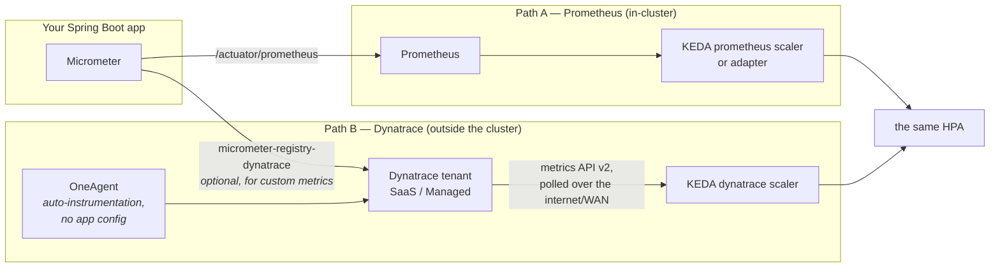

You are here if: prod has OneAgent everywhere but your Prometheus stack is dev-only; or the signal you want to scale on is something Dynatrace computes and Prometheus never sees; or you're deciding, as a matter of policy, which system feeds the autoscalers.

You watch Dynatrace. Your HPA watches Prometheus. When those two disagree at 2 a.m. — Dynatrace showing a slow service, the HPA calmly reporting 40% of target — which one was the truth? Both, usually: they measure different things at different points with different delays. This page is about deliberately choosing which system *drives* scaling, and wiring the Dynatrace option properly when it wins.

One sentence of orientation for the Prometheus-minded: **OneAgent** is Dynatrace's auto-instrumentation agent — deployed by the platform team onto nodes/pods, it captures service metrics, traces, and response-time percentiles *without any application config*, and ships them to a Dynatrace tenant (SaaS or Managed) that lives outside your cluster.

## The two signal paths



Both paths end at the same HPA; what differs is who owns the pipe, how fresh the number is, and what fails when.

**Getting app metrics into Dynatrace** happens two ways, and they carry different metrics. OneAgent auto-captures service-level truths — request rates, response-time percentiles, failure rates — with zero app changes, under Dynatrace's own metric names (`builtin:service.response.time` and friends). Your *custom* Micrometer metrics (the [busy-thread ratio, the internal queue gauge](/autoscaling/getting-the-metrics/#custom-metrics--when-and-how)) do **not** ride OneAgent automatically — for those you add the registry:

```yaml
# application.yaml — only needed for custom Micrometer metrics → Dynatrace.
# With a local OneAgent present, uri and token can often be omitted entirely
# (the registry finds the agent); the explicit form is for direct ingest:
management:
  dynatrace:
    metrics:
      export:
        uri: https://abc12345.live.dynatrace.com/api/v2/metrics/ingest
        api-token: ${DYNATRACE_INGEST_TOKEN}   # from a Secret, scope: metrics.ingest —
                                                # ingest-only, NOT the same token KEDA reads with
```

(Dependency: `io.micrometer:micrometer-registry-dynatrace`. Which names and dimensions arrive per path differs — check the tenant's metric browser before writing selectors. Actuator plumbing: [the Actuator page](/java/actuator/), [Java observability](/java/java-observability/).)

## The KEDA `dynatrace` scaler

:::caution[Requires KEDA 2.15 or newer]
The `dynatrace` scaler shipped in **KEDA 2.15**; clusters on anything older simply don't have it. Check before you write YAML:

```bash
kubectl get deployment keda-operator -n keda \
  -o jsonpath='{.spec.template.spec.containers[0].image}'
```

```console
$ kubectl get deployment keda-operator -n keda -o jsonpath='...'
ghcr.io/kedacore/keda:2.20.1
```

2.20.1 is this section's assumed baseline ([Lab 10 pins the same one](/labs/lab-10-autoscaling/)); anything ≥ 2.15 has the scaler. Older → a named PLATFORM ask: "upgrade KEDA to the section baseline." Authority on all scaler details: [keda.sh/docs/latest/scalers/dynatrace](https://keda.sh/docs/latest/scalers/dynatrace/).
:::

The build — a metric-selector trigger on the busy-thread gauge the Micrometer registry ships:

```yaml
apiVersion: keda.sh/v1alpha1
kind: TriggerAuthentication
metadata:
  name: payments-dynatrace-auth
  namespace: payments
spec:
  secretTargetRef:
    - parameter: host              # the tenant URL — SaaS: https://abc12345.live.dynatrace.com
      name: dynatrace-scaler-creds # Managed: https://<host>/e/<environment-id> — the
      key: host                    #   two URL shapes are THE classic misconfig, see below
    - parameter: token             # API token, scope: metrics.read — read-only, made for this
      name: dynatrace-scaler-creds
      key: token
---
apiVersion: keda.sh/v1alpha1
kind: ScaledObject
metadata:
  name: payments-api
  namespace: payments
spec:
  scaleTargetRef:
    name: payments-api
  minReplicaCount: 2               # same floors/ceilings as ever — the signal source
  maxReplicaCount: 16              # changes nothing about the capacity math
  pollingInterval: 60              # slower than in-cluster polling on purpose: every poll
                                   # is a metered API call against org-wide rate limits
  fallback:                        # when KEDA can't read the tenant (WAN down, token
    failureThreshold: 3            # expired, rate-limited): after 3 failed polls, hold
    replicas: 5                    # THIS count. Pick your steady-state pod count from the
                                   # state table — without this block KEDA freezes at the
                                   # current count, and "current" at 2 a.m. is a trough
                                   # count that the morning ramp will then hit blind
  triggers:
    - type: dynatrace
      metadata:
        # Which number, straight from the tenant's metric browser — average busy
        # threads across payments-api pods:
        metricSelector: "custom.tomcat.threads.busy:filter(eq(app,payments-api)):avg"
        from: "now-5m"             # query window; wider = smoother = slower to react
        threshold: "150"           # scale toward 1 pod per 150 busy threads (200-thread
                                   # pools → the same 75% target as the Prometheus path)
      authenticationRef:
        name: payments-dynatrace-auth
```

**Token scopes — the split that burns an afternoon:** a `metricSelector` trigger needs an ordinary API token with **`metrics.read`**. The scaler's *DQL query* variant (a `query` field instead of `metricSelector`, for signals only a DQL expression can compute) authenticates differently — a **platform token** with `storage:metrics:read` and `storage:buckets:read`. Different token type, different admin screen, different ask to whoever owns the tenant. Get the scope wrong and the failure is a generic scaler auth error, nothing naming the missing scope.

**Latency honesty.** A number takes 1–2 minutes to make the round trip — OneAgent capture → ingest → queryable → KEDA's next poll — versus seconds for in-cluster Prometheus. Budget it exactly like [JVM warmup lag](/autoscaling/spring-boot-scaling/#the-warmup-timeline): thresholds need headroom for load growth during the *blind window*, which is now signal delay *plus* reaction *plus* warmup. And the API rate limits are **tenant-wide** — your 60 s polling shares a bucket with every dashboard and script in the org, which is why `pollingInterval` above isn't 10.

:::danger[Davis is not a scaling trigger]
Davis — Dynatrace's anomaly-detection AI — finds problems without thresholds, and teams reasonably ask "can it drive scaling?" No, structurally: control loops need inputs that are **deterministic** (same conditions → same number — anomaly scores retrain and drift), **bounded in delay** (Davis takes minutes and its detection windows are its own), and **replayable** (a postmortem must answer "why did we have 14 pods at 14:02?" — "the AI felt strongly" doesn't close incidents). Davis is excellent *around* the loop: validating that scaling improved things, catching what your thresholds missed. Raw metrics drive; Davis reviews. The same logic applies to Dynatrace's SLO objects — great for tracking [the SLO](/autoscaling/slos-for-scaling/), still a computed judgment, not a control signal.
:::

## Choosing the path

| | Path A — Prometheus | Path B — Dynatrace scaler |
|---|---|---|
| Signal freshness | seconds (in-cluster scrape) | 1–2 min (ingest + WAN poll) |
| Pipeline owner | you + platform ([Lane B](/autoscaling/getting-the-metrics/)) | Dynatrace admin + platform |
| Custom app metrics | native (Micrometer → scrape) | need the Dynatrace registry too |
| Response-time percentiles | you must [enable histograms](/autoscaling/getting-the-metrics/#1-make-the-app-publish) | free via OneAgent |
| When cluster networking degrades | keeps working (all local) | polling crosses the WAN — may go blind exactly during trouble |
| Cost / limits | Prometheus RAM (cardinality) | metered API calls, org-wide rate limits |
| Auth complexity | usually none in-cluster | token types and scopes, above |
| Dev/prod parity | wherever the stack runs | only where OneAgent + tenant exist — often prod-only |

**The bottom line for this shop:** where the Prometheus stack exists, Path A drives scaling — fresher, local, and failure-correlated with nothing outside the cluster. The Dynatrace scaler earns its place in two real cases: environments where **OneAgent is the only instrumentation** (the prod cluster whose Prometheus never got funded), and signals that are **genuinely Dynatrace-computed** (a service-level metric OneAgent derives that you can't reconstruct from `/actuator/prometheus`). The trade you accept there: staler signal, WAN dependency, token ceremony — priced into wider thresholds and a slower `pollingInterval`.

Whichever path drives, *the other keeps its job*: Dynatrace stays your observability and SLO-tracking home even when Prometheus feeds the HPA. The 2 a.m. disagreement resolves by role, not by winner.

## Who owns what

| Concern | Owner |
|---|---|
| OneAgent/ActiveGate deployment, tenant, token issuance & scopes | Dynatrace admin / PLATFORM |
| Egress from KEDA to the tenant (SaaS = internet egress!) | PLATFORM |
| Metric emission, selector, threshold, polling cadence | YOU |
| Knowing which token type your trigger variant needs | YOU (this page) |

## Failure modes

| Symptom | What happened | Fix |
|---|---|---|
| Scaler auth error, token looks right | scope mismatch — metricSelector vs DQL token split | the scopes paragraph |
| ScaledObject READY but metric always 0 / `<unknown>` | metricSelector matches nothing (name/dimension drift) | test the selector in the tenant's metric browser first; [runbook §external metrics](/troubleshooting/hpa-not-scaling/) |
| Intermittent scaler errors at busy hours | org-wide API rate limit — someone's dashboard wall shares your bucket | raise pollingInterval; ask the admin for limits headroom |
| Everything correct, still 401/404 | SaaS vs Managed URL shape (`…live.dynatrace.com` vs `…/e/<env-id>`) | the TriggerAuthentication comment above |
| Scaling froze during a network incident | WAN path down — Path B's structural trade | the `fallback` block above ([full mechanics](/architectures/keda-autoscaling/)); consider Path A for that workload |

## Meta-monitoring

```promql
# KEDA failing to query Dynatrace — scaling is blind right now
sum(rate(keda_scaler_errors_total{scaledObject="payments-api"}[5m])) > 0
```

And one alert that must live *in Dynatrace* (it can't be PromQL — it's watching the thing PromQL can't see): ingest lag / metric staleness on the selector your scaler reads, so someone hears about a stale signal *before* the blind autoscaler makes it interesting.

## Where next

- **Next in the journey:** [Capacity, Quotas, and Rolling Autoscaling Out to Teams](/autoscaling/capacity-and-governance/) — every ceiling and derivation this section produced becomes, finally, someone's ledger.
- **The lateral jump:** the RUM/user-session side of Dynatrace — abandonment cliffs, tolerance evidence — feeds [your SLOs](/autoscaling/slos-for-scaling/#measure-user-behavior--dont-guess-it), not your scalers.
