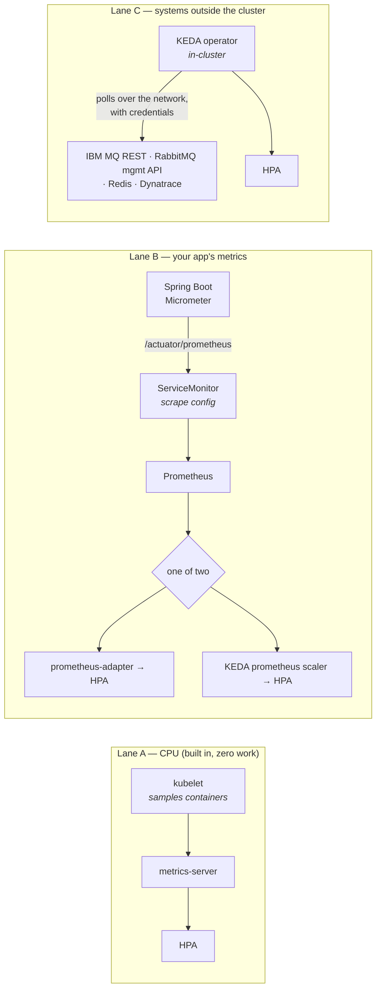

You are here if: you chose a signal from [the catalog](/autoscaling/signals-catalog/) and now need it to actually reach an autoscaler; or your HPA says `<unknown>` and you suspect the pipe, not the app; or you want to scale on a number only your app knows.

Kubernetes only scales on numbers it can see. Between your app *knowing* a number and the autoscaler *acting* on it sits a pipeline someone has to build — and "someone" is split between you and the platform team in ways worth knowing before you file the wrong ticket. Here is that pipeline, end to end, in three lanes:



Ownership, lane by lane: A is nobody's work. In B, the app config and the ServiceMonitor are **yours** (they ship in your chart); Prometheus itself and the adapter/KEDA installation are the **platform's**. In C, the ScaledObject and credentials Secret are yours; KEDA's existence and the firewall path to the broker are the platform's.

## Lane A — CPU

Already built. The kubelet on every node samples container CPU/memory, metrics-server aggregates, the HPA asks. Verify it works (`kubectl top pods -n payments`) and move on — this lane's only failure mode is metrics-server being absent, which is [prerequisite #2](/autoscaling/prerequisites/#2-the-cluster-can-measure-cpu-at-all) and a platform ticket.

The one thing worth knowing: this lane serves *only* CPU and memory. Everything better rides Lane B.

## Lane B — your app's metrics, step by step

Five steps from "my app knows its thread count" to "the HPA scales on it." Each step has a proof command; run them in order and you'll know exactly where any break is.

### 1. Make the app publish

Micrometer is the metrics library inside Spring Boot Actuator — it's what turns "Tomcat has 143 busy threads" into a number on a URL. Expose the Prometheus endpoint, and while you're in the file, flip the two switches this section's signals need:

```yaml
# application.yaml
management:
  endpoints:
    web:
      exposure:
        include: "health,prometheus"   # publish metrics on /actuator/prometheus
  metrics:
    distribution:
      # Latency histograms: WITHOUT this, p95 does not exist — not here,
      # not in Prometheus, not in Grafana. Buckets are the raw material
      # percentiles are computed from.
      percentiles-histogram:
        http.server.requests: true
      # Optional but smart: buckets aligned to your SLO boundary, so
      # "fraction under 2s" is exact, not interpolated.
      slo:
        http.server.requests: 200ms,500ms,800ms,2s

server:
  tomcat:
    mbeanregistry:
      enabled: true   # Tomcat thread metrics are OFF without this — the
                      # busy-threads signal from the catalog needs it
```

The histogram trade, stated: every bucketed endpoint multiplies its series count by ~70 bucket series. Enable histograms for the endpoint families you promise SLOs on, not for everything — cardinality is a real bill in Prometheus RAM.

### 2. Prove it

```bash
kubectl exec -n payments deploy/payments-api -- \
  curl -s localhost:8080/actuator/prometheus | grep -m3 "http_server_requests_seconds_bucket\|tomcat_threads_busy"
```

```console
$ kubectl exec -n payments deploy/payments-api -- curl -s localhost:8080/actuator/prometheus | grep -m3 "..."
http_server_requests_seconds_bucket{method="POST",status="200",uri="/api/checkout",le="0.2"} 8342.0
http_server_requests_seconds_bucket{method="POST",status="200",uri="/api/checkout",le="0.5"} 11209.0
tomcat_threads_busy_threads{name="http-nio-8080"} 14.0
```

Seeing `_bucket` series and the Tomcat gauge means step 1 worked. No `_bucket` lines → the histogram switch didn't take; no `tomcat_` lines → the mbeanregistry switch didn't.

### 3. Get scraped

Publishing is a URL; *collection* needs Prometheus told to visit it. In an operator-managed stack (which is what this platform runs — [the whole stack mapped](/observability/metrics/)), that's a **ServiceMonitor**: a small object, shipped in your chart next to the Service it watches:

```yaml
# templates/servicemonitor.yaml — travels with the app, like all its wiring
apiVersion: monitoring.coreos.com/v1
kind: ServiceMonitor
metadata:
  name: payments-api
  labels:
    release: monitoring        # must match the label your Prometheus selects on —
                               # ask the platform team for theirs; wrong label = silently never scraped
spec:
  selector:
    matchLabels:
      app.kubernetes.io/name: payments-api
  endpoints:
    - port: http               # the *named* port on your Service
      path: /actuator/prometheus
      interval: 30s            # scrape cadence; your signal's freshness floor
```

### 4. Prove Prometheus sees you

```promql
up{namespace="payments", service="payments-api"}
```

`1` means scraped and healthy. Absent means the ServiceMonitor's labels don't match what Prometheus selects (the classic), the port name is wrong, or a NetworkPolicy is in the way. `0` means scraped and failing — check the pod's endpoint directly (step 2).

### 5. The fork: adapter or KEDA

Prometheus now has your number. Two ways to put it in front of the HPA:

**prometheus-adapter** teaches the HPA's *native* custom-metrics API to answer from Prometheus. One paragraph of honesty: it's a platform-installed component with a config file mapping PromQL to metric names, that mapping is famously fiddly, and many shops skip it entirely now — if your platform runs it, [the runbook's custom-metrics section](/troubleshooting/hpa-not-scaling/) covers debugging it.

**KEDA's `prometheus` scaler** is the usual choice here: your ScaledObject carries the PromQL itself — no adapter config, no translation layer, and the query is reviewable in your own PR:

```yaml
apiVersion: keda.sh/v1alpha1
kind: ScaledObject
metadata:
  name: payments-api
  namespace: payments
spec:
  scaleTargetRef:
    name: payments-api           # the Deployment KEDA will drive (via an HPA it manages)
  minReplicaCount: 2             # floor — from your low state
  maxReplicaCount: 16            # ceiling — from peak math, capped by Oracle (see ref arch)
  triggers:
    - type: prometheus
      metadata:
        serverAddress: http://prometheus-operated.monitoring.svc:9090
        # The signal: average busy-thread fraction across pods.
        # avg() matters — KEDA compares one number to the threshold.
        query: |
          avg(
            tomcat_threads_busy_threads{namespace="payments", pod=~"payments-api.*"}
            / tomcat_threads_config_max_threads{namespace="payments", pod=~"payments-api.*"}
          )
        threshold: "0.75"        # scale so the fleet averages ≤75% busy threads —
                                 # headroom for reaction + JVM warmup lag
```

The trade between the forks: adapter keeps everything in the native HPA API (no KEDA dependency) but adds a config layer only the platform can touch; KEDA puts the query in your hands but adds an operator to the cluster. On this platform KEDA is already there for the queue consumers, so it usually wins by incumbency.

### Reading a percentile, taught once

Anywhere this section quotes a p95, this is the query shape computing it — learn it here, reuse it everywhere:

```promql
histogram_quantile(
  0.95,                     # which percentile: 0.95 = p95
  sum by (le) (             # merge pods/instances, KEEP the bucket label —
                            # 'le' ("less or equal") is the bucket boundary
    rate(http_server_requests_seconds_bucket{uri="/api/checkout"}[5m])
                            # rate over buckets: how fast each bucket fills
  )
)
```

Read it inside-out: each `_bucket` series counts requests at-or-under a boundary (`le="0.5"` = under 500 ms); `rate` turns lifetime counts into current flow; the `sum by (le)` folds all pods into one histogram; `histogram_quantile` finds where the 95th percentile falls between boundaries. Two consequences worth remembering: the answer is *interpolated* between bucket edges (which is why step 1's `slo:` buckets put an exact edge at your SLO boundary), and none of it exists if histograms are off.

Grafana: same query in a time-series panel gives you the p95-over-time chart the [SLO page reads](/autoscaling/slos-for-scaling/#percentiles-in-practice). Dynatrace: OneAgent-instrumented services get response-time percentiles computed server-side, no histogram config needed — one of the genuine advantages of [that path](/autoscaling/dynatrace-signals/).

## Custom metrics — when and how

The rule: **add a custom metric when no built-in number describes your saturation.** Built-ins cover threads, pools, HTTP. What they can't see: your internal work queue, your per-tenant concurrency, your business's own pulse.

The mechanics are almost disappointingly small — a Micrometer gauge (current level) or counter (running total), registered once:

```java
@Component
public class DispatchMetrics {

    private final Queue<DispatchJob> internalQueue;   // whatever you already have

    public DispatchMetrics(MeterRegistry registry, DispatchQueue q) {
        this.internalQueue = q.raw();

        // Gauge: "how deep is my internal job queue RIGHT NOW" —
        // a saturation signal no built-in metric can see
        Gauge.builder("dispatch_internal_queue_depth", internalQueue, Queue::size)
             .description("Jobs accepted but not yet dispatched")
             .register(registry);
    }

    // Counter: "orders completed" — a business number, incremented where it happens
    private final Counter ordersCompleted;
    { ordersCompleted = Counter.builder("orders_completed_total").register(registry); }
    public void onOrderCompleted() { ordersCompleted.increment(); }
}
```

Naming hygiene, three rules: name the *thing measured* not the class (`dispatch_internal_queue_depth`, not `dispatchServiceMetric`); suffix counters `_total`; keep label cardinality bounded (a `tenant` label with 12 values is fine; with 40,000 it's a Prometheus outage).

Then — this is the point — **it rides Lane B unchanged.** Same endpoint, same ServiceMonitor, same fork. A custom metric is not a special pipeline; it's one more line in step 2's output. The `dispatch_internal_queue_depth` gauge above can be a KEDA prometheus trigger ten minutes after it first ships.

:::tip[Business metrics can be scaling metrics]
`orders_completed_total` isn't just a dashboard number. `rate(orders_completed_total[5m])` per pod is a *work-done* signal that self-adjusts for request cost — and "scale so each pod handles ≤N orders/minute" is a threshold a product owner can actually review. Some of the best scaling signals are business numbers wearing a metric name.
:::

## Lane C — systems outside the cluster

Your brokers don't run in Kubernetes, so their numbers (queue depth — [the consumer signal](/autoscaling/signals-catalog/#queue-depth--message-lag)) can't be scraped like a pod. **KEDA polls them where they live**: the operator, in-cluster, makes an outbound call every `pollingInterval` seconds — to IBM MQ's admin REST endpoint, RabbitMQ's management API, Redis itself — over the network, with credentials, exactly like any other client of those systems.

That sentence hides three platform conversations, so name them:

- **The network path.** Firewall/egress rules must allow the KEDA operator's traffic to the broker's admin port. Where allow-listing is by source IP, that's the cluster's egress or node range — a PLATFORM ask with a precise shape: "KEDA in namespace `keda` needs TCP 9443 to `mq01.corp.internal`."
- **TLS trust.** The broker's admin endpoint serves a corporate CA cert; KEDA must trust it (mount the CA into the TriggerAuthentication rather than reaching for `unsafeSsl: true` — the name is honest about the trade).
- **A monitoring-only identity.** KEDA reads depth; it should hold credentials that can *only* read. Ask the broker admin for a monitoring account, not a share of the app's credentials.

The credentials themselves live in a Secret, referenced by a **TriggerAuthentication** — a small KEDA object that says which Secret keys map to which connection parameters, so the ScaledObject itself stays secret-free and reviewable. One plain paragraph is all it needs here, because the [KEDA architecture page](/architectures/keda-autoscaling/) builds the full IBM MQ and RabbitMQ versions end to end, and [the consumers page](/autoscaling/messaging-consumers/) owns the Spring-specific decisions around them.

Dynatrace is Lane C too — a SaaS metrics API polled from in-cluster, with its own token scopes and rate limits. It's different enough (and new enough to this site) to get [its own page](/autoscaling/dynatrace-signals/).

## Who owns what

| Pipeline segment | PLATFORM | YOU |
|---|---|---|
| metrics-server (Lane A) | ✔ | |
| Prometheus + Grafana stack | ✔ | |
| prometheus-adapter / KEDA installed | ✔ | ask by name |
| Firewall path + broker monitoring account (Lane C) | ✔ | specify precisely |
| Actuator config, histograms, Tomcat mbeanregistry | | ✔ in your app |
| ServiceMonitor | | ✔ in your chart |
| Custom metrics | | ✔ in your code |
| ScaledObject + TriggerAuthentication + Secret | | ✔ in your chart |

## Failure modes

| Symptom | Break point | First check |
|---|---|---|
| HPA/`kubectl get hpa` shows `<unknown>` | scrape target down, or adapter mapping wrong | `up{service="payments-api"}` — then [the runbook](/troubleshooting/hpa-not-scaling/) |
| Metric exists in `/actuator/prometheus` but not Prometheus | ServiceMonitor label mismatch (step 3's classic) | compare its labels to the Prometheus `serviceMonitorSelector` |
| KEDA ScaledObject READY=False | can't reach or auth to the broker/Prometheus | `kubectl describe scaledobject` — the condition message names the failing call |
| Replicas frozen during a broker outage | Lane C polling failing — by design | decide your `fallback` replicas *before* the outage ([KEDA page](/architectures/keda-autoscaling/)) |
| p95 panels went blank after a Spring upgrade | metric renamed or histogram config lost in a merge | step 2's curl, then diff `application.yaml` against this page |

## Pipeline health — alert on the pipe itself

A scaling signal whose pipeline silently dies leaves the HPA blind and nobody paged. Three meta-alerts:

```promql
# Your scrape target is down (or was never wired) — the HPA goes <unknown> next
up{namespace="payments", service="payments-api"} == 0
```

```promql
# KEDA is failing to fetch from a scaler (auth expired, broker unreachable)
sum by (scaledObject) (rate(keda_scaler_errors_total[5m])) > 0
```

```promql
# Scrape staleness: no fresh samples for 5m despite the target being "up"
time() - max by (pod) (timestamp(tomcat_threads_busy_threads{namespace="payments"})) > 300
```

## Where next

- **Next in the journey:** [Spring Boot and the JVM Under an HPA](/autoscaling/spring-boot-scaling/) — the pipeline delivers the number; now handle what happens when the autoscaler acts on it and a cold JVM answers the door.
- **The lateral jump:** consumers whose numbers live broker-side can skip ahead to [Messaging Consumers](/autoscaling/messaging-consumers/).
