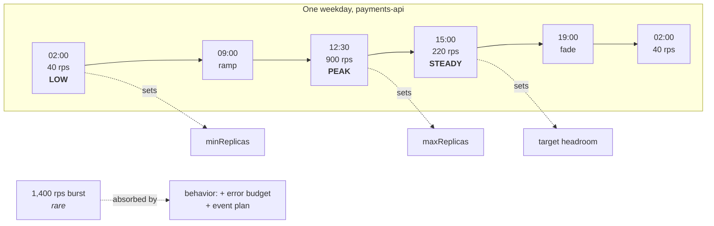

You are here if: you're staring at `minReplicas:` and `maxReplicas:` with no idea what to type; or your HPA's floor and ceiling were inherited from a template and nobody can defend them; or the platform team asked "how much capacity do you actually need?" and you'd like a real answer.

You can't pick a floor and a ceiling for a load you've never measured. Every team knows their app is "busier at lunch"; almost none can put a number on it — and `minReplicas`, `maxReplicas`, and every threshold *are* those numbers. This page is one measurement exercise: two weeks of data you already have, four numbers out, and every autoscaling knob derives from them.

The four numbers are your app's **states**. Each one below gets the full loop — what it means, the exact query to observe it, and the knob it decides.

## The states

### Steady state — what a normal busy hour asks of you

**Define.** The typical business-hours load: not the quietest moment, not the spike — the level your app spends most of its working day at. This is the load your HPA target must leave comfortable.

**Observe.** Start with the raw traffic curve — total requests per second for the service, graphed over at least 14 days so you see both the daily and the weekly cycle. In Prometheus (each label explained since this is the section's first big range query — `payments-api` again):

```promql
# Total RPS across all payments-api pods:
#  http_server_requests_seconds_count — Micrometer's request counter
#  rate(...[5m])  — per-second rate, smoothed over 5 minutes
#  sum(...)       — add up all pods, all endpoints: the service's total load
sum(rate(http_server_requests_seconds_count{namespace="payments", service="payments-api"}[5m]))
```

Graph that in Grafana with a 14-day range. Then the single most information-dense chart for this exercise: a **hour-of-day heatmap** — Grafana panel type "Heatmap", same query, which paints the whole daily/weekly shape at a glance (lunch ridge, overnight valley, weekend gap). Dynatrace shows the same curve under the service's *Multidimensional analysis* → requests over time.

To turn the curve into one number, take the median over business hours rather than eyeballing:

```promql
# The 50th percentile of the traffic level itself, over 14 days:
# "the RPS value that half of all measured moments were below" — steady state
quantile_over_time(0.50,
  sum(rate(http_server_requests_seconds_count{namespace="payments", service="payments-api"}[5m]))[14d:5m]
)
```

**Decide.** The HPA utilization target is set so that *steady state runs well below it* — steady state should never trigger scaling. If your target is 70% CPU and normal Tuesday afternoon already sits at 68%, the HPA will fidget all day.

### Low state — the trough

**Define.** The quietest sustained level: overnight, weekends. This is what `minReplicas` actually has to serve.

**Observe.** Same series, 5th percentile instead of the median:

```promql
quantile_over_time(0.05,
  sum(rate(http_server_requests_seconds_count{namespace="payments", service="payments-api"}[5m]))[14d:5m]
)
```

**Decide.** `minReplicas` = what the trough needs, floored by availability: never below 2 for anything users depend on, because one pod is [an outage with extra steps](/workloads/high-availability/). For consumers, a low state of ~0 messages/hour is the test for whether [scale-to-zero](/autoscaling/messaging-consumers/#scale-to-zero-honestly) is even on the table.

:::tip[Good citizen]
Holding steady-state replicas through the trough — `minReplicas: 6` because six "feels right," when the 3 a.m. traffic needs two — is reserved capacity nobody else can use, every night, forever. On a fixed shared cluster, the trough number *is* the honest number; the [quarterly true-up](/autoscaling/capacity-and-governance/) will ask about the gap.
:::

### Peak — the recurring high

**Define.** The load level your busiest *routine* period reaches — weekday lunch, Monday market-open. Recurring is the key word: peak is a pattern, not an event.

**Observe.** The trap here is using `max_over_time` — the literal maximum of 14 days is usually an incident, a retry storm, or a load test, and sizing to it means permanently reserving capacity for an artifact. Use the daily 99th percentile instead:

```promql
quantile_over_time(0.99,
  sum(rate(http_server_requests_seconds_count{namespace="payments", service="payments-api"}[5m]))[14d:5m]
)
```

The trade, stated: p99-over-time can shave a genuine-but-rare peak; `max_over_time` reliably captures garbage. Sizing to p99 and letting `behavior` policies plus error budget absorb the rare exceedance is the better bargain — see burst, next.

**Decide.** `maxReplicas` = peak, plus growth margin, divided by per-pod capacity — then capped by external ceilings:

```text
maxReplicas = ceil( peak_rps × (1 + growth_margin) / per_pod_capacity_rps )
              …capped by min(Oracle session math, MQ handle math, quota headroom)
```

The external caps are the reference-architecture pages' whole business ([Oracle](/autoscaling/rest-api-oracle/), [MQ](/autoscaling/messaging-consumers/), [Redis](/autoscaling/web-worker-and-caches/)).

### Burst — the rare exceptional spike

**Define.** The marketing push, the upstream backlog dump, the retry storm: rare, large, and *not* what you size for.

**Observe.** Eyeball the 14-day chart's outliers — and ask the business calendar, because the biggest bursts are scheduled by someone in another department.

**Decide.** You **size for peak and survive burst.** Burst is what the HPA's `behavior:` scale-up policies and your [error budget](/autoscaling/slos-for-scaling/) exist to absorb. If a specific burst is business-critical (the annual sale), the answer is a *pre-scaled event plan* — raise `minReplicas` the night before, on purpose, with a calendar entry to lower it — not a permanently higher ceiling:

| | Size for burst (bigger maxReplicas) | Plan for burst (event playbook) |
|---|---|---|
| You gain | Nothing to remember | Capacity reserved only when needed |
| You pay | Permanent claim on shared capacity + external connections for an event that happens twice a year | Someone must run the playbook (and un-run it) |

### Growth trend — when to redo this

**Define.** This quarter's steady state vs. last quarter's. It sets the growth margin in the peak math and the expiry date on this whole exercise.

**Observe.** Compare a recent week against the same week a quarter ago (offset does the time travel):

```promql
sum(rate(http_server_requests_seconds_count{namespace="payments", service="payments-api"}[5m]))
/
sum(rate(http_server_requests_seconds_count{namespace="payments", service="payments-api"}[5m] offset 13w))
```

**Decide.** A ratio of ~1.08 = +8%/quarter → use ~1.15 as a two-quarter growth margin in the maxReplicas math, and re-run this page's measurements quarterly (the [capacity true-up](/autoscaling/capacity-and-governance/) will demand it anyway).

## Consumers: same states, different series

For `dispatch-worker` and friends, profile **arrival rate** — messages enqueued per minute — not RPS. The states work identically, with one twist that surprises API-minded people: consumer peak is often *nocturnal*, because upstream batch systems dump their day's work at 1 a.m. `dispatch-worker`'s real profile: trough at 2 p.m. (~5 msg/min), peak at 01:30 (~900 msg/min for forty minutes). Its scaling day is inverted from the API's — which is exactly why each workload gets its own state table instead of inheriting the team's mental model of "busy."

Arrival rate lives broker-side: IBM MQ enqueue counts via the admin REST API, RabbitMQ's `messages_published_total` via its Prometheus plugin, or — once KEDA is polling the queue — [KEDA's exposed scaler metrics](/autoscaling/getting-the-metrics/). Depth alone isn't arrival rate: depth is arrival minus drain; profile the *inflow*.

## The state table — the artifact

Fourteen days of `payments-api` measurement, condensed to the thing you'll actually use (and attach to your [governance submission](/autoscaling/capacity-and-governance/)):

| State | Value | When | Sets |
|---|---|---|---|
| Low | 40 rps | 02:00–05:00 daily | minReplicas |
| Steady | 220 rps | business hours | target headroom check |
| Peak | 900 rps | weekday 12:00–13:30 | maxReplicas (pre-cap) |
| Burst | 1,400 rps | marketing push, ~2×/year | behavior policies + event plan |
| Growth | +8%/quarter | — | margin + re-measure date |

Now the derivation, end to end. One more input is needed: **per-pod capacity** — what one pod handles at acceptable latency. That's a *different* measurement (a load test, not a traffic query) and it lives in [the sizing walkthrough](/tuning/sizing-walkthrough/): this page measures what the world asks; that page measures what one pod supplies; the knob math needs both. Say `payments-api` measured 60 rps per pod at its latency knee:

```text
minReplicas  = ceil(40 / 60)  = 1 → floored to 2 by HA          → 2
target check : steady needs ceil(220/60) = 4 pods; at 4 pods,
               steady sits at 220/240 ≈ 92% of capacity — too hot.
               HPA target set so steady runs ~5 pods (≈73%)      → target ~70%
maxReplicas  = ceil(900 × 1.15 / 60) = ceil(17.25)              → 18 (pre-cap)
               …Oracle session math on the ref-arch page caps it → 16
```

Every number in the final HPA now has an ancestry: trough → floor, peak × growth → ceiling, steady × per-pod capacity → target. When someone in review asks "why 18?", the answer is a table, not a shrug.



## Measuring it wrong

| Mistake | What you get | The tell |
|---|---|---|
| Profiled an atypical week (holiday, freeze) | Every number wrong in the same direction | Compare against the same weeks last quarter before trusting |
| Measured *after* an HPA was already scaling | Per-pod load masquerading as total — the HPA flattens the curve you're trying to see | Use the `sum(...)` totals above, never per-pod rates, and note replica count during measurement |
| `max_over_time` for peak | Sized to your worst incident forever | Peak that's 10× steady usually isn't peak, it's a postmortem |
| Ignored the weekly cycle (measured 3 days) | Weekend-derived numbers fail Monday 09:00 | 14 days minimum, always |

## Drift alerts — when reality leaves your table

The state table is a snapshot; traffic grows, marketing happens. These alerts fire when reality departs the recorded profile — each one means "re-derive, before it's an incident":

```promql
# Traffic above recorded peak (900 rps) for 30m → the ceiling math is stale
sum(rate(http_server_requests_seconds_count{namespace="payments", service="payments-api"}[5m])) > 900
```

```promql
# Trough creeping up: overnight load exceeding the recorded low state by 50% —
# minReplicas is now dishonest in the other direction (too low)
quantile_over_time(0.05,
  sum(rate(http_server_requests_seconds_count{namespace="payments", service="payments-api"}[5m]))[7d:5m]
) > 60
```

```promql
# HPA pinned at minReplicas for a full week: it never engages.
# Either the floor is too high (give capacity back) or scaling wasn't needed.
max_over_time(kube_horizontalpodautoscaler_status_current_replicas{horizontalpodautoscaler="payments-api"}[7d])
== on() kube_horizontalpodautoscaler_spec_min_replicas{horizontalpodautoscaler="payments-api"}
```

```promql
# Time-at-max growing week over week → the capacity conversation is due
avg_over_time(
  (kube_horizontalpodautoscaler_status_current_replicas{horizontalpodautoscaler="payments-api"}
   >= bool on() kube_horizontalpodautoscaler_spec_max_replicas{horizontalpodautoscaler="payments-api"})[7d:]
) > 0.05
```

The [governance page's quarterly true-up](/autoscaling/capacity-and-governance/) consumes exactly this state table — these alerts are what make the quarterly cadence honest between true-ups.

## Where next

- **Next in the journey:** [The Numbers That Matter](/autoscaling/signals-catalog/) — the profile says how much; the catalog says which signal to watch.
- **The lateral jump:** have the state table and per-pod capacity already? Jump straight to [your archetype's reference architecture](/autoscaling/overview/#start-here-by-archetype) and do the derivation.
