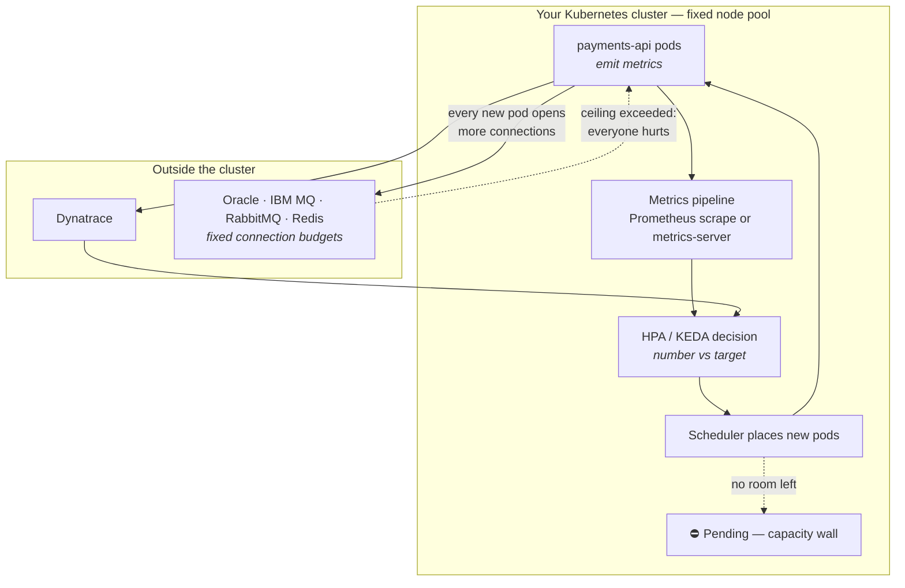

This section teaches you to autoscale your applications on *this* kind of platform: a fixed-size, on-prem Kubernetes cluster shared with other teams, running Spring Boot services that talk to Oracle, IBM MQ, RabbitMQ, and Redis — systems that live *outside* the cluster and have opinions about how many connections you open. If that sentence describes your week, you're in the right place.

**Find your way in.** Nobody reads a playbook cover to cover:

| You are… | Start at |
|---|---|
| Facing a specific problem ("my API dies at lunch") | [Start From Your Situation](/autoscaling/scenarios/) |
| Told to enable autoscaling by Friday | [The 15-Minute Conservative HPA](/autoscaling/quick-start/) |
| Wondering if your app is even ready | [The No-Assumptions Checklist](/autoscaling/prerequisites/) |
| Sizing up an app or an inherited Helm chart | [Rationalize the App and the Chart](/autoscaling/classify-your-app/) |
| Reviewing another team's HPA PR | [The review checklist](/autoscaling/capacity-and-governance/) |
| Mid-incident, HPA misbehaving right now | [HPA Not Scaling](/troubleshooting/hpa-not-scaling/) — the incident runbook |
| Just here for the tables and formulas | [Autoscaling on One Page](/autoscaling/cheat-sheet/) |

Everyone else: read on. This page explains autoscaling from zero and maps the rest.

## What autoscaling actually is

Strip away the YAML and it's this: **a controller watches one number about your app, and when that number crosses a line you drew, it adds or removes identical copies of your pod** — never fewer than a floor you set, never more than a ceiling.

The controller is usually the **HorizontalPodAutoscaler (HPA)** — a control loop built into Kubernetes that re-checks its number every 15 seconds or so. Sometimes it's **KEDA**, an add-on that watches numbers Kubernetes can't see natively (like the depth of an IBM MQ queue) and drives an HPA for you — *when the platform has installed it*, which this section never assumes: the plain HPA can reach the same numbers through a metrics adapter, and every recipe here is built both ways ([the fork](/autoscaling/getting-the-metrics/#5-the-fork-adapter-or-keda) is where you find out which ask to make). Either way, you make exactly three decisions:

1. **The number** — which measurement should trigger scaling? CPU? Requests per second? Queue depth? Busy threads? This choice matters more than everything else combined, and most teams get it wrong by defaulting to CPU. [The Numbers That Matter](/autoscaling/signals-catalog/) is the full catalog.
2. **The line** — at what value of that number should copies be added? Deriving this from what you promised your users — instead of guessing — is [Start With the User](/autoscaling/slos-for-scaling/).
3. **The floor and the ceiling** — `minReplicas` and `maxReplicas`. These come from your measured traffic pattern and your dependencies' limits, not from vibes. [Know Your Traffic](/autoscaling/load-profile/) shows how to measure them.

The mechanics of the HPA itself — the arithmetic, the metric types, the `behavior` block — live in [Autoscaling](/workloads/autoscaling/) and aren't repeated here; its *dynamics* — why an undersized request makes the loop thrash, and how long scale-up actually takes (metrics lag + startup + node provisioning, rarely under a minute) — are worked out with numbers in [Scaling Dynamics](/autoscaling/scaling-dynamics/). This section is about making the three decisions well, for your stack, on your cluster.

## Why it's harder here than in the tutorial

Every cloud autoscaling tutorial carries two silent assumptions: the cluster grows when you need more nodes, and your dependencies scale with you. Neither is true for you.

**The cluster has 12 nodes and will have 12 nodes next quarter too.** There is no cluster autoscaler ordering hardware. When your HPA asks for pods that don't fit, they sit `Pending` — and when *every* team's HPA asks at once (lunch rush is everyone's lunch rush), the sum of everyone's ceilings meets the fixed pool. On this platform, autoscaling is not an infinite-elasticity feature; it's **a shared budget you're drawing against**. That has a governance answer, not a YAML answer: [Capacity, Quotas, and Rolling Autoscaling Out to Teams](/autoscaling/capacity-and-governance/).

**Your dependencies live outside the cluster and don't autoscale.** Oracle grants your service account a fixed session budget. The MQ queue manager caps open handles. The shared Redis cluster has a `maxclients`. Every pod the HPA adds opens more connections against those fixed budgets — so more copies of you means more load on systems other teams also depend on. Every reference architecture in this section derives its `maxReplicas` from an external ceiling, because on this stack the ceiling is never "what the cluster can run."

Here's the whole feedback loop, with the two walls drawn in:

Each arrow in that loop is a page: the metrics pipeline is [How the Numbers Reach the Autoscaler](/autoscaling/getting-the-metrics/), the Dynatrace path is [Dynatrace as a Scaling Signal](/autoscaling/dynatrace-signals/), the decision is [The Numbers That Matter](/autoscaling/signals-catalog/), the external-ceiling arrows are the three reference architectures, and both walls are [Capacity and Governance](/autoscaling/capacity-and-governance/).

## The maturity ladder

You do not need all of this at once. Each level is a fine place to stop and live for a quarter:

| Level | What it looks like | You are here if… | The pages |
|---|---|---|---|
| **0 — Fixed replicas** | `replicas: 3`, sized on a guess | Every team starts here; nothing is wrong yet | — |
| **1 — Conservative CPU HPA** | Floor at today's count, modest ceiling, CPU target | You need *something* safe this week | [Quick start](/autoscaling/quick-start/) |
| **2 — The right signal, measured targets** | Signal chosen for how your app actually saturates; targets derived from an SLO (or a labeled proxy) and a measured load profile | Your L1 HPA "works" but scales too late or for the wrong reason | [SLOs](/autoscaling/slos-for-scaling/), [Load profile](/autoscaling/load-profile/), [Signals](/autoscaling/signals-catalog/), [Pipeline](/autoscaling/getting-the-metrics/), [Spring Boot](/autoscaling/spring-boot-scaling/) |
| **3 — Event-driven, ceiling-aware** | Queue depth driving consumer count (KEDA or an exporter-fed HPA — whichever mechanism the platform granted); every maxReplicas derived from an external limit with the math written down | You run consumers, or you've met ORA-00018 | [Oracle API](/autoscaling/rest-api-oracle/), [MQ consumers](/autoscaling/messaging-consumers/), [Web + worker](/autoscaling/web-worker-and-caches/) |
| **4 — Governed capacity** | Quotas, priority tiers, a capacity ledger, autoscaling changes reviewed against a checklist | You're the SRE rolling this out to five teams | [Capacity & governance](/autoscaling/capacity-and-governance/) |

The next step is always one level up, never a leap to the top.

## The four questions before any HPA

Every page in this section is ultimately serving one of these. Ask them in order, for every workload:

1. **What did you promise users** — or what would they say if you asked? Not "CPU below 70%"; something a human would recognize: "checkout feels instant," "the order confirmation arrives within minutes." If you can't answer, there's a fallback path — but the question comes first. → [Start With the User](/autoscaling/slos-for-scaling/)
2. **Which number tracks that promise early?** The signal that rises *before* the promise breaks, not the symptom that appears after. → [The Numbers That Matter](/autoscaling/signals-catalog/)
3. **What ceiling does your slowest dependency impose?** Oracle sessions, MQ handles, Redis clients — the smallest one is your real `maxReplicas`. → the [reference](/autoscaling/rest-api-oracle/) [architecture](/autoscaling/messaging-consumers/) [pages](/autoscaling/web-worker-and-caches/)
4. **Whose capacity are you spending?** Your ceiling is a claim on a shared, fixed pool. Someone keeps that ledger. → [Capacity and Governance](/autoscaling/capacity-and-governance/)

## The citizenship contract

One idea underpins the whole section, so it's stated once, here:

**Requests are reservations, not usage.** When your pod declares `requests: {cpu: 500m, memory: 1Gi}`, the scheduler carves that slice out of a node *whether you use it or not* — capacity your neighbors can no longer schedule into. On a cloud cluster, padding your requests "to be safe" costs your company money. On this cluster, it costs *other teams their headroom*, invisibly.

Autoscaling multiplies this. An HPA that can scale to 20 replicas turns your requests into `20 × requests` of claimable reservation — that product is the number the platform's capacity ledger tracks. Honest, measured requests times more replicas is a fair claim; padded requests times more replicas is hoarding at scale. So the contract is: **request what you measured plus a margin you can justify, keep `minReplicas` at what the quiet hours need (not what feels comfortable), and give reservations back when the numbers say you're not using them.** The measurement method is in [the sizing walkthrough](/tuning/sizing-walkthrough/); the enforcement — quotas, the ledger, the quarterly true-up — is in [Capacity and Governance](/autoscaling/capacity-and-governance/).

## Who owns what

The recurring boundary table, at section level. Details vary per page, but the shape never does:

| Concern | PLATFORM team | YOU (the delivery team) |
|---|---|---|
| metrics-server, Prometheus stack, the external-metrics mechanism (prometheus-adapter or KEDA) | ✔ installs and operates | ask, don't install |
| Node capacity, quotas, priority classes | ✔ sets the budget | request and justify |
| Egress/firewall rules to Oracle/MQ/Redis | ✔ opens the path | name what you need |
| Resource requests/limits on your pods | | ✔ measured, honest |
| The HPA/ScaledObject in your Helm chart | | ✔ yours, reviewed |
| Signal choice, targets, floor/ceiling math | | ✔ with derivations written down |
| Load-testing before prod | | ✔ non-negotiable |
| Graceful shutdown and idempotency | | ✔ scaling multiplies both |

If a checklist item in this section fails on the left column, that's a named ask to the platform team — [Working With the Platform Team](/operations/working-with-platform-team/) covers how to make it well.

:::note[Where's VPA?]
The Vertical Pod Autoscaler resizes *requests* instead of adding copies. In this shop it earns its keep only in recommendation mode — a free sizing consultant, not a scaler. It gets a section in [Autoscaling](/workloads/autoscaling/) and a supporting role in [brownfield resource sizing](/tuning/brownfield-resources/); it does not get a page here, because it isn't how you handle load.
:::

## Start here by archetype

If you already know what kind of workload you have (if not: [classify it](/autoscaling/classify-your-app/)):

| Your workload | The reference architecture |
|---|---|
| REST API in front of Oracle | [REST API in Front of an External Oracle](/autoscaling/rest-api-oracle/) |
| IBM MQ or RabbitMQ listener | [Messaging Consumers](/autoscaling/messaging-consumers/) |
| Web app + background worker sharing caches | [Web + Worker, Valkey, External Redis](/autoscaling/web-worker-and-caches/) |

And when you want to *feel* all of this on a laptop instead of reading about it — an HPA scaling under real load, then a queue-depth HPA draining a backlog through a full metrics pipeline — [Lab 10](/labs/lab-10-autoscaling/) builds it on the labs cluster, every command runnable as-is.

## Where next

- **Next in the journey:** [Before You Autoscale: The No-Assumptions Checklist](/autoscaling/prerequisites/) — prove the ground is solid before building on it.
- **The lateral jump:** if a specific pain brought you here, [Start From Your Situation](/autoscaling/scenarios/) routes you straight to it.
