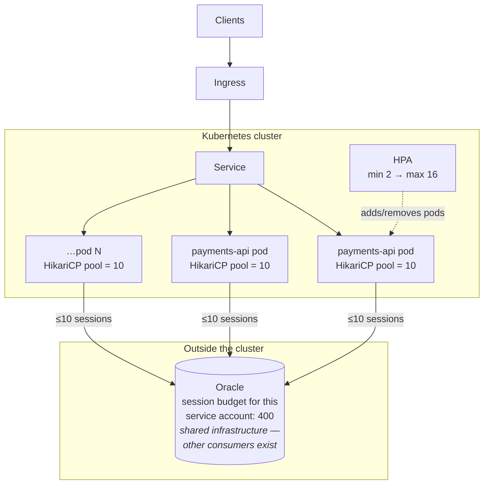

You are here if: your workload is a request/response API whose database is an Oracle instance *outside* the cluster; or you just met ORA-00018 at the worst possible time; or a reviewer asked where your maxReplicas number came from.

**What you'll have at the end:** an HPA for a Spring Boot API whose every number has a written derivation — a floor from your measured trough, a target from your SLO, and a ceiling from arithmetic agreed with your DBA — plus the alerts that tell you when any of those derivations goes stale.

Kubernetes will happily give you 20 pods. The Oracle DBA will not happily give you 20 × `maximumPoolSize` sessions — and that database serves other teams, batch jobs, and the reporting suite, all of whom experience *your* scale-out as *their* mystery outage. On this architecture, the autoscaler's ceiling is not a Kubernetes number at all. It's a promise to a database.

## The architecture



Every pod the HPA adds opens up to `maximumPoolSize` sessions against a budget that does not scale. The invariant that keeps everyone employed:

```text
maxReplicas × maximumPoolSize ≤ your session budget − failover headroom
```

## The pool math

A **connection pool** (HikariCP is Spring Boot's default) keeps a fixed set of database connections open and lends them to request threads — because opening an Oracle session per request would be brutally slow. Each pool holds up to `maximumPoolSize` sessions; each *pod* has its own pool. So sessions scale linearly with replicas, and somebody has to do this arithmetic *before* the HPA does it experimentally at lunch:

```text
Given:   session budget for payments-api's service account = 400   (from the DBA)
         maximumPoolSize = 10                                       (your application.yaml)
         failover headroom = 1 node's worth of pods restarting ≈ 4 pods' pools = 40
                             (during a node failure, replacement pods open NEW pools
                              before the dead ones' sessions time out — briefly, both exist)

Ceiling: (400 − 40) / 10 = 36 pods, theoretical
Reality: the budget is shared with payments-batch (fixed 8 × 10 = 80)
         and the reporting user (~120 at month-end)
         → (400 − 40 − 80 − 120) / 10 = 16 pods

maxReplicas: 16 — and the derivation goes in the values file, not a wiki nobody reads
```

In plain words: the ceiling is not what the cluster can run — it's what the database agreed to. Exceed it and Oracle refuses new sessions (`ORA-00018: maximum number of sessions exceeded`) — *for everyone on that budget*, not just the pod that tipped it. Your scale-out becomes the batch team's outage. The general derivation method (measure the knee, then Phase 3's HPA layer) is [the sizing walkthrough](/tuning/sizing-walkthrough/); this is its Oracle-specific instantiation.

Getting *to* the database — the Service/Endpoints or ExternalName wiring for something outside the cluster — is [external database](/architectures/external-database/) territory; egress and firewall are a PLATFORM row below.

## Signal and target, derived

From [the cast SLO table](/autoscaling/slos-for-scaling/#the-casts-slos): `payments-api` promises **99.9% of requests < 800 ms over 28 days**. The derivation chain, step by step:

1. **Load-test one pod** ([Lab 8's fortio pattern](/labs/lab-8-deploy-under-load/) or k6 in pre-prod), ramping until p95 approaches 800 ms. Say the knee lands at **60 rps/pod**, where CPU reads ~80% of the 250m request and busy threads ~85%.
2. **Choose the primary signal.** The knee test tells you *which* number saturated first. If CPU tracked the knee → CPU HPA (below). If threads hit 85% while CPU coasted at 40% → you're wait-bound; scale on the [busy-thread ratio via KEDA](/autoscaling/getting-the-metrics/#5-the-fork-adapter-or-keda) instead, same floor/ceiling. `payments-api` measured CPU-correlated, so CPU it is.
3. **Set the target below the knee's reading, with lag headroom.** The knee showed 80% CPU at the SLO boundary. During the [~90 s reaction-plus-warmup lag](/autoscaling/spring-boot-scaling/#the-warmup-timeline), lunch traffic grows ~15%. Target = 80% − ~15 points ≈ **65%** — so scaling starts early enough that the SLO survives the lag. The trade: a lower target runs more idle capacity at steady state ([citizenship](/autoscaling/overview/#the-citizenship-contract) — don't overshoot the margin); a higher one spends error budget on every ramp.
4. **Floor and ceiling from [the state table](/autoscaling/load-profile/#the-state-table--the-artifact):** trough 40 rps → 1 pod, floored to **2** by [HA](/workloads/high-availability/); peak 900 × 1.15 growth ÷ 60 = 18 pre-cap, **capped to 16 by the pool math**. The Oracle ceiling wins — it usually does.

## The build

Everything below ships in the chart ([audit items 1–5](/autoscaling/classify-your-app/#part-3--is-the-chart-ready)). Deployment fragment — resources and probes are load-bearing for scaling:

```yaml
# templates/deployment.yaml (fragment)
spec:
  {{- if not .Values.autoscaling.enabled }}
  replicas: {{ .Values.replicaCount }}     # HPA owns the count when enabled — no tug-of-war
  {{- end }}
  template:
    spec:
      terminationGracePeriodSeconds: 40    # in-flight requests + pool drain on scale-in
      containers:
        - name: payments-api
          resources:
            requests:
              cpu: 250m                    # MEASURED (sizing walkthrough) — the HPA's
              memory: 512Mi                # percentage math is built on this number
            limits:
              memory: 768Mi                # heap 60% + non-heap budget (JVM page's split)
          lifecycle:
            preStop:
              exec:
                command: ["sh", "-c", "sleep 5"]   # let endpoint removal propagate before
                                                    # SIGTERM — the zero-downtime handshake
          # probes: the startup/readiness/liveness block from the Spring Boot page
```

The HPA, every knob with its ancestry:

```yaml
# templates/hpa.yaml
{{- if .Values.autoscaling.enabled }}
apiVersion: autoscaling/v2
kind: HorizontalPodAutoscaler
metadata:
  name: {{ include "payments-api.fullname" . }}
spec:
  scaleTargetRef:
    apiVersion: apps/v1
    kind: Deployment
    name: {{ include "payments-api.fullname" . }}   # same helper as the Deployment —
                                                     # a rename can't strand the HPA
  minReplicas: {{ .Values.autoscaling.minReplicas }}
  maxReplicas: {{ .Values.autoscaling.maxReplicas }}
  metrics:
    - type: Resource
      resource:
        name: cpu
        target:
          type: Utilization
          averageUtilization: {{ .Values.autoscaling.targetCPU }}
  behavior:                       # the JVM-tuned block, verbatim from the Spring Boot page
    scaleUp:
      stabilizationWindowSeconds: 0
      policies:
        - type: Pods
          value: 2
          periodSeconds: 60
    scaleDown:
      stabilizationWindowSeconds: 300
      policies:
        - type: Pods
          value: 1
          periodSeconds: 120
{{- end }}
```

The values file — where the derivations live so review can check math instead of vibes:

```yaml
# values.yaml
autoscaling:
  enabled: true
  minReplicas: 2      # derivation: trough 40rps ÷ 60rps/pod = 1, floored to 2 (HA).
                      #   state table 2026-06-14, /autoscaling/load-profile/
  maxReplicas: 16     # derivation: min( peak 900×1.15 ÷ 60 = 18,
                      #   Oracle (400−40−80−120)÷10 = 16 ) → 16.
                      #   session budget: DBA ticket DB-4821, 2026-06-02
  targetCPU: 65       # derivation: knee 80% @ p95→800ms (SLO 99.9%<800ms/28d),
                      #   minus ~15pt lag headroom. Load test run 2026-06-10.
```

And the pool side of the contract:

```yaml
# application.yaml
spring:
  datasource:
    hikari:
      maximum-pool-size: 10   # THE OTHER HALF OF maxReplicas. Raising this without
                              # re-running the ceiling math is how ORA-00018 happens.
      minimum-idle: 10        # fixed-size pool: fail at startup, not at peak. The trade:
                              # idle sessions held at trough vs no pool-growth latency
                              # exactly when load arrives. For a hard-budget Oracle, fixed wins.
      connection-timeout: 3000  # threads queue max 3s for a connection, then error —
                                # fail fast beats thread-pile-up when the budget is hit
```

:::tip[maxReplicas is a contract, not a wish]
The number is only as good as its derivation comment. Reviewers ([the checklist](/autoscaling/capacity-and-governance/)) check the math and its date, not the number. And the contract runs both ways: nobody raises `maximum-pool-size` *or* `maxReplicas` without re-running the arithmetic and telling the DBA — either change alone silently rewrites the other's ceiling.
:::

## Scale-in for connection-heavy apps

Scale-in is where connection-heavy apps leak trouble: kill a pod gracelessly and its 10 sessions linger until Oracle's dead-connection detection reaps them — scale in 6 pods after lunch and 60 zombie sessions squat your budget just as batch spins up. The graceful path — preStop delay, then Spring's graceful shutdown draining requests, then the pool closing its sessions cleanly inside `terminationGracePeriodSeconds` — is exactly the [graceful shutdown](/workloads/graceful-shutdown/) + [rollout/shutdown knobs](/tuning/rollout-shutdown-knobs/) story, which scale-in simply runs several times a day instead of at deploys. The behavior block's `1 pod per 120s` scale-down has a bonus here: sessions release in ripples, not a wave.

## Who owns what

| Concern | Owner |
|---|---|
| The session budget (and warning when *others'* usage grows) | DBA |
| Egress/firewall path to Oracle, cluster capacity, quota | PLATFORM |
| `maximum-pool-size`, the ceiling math, the derivation comments | YOU |
| Telling the DBA *before* raising pool or maxReplicas | YOU |
| Load test proving the knee, honest requests | YOU |

## Failure modes

| Symptom | What happened | Where |
|---|---|---|
| `ORA-00018` across several apps at lunch | someone's scale-out blew the shared budget | the pool math, above |
| Latency SLO breaching, HPA at max, CPU low | wait-bound app scaled on CPU — wrong signal | step 2; [signals](/autoscaling/signals-catalog/) |
| `hikaricp_connections_pending` high, threads fine | pool per pod too small, or Oracle itself slow | pool sizing vs [performance analysis](/observability/performance-analysis/) |
| Zombie sessions after scale-in | graceless shutdown | scale-in section |
| HPA `<unknown>` after a chart refactor | Deployment renamed away from the HPA's target | naming helper; [runbook](/troubleshooting/hpa-not-scaling/) |

## Alerts

```promql
# Threads queueing for connections: "pods or pool" — decide with the thread signal
# (threads saturated too → pods; threads fine → pool/Oracle)
max by (pod) (hikaricp_connections_pending{namespace="payments", pod=~"payments-api.*"}) > 0
```

```promql
# At the ceiling for 30m: the ceiling is load-bearing. Renegotiate capacity with
# the DBA or revisit the state table — do NOT silently lift the number
(kube_horizontalpodautoscaler_status_current_replicas{horizontalpodautoscaler="payments-api"}
 >= on() kube_horizontalpodautoscaler_spec_max_replicas{horizontalpodautoscaler="payments-api"})
```

```promql
# Session consumption approaching budget (if the DBA exports session metrics —
# worth asking for): alert at 85% of the 400-session budget
oracle_sessions_active{service_account="payments_api"} > 340
```

## Take this with you

The consolidated starter kit — values, HPA, pool config from this page in one copyable block, comments intact — is what you adapt, *after* replacing every derivation comment with your own numbers. If you copy the numbers themselves, you've copied another team's database.

```yaml
# ── values.yaml ──
autoscaling:
  enabled: true
  minReplicas: 2      # derivation: <your trough ÷ your per-pod capacity, HA floor>
  maxReplicas: 16     # derivation: min(<peak math>, <(budget − headroom − others) ÷ pool>)
  targetCPU: 65       # derivation: <knee at SLO boundary − lag headroom>
# ── application.yaml ──
spring:
  datasource:
    hikari:
      maximum-pool-size: 10   # partner number to maxReplicas — change only together
      minimum-idle: 10
      connection-timeout: 3000
# ── plus templates/hpa.yaml and the deployment fragment above, verbatim ──
```

## Where next

- **Next in the journey:** [IBM MQ and RabbitMQ Consumers](/autoscaling/messaging-consumers/) — the same ceiling discipline, different signal, plus the scale-in problem APIs don't have.
- **The lateral jump:** HPA at max and users still hurting *right now*? [The runbook](/troubleshooting/hpa-not-scaling/), then the capacity conversation in [governance](/autoscaling/capacity-and-governance/).
