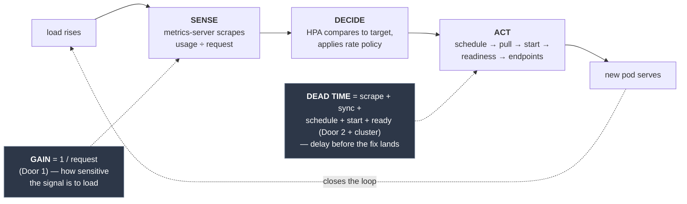
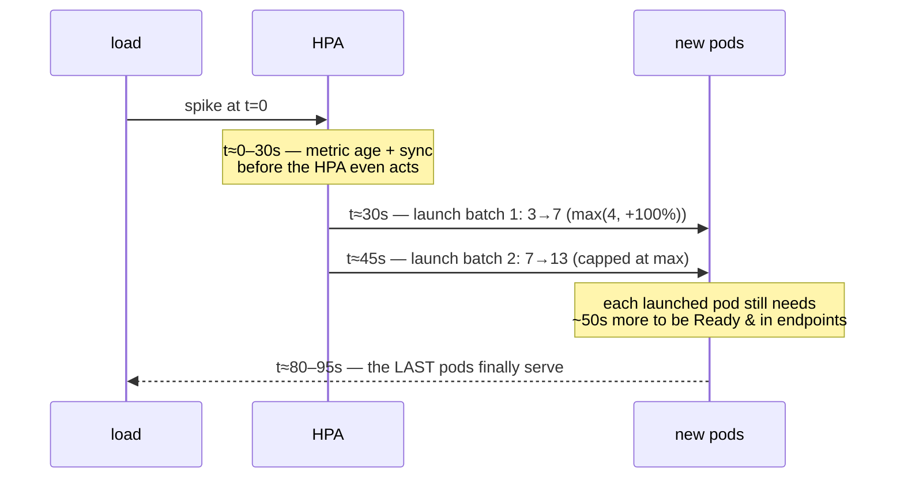

The Horizontal Pod Autoscaler looks like magic: CPU crosses a line, pods appear. But it is not magic, it is a **control loop**, and every control loop that has ever existed has two physical properties that decide whether it behaves or misbehaves. **Gain** — how hard it reacts to an error. And **dead time** — how long between sensing an error and the correction actually taking effect. Get the gain too high and the loop *oscillates*: the replica thrash you've watched in `kubectl get hpa`. Ignore the dead time and you'll believe scaling is instant, then get paged when a spike hurts for two minutes before the new pods show up.

This page makes both quantitative. It is the deep annex to **Door 3 — Response** of [The Three Doors](/start/three-doors/), and the thing that makes Door 3 more than "turn on the HPA": the loop's gain is set behind Door 1 (your request) and its dead time is set behind Door 2 (startup and readiness) plus the cluster's provisioning physics. Scaling is where all three doors are revealed to be one loop — with a clock.

## The loop and its two dials you never set directly

The HPA's core is one line ([kubernetes.io: algorithm](https://kubernetes.io/docs/tasks/run-application/horizontal-pod-autoscale/#algorithm-details)):

```text
desiredReplicas = ceil( currentReplicas × (currentMetric / targetMetric) )
```

For the default CPU metric, `currentMetric` is utilization = **actual usage ÷ requested CPU**, summed across pods. That division is the whole game, because it means you never set the loop's two dials with a field called `gain` or `deadTime` — you set them sideways:



- **Gain is `1 / request`.** Utilization = usage/request, so a *smaller* request makes the reported signal swing *harder* for the same real change in load. Halve the request and you double the loop's gain. You set this behind [Door 1](/workloads/resources-and-qos/) without ever thinking of it as a control gain.
- **Dead time is the scale-up latency budget** — everything between "load changed" and "a new pod is taking traffic." You set this behind [Door 2](/workloads/health-checks/) (startup and readiness timing) and inherit the rest from the cluster (metrics delay, scheduling, image pull, node provisioning).

Every pathology below is one of these two dials set wrong. Let's do each with numbers.

## Anatomy of a thrash: the missized request (gain too high)

This is the failure you asked about — the reservation that's too small, the autoscaler that overshoots, then rescales. It is worth walking with arithmetic because it proves the loop coupling: **a Door 1 mistake surfaces as a Door 3 symptom.**

Setup: a web pod that truly uses **~300m** of CPU under normal load. The HPA targets **70%** utilization, `minReplicas: 3`, `maxReplicas: 30`. Someone sets `requests.cpu: 100m` — three times too small.

The HPA never measures "load." It measures usage ÷ request:

```text
utilization = 300m / 100m = 300%
desiredReplicas = ceil( 3 × 300 / 70 ) = ceil(12.85) = 13
```

From 3 pods it drives toward **13**. Now compare the honestly-sized world: with `requests.cpu: 300m`, utilization at 3 pods reads 300/300 = 100%, and `ceil(3 × 100/70) = 5`. **The same workload needs 5 pods; the missized one provisions 13.** You are running 2.6× the fleet you need, and not one pod of that waste came from a scaling bug. It came from the request. The [autoscaling prerequisites](/autoscaling/prerequisites/) call correct requests a precondition for exactly this reason.

Then the **rescale-and-hunt**, which is the deep part. Because utilization = usage/request, a request 3× too small makes the reported signal **3× more sensitive** to every wobble in real usage. A 30m blip that should read as 10% of a 300m request instead reads as 30% of a 100m request. You have cranked the loop gain until it rings: it overshoots up, the per-pod headroom is now enormous, so a small traffic dip drops utilization under target, it scales down, load concentrates, it scales back up. That is oscillation, and its root cause is gain, not "a flaky HPA."

Most clusters *mask* this with damping — the default **scale-down stabilization window is 300s** (the HPA takes the maximum desired replica count over the trailing 5 minutes before it shrinks) and a **10% tolerance** deadband around the target. But damping hides the symptom; it does not remove the cause. **Fix the gain — right-size the request — and the thrash disappears. Tune the stabilization window and you have only muffled a loop that is still mis-gained.** That distinction is the whole lesson: sizing is a control decision, not a cost footnote.

:::note[Why this is a CPU story, not a memory story]
You rarely autoscale on memory, and this is why: memory is [incompressible](/foundations/virtual-memory/) and doesn't fall when you add replicas — a leaking pod at 90% stays at 90% no matter how many siblings you spawn. So a missized *memory* request fails the other way — [OOMKilled](/troubleshooting/oomkilled/) or silent waste — not thrash. The gain/dead-time model here is about compressible, load-proportional signals: CPU, RPS, queue depth. That asymmetry is Door 1's spine.
:::

## How long does scale-up actually take? (the dead time)

Here is the part everyone underestimates: **capacity does not arrive when the HPA decides — it arrives one full latency budget later.** Walk the stages from "load spikes" to "the new pod serves a request":

| Stage | What happens | Typical (warm node) | Typical (cold — needs a node) | The knob |
|---|---|---|---|---|
| Metric age | metrics-server scrapes usage every ~15s; the number the HPA reads is already up to ~15s stale | 0–15s | 0–15s | `--metric-resolution`; custom/Prometheus metrics add their scrape interval (30–60s) |
| HPA sync | the controller re-evaluates every 15s | 0–15s | 0–15s | `--horizontal-pod-autoscaler-sync-period` |
| Decision | compare to target; 10% tolerance deadband; scale-up stabilization (default **0s**) | ~0s | ~0s | `behavior.scaleUp.stabilizationWindowSeconds` |
| Rate policy | scale-up capped at **max(4 pods, +100%) per 15s** | staggers large jumps | staggers large jumps | `behavior.scaleUp.policies` |
| Schedule | scheduler binds the pod to a node | <1s | <1s (once a node exists) | requests/affinity/taints |
| **Node provision** | if no node fits: Cluster Autoscaler adds one, VM boots, joins, Ready | **0s (fits)** | **60–300s+** | Cluster Autoscaler; on-prem fixed capacity → [Pending](/troubleshooting/pod-pending/) |
| Image pull | cached on the node = instant; cold = size ÷ bandwidth | ~0s | 5–120s | image size, registry, `imagePullPolicy` |
| App startup | process start + runtime/framework warmup (JVM/Spring is the classic tax) | 10–60s | 10–60s | your app; [startup probe](/workloads/health-checks/) |
| Readiness | readiness probe must pass before endpoints include the pod | ~`initialDelay + period` (10–20s) | 10–20s | `readinessProbe` timing |
| Endpoint propagation | EndpointSlice + kube-proxy program the new backend; eventually consistent | 1–10s | 1–10s | — |

The end-to-end formula:

```text
T_scaleup ≈ T_metric_age + T_sync            (react: sense → decide)
          + T_schedule + T_nodeProvision      (place)
          + T_imagePull + T_startup + T_ready + T_endpoint   (become live)
```

**Worked number, warm node, cached image, a Java service:** react ≈ 15–30s, schedule <1s, pull 0s, startup ≈ 30s, readiness ≈ 15s, endpoint ≈ 5s → **≈ 65–80 seconds** from spike to first new pod serving. **Cold — the spike needs a new node:** add 60–300s of provisioning → **two to six minutes.** And on fixed on-prem capacity with no node to add, the answer is *never* — the pod sits [Pending](/troubleshooting/pod-pending/) until something frees up, which is why [capacity governance](/autoscaling/capacity-and-governance/) tracks the ceiling.

Now layer the **rate policy** onto our thrash example. Going 3 → 13 doesn't happen in one step; the default scale-up policy allows `max(4 pods, +100%)` per 15s:



So even the "instant" warm case takes **~30s of policy stepping** plus **~50s per-pod provisioning** — the thirteenth pod is not carrying traffic until roughly **90 seconds** after the spike. That is the proof of "it's not immediate."

The asymmetry is deliberate and worth internalizing: **scale-up is eager (0s stabilization) but capacity *arrival* is physically slow; scale-down is lazy (300s stabilization) on purpose**, so the loop doesn't discard pods it's about to need again. The HPA is a slow-moving trend follower, not a spike responder.

### The conclusion the math forces: you cannot autoscale a spike

Because capacity arrives a full dead-time budget late, **any spike shorter than T_scaleup is served by existing headroom or it is dropped** — the HPA is still counting to fifteen while your p99 burns. This is why an HPA is not a substitute for a **floor**. Size `minReplicas` to absorb the worst spike that can land *within your dead-time window*, using your measured [load profile](/autoscaling/load-profile/) and [SLOs](/autoscaling/slos-for-scaling/). The HPA then handles the sustained trend on top of that floor. Autoscaling manages the tide; headroom manages the waves.

## Why gain and dead time interact (the control-theory heart)

The two dials are not independent — and this is the insight that ties the whole page together. A universal result of control theory: **a loop with dead time L and gain K oscillates once K·L crosses a threshold.** The longer the delay before your correction lands, the *lower* the gain you can run before the loop rings. Translated:

**A slow-starting app (big dead time) is punished far more harshly by an undersized request (high gain).** By the time the over-eager scale-up finally lands 90 seconds later, the situation it was reacting to is long gone — so it overshoots, then over-corrects on stale information, then hunts. The Java service with a 45-second warmup and a 3×-too-small request is the textbook oscillator: maximum gain meeting maximum delay.

You cannot tune your way out of physics. There are exactly three levers, and healthy autoscaling uses all three:

1. **Lower the gain** — right-size the request so utilization tracks real load, not noise (the measurement section below).
2. **Shrink the dead time** — faster startup, cached/smaller images, and a warm node pool or pre-provisioned headroom so node provisioning isn't on the critical path (on a fixed on-prem pool that means keeping spare room in the pool, since there's no cluster autoscaler to conjure a node), plus tighter (but honest) readiness timing.
3. **Add headroom** — a floor (`minReplicas`) so you don't depend on the loop for anything faster than its dead time.

## How to measure — so you set both dials on purpose

You don't guess either dial. You measure them.

**Measuring the gain (the request).** Observe actual usage under representative load and set the request from a percentile, so utilization is meaningful and the pod usually fits its reservation:

```promql
# CPU: set request near the P90 of real usage under normal load
quantile_over_time(0.90, rate(container_cpu_usage_seconds_total{pod=~"my-app.*"}[5m])[1d:])

# Memory: set request == limit near P99/peak of WORKING SET (not RSS, not cache)
quantile_over_time(0.99, container_memory_working_set_bytes{pod=~"my-app.*"}[1d:])
```

Working set, not RSS, because working set (`memory.current` minus reclaimable cache) is what the [OOM killer actually judges](/foundations/virtual-memory/). Then **verify** you sized it right: throttling should be near zero —

```promql
rate(container_cpu_cfs_throttled_periods_total{pod=~"my-app.*"}[5m])   # want ≈ 0
```

— a nonzero, sustained value means the request (or a CPU limit) is too tight and you're [throttled](/troubleshooting/its-slow/), which the [CFS deep dive](/foundations/cpu-scheduling-and-cfs/) explains. If you'd rather not hand-roll it, run **VPA in recommender-only mode** (`updateMode: "Off"`) and read its `target`/`lowerBound`/`upperBound` off the history. The full sizing workflow is [Sizing Walkthrough](/tuning/sizing-walkthrough/) and [Requests & Limits Knobs](/tuning/requests-limits-knobs/); the query toolkit is [PromQL for Resources](/observability/promql-for-resources/).

**Measuring the dead time.** Stop guessing and stopwatch it. Deploy one pod and read the event timeline — the gaps between these events *are* your latency budget, stage by stage:

```bash
kubectl describe pod my-app-xxxx | grep -A12 Events
# Scheduled → Pulling → Pulled → Created → Started → (Ready via probes)
# ... the deltas between timestamps are T_schedule, T_imagePull, T_startup, T_ready
```

Then watch the loop itself respond under a load test — the HPA records its own decisions with timestamps:

```bash
kubectl describe hpa my-app | grep -A8 Events   # SuccessfulRescale events, with times
kubectl get hpa my-app --watch                  # watch desired vs current diverge and reconverge
```

Time from your synthetic spike to `SuccessfulRescale` is your react latency; time to the last pod `Ready` is your provisioning latency. Add them, compare to the fastest spike in your [load profile](/autoscaling/load-profile/), and size `minReplicas` to cover the gap. That measured number — not a copied default — is your floor.

## The summary you can act on

| Dial | Symptom when wrong | Root cause | Fix | Measure it with |
|---|---|---|---|---|
| **Gain too high** | Replica thrash; overshoot then hunt; over-provisioned fleet | Request set too small → utilization over-sensitive | Right-size the request to P90 of real usage | `container_cpu_usage_seconds_total` percentiles; VPA recommender |
| **Gain too low** | HPA never scales; pods saturate while HPA reports "headroom" | Request set too large → utilization reads artificially low | Right-size *down*; verify against real usage | same; plus [HPA Not Scaling](/troubleshooting/hpa-not-scaling/) |
| **Dead time ignored** | Spikes hurt for 1–5 min before capacity lands; SLO burns during scale-up | Believing scaling is instant; no floor | Add `minReplicas` headroom; shrink startup; warm node pool | stopwatch the pod event timeline + HPA `SuccessfulRescale` |
| **Damping over-tuned** | Loop still rings, just slower; or scale-down too sluggish, wasting money | Papering over a gain problem with stabilization windows | Fix gain first; tune windows second | `kubectl describe hpa` events over time |

Two dials, one loop, one clock. Gain lives behind [Door 1](/workloads/resources-and-qos/), dead time behind [Door 2](/workloads/health-checks/) and the cluster's physics, and both are read out through [Door 3](/start/three-doors/). Size the request on purpose, measure how long your pods really take to arrive, and give the loop a floor to stand on — and the autoscaler stops being a chaos generator and becomes what it's meant to be: a slow, steady hand on the tide.
