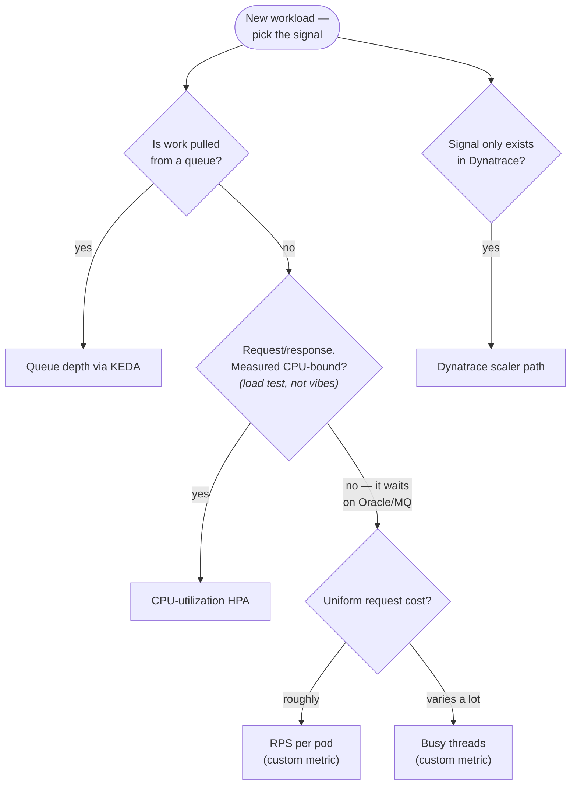

You are here if: your HPA "works" but scales too late or for no reason; or you're choosing a signal for a new workload; or someone said "just use CPU" and you want a second opinion.

The most common autoscaling failure isn't a broken autoscaler — it's a working autoscaler pointed at the wrong number. A good scaling signal predicts an [SLO breach](/autoscaling/slos-for-scaling/) early: it rises *before* users hurt and falls when they stop. A bad one is a symptom (moves after the pain), a liar (doesn't move when the pain does), or a ratchet (moves up and never comes back down). This page is the catalog: every candidate number for this stack, what it's good for, and — just as important — what it must never be used for.

Each entry follows the same template: what it means in plain words · where it comes from · **observe** (the query, runnable now) · **decide** (what the reading tells you to do) · the verdict — **scale** on it, **alert** on it, or **rightsize** with it · and the trap. The example service is `payments-api` in namespace `payments` throughout.

## CPU utilization

**What it is.** How much processor time your pods burn, as a percentage of their [request](/autoscaling/prerequisites/#1-your-pods-declare-resource-requests). The default HPA signal — zero setup, works everywhere [metrics-server](/observability/metrics/) runs.

**Observe.**

```promql
# Per-pod CPU as % of request — the same math the HPA does
sum by (pod) (rate(container_cpu_usage_seconds_total{namespace="payments", pod=~"payments-api.*"}[5m]))
/
sum by (pod) (kube_pod_container_resource_requests{namespace="payments", pod=~"payments-api.*", resource="cpu"})
```

Or immediately, no Prometheus needed: `kubectl top pods -n payments` and divide by the request yourself.

**Decide.** If CPU climbs roughly in step with traffic and latency — your app is CPU-bound, and CPU is an honest signal. If traffic doubles, latency climbs, and CPU *stays low* — your app spends its time **waiting** (on Oracle, on MQ, on a downstream), and CPU will sit there reading 30% while your thread pool suffocates. That second pattern is most of this stack.

**Verdict: scale on it — only after measuring that you're CPU-bound.** Not because a template said so.

**The trap.** CPU is a *lagging* signal for wait-bound apps: by the time waiting threads finally push CPU up, users have been queueing for minutes. SLO shape it protects: latency, and only for compute-heavy paths.

## Queue depth / message lag

**What it is.** How many messages are waiting in the queue — for a consumer, this *is* the backlog, which is why it's the correct consumer signal: it measures work-not-yet-done directly instead of inferring it.

**Observe.** Broker-side, because the truth lives in the broker, not in your pods. IBM MQ: current depth via the admin REST API (`CURDEPTH` in MQSC terms). RabbitMQ: queue length via the management API or its Prometheus plugin (`rabbitmq_queue_messages`). [KEDA polls these endpoints directly](/autoscaling/getting-the-metrics/#lane-c--systems-outside-the-cluster) — from the cluster, over the network, with credentials, since your brokers live outside. Quick manual look at RabbitMQ:

```promql
rabbitmq_queue_messages{queue="notify.q"}
```

**Decide.** Depth rising while consumer count is flat → add consumers (that's the scaler's job). Depth rising while consumers are *already* scaling up → your per-pod drain rate is the problem, or the downstream is — more pods won't fix a slow Oracle write. Depth flat at a high number → a poison message is pinning it.

**Verdict: scale on it — via KEDA.** The trigger arithmetic (depth vs. *lag-time*, activation vs. target) is [derived from your freshness SLO on the consumers page](/autoscaling/messaging-consumers/).

**The trap.** Raw depth treats all messages as equal cost. If message cost varies wildly, scale on lag-time (depth ÷ drain rate) instead. SLO shape: freshness.

## Thread-pool saturation

**What it is.** How many of Tomcat's request threads are busy right now, against the maximum it will ever have. For a blocking-I/O Spring app — one that calls Oracle and MQ and *waits* — this is the leading indicator: threads saturate long before CPU notices anything, because a thread blocked on a 2-second query costs almost no CPU while consuming 1/200th of your entire capacity to accept work.

A one-paragraph explainer, since this signal only makes sense if you know what the pool is: every HTTP request into a servlet app occupies one thread from a fixed pool (Tomcat default: 200) for its entire duration, including all the time spent waiting on the database. All 200 busy = request 201 queues at the door, latency cliff, users hurt — at 25% CPU.

**Observe.** Two metrics, one ratio. One gotcha first: Tomcat's metrics are **off by default** — they appear only with `server.tomcat.mbeanregistry.enabled: true` in your application config ([the pipeline page](/autoscaling/getting-the-metrics/) wires it up).

```promql
# Busy fraction of the Tomcat request pool, per pod
tomcat_threads_busy_threads{namespace="payments", pod=~"payments-api.*"}
/
tomcat_threads_config_max_threads{namespace="payments", pod=~"payments-api.*"}
```

For async/executor-based work, the analogue is `executor_queued_tasks` — tasks waiting for a thread.

**Decide.** Busy ratio climbing past ~0.7 while CPU is low → you are wait-bound; this, not CPU, should drive your HPA. Ratio high *and* CPU high → genuinely compute-saturated; either signal works. Ratio pinned at 1.0 → you're already dropping/queueing requests; scaling now is late (alert threshold belongs lower).

**Verdict: scale on it** (as a custom metric through [the pipeline](/autoscaling/getting-the-metrics/)) **for wait-bound request/response apps** — which is `payments-api` exactly. SLO shape: latency.

**The trap.** The pool max must be deliberate: scaling on a ratio of an accidental default means your threshold changes when someone tunes Tomcat. Set `server.tomcat.threads.max` consciously first.

## JVM heap vs. pod memory — the delta

**What it is.** Two different "memory" numbers that teams constantly conflate. `jvm_memory_used_bytes` is what the JVM is using *inside* its heap. `container_memory_working_set_bytes` is what the *pod* holds from the OS — heap **plus** metaspace, thread stacks, direct buffers, and native allocations. The gap between them is normal JVM overhead… when it's stable.

**Observe.**

```promql
# The delta: pod memory minus JVM heap used — watch its trend, not its size
container_memory_working_set_bytes{namespace="payments", pod=~"payments-api.*", container="payments-api"}
-
sum by (pod) (jvm_memory_used_bytes{namespace="payments", pod=~"payments-api.*", area="heap"})
```

**Decide.** Stable gap (even a large one) → normal overhead; use it to [size your limit and `MaxRAMPercentage`](/autoscaling/spring-boot-scaling/#the-heap-vs-pod-memory-delta) so limit − heap leaves room for the native side. *Growing* gap under steady load → native leak (direct buffers, un-freed threads, a leaky native lib) — that's an alert and an investigation, and no amount of replicas fixes it.

**Verdict: NEVER scale on it. Rightsize and alert only.**

:::danger[Memory + JVM + HPA = a ratchet]
The JVM claims heap and does not give it back to the OS when load drops. An HPA scaling on memory therefore sees a number that only rises — it scales up on the morning rush and *never scales down*, ratcheting to maxReplicas and pinning there while every pod idles. The full mechanism is in [JVM ↔ Kubernetes coupling](/java/jvm-kubernetes-coupling/) and [JVM memory knobs](/tuning/jvm-memory-knobs/). If you take one verdict from this page, take this one.
:::

## RPS per pod

**What it is.** Requests per second each pod is carrying. An honest, intuitive signal *if* you've done the homework: measured the **knee** — the load level where one pod's latency stops being flat and bends sharply upward; below it is capacity, above it is queueing (the per-pod capacity number from [the sizing walkthrough](/tuning/sizing-walkthrough/)).

**Observe.**

```promql
sum by (pod) (rate(http_server_requests_seconds_count{namespace="payments", service="payments-api"}[5m]))
```

**Decide.** Per-pod RPS approaching your measured knee → scale before you reach it. The threshold is `knee × ~0.75` — headroom for the [reaction-plus-warmup lag](/autoscaling/spring-boot-scaling/).

**Verdict: scale on it, with homework done.** Without a measured knee, an RPS threshold is a guess wearing a number. SLO shape: latency.

**The trap.** Endpoint mix. 100 rps of cache hits and 100 rps of report generation are not the same load; if your mix shifts, the knee moves. Wait-bound apps often do better on threads, which self-weight by request cost.

## Latency (p95)

**What it is.** The [percentile primer](/autoscaling/slos-for-scaling/#percentiles-in-practice) covers reading it. Here's why it's in this catalog only to be disqualified as a scaling trigger.

:::danger[Don't scale on p95]
Latency is the **symptom** — the thing your SLO protects, the last number to move. It saturates late (flat, flat, flat, cliff), so an HPA watching it reacts after users are already hurting. Worse, it oscillates by construction: scaling out adds cold pods, cold pods post the fleet's *worst* latencies ([the thundering-herd mechanics](/autoscaling/spring-boot-scaling/#the-cold-pod-thundering-herd)), so the scale-up *raises* p95, which triggers more scale-up. You scale because you scaled.
:::

**Verdict: alert on it — it's your SLI.** Scale on whichever leading signal (threads, RPS, queue depth) predicts it.

## Connection-pool pressure

**What it is.** `hikaricp_connections_pending` — threads waiting for a database connection from HikariCP's pool. A precise diagnostic: work is arriving faster than your connections can serve it.

**Observe.**

```promql
hikaricp_connections_pending{namespace="payments", pod=~"payments-api.*"}
```

**Decide.** Sustained pending > 0 means "pods *or* pool" — and the tie-breaker is the thread signal: threads saturated too → you need pods (more total capacity); threads fine but pool pending → the pool per pod is undersized (or Oracle itself is slow). Either way this number feeds [the Oracle ceiling math](/autoscaling/rest-api-oracle/) — pool size × maxReplicas is a contract with the DBA.

**Verdict: alert on it; input to ceiling math.** Not a scaling trigger — it's too far downstream and scaling on it can dogpile a struggling database.

## GC pressure

**What it is.** `jvm_gc_pause_seconds` — time stolen by garbage collection. High GC is a *sizing* problem (heap too small for the workload) or a code problem (allocation storm), not a replica-count problem.

**Verdict: alert / rightsize.** Scaling out ten under-heaped pods gets you ten pods that all GC-thrash. [JVM memory knobs](/tuning/jvm-memory-knobs/) is the fix.

## The summary table

| Signal | Plain meaning | Metric | Source | Verdict | Fits |
|---|---|---|---|---|---|
| CPU utilization | compute burned vs request | `container_cpu_usage_seconds_total` | metrics-server / cAdvisor | **Scale** (if measured CPU-bound) | compute-heavy APIs |
| Queue depth / lag | backlog waiting | broker-side (CURDEPTH, `rabbitmq_queue_messages`) | broker, via KEDA | **Scale** (via KEDA) | consumers |
| Thread saturation | request threads busy vs max | `tomcat_threads_busy_threads` / `…config_max_threads` | Micrometer (needs mbeanregistry) | **Scale** (custom metric) | wait-bound APIs — most of this stack |
| Heap-vs-pod delta | native/overhead gap | `container_memory_working_set_bytes` − `jvm_memory_used_bytes` | cAdvisor + Micrometer | **Rightsize + alert. Never scale.** | every JVM |
| RPS per pod | load carried per copy | `http_server_requests_seconds_count` | Micrometer | **Scale** (with measured knee) | uniform-cost APIs |
| Latency p95 | the user's experience | `…seconds_bucket` + `histogram_quantile` | Micrometer (histograms on) | **Alert — it's the SLI** | everything |
| Pool pending | threads awaiting a DB connection | `hikaricp_connections_pending` | Micrometer | **Alert + ceiling input** | Oracle-backed apps |
| GC pause | time lost to GC | `jvm_gc_pause_seconds` | Micrometer | **Alert / rightsize** | every JVM |

## Choosing, as a flowchart



(Nodes link to their pages; if the links don't work in your renderer: queue depth → [consumers](/autoscaling/messaging-consumers/), CPU → [Oracle API](/autoscaling/rest-api-oracle/), RPS → [pipeline](/autoscaling/getting-the-metrics/), threads → [Spring Boot](/autoscaling/spring-boot-scaling/), Dynatrace → [its page](/autoscaling/dynatrace-signals/).)

## Which mechanism carries the signal

Three mechanisms deliver a signal to the scaling loop. What each is, in one sentence, and the trade:

| | HPA on CPU | HPA on custom metric | KEDA |
|---|---|---|---|
| What it is | The built-in autoscaler on the built-in metric | Same autoscaler, fed app metrics through an adapter | An operator that watches external systems and drives an HPA for you |
| Metrics path | metrics-server (already there) | Prometheus + prometheus-adapter ([the fork explained](/autoscaling/getting-the-metrics/)) | KEDA polls Prometheus/broker/Dynatrace directly |
| Who installs | nobody (built in) | PLATFORM (adapter) | PLATFORM (operator + CRDs) |
| Scale to zero | no (min 1) | no | yes |
| When the pipeline dies | keeps last CPU reading | HPA reads `<unknown>`, freezes ([runbook](/troubleshooting/hpa-not-scaling/)) | freezes at current count, or applies your `fallback` replicas ([KEDA deep dive](/architectures/keda-autoscaling/)) |
| **You gain** | zero setup | the honest signal for your app | right semantics for consumers, scale-to-zero, 70+ scalers |
| **You pay** | lies for wait-bound apps | you own a metrics pipeline | a new controller + CRDs in the mix, one more thing to version |

## Failure modes

| Wrong signal | What happens | The tell |
|---|---|---|
| Memory, on a JVM | Ratchets to max, never descends | `kubectl get hpa`: current at 95%+ of a memory target for days |
| Latency | Flapping — scale-out worsens the signal that caused it | Replica count sawtooths on a 5–10 min period |
| CPU, on a wait-bound app | Scales after users hurt | Latency SLO breaching while HPA shows 40% CPU |
| Any *averaged* signal with keep-alive traffic | One pod melts while the average looks calm | Per-pod spread in the queries below; [long-lived connections](/networking/long-lived-connections/) explains the pinning |

## The signal audit

Before committing, run the eyeball test — all four candidates side by side for one deployment, one day. Which one moves *first* when traffic climbs? That's your leading signal; it's rarely the one you assumed:

```promql
# 1 · per-pod CPU (fraction of request) — the default assumption
sum by (pod) (rate(container_cpu_usage_seconds_total{namespace="payments", pod=~"payments-api.*"}[5m]))
  / sum by (pod) (kube_pod_container_resource_requests{namespace="payments", pod=~"payments-api.*", resource="cpu"})

# 2 · per-pod RPS — the work arriving
sum by (pod) (rate(http_server_requests_seconds_count{namespace="payments", service="payments-api"}[5m]))

# 3 · busy-thread ratio — the capacity being consumed
tomcat_threads_busy_threads{namespace="payments", pod=~"payments-api.*"}
  / tomcat_threads_config_max_threads{namespace="payments", pod=~"payments-api.*"}

# 4 · p95 latency — the user experience (the one you protect)
histogram_quantile(0.95, sum by (le) (rate(http_server_requests_seconds_bucket{namespace="payments", service="payments-api"}[5m])))
```

Four units — fraction, rps, ratio, seconds — don't share a y-axis, so don't fight it: four stacked panels in one Grafana dashboard row, with the shared crosshair on (Dashboard settings → Graph tooltip → Shared crosshair). That gives you the aligned time axis that answers the only question here: which line bends first.

And one meta-alert that catches wrong-signal choices *after* the fact — desired-replica churn:

```promql
# HPA changing its mind more than 6 times an hour = flapping = wrong signal or bad windows
changes(kube_horizontalpodautoscaler_status_desired_replicas{horizontalpodautoscaler="payments-api"}[1h]) > 6
```

## Where next

- **Next in the journey:** [How the Numbers Reach the Autoscaler](/autoscaling/getting-the-metrics/) — you've chosen the number; now build the pipe that delivers it.
- **The lateral jump:** signal chosen and pipeline already exists? Go straight to [your archetype](/autoscaling/overview/#start-here-by-archetype).
