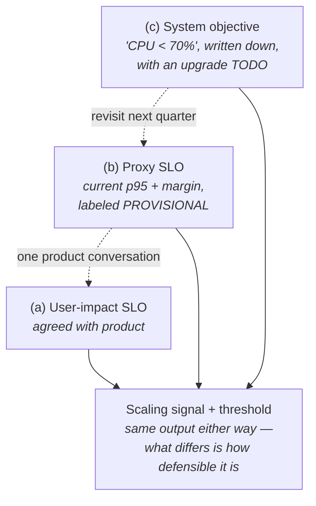

You are here if: you're about to pick an HPA threshold and realize you'd be guessing; or someone asked "why 70%?" in review and you had no answer; or product wants a "3-second promise" and you need to turn that into YAML.

Autoscaling keeps a number inside a limit. Before choosing the number, decide what you promised the humans. That promise is an **SLO**, and this page teaches the translation — user behavior at the top, an HPA threshold at the bottom — plus the honest fallback for teams that can't get a user-level answer *yet*. The goal isn't SLO-theory completeness; it's exactly enough to make your scaling targets mean something.

Three terms, one sentence each. An **SLI** (service level indicator) is a measurement — a number you can query right now. An **SLO** (service level objective) is a promise stated on that measurement over a window — "99% of checkouts complete in under 2 seconds, measured over 28 days." An **SLA** is the version with lawyers and refunds attached; not our topic.

## Percentiles in practice

The SLI you'll reach for most is a percentile, so it gets the full treatment first: what it is, how to see yours, what to do about it.

**Define.** Sort one hour of response times fastest to slowest. **p50** is the middle one — half your requests beat it. **p95** is the time 95 of 100 requests beat — the experience of your unluckiest 1-in-20 user. **p99**: unluckiest 1-in-100. Percentiles matter because **averages lie**: ten requests at 50 ms and one at 1,700 ms average to 200 ms — "fine" — while a real user just stared at a spinner for 1.7 seconds. The average buried them; p95 (here ≈1,700 ms) refuses to.

**Observe.** In Prometheus, percentiles are computed from histogram data your app publishes (there's a Spring config switch to even *have* that data — the gotcha and the full query anatomy live in [the pipeline page](/autoscaling/getting-the-metrics/#1-make-the-app-publish); link back here after). The query shape, using this section's example service `payments-api`:

```promql
histogram_quantile(0.95,
  sum by (le) (
    rate(http_server_requests_seconds_bucket{namespace="payments", uri="/api/checkout"}[5m])
  )
)
```

Graph that over a day, not an instant — the *shape* is the information. The same number lives in Grafana's RED-style dashboards (Rate, Errors, Duration — the standard request/response service view) and, if OneAgent instruments the service, in Dynatrace's response-time percentile view ([which path when](/autoscaling/dynatrace-signals/)).

**Decide.** Reading the chart:

| If you see | It means | Do |
|---|---|---|
| p95 flat while traffic doubles | You have headroom | Don't scale yet; note the measured capacity |
| p95 climbs with load, CPU stays low | Wait-bound: threads, not CPU, are saturating | Scale on threads/RPS, not CPU → [signals](/autoscaling/signals-catalog/) |
| p95 spikes right at scale-out moments | New pods serving before they're warm | The cold-pod problem → [Spring Boot page](/autoscaling/spring-boot-scaling/) |
| p50 fine, p95 awful | One slow dependency or one hot pod | Scaling may not help at all — find the outlier first |

## The translation ladder

Five rungs, top to bottom. Worked all the way through once, here, with `payments-api`'s checkout:

```text
user behavior          "users abandon checkout past ~3 seconds"
      ↓
user-visible symptom   "checkout feels slow"
      ↓
SLI                    p95 latency of POST /api/checkout
      ↓
SLO                    99% of checkouts < 2 s, over 28 days
      ↓
scaling signal +       scale on busy Tomcat threads at 75% of max —
threshold              the number that moves *before* checkout p95 does
```

**Rung 1 → 2, behavior to symptom.** Users don't experience your metrics; they experience waiting, errors, and staleness. Name the experience in their words first — "feels slow," "my order confirmation never came" — because that phrasing decides *which* measurement matters.

**Rung 2 → 3, symptom to SLI.** Pick the measurement that captures the symptom: "feels slow" → latency percentile on the endpoint that matters (not a site-wide average — users check out on `/api/checkout`, not on your health endpoint). "Confirmation never came" → *freshness*: time from enqueue to processed. Run the query today; the current value is your baseline.

**Rung 3 → 4, SLI to SLO.** Two choices. The **target**: set it *tighter* than the pain point — users leave at 3 s, so promise 2 s, because you want the alarm before the exodus, and every system between you and the user adds latency you don't control. The **window**: promises hold over time, not instants — a 28-day rolling window is the boring, correct default (one bad minute shouldn't breach a promise; a bad week should). That yields an **error budget**: 99% over 28 days means ~7 hours of slow-or-failing checkout *allowed* per month. That's the tolerance autoscaling spends when it reacts slowly — one honest paragraph is all the budget theory you need here; alert-on-burn-rate mechanics live in [alerting](/observability/alerting/).

**Rung 4 → 5, SLO to scaling signal.** The scaling signal is *not* the SLI. You promise on p95; you scale on the thing that predicts p95 — busy threads, RPS per pod, queue depth — because by the time the SLI itself moves, users are already inside the pain ([why scaling on p95 oscillates](/autoscaling/signals-catalog/#latency-p95)). The threshold comes from measurement: load-test to find where the signal sits when the SLI approaches the SLO boundary, then set the trigger below it with enough headroom to cover reaction-plus-warmup lag (that math: [the knob bridge below](#from-slo-to-knob-settings) and [the Spring warmup page](/autoscaling/spring-boot-scaling/)).



## Measure user behavior — don't guess it

Rung 1 is itself measurable, and the SLO should come from measurement where you can get it. Where the evidence lives, and the trade each source carries:

**Dynatrace RUM / user sessions** (if licensed — this shop's likeliest source). Real-user monitoring records what actual users did: abandonment, rage clicks, session walk-aways. The move: plot **abandonment rate against response time** and find the cliff. If abandonment doubles past 2.8 s, the business just told you its tolerance — promise 2 s. That cliff *is* the number your SLO protects; everything below it on the ladder is derivation, not opinion. The trade: real behavior, but needs RUM licensing and instrumentation ([the Dynatrace page](/autoscaling/dynatrace-signals/) covers what's already flowing).

**Your own funnel metrics.** Orders started vs. orders completed is user behavior speaking through numbers you can emit yourself with [a custom Micrometer counter](/autoscaling/getting-the-metrics/#custom-metrics--when-and-how). A completion-rate drop that correlates with p95 climbing is your abandonment cliff, measured for free. The trade: cheap and fully yours; but correlation isn't causation — a funnel drop has non-latency causes too.

**Support tickets and complaints.** Timestamp them against the latency chart. Crude, lagging — and persuasive in the SLO conversation precisely because each data point is a human who cared enough to write.

**The product owner's tolerance question.** When no instrumentation exists yet, ask in plain English: "how long before users give up — or call us?" The trade: fast, but it's opinion, not measurement; label the resulting SLO accordingly and plan to check it against data later.

### The SLI shape follows the archetype

Your [classification card](/autoscaling/classify-your-app/)'s "SLO shape" field, made concrete:

- **Request/response** (APIs, web): latency percentile + availability. The checkout example above.
- **Consumers**: **freshness**, not latency — nobody experiences your listener's method timing; they experience "the confirmation hadn't arrived yet." Shape: "99% of messages processed within N minutes." This form is special: it *directly* produces the queue-depth trigger math (`tolerable backlog = drain rate × N minutes` — [derived fully on the consumers page](/autoscaling/messaging-consumers/)).
- **Batch**: throughput/deadline ("complete by 06:00") — out of this section's scaling scope, but write it down anyway.

## The cast's SLOs

The canonical table for this section's recurring workloads. Every reference-architecture page derives its thresholds from a row here — when you see "800 ms" on the Oracle page, this is where it came from:

| Workload | SLO | Derived signal | Derivation lives in |
|---|---|---|---|
| `payments-api` | 99.9% of requests < 800 ms / 28 d | CPU target from measured knee + busy-threads guard | [REST API + Oracle](/autoscaling/rest-api-oracle/) |
| `dispatch-worker` | 99% of dispatch messages processed < 5 min | IBM MQ queue depth | [Messaging Consumers](/autoscaling/messaging-consumers/) |
| `notify-worker` | 99% of notifications sent < 15 min | RabbitMQ queue length | [Messaging Consumers](/autoscaling/messaging-consumers/) |
| `catalog-web` | 99% of page loads < 1 s / 28 d | RPS per pod | [Web + Worker](/autoscaling/web-worker-and-caches/) |
| `catalog-indexer` | index entries fresh < 10 min | queue depth (freshness) | [Web + Worker](/autoscaling/web-worker-and-caches/) |

## The fallback ladder

:::tip[Can't get a user-impact answer? Start anyway]
The ladder above assumes someone can speak for users. Sometimes nobody can — yet. Three levels, all acceptable *if the level is stated*:

**(a) User-impact SLO** — agreed with the product owner, evidence-backed. The goal state.

**(b) Proxy SLO** — derived from observed behavior: "current p95 is 640 ms; promise 800 ms (current + 25% headroom), labeled **PROVISIONAL**, revisit next quarter." You're promising "no worse than today, with room to breathe" — defensible, honest, and it makes regressions visible.

**(c) System objective** — "CPU below 70%," "queue empty by 06:00." Not user-facing at all — but *written down as an objective, with a TODO to upgrade it*. Level (c) still beats an undocumented HPA, because a written objective can be questioned, and the questioning is what moves you to (b).

Every artifact in this section — the golden values `# derivation:` comment, the [review checklist](/autoscaling/capacity-and-governance/) — accepts all three levels but requires you to say which one you're at. That requirement is the training mechanism: stating "(c), TODO" out loud every review is what eventually gets someone to go ask product the tolerance question.
:::

## From SLO to knob settings

The bridge the rest of the section applies. Given an SLO:

- **Target utilization** = enough headroom that load can keep growing during the scaling *lag* — HPA reaction (~15–30 s) plus pod warmup (90 s+ for a JVM) — without the SLI crossing the SLO line. Slow-warming pods need lower targets; the arithmetic sketch is on the [Spring Boot page](/autoscaling/spring-boot-scaling/).
- **minReplicas** = the floor that still holds the SLO through one node loss *at your quietest traffic* — the SLO supplies the promise, [your measured low state](/autoscaling/load-profile/) supplies the traffic it must survive, and [HA math](/workloads/high-availability/) supplies the node-loss part.
- **maxReplicas** is **not an SLO number at all** — it's a capacity number, sized from your [measured peak](/autoscaling/load-profile/) and capped by external ceilings (Oracle sessions, MQ handles). If the ceiling can't hold the SLO at peak, the answer is a renegotiation with whoever owns the ceiling — not a bigger number in YAML. That conversation: [Capacity and Governance](/autoscaling/capacity-and-governance/).

## Failure modes

| Anti-pattern | Why it bites |
|---|---|
| SLO copied from another team | Their users' tolerance, their dependency latencies — not yours. The cliff is service-specific. |
| Target set to exactly current performance | Any regression is instantly a breach; no budget to spend on scaling lag. Leave headroom (the +25% in level (b)). |
| Window too short (1 h) | You're alerting on weather, not promising climate; every blip breaches. |
| Freshness SLO watched on a latency dashboard | Consumer "processing time per message" looks great while the backlog grows for hours. Freshness needs its own panel: age of oldest message. |

## Alerts

Recording-rule sketches — Prometheus rules that precompute a query into a new time series — for the two SLO shapes. These make the SLI cheap to query and alert on ([alerting mechanics](/observability/alerting/)):

```promql
# Latency-shape SLI: fraction of checkout requests under the 2 s SLO boundary
sum(rate(http_server_requests_seconds_bucket{uri="/api/checkout", le="2.0"}[5m]))
/
sum(rate(http_server_requests_seconds_count{uri="/api/checkout"}[5m]))
```

```promql
# Freshness-shape SLI for consumers: seconds of backlog at current drain rate
# (queue depth and drain rate both come from the broker — exporter or KEDA metrics —
#  the consumers page wires these up)
ibmmq_queue_depth{queue="DISPATCH.Q"} / clamp_min(rate(messages_processed_total[5m]), 0.001)
```

Alert on **burn rate** — "spending the error budget too fast" — rather than raw threshold crossings; the pattern is in [alerting](/observability/alerting/).

## Where next

- **Next in the journey:** [Know Your Traffic: Steady State, Low State, Peak](/autoscaling/load-profile/) — the SLO says what you promised; the load profile says what the promise is up against.
- **The lateral jump:** stuck at level (c) and unsure which *number* to even watch? [The Numbers That Matter](/autoscaling/signals-catalog/) works standalone.
