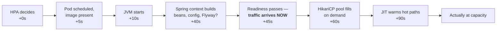

You are here if: scale-ups make your latency *worse* for a minute before it gets better; or your pods flap up and down all day; or you're setting an HPA on any Spring Boot service and want the JVM-specific traps in advance.

The HPA adds a pod in about 30 seconds. Your Spring Boot pod becomes *useful* 90 seconds later. Everything in between is the incident: users hit cold pods, the fleet's p95 spikes, and if you picked the wrong signal the autoscaler reads that spike as "scale more." This page is the JVM-specific layer of the playbook — the timeline, the probes that guard it, the behavior tuning that respects it, and the two signals (threads, memory-delta) that only make sense once you understand what a JVM does inside a container.

## The warmup timeline

What actually happens between "HPA decides" and "pod pulls its weight":



The timestamps are one measured service, not constants — image size, CDS, lazy-init, and CPU limits (all below) move every segment, so measure yours once (pod-Ready lag via `kubectl get pods -w`, ready-to-capacity via the cold-pod alert at the bottom of this page) and re-label the diagram. The two *gaps* matter regardless. **Decision → readiness (~45 s)**: the HPA can't help faster than this, so your scaling threshold needs enough headroom that load can keep growing for 45+ seconds without breaching the SLO — that's the [knob-bridge math](/autoscaling/slos-for-scaling/#from-slo-to-knob-settings) in concrete form. **Readiness → capacity (~45 more)**: the pod is taking full traffic while the pool is empty and the JIT is interpreting — it *serves*, but slowly. Each segment has a knob: context time responds to lazy-init and [startup levers](#startup-levers-one-paragraph); pool-fill responds to pool warmup config; JIT responds only to traffic and time.

## Probes as scaling infrastructure

Under an HPA, probes stop being health checks and become *traffic gates that fire several times a day*. Get them wrong and every scale-up ships 502s.

```yaml
# deployment.yaml — probe block for a Spring Boot 3.x service, every threshold justified
startupProbe:
  httpGet:
    path: /actuator/health/readiness   # Spring's readiness group — not /health, which
    port: http                         # can pass while readiness-relevant deps are down
  periodSeconds: 5
  failureThreshold: 24                 # 24 × 5s = 120s of allowed startup — sized to your
                                       # MEASURED context time × 2, not a guess. While this
                                       # probe runs, liveness is suspended: a slow start
                                       # can't be killed as a "dead" pod.
livenessProbe:
  httpGet:
    path: /actuator/health/liveness
    port: http
  periodSeconds: 10
  failureThreshold: 3                  # 30s of true deadness before restart. Liveness must
                                       # NOT check dependencies — a slow Oracle would make
                                       # kubelet restart perfectly healthy pods, fleet-wide.
readinessProbe:
  httpGet:
    path: /actuator/health/readiness
    port: http
  periodSeconds: 5
  failureThreshold: 2                  # go NotReady fast when genuinely unable to serve —
                                       # under load, 10s of misrouted traffic is plenty
```

Without a startupProbe, liveness runs during startup: a context that takes longer than `initialDelay + threshold` gets killed *while starting*, restarts, takes just as long, gets killed — a restart loop that only appears under scale-up pressure, which is exactly when you can't afford it. Probe philosophy and the readiness-group wiring: [health check design](/tuning/health-check-design/) and [Actuator](/java/actuator/).

The subtle trap: **readiness that passes before the pod can perform.** Spring's readiness returns 200 once the context is up — HikariCP has *opened* its `minimum-idle` connections but the pool isn't proven against your real Oracle latency, and nothing is JIT-compiled. Readiness answers "can I serve at all?", never "am I fast yet?" — which is why the next two sections exist.

## The cold-pod thundering herd

The Service routes to Ready pods evenly. A brand-new pod therefore receives its full share of traffic at zero JIT and an unfilled pool — and posts the *worst* latencies in the fleet, precisely because the fleet was already struggling (that's why it scaled).

:::caution[Scaling on latency creates a loop]
Cold pod joins → fleet p95 rises → a latency-triggered scaler reads "still overloaded" → adds another cold pod → p95 rises again. You scale because you scaled. This is the mechanical reason latency is [alert-only in the catalog](/autoscaling/signals-catalog/#latency-p95), and it's visible in the wild as replica counts that sawtooth on a ten-minute period.
:::

### Startup levers, one paragraph

You can shrink the cold window itself: CDS/AOT caching (Spring Boot 3.3's CDS support cuts context time meaningfully), CRaC checkpoint/restore where your platform supports it, and lazy-init for beans off the hot path. All are covered in [Spring Boot on Kubernetes](/java/spring-boot/) — worth pursuing, but treat them as *shortening* the timeline, not eliminating it. The HPA tuning below assumes the timeline still exists.

## `behavior:` tuned for slow starters

The HPA's `behavior` block rate-limits scaling in each direction ([the concepts](/workloads/autoscaling/#behavior-the-anti-flapping-controls)). For JVMs, both directions need respect for the 90-second warmup:

```yaml
behavior:
  scaleUp:
    stabilizationWindowSeconds: 0    # react immediately — the timeline is slow enough already
    policies:
      - type: Pods
        value: 2                     # at most 2 new pods per minute. Why: each cold pod
        periodSeconds: 60            # temporarily WORSENS fleet latency (herd, above);
                                     # doubling a fleet of cold JVMs at once trades one
                                     # incident for another. 2/min reaches maxReplicas fast
                                     # enough while keeping the cold fraction small.
  scaleDown:
    stabilizationWindowSeconds: 300  # a pod you kill cost 90s to warm — don't discard one
    policies:                        # on a 60s dip. 300s says: the dip must persist 5min
      - type: Pods                   # before we pay the warmup cost again on the rebound.
        value: 1                     # …and then shed slowly: 1 pod per 2min, because
        periodSeconds: 120           # scale-down mistakes cost warmup + user pain to undo.
```

The trade, stated: slow scale-down means you run over-provisioned for a few minutes after every peak — that's minutes of reserved capacity on a shared cluster ([citizenship](/autoscaling/overview/#the-citizenship-contract) says don't stretch it to hours; the drift alert for "pinned at min/max" is in [load-profile](/autoscaling/load-profile/#drift-alerts--when-reality-leaves-your-table)). The alternative — eager scale-down — costs a warmup penalty on every traffic wobble. For JVMs, the slow direction wins.

Rule of thumb: **scaleDown stabilization ≥ 3 × your measured warmup time.**

## Threads: the honest saturation signal, wired up

[The catalog](/autoscaling/signals-catalog/#thread-pool-saturation) explains *why* busy threads lead CPU for wait-bound apps. Here's the full wiring for a Spring service. First, deliberate pool sizing and the metrics switch:

```yaml
# application.yaml
server:
  tomcat:
    mbeanregistry:
      enabled: true          # Tomcat metrics are off without this
    threads:
      max: 200               # make the denominator DELIBERATE: your busy-ratio threshold
                             # is meaningless if someone later "tunes" this casually
```

Then the ratio, per pod and fleet-averaged (the fleet average is what a scaler compares to its threshold):

```promql
avg(
  tomcat_threads_busy_threads{namespace="payments", pod=~"payments-api.*"}
  / tomcat_threads_config_max_threads{namespace="payments", pod=~"payments-api.*"}
)
```

Decide from it: sustained > 0.75 → scale (that's [the pipeline page's fork](/autoscaling/getting-the-metrics/#5-the-fork-adapter-or-keda) — a custom-metric HPA or a ScaledObject, whichever mechanism your platform granted). Pinned at 1.0 → you're already queueing at the acceptor; your *alert* belongs at 0.8 so scaling happens before this. Climbing while Oracle latency climbs too → more pods will help the thread math but multiply load on Oracle — check `hikaricp_connections_pending` before celebrating, because the [ceiling math](/autoscaling/rest-api-oracle/) may be the real constraint.

## The heap-vs-pod-memory delta

A JVM pod's memory has two layers that [the catalog introduced](/autoscaling/signals-catalog/#jvm-heap-vs-pod-memory--the-delta): heap (what the JVM manages) and everything else (metaspace, thread stacks — one per Tomcat thread, so your `threads.max` shows up *here* too — direct buffers, JIT code cache). The pod's limit must hold **both**. Sizing that split is `MaxRAMPercentage`:

```text
limit 1 Gi × MaxRAMPercentage 60% = heap 614 Mi
      → non-heap budget: ~410 Mi for metaspace + 200 thread stacks (~200 Mi at 1 Mi
        each!) + buffers + code cache. 75% instead would leave ~256 Mi — a fleet-wide
        OOMKill lottery under load, when threads and buffers peak together.
```

Watch the delta's *trend*, not its size — a growing gap under steady load is a native leak, and no replica count fixes a leak. Full knob treatment: [JVM memory knobs](/tuning/jvm-memory-knobs/) and [JVM ↔ Kubernetes coupling](/java/jvm-kubernetes-coupling/).

:::danger[Never scale on memory — the reprise]
The JVM claims heap and does not return it when load drops. Memory-triggered HPA + JVM = scale up in the morning, never scale down, pinned at maxReplicas by lunch — while every pod idles. It bears repeating because a memory target is one innocent-looking line in an HPA manifest and reverting it needs a postmortem. [The mechanism, fully](/java/jvm-kubernetes-coupling/).
:::

One more limits interaction: **CPU throttling during startup.** JIT compilation is a CPU burst; a tight CPU limit throttles exactly that burst, stretching the warmup window the whole page is trying to shrink. If you set CPU limits at all ([the knobs page's trade-offs](/tuning/requests-limits-knobs/)), leave startup headroom — throttling is measurable via [performance analysis](/observability/performance-analysis/).

## Failure modes

| Symptom | Mechanism | Fix |
|---|---|---|
| 502s for ~30 s at every scale-up | readiness passes before the app can serve | honest readiness + startup levers, this page |
| Pods restart-loop under scale-up pressure | no startupProbe; liveness kills slow starts | startupProbe block above |
| Replica count sawtooths all day | scaleDown window shorter than warmup, or latency signal | `behavior:` block above; [signal audit](/autoscaling/signals-catalog/#the-signal-audit) |
| Scale-up made p95 *worse* for 2 min | cold-pod herd | expected at small scale; policies above bound it; startup levers shrink it |
| Warmup takes far longer than local testing | CPU limit throttling the JIT burst | check throttling ([how](/observability/performance-analysis/)), loosen the limit |
| Random OOMKills at high replica counts | MaxRAMPercentage too high — thread stacks ate the non-heap budget | the split math above |

## Alerts

```promql
# Cold-pod detector: newest pod's p95 vs the fleet's — catches herds and
# validates your warmup assumptions after every deploy
histogram_quantile(0.95, sum by (pod, le) (rate(http_server_requests_seconds_bucket{namespace="payments", service="payments-api"}[2m])))
> 2 * on() group_left()
histogram_quantile(0.95, sum by (le) (rate(http_server_requests_seconds_bucket{namespace="payments", service="payments-api"}[10m])))
```

```promql
# Thread saturation approaching — scale should already be happening
avg(tomcat_threads_busy_threads{namespace="payments", pod=~"payments-api.*"}
  / tomcat_threads_config_max_threads{namespace="payments", pod=~"payments-api.*"}) > 0.8
```

```promql
# At max AND threads saturated: scaling has done all it can — this is now a
# capacity or ceiling conversation, not an autoscaling one
(kube_horizontalpodautoscaler_status_current_replicas{horizontalpodautoscaler="payments-api"}
 >= on() kube_horizontalpodautoscaler_spec_max_replicas{horizontalpodautoscaler="payments-api"})
and on()
(avg(tomcat_threads_busy_threads{namespace="payments"} / tomcat_threads_config_max_threads{namespace="payments"}) > 0.85)
```

## Where next

- **Next in the journey:** the reference architectures apply all of this to real topologies, starting with [REST API in Front of an External Oracle](/autoscaling/rest-api-oracle/).
- **The lateral jump:** startup time is your whole problem? [Spring Boot on Kubernetes](/java/spring-boot/) owns the startup levers.
