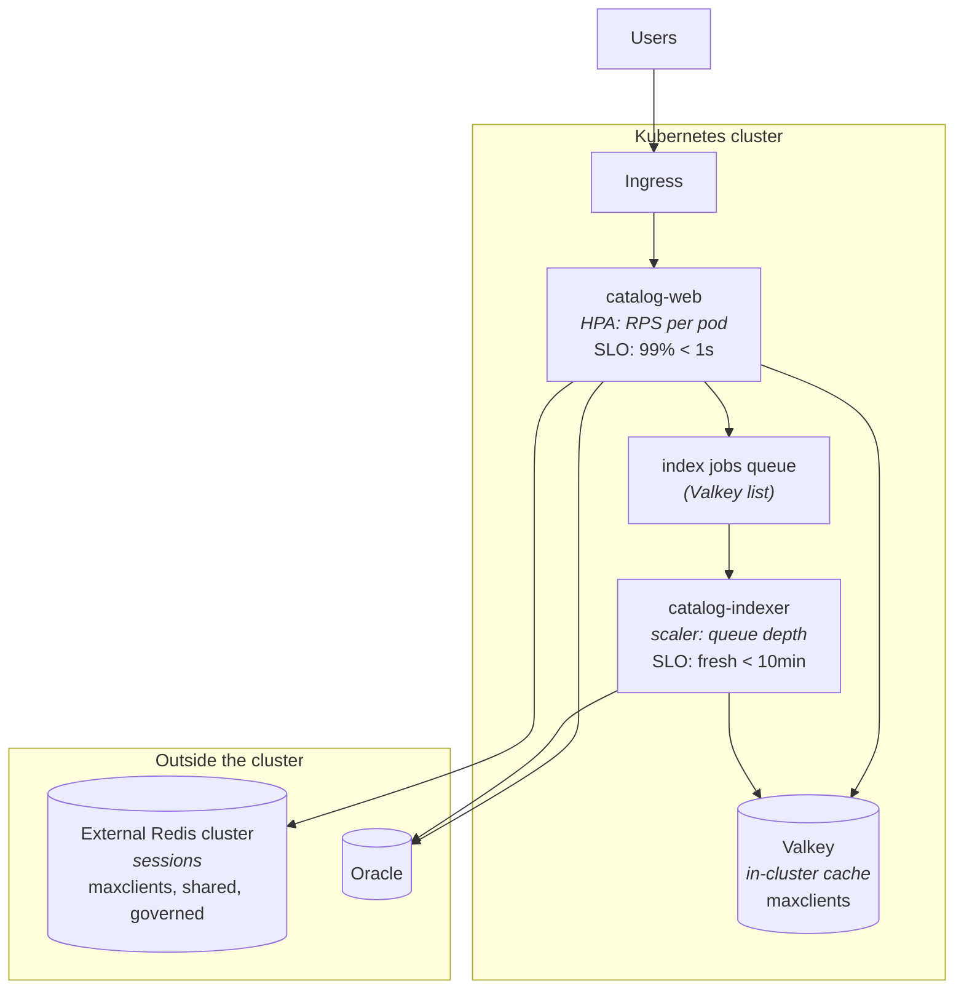

You are here if: one chart deploys both a web tier and a background worker and you're not sure whether that's one autoscaler or two; or a scale-up event just hammered your database through a cold cache; or users got logged out at 2 p.m. and the timeline matches a scale-in.

**What you'll have at the end:** one Helm chart, two Deployments, two *independent* scalers — one for `catalog-web`'s latency SLO and one for `catalog-indexer`'s freshness SLO, on whichever mechanism your platform granted ([the fork](/autoscaling/getting-the-metrics/#5-the-fork-adapter-or-keda)) — plus the three cache-and-connection traps that only appear when replica counts start moving on their own.

One chart, two scaling personalities — and two caches that experience your scale-out as an attack. This page is where the previous two architectures meet, and where the [SLO thread](/autoscaling/slos-for-scaling/) pays off concretely: the *reason* this chart must split into two scalers is that it contains two different promises.

## The architecture



Two independent feedback loops — web scales on load *arriving*, worker scales on work *queued* — sharing three dependencies, two of which have connection ceilings and one of which (Oracle) you've [already met](/autoscaling/rest-api-oracle/).

## Two promises, two scalers: why the chart splits

From [the cast SLO table](/autoscaling/slos-for-scaling/#the-casts-slos): `catalog-web` promises *99% of page loads under 1 s* — a **latency** promise, protected by a leading signal on arriving load. `catalog-indexer` promises *index entries fresh within 10 minutes* — a **freshness** promise, protected by queue depth. Different SLO shapes → [different signals](/autoscaling/signals-catalog/) → different scalers, different floors, different ceilings, different quiet hours (web troughs at night; the indexer's peak *is* the night, when catalog imports land).

Which is why the single-Deployment version — web endpoints and `@RabbitListener`-style workers in one JVM, one replica knob — cannot scale sanely: any signal you pick serves one promise and starves the other. Scale on RPS and the overnight import backlog waits for morning traffic to summon pods; scale on queue depth and lunchtime shoppers wait on a queue that's empty. If your app is currently that single JVM, this is [classification](/autoscaling/classify-your-app/) telling you to split the Deployment — same image is fine, different entrypoint/profile, so web pods don't run listeners and worker pods don't serve traffic.

The chart shape — one chart, two Deployments, values namespaced per personality:

```yaml
# values.yaml
web:
  replicaCount: 2
  autoscaling:
    enabled: true
    minReplicas: 2        # derivation: web trough ÷ per-pod capacity, HA floor
    maxReplicas: 12       # derivation: min(peak math, external-Redis client math below)
    # signal: RPS per pod via the prometheus scaler — catalog-web measured wait-bound-ish
    # but uniform-cost, so RPS with a measured knee (signals catalog) fits
    targetRPSPerPod: 45   # derivation: knee 60 rps/pod at p95→1s, ×0.75 lag headroom
worker:
  replicaCount: 1
  scaling:
    enabled: true
    minReplicaCount: 0    # imports tolerate cold start against a 10-min freshness SLO
                          # (zero is KEDA-track only — the adapter track floors at 1)
    maxReplicaCount: 6    # derivation: Oracle write budget for the indexer account
    queueLength: "50"     # derivation: drain 10 jobs/min/pod × 10min SLO ÷ 2 safety
```

Each Deployment template carries its own `{{- if not … }}` replicas guard ([audit item 1](/autoscaling/classify-your-app/#part-3--is-the-chart-ready)), and the two scaler templates render independently — you can enable web autoscaling a sprint before the worker's.

And the template that consumes `targetRPSPerPod`. On the KEDA track it's a [prometheus-scaler ScaledObject](/autoscaling/getting-the-metrics/#5-the-fork-adapter-or-keda), with one semantic worth reading twice: the query measures the *total* load arriving, the threshold is the *per-pod* target, and the division between them is the autoscaler's job (that's what the scaler's default `AverageValue` metric type means — desired pods = total ÷ threshold):

```yaml
# templates/web-scaledobject.yaml
{{- if .Values.web.autoscaling.enabled }}
apiVersion: keda.sh/v1alpha1
kind: ScaledObject
metadata:
  name: catalog-web
spec:
  scaleTargetRef:
    name: catalog-web
  minReplicaCount: {{ .Values.web.autoscaling.minReplicas }}
  maxReplicaCount: {{ .Values.web.autoscaling.maxReplicas }}
  triggers:
    - type: prometheus
      metadata:
        serverAddress: http://prometheus-operated.monitoring.svc:9090
        # TOTAL rps arriving at the service — all pods, all endpoints
        query: |
          sum(rate(http_server_requests_seconds_count{namespace="payments", service="catalog-web"}[2m]))
        threshold: "{{ .Values.web.autoscaling.targetRPSPerPod }}"   # rps per pod:
                                   # desired = ceil(total ÷ 45) — at 450 rps, 10 pods
{{- end }}
```

On the **adapter track**, the same numbers ride [the pipeline page's recording-rule pattern](/autoscaling/getting-the-metrics/#5-the-fork-adapter-or-keda): record per-pod RPS (`sum by (pod) (rate(http_server_requests_seconds_count{service="catalog-web"}[2m]))`), expose it as a Pods metric, and the HPA block is `type: Pods` with `target: {type: AverageValue, averageValue: "45"}` — same division, done by the same controller, fed through the other pipe.

## Cache stampede: scale-out as a self-inflicted attack

The story, in plain sequence: traffic climbs → HPA adds 4 `catalog-web` pods → each arrives with an *empty local view* of the world and a cold path to Valkey → for the same hot keys, all 4 miss simultaneously → all 4 run the same expensive Oracle query at the same moment. Multiply by the hot-key count and your scale-out just delivered a coordinated read storm to the database — the HPA responding to load by *manufacturing* load. Scale-in has a mirror image: pods that held popular cache entries vanish, and the survivors' next requests re-miss in a burst.

Mitigations, in the order to reach for them (patterns detailed in [Valkey data access patterns](/architectures/valkey-data-access-patterns/)):

```java
// 1. Single-flight per pod: only ONE thread per pod recomputes a missed key;
//    the rest wait for its result. Turns 200 threads × 4 pods into 4 queries.
@Cacheable(value = "prices", sync = true)   // sync=true IS the single-flight switch
public Price priceFor(String sku) { ... }
```

2. **Jittered TTLs** — expiries at exactly 300 s synchronize misses fleet-wide (every pod's entries die together); `300 + random(0–60)` de-correlates them.
3. **Soft-TTL / serve-stale-and-refresh** for genuinely hot keys: serve the stale value, refresh in the background — the miss storm becomes a background trickle.

The trade: `sync=true` serializes recomputation per pod (a slow loader briefly holds a lock other threads queue on) — almost always the right trade against a stampede, but know it's there.

## Connection multiplication — the ceiling rhyme, third verse

Every new pod opens its own Lettuce connections to *both* Redis-shaped systems. Same arithmetic as [Oracle sessions](/autoscaling/rest-api-oracle/#the-pool-math) and [MQ handles](/autoscaling/messaging-consumers/#the-mq-side-ceiling) — by now you can sing it: **every external dependency contributes a ceiling term, smallest term wins.** But the two variants differ in governance, which changes who you talk to:

**In-cluster Valkey** — yours to see and size. Check the ceiling and current load directly:

```bash
kubectl exec -n payments valkey-primary-0 -- valkey-cli CONFIG GET maxclients
kubectl exec -n payments valkey-primary-0 -- valkey-cli INFO clients
```

```console
$ kubectl exec -n payments valkey-primary-0 -- valkey-cli CONFIG GET maxclients
maxclients
10000
$ kubectl exec -n payments valkey-primary-0 -- valkey-cli INFO clients
connected_clients:74
```

Read it: `(web max 12 + worker max 6) × connections-per-pod` vs 10,000 — comfortable here, but do the multiplication whenever either ceiling rises. (Running Valkey as a real datastore — replicas, failover — is the [stateful side of the site](/architectures/valkey-shared-vip/).)

**External Redis cluster** — a shared, firewalled, someone-else-governed resource: the *same conversation as Oracle*. Its `maxclients` serves every application in the company; your ceiling term comes from whoever administers it, and it goes in the derivation comment with their name on it. One client-topology note that surprises teams: against Redis *Cluster*, Lettuce opens connections **per node**, so a 6-node cluster can mean ~6× the connections your mental model priced — ask for the per-node budget, not just a total.

## Sessions: the state that logs users out

:::caution[Sticky sessions fight the autoscaler — and lose]
If HTTP sessions live in pod memory, "session affinity" (sticky cookies) is the usual patch — and it fights *both* halves of your infrastructure. It fights the load balancer: new pods from a scale-out receive only *new* users, so the hot pods that triggered the scaling stay hot ([the pinning mechanics](/networking/long-lived-connections/)). And it loses to scale-in outright: the autoscaler kills a pod, and every session on it — carts, logins, half-finished checkouts — evaporates at whatever hour the traffic dipped. Your [classification card](/autoscaling/classify-your-app/#in-memory-state-scale-out-fragments-it-scale-in-deletes-it) flagged this; autoscaling is why it's a blocker rather than a quirk.
:::

The fix is architectural and standard: sessions move to the external Redis (Spring Session — a dependency and an annotation, plus the connection config). Which closes a loop this page opened: *this is exactly why the external Redis is sized, governed, and ceiling-mathed like a database* — it's holding state your users are standing on, and every web pod the HPA adds brings connections to it.

## Who owns what

| Concern | Owner |
|---|---|
| External Redis cluster: maxclients budget, per-node limits | platform / whoever governs it (ask by name) |
| In-cluster Valkey sizing and its chart | YOU (or your team's stateful owner) |
| The split, both scalers, both derivations | YOU |
| Oracle budget shared by web *and* worker | DBA — one budget, two consumers, count both |

## Failure modes

| Symptom | What happened | Fix |
|---|---|---|
| Oracle read storm exactly at scale-up | cache stampede | `sync=true`, jittered TTLs |
| Users logged out mid-afternoon | in-pod sessions + scale-in | Spring Session → external Redis |
| `ERR max number of clients reached` | both tiers scaled toward their maxes at once — client math ignored the *sum* | ceiling math over web+worker jointly |
| Web scaled hard but only new users got fast pages | sticky sessions pinning existing users to hot pods | kill affinity (after sessions move out) |
| Worker's night scaling starved web's quota headroom | two scalers, one namespace quota, nobody did the joint math | [governance's capacity ledger](/autoscaling/capacity-and-governance/) — the quota must fund *both* maxima |
| Hot key melts Valkey after scale-out | more pods = more readers of the same key | soft-TTL/serve-stale; hot-key patterns in [data access patterns](/architectures/valkey-data-access-patterns/) |

## Alerts

```promql
# Cache hit ratio dropping WHILE replicas rise — stampede signature
# (hit/miss counters via your cache metrics; Spring's @Cacheable exposes cache_gets)
sum(rate(cache_gets_total{namespace="payments", result="miss", cache="prices"}[5m]))
/ sum(rate(cache_gets_total{namespace="payments", cache="prices"}[5m])) > 0.4
```

```promql
# Valkey connections approaching maxclients (10k here) — the joint client math is stale
redis_connected_clients{instance=~".*valkey.*"} > 8000
```

```promql
# Both scalers at max simultaneously — the shared dependencies are now taking
# (web_max + worker_max) × connections; verify the ceilings were summed, not assumed
(kube_horizontalpodautoscaler_status_current_replicas{horizontalpodautoscaler="catalog-web"}
 >= on() kube_horizontalpodautoscaler_spec_max_replicas{horizontalpodautoscaler="catalog-web"})
and on()
(kube_horizontalpodautoscaler_status_current_replicas{horizontalpodautoscaler="keda-hpa-catalog-indexer"}
 >= on() kube_horizontalpodautoscaler_spec_max_replicas{horizontalpodautoscaler="keda-hpa-catalog-indexer"})
```

## Take this with you

The starter kit is the values shape above plus one scaler template per personality: the web scaler is the RPS ScaledObject above (or [the Oracle page's CPU HPA template](/autoscaling/rest-api-oracle/#the-build) if your web tier measured CPU-bound, or [the busy-threads variant](/autoscaling/getting-the-metrics/#5-the-fork-adapter-or-keda) if request cost varies too much for RPS); the worker scaler is [the consumers page's](/autoscaling/messaging-consumers/) — either track — with `worker.scaling.*` values. Adapt the derivation comments first, the numbers second — and do the connection math across *both* tiers before either ceiling moves.

## Where next

- **Next in the journey:** [Dynatrace as a Scaling Signal](/autoscaling/dynatrace-signals/) — for the environments where OneAgent, not Prometheus, holds your numbers.
- **The lateral jump:** the caches themselves misbehaving? [Valkey data access patterns](/architectures/valkey-data-access-patterns/) owns stampedes, hot keys, and TTL design in depth.
