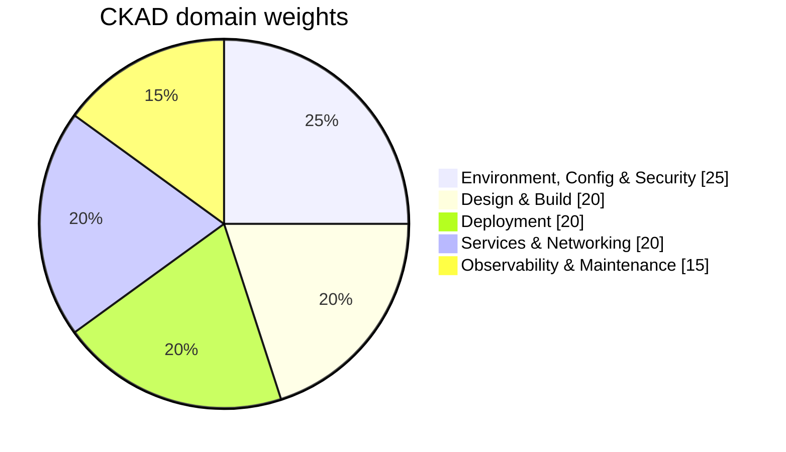

The CKAD curriculum ([cncf/curriculum](https://github.com/cncf/curriculum) — always check the version matching your exam date) is five domains. This page decodes each one: what the curriculum line *says*, what the task on your screen will actually *look like*, one worked example solved the fast way, and where on this site (and in the [official docs you're allowed to use](https://kubernetes.io/docs/)) each piece lives.



Weight ≠ difficulty. Environment/Config/Security is the biggest *and* the easiest to bank points in (its tasks are formulaic); Services & Networking is where NetworkPolicy tasks eat unprepared candidates. Study allocation advice is in the [study plan](/ckad/study-plan/).

## Domain 1: Application Design and Build (20%)

**Curriculum says:** container images; Jobs and CronJobs; multi-container pod patterns (sidecar, init); persistent and ephemeral volumes.

**Tasks look like:**

- "Create a CronJob that runs every 10 minutes, keeps 3 successful histories, and must not run concurrently."
- "Add a sidecar container that tails a log file the main container writes to a shared volume."
- "Create a PVC and mount it into a pod at /data."
- "Build/inspect an image" — image *concepts* (tags, layers) occasionally appear; deep Docker work rarely does.

**Worked example** — *"Create a Job named `hasher` in namespace `batch` that runs `sha256sum /etc/hostname` using `busybox:1.36`, completes 3 times, 2 at a time, and retries at most twice."*

```bash
kubectl create job hasher -n batch --image=busybox:1.36 \
  --dry-run=client -o yaml -- sha256sum /etc/hostname > job.yaml
vim job.yaml    # add under spec:  completions: 3, parallelism: 2, backoffLimit: 2
kubectl apply -f job.yaml
kubectl get jobs -n batch -w    # verify: COMPLETIONS 3/3
```

The generator gets you 80%; the three fields you add by hand are the actual test. `kubectl explain job.spec | less` confirms field names without leaving the terminal.

**Learn it here:** [Jobs & CronJobs](/workloads/jobs-and-cronjobs/) · [Init & Sidecar Containers](/workloads/init-and-sidecar-containers/) · [Sidecars section](/sidecars/overview/) · [Storage: PV & PVC](/stateful/storage-pv-pvc/) · [Config Files & Volumes](/workloads/config-files-and-volumes/) · Lab: [Lab 9 (StatefulSet + PVC)](/labs/lab-9-valkey/)
**Official docs to know your way around:** [Jobs](https://kubernetes.io/docs/concepts/workloads/controllers/job/) · [CronJob](https://kubernetes.io/docs/concepts/workloads/controllers/cron-jobs/) · [Persistent Volumes](https://kubernetes.io/docs/concepts/storage/persistent-volumes/) · [Sidecar containers](https://kubernetes.io/docs/concepts/workloads/pods/sidecar-containers/)

## Domain 2: Application Deployment (20%)

**Curriculum says:** Deployments and rolling updates; rollbacks; deployment strategies (blue/green, canary); Helm to deploy existing packages; Kustomize.

**Tasks look like:**

- "Update the image of deployment X, then roll back to the previous revision."
- "Scale deployment Y to 5 replicas; set maxSurge=1, maxUnavailable=0."
- "Install/upgrade a Helm release from a given chart with an overridden value."
- "Apply the kustomization in /path/to/overlay."
- Canary tasks usually mean: "create a second deployment with N replicas so ~25% of traffic hits the new version" — traffic math via replica counts behind one Service.

**Worked example** — *"Deployment `web` in namespace `prod` runs `nginx:1.26`. Update it to `nginx:1.27`, verify the rollout succeeds, then roll back."*

```bash
kubectl -n prod set image deploy/web nginx=nginx:1.27
kubectl -n prod rollout status deploy/web        # wait for "successfully rolled out"
kubectl -n prod rollout undo deploy/web
kubectl -n prod get deploy web -o jsonpath='{.spec.template.spec.containers[0].image}'
# nginx:1.26  ← verified, done
```

Know the container *name* trick: `set image deploy/web CONTAINER=IMAGE` needs the container's name (here `nginx`) — get it from `kubectl get deploy web -o jsonpath='{.spec.template.spec.containers[*].name}'` when it's not obvious.

**Learn it here:** [Deployments Deep Dive](/workloads/deployments-deep-dive/) · [Rollouts & Rollbacks](/workloads/rollouts-and-rollbacks/) · [What Triggers a Rollout](/workloads/rollout-triggers/) · [Helm section](/helm/overview/) (for the exam: [Lifecycle & Operations](/helm/lifecycle-and-operations/) and [Values & Overrides](/helm/values-and-overrides/)) · [Helm & Kustomize](/operations/helm-and-kustomize/) · [Progressive Delivery](/architectures/progressive-delivery/) (canary/blue-green concepts) · Labs: [Lab 1](/labs/lab-1-java-api/), [Lab 3](/labs/lab-3-backend-service/)
**Official docs:** [Deployments](https://kubernetes.io/docs/concepts/workloads/controllers/deployment/) · [helm.sh docs](https://helm.sh/docs/) (allowed in the exam) · [Kustomize task page](https://kubernetes.io/docs/tasks/manage-kubernetes-objects/kustomization/)

## Domain 3: Application Observability and Maintenance (15%)

**Curriculum says:** API deprecations; probes (liveness/readiness/startup); built-in CLI monitoring tools; container logs; debugging in Kubernetes.

**Tasks look like:**

- "Add a liveness probe (httpGet /healthz on 8080, initial delay 10s) and a readiness probe to this deployment."
- "Find the pod using the most CPU in namespace Z and write its name to a file."
- "This manifest uses a deprecated API version — fix it."
- "Pod Q is failing. Find out why and fix it." (The classic. Usually a bad image, a bad command, a missing ConfigMap, or a probe that can't pass.)

**Worked example** — *"Find which pod in namespace `stress` consumes the most memory and write its name to /tmp/answer.txt."*

```bash
kubectl top pods -n stress --sort-by=memory
# NAME       CPU   MEMORY
# hog-2      12m   412Mi     ← top of the list
echo "hog-2" > /tmp/answer.txt
```

`kubectl top` (metrics-server) plus `--sort-by` is the whole trick. For log tasks it's `kubectl logs`, `-c` for a container, `--previous` for the crashed one — the [triage page](/troubleshooting/triage-methodology/) makes all of this automatic.

**Learn it here:** [Health Checks](/workloads/health-checks/) + [Health Check Knobs](/tuning/health-check-knobs/) (probe fields and timing math) · [Triage Methodology](/troubleshooting/triage-methodology/) · [CrashLoopBackOff](/troubleshooting/crashloopbackoff/) · [Pod Pending](/troubleshooting/pod-pending/) · [Events](/observability/events/) · [Logging Fundamentals](/observability/logging-fundamentals/) · [API Deprecations](/operations/api-deprecations/) · Lab: [Lab 5 (break & fix)](/labs/lab-5-break-and-fix/) — the single best CKAD practice on this site
**Official docs:** [Configure probes](https://kubernetes.io/docs/tasks/configure-pod-container/configure-liveness-readiness-startup-probes/) · [Debug pods](https://kubernetes.io/docs/tasks/debug/debug-application/debug-pods/) · [Deprecated API migration guide](https://kubernetes.io/docs/reference/using-api/deprecation-guide/)

## Domain 4: Application Environment, Configuration and Security (25%)

**Curriculum says:** discover and use CRDs/operators; authentication, authorization, admission control; requests, limits, quotas; ConfigMaps and Secrets; ServiceAccounts; SecurityContexts.

The biggest domain, and the most formulaic — this is where prepared candidates bank points fast.

**Tasks look like:**

- "Create a ConfigMap from these literals; expose key A as an env var and mount the whole thing at /etc/config."
- "Create a Secret; make the pod read it as an environment variable."
- "Run this pod as UID 1000 with no privilege escalation and all capabilities dropped."
- "Create a ServiceAccount, a Role allowing get/list on pods, and bind them. Verify with kubectl auth can-i."
- "Set requests cpu=200m memory=128Mi and limits cpu=500m memory=256Mi on this deployment."
- "List the instances of CRD `backups.example.com` in namespace N." (CRD tasks are *discovery*, not authoring: `kubectl get crd`, `kubectl explain`, `kubectl get <kind>`.)

**Worked example** — *"Create a Secret `db-creds` (user=admin, pass=Sup3r!) in namespace `apps`; run pod `client` (busybox, sleep 3600) with both keys as env vars USER and PASS."*

```bash
kubectl -n apps create secret generic db-creds --from-literal=user=admin --from-literal=pass='Sup3r!'
kubectl -n apps run client --image=busybox:1.36 --dry-run=client -o yaml -- sleep 3600 > pod.yaml
vim pod.yaml    # add env: with valueFrom.secretKeyRef for USER and PASS
kubectl apply -f pod.yaml
kubectl -n apps exec client -- sh -c 'echo $USER $PASS'    # admin Sup3r!  ← verified
```

If you can't recall `secretKeyRef` syntax cold, don't guess — the docs page [Distribute Credentials Securely](https://kubernetes.io/docs/tasks/inject-data-application/distribute-credentials-secure/) has a copy-paste block; finding it should take 20 seconds (search: "secret env variable").

**Learn it here:** [Configuration](/workloads/configuration/) · [Environment Variables](/workloads/environment-variables/) · [Secrets](/workloads/secrets/) · [Config Files & Volumes](/workloads/config-files-and-volumes/) · [Resources & QoS](/workloads/resources-and-qos/) · [Pod Security](/workloads/pod-security/) · [ServiceAccounts](/workloads/serviceaccounts/) · [RBAC Explained](/start/rbac-explained/) · [CRDs Explained](/controllers/crds-explained/) · [Working Without Admin](/start/working-without-admin/) (quotas/LimitRanges) · Lab: [Lab 2 (config & secrets)](/labs/lab-2-config-and-secrets/)
**Official docs:** [ConfigMaps](https://kubernetes.io/docs/concepts/configuration/configmap/) · [Secrets](https://kubernetes.io/docs/concepts/configuration/secret/) · [SecurityContext task](https://kubernetes.io/docs/tasks/configure-pod-container/security-context/) · [RBAC](https://kubernetes.io/docs/reference/access-authn-authz/rbac/)

## Domain 5: Services and Networking (20%)

**Curriculum says:** NetworkPolicies; Services (ClusterIP, NodePort); Ingress.

**Tasks look like:**

- "Expose deployment X on port 8080 (targeting container port 80) as a ClusterIP/NodePort Service."
- "Create an Ingress routing host/path to service Y."
- "Restrict pods labeled app=db to accept traffic only from pods labeled app=api on port 5432." ← the NetworkPolicy task; the single most-failed task type on the CKAD.
- "Why can't pod A reach service B? Fix it." (Almost always: selector/label mismatch or wrong targetPort.)

**Worked example** — *"Create an Ingress `web-ing` in namespace `prod` routing `shop.example.com` path `/cart` (Prefix) to service `cart-svc` port 8080."*

```bash
kubectl -n prod create ingress web-ing \
  --rule="shop.example.com/cart*=cart-svc:8080"
kubectl -n prod describe ingress web-ing    # verify host, path, backend
```

Yes, `kubectl create ingress` exists, and yes, the `*` suffix means `pathType: Prefix`. Most candidates hand-write Ingress YAML; the generator does it in one line. For NetworkPolicy there is **no generator** — you copy the skeleton from the [NetworkPolicy docs](https://kubernetes.io/docs/concepts/services-networking/network-policies/) and edit selectors, which is exactly why the [OR-vs-AND selector semantics](/networking/network-policies/) must be understood *before* exam day, not discovered during it.

**Learn it here:** [Services Deep Dive](/networking/services-deep-dive/) · [Ingress & Routing](/networking/ingress-and-routing/) · [Network Policies](/networking/network-policies/) · [DNS](/networking/dns/) · [Service Unreachable](/troubleshooting/service-unreachable/) (the debug pattern) · [YAML, Labels & Namespaces](/start/yaml-labels-and-namespaces/) (selector wiring — the root cause of most networking task failures) · Labs: [Lab 3](/labs/lab-3-backend-service/), [Lab 4 (ingress end-to-end)](/labs/lab-4-ingress-end-to-end/)
**Official docs:** [Services](https://kubernetes.io/docs/concepts/services-networking/service/) · [Ingress](https://kubernetes.io/docs/concepts/services-networking/ingress/) · [Network Policies](https://kubernetes.io/docs/concepts/services-networking/network-policies/)

## The coverage table

Every exam-day capability, its teacher, and its practice ground — this is the checklist the [study plan](/ckad/study-plan/) sequences:

| You must be able to… | Learn it | Drill it |
|---|---|---|
| Scaffold any object imperatively | [Speed System](/ckad/speed-system/) | [Drills 1, 3, 11](/ckad/drills/) |
| Edit YAML fast, no tab characters | [Vim for the CKAD](/kubectl/vim-for-ckad/) | Vim page drills |
| Jobs / CronJobs with all the knobs | [Jobs & CronJobs](/workloads/jobs-and-cronjobs/) | [Drill 3](/ckad/drills/) |
| Multi-container pods + shared volumes | [Init & Sidecars](/workloads/init-and-sidecar-containers/) | [Drill 2](/ckad/drills/) |
| PVC + mount | [Storage: PV & PVC](/stateful/storage-pv-pvc/) | [Drill 13](/ckad/drills/) |
| Rolling update, rollback, scale | [Rollouts & Rollbacks](/workloads/rollouts-and-rollbacks/) | [Drill 5](/ckad/drills/) |
| Helm install/upgrade with values | [Helm Lifecycle](/helm/lifecycle-and-operations/) | [Lab 1](/labs/lab-1-java-api/) |
| Probes with exact timing fields | [Health Check Knobs](/tuning/health-check-knobs/) | [Drill 7](/ckad/drills/) |
| Diagnose a broken pod in ≤4 min | [Triage Methodology](/troubleshooting/triage-methodology/) | [Drill 4](/ckad/drills/), [Lab 5](/labs/lab-5-break-and-fix/) |
| ConfigMaps/Secrets, all consumption modes | [Lab 2](/labs/lab-2-config-and-secrets/) | [Drill 6](/ckad/drills/) |
| SecurityContext fields cold | [Pod Security](/workloads/pod-security/) | [Drill 8](/ckad/drills/) |
| SA + Role + RoleBinding + can-i | [RBAC Explained](/start/rbac-explained/) | [Drill 11](/ckad/drills/) |
| Requests/limits under a quota | [Resources & QoS](/workloads/resources-and-qos/) | [Drill 12](/ckad/drills/) |
| Service + Ingress, correct ports | [Services Deep Dive](/networking/services-deep-dive/) | [Drills 10](/ckad/drills/) |
| NetworkPolicy from a blank page | [Network Policies](/networking/network-policies/) | [Drill 9](/ckad/drills/) |
