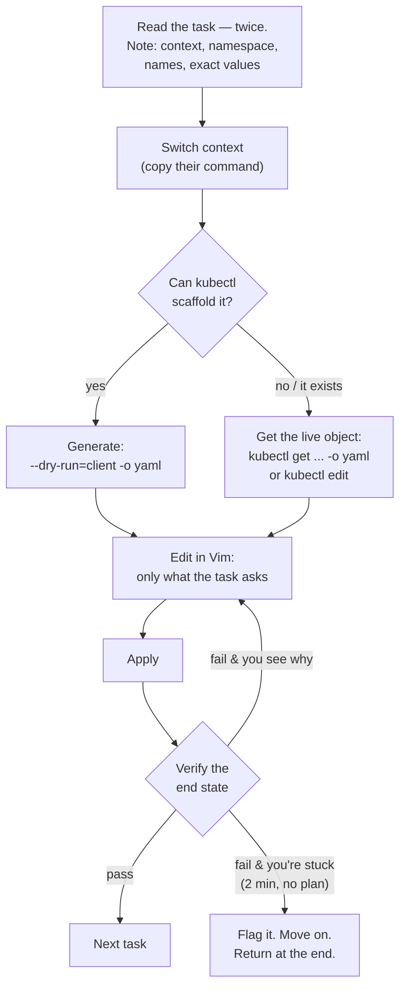

The Certified Kubernetes Application Developer exam is two hours, a terminal, live clusters, and 15–20 tasks. No multiple choice, no trivia — you are graded on the **end state of real clusters** after you've typed real commands. That makes it one of the most honest certifications in the industry, and it makes preparing for it refreshingly concrete: if you can do the tasks fast, you pass. If you can't, no amount of flashcards saves you.

This track is the exam-specific layer on top of a site that already teaches the substance. The [domain map](/ckad/exam-domains/) routes every curriculum line to the deep-dive page that covers it; the [speed system](/ckad/speed-system/) and [Vim guide](/kubectl/vim-for-ckad/) build the mechanics; the [study plan](/ckad/study-plan/) sequences it; the [timed drills](/ckad/drills/) tell you when you're ready.

## The numbers that matter

| Fact | Value | Where it's official |
|---|---|---|
| Duration | 2 hours | [CKAD exam page](https://www.cncf.io/training/certification/ckad/) |
| Tasks | ~15–20 weighted, hands-on | [Candidate handbook](https://docs.linuxfoundation.org/tc-docs/certification/lf-handbook2) |
| Passing score | 66% | Candidate handbook |
| Retake | One free retake included | CKAD exam page |
| Practice exam | Two [killer.sh](https://killer.sh/) sessions included with registration | CKAD exam page |
| Certification validity | 24 months | [Renewal policy](https://training.linuxfoundation.org/certification/certified-kubernetes-application-developer-ckad/) |
| Kubernetes version | Tracks a recent minor release — check the exam page before you book | CKAD exam page |
| Allowed resources | One browser tab: `kubernetes.io/docs`, `kubernetes.io/blog`, `helm.sh/docs` | [Exam rules](https://docs.linuxfoundation.org/tc-docs/certification/tips-cka-and-ckad) |

Prices and bundles change; check the official page rather than any blog post (including this one). What doesn't change: **66% with partial credit is a forgiving bar for someone fast, and a brutal one for someone slow.** Everything in this track optimizes for speed with correctness, in that order of teaching but the reverse order of grading.

## What the exam actually tests

The curriculum ([cncf/curriculum](https://github.com/cncf/curriculum)) lists five domains — Pods, Deployments, probes, ConfigMaps, NetworkPolicies and friends. The [domain map](/ckad/exam-domains/) covers those in full. But the exam *really* tests three meta-skills the curriculum never names:

**1. kubectl speed.** Nearly every task starts with an object that `kubectl create` or `kubectl run` can scaffold in one line. Candidates who type YAML from scratch run out of time; candidates who generate, edit, apply finish with 20 minutes to spare. This is a trainable mechanical skill — the [speed system](/ckad/speed-system/) is the training program, and [Output and Queries](/kubectl/output-and-queries/) is the deeper background.

**2. YAML fluency under a terminal editor.** You will edit manifests in Vim, in a remote desktop, under time pressure. Indentation mistakes are the #1 self-inflicted wound. The [Vim for the CKAD](/kubectl/vim-for-ckad/) guide exists because of exactly this; read it early, not the night before.

**3. Triage discipline.** Several tasks hand you something broken — a pod that won't start, a service with no endpoints — and the wrong instinct (staring at YAML, guessing) burns ten minutes. The right instinct is a fixed diagnostic order: describe, events, logs. That's this site's home turf: [Triage Methodology](/troubleshooting/triage-methodology/) is the exam skill, learned on real problems.

## The exam environment

You take the exam through PSI's remote proctoring: a browser-based **remote Linux desktop** (XFCE) containing a terminal and a Firefox window restricted to the allowed docs sites. Not your terminal, not your dotfiles, not your clipboard manager. Things worth knowing before you're surprised by them at minute one:

- **Multiple clusters, preset contexts.** Each task tells you which context to use and gives you the exact `kubectl config use-context ...` command to copy. Run it *every task, every time* — solving the right problem on the wrong cluster scores zero and is the most common silent point-loss on the exam.
- **Copy/paste works but differently.** In the exam terminal it's typically `Ctrl+Shift+C` / `Ctrl+Shift+V` (or right-click). Practice copying from a docs page into a terminal Vim — that's the workflow, and it has [two traps](/kubectl/vim-for-ckad/#the-two-paste-traps).
- **The environment is pre-configured** — recent exam images ship with `kubectl` completion and the `k` alias. Know how to set them up in twenty seconds anyway (the [exam tips page](https://docs.linuxfoundation.org/tc-docs/certification/tips-cka-and-ckad) documents what's preinstalled); assume nothing, verify with one `alias` command.
- **One monitor, clean desk, ID check.** The proctoring requirements in the [candidate handbook](https://docs.linuxfoundation.org/tc-docs/certification/lf-handbook2) are strict and enforced. Read them the week before, not the hour before — check-in can eat 30 minutes.

## Anatomy of a question

Every task on the exam yields to the same loop. Drill it until it's a reflex:

Two of those boxes fail people more than all the others combined: **skipping the context switch** and **skipping verification**. The exam grades end state — a Deployment that exists but never became Ready, a NetworkPolicy with a selector that matches nothing, both *look* done and score partial or zero. Verification commands per resource type are in the [speed system](/ckad/speed-system/#verify-like-the-grader).

## How scoring works (and how to exploit it)

- **Tasks are weighted** — a fiddly multi-part task might be worth 8%, a one-liner 2%. The weight is shown on each question. Spend time proportionally.
- **Partial credit is real.** A task with four sub-steps scores the sub-steps you completed. Never leave a task untouched because you can't finish it — do the parts you can, flag it, move on.
- **There's no penalty for wrong answers**, only for time you spent producing them. The flag-and-return discipline in the diagram above is worth more points than any single piece of knowledge.
- **66% with partial credit** means you can completely fail a third of the exam and pass. Internalize that — it's the antidote to the panic spiral when task 3 is a mystery. Skip it. It was worth 5%.

## The exam-day playbook

**The week before:** do [killer.sh](https://killer.sh/) session one (it's *harder* than the real exam — a humbling score there is normal and useful). Run the check-in tech requirements (webcam, ID, network). Re-read the [exam rules](https://docs.linuxfoundation.org/tc-docs/certification/tips-cka-and-ckad).

**Minute zero (before question one):** thirty seconds of setup — verify the `k` alias and completion, write [the four-line vimrc](/kubectl/vim-for-ckad/#minute-zero-the-vimrc), `export KUBE_EDITOR=vim`. This investment repays itself by task three.

**During:** budget ~6–7 minutes per task average. First pass: do everything you can do confidently, flag the rest. Second pass: flagged tasks in weight order. Read each task **twice** before typing — half of "hard" exam tasks are hard because the candidate solved a slightly different task than the one asked.

**Last ten minutes:** stop starting new work. Sweep your flagged list for partial credit — even creating the object without the tricky option scores something. Verify anything you're unsure you verified.

**After:** results arrive by email within 24 hours. If it's a fail, the score report shows per-domain percentages — that plus your free retake makes the second attempt a targeted strike, not a rematch.

## Where to go from here

1. **[The Five Domains, Mapped](/ckad/exam-domains/)** — what's on the exam, task by task, with the site pages that teach each piece.
2. **[The Speed System](/ckad/speed-system/)** — imperative kubectl, scaffolding, docs discipline, time management.
3. **[Vim for the CKAD](/kubectl/vim-for-ckad/)** — the editor kit; twenty commands, three config lines.
4. **[The Study Plan](/ckad/study-plan/)** — four weeks (or two, compressed), day by day, using this site's [labs](/labs/overview/).
5. **[Timed Drills](/ckad/drills/)** — thirteen exam-style tasks with par times and solutions. Your readiness meter.
