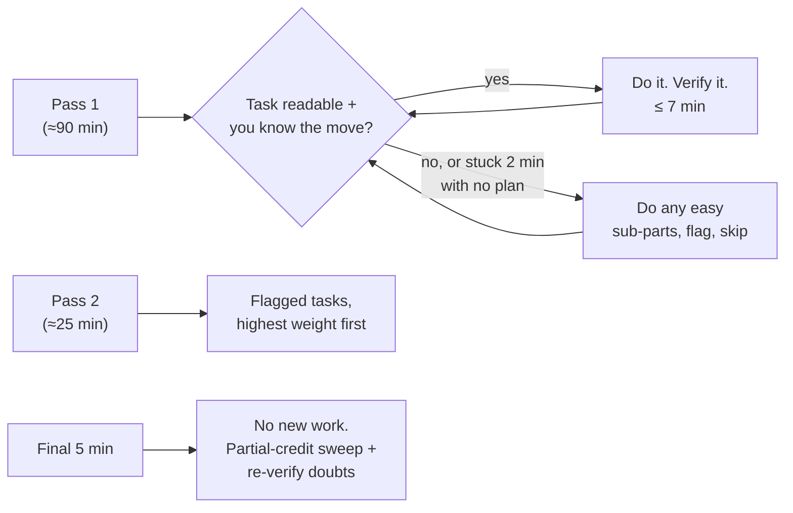

The CKAD gives you ~6–7 minutes per task. A candidate who hand-writes YAML spends 5 of those minutes typing boilerplate and 2 debugging their own indentation. A candidate with a speed system spends 1 minute generating, 2 editing, 1 verifying — and banks the rest. Same knowledge, double the score.

The system has five parts: **generate, look up, switch, verify, budget**. Each is a habit you drill until it costs zero thought. (The sixth part — editing fast in Vim — has [its own page](/kubectl/vim-for-ckad/).)

## Part 1: Generate — never type boilerplate

Every generator below emits a correct, current-apiVersion skeleton with `--dry-run=client -o yaml`. Memorize the *left column*; the YAML it saves you is the whole game. (Background on why these work: [Tips and Tricks](/kubectl/tips-and-tricks/).)

| You need | One line |
|---|---|
| Pod | `k run web --image=nginx:1.27 --dry-run=client -o yaml > p.yaml` |
| Pod + env/labels/port | `k run web --image=nginx:1.27 --env=MODE=prod --labels=app=web --port=80 ...` |
| Pod with command | `k run bb --image=busybox:1.36 --dry-run=client -o yaml -- sh -c 'sleep 3600' > p.yaml` |
| Deployment | `k create deploy web --image=nginx:1.27 --replicas=3 --dry-run=client -o yaml > d.yaml` |
| Job | `k create job hasher --image=busybox:1.36 --dry-run=client -o yaml -- sha256sum /etc/hostname > j.yaml` |
| CronJob | `k create cronjob cleaner --image=busybox:1.36 --schedule='*/15 * * * *' --dry-run=client -o yaml -- echo clean > cj.yaml` |
| Service for a deploy | `k expose deploy web --name=web-svc --port=8080 --target-port=80` |
| NodePort service | `k expose deploy web --type=NodePort --port=80` |
| Ingress | `k create ingress web-ing --rule="shop.local/cart*=cart-svc:8080"` |
| ConfigMap | `k create cm app-cfg --from-literal=LOG_LEVEL=debug --from-file=config.properties` |
| Secret | `k create secret generic db --from-literal=pass='S3cret!'` |
| ServiceAccount | `k create sa reporter` |
| Role | `k create role pod-reader --verb=get,list --resource=pods` |
| RoleBinding | `k create rolebinding rb --role=pod-reader --serviceaccount=drills:reporter` |
| ResourceQuota | `k create quota team-q --hard=pods=10,requests.cpu=2` |
| PVC | *(no generator — copy from the [PV docs page](https://kubernetes.io/docs/concepts/storage/persistent-volumes/); it's 8 lines)* |
| NetworkPolicy | *(no generator — copy from the [NetworkPolicy docs](https://kubernetes.io/docs/concepts/services-networking/network-policies/); edit selectors)* |

Three habits that compound the table:

- **Add `-n <ns>` to the generator itself** so the namespace is baked into the YAML — forgetting the namespace on `apply` is a classic silent zero.
- **When the object already exists**, don't rebuild it: `k edit deploy/web` for small changes, or `k get deploy web -o yaml > d.yaml` → edit → apply for big ones. Know the difference in cost: `edit` is faster but gives you one shot; the file gives you a retry loop. (What `edit` actually does: [How kubectl Actually Works](/kubectl/how-kubectl-works/).)
- **For single-field changes, skip the editor entirely**: `k set image deploy/web nginx=nginx:1.27`, `k scale deploy/web --replicas=5`, `k set env deploy/web MODE=prod`, `k label pod web tier=frontend`, `k set resources deploy web --requests=cpu=200m,memory=128Mi --limits=cpu=500m,memory=256Mi`. Each replaces a full edit round-trip.

## Part 2: Look up — explain before you browse

The docs tab is allowed, but it's the *slow* path — page loads, searching, scrolling. Your first lookup tool is built into kubectl and answers 80% of field questions in five seconds:

```bash
k explain job.spec | less                          # what fields exist here?
k explain deploy.spec.strategy.rollingUpdate      # exact field names + docs
k explain pod.spec.containers.livenessProbe --recursive | less   # full subtree
k explain cronjob.spec.jobTemplate.spec --recursive | less       # nesting answered
```

`--recursive` is the killer flag: it prints the whole field tree, so "is it `TerminationGracePeriodSeconds` on the pod or the probe?" gets answered without a browser. Full treatment: [Tips and Tricks](/kubectl/tips-and-tricks/).

**When you do open the docs**, search with the term the docs use, land, and copy the *smallest working block*: "network policy" → the deny-all + allow examples; "secret env" → Distribute Credentials Securely; "persistent volume claim" → the PVC block; "liveness readiness" → the probes task page. During [study-plan](/ckad/study-plan/) practice, do every lookup through the real docs so exam-day muscle memory is honest — no bookmarks exist in the exam browser, only search.

## Part 3: Switch — the context ritual

Every task states its context and gives you the command. The ritual, without exception, even when the context "should" already be right:

```bash
kubectl config use-context k8s-c2          # copy THEIR command, run it
kubectl config set-context --current --namespace=prod    # if the task lives in one ns
```

Setting the namespace into the context beats typing `-n prod` twelve times — and beats *forgetting* it once, which is worse. When a task doesn't name a namespace, it means `default` — but the *previous* task may have left your context pointed elsewhere. The ritual exists because points die in that gap. (Contexts demystified: [How kubectl Actually Works](/kubectl/how-kubectl-works/).)

## Part 4: Verify like the grader

The exam grades **end state**. "I applied it" is not "it works." Ten seconds of verification per task converts silent zeros into points — and the verification command is different per resource:

| You created | Verify with | You're looking for |
|---|---|---|
| Pod | `k get pod X` then `k describe pod X` if not Running | `Running`, `READY 1/1` |
| Deployment | `k rollout status deploy/X` | "successfully rolled out" |
| Job | `k get job X` | `COMPLETIONS 3/3` |
| CronJob | `k create job --from=cronjob/X test-run` | the spawned job completes |
| Service | `k get endpoints X` | **non-empty endpoints** — empty means selector mismatch |
| Ingress | `k describe ingress X` | host, path, backend, and backend *exists* |
| ConfigMap/Secret in a pod | `k exec X -- env` / `k exec X -- cat /path` | the actual value |
| NetworkPolicy | `k describe netpol X` | selector matches real pods: `k get pods -l app=db` |
| RBAC | `k auth can-i list pods --as=system:serviceaccount:ns:sa -n ns` | `yes` — and a should-fail check says `no` |
| SecurityContext | `k exec X -- id` | uid/gid the task asked for |
| Probes | `k describe pod X \| grep -A3 Liveness` | fields present, and pod still Ready |

The two highest-value rows are **Service → endpoints** (the empty-endpoints selector mismatch is the most common exam networking failure — same failure, same fix as production: [Service Unreachable](/troubleshooting/service-unreachable/)) and **auth can-i**, which proves an RBAC task end-to-end in one line.

## Part 5: Budget — the time algorithm

120 minutes, ~16 weighted tasks. The algorithm:



Rules that make it work:

- **The 2-minute stuck rule.** Stuck means *no plan*, not *typing slowly*. If two minutes pass without a concrete next command, flag and move. A 4%-weight task is never worth 15 minutes while three 6% tasks sit untouched.
- **Weight-check before deep-diving.** A gnarly 3-part task at 9% deserves the fight; the same gnarliness at 3% doesn't.
- **Never leave a task blank.** Create the object without the hard option; apply the manifest that's 80% right. Partial credit is scored per sub-step.
- **Don't gold-plate.** The task says readiness probe; it did not say liveness probe, resource limits, and labels. Extra work earns zero extra points and costs the scarce resource.

## The time sinks (know thine enemy)

1. **Hand-writing YAML** that a generator emits. (Part 1 exists for this.)
2. **The tab character.** One invisible tab, one `found a character that cannot start any token`, five minutes of staring. [The four-line vimrc](/kubectl/vim-for-ckad/#minute-zero-the-vimrc) makes it impossible — set it up at minute zero.
3. **Wrong context/namespace.** Solving it perfectly, elsewhere. (Part 3.)
4. **Debugging your own typo in a name.** The task says `web-svc`; you typed `websvc`; graders match exactly. Copy names from the task text — never retype them.
5. **Doc-diving for something `explain` answers.** (Part 2.)
6. **Perfectionism on a working answer.** Verified = done = next task.

## Drilling the system

The system only pays off as reflex, and reflexes come from repetitions against a real cluster ([Lab 0](/labs/lab-0-cluster/) gives you one in 20 minutes; [kind or minikube](/start/local-development/) work too). That's what the [timed drills](/ckad/drills/) are for — every drill has a par time calibrated to exam pace, and the [study plan](/ckad/study-plan/) schedules three full rounds of them.
