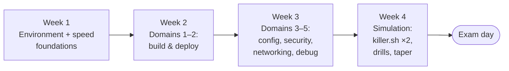

Four weeks, roughly an hour a day on weekdays and a longer weekend block — that's the honest budget for someone who uses Kubernetes occasionally and wants to pass comfortably, not squeak by. Already deploying to Kubernetes weekly? Use the [two-week compression](#the-two-week-compression) below. Never touched a cluster? Do [Track 1](/learning-paths/#1-new-to-deploying-on-kubernetes) first — this plan assumes you know what a Deployment *is* and drills what the exam needs you to *do*.

Two principles shape everything here:

1. **Hands on keyboard beats reading, 3:1.** Every session ends with you typing against a real cluster. [Lab 0](/labs/lab-0-cluster/) builds you a free k3s cluster on your Mac in ~20 minutes; [kind or minikube](/start/local-development/) are fine substitutes. Reading about `kubectl create ingress` is worth a tenth of having run it.
2. **Time pressure is a trained skill.** From week 2 on, everything is done against a timer. The exam doesn't test whether you can create a NetworkPolicy; it tests whether you can create one *in seven minutes while slightly stressed*.

## Week 1 — Environment and speed foundations

Goal: a practice cluster, a configured editor, and the imperative-kubectl reflex. No exam content yet — pure mechanics, because they multiply everything after.

| Day | Do | Time |
|---|---|---|
| 1 | Read the [survival guide](/ckad/overview/); book your exam **now** (a date on the calendar is the best study aid ever invented); skim the [official curriculum](https://github.com/cncf/curriculum) | 45m |
| 2 | Build your practice cluster: [Lab 0](/labs/lab-0-cluster/). Verify `kubectl get nodes` works | 60m |
| 3 | [Vim for the CKAD](/kubectl/vim-for-ckad/) — read it, set up the vimrc, do drills 1–3 on that page | 60m |
| 4 | [The Speed System](/ckad/speed-system/) Part 1: run *every* generator in the table against your cluster, twice | 60m |
| 5 | Speed System parts 2–4: `kubectl explain --recursive` on five objects; the verification table, hands-on | 45m |
| 6–7 | Weekend block: [Lab 1](/labs/lab-1-java-api/) end to end (image → chart → deploy). If Helm is new, read [Helm Overview](/helm/overview/) alongside | 2–3h |

**Exit criteria:** you can create a pod, deployment, service, configmap, and job imperatively without notes; you can paste YAML into Vim, fix its indentation with `V`+`>`, and apply it — all without touching a mouse.

## Week 2 — Domains 1 and 2: build and deploy (40% of the exam)

Read the [domain map](/ckad/exam-domains/) sections for both domains first, then:

| Day | Do | Time |
|---|---|---|
| 1 | [Jobs & CronJobs](/workloads/jobs-and-cronjobs/) + create a Job and CronJob with completions/parallelism/history limits from memory | 60m |
| 2 | [Init & Sidecar Containers](/workloads/init-and-sidecar-containers/) + build the shared-volume logger pod ([Drill 2](/ckad/drills/)) untimed | 60m |
| 3 | [Storage: PV & PVC](/stateful/storage-pv-pvc/) + PVC-and-mount by hand ([Drill 13](/ckad/drills/) untimed) | 45m |
| 4 | [Rollouts & Rollbacks](/workloads/rollouts-and-rollbacks/) + [Rollout Triggers](/workloads/rollout-triggers/); practice `set image` → `rollout status` → `undo` until it's one breath | 60m |
| 5 | Helm for the exam: [Lifecycle & Operations](/helm/lifecycle-and-operations/) + [Values & Overrides](/helm/values-and-overrides/); `helm install/upgrade --set/uninstall` a public chart; skim [Helm & Kustomize](/operations/helm-and-kustomize/) and run `kubectl apply -k` on a toy overlay | 75m |
| 6–7 | Weekend: [Lab 3](/labs/lab-3-backend-service/); then **first timed run of [Drills](/ckad/drills/) 1–5**. Record times vs par | 2–3h |

**Exit criteria:** Drills 1–5 all complete correctly within 1.5× par. Rolling update + rollback takes you under 3 minutes including verification.

## Week 3 — Domains 3, 4, 5: config, security, networking, debugging (60% of the exam)

The heaviest week — it covers the biggest domain (config/security, 25%) and the most-failed one (networking).

| Day | Do | Time |
|---|---|---|
| 1 | [Lab 2](/labs/lab-2-config-and-secrets/) — ConfigMaps and Secrets every way they can be consumed. This lab *is* domain 4's core | 90m |
| 2 | [Pod Security](/workloads/pod-security/) + [ServiceAccounts](/workloads/serviceaccounts/); build the SecurityContext pod ([Drill 8](/ckad/drills/)) untimed | 60m |
| 3 | [RBAC Explained](/start/rbac-explained/) + the SA/Role/Binding/can-i loop ([Drill 11](/ckad/drills/)) until it's mechanical; skim [CRDs Explained](/controllers/crds-explained/) for the discovery commands | 75m |
| 4 | [Health Checks](/workloads/health-checks/) + [Health Check Knobs](/tuning/health-check-knobs/); add probes to a live deployment three times; [Resources & QoS](/workloads/resources-and-qos/) + `set resources` | 60m |
| 5 | [Network Policies](/networking/network-policies/) — the OR-vs-AND semantics, then write deny-all, allow-DNS, and app-to-db policies from the docs page ([Drill 9](/ckad/drills/) untimed). The most valuable single hour of the month | 75m |
| 6 | [Services Deep Dive](/networking/services-deep-dive/) + [Ingress & Routing](/networking/ingress-and-routing/); [Lab 4](/labs/lab-4-ingress-end-to-end/) if time allows | 90m |
| 7 | **[Lab 5 (Break & Fix)](/labs/lab-5-break-and-fix/)** — the closest thing on this site to real exam debugging tasks. Do every drill in it. Follow with [Triage Methodology](/troubleshooting/triage-methodology/) as the debrief | 2h |

**Exit criteria:** timed run of Drills 6–13, all correct within 1.5× par; you can write a NetworkPolicy from the docs skeleton in under 8 minutes; `kubectl auth can-i --as=system:serviceaccount:...` comes out of your fingers without reference.

## Week 4 — Simulation and taper

| Day | Do | Time |
|---|---|---|
| 1 | **[killer.sh](https://killer.sh/) session 1** — full 2 hours, exam conditions (one screen, docs tab only, no pausing). Expect to score *badly*; killer.sh is deliberately harder than the real exam | 2h |
| 2 | Review every killer.sh task you missed — redo each one yourself before reading their (excellent) solutions | 90m |
| 3 | Full timed run of **all 13 [drills](/ckad/drills/)** back-to-back — target ≥80% within par | 90m |
| 4 | Patch your two weakest areas from days 1–3 using the [domain map](/ckad/exam-domains/) links; re-drill just those | 60m |
| 5 | **killer.sh session 2** (same environment stays available; a fresh full run). Score should jump markedly | 2h |
| 6 | Light review: re-read the [speed system](/ckad/speed-system/), the [exam-day playbook](/ckad/overview/#the-exam-day-playbook), and the [vim exam-day card](/kubectl/vim-for-ckad/#the-exam-day-card). Verify your webcam/ID/room against the [candidate handbook](https://docs.linuxfoundation.org/tc-docs/certification/lf-handbook2) | 45m |
| 7 | **Rest.** Seriously. The exam rewards a fast, calm brain more than one more NetworkPolicy rep | 0m |

## The daily template

Whatever the day's topic, the shape is the same:

1. **10 min — recall, not reread.** Yesterday's topic, from memory, at the terminal: "create a CronJob with a history limit" — did your fingers remember?
2. **15–20 min — read** the day's linked page(s).
3. **25–30 min — hands on keyboard** doing the day's build/drill.
4. **5 min — log it.** One line: what was slow, what needed a lookup. Friday-you patches what Monday-you logged.

## The two-week compression

For the already-fluent: keep weeks 1 and 4 nearly intact (mechanics and simulation are the non-negotiables), compress the middle.

- **Days 1–2:** Week 1's days 1–5 (environment, Vim, speed system) in two evenings.
- **Days 3–7:** One domain per day from the [domain map](/ckad/exam-domains/), reading only what's unfamiliar, drilling everything: D1+D2 (day 3–4), D4 (day 5), D5 (day 6), D3 + [Lab 5](/labs/lab-5-break-and-fix/) (day 7).
- **Days 8–14:** Week 4 unchanged, plus a full drill round on day 10.

If Drills 9 and 11 (NetworkPolicy, RBAC) aren't clean by day 10 — those two topics predict pass/fail better than any others — spend day 11 on them alone.

## The final 48 hours

- **T-48h:** last hard practice (drills round or killer.sh review). After this, no new topics — new material this late converts confidence into noise.
- **T-24h:** logistics only. Exam rules re-read, room prepped (clear desk, no second monitor, ID ready), PSI system check run from the actual machine and network you'll use.
- **T-1h:** early check-in (it can take 30 minutes). Water, empty desk, bathroom.
- **T-0:** minute-zero setup ([vimrc](/kubectl/vim-for-ckad/#minute-zero-the-vimrc), `KUBE_EDITOR`, alias check) — then task one, [the loop](/ckad/overview/#anatomy-of-a-question), and the knowledge that 66% with partial credit is a very reachable bar for the person who did this plan.

**After you pass:** the skills this plan trained — imperative speed, triage order, verification habits — are daily-driver skills, not exam tricks. [Learning Paths](/learning-paths/) is the map to the rest of the site; [Carrying the Pager](/learning-paths/#4-carrying-the-pager) is the natural next track.
