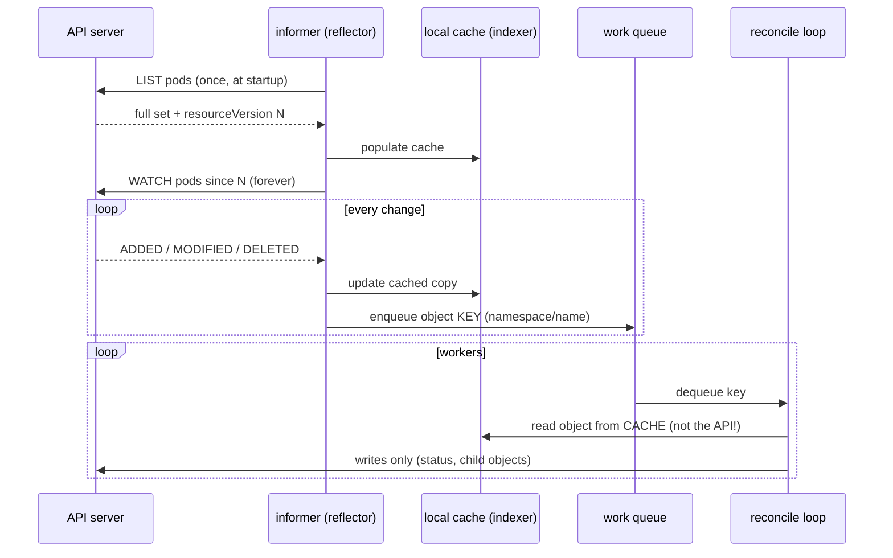
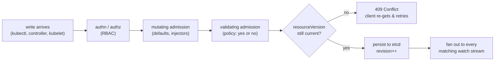

[Reconciliation](/controllers/reconciliation/) tells you the big idea: controllers watch desired state and drive actual state toward it, forever. This page is about the word *watch* in that sentence — because taken literally, the idea is absurd. A cluster runs dozens of controllers, every kubelet, every scheduler replica, all needing to know about changes to thousands of objects within milliseconds. If each of them polled the API server, the control plane would melt; if each read went to etcd, etcd would melt first. **The reason Kubernetes works at all is a stack of machinery — resourceVersions, watch streams, informer caches, work queues, optimistic concurrency, leader leases — that turns "everyone watches everything" from a horror story into a rounding error.** That machinery also generates half the mysterious messages in your logs: `the object has been modified; please apply your changes to the latest version`, `too old resource version`, a Deployment that says `Progressing` while nothing visibly happens. By the end of this page each of those will be a sentence you can finish.

## One door: the API server

Every component you've met — kubectl, the kubelet, the scheduler, every controller, your CI pipeline — speaks to the cluster the same way: **the Kubernetes API is the only door, and everything is a client.** There is no back channel; the scheduler learns about new pods exactly the way `kubectl get pods --watch` does, with the same REST verbs on the same resource paths ([how kubectl works](/kubectl/how-kubectl-works/) walks the client side; [how Kubernetes works](/start/how-kubernetes-works/) the whole loop). This uniformity is why [CRDs](/controllers/crds-explained/) are possible — a new resource type instantly gets watches, RBAC, `kubectl` support, and everything else on this page for free — and it's why the API server's *own* mechanics leak into every component's behavior.

Beneath the API server sits etcd, and one etcd concept explains most of what follows. **etcd maintains a single, cluster-wide, monotonically increasing revision counter — every write bumps it — and etcd can stream all changes to a key prefix since a given revision** (the [etcd API's](https://etcd.io/docs/latest/learning/api/) watch primitive). The API server is etcd's translator and bouncer: it converts REST into key-value operations (`/registry/pods/my-ns/my-pod`), holds its own watch cache so a thousand clients watching pods cost etcd one watch, and stamps every object it serves with a version derived from that revision counter.

## resourceVersion: the number behind the curtain

That stamp is `metadata.resourceVersion`, and it is the most misunderstood field in the API. What it **is**: an opaque token from etcd's revision counter, changing on every modification to the object. What it is **not**: a timestamp, a counter of *this object's* edits, or a number you may do arithmetic on — the [API concepts documentation](https://kubernetes.io/docs/reference/using-api/api-concepts/#resource-versions) is blunt that clients must treat it as opaque, comparing only for equality. (It generally *looks* like an integer that jumps in odd increments — that's the cluster-wide counter showing through, counting everyone's writes, not yours.)

Its two jobs:

**Job one — optimistic concurrency.** When you submit an update, the object you send carries the resourceVersion you read. The API server accepts the write only if the object *still has that version*; if anyone modified it in between, you get HTTP 409 Conflict and the message that launched a thousand stack-overflow questions:

```text
Error from server (Conflict): Operation cannot be fulfilled on deployments.apps
"web": the object has been modified; please apply your changes to the latest version
and try again
```

This is not an error in the moral sense — **it's the machinery working**: no locks were held, nobody waited, and a lost update was refused rather than silently absorbed. The standard response is the retry-on-conflict loop: re-GET, re-apply your change to the fresh copy, re-submit. Every well-written controller does this (client-go ships `RetryOnConflict` as a first-class helper), which is why occasional 409s in controller logs are noise and *sustained* 409s mean two actors are genuinely fighting over one object — two controllers with overlapping jurisdiction, or a human and a GitOps tool locked in a wrestling match.

**Job two — the watch cursor.** Which is the next section.

## Watch: the long-lived GET that runs the cluster

Polling asks "what's the state now?" over and over, paying full price for mostly-identical answers. Watching asks once, then subscribes to the *diffs*. On the wire, a watch is beautifully unsophisticated: **an ordinary HTTP GET with `?watch=true`, whose response simply never ends** — the API server holds the connection open and writes one JSON line per change:

```bash
kubectl proxy &   # authenticated tunnel to the API server on localhost:8001
curl -N 'http://localhost:8001/api/v1/namespaces/default/pods?watch=true&resourceVersion=182034988'
```

```text
{"type":"ADDED","object":{"kind":"Pod","metadata":{"name":"web-7d4b9","resourceVersion":"182035102",...}}}
{"type":"MODIFIED","object":{...}}
{"type":"DELETED","object":{...}}
{"type":"BOOKMARK","object":{"kind":"Pod","metadata":{"resourceVersion":"182036411"}}}
```

The `resourceVersion` you pass is the cursor: *send me everything after this point*. Each event carries the object's new version, so the client always knows where it's caught up to. `BOOKMARK` events are heartbeat-cursors — periodic "you're now current to version X" markers with no payload, so an idle watcher's cursor doesn't go stale. Underneath it all is one long-lived TCP connection ([what that means](/foundations/tcp-connections/)), subject to every idle-timeout and middlebox pathology in [Long-Lived Connections](/networking/long-lived-connections/) — which is why client libraries treat watch drops as routine and resume from the last seen version, and why an aggressive proxy between a controller and its API server causes relist churn rather than outages.

But cursors expire. The API server's watch cache holds a bounded history; ask to resume from a version that's scrolled out and you get the second famous message:

```text
Expired: too old resource version: 182034988 (182099421)
```

HTTP 410 Gone. The client's recovery is **relist**: LIST everything fresh (obtaining the current version) and start a new watch from there. Routine in small doses; in a large cluster, a mass reconnection (API server restart, network blip) triggering thousands of simultaneous relists is a genuine thundering herd, and much of the API machinery's evolution — bookmarks, paginated lists, the watch cache itself, streaming lists — exists to blunt exactly that.

## Informers: LIST once, WATCH forever, read locally

Raw watches still leave every client hand-rolling the same bookkeeping, so client-go packages the whole pattern as the **informer** — the load-bearing abstraction of the entire controller ecosystem:



**LIST once, WATCH forever, serve all reads from the local cache, and hand reconcile loops only a key.** The consequences cascade:

- **Controllers almost never GET.** Reads hit the in-memory cache; the API server sees each controller as one LIST at startup plus one idle watch stream. This — not raw horsepower — is how one API server serves thousands of clients.
- **The cache is slightly stale, by design.** Your reconcile might read a version of the object from a few milliseconds (or, mid-relist, seconds) ago. This is why the [reconciliation page's](/controllers/reconciliation/) insistence on *level-triggered* logic is load-bearing and not stylistic: a reconcile written as "observe full desired state, converge actual state, tolerate seeing the same thing twice" is immune to staleness — it'll be invoked again when the cache catches up. A reconcile written as "react to this specific edge" corrupts state the first time an event is coalesced or arrives stale. It's also the mundane explanation for small lags everywhere — like [HPA decisions](/troubleshooting/hpa-not-scaling/) trailing reality by a beat: every controller acts on its cache's view, not on now.
- **Shared informers** dedupe within a process: fifty controllers in kube-controller-manager watching pods share *one* pod watch and one cache, with fifty event handlers fanned out. One watch per resource type per process is the rule of thumb for the API server's load model.

The work queue between events and workers is doing quiet, essential work of its own. It **dedups** (an object modified ten times while queued is reconciled once — you process states, not events), and it **rate-limits per key with exponential backoff**: a failing object is retried at ~5–10 ms, then doubling — 20 ms, 40 ms, 80 ms... — capped at a few minutes, while every *other* key flows normally. You have seen this in logs without naming it: an error for the same object repeating at exactly-doubling intervals, settling into a steady every-few-minutes grumble. **Doubling error intervals are the work queue's signature** — the controller is fine; one object is stuck, and the backoff is quarantining it.

## Leader election: many replicas, one actor

Controller managers run multiple replicas for availability — but reconciliation must be single-writer, or two replicas would race each other creating the same child objects. The mechanism is **leader election via the Lease object** (`coordination.k8s.io/v1`, [documented here](https://kubernetes.io/docs/concepts/architecture/leases/)): a small record naming the current leader (`holderIdentity`) and when it last renewed. The leader re-acquires on a timer (default ~every 10 s); standbys watch, and if the lease goes unrenewed past its duration (~15 s), one of them takes over — winning the race via, fittingly, an optimistic-concurrency update on the Lease itself. Only the leader runs reconcile loops; the rest idle warm.

```bash
kubectl get lease -n kube-system
```

```text
NAME                      HOLDER                                        AGE
kube-controller-manager   cp-1_2f9c1e7a-...                             340d
kube-scheduler            cp-1_88ab310c-...                             340d
```

That command is a genuinely useful triage move: it answers "which replica is actually doing the work, and is it renewing?" for any leader-elected component, including [operators](/controllers/operators/) built with controller-runtime.

Honesty section: **a Lease is a lock only in the optimistic sense — it does not fence.** Two failure modes matter. *Clock skew*: renewal math compares timestamps, and a node with a drifting clock can believe its lease is valid after everyone else has moved on ([time](/foundations/time/) covers why clocks disagree more than you'd like). *The unfinished write*: a deposed leader — GC pause, network partition — may have an in-flight API write that lands *after* the new leader took over. Kubernetes survives this gracefully-degraded rather than perfectly: the write hits optimistic concurrency (stale resourceVersion → 409), and reconciliation's idempotence mops up whatever slips through. Duplicate-tolerant convergence, not distributed-systems perfection, is the design bet — one worth remembering when you build [operators](/controllers/operators/) whose side effects leave the cluster (payments, emails, external APIs), because *those* don't get 409s.

## The write path: admission, apply, and who owns which field

One diagram for what happens to every write, from anyone, before it becomes truth:



Mutating [admission webhooks](/controllers/admission-webhooks/) get to *edit* your object (inject sidecars, set defaults); validating ones only veto; only then does the optimistic-concurrency check gate persistence, and the etcd write's new revision fans out to every informer in the fleet. When a webhook is slow or down, this diagram is why *everything* feels broken — it sits in the write path of every object it matches.

Two refinements on writes, briefly. **Server-side apply** ([docs](https://kubernetes.io/docs/reference/using-api/server-side-apply/)) makes field ownership explicit: every field of every object records a *field manager* (peek with `kubectl get deploy web -o yaml --show-managed-fields`). Apply means "make the fields I own look like this," letting your GitOps tool own `spec.template` while the HPA owns `spec.replicas` without conflicts — and turning genuine tugs-of-war into explicit apply conflicts naming both owners, instead of silent overwrites. And **finalizers** are the deletion handshake: deletion is a two-phase protocol (set `deletionTimestamp`, wait for each interested controller to do cleanup and remove its finalizer, only then actually delete), which is why objects can be "deleting" for a long time and why a finalizer whose controller is gone means [stuck terminating](/troubleshooting/stuck-terminating/) forever.

## Generation vs observedGeneration: has anyone seen my change?

Last piece, small but disproportionately useful. `metadata.generation` increments when an object's **spec** changes (status writes don't bump it). Well-behaved controllers record, in status, the generation they most recently *finished processing* as `status.observedGeneration`. Which yields a two-field health check for the entire machinery:

| Comparison | Meaning | Your move |
|---|---|---|
| `observedGeneration == generation` | the controller has seen and processed your latest spec | trust the rest of `status` — it describes *your* change |
| `observedGeneration < generation` | your change is submitted but not yet reconciled | wait; status still describes the *previous* spec |
| `observedGeneration` stuck behind while lease is held | controller saw it and is failing/backing off | read the controller's logs (look for the doubling intervals) |
| `observedGeneration` stuck, lease not renewing | no leader — the controller itself is down | fix the controller, not the object |

```bash
kubectl get deploy web -o jsonpath='{.metadata.generation}{" vs "}{.status.observedGeneration}{"\n"}'
```

This is the honest answer to "did my apply do anything yet?" — more honest than eyeballing pods, because it distinguishes *not seen* from *seen and in progress* from *seen and failing*. It's the mechanism under `kubectl rollout status`, under [how a Deployment's](/workloads/deployments-deep-dive/) conditions update, and under [what actually triggers rollouts](/workloads/rollout-triggers/) — a spec change is precisely a generation bump.

## See it yourself

The machinery is unusually observable, because it's all just the API.

**Watch the watch.** `kubectl get pods --watch --output-watch-events -o wide` shows the event stream with types (`ADDED`/`MODIFIED`/`DELETED`) — delete a pod in another terminal and watch its lifecycle arrive as MODIFIED events (deletionTimestamp set, containers terminating) before the final DELETED. This is the same feed every controller lives on.

**Force a 409 with two terminals.** Terminal A: `kubectl edit deploy web`, and pause with the editor open. Terminal B: `kubectl label deploy web x=y`. Save in A — Conflict, live, and now the error message reads as machinery, not mystery. Then re-run A's edit and note it succeeds against the fresh version: you just performed retry-on-conflict by hand.

**Read the raw stream.** The `kubectl proxy` + `curl -N '...?watch=true'` pair from earlier, left running in a spare terminal during your next deploy, is the single best intuition-builder for [what a rollout actually is](/start/life-of-a-deployment/): a burst of MODIFIED events cascading across Deployments, ReplicaSets, and Pods as each controller reacts to the last one's writes.

**Audit the leases.** `kubectl get lease -A` inventories every leader-elected thing in the cluster; `kubectl get lease -n kube-system kube-controller-manager -o yaml` shows `renewTime` ticking on repeated gets. There are also per-node leases in `kube-node-lease` — node heartbeats use the same object, chosen precisely because lease updates are tiny and cheap.

The compressed recap: **etcd numbers every change; watches stream changes-since-N over never-ending GETs; informers cache so reads are free; work queues retry with backoff so failures are quarantined; optimistic concurrency makes 409 the price of never locking; leases pick one actor per controller; generation/observedGeneration tells you where your change is in the pipeline.** [Reconciliation](/controllers/reconciliation/) is the philosophy; this is the plumbing that makes the philosophy cheap enough to run ten thousand times a second — and every strange message it emits is the plumbing telling you, precisely, which part is working as intended.
