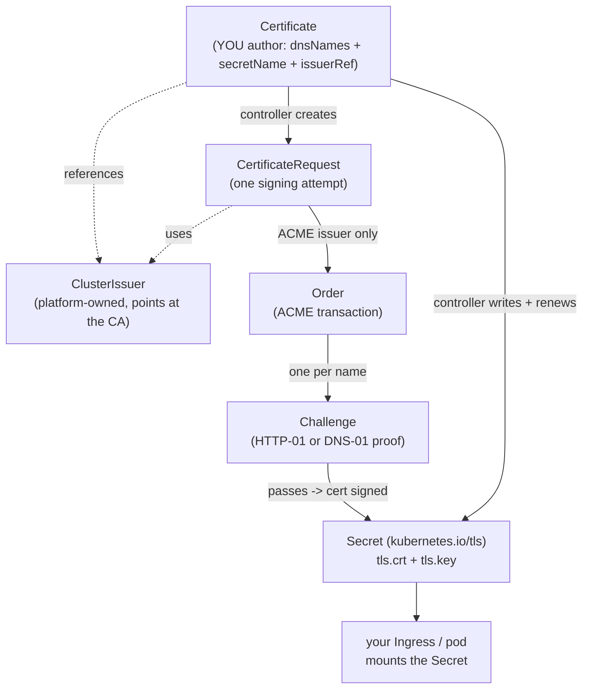

Almost every article on this site that mentions TLS assumes cert-manager is running — [the front door](/architectures/front-door/) issues wildcards with it, [TLS and Corporate CAs](/networking/tls-and-corporate-cas/) gets serving certs from it, [ingress-nginx](/networking/ingress-nginx/) loads the Secrets it writes. This page is the one that actually explains it, from the seat you sit in: you **consume** cert-manager; you don't run it.

**cert-manager is a controller plus a handful of CRDs that issues and *renews* X.509 certificates into Kubernetes Secrets.** You declare "I want a cert for these names"; it obtains one from a certificate authority and writes a standard `kubernetes.io/tls` Secret — `tls.crt` and `tls.key` — into your namespace, then keeps that Secret fresh forever. That's the whole value proposition: no more expired-cert pages, no more manual CSR dance. It's the [operator pattern](/controllers/operators/) applied to PKI — the 3 a.m. renewal knowledge of a senior admin, written into a reconcile loop.

Like every operator, it's **platform-installed**. The controller runs in a namespace you can't see (`cert-manager`), the CRDs are cluster-scoped, and the shared issuers are wired to the corporate CA by someone else. Your world starts after that: you write a `Certificate` (or an annotation), you read the chain of objects it spawns when something's wrong, and you own the pieces that live in *your* namespace.

## The object model

Five kinds matter. Two you author, three you only ever read:

| Kind | Scope | Who touches it | What it is |
|---|---|---|---|
| **ClusterIssuer** | cluster | platform (you *reference* it) | A CA connection — ACME/Let's Encrypt, Vault, a CA keypair — usable from any namespace. The common case. |
| **Issuer** | namespaced | you, occasionally | Same idea, scoped to one namespace. Rare on a shared cluster; you usually point at a ClusterIssuer the platform published. |
| **Certificate** | namespaced | **you** | Your desired cert: names, the issuer to use, and the Secret to write it into. cert-manager owns that Secret from here on. |
| **CertificateRequest** | namespaced | read-only (debug) | One attempt to get a single cert signed. cert-manager creates it *from* your Certificate. |
| **Order** / **Challenge** | namespaced | read-only (debug) | ACME-only machinery. The Order is the ACME transaction; each Challenge proves you control a name (HTTP-01 or DNS-01). |

The mental model: **you declare a `Certificate`; the controller manufactures everything below it and writes a Secret.** The lower objects are receipts of the ACME conversation — you don't create or edit them, you *read* them when a cert won't go Ready.

:::note[Issuer vs ClusterIssuer — the distinction that bites]
An `Issuer` is only visible in its own namespace; a `ClusterIssuer` works from anywhere. On a platform-managed cluster the issuer is virtually always a **ClusterIssuer** the platform owns — so your `issuerRef` must say `kind: ClusterIssuer`. Getting `kind` wrong (defaulting to `Issuer` when you meant the cluster one) is a top-three cause of a Certificate that never even produces a CertificateRequest. `kubectl get clusterissuer` shows you what actually exists.
:::



For non-ACME issuers (Vault, a CA keypair) the chain is shorter — `Certificate -> CertificateRequest -> Secret`, no Order or Challenge, because there's no domain-control proof to perform. The [CRDs Explained](/controllers/crds-explained/) page covers how these custom kinds get installed in the first place.

## The two ways to get a cert

### 1. The ingress-shim annotation (least typing)

For the overwhelmingly common case — one cert, terminating at [ingress-nginx](/networking/ingress-and-routing/) — you don't write a `Certificate` at all. You annotate the Ingress and cert-manager's **ingress-shim** synthesizes one for you, taking the names straight from the Ingress `tls` block:

```yaml
apiVersion: networking.k8s.io/v1
kind: Ingress
metadata:
  name: shop-web
  namespace: shop
  annotations:
    cert-manager.io/cluster-issuer: letsencrypt-prod   # <- the whole trigger
spec:
  ingressClassName: nginx
  tls:
    - hosts: [shop.apps.example.com]
      secretName: shop-web-tls        # cert-manager creates and fills this
  rules:
    - host: shop.apps.example.com
      http:
        paths:
          - path: /
            pathType: Prefix
            backend:
              service: { name: shop-web, port: { number: 80 } }
```

The annotation key is `cert-manager.io/cluster-issuer` (use `cert-manager.io/issuer` for a namespaced Issuer). cert-manager creates a Certificate named after the `secretName`, keeps its `dnsNames` in sync with `tls.hosts` by construction, and renews it. This is the exact tenant contract the [front-door build](/architectures/front-door/#5-the-tenant-contract) publishes.

### 2. An explicit Certificate resource (more control)

Author a `Certificate` directly when you need extra SANs, a specific key algorithm, a non-default duration, or a cert for something that isn't an Ingress (pod-terminated TLS, an mTLS client cert). Minimal and correct:

```yaml
apiVersion: cert-manager.io/v1
kind: Certificate
metadata:
  name: shop-web-tls
  namespace: shop
spec:
  secretName: shop-web-tls          # the Secret cert-manager creates + owns
  issuerRef:
    name: letsencrypt-prod          # a ClusterIssuer the platform published
    kind: ClusterIssuer             # NOT Issuer — see the note above
  dnsNames:                         # every name a client will actually use
    - shop.apps.example.com
```

Apply it, and within a minute or two the Secret exists and the Certificate reports `READY=True`. Your Ingress (or pod) then references `secretName` like any other TLS Secret — the Secret itself is a plain `kubernetes.io/tls` Secret, covered in [Secrets](/workloads/secrets/). [TLS and Corporate CAs](/networking/tls-and-corporate-cas/#serving-getting-a-certificate-as-an-app-team) walks the annotated-versus-explicit choice and SAN discipline in more depth; this page won't duplicate it.

:::caution[The Certificate and its Secret are namespaced — together]
A `Certificate` writes its Secret into **its own namespace**. An Ingress in `shop` cannot reference a TLS Secret sitting in `payments`. If your Ingress reports "secret not found" while `kubectl get secret` shows it exists, check you're looking in the same namespace as both — this is a routine self-inflicted wound.
:::

## Solvers: HTTP-01 vs DNS-01

For ACME issuers (Let's Encrypt and friends), the CA won't sign until you prove you control the name. cert-manager does this via a **solver**, configured on the issuer — which is the platform's concern, but you must know which one you're getting because it dictates what has to work:

| | HTTP-01 | DNS-01 |
|---|---|---|
| Proof | Serve a token at `http://<name>/.well-known/acme-challenge/...` | Publish a TXT record in the name's DNS zone |
| Needs | The name to route to your ingress **now**, port 80 open end to end | API credentials for the DNS zone, in a Secret |
| Wildcards | **No** — one name per challenge | **Yes** — `*.apps.example.com` works |
| Breaks when | The edge/HTTP path isn't reachable from the ACME server | The provider Secret is missing/wrong or DNS propagation is slow |

The short version: **HTTP-01 is simpler but needs a reachable HTTP edge and can't do wildcards; DNS-01 needs a credential Secret but issues wildcards and works for names not reachable from the internet.** For a real `*.apps.example.com` wildcard cert built end to end — the Cloudflare API-token Secret, the DNS-01 ClusterIssuer, the wildcard `Certificate` — see [the front-door build](/architectures/front-door/#3-cert-manager-issuers-and-the-default-certificate). That article assembles the platform side; from the tenant seat you mostly pick an issuer name and let the solver run.

## Debugging a stuck certificate

This is the practical core, and it's the same [operator debugging discipline](/controllers/operators/#debugging-when-you-cant-read-the-operators-logs) applied to PKI: you can't read the controller's logs, so you walk the chain of objects it created and let their status tell you where it wedged. The rule: **find the first link that isn't progressing.**

Start at the top:

```bash
kubectl get certificate -n shop
# NAME          READY   SECRET        AGE
# shop-web-tls  False   shop-web-tls  9m      <- False for 9 min = stuck, not merely slow

kubectl describe certificate shop-web-tls -n shop
```

`describe` names the CertificateRequest it's waiting on. Follow it down:

```bash
kubectl get certificaterequest -n shop
kubectl describe certificaterequest <name> -n shop     # issuerRef errors, CA denials surface here
```

If it's an ACME issuer and the CertificateRequest is waiting, drop to the ACME layer:

```bash
kubectl get order,challenge -n shop
kubectl describe challenge -n shop                      # the ACME reason lives here, verbatim
```

The Challenge's `Reason`/`Message` is the payoff — it quotes exactly why the CA (or cert-manager's own self-check) couldn't validate the name. The chain-walk and a verbatim stuck-Challenge example are also in [TLS and Corporate CAs](/networking/tls-and-corporate-cas/#when-the-certificate-wont-go-ready).

### The usual culprits

Read the chain and it's almost always one of these:

- **HTTP-01 solver unreachable.** The Challenge self-check reports `connection refused`/`timeout` on `http://<name>/.well-known/...`. Causes: the name doesn't route to the ingress yet, port 80 is closed somewhere on the path, or — very common — a default-deny [NetworkPolicy](/networking/network-policies/) in your namespace blocks the ingress controller from reaching the temporary `cm-acme-http-solver-*` pod. The first two are a [platform ticket](/operations/working-with-platform-team/); the NetworkPolicy is **yours** to fix.
- **DNS-01 missing/incorrect provider Secret.** The Challenge or issuer reports it can't authenticate to the DNS provider — the API-token Secret is absent, in the wrong namespace, or under the wrong key. This is the [front-door `cloudflare-api-token`](/architectures/front-door/#3-cert-manager-issuers-and-the-default-certificate) exactly: the Secret must exist, in the right namespace, with the key the issuer's `apiTokenSecretRef` names.
- **Let's Encrypt rate limits.** After a burst of failures you'll see `too many certificates already issued` or `too many failed authorizations`. These are **per registered-domain, per week** and they *lock you out* — so once you see it, **stop retrying** and switch to the Let's Encrypt **staging** issuer until the path works, then flip to prod. Retrying against prod while broken is how a one-hour problem becomes a one-week one.
- **Wrong issuer ref.** `issuerRef.name` typo'd or `kind` set to `Issuer` when it should be `ClusterIssuer` — the CertificateRequest never appears, or reports the issuer wasn't found. Verify with `kubectl get clusterissuer`.
- **Clock skew.** ACME and X.509 validation are time-sensitive; a node with a badly wrong clock produces `notBefore`/signature-validation failures. Rare, but it makes otherwise-inexplicable failures make sense.

If you've walked all four layers and the answer points outside your namespace (edge unreachable, port 80 closed, DNS-01 creds the platform owns), you now hold the exact evidence the platform team needs — the Certificate's status, the CertificateRequest, and the `describe challenge` output. Attach all three; specific asks get fast answers. cert-manager's official [troubleshooting guide](https://cert-manager.io/docs/troubleshooting/) is the canonical reference for the message zoo.

## Renewal is automatic

You do not cron certificate renewal. cert-manager renews on its own, by default at roughly **two-thirds of the way through the certificate's lifetime** (tunable via `spec.renewBefore` on a Certificate). It updates the Secret **in place** — same name, new `tls.crt`/`tls.key` — so nothing referencing the Secret needs to change.

The one gotcha, and it's not cert-manager's fault: **whoever loads the Secret has to pick up the new contents.** ingress-nginx watches TLS Secrets and hot-reloads them — you do nothing. A pod that reads the cert file once at startup does *not*, and will keep serving the old cert until it restarts, producing the classic "expired even though the Secret is valid" outage. That reload trap is covered in full in [TLS and Corporate CAs](/networking/tls-and-corporate-cas/#renewal-mechanics--and-the-pod-mount-trap) — it's a reason to terminate at the ingress when you can.

## Who owns what

The tenant boundary, stated plainly:

| Platform owns | You own |
|---|---|
| The cert-manager controller and its CRDs | Your `Certificate` resources and Ingress `cert-manager.io/*` annotations |
| The shared **ClusterIssuers** (wired to the corporate CA / Let's Encrypt) | The DNS-01 provider Secret *if it lives in your namespace* |
| ACME account keys, rate-limit budget across the org | NetworkPolicy that lets the HTTP-01 solver be reached in your namespace |
| Version, upgrades, the solver machinery's plumbing | Walking the CR chain to produce evidence when a cert won't issue |

Don't hand-edit the CertificateRequest, Order, or Challenge — they're reconciled from your Certificate and your edits will be [reverted](/controllers/operators/#dont-hand-edit-operator-owned-children), exactly as with any operator's children. Express changes through the `Certificate`. If a shared ClusterIssuer is unhealthy (`kubectl get clusterissuer` shows `READY=False`), that's platform territory — escalate with the issuer name and its status.

For getting a cert as an app team end to end (SAN discipline, the request templates, the `openssl s_client` debugging kit), continue to [TLS and Corporate CAs](/networking/tls-and-corporate-cas/). For the platform-side build that stands all of this up, [the front door](/architectures/front-door/). cert-manager itself is documented at [cert-manager.io](https://cert-manager.io/docs/concepts/); you rarely need more than the concepts and troubleshooting pages, because from your seat it's just: declare the cert, read the chain when it sulks, and let the loop do the renewals.
