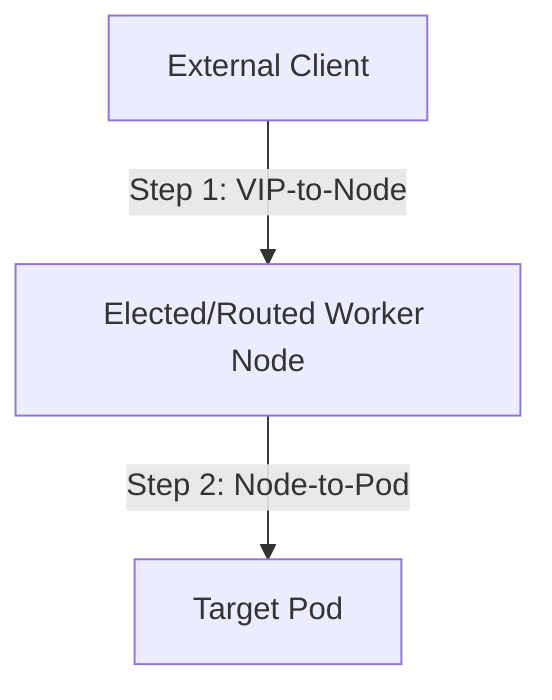

On AWS or GKE, you set `type: LoadBalancer` on a Service and the cloud conjures a load balancer with a public IP. On bare metal there is no cloud to conjure anything — the Service sits there forever:

```console
$ kubectl get svc web
NAME   TYPE           CLUSTER-IP     EXTERNAL-IP   PORT(S)        AGE
web    LoadBalancer   10.96.41.203   <pending>     80:31547/TCP   6d
```

**MetalLB** is the controller that fills that gap. It watches Services of `type: LoadBalancer`, allocates an IP from a pool the platform team defined, writes it into `status.loadBalancer.ingress`, and then — the actually hard part — makes the surrounding network deliver traffic for that IP to cluster nodes. It does that in one of two modes, and which mode your cluster uses changes both the performance characteristics and how you debug it.

You almost certainly don't run MetalLB yourself — the platform team installs it, owns its pools, and owns its router peering. But every external IP your team has flows through it, so understanding its two halves and its handful of CRs is the difference between filing a precise ticket and filing "the network is broken."

## Architecture: two components, two failure domains

MetalLB is two pieces with sharply different jobs:

```console
$ kubectl get pods -n metallb-system -o wide
NAME                          READY   STATUS    NODE
controller-5f9bb77dcb-x8k2m   1/1     Running   worker-03
speaker-4qv7z                 1/1     Running   worker-01
speaker-8jwtp                 1/1     Running   worker-02
speaker-b6c9r                 1/1     Running   worker-03
speaker-hn2ml                 1/1     Running   worker-07
```

**The controller** is a single-replica Deployment doing IPAM: it watches Services, picks an IP from a matching pool, and writes it to Service status. It never touches a packet. If Services are stuck `<pending>` cluster-wide, this is the suspect.

**The speakers** are a DaemonSet — one pod per node — doing the announcement: answering ARP in L2 mode, holding BGP sessions in BGP mode. If IPs are *allocated* but *unreachable*, suspect a speaker (or the network beyond it).

That split is your first triage fork: allocation problems are controller-side and show up in Service events; reachability problems are speaker-side and show up in speaker logs and on the wire. You may not have RBAC to read `metallb-system` pods — if not, the ask to the platform team is precise: "is the controller healthy?" for pending IPs, "is the speaker on node X healthy and announcing?" for dead ones.

Two more architecture facts worth carrying around:

- In L2 mode, speakers form a **memberlist** gossip cluster and run a per-IP leader election — for each Service IP, exactly one speaker wins and answers ARP for it. Memberlist is also how the survivors notice a node died and re-elect.
- Modern MetalLB's BGP side runs in **FRR mode** (or the newer FRR-K8s daemon): instead of MetalLB's original homegrown BGP code, each speaker drives a real FRR routing daemon. What that buys you as a consumer: **BFD** support (sub-second failover, below), IPv6 BGP, and — when things go wrong — the platform team can `vtysh` into a real router and show you actual session state instead of guessing.

## The CRs that explain your Service's behavior

MetalLB is configured via CRs in `metallb-system`. They're platform-owned, but most clusters let you *read* them — and reading them answers 90% of "why did my Service get that IP / no IP." (They're ordinary [custom resources](/controllers/crds-explained/): `kubectl get` and `kubectl explain` work like on anything else.)

```console
$ kubectl get ipaddresspools -n metallb-system
NAME           AUTO ASSIGN   AVOID BUGGY IPS   ADDRESSES
prod-pool      true          true              ["10.40.8.100-10.40.8.150"]
partner-pool   false         false             ["10.40.9.16/28"]
```

**IPAddressPool** — the ranges MetalLB may hand out:

```yaml
apiVersion: metallb.io/v1beta1
kind: IPAddressPool
metadata:
  name: partner-pool
  namespace: metallb-system
spec:
  addresses:
    - 10.40.9.16/28          # CIDRs and ranges both work
    - 10.40.9.40-10.40.9.43
  autoAssign: false          # reserve-only: must be requested by name
  avoidBuggyIPs: true        # skip .0 and .255 — some client stacks choke on them
```

`autoAssign: false` is the detail that bites: you get an IP from that pool only by asking for it explicitly (annotation, below). Pools like `partner-pool` exist precisely so a random new Service can't eat an IP a partner has allowlisted.

**L2Advertisement** — which pools get announced via ARP, and from where:

```yaml
apiVersion: metallb.io/v1beta1
kind: L2Advertisement
metadata:
  name: l2-prod
  namespace: metallb-system
spec:
  ipAddressPools: ["prod-pool"]
  interfaces: ["bond0"]              # only announce on this NIC
  nodeSelectors:
    - matchLabels:
        network-tier: edge           # only these nodes may win the election
```

**BGPAdvertisement** — same idea for BGP, plus routing policy:

```yaml
apiVersion: metallb.io/v1beta1
kind: BGPAdvertisement
metadata:
  name: bgp-prod
  namespace: metallb-system
spec:
  ipAddressPools: ["prod-pool"]
  aggregationLength: 32        # announce /32s (per-IP); smaller = summarized
  communities: ["65000:1100"]  # tags the upstream network acts on (e.g. "advertise externally")
  localPref: 100
```

**BGPPeer** — the actual router sessions each speaker opens:

```yaml
apiVersion: metallb.io/v1beta2
kind: BGPPeer
metadata:
  name: tor-a
  namespace: metallb-system
spec:
  myASN: 64512
  peerASN: 64513
  peerAddress: 10.40.0.1
  ebgpMultiHop: true       # peer isn't directly attached
  bfdProfile: fast
```

**BFDProfile** — the fast-failure-detection knobs the peer references:

```yaml
apiVersion: metallb.io/v1beta1
kind: BFDProfile
metadata:
  name: fast
  namespace: metallb-system
spec:
  receiveInterval: 100     # ms
  transmitInterval: 100
  detectMultiplier: 3      # dead after ~300ms of silence
```

The trap that spans all of these: a pool with **no matching advertisement** happily allocates IPs that nobody announces. Your Service shows an `EXTERNAL-IP`, status looks green, and every packet to it evaporates. If a brand-new pool is unreachable from minute one, ask the platform team whether the advertisement exists before debugging anything else.

## How the network routes to a node: L2 ARP vs. BGP Routing

A common point of confusion when working with MetalLB: if Kubernetes exposes a `LoadBalancer` Service on *every* worker node (via kube-proxy and NodePorts), and you have a single IP (VIP) assigned to it, **how does the physical network decide which node to send the packet to?** The summary is below; for the full mental model — plus the commands to see *which* node is chosen right now — see [How MetalLB Chooses the Node](/controllers/metallb-node-selection/).

The journey from client to pod happens in two distinct hops:



### Hop 1: External VIP-to-Node (L2 ARP or L3 BGP)
The physical network switch or router has no awareness of Kubernetes namespaces, services, or pods. It only understands MAC addresses, IP addresses, and routing tables. It determines which node receives the packet based on the MetalLB mode:

* **In Layer 2 Mode**:
  MetalLB speaker pods run a leader election (using memberlist). Exactly **one worker node** is elected as the leader/announcer for your Service's VIP. That node's speaker responds to ARP (IPv4) or NDP (IPv6) queries for the VIP with its own physical MAC address.
  * **Routing outcome**: The upstream switch sends *all* traffic for the VIP to that single worker node's network interface.
  * **Failover**: If that worker node dies, memberlist detects the loss, elects a new leader node, and the new leader broadcasts a **gratuitous ARP (GARP)** to update the upstream switch's MAC tables.

* **In BGP Mode**:
  Multiple worker nodes (typically all nodes running a speaker pod) peer with your upstream routers via BGP. They advertise the VIP as a `/32` (IPv4) or `/128` (IPv6) host route with their own node IP as the next-hop.
  * **Routing outcome**: The router sees that the VIP is reachable via multiple worker nodes and uses **ECMP (Equal-Cost Multi-Path)** to hash and load-balance incoming connection flows across those nodes' physical IP addresses.
  * **Failover**: If a worker node dies, its BGP session terminates. The router withdraws that node's path and redistributes traffic to the remaining healthy nodes.

### Hop 2: Internal Node-to-Pod (kube-proxy / CNI)
Once the packet reaches the physical NIC of the selected worker node, Kubernetes networking takes over. The kernel's packet-filtering layer (configured by `kube-proxy` or the CNI using `iptables`, `IPVS`, or `eBPF`) intercepts the packet and routes it to a backend pod:
* **With `externalTrafficPolicy: Cluster`**: The receiving node will load-balance the packet to *any* matching pod in the cluster. If the chosen pod is on another node, the packet is forwarded across the cluster's overlay network (VXLAN, Geneve, etc.).
* **With `externalTrafficPolicy: Local`**: The node will *only* forward the packet to a pod running locally on that same node. To support this, MetalLB speakers are smart: they only announce the VIP (or reply to ARP requests) from nodes that actually host at least one Ready pod for that service.

## L2 mode: one node answers ARP

In Layer 2 mode, MetalLB elects **one node** per Service IP. That node's speaker answers ARP requests (IPv4) or NDP (IPv6) for the IP — the IP isn't bound to any interface, the speaker just responds on the wire — so the local network delivers every packet for that IP to that one node. From there, kube-proxy spreads traffic to the backing pods as usual.

What this means in practice:

- **It's failover, not load balancing.** All ingress traffic for one Service IP lands on a single node's NIC, then fans out to pods. Fine for most services; a real ceiling for heavy ones. If a single VIP needs more than one node's worth of NIC, the answer is BGP mode, not more replicas.
- **Failover takes seconds, not milliseconds.** When the announcing node dies, memberlist has to notice (~10 seconds with defaults), a new speaker wins the election, and it blasts **gratuitous ARP** to tell the segment the MAC changed. Clients and switches that ignore the gratuitous ARP keep sending to the dead node's MAC until their ARP cache entry expires — so real-world blips of 10 seconds to a few minutes after a node loss are normal L2 behavior, not a bug.
- **The IP must be on the same L2 segment as the nodes.** Pool IPs come from spare space in the node subnet. Clients on other subnets reach the VIP through their router like any other IP on that segment — but the VIP itself can't live in some unrelated range.

If you've operated keepalived/VRRP pairs, the mental model transfers almost exactly: a floating IP claimed via ARP, one active holder, gratuitous ARP on failover. MetalLB's L2 mode is that pattern with Kubernetes as the config store and memberlist instead of VRRP heartbeats — same strengths, same single-node throughput ceiling. [Floating VIPs](/routing/floating-vips/) covers that shared mechanism in full, including the **split-brain** failure where two speakers both claim one VIP because memberlist can't gossip between them — a real incident in [The VIP That Two Nodes Claimed](/blog/the-vip-that-two-nodes-claimed/).

## BGP mode: real multipath

In BGP mode, every speaker (or a selected set) opens a BGP session to your datacenter routers and announces each Service IP as a **/32 route** (/128 for IPv6) with its own node as next-hop. The router sees N equal-cost paths to the same /32 and does **ECMP** — genuine load distribution across nodes, at line rate, in router silicon.

Node failure handling is where BGP earns its complexity budget: when a node dies, its BGP session drops and the router withdraws that path, leaving N−1 good ones. With plain BGP that's tied to hold timers (tens of seconds); with **BFD** enabled via a `BFDProfile`, the router detects the dead peer in a few hundred milliseconds and traffic barely stutters.

The caveats:

- **ECMP hashes flows, and rehashing kills connections.** Routers pick a path per flow by hashing the 5-tuple. When the path set changes — node added, node drained, session flap — some fraction of existing flows hash to a *different* node, which has no conntrack state for them and answers with RST. Long-lived connections (database sessions, websockets, message-queue consumers) see this as "connection reset during node maintenance." It's inherent to the design; mitigate with client retry logic, not tickets.
- **It's a three-party arrangement.** Speakers peer with routers the *network* team owns, configured through CRs the *platform* team owns, for Services *you* own. Nothing about a BGP problem is diagnosable from any single seat — which is why BGP-mode incidents want all three groups in one channel early.

L2 is the zero-network-cooperation default; BGP is the grown-up choice for serious traffic. Most clusters we've seen start L2 and move the hot pools to BGP later.

## MetalLB is the front door for everything else

Here's the thing that reframes MetalLB from "the LoadBalancer widget" to "the root of the entire external stack": on bare metal, **every other ingress mechanism sits behind it**. The canonical HTTP stack looks like this:

```text
*.apps.example.com  ──DNS──▶  10.40.8.100 (MetalLB VIP)
                                   │
                    Service ingress-nginx-controller
                    (type: LoadBalancer — the ONE Service MetalLB serves)
                                   │
                    ingress-nginx pods (host-header routing)
                         │              │             │
                    Ingress: shop   Ingress: api   Ingress: grafana
                         │              │             │
                     shop pods       api pods     grafana pods
```

Walk it end to end: a wildcard DNS record points `*.apps.example.com` at one MetalLB IP. That IP belongs to the [ingress-nginx controller's](/networking/ingress-nginx/) own Service of `type: LoadBalancer` — usually the first and most important LoadBalancer Service in the cluster. MetalLB announces it; ingress-nginx terminates TLS and routes on `Host:` headers according to [Ingress resources](/networking/ingress-and-routing/); your pods never know MetalLB exists. **One pool IP serves every HTTP application in the cluster.** That's why the platform team's pool can be a /28 and still feel roomy, and why they get twitchy when teams request per-app LoadBalancer IPs for plain HTTPS. Gateway API changes none of this economics — a `Gateway` gets its own MetalLB VIP the same way, and all its routes ride that one IP.

The non-HTTP story is where MetalLB IPs get spent for real. Raw TCP protocols — the [PostgreSQL wire protocol](/stateful/postgresql/), [AMQP/MQTT brokers](/stateful/message-queues/) — have no `Host:` header to route on, so they can't share the ingress IP by hostname. Two patterns, in order of preference:

1. **Ride the ingress controller's TCP passthrough** (`tcp-services` ConfigMap or Gateway `TCPRoute` — see [TCP ingress](/networking/tcp-ingress/)): still one shared IP, one port per service. Cheap, but ports are a flat namespace and the config is cluster-shared.
2. **A dedicated VIP per service**: `type: LoadBalancer` straight on the Postgres/broker Service. Clean port semantics (Postgres on 5432 where clients expect it), independent traffic policy, an IP a partner can allowlist. Costs a pool IP each.

And there's a middle path MetalLB itself provides — **IP sharing**:

```yaml
# Service 1: HTTPS
metadata:
  name: web
  annotations:
    metallb.io/allow-shared-ip: "team-a-edge"   # the sharing key
    metallb.io/loadBalancerIPs: "10.40.9.20"
spec:
  type: LoadBalancer
  ports: [{port: 443, targetPort: 8443}]
---
# Service 2: MQTT, same VIP
metadata:
  name: mqtt
  annotations:
    metallb.io/allow-shared-ip: "team-a-edge"   # same key
    metallb.io/loadBalancerIPs: "10.40.9.20"
spec:
  type: LoadBalancer
  ports: [{port: 8883, targetPort: 8883}]
```

The contract: **same sharing key, same requested IP, disjoint ports**. One external IP, HTTP and TCP side by side. The fine print that trips people: all sharers must use the same `externalTrafficPolicy`, and with `Local` they must select the **same pods** — otherwise MetalLB refuses the share, because it can't announce one IP from "nodes with local endpoints" for two different endpoint sets. It's the right answer to "we need five tiny TCP services externally but the pool has one free IP."

:::caution[Don't burn IPs on things Ingress should carry]
Pool IPs are a finite, platform-rationed resource. HTTP(S) services belong behind the shared ingress; reserve LoadBalancer IPs for non-HTTP protocols, TCP passthrough that outgrows the shared port table, and endpoints external parties must allowlist. Your pool requests will be received much more warmly.
:::

## Requesting and pinning IPs

Two mechanisms; prefer the annotations:

```yaml
apiVersion: v1
kind: Service
metadata:
  name: pg-external
  annotations:
    metallb.io/address-pool: partner-pool     # allocate from this pool
    metallb.io/loadBalancerIPs: "10.40.9.20"  # this exact IP (comma-sep for dual-stack)
spec:
  type: LoadBalancer
  selector:
    app: postgres
  ports:
    - port: 5432
      targetPort: 5432
```

The legacy `spec.loadBalancerIP` field still works in many clusters but is deprecated upstream and can't express dual-stack; new manifests should use the annotations. (Older MetalLB docs show `metallb.universe.tf/...` prefixes — same annotations, old domain; current releases accept `metallb.io/`. Check which your cluster's version documents.)

Pin an IP whenever DNS or an external allowlist points at it. An auto-assigned IP is stable in practice — MetalLB won't reshuffle a live Service — but delete and recreate the Service (a `kubectl apply` that changes an immutable field, a namespace rebuild, a CD tool doing replace-not-patch) and the IP goes back to the pool and may land elsewhere. If `db.example.com` has an A record, the manifest should carry `metallb.io/loadBalancerIPs`. Ask the platform team to note the reservation on their side too, so the IP doesn't get handed out while your Service is briefly absent.

If you request an IP outside any pool, one already taken, or a pool that doesn't exist, allocation fails and the Service stays `<pending>` — with the reason in Events.

### Reading allocation state at a glance

```console
$ kubectl get svc -o custom-columns=\
NAME:.metadata.name,IP:.status.loadBalancer.ingress[0].ip,POOL:.metadata.annotations.metallb\.io/ip-allocated-from-pool
NAME          IP            POOL
web           10.40.8.112   prod-pool
pg-external   10.40.9.20    partner-pool
```

MetalLB stamps each Service with the pool it allocated from — the fastest way to confirm a Service landed where you intended, and a nice column for incident runbooks.

## externalTrafficPolicy: the knob that changes announcement

[`externalTrafficPolicy`](/networking/services-deep-dive/) matters more with MetalLB than almost anywhere else, because it changes not just forwarding but *which nodes announce*:

- **`Cluster`** (default): every node accepts traffic for the IP and forwards to any pod, SNATing on the way — forgiving, but the app sees node IPs instead of client IPs, and there's an extra hop.
- **`Local`**: only nodes with a **local ready pod** serve traffic — client IPs preserved, no extra hop. In L2 mode, MetalLB only elects announcers from nodes with local endpoints; in BGP mode, only those nodes announce the /32, so ECMP spreads across exactly the nodes that can serve.

The failure mode with `Local`: readiness drives announcement. If your 2 replicas land on nodes A and B and both drain to node C during a rollout, announcement has to chase the pods — momentary blackholes and Events churn. Run enough replicas, spread them with topology constraints, and make readiness probes honest, because with `Local` an unready pod doesn't just leave rotation — it can silently drop a node out of the announcement set.

## Troubleshooting, symptom-first

The ownership map before the checklists: **you** own the Service, its annotations, and its endpoints; the **platform team** owns MetalLB's pods and CRs; the **network team** owns switches, routers, and the BGP far end. Most MetalLB incidents die in the handoff between those three — the [debugging guide](/networking/debugging-network/) has the general method; below is the MetalLB-specific evidence to collect before crossing each boundary.

### Service stuck in `<pending>`

Allocation problem → controller-side → the answer is in Events:

```console
$ kubectl describe svc pg-external | grep -A6 Events
Events:
  Type     Reason            Message
  ----     ------            -------
  Warning  AllocationFailed  Failed to allocate IP for "team-a/pg-external":
           no available IPs in pool "partner-pool"
```

Causes, in order of frequency, and their evidence:

| Cause | What describe shows |
|---|---|
| Pool exhausted | `no available IPs in pool "X"` — count Services against the pool size |
| Requested IP taken or outside every pool | `"10.40.9.99" is not allowed in config` or `already allocated` |
| Pool is `autoAssign: false` and you didn't name it | plain `no available IPs` while the pool looks empty — check the pool spec |
| Typo'd pool annotation | `unknown pool "partern-pool"` |
| Controller down | **no events at all** — nothing is even trying; platform ticket |

The event message names the cause almost every time; **always describe the Service before escalating.**

### IP allocated but unreachable

Reachability problem → speaker-side or beyond. First, in *either* mode, check the boring thing: `kubectl get endpointslices -l kubernetes.io/service-name=web` — an unreachable "LoadBalancer problem" is regularly just zero ready pods behind the Service.

**L2 checklist:**

1. **Who's announcing?** MetalLB emits an event naming the node:
   ```console
   $ kubectl describe svc web | grep -i announc
   Normal  nodeAssigned  announcing from node "worker-07" (protocol "layer2")
   ```
   No such event → no speaker won the election (all candidate nodes excluded by `Local` policy or node selectors, or speakers unhealthy) — platform ticket with this exact observation.
2. **From a client-side box on the same subnet**, check ARP resolves to that node's MAC:
   ```console
   $ arping -c3 10.40.8.112
   ARPING 10.40.8.112 from 10.40.8.5 eth0
   Unicast reply from 10.40.8.112 [52:54:00:AB:3E:91]  0.71ms
   $ arp -n 10.40.8.112
   10.40.8.112   ether   52:54:00:ab:3e:91   eth0
   ```
   No reply → speaker not answering on that node, or client and node aren't actually on the same segment. Wrong MAC (not worker-07's) → stale cache or an IP conflict.
3. **Stale ARP after failover** — broke right after a node incident? Compare the MAC you see against the *new* announcing node. Intermediate switches caching the old MAC clear on their own in minutes; the platform team can force it.
4. **Reachable from the node's subnet but not from clients?** Not MetalLB — a firewall or missing route between the client network and the VIP subnet. Network team, with a traceroute attached.

**BGP checklist:** mostly not yours to run, but knowing the shape gets the right ticket filed. Session down (speaker logs show `BGP session down`, or the network team's router shows the peer Idle) → no route → blackhole from everywhere. Route present on the top-of-rack but not further upstream → missing community/redistribution → reachable from some networks, not others. FRR mode means the platform team can `vtysh -c 'show bgp summary'` inside the speaker pod and give the network team real state to compare against.

### Works from some subnets, not others

L2 first suspicion: the VIP lives on the node subnet, and "some subnets" reach it via routers — check whether the broken clients' path to that subnet exists at all, and whether return traffic goes back the same way (asymmetric return paths through stateful firewalls drop the reply half of the connection). BGP first suspicion: the /32 propagated to some of the upstream fabric and not the rest — communities and route filters, network team territory.

### Intermittent resets right after node maintenance

BGP mode, ECMP rehash: the path set changed, some fraction of live flows now hash to a node with no conntrack for them, RST. Self-heals as connections re-establish. If your workload can't tolerate it (long-lived DB sessions through a VIP), that's an architecture conversation — client retries, or per-service L2 VIPs where a single stable node is a feature.

:::tip[The one command that answers "is it me?"]
`kubectl describe svc <name>` — Events carry the allocation verdict *and* the announcing node. Thirty seconds with that output usually tells you which of the three teams owns the next step.
:::

## Phrasing requests to the platform team

MetalLB pool/peering changes are cluster config — your CI/CD can't apply them, so they travel as tickets. Requests that get actioned fast contain:

> - **What:** N additional IPs for LoadBalancer Services in namespace `team-a` (or: a dedicated pool `team-a-pool`, autoAssign=false)
> - **Protocol/ports:** TCP 5432 (Postgres wire) — not HTTP, so ingress isn't suitable
> - **Traffic profile:** ~200 conns steady, <50 Mbit/s (matters for the L2 single-node ceiling; may prompt them to suggest BGP)
> - **Source networks:** partner VPN range 172.16.0.0/12 (they may need firewall/router work)
> - **Specific IP needed?** Only if an external party must allowlist it — say so and why, and ask them to record the reservation

Variants of the same template: a **pinned IP** ("Service `team-a/pg-external` needs `10.40.9.20` permanently; DNS `db.example.com` points at it"); a **shared-IP exception** ("Services `web` and `mqtt`, sharing key `team-a-edge`, ports 443 + 8883, both `externalTrafficPolicy: Cluster`"); a **BGP community** ("announce `10.40.9.20/32` with the advertise-to-DMZ community so the partner VPN can reach it" — this one loops in the network team, budget lead time accordingly).

For the general etiquette, see [Working with the Platform Team](/operations/working-with-platform-team/). And remember the framing that explains everything above: MetalLB is just another reconcile loop — Services in, IP allocations and network announcements out, with the evidence trail in status and Events like everything else in the cluster. The network it programs is older and slower-moving than Kubernetes, which is exactly why the CRs, the Events, and the three-team ownership map matter more here than anywhere else in your stack.
