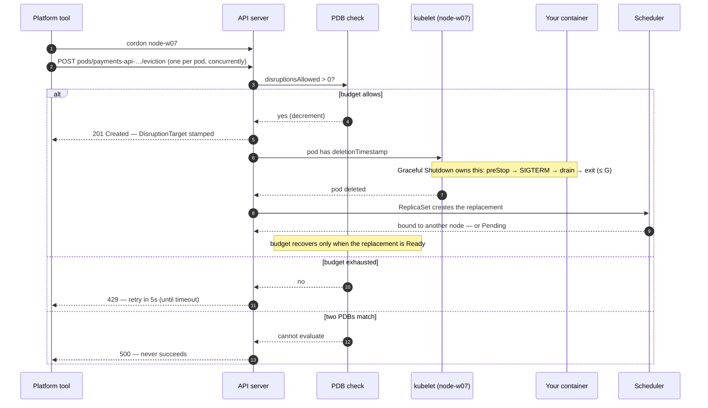

You are here if: the platform team announced a maintenance window and you want to know what will happen to your pods, in order; or a pod died and you want to know *who* did it; or you've been told your namespace "blocked the drain" and you want to see what they saw.

This page serves the first of the section's three questions — **who decides, and do they ask?** — for the one disruption that does ask: the drain. You will never run the command below. You will experience it on every node your pods live on, several times a year, run by someone who can't see your app. Here is what it does, in the order it does it, and which parts of it you can watch from your namespace.

The pod's death itself — preStop, SIGTERM, the grace budget — is not on this page. Every step below that reaches "…and the pod is deleted" hands off to [Graceful Shutdown](/workloads/graceful-shutdown/) and stops.

## The command they run

```bash
# seat: platform — shown so you can read THEIR output; you won't run it
kubectl drain node-w07 --ignore-daemonsets --delete-emptydir-data --timeout=20m
```

Or their upgrade tool's equivalent — Rancher and RKE2's drain options, OpenShift's machine-config drain, kubespray's `drain_timeout`. Every one of them wraps the same API call, and every one has the same two settings you should ask about: **the timeout, and what it does when the timeout expires.** ([The contract page](/disruption/platform-contract/#what-to-ask) has the ask written out.)

In plain words, the command does three things: it marks the node so nothing new lands there (the *cordon*), it asks the API server — politely, per pod — to delete every pod on the node, and it waits until they're gone or it runs out of patience. The flags decide what "every pod" and "patience" mean; each one, read from your seat:

| Flag | What it means for *your* pods |
|---|---|
| `--ignore-daemonsets` | Your DaemonSet pods stay on the node. They tolerate the cordon taint, and the DaemonSet controller would re-create them anyway. Without this flag the drain refuses to start if any DaemonSet pods exist — which is why every platform's drain has it. |
| `--delete-emptydir-data` | Pods with `emptyDir` volumes are evicted and their scratch data is gone. If you cached anything worth keeping in an emptyDir, this is where you find out ([Config Files and Volumes](/workloads/config-files-and-volumes/)). |
| `--force` | Allows the drain to delete pods with no controller (bare pods). You shouldn't have any; if you do, they don't come back. |
| `--grace-period=N` | **Replaces your `terminationGracePeriodSeconds` with N, in either direction.** This is the one flag that reaches inside your pod; the dangerous case is N smaller than your `S + D`. The default (`-1`) uses your value. Ask whether their tooling sets it. |
| `--disable-eviction` | The bypass: plain deletion instead of eviction, so your PDB is never consulted. This is what a stalled-drain override looks like when someone runs it by hand. |
| `--timeout=20m` | How long the whole drain may take before the tool gives up. The kubectl default is `0` — wait forever — and no platform's automation waits forever. |
| `--pod-selector` | Drain only pods matching a label. Rare in production tooling; useful in the [lab](/labs/lab-11-survive-the-drain/) for draining *your* pods off a node without touching everyone else's. |

## Step by step, and what you can see

### 1. Cordon

The node is marked unschedulable: `spec.unschedulable: true`, plus the taint `node.kubernetes.io/unschedulable:NoSchedule` that the scheduler actually honors. Nothing dies yet. From your seat, if you're allowed to list nodes:

```bash
# seat: cluster-read — nodes; ask if denied
kubectl get nodes
```

```console
NAME       STATUS                     ROLES    AGE    VERSION
node-w06   Ready                      <none>   211d   v1.36.0
node-w07   Ready,SchedulingDisabled   <none>   211d   v1.36.0
node-w08   Ready                      <none>   211d   v1.36.0
```

`SchedulingDisabled` is the cordon. If you can't list nodes, you'll see the cordon *indirectly*: a rollout that starts now leaves its surge pod — the extra pod a rolling update creates before it deletes an old one — Pending, and `kubectl describe pod` on it says why:

```console
Events:
  Type     Reason            Age   From               Message
  ----     ------            ----  ----               -------
  Warning  FailedScheduling  9s    default-scheduler  0/12 nodes are available: 1 node(s) were unschedulable, 11 Insufficient memory. preemption: 0/12 nodes are available: 12 No preemption victims found for incoming pod.
```

The `1 node(s) were unschedulable` is the drain; the `11 Insufficient memory` is [the other half of the drain](/disruption/where-pods-land/), and it's the half that hurts.

### 2. Eviction calls — all pods, at once

The drain does not evict your pods one at a time. It issues one eviction request per pod on the node, **concurrently**, and lets your PDB serialize them. Each request is a `POST` to the pod's `eviction` subresource with this body:

```json
{
  "apiVersion": "policy/v1",
  "kind": "Eviction",
  "metadata": {
    "name": "payments-api-7c9d4f6b8-k2xvn",
    "namespace": "payments"
  }
}
```

What the platform engineer sees scroll past:

```console
node/node-w07 cordoned
evicting pod payments/payments-api-7c9d4f6b8-k2xvn
evicting pod payments/payments-api-7c9d4f6b8-r8pqz
evicting pod payments/dispatch-worker-5b6c8d9f7-t4mwc
evicting pod logistics/routes-api-6d8f9c7b5-x9dlp
```

Every pod on the node, in one burst. What happens next is decided per pod, by the API server, in the next step.

### 3. The three answers

The API server answers each eviction with one of exactly three responses. Learn all three; you'll meet each.

**201 — allowed.** Your budget permits one more disruption, so the API server grants it: the pod gets a `deletionTimestamp`, and everything from here to exit 0 is [Graceful Shutdown](/workloads/graceful-shutdown/) — preStop, SIGTERM, the grace budget, the endpoint race. Two things you can see: the response itself (the lab runs this call by hand):

```console
{"kind":"Status","apiVersion":"v1","metadata":{},"status":"Success","code":201}
```

…and a condition the API server stamps on the pod at the same moment, which is how you'll later prove *this* was an eviction and not something else:

```json
{"type":"DisruptionTarget","status":"True","reason":"EvictionByEvictionAPI","message":"Eviction API: evicting"}
```

**429 — not now.** Your budget currently permits zero disruptions. The pod is untouched. The response says exactly why, down to the numbers:

```console
Error from server (TooManyRequests): Cannot evict pod as it would violate the pod's disruption budget.
```

and the response body carries the arithmetic (kubectl only prints the first line; the lab shows how to see the rest):

```json
{"reason":"TooManyRequests",
 "message":"Cannot evict pod as it would violate the pod's disruption budget.",
 "details":{"causes":[{"reason":"DisruptionBudget",
   "message":"The disruption budget payments-api needs 2 healthy pods and has 2 currently"}]},
 "code":429}
```

Read that cause line the way the controller does: `needs 2` is your `desiredHealthy`, `has 2` is `currentHealthy`, and their difference — zero — is `disruptionsAllowed` ([the status block, field by field](/disruption/pod-disruption-budgets/#the-status-block-field-by-field)). The drain treats 429 as *retry later*: every five seconds, until the pod becomes evictable or the tool's timeout fires. This is the line the platform team pastes into the message they send you:

```console
error when evicting pods/"payments-api-7c9d4f6b8-r8pqz" -n "payments" (will retry after 5s): Cannot evict pod as it would violate the pod's disruption budget.
```

**500 — misconfigured.** The API server can't evaluate the budget at all, and it never retries into success. The one cause you'll actually hit:

```console
Error from server: This pod has more than one PodDisruptionBudget, which the eviction subresource does not support.
```

Two PDBs whose selectors both match the pod — usually an old hand-written budget plus a new chart-templated one, or your own PDB plus one an operator manages. Unlike a 429, kubectl doesn't retry this: the drain fails that pod immediately and reports the node as not drained, and the platform's next pass fails the same way. [Selectors: guard exactly one thing](/disruption/pod-disruption-budgets/#selectors-guard-exactly-one-thing) is the fix; until it's applied, every drain of every node that hosts this pod ends in that error.

### 4. What "healthy" means to the budget

The budget counts pods that are **Ready** — not Running, not "exists." Two consequences shape everything about drains:

- A replacement pod that is Pending, or Running but not yet Ready, contributes nothing. The budget stays spent until the replacement passes its readiness probe *somewhere else*. On a cluster with room, that's your startup time. On a cluster without room, that's forever — the drain blocks *itself*, and [Where Your Pods Land](/disruption/where-pods-land/#there-is-nowhere-to-land) explains the stalemate.
- Pods that are Pending, Succeeded, Failed, or already Terminating are evicted **without** a budget check — they're not serving, so removing them can't reduce what's serving. A drain is never blocked by your Pending pods; it's blocked by your Ready ones.

And a pod that is Running but *not* Ready — crashlooping, failing its probe — is the special case that jams drains for hours under the default policy. [`unhealthyPodEvictionPolicy`](/disruption/pod-disruption-budgets/#unhealthypodevictionpolicy-letting-the-broken-ones-go) is the fix, and it's one field.

### 5. The drain waits for each pod to be gone

A granted eviction isn't done until the pod object is deleted, and the pod object isn't deleted until your container exits or the grace period expires. So the drain's duration on a node is bounded by the *longest* `terminationGracePeriodSeconds` on it, per pod, in series where your PDB serializes them.

:::tip[Good citizen]
Your grace period is a number the platform team waits out on every node, every window — one pod at a time. Size it to the real drain, not to the worst thing you can imagine; [the inequality's dual](/workloads/graceful-shutdown/#the-budget-inequality) and [the giant-G anti-pattern](/tuning/rollout-shutdown-knobs/#anti-patterns) say why a `600` that "sometimes needs it" is a ten-minute tax on someone else's evening.
:::

### 6. The timeout expires

kubectl's own text, when a budget never yields inside the timeout:

```console
evicting pod payments/payments-api-7c9d4f6b8-r8pqz
There are pending pods in node "node-w07" when an error occurred: error when evicting pods/"payments-api-7c9d4f6b8-r8pqz" -n "payments": global timeout reached: 20m0s
pod/payments-api-7c9d4f6b8-r8pqz
error: unable to drain node "node-w07" due to error: error when evicting pods/"payments-api-7c9d4f6b8-r8pqz" -n "payments": global timeout reached: 20m0s, continuing command...
There are pending nodes to be drained:
 node-w07
```

The node is still cordoned. Your pod is still there. What happens *next* is not Kubernetes — it's the platform's tooling and the platform's policy, and it's one of three things: skip the node and page a human (most upgrade tools), retry on the next pass, or fall back to `--disable-eviction` and delete your pod without asking. Which one *your* platform does is the first question on [the contract page](/disruption/platform-contract/#what-to-ask). Whatever it is, your PDB has now protected exactly nothing — it delayed a deletion by twenty minutes and cost a human an evening.

The whole sequence, in one picture:



## The decoder: who killed my pod?

Every disruption that goes through a controller — eviction, preemption, taint-based deletion, kubelet termination — stamps the pod with a `DisruptionTarget` condition whose `reason` names the actor (stable since 1.31). It's the first tenant-visible answer to "who did this?", and it's one command:

```bash
# seat: tenant
kubectl get pod payments-api-7c9d4f6b8-k2xvn -n payments \
  -o jsonpath='{.status.conditions[?(@.type=="DisruptionTarget")]}'
```

```console
{"lastProbeTime":null,"lastTransitionTime":"2026-09-10T02:31:52Z","message":"Eviction API: evicting","reason":"EvictionByEvictionAPI","status":"True","type":"DisruptionTarget"}
```

Read the `reason` against this table. It lives here once; every other page links to it.

| `reason` | What did it | Asked your PDB? | Honored your grace period? | Who brings the pod back | Where to read more |
|---|---|---|---|---|---|
| `EvictionByEvictionAPI` | A drain, a descheduler, the VPA updater, or a human calling the Eviction API | **Yes** | Yes — your `G`, unless the drain passed `--grace-period` | Your ReplicaSet/StatefulSet, on another node if there's room | this page; [PDBs](/disruption/pod-disruption-budgets/) |
| `PreemptionByScheduler` | The scheduler needed your room for a higher-priority pod | Best effort only — it prefers victims whose budgets allow it, but preempts anyway if none do | Yes | Your controller, wherever it fits | [When Nobody Asked](/disruption/involuntary-disruptions/) |
| `DeletionByTaintManager` | A `NoExecute` taint your pod doesn't tolerate — usually the node went NotReady/unreachable and your 300-second `tolerationSeconds` ran out | No | Yes | Your controller | [Node Problems](/troubleshooting/node-problems/#taints-appearing-on-nodes) |
| `DeletionByPodGC` | The node is gone and garbage collection cleaned up the pods bound to it | No | Not applicable — the pod was already dead | Your controller (StatefulSets: only after the platform declares the node out of service) | [Stuck Terminating](/troubleshooting/stuck-terminating/) |
| `TerminationByKubelet` | The kubelet itself: node-pressure eviction, graceful node shutdown, or preemption for a system-critical pod | No | Node shutdown: yes, but capped by the kubelet's shutdown window. Node pressure: none for hard thresholds, capped by `evictionMaxPodGracePeriod` for soft ones | Your controller | [When Nobody Asked](/disruption/involuntary-disruptions/) |
| *(no condition at all)* | `kubectl delete pod`, a rollout replacing the pod, or the HPA scaling in — yours or your autoscaler's, and none of them ask | No | Yes | Your controller (or nobody, for scale-in — that was the point) | [Rollouts](/workloads/rollouts-and-rollbacks/), [Autoscaling](/workloads/autoscaling/) |

Two things to know before you rely on it:

- **The condition lives on a Terminating pod.** Your window to read it is the time the pod actually takes to die — the preStop sleep plus the app's drain, about seven seconds for `payments-api`, not the 40-second ceiling `G` allows; after the pod is gone, so is the condition. The `Killing` event fires for every kind of death and won't disambiguate. If you need the reason after the fact, either capture it in the [window runbook's watch loop](#watching-a-window-from-your-seat) or infer it from the neighbors: `EvictionByEvictionAPI` on several pods in one minute across one node is a drain.
- **Absence is an answer.** A pod terminating with no `DisruptionTarget` was deleted by something that never asks — you, a rollout, or the HPA. If nobody deployed and the HPA scaled in at that minute, that's your scale-in choreography ([the zero-downtime page's scale-down note](/architectures/zero-downtime/#hpa--the-scale-down-note)), and no PDB would have helped.

## Watching a window from your seat

Three terminals, before the platform's window opens. All three run with namespace-scoped RBAC:

```bash
# seat: tenant — terminal 1: the budget, live
kubectl get pdb -n payments -w
```

```bash
# seat: tenant — terminal 2: who's dying, and why
kubectl get events -n payments -w --field-selector reason=Killing
```

```bash
# seat: tenant — terminal 3: where the replacements land
kubectl get pods -n payments -o wide -w
```

A **clean drain** looks like this: terminal 1 shows `ALLOWED DISRUPTIONS` drop from `1` to `0` and return to `1` about a minute later (your replacement's startup time); terminal 2 shows one `Killing` per pod, spaced by that minute; terminal 3 shows each replacement scheduled on a node that *isn't* `node-w07`, reaching `1/1 Running`. Then the next pod.

A **blocked drain** looks like this: terminal 1 stuck at `0`; terminal 3 showing a replacement in `Pending` — or a survivor `0/1` — for as long as it takes someone to notice. If terminal 1 says `0` and terminal 3 shows everything `Running` and Ready, your *shape* permits nothing ([unjam it](/disruption/pod-disruption-budgets/#unjamming-a-blocked-drain-right-now)); if a pod is `Pending`, the replacement has nowhere to land ([the other half](/disruption/where-pods-land/)).

Afterward, the drain-side line of [the shutdown audit](/workloads/graceful-shutdown/#the-shutdown-audit) — did every evicted pod exit cleanly? You can't ask the pods: an evicted pod's object is deleted, and `lastState.terminated` only records container *restarts* inside a surviving pod. The evidence is elsewhere, and the window runbook collects it: the app's own shutdown log lines, one "graceful shutdown complete" per `Killing` event in your shipped logs ([the log-timestamp read](/workloads/graceful-shutdown/#evidence-at-every-step) is the same one), and the error budget across the window. A missing "complete" line for one eviction — the log just stops — is the [budget inequality](/workloads/graceful-shutdown/#the-budget-inequality) violated on the drain path: the eviction was polite; the shutdown didn't fit the grace it was given, which may have been *shorter* than yours (`--grace-period`). The one place an exit code survives is a node that shut down rather than drained: those pods linger as `Failed`, and [their exit code](/disruption/involuntary-disruptions/#kubelet-graceful-node-shutdown) is readable.

## Who owns what

| Concern | PLATFORM team | YOU |
|---|---|---|
| The drain command, its flags, its timeout, and the policy at expiry | ✔ | ask ([the contract](/disruption/platform-contract/#what-to-ask)) |
| `--grace-period` overriding your `G` | ✔ decides | ask; size `D` to fit |
| Cordon lead time before eviction (some tools cordon everything first) | ✔ | know it — rollouts during it will surge into Pending |
| RBAC to read nodes and create evictions | ✔ grants | [the one-time ask](/disruption/platform-contract/#the-one-time-rbac-ask) |
| Whether the budget permits a move | | ✔ [PDBs](/disruption/pod-disruption-budgets/) |
| Whether each move is clean | | ✔ [Graceful Shutdown](/workloads/graceful-shutdown/) |
| Whether the replacement has somewhere to go | | ✔ [Where Your Pods Land](/disruption/where-pods-land/) |

## Failure modes

| Symptom | What's actually happening | Fix |
|---|---|---|
| `will retry after 5s` on your pod, `ALLOWED DISRUPTIONS 0`, all pods Ready | Your budget's *shape* permits nothing at the current replica count | [Unjam](/disruption/pod-disruption-budgets/#unjamming-a-blocked-drain-right-now), then fix the shape |
| `will retry after 5s`, one replacement `Pending` | The budget is waiting for a replacement that can't schedule — the drain removed the room, or a rule you wrote did | [Where Your Pods Land](/disruption/where-pods-land/) |
| `will retry after 5s`, a survivor `0/1 Running` | Under the default policy, an unhealthy pod can't be evicted while the budget is unmet — the drain is stuck on a pod that serves nothing | [`AlwaysAllow`](/disruption/pod-disruption-budgets/#unhealthypodevictionpolicy-letting-the-broken-ones-go) |
| `This pod has more than one PodDisruptionBudget` | Overlapping selectors — never retried into success | [Selectors](/disruption/pod-disruption-budgets/#selectors-guard-exactly-one-thing) |
| Evictions granted; 502s during the window | The eviction was polite; the shutdown raced the endpoint removal | Not a PDB problem: [the race](/workloads/graceful-shutdown/#the-race-traffic-arrives-after-sigterm) |
| Evictions granted; the app's shutdown log stops mid-drain, resets ~G seconds after each `Killing` | Drain took longer than the grace it got — yours, or the platform's `--grace-period` if smaller | [The inequality](/workloads/graceful-shutdown/#the-budget-inequality); ask about their flag |
| Pods vanished with no `DisruptionTarget`, no rollout, no scale-in | Someone ran the drain with `--disable-eviction` — your budget was bypassed by hand | You should have been told: [the contract](/disruption/platform-contract/#what-to-promise-back) |

## Where next

- **Next in the journey:** [PodDisruptionBudgets, All the Way Down](/disruption/pod-disruption-budgets/) — the document the gate reads, its arithmetic, and the budgets that hold at both ends of the day.
- **The lateral jump:** if the drain *granted* every eviction and users still saw errors, the problem is the pod's half, not the platform's — [Graceful Shutdown](/workloads/graceful-shutdown/).
