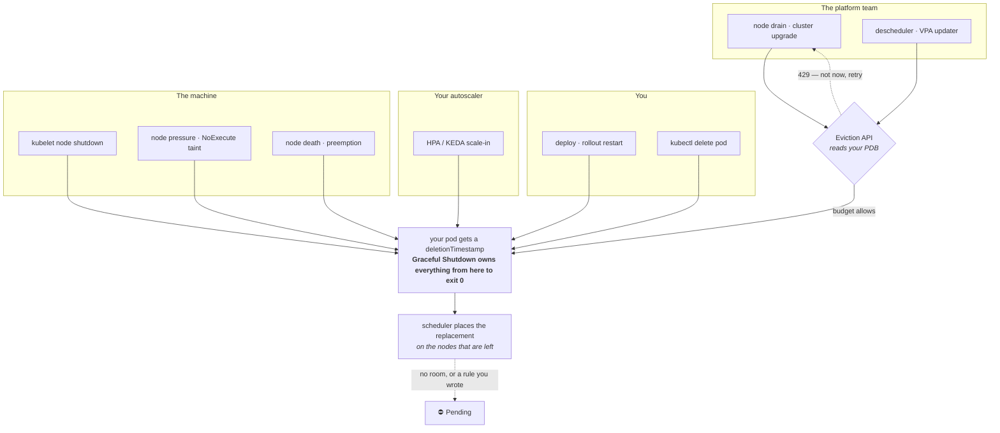

This section teaches you to survive the deaths you didn't schedule. Your deploy pipeline kills pods on purpose and you've tuned that ([Rollout & Shutdown Knobs](/tuning/rollout-shutdown-knobs/) is the dial table). But on *this* platform — a fixed-size, on-prem cluster shared with other teams, patched and upgraded by a platform team on a calendar you don't control — most of the pods that die this year will die because someone else needed the node, or because the machine underneath had an opinion. If the platform team has ever messaged you "your namespace is blocking our drain," or you've found 502s in the error budget on a night nobody deployed, you're in the right place.

**Find your way in.** Nobody reads a playbook cover to cover:

| You are… | Start at |
|---|---|
| Just told your namespace is blocking the platform team's upgrade | [Unjamming a blocked drain, right now](/disruption/pod-disruption-budgets/#unjamming-a-blocked-drain-right-now) — ten minutes, then come back |
| Looking at 502s from a night nobody deployed | [Start From Your Situation](/disruption/scenarios/) — the second block is yours |
| Asking "who killed my pod?" | [The decoder](/disruption/anatomy-of-a-drain/#the-decoder-who-killed-my-pod) |
| Told to have a PodDisruptionBudget by Friday | [The 15-Minute Safe PDB](/disruption/quick-start/) |
| Reviewing another team's PDB PR | [The review checklist](/disruption/platform-contract/#the-pdb-review-checklist) |
| Mid-incident with a pod that won't die | [Stuck Terminating](/troubleshooting/stuck-terminating/) — the runbook; leave this section |
| Just here for the tables | [Disruption on One Page](/disruption/cheat-sheet/) |

Everyone else: read on. This page explains disruption from zero and maps the rest.

## What a disruption actually is

Pods don't stop. Something stops them. Strip away the vocabulary and every pod death on your cluster comes from one of four places:

1. **You** — a deploy, a `kubectl rollout restart`, a `kubectl delete pod`.
2. **Your autoscaler** — the HPA (or KEDA) deciding you need fewer copies after lunch.
3. **The platform team** — draining a node to patch its kernel, upgrade its kubelet, or rebalance the cluster; or a tool they run that moves pods around (a descheduler, the VPA updater).
4. **The machine** — a node shutting down, running out of memory or disk, losing its network, or a scheduler taking your node's room for a higher-priority pod.

And there is exactly one question that decides everything about how much you can do about it: **did it ask first?**

Three words carry the whole section, so here they are in plain language:

- An **eviction** is a *polite* deletion: instead of deleting your pod, the caller asks the API server to delete it, and the API server checks a document you wrote before agreeing. The platform team's tools evict. Everything else in the list above just deletes. (One confusing overlap of words: the kubelet's node-pressure kills are *also* called evictions — `Reason: Evicted` — but they never ask; on this site "eviction" means the polite kind unless a page says otherwise.)
- A **PodDisruptionBudget (PDB)** is that document: the number of your pods you promise will stay healthy, written as a floor ("never fewer than N") or as a ceiling on the missing ("never more than N gone"). It is the *only* thing the eviction check reads. It has no other powers.
- A **drain** is the platform emptying a node before maintenance: first a **cordon** (no new pods may land here), then one polite deletion per pod, retried until each one is allowed. A drain is a rollout you didn't schedule, run by someone who can't see your app.

So the shape of your defense is already visible. Against the platform team's disruptions, the PDB is a *negotiation* — and this section teaches you to write one they can live with. Against your own and your autoscaler's, the PDB is silent; you control those directly. Against the machine's, nothing asks and nothing waits; your only defenses are replicas, spread, and speed.

## Why it's harder here than in the tutorial

Every cloud tutorial about PDBs carries three silent assumptions: the cluster has spare nodes for your pods to land on, your app runs at a steady replica count, and maintenance happens when you're watching. None of those are true for you.

**The cluster has 12 nodes and a drain takes one of them away.** When node 7 is cordoned, every pod on it — yours and four other teams' — needs room on the remaining eleven, which were already full enough to make the [capacity ledger](/autoscaling/capacity-and-governance/) nervous. An eviction your budget permits is only half of a drain; the other half is a scheduler looking for room, under rules *you* wrote for a cluster that had one more node than it has right now. That half has its own page: [Where Your Pods Land](/disruption/where-pods-land/).

**The drain doesn't read your load profile.** It arrives at 3 a.m., when the HPA has scaled you down to `minReplicas`, *and* at 12:30, when you're at the ceiling and every pod is earning its keep. A budget that works at one end of the day and permits nothing at the other is the most common PDB on this cluster, and it's the reason the platform team knows your team's name. [PDBs, All the Way Down](/disruption/pod-disruption-budgets/) derives budgets that hold at both ends.

**Maintenance happens on their calendar.** The platform team drains nodes in windows they announce (or don't); their tooling has a timeout, and when the timeout expires something happens to your pods that you didn't choose. [The Maintenance Contract](/disruption/platform-contract/) is how you find out what, and negotiate it.

Here's the whole landscape, with the one gate drawn in. One term the picture uses: the **deletionTimestamp** is the stamp the API server puts on a pod the moment its deletion is agreed — asked-for or not — and it's the starting gun for everything [Graceful Shutdown](/workloads/graceful-shutdown/) describes.

Read the arrows: only the platform team's tools go *through* the gate. Everything else goes around it. The pod's death itself is one box, deliberately — it has [its own page](/workloads/graceful-shutdown/), and this section never re-explains it. The scheduler box at the bottom is the half of the drain nobody plans for.

Each arrow is a page: the gate and the platform's tools are [What a Drain Actually Does](/disruption/anatomy-of-a-drain/); the document the gate reads is [PDBs, All the Way Down](/disruption/pod-disruption-budgets/); the bottom box is [Where Your Pods Land](/disruption/where-pods-land/); the machine's arrows are [When Nobody Asked](/disruption/involuntary-disruptions/); stateful and quorum workloads get [their own treatment](/disruption/stateful-and-quorum/); and the people behind the platform arrows are [The Maintenance Contract](/disruption/platform-contract/).

## The three questions every disruption answers

The section is organized around three questions, and every page tells you which one it serves:

1. **Who decides, and do they ask?** — the gate. Four sources of death, one of which reads your PDB. Which disruptions consult the budget, which honor your grace period (and whose number caps it), and who recreates the pod afterward — this section answers that per source, in one table you'll see condensed on the [cheat-sheet](/disruption/cheat-sheet/) and in full on [When Nobody Asked](/disruption/involuntary-disruptions/).
2. **How does it die?** — owned entirely by [Graceful Shutdown](/workloads/graceful-shutdown/): the SIGTERM race, the preStop sleep, the grace-period budget, PID 1. The moment any page here reaches "…and then your pod gets its deletionTimestamp," it links there and stops. If you haven't passed [the shutdown audit](/workloads/graceful-shutdown/#the-shutdown-audit), a PDB makes your evictions *sequential*, not *clean* — it's a prerequisite of the [quick start](/disruption/quick-start/), not an optional extra.
3. **Where does it land?** — the scheduling half. The replacement is a brand-new pod that must pass every rule you set (anti-affinity, topology spread, volume affinity, quota) and fit in headroom that four other teams' replacements are landing in at the same moment. [Where Your Pods Land](/disruption/where-pods-land/).

## The maturity ladder

You do not need all of this at once. Each level is a fine place to stop and live for a quarter:

| Level | What it looks like | You are here if… | The pages |
|---|---|---|---|
| **0 — One replica, no budget** | `replicas: 1`, nothing written down | every drain is an outage you attribute to "the platform did something" | — |
| **1 — A safe budget** | `replicas ≥ 2`, `maxUnavailable: 1`, `unhealthyPodEvictionPolicy: AlwaysAllow`, the shutdown audit passed | you were told to have a PDB by Friday | [Quick start](/disruption/quick-start/) |
| **2 — Landing verified, budget watched** | spread across nodes, N−1 headroom checked, no node-pinned volumes, an alert on `disruptionsAllowed == 0` | your PDB "works" but pods sat Pending after the last drain, or nobody noticed the budget was at zero for a week | [Anatomy](/disruption/anatomy-of-a-drain/), [Where pods land](/disruption/where-pods-land/), [Alerts](/disruption/platform-contract/#alerts-and-dashboards) |
| **3 — Budgets derived, at both ends of the day** | shape and number derived from the SLO at the HPA floor *and* ceiling; quorum-aware budgets on stateful sets | you run an HPA, or anything with a quorum | [PDBs](/disruption/pod-disruption-budgets/), [Stateful](/disruption/stateful-and-quorum/) |
| **4 — The contract** | maintenance calendar agreed, drain timeout known, the window runbook run every window, the no-zero-budget rule in CI | you're the SRE rolling this out to five teams | [Platform contract](/disruption/platform-contract/) |

The next step is always one level up, never a leap to the top.

## The four questions before any PDB

Every page in this section is ultimately serving one of these. Ask them in order, for every workload:

1. **What did you promise users — at both ends of the day?** Not "we can lose one pod"; something derived from the [SLO you already wrote for scaling](/autoscaling/slos-for-scaling/), checked at the trough *and* at the peak, because the drain doesn't pick its moment. → [The canonical PDB table](/disruption/pod-disruption-budgets/#the-canonical-pdb-table)
2. **Who is allowed to kill this pod, and do they ask first?** The answer is different for a drain, a scale-in, and a kernel panic — and your pod carries a condition that tells you which one happened. → [The decoder](/disruption/anatomy-of-a-drain/#the-decoder-who-killed-my-pod)
3. **Where does the replacement go when a node is missing?** With your anti-affinity, your spread rules, your volume, your quota — on a cluster that just lost a twelfth of itself. → [Where Your Pods Land](/disruption/where-pods-land/)
4. **Who finds out when it goes wrong — you, or the platform team six hours later?** A budget that permits nothing doesn't fail loudly; it stalls someone else's job until a human with cluster-admin overrides it. → [The Maintenance Contract](/disruption/platform-contract/)

## The citizenship contract

One idea underpins the whole section, so it's stated once, here — the mirror image of the [autoscaling contract](/autoscaling/overview/#the-citizenship-contract) that says requests are reservations on a shared pool:

**A PodDisruptionBudget is a message to the platform team, and every disruption you forbid is a maintenance window someone else absorbs.** The kernels get patched, the kubelets get upgraded, the nodes get rebalanced — by people who have to move your pods to do it. A budget that permits zero evictions doesn't protect you. It converts routine maintenance into a stalled job, then into a human with cluster-admin, then into an override at a time you didn't choose — and by then it has protected nothing. [The Field Note](/blog/the-pdb-that-blocked-the-drain/) is six hours of exactly that.

So the contract is: **always permit at least one eviction at steady state; say what you can absorb in numbers derived from your SLO rather than what you'd prefer (nothing, ever); and never write a budget that forces them to override you.** `maxUnavailable: 0`, `minAvailable: 100%`, or a `minAvailable` equal to your replica count require a written platform-team sign-off that names who gets paged when the drain stalls. The same courtesy extends to the scheduling side: required anti-affinity, hard topology spread, and self-promoted PriorityClasses all claim node headroom that other tenants' replacements need in the same window. You'll meet a `:::tip[Good citizen]` aside wherever a knob could be set selfishly.

## Who owns what

The recurring boundary table, at section level. Details vary per page, but the shape never does:

| Concern | PLATFORM team | YOU (the delivery team) |
|---|---|---|
| Node lifecycle: cordon, drain, patch, upgrade | ✔ operates | survive it |
| Drain tooling, its timeout, what happens at expiry | ✔ sets | ask, and size your budget against it |
| kubelet shutdown windows, node-pressure thresholds | ✔ sets | ask; fit your drain time inside |
| PriorityClasses; descheduler / VPA policy | ✔ defines | use honestly |
| Maintenance calendar and announcements | ✔ publishes | run the window runbook |
| RBAC for `pods/eviction`, reading nodes and PVs | ✔ grants on request | ask once, with the justification |
| Replicas, spread, volumes | | ✔ yours |
| PDB shape and number, with the derivation written down | | ✔ yours, reviewed |
| How the pod dies (shutdown wiring) | | ✔ [Graceful Shutdown](/workloads/graceful-shutdown/) |
| The budget alert; the before/during/after runbook | | ✔ yours |

If a checklist item in this section fails on the left column, that's a named ask to the platform team — [The Maintenance Contract](/disruption/platform-contract/) has the asks pre-written, and [Working With the Platform Team](/operations/working-with-platform-team/) covers how to make them well.

:::note[Where's graceful shutdown?]
It's the pod's half of the story, and it has its own page: [Graceful Shutdown and the Termination Lifecycle](/workloads/graceful-shutdown/). This section starts where that page ends. Every disruption in the map above — asked or not — ends with the same deletionTimestamp, the same preStop-then-SIGTERM sequence, the same `G > S + D + margin` budget, and none of it is repeated here. The one thing this section adds to that story: some disruptions cap your grace period with a number you don't own (the kubelet's shutdown window, a `--grace-period` on the drain command), which is why the [contract page](/disruption/platform-contract/) asks for those numbers.
:::

## Start here by archetype

If you already know what kind of workload you have:

| Your workload | Where its budget is derived |
|---|---|
| Stateless API behind a Service (`payments-api`, `catalog-web`) | [The canonical PDB table](/disruption/pod-disruption-budgets/#the-canonical-pdb-table) — `maxUnavailable: 1`, and why not the alternatives |
| Queue consumer (`dispatch-worker`, `notify-worker`, `catalog-indexer`) | [The same table](/disruption/pod-disruption-budgets/#the-canonical-pdb-table) — a freshness SLO permits a brief zero, and you say so |
| Stateful or quorum-bearing (Valkey, PostgreSQL, Kafka, RabbitMQ) | [Draining Stateful and Quorum Workloads](/disruption/stateful-and-quorum/) — one member at a time, and check whether the operator already wrote the PDB |
| Batch Job or CronJob | [Jobs: stop burning retries on drains](/disruption/involuntary-disruptions/#jobs-stop-burning-retries-on-drains) — no PDB; a `podFailurePolicy` instead |

And when you want to *feel* all of this on a laptop instead of reading about it — evict your own pod through the API, watch a budget say no, reproduce a blocked drain from the platform's seat, read the condition off a dying pod — [Lab 11](/labs/lab-11-survive-the-drain/) does it on the labs cluster, every command runnable as-is.

## Where next

- **Next in the journey:** [The 15-Minute Safe PDB](/disruption/quick-start/) — the smallest budget that can't hurt anyone, and the sixty-second drill that proves it.
- **The lateral jump:** if a specific pain brought you here, [Start From Your Situation](/disruption/scenarios/) routes you straight to it.
