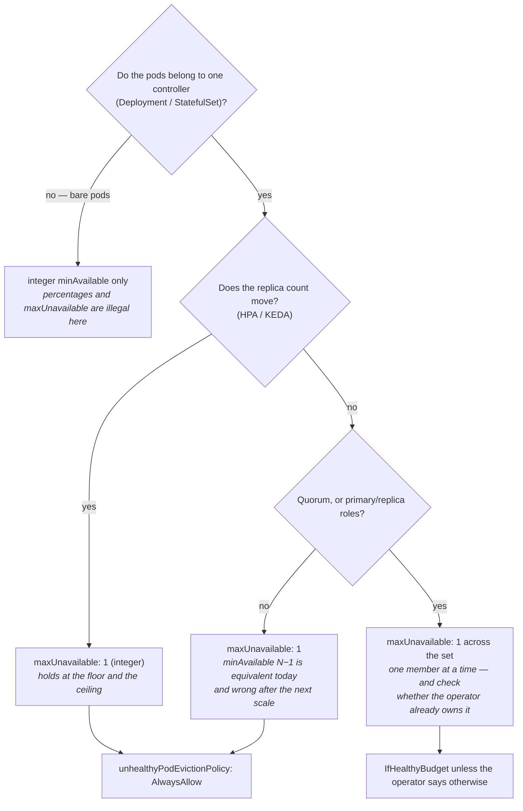

You are here if: you need to write a PDB and want it to be right the first time; or `kubectl get pdb` says `ALLOWED DISRUPTIONS 0` and you don't know why; or the platform team is waiting on you and you need the ten-minute fix before the proper one.

A PDB is one number and one shape. The number comes from what you promised users; the shape decides whether the number still works at 3 a.m. Everything else on this page is the arithmetic the controller does, so you can predict what it will say before the platform team reads it to you.

This page serves the section's first question — *who decides, and do they ask?* — on the negotiation side. What a drain does with the answer is [the anatomy page](/disruption/anatomy-of-a-drain/); how the pod then dies is [Graceful Shutdown](/workloads/graceful-shutdown/) and is not repeated here.

## What a budget is

Three definitions, plainly:

- A **PodDisruptionBudget** selects a set of pods (by labels, like a Service does) and states how many of them must stay **healthy** — where healthy means *Ready*, as judged by the readiness probe. Not Running. Not "exists." Ready.
- The **budget** is `disruptionsAllowed`: how many of those pods the Eviction API may take *right now* without breaking the promise. It's recomputed continuously by a controller and published in the PDB's status. You never set it; you set the promise, and the controller derives it.
- The **only** reader of that number is the Eviction API. Node drains, the descheduler, the VPA updater, and anything else that evicts rather than deletes will be told *no* when it's zero. Nothing else — not your rollouts, not your HPA, not `kubectl delete`, not the kubelet — ever looks at it ([what a PDB is not](#what-a-pdb-is-not)).

The promise can be written two ways, and the choice matters more than the number.

## The two shapes

**`minAvailable` — a floor.** "Never fewer than N healthy."

```yaml
apiVersion: policy/v1
kind: PodDisruptionBudget
metadata:
  name: payments-api
  namespace: payments
spec:
  minAvailable: 1          # a FLOOR: at least this many must stay Ready, whatever the replica count
  selector:
    matchLabels:
      app.kubernetes.io/name: payments-api
      app.kubernetes.io/instance: payments
```

**`maxUnavailable` — a ceiling on the missing.** "Never more than N gone."

```yaml
apiVersion: policy/v1
kind: PodDisruptionBudget
metadata:
  name: payments-api
  namespace: payments
spec:
  maxUnavailable: 1        # a CEILING on the missing: at most this many may be non-Ready, whatever the count
  unhealthyPodEvictionPolicy: AlwaysAllow   # let the platform remove pods that are already broken (below)
  selector:
    matchLabels:
      app.kubernetes.io/name: payments-api
      app.kubernetes.io/instance: payments
```

One shape per PDB — the API rejects both fields together. The legality rules, in plain words:

- `maxUnavailable` (and any percentage) needs every selected pod to have a controller whose desired count the PDB controller can read — a Deployment (through its ReplicaSets), a StatefulSet, a ReplicationController, or anything with a scale subresource — because it needs a "total" to subtract from. Pods from several such controllers are summed.
- Pods with **no controller** (bare pods) may only use an **integer** `minAvailable`. The API accepts the other shapes, but the status never computes — no controller, no total — and the drain gets a 429 forever.
- Percentages of either shape resolve against the controller's desired replica count, not against a pod headcount.

| | `minAvailable` (floor) | `maxUnavailable` (ceiling on missing) |
|---|---|---|
| **What you gain** | Reads like the promise ("keep 2 alive"); legal on bare pods | Scales with the replica count automatically — one number holds at the HPA floor *and* ceiling; rounding works in your favor |
| **What you pay** | An integer floor doesn't move when the HPA does: equal to `minReplicas` it permits **zero** at the trough ([the 3 a.m. problem](#pdb-and-hpa-the-3-am-problem)); percentages round *against* you | Requires a single controller; means nothing on bare pods |
| **Use it when** | Bare pods; a fixed-size quorum where "N−1 down" and "keep 2" happen to coincide — and even then, prefer the other column | Everything with a Deployment or StatefulSet behind it, which is everything you run |

The trade: `maxUnavailable` is right for every workload on this site's cast, and the rest of this page assumes it unless a section says otherwise.

## The arithmetic

The controller publishes four numbers and derives the fifth. Three terms first, in plain words (each gets its full treatment in [the status block](#the-status-block-field-by-field) below): **`expectedPods`** is how many pods the controller *wants*; **`currentHealthy`** is how many are Ready right now; **`desiredHealthy`** is how many your shape says must stay Ready. Formally:

```text
expectedPods      = Σ .spec.replicas of the controller(s) behind the selected pods
                    (integer minAvailable is the exception: a headcount of selected pods)
desiredHealthy    = minAvailable                        (integer)
                  = ceil(minAvailable% × expectedPods)   (percentage — rounds UP, against you)
                  = expectedPods − maxUnavailable        (integer)
                  = expectedPods − ceil(maxUnavailable% × expectedPods)   (rounds UP, for you)
currentHealthy    = selected pods that are Ready and not already Terminating
disruptionsAllowed = max(0, currentHealthy − desiredHealthy)
```

**Both percentages round up.** On a floor that's a bigger floor; on a ceiling that's a bigger ceiling. Worked with the cast's `payments-api`, all pods healthy, at three replica counts the HPA actually visits:

| Shape | Value | `expectedPods` 2 (the 3 a.m. floor) | 4 | 16 (the lunch ceiling) |
|---|---|---|---|---|
| `minAvailable` | `1` | desired 1 → **allowed 1** | 1 → 3 | 1 → 15 |
| `minAvailable` | `2` | desired 2 → **allowed 0** | 2 → 2 | 2 → 14 |
| `minAvailable` | `80%` | ceil(1.6) = 2 → **0** | ceil(3.2) = 4 → **0** | ceil(12.8) = 13 → 3 |
| `maxUnavailable` | `1` | desired 1 → **allowed 1** | 3 → 1 | 15 → 1 |
| `maxUnavailable` | `10%` | ceil(0.2) = 1 → 1 | ceil(0.4) = 1 → 1 | ceil(1.6) = 2 → **2 at once** |
| `maxUnavailable` | `25%` | ceil(0.5) = 1 → 1 | 1 → 1 | 4 → **4 at once** |

Two rows are the whole lesson. `minAvailable: 80%` permits nothing at 2 *or* 4 replicas — this is [the Field Note's](/blog/the-pdb-that-blocked-the-drain/) `audit-writer`, "4 replicas, 80% = ceil 4". And `maxUnavailable: 25%` permits four pods to leave at once at the ceiling, which is a quarter of your lunchtime capacity — fine for a worker, an SLO burn for an API. Integer `maxUnavailable: 1` is the only row that says the same thing on every line.

You can watch the controller do this arithmetic. The columns are the fields above:

```bash
# seat: tenant
kubectl get pdb -n payments -o custom-columns=NAME:.metadata.name,MIN:.spec.minAvailable,MAX:.spec.maxUnavailable,EXPECTED:.status.expectedPods,DESIRED:.status.desiredHealthy,ALLOWED:.status.disruptionsAllowed
```

```console
NAME           MIN      MAX      EXPECTED   DESIRED   ALLOWED
payments-api   <none>   1        2          1         1
```

Change the shape to `80%` and the same command shows `DESIRED 2  ALLOWED 0` — the rounding, observed. (The lab does exactly this, [step 4](/labs/lab-11-survive-the-drain/).)

## The status block, field by field

The first time you read a PDB's status, read all of it. `payments-api` at its 3 a.m. floor of two:

```bash
# seat: tenant
kubectl get pdb payments-api -n payments -o yaml
```

```yaml
status:
  conditions:
  - lastTransitionTime: "2026-09-10T02:30:36Z"
    message: ""
    observedGeneration: 1
    reason: SufficientPods         # or InsufficientPods, or SyncFailed
    status: "True"
    type: DisruptionAllowed
  currentHealthy: 2                # selected pods that are Ready right now
  desiredHealthy: 1                # what the shape requires: expectedPods − maxUnavailable
  disruptionsAllowed: 1            # THE budget: currentHealthy − desiredHealthy, floored at 0
  expectedPods: 2                  # from the Deployment's .spec.replicas — follows the HPA
  observedGeneration: 1            # the spec version these numbers were computed from
```

Field by field, with the rule for each:

- **`expectedPods`** — the controller's desired count, read through the scale subresource. It follows the HPA, so at 12:30 this reads `16`. **If it reads `0`, the selector matches nothing** — your PDB guards no pods, and `kubectl describe pdb` will show a repeating `NoPods — No matching pods found` event. That's [selector drift](#selectors-guard-exactly-one-thing).
- **`desiredHealthy`** — the promise, resolved against `expectedPods`. Recomputed whenever the HPA moves.
- **`currentHealthy`** — Ready pods, excluding any already carrying a deletionTimestamp. A replacement that's Pending or still starting isn't here yet; this number is why the budget stays spent for exactly your startup time after each eviction.
- **`disruptionsAllowed`** — `currentHealthy − desiredHealthy`, never negative. This is the number the Eviction API reads and the `ALLOWED DISRUPTIONS` column in `kubectl get pdb`. **Define → observe → decide:** `0` with every pod Ready → your shape permits nothing at this count → fix the shape (this page). `0` with `currentHealthy < desiredHealthy` → you're degraded → fix the pods, not the PDB; the budget is correctly refusing to make it worse. `0` with `expectedPods: 0` → the PDB guards nothing → fix the selector.
- **`disruptedPods`** — not shown above because it's usually empty when you look: the controller's short-term memory of pods whose eviction was granted but whose deletionTimestamp it hasn't observed yet, each held against the budget for up to two minutes so a burst of evictions can't double-spend. It's why `ALLOWED` drops the *instant* an eviction is granted, before the pod visibly changes.
- **`conditions[DisruptionAllowed]`** — the same fact as a condition: `SufficientPods` (budget ≥ 1), `InsufficientPods` (budget 0), or `SyncFailed` — the controller couldn't compute at all, typically a `maxUnavailable` or percentage shape over pods whose controller has no readable scale. (Bare pods under those shapes show up as an `UnmanagedPods` warning in `kubectl describe pdb` instead.)

`kubectl describe pdb payments-api -n payments` prints the same numbers as `Allowed disruptions / Current / Desired / Total` plus the events, which is the fastest way to catch `NoPods`.

## unhealthyPodEvictionPolicy: letting the broken ones go

State the default rule first, plainly, because it's the one that jams drains for hours: **under `IfHealthyBudget` (the default), a pod that is Running but not Ready may be evicted only while the budget is currently met** — `currentHealthy ≥ desiredHealthy`. The moment you're short of healthy pods, *nothing* can be evicted. Not the healthy ones (correct: that would make it worse) and not the broken ones either (the jam: removing a pod that serves nothing can't make anything worse, but the default rule doesn't know that).

The jam, with numbers. `catalog-web` runs 4 replicas with `maxUnavailable: 1`, so `desiredHealthy` is 3. A bad config rollout leaves **two** pods in `CrashLoopBackOff`:

```bash
# seat: tenant
kubectl get pdb catalog-web -n payments -o custom-columns=NAME:.metadata.name,POLICY:.spec.unhealthyPodEvictionPolicy,CURRENT:.status.currentHealthy,DESIRED:.status.desiredHealthy,ALLOWED:.status.disruptionsAllowed
```

```console
NAME          POLICY            CURRENT   DESIRED   ALLOWED
catalog-web   IfHealthyBudget   2         3         0
```

Now the platform drains the node that hosts one of the *broken* pods:

```console
error when evicting pods/"catalog-web-6f7d8c9b5-m2xkq" -n "payments" (will retry after 5s): Cannot evict pod as it would violate the pod's disruption budget.
```

The drain is stuck on a pod that hasn't served a request in an hour. It will stay stuck until you fix the rollout — or until the platform's timeout expires and a human overrides you. (For contrast: with only *one* broken pod, `currentHealthy` is 3, the budget is met, and the default policy lets the broken pod go. The jam needs more unhealthy pods than the budget spares — which is exactly what a bad rollout or a memory-pressure night produces.)

The fix is one field:

```bash
# seat: tenant
kubectl patch pdb catalog-web -n payments --type merge -p '{"spec":{"unhealthyPodEvictionPolicy":"AlwaysAllow"}}'
```

```console
poddisruptionbudget.policy/catalog-web patched
```

Under `AlwaysAllow`, Running-but-not-Ready pods are always evictable — the platform's next retry gets a `201` for the broken pod — while the healthy pods stay protected, because for *them* the budget is still unmet. The lab reproduces the whole sequence deterministically in four commands ([step 5](/labs/lab-11-survive-the-drain/)).

| | `IfHealthyBudget` (default) | `AlwaysAllow` |
|---|---|---|
| **What you gain** | A pod that's mid-startup and not yet Ready can't be evicted while you're already short — it gets its chance to come up | Drains never stall on your broken pods; the platform can always remove what's already down |
| **What you pay** | The jam above: a crashlooping pod blocks the drain for as long as you're short of healthy pods | A slow-starting replacement may be evicted before it becomes Ready, if a drain reaches its node during startup — mitigated by [honest startup probes](/tuning/health-check-knobs/), and by knowing how many nodes the platform's tooling drains at once ([ask](/disruption/platform-contract/#what-to-ask)) |

Stable since 1.31. **Recommendation for this shop:** `AlwaysAllow` on everything stateless — the failure it prevents costs the platform team hours; the failure it allows costs you one restart. Think twice only for quorum members mid-resync ([the stateful page](/disruption/stateful-and-quorum/) says why).

## Selectors: guard exactly one thing

The selector is where PDBs quietly fail. Three rules:

**Match exactly one controller's pods, exactly.** Copy the Deployment's `spec.selector.matchLabels` — not a subset, not the pod's full label set. In Helm, don't copy at all; use the same helper the Deployment uses, so they can't drift:

```yaml
# charts/payments-api/templates/pdb.yaml
{{- if .Values.pdb.enabled }}
apiVersion: policy/v1
kind: PodDisruptionBudget
metadata:
  name: {{ include "payments-api.fullname" . }}
  labels:
    {{- include "payments-api.labels" . | nindent 4 }}
spec:
  {{- if .Values.pdb.minAvailable }}
  minAvailable: {{ .Values.pdb.minAvailable }}
  {{- else }}
  maxUnavailable: {{ .Values.pdb.maxUnavailable }}
  {{- end }}
  unhealthyPodEvictionPolicy: {{ .Values.pdb.unhealthyPodEvictionPolicy }}
  selector:
    matchLabels:
      {{- include "payments-api.selectorLabels" . | nindent 6 }}   # the SAME helper the Deployment uses
{{- end }}
```

**Never overlap.** Two PDBs whose selectors both match a pod don't combine — the Eviction API refuses to evaluate at all, on every attempt, forever:

```console
Error from server: This pod has more than one PodDisruptionBudget, which the eviction subresource does not support.
```

The usual ways to get here: an old hand-written PDB left behind when the chart grew a templated one; a broad selector (`app.kubernetes.io/instance: payments`) that catches both `payments-api` and `dispatch-worker`; or *your* PDB plus one an operator already manages ([the stateful page](/disruption/stateful-and-quorum/#who-owns-the-pdb) lists which operators do). Audit before adding:

```bash
# seat: tenant — every PDB in the namespace and what it selects
kubectl get pdb -n payments -o custom-columns=NAME:.metadata.name,SELECTOR:.spec.selector.matchLabels,EXPECTED:.status.expectedPods
```

```console
NAME                 SELECTOR                                                                   EXPECTED
payments-api         map[app.kubernetes.io/instance:payments app.kubernetes.io/name:payments-api]   2
payments-api-legacy  map[app.kubernetes.io/instance:payments]                                    10
```

`payments-api-legacy` selects ten pods across three Deployments — it overlaps every other PDB in the namespace and blocks every drain. Delete it.

**Watch for drift.** A Helm rename, a label convention change, a copy-pasted chart: the Deployment's labels move, the PDB's don't, and the PDB now guards nothing. The tell is `expectedPods: 0` and `ALLOWED DISRUPTIONS 0` on a perfectly healthy day — the [alert below](#alerts) catches it; so does a `NoPods` event in `kubectl describe pdb`.

## PDB and HPA: the 3 a.m. problem

This is the section's signature interaction, and the reason the shape matters more than the number. `payments-api` runs under an HPA with `minReplicas: 2` and `maxReplicas: 16` ([derived on the Oracle page](/autoscaling/rest-api-oracle/)); its [load profile](/autoscaling/load-profile/) is 40 rps at 02:00–05:00 and 900 rps at the weekday lunch peak, at 60 rps per pod. The drain doesn't consult any of that. It comes when the patch is ready.

Because `expectedPods` follows the HPA, the budget's arithmetic changes with the time of day:

| | 03:00 — HPA at the floor (2 pods, 40 rps) | 12:30 — HPA at the ceiling (16 pods, 900 rps) |
|---|---|---|
| `minAvailable: 2` | desired 2, current 2 → **allowed 0**. The drain retries until the platform's timeout, then someone gets paged — at 3 a.m. | allowed 14. Fourteen pods leave at once; two carry 900 rps at 60 each. SLO gone. |
| `maxUnavailable: 10%` | ceil(0.2) = 1 → allowed 1 ✔ | ceil(1.6) = 2 → allowed 2. Fourteen pods carry 900 rps = 840 capacity. SLO burning for the drain's duration. |
| `maxUnavailable: 1` | allowed 1. One pod carries 40 rps of its 60 ✔ | allowed 1. Fifteen pods carry 900 rps — at capacity, inside the error budget for a minute ✔ |

Rule: **for HPA-managed workloads, `maxUnavailable` as an integer — and check the ceiling row, not just the floor.** The ceiling row is also why the [contract page](/disruption/platform-contract/) asks for windows outside 12:00–13:30: `maxUnavailable: 1` *holds* at peak, but only just.

The second interaction runs the other way. The HPA's own scale-in is a disruption that never consults the PDB — the ReplicaSet controller simply deletes surplus pods. Its only pacing is the HPA's `behavior.scaleDown` policy (`1 pod per 120 s` on the Oracle page), and its only safety is the termination choreography. If your service deploys cleanly and drains cleanly but throws 502s every day at 14:00 when load drops, that's scale-in, and no budget on earth would have helped: [the scale-down note](/architectures/zero-downtime/#hpa--the-scale-down-note).

## The canonical PDB table

Every budget in this section derives from a row here, exactly as every HPA target derived from [the canonical SLO table](/autoscaling/slos-for-scaling/). The rung the drain adds: the budget must hold at *both* ends of the load table, because the drain doesn't pick its moment.

```text
user promise (SLO) → load when the drain arrives (floor AND ceiling) → pods needed → how many may be missing → shape + number
```

| Workload | SLO → shape | At the floor | At the ceiling | PDB | Why not the alternative |
|---|---|---|---|---|---|
| `payments-api` | 99.9% < 800 ms; latency-shaped → **no zero, ever**. 60 rps/pod, floor 2 (40 rps), ceiling 16 (900 rps) | 1 pod carries 40 rps ✔ | 15 pods carry 900 rps — holds, at the boundary: 60 rps/pod is the knee, so a lunchtime drain spends error budget for its duration | `maxUnavailable: 1` | `minAvailable: 2` → 0 at the floor; `10%` → 2 at the ceiling → 840 < 900 |
| `dispatch-worker` | 99% processed < 5 min; freshness-shaped → **a zero is allowed if the gap is short**. Floor 1, ceiling 8 | 0 consumers for the replacement time R (~60–90 s JVM start) — 5-minute budget, *stated* | 7 of 8 keep draining ✔ | `maxUnavailable: 1` | `minAvailable: 1` → 0 at the floor, and the drain waits forever for a consumer with nowhere to go |
| `notify-worker` | 99% sent < 15 min; floor 1, ceiling 6 | same shape, larger freshness budget | 5 of 6 ✔ | `maxUnavailable: 1` | — |
| `catalog-web` | 99% < 1 s; floor 2, ceiling 12 | 1 pod at the trough ✔ (check the [web page's](/autoscaling/web-worker-and-caches/) per-pod number) | 11 of 12 ✔ | `maxUnavailable: 1` | — |
| `catalog-indexer` | fresh < 10 min; freshness-shaped | 0 for R, stated | — | `maxUnavailable: 1` | — |
| `valkey-primary` / `valkey-replica` (StatefulSets, one pod each) | role-shaped → **honest singletons**: a primary lost is a write blip, a replica lost is degraded reads | one failover's write blip | — | `maxUnavailable: 1` + `AlwaysAllow` per role, two PDBs (what [the shared-VIP build](/architectures/valkey-shared-vip/#3g-poddisruptionbudgets) ships) | these protect nothing and document that; if "never both at once" ever matters, one budget *spanning* both roles with `maxUnavailable: 1` is what serializes them — [the stateful page](/disruption/stateful-and-quorum/#the-rule-and-its-two-shapes) |

The [fallback ladder](/autoscaling/slos-for-scaling/#the-fallback-ladder) applies unchanged: (a) SLO-derived, as above; (b) a proxy from observed behavior — "N−1 pods held last Tuesday's peak, PROVISIONAL"; (c) the floor — "we believe we can lose one pod" written down as an objective with a TODO. Any level is acceptable **if it's stated**, and the place to state it is the values file:

```yaml
# charts/payments-api/values.yaml
pdb:
  enabled: true
  maxUnavailable: 1
  # derivation (level a — SLO): 99.9% < 800 ms at 60 rps/pod. Holds at the HPA floor
  # (2 pods: 1 carries 40 rps) and at the ceiling (16 pods: 15 carry 900 rps peak).
  # minAvailable rejected: an integer floor equal to minReplicas permits 0 at 03:00.
  # Reviewed 2026-09-10 against load-profile state table.
  minAvailable: ""                         # leave empty — see the derivation above
  unhealthyPodEvictionPolicy: AlwaysAllow  # stateless: let the platform remove broken pods
```

Reviewers ([the checklist](/disruption/platform-contract/#the-pdb-review-checklist)) read the comment and its date, not the number.

## PDB and rollouts

Rollouts ignore the budget — a Deployment's own `maxUnavailable` governs them ([Rollouts and Rollbacks](/workloads/rollouts-and-rollbacks/)). And, less obviously, a rollout doesn't move the budget's inputs much either: both ReplicaSets resolve to the same Deployment, so `expectedPods` stays at the Deployment's replica count throughout. What does move is `currentHealthy` — up by one for the moment a surge pod is Ready before the old pod it replaces starts terminating (the budget briefly *over*-permits by one), then back as the Terminating pod drops out of the count. A drain arriving mid-rollout is therefore not blocked by the budget. It's still a bad moment for one: surge pods and evicted pods' replacements are competing for the same landing room ([the other half](/disruption/where-pods-land/)), and two things moving pods at once makes any incident twice as hard to read. That — not the arithmetic — is why the [window runbook](/disruption/platform-contract/#the-maintenance-window-runbook) checks "no rollout in progress" before a window.

## The one-replica honesty

Some things genuinely can't run twice — a per-instance license, a single-writer process, a legacy app with local state. The honest PDB for a singleton is:

```yaml
spec:
  maxUnavailable: 1                         # permits the eviction — and DOCUMENTS the outage instead of blocking maintenance
  unhealthyPodEvictionPolicy: AlwaysAllow   # REQUIRED here: with one replica, desiredHealthy is 0, and the default
                                            # policy's "unhealthy pods may go while the budget is met" rule never
                                            # engages — a crashlooping singleton would still get a 429
```

It protects nothing, and it isn't supposed to. (The policy line isn't optional on a singleton: the default rule that lets broken pods go only applies when `desiredHealthy > 0`, so without `AlwaysAllow` a crashlooping singleton blocks the drain exactly like the jam above — verified in [the lab](/labs/lab-11-survive-the-drain/).) Its job is to mark the workload as disruption-managed, keep the drain moving, and put the outage where everyone can see it — paired with an agreed window ([the contract](/disruption/platform-contract/)) and, for anything users depend on, a plan to stop being a singleton. `minAvailable: 1` on one replica is the opposite: it permits nothing, blocks every drain, and ends with [the Field Note](/blog/the-pdb-that-blocked-the-drain/). If you have one replica, the fix is two replicas — and until then, a budget that tells the truth. ([Lab 9's Valkey](/labs/lab-9-valkey/) ships exactly this pattern on its singleton.)

:::tip[Good citizen]
`maxUnavailable: 0`, `minAvailable: 100%`, or `minAvailable` equal to your replica count is you telling the platform team they may never patch a node you're on. That's not a setting; it's a request for someone else to absorb your risk during every maintenance window. On this cluster it requires a written platform-team sign-off that names who gets paged when the drain stalls — and the sign-off has never once been the easier path.
:::

## What a PDB is not

Each row names what *does* protect you there:

| Disruption | Does it consult the PDB? | What protects you instead |
|---|---|---|
| `kubectl delete pod` | No | Nothing; it's you |
| A rollout | No — its own `maxUnavailable` | [Rollout knobs](/tuning/rollout-shutdown-knobs/) |
| HPA / KEDA scale-in | No | `behavior.scaleDown` pacing + [termination choreography](/workloads/graceful-shutdown/) |
| OOMKill, node-pressure eviction | No | Requests, limits, QoS — [Resources & QoS](/workloads/resources-and-qos/) |
| `NoExecute` taint (node NotReady) | No | `tolerationSeconds`, replicas, spread — [Node Problems](/troubleshooting/node-problems/) |
| kubelet graceful node shutdown | No | Replicas, spread, a drain time that fits their window — [When Nobody Asked](/disruption/involuntary-disruptions/) |
| Node death | No | Replicas and spread, full stop |
| Scheduler preemption | Best effort | Honest PriorityClass; spread |
| Node drain, descheduler, VPA updater | **Yes** | This page |

The PDB counts involuntary losses *against* the budget — a node crash that takes one `payments-api` pod leaves `disruptionsAllowed` at 0 until the replacement is Ready, which then correctly blocks a simultaneous drain elsewhere. It just can't prevent the crash.

## Unjamming a blocked drain, right now

The platform team is waiting. Ten minutes, in this order. First, see which jam it is:

```bash
# seat: tenant
kubectl get pdb -n payments
kubectl get pods -n payments -o wide
```

**All pods Ready and `ALLOWED 0` → the shape permits nothing at this count.** Two fixes; do the first if the HPA owns the count, the second otherwise — or both:

```bash
# seat: tenant — give the floor one more pod than the promise needs (HPA-managed: raise minReplicas, not replicas)
kubectl patch hpa payments-api -n payments --type merge -p '{"spec":{"minReplicas":3}}'
```

```bash
# seat: tenant — switch the shape: remove the floor, add a ceiling on the missing
kubectl patch pdb payments-api -n payments --type json \
  -p '[{"op":"remove","path":"/spec/minAvailable"},{"op":"add","path":"/spec/maxUnavailable","value":1}]'
```

**A pod is `0/1 Running` (crashlooping, failing readiness) and `ALLOWED 0` → the unhealthy-pod jam.**

```bash
# seat: tenant
kubectl patch pdb payments-api -n payments --type merge -p '{"spec":{"unhealthyPodEvictionPolicy":"AlwaysAllow"}}'
```

**A replacement is `Pending` → the drain removed the room, or a rule you wrote did.** Nothing on the PDB fixes this; [Where Your Pods Land](/disruption/where-pods-land/) does. Tell the platform team which it is while you look.

**You genuinely cannot afford the eviction today** (a batch that must finish, a singleton mid-migration) → say so, in writing, and accept the consequence: "You may bypass our budget for `payments-api-7c9d4f6b8-r8pqz` with `--disable-eviction`; we accept the outage." That converts a stalled drain into a decision with a name on it, which is the whole point of [the contract](/disruption/platform-contract/#what-to-promise-back).

Then prove it, and tell them:

```bash
# seat: tenant
kubectl get pdb payments-api -n payments
```

```console
NAME           MIN AVAILABLE   MAX UNAVAILABLE   ALLOWED DISRUPTIONS   AGE
payments-api   N/A             1                 1                     94d
```

Their retry loop picks it up within five seconds. Then do the proper fix — the shape belongs in the chart, not in a `kubectl patch` at 3 a.m. — and read [the Field Note](/blog/the-pdb-that-blocked-the-drain/) before the retrospective; someone will ask "how did we ship this?", and the answer is that a PDB that permits zero disruptions looks exactly like safety in code review.

## Which shape?



Where each leaf is explained: bare pods — [the two shapes](#the-two-shapes); the HPA leaf — [the 3 a.m. problem](#pdb-and-hpa-the-3-am-problem); the quorum leaf — [Draining Stateful and Quorum Workloads](/disruption/stateful-and-quorum/); the policy leaves — [`unhealthyPodEvictionPolicy`](#unhealthypodevictionpolicy-letting-the-broken-ones-go).

## Alerts

Two rules, from [kube-state-metrics](/observability/metrics/) (`kube_poddisruptionbudget_status_*`, all stable metrics), each with what fires and what to do:

```promql
# The budget has permitted nothing for 30 minutes.
# Healthy day → your shape permits nothing at this count: fix the shape.
# Degraded fleet → the budget is doing its job; fix the pods.
kube_poddisruptionbudget_status_pod_disruptions_allowed{namespace="payments"} == 0
```

```promql
# The budget guards nothing: selector drift after a rename, or a PDB left behind.
kube_poddisruptionbudget_status_expected_pods{namespace="payments"} == 0
```

Wire them with `for: 30m` and `for: 15m` respectively; the full `PrometheusRule` and the dashboard panels are on [the contract page](/disruption/platform-contract/#alerts-and-dashboards). A budget at zero that nobody sees is the six-hour drain; a budget at zero that pages *you* is a ten-minute fix.

## Take this with you

The whole page as one copy-paste into a chart — values, template, derivation convention, the same selector helper the Deployment uses:

```yaml
# values.yaml
pdb:
  enabled: true
  maxUnavailable: 1
  # derivation (level a/b/c — state it): <SLO> at <per-pod capacity>. Holds at the HPA floor
  # (<n> pods: <n−1> carry <trough> rps) and at the ceiling (<n> pods: <n−1> carry <peak> rps).
  # Reviewed <date> against the load-profile state table.
  minAvailable: ""                         # empty on purpose — an integer floor collides with minReplicas
  unhealthyPodEvictionPolicy: AlwaysAllow  # stateless; quorum members: IfHealthyBudget
```

```yaml
# templates/pdb.yaml
{{- if .Values.pdb.enabled }}
apiVersion: policy/v1
kind: PodDisruptionBudget
metadata:
  name: {{ include "payments-api.fullname" . }}
  labels:
    {{- include "payments-api.labels" . | nindent 4 }}
spec:
  {{- if .Values.pdb.minAvailable }}
  minAvailable: {{ .Values.pdb.minAvailable }}
  {{- else }}
  maxUnavailable: {{ .Values.pdb.maxUnavailable }}
  {{- end }}
  unhealthyPodEvictionPolicy: {{ .Values.pdb.unhealthyPodEvictionPolicy }}
  selector:
    matchLabels:
      {{- include "payments-api.selectorLabels" . | nindent 6 }}
{{- end }}
```

```bash
# seat: tenant — the proof that belongs in the PR description
kubectl get pdb -n payments -o custom-columns=NAME:.metadata.name,MIN:.spec.minAvailable,MAX:.spec.maxUnavailable,POLICY:.spec.unhealthyPodEvictionPolicy,EXPECTED:.status.expectedPods,ALLOWED:.status.disruptionsAllowed
```

## Where next

- **Next in the journey:** [The Other Half of a Drain: Where Your Pods Land](/disruption/where-pods-land/) — an eviction the budget permits is only useful if the replacement can schedule with a node missing.
- **The lateral jump:** running a StatefulSet, or anything with a quorum? The shape rules change: [Draining Stateful and Quorum Workloads](/disruption/stateful-and-quorum/).
