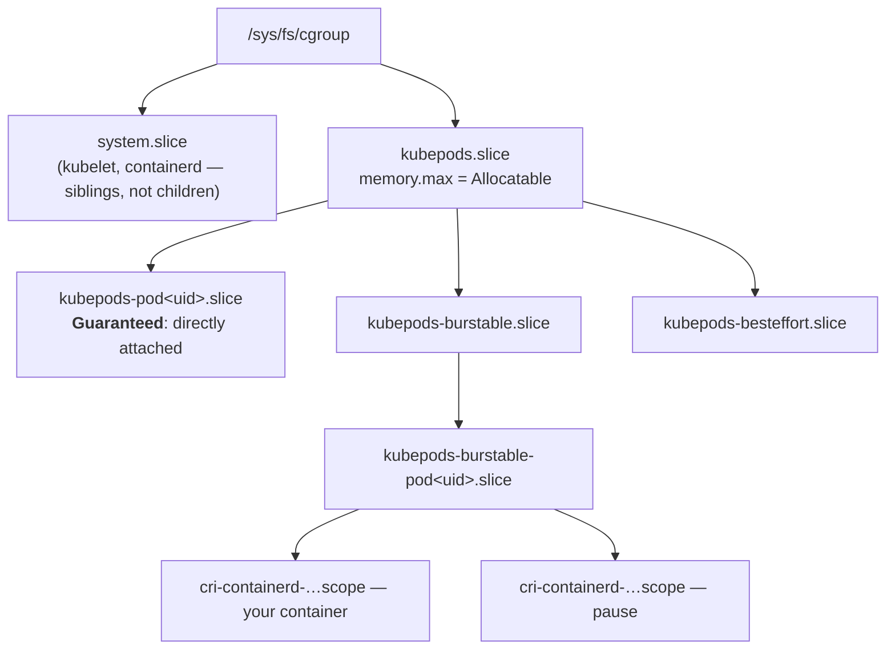
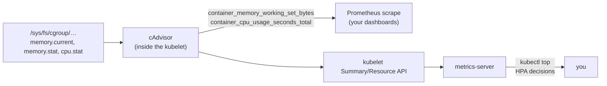

Namespaces decide what a process *sees*; control groups decide what it *gets*. If [the previous article](/foundations/namespaces/) was about the different view, this one is about the budget — the kernel subsystem that turns `resources:` YAML into enforced arithmetic, decides which process dies when memory runs out, and quietly generates most of the billing, monitoring, and 2am-page content of your Kubernetes life. **Every number in `kubectl top`, every OOMKilled event, every eviction decision traces back to a file in `/sys/fs/cgroup`** — and unlike most kernel machinery, you can read those files with `cat`.

The one-table survey of this territory is in [Kubernetes Is Linux](/troubleshooting/kubernetes-is-linux/), and the 2am command sequences are in [Linux Inside the Pod](/troubleshooting/linux-inside-the-pod/). This page is the mechanism underneath both: what the controllers actually meter, how the hierarchy is delegated, and why the memory numbers never mean quite what you first think.

## v1, v2, and why the fight mattered

cgroups shipped in kernel 2.6.24 (2008, from work at Google — "process containers" renamed). **Version 1's defining mistake was flexibility: each controller (cpu, memory, blkio...) could have its own independent hierarchy.** A process could be in `/cpu/groupA` but `/memory/groupB`. It sounded liberating and turned out to be unmanageable: controllers couldn't cooperate (the memory controller couldn't tell the io controller "this writeback belongs to that group," so buffered-write throttling simply didn't work), every daemon mounted the trees differently, and the kernel had to maintain N parallel bookkeeping structures.

**cgroup v2** ([kernel admin guide](https://docs.kernel.org/admin-guide/cgroup-v2.html) — the primary reference for this whole article) rebuilt it around one rule: **a single unified tree; controllers enable per-subtree; a process lives at exactly one node.** That bought three things Kubernetes now depends on:

1. **Cross-controller cooperation** — memory and io share bookkeeping, so writeback throttling works and "this pod's dirty pages" is answerable.
2. **Pressure Stall Information (PSI)** — per-group files reporting how much wall-clock time tasks spent *stalled* on cpu, memory, or io. Arguably the best resource-health signal the kernel has ever exposed (more below).
3. **A sane delegation model** — a parent can hand a subtree to a child manager without the two trampling each other.

Kubernetes made cgroup v2 the default expectation years ago and v1 support is on its way out; every path in this article is v2. (`cat /sys/fs/cgroup/cgroup.controllers` succeeds only on v2 — the one-line detector, per [the field guide](/troubleshooting/linux-inside-the-pod/).)

## The tree is a filesystem, and the filesystem is the API

There is no cgroup syscall worth naming. **The interface is mkdir, echo, and cat.** Create a directory under `/sys/fs/cgroup` and you've created a group; write a PID into its `cgroup.procs` and you've moved a process; write `200M` into `memory.max` and you've set a limit. The kernel materializes control files in each directory the instant a controller is enabled there (via the parent's `cgroup.subtree_control`).

On a Kubernetes node, three managers write to this tree in a strict chain of delegation, and knowing who owns which layer tells you where any given number comes from:

| Layer | Who writes it | What they write |
|---|---|---|
| `/sys/fs/cgroup/system.slice`, `user.slice` | systemd | the node's own daemons — kubelet, containerd, sshd live here, **outside** kubepods |
| `/sys/fs/cgroup/kubepods.slice` | kubelet (via systemd driver) | Node Allocatable ceilings; the QoS sub-slices |
| `kubepods-*-pod<uid>.slice` | kubelet | per-pod aggregate limits |
| `cri-containerd-<id>.scope` | the container runtime | your container's `cpu.max`, `memory.max`, `cpu.weight` — the leaves |

This chain is what "delegation" formally means in the v2 world: a parent manager enables controllers for a subtree via `cgroup.subtree_control`, hands the directory to a child manager, and never writes below that point again. It's why modern kubelets use the *systemd cgroup driver* rather than writing raw directories — one tree, one root manager, no two daemons fighting over the same files, which was a recurring v1 failure mode.

Two structural facts hide in that table. First, **system daemons are siblings of kubepods, not members** — that's how "reserved" node resources work: `kubepods.slice` gets `memory.max` = node capacity minus system/kube reservations, so the kubelet can't be starved by its own pods (in theory; [node pressure](/troubleshooting/node-problems/) is the practice). Second, **limits are hierarchical: every level's constraint applies to the subtree beneath it.** Your container might have no memory limit of its own and still hit the pod's, or the kubepods ceiling — the effective limit is the minimum along your path to the root.

The path itself encodes your QoS class:



`cat /proc/self/cgroup` from inside any pod prints your own path — the QoS class is legible in it, and everything else on this page is a file in that directory. Why the classes exist and how requests/limits map to them is [Resources & QoS](/workloads/resources-and-qos/); whether to set which numbers is [Requests, Limits, and the Knobs](/tuning/requests-limits-knobs/).

## The controllers, and what each one meters

Six controllers matter on a Kubernetes node. **cpu** does two unrelated jobs — proportional *weight* (`cpu.weight`, from your requests) and hard *bandwidth* (`cpu.max`, from your limits); the mechanics of both, including the throttling pathology that fills the [It's Slow](/troubleshooting/its-slow/) page, are deep enough to own [the next article](/foundations/cpu-scheduling-and-cfs/) — this page won't duplicate them. **memory** is most of this page. **io** meters block-device bytes and iops (`io.max`, `io.weight`) — Kubernetes exposes no per-pod knob for it, which is why a neighbor pod hammering the node's disk still hurts you: [noisy-neighbor io is real and mostly unpoliced](/troubleshooting/node-problems/), and PSI (below) is how you catch it. **pids** caps task counts. **cpuset** pins groups to specific CPUs. **hugetlb** meters huge pages (visible as the `hugepages-2Mi` resource).

### The memory controller: current ≠ RSS, and that's a feature

Start with the two files everyone reads first:

```console
$ cat /sys/fs/cgroup/memory.max
536870912
$ cat /sys/fs/cgroup/memory.current
498073600
```

93% of the limit — panic? Not yet, and here is the single most misread number in Kubernetes: **`memory.current` counts every page charged to the cgroup, and that includes page cache** — file contents cached on your behalf when you read or wrote them. The kernel deliberately lets cache balloon to your limit, because unused budget is wasted budget; under pressure it reclaims cache *before* anything drastic happens. The breakdown lives in `memory.stat`:

```console
$ grep -E '^(anon|file|inactive_file|slab|sock) ' /sys/fs/cgroup/memory.stat
anon 412876800        # heap, stacks — unreclaimable without swap
file 71303168         # page cache
inactive_file 58720256  # the readily-droppable part of it
slab 9437184          # kernel structures charged to you (dentries, inodes)
sock 1048576          # network buffers
```

**Your real footprint is approximately `anon`; your working set — what the kubelet's eviction logic uses — is `memory.current − inactive_file`.** A pod "at 90% memory" whose `anon` is 40% is a pod doing lots of file I/O, not a pod about to die. This is also why `kubectl top` disagrees with your APM's RSS number: they're answering different questions ([the PromQL page](/observability/promql-for-resources/) maps which metric answers which). And it's why a JVM's `-Xmx` is only the beginning of container memory sizing — heap is `anon`, but so are metaspace, thread stacks, and native buffers ([JVM in containers](/java/jvm-in-containers/)).

The controller has four thresholds, not one ([cgroup-v2 guide, memory section](https://docs.kernel.org/admin-guide/cgroup-v2.html#memory)):

| File | Semantics | Kubernetes use |
|---|---|---|
| `memory.max` | hard wall: exceed after reclaim fails → OOM kill in this group | `limits.memory` |
| `memory.high` | soft wall: exceed → aggressive reclaim + the allocating tasks are *slowed*, not killed | used by some kubelet configs (MemoryQoS feature) — mostly unset today |
| `memory.min` | guaranteed floor: this much is never reclaimed away from you | basis for memory protection under the MemoryQoS work |
| `memory.low` | best-effort floor | same family |

And the receipts file — **`memory.events`, whose `oom_kill` counter is the ground truth of whether kills happened**, whatever the runtime reported ([OOMKilled](/troubleshooting/oomkilled/) starts here).

### The OOM killer's arithmetic

When allocation fails inside a group at `memory.max` and reclaim can't help, the kernel must choose a victim. The choice is scored: each candidate process gets a **badness score, essentially its memory footprint as a fraction of the limit, nudged by `oom_score_adj`** — a per-process value from −1000 (never kill) to +1000 (kill me first). You can watch your own: `cat /proc/self/oom_score_adj`.

The kubelet turns QoS classes into exactly this knob:

| QoS class | `oom_score_adj` | Effect under *node* memory pressure |
|---|---|---|
| Guaranteed | −997 | practically never chosen |
| Burstable | 2–999, scaled *inversely* to memory request | bigger request ⇒ lower score ⇒ safer |
| BestEffort | 1000 | first against the wall |
| (kubelet itself) | −999 | survives to report your death |

So **"QoS class" is, at the kernel level, a position in the cgroup tree plus a pre-signed death warrant priority.** Note the two distinct kill paths: a *cgroup* OOM (your container exceeded its own `memory.max` — scoring happens among your processes only) versus a *node* OOM/eviction (the whole machine is short — scoring happens across pods, and QoS decides). Same 137 exit code, different diagnosis; disambiguating them is half the [OOMKilled](/troubleshooting/oomkilled/) page.

One modern refinement: `memory.oom.group=1`, which the kubelet sets since 1.28 — **an OOM kill takes the entire cgroup, not one unlucky process.** Before it, the kernel might kill a worker thread's process and leave your app a half-alive zombie ensemble; now the container dies cleanly and restarts ([CrashLoopBackOff](/troubleshooting/crashloopbackoff/) tells you if it keeps happening).

### PSI: the pressure gauge

Every v2 cgroup exports `memory.pressure`, `cpu.pressure`, `io.pressure` ([PSI docs](https://docs.kernel.org/accounting/psi.html)):

```console
$ cat /sys/fs/cgroup/memory.pressure
some avg10=1.53 avg60=0.87 avg300=0.44 total=1830921
full avg10=0.32 avg60=0.11 avg300=0.05 total=412039
```

`some` = percentage of time *at least one* task in the group was stalled waiting for the resource; `full` = *all* tasks stalled simultaneously. **Utilization tells you a resource is busy; pressure tells you someone is *waiting* — and waiting is what latency is made of.** A pod at 95% memory with zero pressure is fine; a pod at 60% with `full avg10=15` is thrashing through reclaim right now. PSI is the honest answer to "is the io noisy neighbor actually hurting me" — check `io.pressure` in your own cgroup and you have evidence no per-pod utilization graph can give.

### pids and cpuset, briefly but consequentially

The **pids** controller is one file with one job: `pids.max` caps how many tasks (processes *and* threads) the subtree may hold. It exists because a fork bomb is a memory-and-scheduler attack that memory limits catch too late — and the kubelet sets pod-level pids limits on modern clusters. The symptom of hitting it is distinctive: `fork: Retry: Resource temporarily unavailable` or a JVM's `unable to create native thread` **with plenty of free memory** — check `pids.current` against `pids.max` before chasing memory ghosts.

**cpuset** pins a group to explicit CPUs (`cpuset.cpus`) and NUMA nodes (`cpuset.mems`). The kubelet's *static CPU manager policy* uses it for a specific deal: a **Guaranteed pod with integer CPU requests gets exclusive cores** — written into its `cpuset.cpus`, and *removed* from everyone else's. Latency-critical workloads stop sharing L1/L2 caches and stop being preempted by neighbors; everyone else runs on the remaining cores. If your platform enables it, that's why your ordinary pods see fewer CPUs than the node has.

## Where your monitoring numbers actually come from

Every Kubernetes resource metric is these same files, read on a schedule and renamed in flight — knowing the pipeline turns "why does kubectl top disagree with Grafana" from a mystery into a lookup:



The renames that matter: `container_memory_working_set_bytes` = `memory.current − inactive_file` (the eviction-relevant number — **this is what `kubectl top` shows and what the OOM/eviction machinery effectively judges**), while `container_memory_usage_bytes` = raw `memory.current`, cache included — alarming on dashboards for cache-heavy pods and mostly ignorable. CPU counters come from `cpu.stat`'s `usage_usec` as a monotonic total that PromQL `rate()` turns into cores ([PromQL for resources](/observability/promql-for-resources/) has the recipes). Each hop adds staleness — cgroup files are live truth, cAdvisor scrapes every ~15s, metrics-server aggregates on its own cadence — so during an incident, **skip the pipeline and read the files**; that's the entire method of [the field guide](/troubleshooting/linux-inside-the-pod/).

## See it yourself: one guided walk

From inside any pod (v2 cluster), this sequence answers "how big is my budget, how close am I, and has enforcement already happened":

```bash
cat /proc/self/cgroup                     # who am I — path spells the QoS class
cat /sys/fs/cgroup/memory.max             # the wall ("max" = unlimited)
cat /sys/fs/cgroup/memory.current         # charged now (cache included!)
grep -E '^(anon|inactive_file)' /sys/fs/cgroup/memory.stat   # footprint vs droppable
grep oom_kill /sys/fs/cgroup/memory.events  # has the killer visited
cat /sys/fs/cgroup/memory.pressure        # is anyone waiting on memory
cat /sys/fs/cgroup/pids.{current,max}     # thread headroom
cat /sys/fs/cgroup/cpu.max /sys/fs/cgroup/cpu.stat  # → next article for reading these
```

On a node (or privileged debug pod), walk the delegation with your own eyes:

```bash
cat /sys/fs/cgroup/kubepods.slice/memory.max          # Allocatable ceiling
ls /sys/fs/cgroup/kubepods.slice/                     # QoS slices + Guaranteed pods
systemd-cgls --no-pager | head -40                    # the whole tree, annotated
```

And the five-minute lab that makes the memory model stick, on any Linux box with root — build a budget by hand:

```bash
mkdir /sys/fs/cgroup/demo
echo 100M > /sys/fs/cgroup/demo/memory.max
echo $$ > /sys/fs/cgroup/demo/cgroup.procs      # move this shell in
python3 -c 'a="x"*(200*1024*1024)'              # try to allocate 200M
# → Killed.  dmesg: "Memory cgroup out of memory: Killed process ..."
```

Three files, and you have reproduced OOMKilled without Kubernetes in the room. **The kubelet does nothing more sophisticated — it just does it with more directories.**

## The Rosetta table

| You write | The kubelet/runtime writes | The kernel does |
|---|---|---|
| `limits.memory: 512Mi` | `memory.max=536870912` on the container scope | reclaim, then group OOM kill on breach |
| `requests.memory: 256Mi` | (scheduler math; `oom_score_adj` input; eviction ranking) | mostly **not** a cgroup file — engrave this asymmetry |
| `limits.cpu` / `requests.cpu` | `cpu.max` / `cpu.weight` | [next article](/foundations/cpu-scheduling-and-cfs/) |
| QoS class (derived) | tree position + `oom_score_adj` | node-pressure kill ordering |
| `hugepages-2Mi: 1Gi` | `hugetlb.2MB.max` | hard cap on huge-page use |
| (no pod knob) | `pids.max` from kubelet config | fork/thread ceiling |
| Guaranteed + integer CPUs + static policy | exclusive `cpuset.cpus` | core pinning, cache affinity |
| (no pod knob) | `io.max`/`io.weight` unused by k8s | why disk neighbors still hurt |

Memory is the budget that kills; CPU is the budget that *delays* — a compressible resource where blowing the limit means waiting, not dying. That asymmetry, and the scheduler machinery that enforces the waiting — vruntime, weights, quota periods, and the famous "throttled while idle" pathology — is [CPU Scheduling and the CFS](/foundations/cpu-scheduling-and-cfs/).
