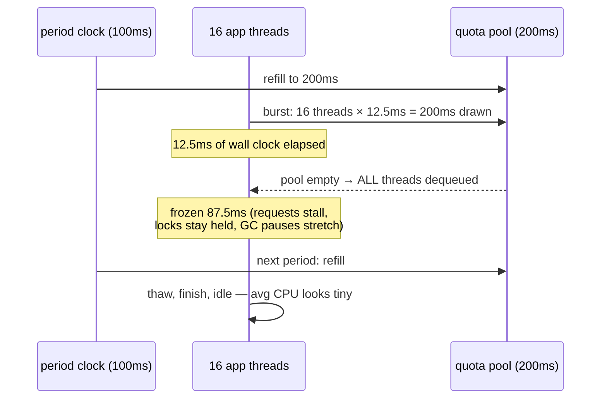

Here is a pathology you have either met or will: a service's p99 latency spikes, the dashboards show the container using 12% of its CPU limit, the node is 60% idle — and `cpu.stat` says the container was **throttled in a quarter of all scheduling periods**. Everyone stares at the graphs and says "it can't be CPU, look how idle it is." It is CPU. **Throttling is not a function of average utilization; it is a function of how fast you spend a small budget that is refilled in 100-millisecond installments** — and a multi-threaded app can spend 100ms of budget in 12ms of wall clock, then stand frozen for the other 88.

To see why, you have to know what the scheduler actually does with the two numbers you set in YAML. [cgroups](/foundations/cgroups/) told you where `cpu.weight` and `cpu.max` live in the tree; this article is what the kernel *does* with them. The 2am shortcut — read `cpu.stat`, twice — is in [the field guide](/troubleshooting/linux-inside-the-pod/) and the symptom catalog is [It's Slow](/troubleshooting/its-slow/); this is the theory that makes those pages obvious.

## What "running on a CPU" means

At any instant, each CPU core executes exactly one task. Everything else waits. **The scheduler's whole job is choosing, for each core, which one task runs *right now*** — and rechoosing whenever a task blocks (on I/O, a lock, a sleep), when something more deserving wakes, or when the running task has had its slice (a **preemption**: the timer interrupt fires, the kernel takes the core back mid-instruction-stream).

Each core keeps its own **runqueue** — the set of runnable tasks assigned to it. A **context switch** swaps the running task's registers and address space for another's; it costs a microsecond or two directly and more in cache damage. Two vocabulary points that pay rent later: a task that *could* run but isn't is **runnable** (state `R` — it's waiting for CPU, and time spent in that condition is scheduling latency, the raw material of your p99); a task waiting on I/O in uninterruptible sleep is state `D` — not the scheduler's problem, but it counts in load average, a trap we'll spring below. (Process states in full: [Processes, Signals, and PID 1](/foundations/processes-and-signals/).)

## CFS: fairness as an algorithm

From 2007 until kernel 6.6, the scheduler for normal tasks was CFS — the **Completely Fair Scheduler** ([design doc](https://docs.kernel.org/scheduler/sched-design-CFS.html)). Its premise is beautifully literal. Imagine an ideal CPU that could run all N runnable tasks *simultaneously*, each at 1/N speed. No real CPU can, so CFS faithfully approximates it with bookkeeping:

- Every task carries a **`vruntime`** — the CPU time it has received, in nanoseconds, *scaled by its weight* (heavier tasks accumulate vruntime more slowly).
- Runnable tasks sit in a **red-black tree ordered by vruntime**. A red-black tree is a self-balancing binary tree: insertion and removal are O(log n), and the leftmost node — the minimum — is always at hand.
- **The scheduling decision is one rule: run the leftmost task** — the one that has received the least weighted CPU time so far. It runs, its vruntime grows, it drifts rightward in the tree; eventually someone else is leftmost and preempts it.

That's the entire algorithm. No priority queues, no time-slice tables — **"completely fair" means weighted fair queuing of CPU time**: over any window, each runnable task receives CPU proportional to its weight, and tasks that sleep a lot (interactive servers) wake up with low vruntime and preempt promptly, which is why they *feel* responsive.

Weights come from `nice` values: each nice step is ×1.25 in weight, nice 0 = weight 1024. But the interesting weights, on a Kubernetes node, come from the tree.

## cpu.weight: what your CPU *request* actually is

CFS is hierarchical: cgroups are schedulable entities too. A cgroup competes with its siblings using **its** weight; whatever share it wins is subdivided among its children by *their* weights, recursively down to real tasks. Your `requests.cpu` becomes the container cgroup's `cpu.weight` (v1 called it `cpu.shares`; v2 rescaled the numbers, same meaning).

Now the sentence to engrave: **`requests.cpu` is a weight, not a reservation.** Consequences, in decreasing order of how often they're misunderstood:

- **On an uncontended node, requests do nothing at all.** Weights only matter when runnable tasks outnumber CPUs. A pod requesting 100m happily uses 8 full cores on an idle node, forever, legally.
- **Under contention, you get your *proportional share*, not your request.** If containers with weights proportional to 250m, 250m, 500m all want unlimited CPU on one core, they get 25%/25%/50% — arithmetic over weights, and the "m" units only correspond to real cores because the scheduler's arithmetic happens to be anchored that way by the kubelet's weight formula.
- **The guarantee-like behavior you observe is the scheduler + the kube-scheduler cooperating.** The kube-scheduler refuses to overcommit *requests* on a node, so total weights stay proportional to capacity, so under total contention your share works out to roughly your request. Break either half of that bargain (huge bursty neighbors, weights distorted by very asymmetric requests) and "my request protects me" gets fuzzy — which is why [Resources & QoS](/workloads/resources-and-qos/) insists you set requests honestly.

See the plumbing from inside a pod: `cat /sys/fs/cgroup/cpu.weight` — a pod requesting 500m shows ~20 on the v2 scale (the mapping is monotonic, not pretty). No throttling ever comes from this file. **Weights delay you only when someone else is running; quotas freeze you even on an idle node.** That's the next section.

## cpu.max: the quota machine, and how it manufactures latency

`limits.cpu` becomes the two numbers in `cpu.max` — this is **CFS bandwidth control** ([kernel doc](https://docs.kernel.org/scheduler/sched-bwc.html)):

```console
$ cat /sys/fs/cgroup/cpu.max
50000 100000        # quota=50ms of CPU time, period=100ms → "half a core"
```

Mechanics, because the failure mode lives in them: at the start of each **100ms period** (the default, and almost nobody changes it), the cgroup's quota pool refills. Per-CPU runqueues draw **slices (5ms by default)** from the pool as the group's tasks run on them. When the pool and slices are exhausted, **every task in the group is dequeued — frozen mid-whatever — until the next period refill.** Not "deprioritized." Removed from the runqueues. A synchronous request-handler holding a lock, halfway through a response: parked for the remainder of the period.

Now run the pathology from the opening paragraph in slow motion. A JVM with 16 threads and `limits.cpu: 2` (quota 200ms/period 100ms) receives a request burst. Sixteen threads run in parallel on sixteen idle node cores; together they burn 200ms of CPU time in 12.5ms of wall clock. The pool is empty. **All sixteen threads freeze for 87.5ms — then thaw, finish, and go idle.** Average CPU over the second: maybe 12% of the limit. p99 latency: +87ms. The dashboards say idle; the truth says throttled — this is the classic *88%-idle-yet-throttled* signature, and it is a bursty-parallelism problem, not a sizing problem. Halving thread count or raising the limit both fix it; staring at utilization graphs doesn't.



The receipts are in `cpu.stat`, readable inside the pod with no monitoring stack:

```console
$ cat /sys/fs/cgroup/cpu.stat
usage_usec 1843200000
nr_periods 184032
nr_throttled 43861
throttled_usec 3921400000
```

**Read `nr_throttled / nr_periods` as "fraction of periods in which we hit the wall"** — here 24%, catastrophic for latency — and `throttled_usec` as cumulative time stolen. Sample it twice, 30 seconds apart: if `nr_throttled` is climbing during your incident, the incident is throttling, case closed. (This is the single highest-value diagnostic read in [It's Slow](/troubleshooting/its-slow/).)

### Throttling, contention, steal: three ways to wait, three culprits

| You're waiting because… | Mechanism | Evidence | Whose problem |
|---|---|---|---|
| **Throttled** | your own `cpu.max` quota exhausted | `cpu.stat` `nr_throttled` climbing | yours: limit vs. burst shape |
| **Contended** | runnable tasks > CPUs; weights arbitrating | `cpu.pressure` (PSI) high, `nr_throttled` flat; node busy | scheduling/neighbors — [node problems](/troubleshooting/node-problems/) |
| **Stolen** | the *hypervisor* gave your vCPU's physical core to another VM | `%st` in node-level `top`/`mpstat`; invisible in-pod | the cloud; only fix is different instances/tenancy |

All three present identically to your users — latency — and only the evidence row tells them apart. Steal is the sneaky one on cloud nodes: the node's kernel itself is a tenant, and time the hypervisor withholds never appears in any cgroup file.

## Should you set CPU limits? The honest version

The kernel gives this debate its actual content, so let's have it plainly. **CPU is compressible: exceeding the budget produces waiting, not dying** — which is why the stakes are latency, not stability, and why reasonable people disagree ([the knobs page](/tuning/requests-limits-knobs/) gives the operational advice; here's the mechanism under it).

*Against limits:* unused node CPU is free performance — quota throttling throws it away, and the burst pathology above means limits hurt precisely the multi-threaded, latency-sensitive services people most want to protect. Requests-without-limits already gives you contention fairness via weights: under load you get your share; under calm you get the surplus. For most stateless services, that's strictly better.

*For limits:* predictability and honesty. Without limits, your service silently *trains itself* on borrowed CPU — capacity planning, HPA tuning, and load tests all learn a performance level the node only sometimes offers, and the day the node fills up, your "regression" is just the surplus evaporating. Limits also cap the blast radius of runaway loops in shared clusters, and Guaranteed QoS (requests = limits) is the price of admission for [static CPU pinning](/foundations/cgroups/) and the strongest eviction protection.

The defensible synthesis: **set requests honestly everywhere; add CPU limits only where you can articulate what you're buying** (pinning, strict multi-tenancy, burst-intolerant capacity planning) — and if you do set them, size them for your *burst parallelism*, not your average, or cap parallelism to fit (next section). What you should never do is copy `limits.cpu: 500m` onto a 16-thread server because a template had it.

## Load average is not what you think

`/proc/loadavg` is quoted constantly and understood rarely. Two corrections. First, **Linux load average counts D-state tasks** — processes in uninterruptible (usually I/O) sleep — alongside runnable ones. A node with load 40 on 8 cores might be CPU-saturated *or* might have 35 threads stuck on a dying NFS volume with idle CPUs; the number alone cannot tell you, and the D-state story connects to [stuck pods](/troubleshooting/stuck-terminating/) more often than to CPU. Second, **inside a container the three averages are node-wide** — not namespaced, not cgroup-scoped; the same lie `/proc/cpuinfo` tells ([the field guide's](/troubleshooting/linux-inside-the-pod/) central trap). Prefer signals that are actually yours: `cpu.stat` for throttling, `cpu.pressure` (PSI `some`/`full` from [the cgroups article](/foundations/cgroups/)) for "my tasks are waiting for CPU," and node `%st` for steal.

## EEVDF: the successor (kernel 6.6+)

In kernel 6.6 (2023), CFS's core was replaced by **EEVDF** — Earliest Eligible Virtual Deadline First, a 1995 packet-scheduling algorithm brought to CPUs. Same weighted-fairness contract, one addition: each task gets a **virtual deadline** (eligibility plus a slice scaled by weight), and the scheduler runs the eligible task with the earliest deadline. The practical win is *latency-fairness*: CFS knew who was owed CPU but not who was owed it *soon*; EEVDF favors short-slice, latency-sensitive tasks without heuristics.

What changes for you: **almost nothing, deliberately.** `cpu.weight`, `cpu.max`, `cpu.stat`, PSI — every interface in this article is unchanged; bandwidth control still freezes you exactly as described. Nodes on 6.6+ kernels simply exhibit somewhat better tail latency under contention. If your fleet mixes kernel versions, "same pod, different p99 on different node pools" now has one more legitimate explanation.

## Per-thread implications: telling your runtime the truth

Runtimes size their worker pools by asking "how many CPUs do I have?" — and inside a container, every naive way of asking (`/proc/cpuinfo`, `nproc`, unadjusted `availableProcessors()`) returns the *node's* count. A 4-core-limited JVM on a 64-core node that believes it has 64 CPUs creates 64-wide GC and fork-join pools — maximal burst parallelism, i.e., the throttling pathology with a bow on it.

Modern runtimes read the cgroup files, with caveats worth knowing: the **JVM** (container-aware since 8u191) derives `ActiveProcessorCount` from `cpu.max` — but with *no limit set* it sees all node cores, so pin it (`-XX:ActiveProcessorCount=N`) sized to your request; **Go** ignores cgroups by default even now — set `GOMAXPROCS` (or use `automaxprocs`) or a Go service with `limits.cpu: 2` on a big node will burst 64-wide into a 2-core budget and throttle savagely. The deeper coupling — how thread counts, GC, and CFS quota interact in the JVM specifically — is [JVM/Kubernetes coupling](/java/jvm-kubernetes-coupling/). **The general law: your app's parallelism should be sized to its quota, because the scheduler will enforce the quota either way — smoothly if you cooperate, in 87ms freezes if you don't.**

## The Rosetta table

| You write | The kernel object | Enforced when | Failure smell |
|---|---|---|---|
| `requests.cpu: 250m` | `cpu.weight` on the container cgroup | only under contention — proportional share, never a cap, never a guarantee of idle-node behavior | slow only when node is busy; `cpu.pressure` high, `nr_throttled` flat |
| `limits.cpu: 2` | `cpu.max: 200000 100000` | every 100ms period, regardless of node idleness | p99 spikes at low avg CPU; `nr_throttled` climbing |
| (scheduling) | kube-scheduler sums *requests* | admission time only | node "full" while actual CPU idle — requests ≠ usage |
| Guaranteed + integer cores + static policy | exclusive `cpuset.cpus` | always | neighbors lose those cores; you stop sharing caches |
| nice / renice in-container | task weight within your cgroup | contention among *your own* threads | rarely matters: your cgroup's weight caps the whole group |

And the summary to carry out: **requests are a weight (fairness under contention), limits are a quota (freezing on a 100ms clock), and neither is a reservation.** Weights never add latency on an idle node; quotas do — in burst-shaped installments that averages are designed to hide. When something is slow, read `cpu.stat` before any dashboard, and remember there are three different ways to wait for a CPU: throttled by your own limit, out-weighed by neighbors, or robbed by the hypervisor. Each has its own file, and none of them shows up as "CPU usage."
