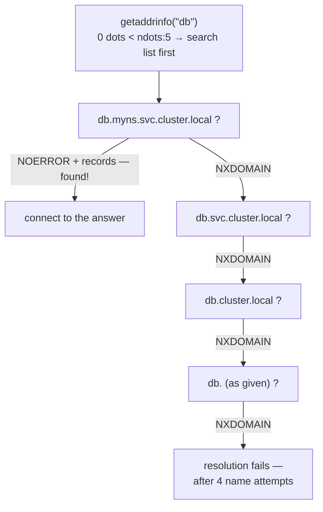

Here is the fact that reorganizes everything you know about DNS in a cluster: **there is no DNS client on your system.** No daemon resolves names on your behalf, nothing caches answers for you, no single component owns "resolution." The resolver is a **library** — a few functions compiled into your process, running on your thread, reading two config files at startup and then making UDP calls inline with your application code. When resolution is slow, *your request thread* is the one blocked on a UDP socket. When resolution behaves differently between two pods, it's because **two different resolver libraries were compiled into two different binaries** — and that single sentence explains most of the "works in the ubuntu image, flaky in alpine" mysteries that DNS produces.

This is the client half of the story. The server half — what CoreDNS does with the queries — is [the CoreDNS deep dive](/routing/coredns-deep-dive/); the survey of how Kubernetes wires service discovery is [DNS on the networking side](/networking/dns/); the 2am flowchart is [DNS Failures](/troubleshooting/dns-failures/). This page is about what happens *before any packet leaves the pod*, which is where half the weirdness lives. Primary sources: [resolv.conf(5)](https://man7.org/linux/man-pages/man5/resolv.conf.5.html), [nsswitch.conf(5)](https://man7.org/linux/man-pages/man5/nsswitch.conf.5.html), [getaddrinfo(3)](https://man7.org/linux/man-pages/man3/getaddrinfo.3.html), and [RFC 1035](https://www.rfc-editor.org/rfc/rfc1035) for the protocol itself.

## Resolution is not one thing: the nsswitch layer

When your code calls `getaddrinfo("db", ...)`, DNS is not the first stop. On glibc, the call consults `/etc/nsswitch.conf` — the Name Service Switch — whose `hosts:` line lists *sources*, tried in order:

```text
hosts: files dns myhostname
```

`files` means `/etc/hosts`; `dns` means the stub resolver; `myhostname` answers for the machine's own hostname. **`/etc/hosts` wins — a matching line there short-circuits DNS entirely**, which is why Kubernetes implements `hostAliases` as literal lines written into the pod's `/etc/hosts`, and why a stale entry there produces "DNS says X but the pod connects to Y" confusion that no amount of CoreDNS debugging will find.

Now the first fork in the road: **musl — Alpine's libc — does not read nsswitch.conf at all.** It has a hardcoded order (hosts file, then DNS) and silently ignores the file if present. Anything exotic you'd configure there (LDAP sources, `mdns`) simply doesn't exist on Alpine. This is the first of several musl divergences; they accumulate.

## /etc/resolv.conf: the resolver's entire worldview

The stub resolver's configuration is one small file, read (traditionally once, at first use) by the library:

```text
search myns.svc.cluster.local svc.cluster.local cluster.local
nameserver 10.96.0.10
options ndots:5
```

That's a real Kubernetes pod's file, and each line is load-bearing:

- **`nameserver`** — where queries go. **The libc resolver honors at most three**, tried in order (glibc) with per-server timeouts. In a pod there's typically just one: the ClusterIP of the `kube-dns` Service — itself a [DNAT illusion](/routing/nat/), which will matter shortly.
- **`search`** — suffixes to append to *unqualified* names. Kubernetes injects the pod's namespace first, which is why plain `db` finds a Service in your own namespace.
- **`options`** — the knobs: `ndots:n` (below), `timeout:n` (seconds to wait per server, default **5**), `attempts:n` (rounds through the server list, default 2), `rotate` (spread load across nameservers), `single-request` / `single-request-reopen` (serialize or re-socket the A/AAAA pair — the fix for a race we'll meet below).

Do the worst-case arithmetic once and you'll respect these defaults forever: one nameserver, `timeout:5`, `attempts:2` means a name that gets *no answer at all* takes **10 seconds** to fail — per candidate name. Combined with a long search path, a dead DNS server can stall a single `getaddrinfo` call for the better part of a minute, on the application's own thread, with no error until the very end.

One more glibc subtlety with a long incident history: **the resolver reads this file once and caches its contents in the process.** Older glibc never re-read it; modern glibc (2.26+) re-checks the file's mtime on each lookup, but plenty of runtimes and libraries snapshot the config at startup anyway. A long-running pod that started before the kubelet finished writing resolv.conf — or a process that dropped privileges and can no longer re-read it — can carry a stale resolver worldview for its whole life. When "every new pod resolves fine but this old one can't," suspect a process older than its config.

## ndots:5, fully worked

The `ndots` rule: **if a name contains fewer than `ndots` dots, try the search domains *first*; only if they all fail, try the name as given.** Kubernetes sets `ndots:5`, so almost every name you ever use — `db` (0 dots), `db.otherns` (1), even `api.example.com` (2) — is "unqualified" by this rule and takes the scenic route.

The full walk for `db` from a pod in namespace `myns`:



And each *name* attempt is typically **two queries** — A and AAAA — so resolving the external name `api.example.com` from a pod costs the search walk in full: `api.example.com.myns.svc.cluster.local`, `.svc.cluster.local`, `.cluster.local`, each NXDOMAIN'd by CoreDNS, before the bare name finally succeeds. Eight queries to resolve one external hostname. The latency arithmetic:

| Name you use | Queries (A+AAAA) | Happy path | If one UDP packet drops |
|---|---|---|---|
| `db` (same namespace) | 2 | ~1 ms — first search hit | +5 s (one timeout) |
| `db.otherns` (1 dot) | 2–4 | first or second candidate | +5 s |
| `api.example.com` (2 dots) | **8** | 3 wasted round-trips, then answer | +5 s *per lost packet* |
| `api.example.com.` (trailing dot) | 2 | straight to the answer | +5 s |

Two escapes worth engraving. **A trailing dot makes any name fully qualified** — `api.example.com.` skips the search walk entirely, and for hot-path external names it's the cheapest optimization in Kubernetes. And *within* the cluster, `db.myns.svc.cluster.local.` does the same for internal names. (Why does Kubernetes inflict ndots:5 at all? So that `db`, `db.myns`, and `db.myns.svc` all resolve — the convenience of short names is bought with everyone's query volume. [NodeLocal DNSCache](/cluster-networking/nodelocal-dnscache/) exists in large part to make this tax affordable.)

## glibc vs musl: two resolvers, two personalities

Your base image choice selects your resolver, and they differ in ways that map precisely onto observed flakiness:

| Behavior | glibc (debian/ubuntu/distroless-cc) | musl (alpine) |
|---|---|---|
| A + AAAA queries | Parallel, on one socket by default | Parallel, but historically quirkier under load |
| nsswitch.conf | Honored | **Ignored** — hardcoded files-then-DNS |
| Multiple nameservers | Sequential failover | **Queries all in parallel, first answer wins** |
| TCP fallback on truncation | Yes | **None until musl 1.2.4 (2023)** — truncated answers were silently accepted |
| search/ndots | Full support | Supported *now*; missing/partial in older versions people still run |
| `options single-request*` | Honored | Not applicable/ignored |

Not sure which resolver you're even running? `ldd /bin/ls` inside the container names the libc (`libc.so.6` = glibc, `ld-musl-x86_64.so.1` = musl); a distroless image with no shell tells you by refusing to answer.

The rows with teeth: **musl's historical lack of TCP fallback** meant that once a response outgrew UDP — many A records behind a headless Service, long CoreDNS answers — Alpine pods got a *truncated* record set or a failure while Ubuntu pods sailed on. And musl querying all nameservers in parallel changes failure semantics when someone adds a second, broken nameserver "for redundancy." When someone says "Alpine DNS is cursed," this table is the curse. It's also a reason [busybox images make bad debugging proxies](/troubleshooting/busybox/) — busybox's `nslookup` historically had its *own* third resolver implementation, agreeing with neither libc.

## UDP, the 512-byte inheritance, and TCP fallback

Classic DNS runs on UDP with a **512-byte** answer limit inherited from [RFC 1035](https://www.rfc-editor.org/rfc/rfc1035). Answers that don't fit come back with the **TC (truncated) bit**, telling the client to retry the whole query over **TCP** — a real [TCP connection](/foundations/tcp-connections/), handshake and all, to port 53. Modern clients advertise bigger UDP buffers via **EDNS0** (typically 1232–4096 bytes), which usually avoids the dance — but large record sets (headless Services with many endpoints, DNSSEC-signed zones) still overflow into TCP. The operational consequence: **port 53/TCP must work, not just 53/UDP** — a [firewall rule](/foundations/firewalls-and-netfilter/) or NetworkPolicy that allows only UDP DNS works perfectly until the day an answer grows past the buffer, and then fails in a way nobody connects to a policy written months earlier.

## The 5-second timeout pathology

The most famous DNS number in Kubernetes is five seconds, and it's a compound failure. Ingredient one: UDP is fire-and-forget — a dropped query produces no error, just silence, and the resolver's only recourse is the `timeout:5` default before retrying. **Any single lost DNS packet costs a flat five seconds.**

Ingredient two is the infamous kernel race. glibc sends the A and AAAA queries *in parallel from the same socket* — same source port, microseconds apart. Both packets traverse [conntrack](/routing/nat/) for the DNAT to CoreDNS's ClusterIP, and each needs a conntrack entry created — but entry insertion isn't atomic against a racing second packet on the same tuple. Under the classic race, **one of the two packets loses the insertion race and is dropped on the node** — deterministically-ish, under load. The application experiences: every Nth lookup takes exactly 5.000 seconds, then succeeds. The classic mitigation is resolver-side: `options single-request-reopen` (serialize, or use a fresh socket per query, so the twins never race), injectable via `dnsConfig`. The structural fixes are kernel patches that narrowed the race and, more decisively, [NodeLocal DNSCache](/cluster-networking/nodelocal-dnscache/) — a per-node cache reached *without* DNAT (and upgrading to TCP upstream), removing conntrack from the path entirely.

If you remember one diagnostic signature: **latency histograms with a spike at exactly 5s (or 2.5s with some configs) are DNS timeouts, not slow servers.**

While we're cataloging failures, keep the three DNS outcomes distinct — they accuse different suspects:

| Outcome | What it means | Who to interrogate |
|---|---|---|
| **NXDOMAIN** | The server answered: this name does not exist | Your spelling, the search path (an NXDOMAIN for `db.myns.svc.cluster.local` when you asked for `db`), a missing Service |
| **SERVFAIL** | The server answered: I tried and failed | CoreDNS itself — upstream resolution broken, plugin errors; [the server-side dive](/routing/coredns-deep-dive/) |
| **Timeout** | No answer came back at all | The path: dropped UDP, the conntrack race, a [NetworkPolicy eating port 53](/foundations/firewalls-and-netfilter/), dead CoreDNS pods |

A timeout is never CoreDNS *saying* anything — it's the network saying nothing. Conflating "DNS is down" (timeouts) with "the name doesn't exist" (NXDOMAIN) sends whole teams down the wrong debugging branch.

## dnsPolicy and dnsConfig: who writes resolv.conf in a pod

You never write a pod's resolv.conf; the kubelet does, according to `dnsPolicy`:

- **`ClusterFirst`** (the effective default): nameserver = cluster DNS ClusterIP, the three-tier search path, `ndots:5` — everything walked above.
- **`Default`**: inherit the *node's* resolv.conf — cluster names don't resolve; useful for pods that only talk to the outside.
- **`ClusterFirstWithHostNet`**: what `hostNetwork` pods must set to keep cluster DNS.
- **`None`** + **`dnsConfig`**: you supply everything.

`dnsConfig` also *merges* onto the other policies, and that's its everyday use — injecting options without abandoning ClusterFirst:

```yaml
spec:
  dnsConfig:
    options:
      - name: ndots
        value: "2"
      - name: single-request-reopen
```

`ndots:2` makes most external names fully-qualified-enough to skip the search walk, at the price of needing internal names written as `db.myns` or longer. It's the pragmatic middle for pods that mostly call external APIs.

## Nothing is caching for you

On a Linux desktop, `systemd-resolved` or `nscd` sits between libc and the network, caching answers. **In a container there is almost never any such daemon: every `getaddrinfo` call is a real network query.** A pod that resolves its database's name on every request — because its HTTP client doesn't pool, or its language runtime doesn't cache — generates a query stream that scales with request rate, all landing on CoreDNS. From the client's viewpoint, the server-side mitigations are: CoreDNS's own cache plugin (shared, per-CoreDNS-pod) and [NodeLocal DNSCache](/cluster-networking/nodelocal-dnscache/) (per-node, no conntrack) — both are *caches on the far side of a network hop*, not a substitute for in-process sanity.

The JVM adds its own layer on top: Java caches successful lookups (`networkaddress.cache.ttl`, historically *forever* under a SecurityManager, ~30s otherwise) and — the nastier default — caches *failures* for 10 seconds (`networkaddress.cache.negative.ttl`). The visible symptoms: a JVM that never notices a failover because it cached the old A record, or one that keeps failing for 10 seconds after DNS recovers. Cache-on-cache, each with its own TTL, each a place staleness hides.

## See it yourself: three tools that disagree on purpose

The trap in DNS debugging is that the popular tools **do not use the code path your application uses**:

| Tool | Uses libc resolver? | Reads nsswitch/hosts? | Applies search/ndots? |
|---|---|---|---|
| `getent hosts db` | **Yes — the real path** | Yes | Yes |
| `nslookup db` | No — own resolver | No | Usually applies search |
| `dig db` | No — own resolver | No | **No — not unless `+search`** |

**`getent hosts <name>` is the only command that resolves a name the way your app does** (on a glibc image; on musl it's still closer than the others). `dig` is the precision instrument for talking to a *server* — but it ignores `/etc/hosts`, ignores nsswitch, and skips the search path unless you pass `+search`, which is exactly why "dig works but my app can't resolve" is such a common, meaningless observation.

A working session from inside a pod:

```bash
cat /etc/resolv.conf                      # what the kubelet wrote; note ndots and search
getent hosts db                           # the app's-eye view
dig +search db                            # search-path walk, but via dig's resolver
dig db.myns.svc.cluster.local. @10.96.0.10   # one precise question to one server
dig +tcp db.myns.svc.cluster.local.       # prove 53/TCP works too
```

And to *count* what a lookup really costs, capture the queries (needs a debug container with tcpdump — see [the busybox caveats](/troubleshooting/busybox/) for why your app image likely can't):

```console
$ tcpdump -ni eth0 udp port 53 &
$ getent hosts api.example.com
IP 10.244.1.7.44160 > 10.96.0.10.53: A? api.example.com.myns.svc.cluster.local.
IP 10.244.1.7.44160 > 10.96.0.10.53: AAAA? api.example.com.myns.svc.cluster.local.
IP 10.96.0.10.53 > 10.244.1.7.44160: NXDomain
...
IP 10.244.1.7.51222 > 10.96.0.10.53: A? api.example.com.
IP 10.96.0.10.53 > 10.244.1.7.51222: 3/0/0 A 93.184.215.14
```

Watching eight packets resolve one name converts `ndots:5` from trivia into something you'll design around. **DNS on the client side is two config files, one library, and a UDP socket — and now you know which of the three to interrogate first.** When the packets leave the pod and the mystery continues, the trail continues server-side in [the CoreDNS deep dive](/routing/coredns-deep-dive/) and the symptom-first flowchart in [DNS Failures](/troubleshooting/dns-failures/).
