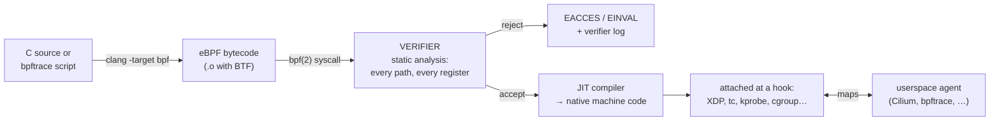

For fifty years the deal with the kernel was binary: either your code ran in userspace, behind the syscall boundary, seeing only what the kernel chose to show you — or it ran *as* the kernel, as a module, one null pointer away from taking down the machine. eBPF is a third option the kernel grew in the 2010s: **you hand the kernel a small program, the kernel proves to itself that the program is safe, and then runs it — inside the kernel, at a hook point you chose, on every packet or syscall or function call that crosses that point.** People call it "JavaScript for the kernel," and the framing is useful as long as you hold it loosely: like JavaScript in a browser, eBPF programs are sandboxed, event-driven, and run inside someone else's process they can observe but not crash. Unlike JavaScript, they are statically verified before they run a single instruction, and the verifier would reject most JavaScript on sight.

This matters to you because **the odds are good your cluster already runs hundreds of eBPF programs** — in the CNI, in the observability stack, in systemd itself — and because the industry's answer to "iptables chains are too slow for 10,000 Services" was eBPF. This article is about what those programs are, how the kernel can afford to trust them, and where they sit in the dataplane you learned in [Linux Networking](/foundations/linux-networking/) and [Firewalls and netfilter](/foundations/firewalls-and-netfilter/).

## From tcpdump filter to operating-system feature

The name is an accident of history. BPF — the Berkeley Packet Filter, 1992 — was a tiny in-kernel virtual machine with one job: run a filter expression against each packet so `tcpdump host 10.0.0.5` could discard uninteresting packets *in the kernel* instead of copying every packet to userspace and filtering there. Two registers, no memory writes, no loops, packet-in boolean-out. It sat quietly in the kernel for twenty years doing exactly that. Then, starting with kernel 3.18 (2014), it was *extended* — 64-bit registers, ten of them, a real instruction set the JIT could map onto native machine code, **maps** for keeping state and talking to userspace, and a growing catalog of places you could attach a program besides "incoming packet." At that point "extended BPF" stopped being a packet filter and became what it is now: a general-purpose, safety-checked execution engine inside the kernel. The old one is retroactively "classic BPF" (cBPF), and it still exists — a distinction that matters later, because seccomp uses the classic one and people conflate them constantly.

## The machinery: bytecode, the verifier, JIT, maps

An eBPF program's life has four stages, and each one is doing real work:



**The verifier is the whole trick.** When a program is loaded via the [`bpf(2)`](https://man7.org/linux/man-pages/man2/bpf.2.html) syscall, the kernel simulates every possible execution path before accepting it: every register's type and value range is tracked, every memory access is proven in-bounds, every helper call is checked against what this program type is allowed to do, and the program must provably terminate — historically no loops at all, and since kernel 5.3 only loops the verifier can prove bounded. Programs that pass cannot crash the kernel, cannot read arbitrary memory, cannot run forever. This is why the kernel can afford to run code from userspace at all, and it is also **why the verifier is the most cursed part of the developer experience**: it rejects programs that are obviously fine to a human but not provably fine to a symbolic executor, and its error messages are a register-state dump. Writing eBPF means negotiating with the verifier. (The [kernel's verifier documentation](https://docs.kernel.org/bpf/verifier.html) is the primary source, and it is honest about the limits.)

Accepted programs are JIT-compiled to native code, so a program on a hot path — say, every packet on a NIC — runs at roughly the cost of a function call, not an interpreter loop.

**Maps are how programs remember and how they talk.** An eBPF program alone is a pure function that fires per-event and forgets. Maps — kernel-resident hash tables, arrays, LRU caches, ring buffers ([`bpf-helpers(7)`](https://man7.org/linux/man-pages/man7/bpf-helpers.7.html) catalogs the helper calls that use them) — give it state, and because userspace can read and write the same maps through the `bpf(2)` syscall, they are also the control plane: **Cilium's agent writes "Service 10.96.0.10:443 → these three backends" into a hash map; the eBPF program on the packet path reads it.** Maps can be *pinned* into the `/sys/fs/bpf` filesystem so they outlive the process that created them — that's why that directory exists on your nodes.

One more piece of machinery worth naming: **BTF and CO-RE** ("compile once, run everywhere"). Kernel data structures change layout between versions, and early eBPF tooling recompiled programs on the target machine against its exact headers (this is what BCC did, dragging clang onto every node). BTF embeds type information into the kernel and the program; CO-RE relocates field accesses at load time to match the running kernel. That's the difference between "ship a compiler in your DaemonSet" and "ship a small binary" — and it's why modern tools (libbpf-based agents, recent bpftrace) start fast and run on kernels they weren't built against.

## The hooks that matter in Kubernetes

An eBPF program is nothing without an attachment point. The catalog is long; these are the ones whose consequences you meet in a cluster:

| Hook | Fires | What can it do | Who uses it in your cluster |
|---|---|---|---|
| **XDP** | in the NIC driver, before the kernel even allocates its packet structure (`sk_buff`) | drop, rewrite, retransmit, or pass — at millions of packets/sec | DDoS scrubbing, Cilium/Calico fast paths, load balancers (Katran-style) |
| **tc** (traffic control) | packet ingress/egress on any interface, after `sk_buff` exists | full packet mangling with kernel context (which veth, which direction) | **the main CNI dataplane hook** — policy and forwarding on pod veths |
| **kprobe / kretprobe** | entry/return of (almost) any kernel function | read arguments, record, count — observe only | tracing tools, security agents (Tetragon) |
| **uprobe** | entry/return of a userspace function in a named binary | same, for app code — no instrumentation needed | profilers, "trace every TLS write in libssl" tricks |
| **tracepoint** | stable, named kernel events (syscall entry, sched switch, …) | like kprobes but with a stability guarantee | bpftrace one-liners, perf tooling |
| **cgroup hooks** | socket operations (connect, bind, send) *scoped to a cgroup* | allow/deny/rewrite per cgroup — **which means per pod** | per-pod policy without touching packets; systemd's `IPAddressDeny=` |
| **socket ops / sockmap** | TCP state transitions, socket-to-socket forwarding | splice data between local sockets, skipping the network stack | sidecar-acceleration and [sidecar-less mesh](/networking/service-mesh/) datapaths |

Notice the shape of that table: the top rows are the *dataplane* (packets), the middle is *observability* (events), and the cgroup rows are the distinctly Kubernetes-flavored ones — because a cgroup is the kernel's name for "this pod" ([cgroups: The Budget](/foundations/cgroups/)), a cgroup-attached program is per-pod policy enforced in the kernel with no packet inspection at all. "May this pod `connect()` to that IP" gets answered at the syscall, before a single packet exists.

## Why the CNIs went eBPF

Here is the argument that moved the industry, in one paragraph. The iptables dataplane you walked in [kube-proxy and the Dataplane](/routing/kube-proxy-and-the-dataplane/) evaluates rules as *chains* — linked lists. A packet to a ClusterIP traverses `KUBE-SERVICES` checking one Service rule after another until it matches: **O(number of Services)**, on every first packet of every connection, plus rule-reload churn that grows with cluster size. An eBPF program at the tc hook does one lookup in a hash map keyed by `(VIP, port)`: **O(1)**, whatever the Service count. The same asymmetry applies to NetworkPolicy: instead of compiling label selectors down to per-IP iptables rules that must be rewritten every time a pod is added ([NetworkPolicy is a CNI feature](/networking/network-policies/), and this is the machinery behind that sentence), Cilium assigns each set of labels a numeric **security identity**, carries it with the packet, and enforces policy as "identity 31337 may reach identity 40213 on 8080" — one map entry per *policy relationship*, not per pod IP. That's what "identity-based policy" means: the policy engine reasons about labels, the dataplane about small integers, and pod churn stops meaning rule churn.

So Cilium (and Calico in eBPF mode) replace the whole netfilter arrangement: kube-proxy's DNAT becomes a map lookup and packet rewrite at tc or XDP or even at `connect()` time via a cgroup hook — the socket is pointed at the backend pod IP *before any packet exists*, so there's nothing to NAT and no conntrack entry to leak. Service resolution moves from "chain walk plus conntrack" to "hash lookup," and kube-proxy the component is simply not installed.

Honest tradeoffs, because there are real ones:

| | iptables/nftables dataplane | eBPF dataplane |
|---|---|---|
| Service lookup cost | O(rules), chain walk | O(1) map lookup |
| Policy model | per-IP rules, churn on pod events | identity-based, stable under churn |
| Debuggability | `iptables -L -v -n`, counters, 25 years of folklore | `bpftool`, `cilium monitor` — richer but younger, and **your iptables knowledge stops applying** |
| Kernel coupling | works on anything | wants recent kernels; features arrive per kernel version; bugs are kernel bugs |
| Failure mode | rules visible even when wrong | program state lives in maps you need tooling to read |

The "knowledge cliff" row is the one to take personally. On an iptables cluster you can trace a lost packet with counters and `conntrack -L`; on an eBPF cluster the equivalent skill is `bpftool` and the CNI's own tracing commands, and the folklore is a decade old instead of three. Neither is wrong. But **know which dataplane your cluster runs before you debug it** — the [firewall article's](/foundations/firewalls-and-netfilter/) methodical packet walk assumes netfilter, and on a Cilium cluster half those chains are empty.

## Observability without asking your app's permission

The second reason eBPF ate the world has nothing to do with networking. kprobes, uprobes, and tracepoints mean **you can ask running production software questions it was never instrumented to answer** — which files is this process opening, what's the latency histogram of every `fsync`, who is calling `connect()` to that IP — with overhead low enough to leave on. This is the engine inside the profilers and tracers surveyed in [Performance Analysis](/observability/performance-analysis/): continuous profilers (Parca), auto-instrumenting observability platforms (Pixie), and security runtime enforcement (Tetragon) are all, mechanically, bundles of eBPF programs plus an agent reading maps. Namedropped and moved past — the point is the shape: *agent loads programs, kernel streams events into a ring buffer, agent aggregates.* Every tool in this space is that.

The hand tool of the genre is `bpftrace`, and reading one line of it teaches the whole model:

```bash
bpftrace -e 'tracepoint:syscalls:sys_enter_openat /comm == "java"/ { @[str(args->filename)] = count(); }'
```

Dissect it as **probe : filter : action** — the grammar of all eBPF observability:

- `tracepoint:syscalls:sys_enter_openat` — the *probe*: attach to the stable tracepoint that fires on every `openat(2)` entry, system-wide.
- `/comm == "java"/` — the *filter*: predicate evaluated in kernel context; events failing it are discarded without ever crossing into userspace (the 1992 tcpdump idea, generalized).
- `{ @[str(args->filename)] = count(); }` — the *action*: bump a per-filename counter in a map. Nothing is printed per-event; bpftrace reads and prints the map when you hit Ctrl-C.

That's an eBPF program: you wrote one line, bpftrace compiled it to bytecode, the verifier vetted it, and the kernel ran it on every syscall entry on the machine. The heavier siblings are **BCC** (Python front-end, compiles on the node — the older toolkit) and **libbpf** with CO-RE (the modern C library real agents are built on); conceptually they're bpftrace with more ceremony and more power.

## Where you already meet eBPF — and one thing that isn't it

Even if you never write a probe, you're standing in eBPF's output:

| You use | The BPF underneath |
|---|---|
| Cilium / Calico-eBPF CNI | tc/XDP dataplane programs, per-pod policy maps |
| `tcpdump port 53` in a debug container | your filter expression compiled to **classic** BPF, attached to a socket |
| `seccompProfile: RuntimeDefault` | a **classic** BPF filter on syscall numbers — *not* eBPF |
| systemd `IPAddressDeny=any` on a unit | an eBPF cgroup program filtering that unit's sockets |
| continuous profiler / Pixie / Tetragon agents | kprobe/uprobe/tracepoint programs + ring buffers |
| sidecar-less service mesh dataplanes | sockmap/sk_msg redirection, cgroup connect hooks |

The seccomp row deserves its paragraph, because the confusion is everywhere: **seccomp filters are classic BPF, not eBPF.** Same instruction-set ancestry, same in-kernel-VM idea, but the deliberately tiny one: no maps, no helpers, no loops, just arithmetic over the syscall number and arguments returning allow/deny — which is precisely why it's trustworthy enough to be applied by unprivileged processes to themselves. When [Security Primitives](/foundations/security-primitives/) says "seccomp is a BPF filter on syscalls," it means this restricted dialect. Nobody's container seccomp profile is running the eBPF machinery, and "we should disable eBPF, seccomp depends on it" is a non-sequitur you can now defuse in meetings.

## The constraints, honestly

Three facts keep eBPF a *platform-team* tool rather than an app-team one.

**Loading programs is privileged.** Attaching to kernel hooks means observing every pod on the node — of course it's gated. Historically `CAP_SYS_ADMIN`; since kernel 5.8 the narrower `CAP_BPF` (plus `CAP_PERFMON` for tracing, `CAP_NET_ADMIN` for networking hooks) — the capability model from [Security Primitives](/foundations/security-primitives/) applies, and most distros set `kernel.unprivileged_bpf_disabled=1` besides. **An ordinary pod cannot load eBPF programs, and a pod that can is node-root for observation purposes.** eBPF tooling therefore ships as privileged DaemonSets, vetted by whoever owns the node.

**The kernel version matrix is real.** Features land per kernel release — bounded loops in 5.3, CAP_BPF in 5.8, ring buffers in 5.8, and CNI documentation reads like a compatibility table. An eBPF dataplane couples your networking to your node OS choice in a way iptables never did. Managed-node upgrades quietly change what your CNI can do.

**You will mostly consume it.** The economics are the same as the kernel's own: a few teams write the programs (CNI vendors, observability vendors, your platform team), and everyone else runs them and reads their output. Your leverage as an app team is knowing the layer exists — so when the answer to "why does my NetworkPolicy behave oddly" or "what is this cilium process" comes back, you know which questions to ask next.

## See it yourself — on a node, because pods can't

Everything below needs node access or a privileged debug pod; that's not gatekeeping, it's the security model doing its job (an unprivileged pod that could enumerate eBPF programs could enumerate the node's policy engine). If you don't have node access, this list doubles as *what to ask your platform team to run*.

Inventory what's loaded — on a Cilium node this is startling the first time:

```bash
bpftool prog list | head -30      # every loaded program: type, name, when loaded
bpftool prog list | grep -c .     # count them — often hundreds
bpftool map list | head           # the state: hash maps, LRU maps, ring buffers
ls /sys/fs/bpf/                   # pinned maps and programs surviving their creators
```

See where the dataplane attaches — the tc hook on a pod's veth ([Linux Networking](/foundations/linux-networking/) explains the veth itself):

```bash
ip link show | grep -A1 veth | head          # find a pod's host-side veth
tc filter show dev <veth> ingress            # "bpf" filters = CNI programs on the wire
ip link show | grep xdp                      # any XDP programs at the driver level
```

Run a one-liner and watch the verifier work for you:

```bash
bpftrace -e 'tracepoint:syscalls:sys_enter_* /pid == 12345/ { @[probe] = count(); }'
# every syscall the process makes, counted in-kernel; Ctrl-C prints the map
```

And confirm the seccomp distinction from inside any ordinary pod — no privilege needed, because this is *your own* handcuff:

```bash
grep Seccomp /proc/self/status    # 2 = filter mode: a classic-BPF program is vetting your syscalls right now
```

## Where this leaves you

The kernel used to be a fixed function: syscalls in, behavior out, take it or write a module. eBPF made it programmable at the edges, with the verifier as the price of admission — and Kubernetes, which was already a machine for turning YAML into kernel configuration ([Kubernetes Is Linux](/troubleshooting/kubernetes-is-linux/)), promptly used it to rebuild the dataplane it had inherited from iptables. The practical takeaways fit in three lines. **Know which dataplane your cluster runs**, because it decides whether your netfilter debugging skills apply. **Treat eBPF observability as the answer to "we can't redeploy with instrumentation"** — it's the strongest tool in that corner, via your platform team. And when someone conflates seccomp with eBPF, or proposes giving app pods CAP_BPF, you now know exactly which kind of wrong that is. The story of what else runs on the node — the systemd units that start containerd and the kubelet in the first place — is [next](/foundations/systemd-and-the-node/).
