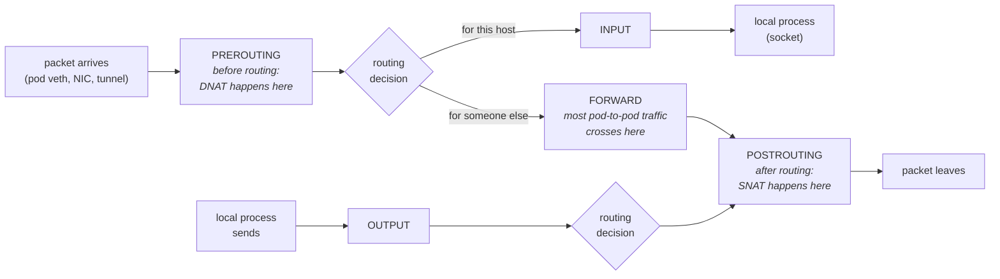

Strip away the vendor products and the compliance language, and a firewall is one idea: **code that inspects packets at fixed points in the kernel's packet path and decides pass or drop.** The oldest firewalls were *stateless* — each packet judged alone against rules like "drop TCP port 23." The move that made modern firewalls (and Kubernetes Services, and NetworkPolicies) possible was *statefulness*: remember the connections you've seen, and write rules about **flows** instead of packets — "allow replies to conversations we started" is inexpressible statelessly, and it's the rule every real network needs. On Linux, this machinery is **netfilter**: the hooks in the packet path, the rule engines (iptables, nftables, eBPF) that attach to them, and **conntrack**, the connection-memory that makes stateful rules cheap. Every ClusterIP you've ever dialed and every NetworkPolicy that ever blocked you was this one subsystem, wearing different YAML.

This article is the mechanism. The kube-proxy-specific chain walk lives in [its own deep dive](/routing/kube-proxy-and-the-dataplane/); the NAT specifics in [SNAT, DNAT, and conntrack](/routing/nat/); here you get the machine they both program — because once you can read netfilter, those two pages become obvious instead of arcane.

## The five hooks

Netfilter defines five fixed points where the IP stack hands each packet to registered rule engines. Where a packet goes is decided by the routing lookup you know from [the networking article](/foundations/linux-networking/) — and the hooks bracket that decision:



The placement is the logic. **DNAT must happen at PREROUTING** — before the routing decision — because rewriting the destination *changes where the packet should go*; that's why a ClusterIP is translated to a pod IP before the kernel decides whether to deliver locally or forward. **SNAT must happen at POSTROUTING** — after routing — because the source rewrite must not influence path selection. And the fact worth engraving for Kubernetes: **traffic between pods is *forwarded* traffic from the node's perspective — it crosses FORWARD, not INPUT.** A node-hardening script that sets the FORWARD chain's default policy to DROP (a classic Docker-era collision) breaks all pod networking while every node-level health check stays green.

## Tables × chains: the matrix

iptables organizes rules two-dimensionally. A **chain** is an ordered rule list attached to a hook (the built-in chains are named after their hooks). A **table** groups chains by *purpose*, and the purposes are consulted in a fixed order at each hook:

| Table | Purpose | Hooks where it appears | Kubernetes resident |
|---|---|---|---|
| `raw` | earliest touch; mark packets NOTRACK to skip conntrack | PREROUTING, OUTPUT | occasionally used to exempt high-volume flows |
| `mangle` | alter packet metadata (marks, TOS, TTL) | all five | CNIs and kube-proxy set fwmarks for later decisions |
| `nat` | address rewriting — consulted only for a flow's **first** packet | PREROUTING, OUTPUT, POSTROUTING, INPUT | **kube-proxy lives here**: ClusterIP DNAT, masquerade SNAT |
| `filter` | the actual allow/drop firewall | INPUT, FORWARD, OUTPUT | **NetworkPolicy enforcement** (iptables-based CNIs); kubelet health rules |

Read a row and a column together and you can locate any rule in the kernel: "kube-proxy's Service rewriting" = nat table at PREROUTING/OUTPUT; "NetworkPolicy drops on pod traffic" = filter table at FORWARD. That mental grid replaces the sprawling packet-flow wall poster every admin has squinted at — the mermaid diagram above plus this table *is* that poster, minus the exotica.

A rule itself is a match-and-jump: zero or more match criteria, then exactly one target. Anatomy of a real one, the kind you'll meet on any node:

```text
-A FORWARD -s 10.244.0.0/16 -p tcp -m conntrack --ctstate NEW \
    -m tcp --dport 5432 -j ACCEPT
#  │        │              │  │                  │            └─ target: verdict or jump
#  │        │              │  │                  └─ extension match: TCP header fields
#  │        │              │  └─ extension match: conntrack state (loaded with -m)
#  │        │              └─ core match: protocol
#  │        └─ core match: source prefix
#  └─ which chain this rule is appended to
```

Everything left of `-j` must match for the target to fire; a non-matching packet simply falls to the next rule. Targets split into **verdicts** — terminal decisions like `ACCEPT`, `DROP` (silent discard), `REJECT` (discard plus an ICMP or RST courtesy note — the difference between a client hanging and failing fast, as [the TCP article](/foundations/tcp-connections/) explains), `DNAT`, `MASQUERADE` — and **jumps to custom chains** (`-j KUBE-SERVICES`). Custom chains are subroutines: evaluation descends into them, and if nothing matches, returns to the caller and continues. Every serious user of iptables builds trees of them — which is exactly what the `KUBE-*` forest is. Full rule grammar: [iptables(8)](https://man7.org/linux/man-pages/man8/iptables.8.html) and [iptables-extensions(8)](https://man7.org/linux/man-pages/man8/iptables-extensions.8.html).

Evaluation within a chain is first-match-wins, top to bottom; a packet surviving every chain at a hook proceeds. If nothing matched, the chain's **policy** (ACCEPT or DROP) decides — and policy-DROP chains are where packets go to die silently.

## Conntrack: the state engine

Stateful filtering needs memory, and conntrack is that memory: a hash table of flows, keyed by tuple, consulted for **every** packet at PREROUTING (before any rules run). Each packet arrives at your rules already classified:

- **NEW** — no entry exists; this packet would create one (a SYN, or any first packet — conntrack tracks UDP and ICMP "flows" too, by tuple and timeout).
- **ESTABLISHED** — matches an existing entry in both directions. The overwhelming majority of all packets.
- **RELATED** — a new flow that conntrack's protocol helpers associate with an existing one (an ICMP error about a tracked connection; FTP's data channel).
- **INVALID** — the packet matches no entry *and* can't legitimately create one: a stray ACK with no handshake, a packet outside any tracked window, leftovers of a forgotten flow.

This classification is what makes stateful firewalls cheap and simple. The canonical ruleset is two lines — `-m conntrack --ctstate ESTABLISHED,RELATED -j ACCEPT` near the top, then scrutinize only NEW — so **the expensive rule walk runs once per connection; every subsequent packet is a hash lookup and an early accept.** The same trick powers Services: as [the NAT article](/routing/nat/) details, a flow's DNAT decision is stored *in its conntrack entry*, so the nat table is consulted only for the first packet and the entry replays the rewrite for the rest of the connection's life.

See the memory itself on any node (or privileged debug container):

```console
$ conntrack -L -d 10.96.44.7 | head -2
tcp  6 86390 ESTABLISHED src=10.244.9.5 sport=41230 dst=10.96.44.7 dport=80 \
     src=10.244.7.42 sport=8080 dst=10.244.9.5 dport=41230 [ASSURED] use=1
$ cat /proc/sys/net/netfilter/nf_conntrack_count /proc/sys/net/netfilter/nf_conntrack_max
14382
262144
```

One line, two tuples: the flow as the client sent it (destination = ClusterIP) and the reply flow as it actually returns (source = the real pod) — the DNAT decision written down, with `86390` the entry's remaining TTL in seconds counting down between refreshes. The second command is the capacity check: current entries against the ceiling. **When `count` reaches `max`, the kernel cannot record new flows, and its response is to drop their packets** — a fact that turns into a very specific pathology below.

Conntrack's costs are the flip side, and they're the substance of [the TCP article's](/foundations/tcp-connections/) middlebox warnings: the table is finite (full table → NEW packets dropped → intermittent connect hangs while established traffic flows fine), entries time out (idle flows forgotten → silently dead connections), and entries can outlive the pods they point to (the rollout reset-storm race). Timeouts and sizing knobs: [nf_conntrack-sysctl](https://docs.kernel.org/networking/nf_conntrack-sysctl.html).

## The machinery, worn by Kubernetes

Now the payoff — the features you use daily, located in the matrix:

**Services** are kube-proxy programming the nat table. `PREROUTING` and `OUTPUT` jump to `KUBE-SERVICES`, which matches ClusterIP:port and dispatches to a `KUBE-SVC-*` chain per Service, which picks a backend via probability rules and jumps to a `KUBE-SEP-*` chain per endpoint, which DNATs to the pod IP. Custom chains as subroutines, statistical match extensions as a load balancer, conntrack to make the choice stick per connection — nothing kube-proxy does is exotic netfilter; it's a very large amount of ordinary netfilter, and [the deep dive](/routing/kube-proxy-and-the-dataplane/) walks every chain with real rules.

**NetworkPolicies** are filter-table (or eBPF) rules attached where pod traffic can't avoid them: the veth. Since every packet to or from a pod crosses its veth pair and traverses the node's FORWARD path, the CNI compiles your policy YAML into per-pod chains — typically using **ipset** (kernel hash sets of IPs, so "allow from these 400 pods" is one rule against one set, not 400 rules) — and drops what no rule admits. This compilation model explains the operational facts you've met in [the NetworkPolicy guide](/networking/network-policies/): enforcement is a CNI feature (no CNI compiler, no enforcement — policies silently do nothing), policies are namespace-and-label driven because the CNI watches those objects to regenerate sets, and default-deny means "the compiled chain ends in DROP instead of RETURN."

**The second firewall.** Node-local netfilter is never the only filter in the path. Cloud security groups and corporate firewalls filter *outside* the node — before PREROUTING on the way in, after POSTROUTING on the way out. **A connection must survive both firewalls, and their failure symptoms are identical from inside a pod** (silent SYN drop). The tiebreaker: same-node pod-to-pod traffic never leaves the node, so if that works while cross-node fails, suspect the outer firewall or overlay; if even local traffic fails, it's netfilter or the CNI. That fork in the road is half of [Debugging Network Issues](/networking/debugging-network/), and knowing which side owns the drop determines whether your ticket goes to the platform team or the cloud/network team — the layer-ownership habit [the overview](/foundations/overview/) preaches.

## nftables and eBPF: same hooks, new engines

iptables is not the machinery — it's one *frontend* to the hooks, and it's being replaced from two directions.

**nftables** ([nft(8)](https://man7.org/linux/man-pages/man8/nft.8.html)) is the designed successor: one engine for IPv4/IPv6, rules held in native **maps and sets** (a thousand Services become one map lookup instead of a thousand sequential rules), and — critically for Kubernetes — **incremental atomic updates**, where iptables' model rewrites entire tables on every change. That rewrite cost is iptables-mode kube-proxy's scaling wall on Service-heavy clusters, and it's why kube-proxy's `nftables` mode exists. Two things bearing the name, to keep straight: on modern distros the `iptables` *binary* is `iptables-nft`, translating classic syntax onto the nftables kernel backend (same concepts, `nft list ruleset` to dump); kube-proxy's nftables *mode* is a genuinely different rule generator.

**eBPF dataplanes** (Cilium foremost) stop attaching rule lists to the hooks and instead attach *programs* — at tc on the veths, at XDP on the NIC, at cgroup connect hooks — with state in BPF hash maps rather than chains. Service resolution can happen at `connect()` time in the client's own kernel, so the ClusterIP never appears in any packet; policy verdicts come from identity labels carried per-packet instead of IP matching. The concepts of this article survive intact (hook points, flow state, compiled policy), but **the iptables evidence trail vanishes** — `iptables-save` on a Cilium node returns near-nothing, and the introspection tools become `cilium` CLI and `bpftool`. Know which engine your platform runs *before* you ask for rule dumps.

| You write | Engine that compiles it | Kernel mechanism that executes it |
|---|---|---|
| `Service` (ClusterIP) | kube-proxy (iptables / IPVS / nftables mode) | nat-table DNAT at PREROUTING/OUTPUT + conntrack replay — or eBPF socket LB |
| `NetworkPolicy` | the CNI's policy compiler | filter rules + ipsets on veth/FORWARD path — or eBPF programs at tc |
| cloud "allow 443 from office" | cloud security-group dataplane | filtering outside the node entirely — netfilter never sees the dropped packet |

## Debugging: counters first, then trace

Most netfilter debugging needs node access — from inside a pod you see [your own namespace's](/foundations/namespaces/) (nearly empty) tables, which is itself worth knowing: each network namespace has its **own** complete netfilter ruleset, which is why pod traffic can be filtered at the node without the pod seeing a single rule. On a node (or in a privileged [debug container](/troubleshooting/debugging-toolbox/)), work counters-first:

```console
$ iptables -L FORWARD -v -n --line-numbers
Chain FORWARD (policy DROP 213 packets, 18K bytes)
num   pkts bytes target     prot opt in  out  source       destination
1     982K  1.2G KUBE-FORWARD  all  --  *   *   0.0.0.0/0    0.0.0.0/0
...
```

**The `pkts` counters and the policy counter are the fastest truth available: run the command twice while reproducing the failure, and whichever DROP counter increments is your culprit.** A climbing policy-DROP count on FORWARD with pod traffic failing is a diagnosis in one line. The companion reads: `conntrack -L -d <ip>` to see a specific flow's entry and state, `conntrack -S` for `insert_failed`/`drop` (table exhaustion — the [dataplane article's](/routing/kube-proxy-and-the-dataplane/) intermittent-failure signature), and `dmesg | grep -E 'conntrack|martian'` for the kernel's own confessions. When counters aren't enough, escalate to tracing: a temporary `-j LOG` rule before a suspected drop, or `nft monitor trace` on nftables systems, prints each matched rule per packet — surgical, but noisy enough to use briefly and remove.

Then walk a dropped packet methodically, in hook order — the same layer-walk discipline as ever: did it arrive at all (`tcpdump` on the ingress interface)? Did conntrack classify it sanely (`conntrack -L`, INVALID counters)? Did nat rewrite it (entry shows the translated tuple)? Did filter pass it (counters)? Did it leave (`tcpdump` on egress)? Five questions, each with a command, and the drop point falls out.

Three pathologies close the loop, because they recur in every cluster's history. **rp_filter vs asymmetric routes**: multi-interface nodes and clever CNIs can send replies out a different interface than requests arrived on; strict reverse-path filtering drops such packets as "martians" — logged only via `log_martians`, invisible to every iptables counter, endlessly misdiagnosed as firewall trouble. **Conntrack exhaustion**: new connections fail intermittently while established ones sail on — covered above, unmistakable once you've seen `insert_failed` climbing. **INVALID drops**: after a conntrack flush, a node reboot, or an asymmetric path, mid-stream packets of perfectly healthy connections classify as INVALID and hit drop rules — the endpoints agree the connection exists, the middlebox disagrees, and [the TCP article's](/foundations/tcp-connections/) three-copies-of-state model tells you who's lying. Each pathology has the same shape: **the firewall is doing exactly what it was told; the telling was wrong.** When a Service is flatly unreachable and you need the escalation path rather than the mechanism, that's [Service Unreachable](/troubleshooting/service-unreachable/) — but you'll file a better ticket for having read this page: not "the network is broken," but "the FORWARD policy counter increments when I curl, on node X, and here's the rule listing."
