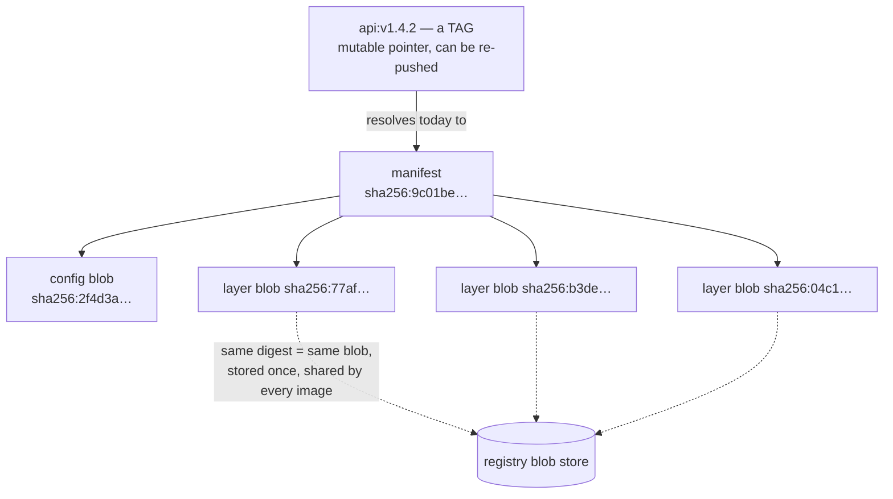

Run `kubectl get pods -o yaml` on any cluster and count the hashes: `pod-template-hash` labels, `imageID` fields ending in `sha256:...`, checksum annotations, TLS fingerprints in the events. **Kubernetes is soaked in hashing, and almost every one of those hex strings is doing the same single job: turning "trust me, it's the same content" into "check for yourself."** This article builds the idea up from the primitive — what a cryptographic hash actually promises — to content addressing, the design pattern that container images, git, and half of modern infrastructure are built on, and then walks every place Kubernetes leans on it. Along the way it draws the two boundaries people cut themselves on: hashes that are broken but still ambient (MD5, SHA-1), and the one job SHA-256 must *never* do (passwords).

## What a cryptographic hash promises

A hash function takes input of any size and produces fixed-size output — 256 bits for SHA-256, always, whether you hash one byte or one terabyte. A *cryptographic* hash ([SHA-2 family: RFC 6234](https://www.rfc-editor.org/rfc/rfc6234)) adds four promises:

1. **Deterministic.** Same input, same output, forever, on every machine. This is the property everything else rides on.
2. **Avalanche.** Change one bit of input and roughly half the output bits flip; outputs for similar inputs look unrelated.
3. **Preimage resistance.** Given a digest, you cannot find *any* input that produces it — the function only runs forward.
4. **Collision resistance.** You cannot find *two different* inputs with the same digest, even with free choice of both.

See the avalanche for yourself — one character, unrecognizably different digest:

```console
$ echo -n "registry.example.com/api:v1.4.2" | sha256sum
2f4d3a...  -
$ echo -n "registry.example.com/api:v1.4.3" | sha256sum
9c01be...  -
```

Two consequences do the daily work. Determinism plus fixed size means **a digest is a universal name for content**: 32 bytes that identify a terabyte, computable by anyone holding the content. Preimage plus collision resistance mean **the name is tamper-evident**: nobody can craft different content answering to the same name. Hold those two; the rest of the article is applications.

**Not all hashes are cryptographic, on purpose.** CRC32 (network checksums), FNV and xxHash (hash tables, partitioning) are built for speed and spread, not adversaries — a CRC happily "collides" if you ask it to, which is fine for detecting line noise and useless for detecting attackers. The rule: **random corruption → any hash; a person who benefits from a collision → cryptographic hash only.** Kernel and language runtimes learned a sharp lesson here — see SipHash, below.

## Families and their status

| Family | Status (2026) | Where you'll still see it |
|---|---|---|
| MD5 | **Broken** — collisions on a laptop ([RFC 6151](https://www.rfc-editor.org/rfc/rfc6151)) | old checksum files, `htpasswd` defaults, legacy S3 ETags |
| SHA-1 | **Broken** — practical collisions since 2017 ([RFC 6194](https://www.rfc-editor.org/rfc/rfc6194)) | **git commit IDs** (legacy; git has hardened detection and a SHA-256 mode), old TLS artifacts |
| SHA-256 | The workhorse; no meaningful attacks | image digests, cosign, TLS, git's future, everything below |
| SHA-512, BLAKE2/3 | Fine to strong; performance niches | some registries and package managers |
| SipHash | Not for integrity — keyed hash for hash *tables* | kernel and language-runtime hashtables ([kernel SipHash doc](https://docs.kernel.org/security/siphash.html)) |

The nuance worth carrying: "broken" means *collision* resistance fell — someone who controls both inputs can make a pair. Finding a second input for an *existing* digest (second preimage) is still infeasible even for MD5, which is why an old MD5 checksum still catches disk corruption while being worthless against a malicious mirror. **Git is the living museum piece:** every commit ID you type is SHA-1, tolerable because git's object model plus collision-detection hardening make exploitation hard — but it's why GitOps supply-chain thinking prefers signed commits and signed *artifacts* over naked commit hashes.

## Content addressing: the big idea

Ordinary names point at locations — a path, a URL, a tag — and the content at a location can change. Content addressing inverts this: **the name *is* the hash of the content.** `sha256:9c01be...` doesn't point at the bytes; it's a fact *about* the bytes, checkable by anyone. Three superpowers fall out immediately:

- **Tamper-evidence.** Fetch from any mirror, any cache, any stranger's laptop — hash what arrived, compare to the name. The transport doesn't need to be trusted.
- **Deduplication.** Identical content has an identical name, so it's stored once. Two images sharing a base layer share the blob.
- **Cache forever.** Content under a digest can never change, so a cached copy never goes stale. No invalidation problem, because there's nothing to invalidate.

Container images are content addressing all the way down:



Read the diagram top-down and the trust story is explicit: **everything below the tag is immutable and self-verifying; the tag is the only mutable — and therefore the only lying — component.** `api:v1.4.2` is a note taped to a digest, and whoever can push to the repo can move the tape. `api@sha256:9c01be...` is the digest itself: what you tested is what you run, byte for byte, forever.

This is why supply-chain guidance says **pin by digest**: a re-pushed tag (malicious or sloppy) changes what `:v1.4.2` means, but can never change what `sha256:9c01be...` means. It's also why "same tag, different behavior on different nodes" is a real failure mode — nodes pulled at different times through a moved tag — and why the `imageID` in pod status shows the resolved digest: that field is the ground truth of what's actually running. The organizational half of this story (provenance, admission policies, registries you control) is [Supply Chain Security](/operations/supply-chain-security/); the registry mechanics of blobs, tag mutation, and retention are in [Artifactory](/ci/artifactory/).

```console
$ kubectl get pod api-7d9c6b4f8-x2vlq \
    -o jsonpath='{.status.containerStatuses[0].imageID}'
registry.example.com/api@sha256:9c01be2ac7e0f2b1d3...
```

## Where Kubernetes IS hashing

The mapping table for this article — the surface you see, the content being hashed, and the job the hash is doing:

| You see | Hash of what | The job |
|---|---|---|
| `image@sha256:...`, `imageID` | image manifest → config + layers | immutable identity; supply-chain pinning |
| registry layer blobs | each layer tarball | dedup + cache-forever distribution |
| git commit ID (GitOps source of truth) | tree + parents + metadata (SHA-1) | tamper-evident history: a commit pins the entire past |
| `pod-template-hash: 7d9c6b4f8` | the Deployment's pod template | ReplicaSet identity per template version |
| `checksum/config: 8f3a...` annotation | your ConfigMap/Secret content | force rollout on config change |
| TLS cert fingerprint | the certificate (DER bytes) | pin/compare certs out of band |
| IPVS `sh` scheduler, session affinity | connection source (e.g. source IP) | deterministic backend spread |
| `resourceVersion` (honorary member) | *not a hash* — etcd revision counter | same family: name a version of content, detect change |

Five of these deserve the longer story.

**The checksum-annotation trick.** Pods don't restart when a ConfigMap changes — mounted files update in place (eventually; see the symlink mechanics in [Storage](/foundations/storage-and-filesystems/) and the practical rules in [Config Files and Volumes](/workloads/config-files-and-volumes/)), and env vars never do. The idiom that fixes it belongs in every Helm user's pocket: hash the config *into* the pod template, so a config change becomes a template change, which makes the Deployment roll:

```yaml
# deployment.yaml (Helm)
spec:
  template:
    metadata:
      annotations:
        checksum/config: {{ include (print $.Template.BasePath "/configmap.yaml") . | sha256sum }}
```

New config → new sha256 → new annotation → **new pod-template-hash → new ReplicaSet → rollout.** Determinism is what makes it correct: unchanged config hashes to the same value and triggers nothing. Which is also the whole mechanism of `pod-template-hash` itself — the Deployment controller hashes the pod template to name and adopt ReplicaSets, so "same template" and "same ReplicaSet" are the same statement. When `kubectl describe` shows a rollout you didn't expect, some byte of that template changed, and the hash caught it before you did.

**GitOps.** A git commit ID hashes the tree *and the parent commit*, so one 40-hex string pins the entire history behind it — tamper with any ancestor and every descendant ID changes. "Cluster state = commit `9c01be7`" is therefore a stronger sentence than it looks: it names the exact content of every manifest, transitively, in a way no one can quietly rewrite. That's content addressing doing governance. (And per the table above, it's SHA-1 — good enough here because of git's hardening, but the reason attestation frameworks sign artifacts rather than merely referencing commits.)

**Hash-based load balancing.** kube-proxy's IPVS mode offers source-hash scheduling, and sessionAffinity needs "same client → same backend" without shared state. Hashing delivers it statelessly: `backend = hash(client) mod N` needs no memory at all — but naive modulo reshuffles *every* client when N changes, which is why consistent hashing (and Google's Maglev variant, used in eBPF dataplanes) exists: bounded reshuffling when endpoints churn. Where these schedulers live in the packet path is [kube-proxy and the Dataplane](/routing/kube-proxy-and-the-dataplane/).

**resourceVersion, the honorary member.** Every Kubernetes object carries a `resourceVersion`, and every watch, every optimistic-concurrency conflict ("the object has been modified; please apply your changes to the latest version") turns on it. It is *not* a hash — it's etcd's monotonically increasing revision counter — but it belongs in this table because it does the content-addressing family's job: **give each version of a piece of content an unforgeable-within-the-system name, so "has it changed?" becomes an equality check instead of a byte-by-byte diff.** A controller that remembers `resourceVersion: 48213` and later sees `48219` knows the object changed without reading a single field. That's the same engineering move as a digest — cheap identity for expensive content — chosen with a counter instead of a hash because etcd is a single trusted writer and doesn't need tamper-evidence against itself. Knowing which tool fits which trust model *is* the skill this article is teaching: counters inside one trusted system, hashes across untrusted boundaries, signatures across untrusted boundaries with identity attached.

**SipHash and the hashtable DoS.** Kernel connection tables, language dict/map implementations — all hashtables, all O(1) *only if* keys spread evenly. An attacker who can predict the hash function crafts thousands of keys landing in one bucket and turns your parser into O(n²) — a real, weaponized attack class (hash-flooding DoS). The fix is a *keyed* hash, fast but unpredictable without the per-boot secret key: SipHash, which is what the kernel uses for its network hashtables ([docs.kernel.org/security/siphash](https://docs.kernel.org/security/siphash.html)). Third hash job, distinct from both integrity and passwords: **cheap unpredictability.**

## Passwords are the opposite problem

Here is the boundary that gets crossed most often, so it gets its own section: **never hash passwords with SHA-256.** Not because SHA-256 is weak — because it's *fast*, and fast is exactly wrong. A GPU rig computes billions of SHA-256 hashes per second; if your leaked user table holds `sha256(password)`, it holds passwords.

Password hashing wants deliberately expensive, salted, tunable functions — bcrypt, scrypt, argon2 — designed so each guess costs real time and memory, and identical passwords still hash differently (the salt). General-purpose hashes optimize for *verifier* speed; password hashes optimize for *attacker* cost. Same word, opposite engineering goal.

You meet this in Kubernetes at the ingress: basic-auth secrets built with `htpasswd`. Mind the flags — `htpasswd`'s historical default is MD5-based; use `-B` for bcrypt:

```console
$ htpasswd -nbB admin 's3cret'      # -B = bcrypt. Always.
admin:$2y$05$Cm2oyCe7EJmWLBpS3Rov/OQ1S...
```

The `$2y$05$` prefix names the algorithm and cost — the string itself tells you it was done right. A `$apr1$` prefix means MD5; regenerate it.

## Checksums vs signatures

One more boundary. A digest proves *integrity* — the bytes are the bytes — but not *origin*: anyone can hash anything, so a `sha256sums.txt` sitting next to the download it describes proves only that the attacker can run `sha256sum` too. Authenticity needs a second ingredient:

**signature = sign(hash(content), private key)** — hash the content, then sign the digest with a key only the publisher holds; anyone verifies with the public key. (Keyed integrity for the symmetric case is HMAC, [RFC 2104](https://www.rfc-editor.org/rfc/rfc2104) — same "hash plus secret" idea without public/private asymmetry.) This composition is everywhere you already look: TLS certificates are a CA's signature over a hash of the cert body ([TLS and Corporate CAs](/networking/tls-and-corporate-cas/) walks the chain), SSH auth is a signature over session data ([SSH](/foundations/ssh/)), signed git commits and tags are GPG/SSH signatures over commit hashes.

For images, this is **cosign/Sigstore**: sign the image *digest* (never the tag — sign the pointer and you've signed nothing), publish the signature to the registry alongside the image, verify in CI and at admission. Digest pinning says "this is the content I mean"; the signature adds "and the publisher I trust vouches for it." Wiring signing into pipelines is covered in [GitHub Actions](/ci/github-actions/) and the policy side in [Supply Chain Security](/operations/supply-chain-security/).

## Collisions in practice

"But hashes *can* collide!" Yes — pigeonhole says they must, with infinitely many inputs and 2²⁵⁶ outputs. The question is never *whether*, it's *at what cost*, and the numbers are not intuitive:

| Scenario | Odds / cost | Verdict |
|---|---|---|
| Two of your billion image layers share a SHA-256 by accident | ~10⁻⁵⁹ (birthday bound at 10⁹ items) | disk corruption is ~10⁵⁰× more likely; ignore |
| Accidental collision becomes plausible | ~2¹²⁸ items — more digests than atoms in a warehouse of planets | never, physically |
| *Deliberate* MD5 collision | seconds on a laptop | MD5 is dead for security |
| *Deliberate* SHA-1 collision | demonstrated 2017 (~2⁶³ work), cheaper since | dead for new designs; git legacy hardened |
| *Deliberate* SHA-256 collision | no known approach beats brute force | the bedrock everything above stands on |

The engineering translation: **treat SHA-256 equality as identity.** Container runtimes do — dedup keys on digest with no byte-compare fallback. Registries do. Git (modulo its SHA-1 caveat) does. You can too.

## See it yourself

```bash
# Avalanche: flip one bit, watch every hex digit churn
printf 'a' | sha256sum; printf 'b' | sha256sum

# What digest is this pod ACTUALLY running? (tag says one thing; this is truth)
kubectl get pods -o jsonpath='{range .items[*]}{.metadata.name}{"\t"}{.status.containerStatuses[0].imageID}{"\n"}{end}'

# The controller's own content-hash at work
kubectl get rs -L pod-template-hash        # one hash per template version

# Reproduce the rollout trick by hand: hash your live ConfigMap
kubectl get cm app-config -o yaml | sha256sum
# change a value, re-run: new digest — that delta is what the annotation injects

# A TLS cert fingerprint, as pinned by tooling everywhere
openssl s_client -connect example.com:443 </dev/null 2>/dev/null \
  | openssl x509 -fingerprint -sha256 -noout

# git as content-addressed store: hash an object yourself
echo 'hello' | git hash-object --stdin     # deterministic on every machine on earth
```

The compact takeaway: **a cryptographic hash turns content into a short, unforgeable name; content addressing turns that name into infrastructure.** Digests pin images, commits pin history, checksums pin config to rollouts, signatures pin publishers to digests — and the two exceptions prove the rule: hashtables want *keyed* speed (SipHash) and passwords want engineered *slowness* (bcrypt/argon2). When you meet a hex string in Kubernetes, ask "hash of what, doing which of these jobs?" — the answer is on this page. For where this sits in the section's map, see the [overview](/foundations/overview/).
