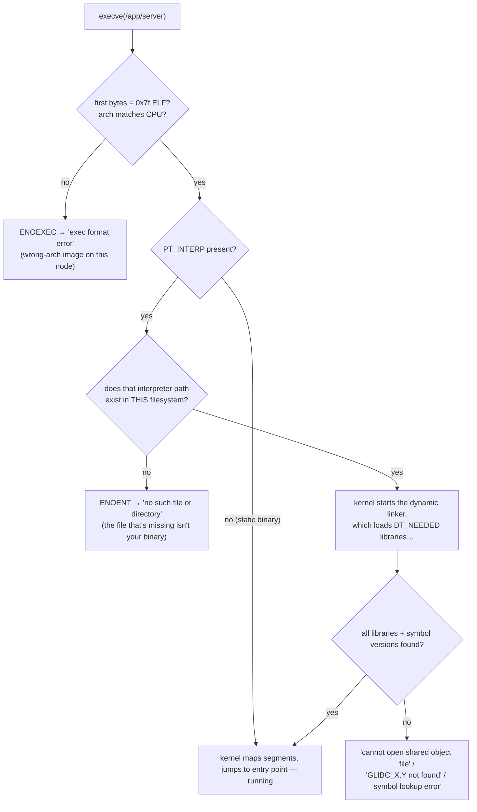

Here is the error that has cost the ecosystem a thousand confused hours. You copy a binary into an Alpine or distroless image, the pod goes [CrashLoopBackOff](/troubleshooting/crashloopbackoff/), and the log says:

```text
exec /app/server: no such file or directory
```

You exec into a debug copy, and the file is *right there* — `ls -l /app/server` shows it, correct permissions, correct size. The kernel is not lying, but it is answering a question you didn't know you asked. **The missing file is not your binary; it's the *interpreter* your binary names inside itself** — a path to a dynamic linker that exists in the image you built on and not in the image you shipped. To read that error correctly — and its cousins `exec format error`, `GLIBC_2.34 not found`, and `cannot open shared object file` — you need the last untaught layer of the container stack: what a binary actually *is*, and everything that has to be true about the filesystem around it before it can run. This is the article about that layer, and it ends where every container build decision begins: which base image, and why.

## What execve actually does with your file

When the runtime finally [execs your app](/foundations/processes-and-signals/), the kernel opens the file and reads its first bytes. Linux executables are **ELF** files — Executable and Linkable Format ([elf(5)](https://man7.org/linux/man-pages/man5/elf.5.html)) — and the header starts with four magic bytes (`\x7fELF`), then fields declaring the architecture, endianness, and type. Two header outcomes produce two famous errors before your code is ever mapped:

- Wrong architecture in the header (an arm64 binary on an amd64 node, or vice versa): the kernel refuses with `ENOEXEC` — surfaced as **`exec format error`**.
- Right architecture: the kernel walks the **program headers**, a table of segments telling it what to map where — `PT_LOAD` segments for code and data, and, for dynamically linked binaries, the one that owns this article: **`PT_INTERP`**.

`PT_INTERP` contains a literal, absolute path baked into the binary at link time: the **dynamic linker** (also called the interpreter or loader) that the kernel must start *instead of* your program, handing it your program to finish setting up. See it yourself on any binary:

```console
$ readelf -l /usr/bin/curl | grep -A1 INTERP
  INTERP         0x0000000000000318 0x0000000000000318 ...
      [Requesting program interpreter: /lib64/ld-linux-x86-64.so.2]
```

That path is the whole mystery. A binary built against **glibc** requests `/lib64/ld-linux-x86-64.so.2`; one built against **musl** (Alpine's libc) requests `/lib/ld-musl-x86_64.so.1`. `execve` treats the interpreter like any file open — and if the path doesn't exist in *this* container's filesystem, the syscall fails with `ENOENT`. **The shell then prints the only message `ENOENT` has: "no such file or directory" — about a file whose name appears nowhere in the error.** A glibc binary in an Alpine image, a dynamically linked anything in a `scratch` image, and (the classic) a script whose `#!` line names a missing shell all die this exact death.



Every failure mode in this article is a stop on that flowchart, and each stop has a distinct error string — which makes startup-crash diagnosis mostly a matter of reading the message literally.

## The dynamic linker's treasure hunt

Suppose the interpreter exists. It now reads your binary's **dynamic section**, where the link-time linker recorded a shopping list: one `DT_NEEDED` entry per required shared library.

```console
$ readelf -d /app/server | grep NEEDED
 0x0000000000000001 (NEEDED)  Shared library: [libssl.so.3]
 0x0000000000000001 (NEEDED)  Shared library: [libc.so.6]
```

For each entry the loader hunts through a strict search order ([ld.so(8)](https://man7.org/linux/man-pages/man8/ld.so.8.html) is the definitive reference):

| Order | Source | Notes |
|---|---|---|
| 1 | `DT_RPATH` baked into the binary | legacy; deprecated in favor of runpath |
| 2 | `LD_LIBRARY_PATH` environment variable | the duct tape of library problems — and an attack vector |
| 3 | `DT_RUNPATH` baked into the binary | the modern baked-in path |
| 4 | `/etc/ld.so.cache` | built by `ldconfig` from `/etc/ld.so.conf` — the fast path |
| 5 | `/lib`, `/usr/lib` (and `lib64` variants) | the defaults |

A miss anywhere on the list is the second famous error: `error while loading shared libraries: libssl.so.3: cannot open shared object file`. Note what this implies for containers: **the search happens entirely inside the container's mount namespace, against the image's filesystem** — the node's libraries are invisible, `ldconfig`'s cache is whatever the image baked, and `LD_LIBRARY_PATH` set in a Dockerfile silently rewires resolution for every process in the container. (That environment hook is also how `LD_PRELOAD` tricks like libfaketime inject themselves — [the time article](/foundations/time/) abuses it productively.)

Libraries found, the loader maps them and resolves **symbols** — matching your binary's undefined references (`printf`, `SSL_connect`) to definitions in the loaded libraries. Function calls are typically resolved *lazily* through the PLT/GOT indirection tables: the first call to each function pays for a lookup, subsequent calls jump directly. Lazy binding is why a missing symbol can crash you *minutes* after startup, when the code path is first exercised: `symbol lookup error: undefined symbol: ...`. (`LD_BIND_NOW=1` forces resolution at startup — a legitimate smoke test for this exact class of bug.)

The convenience tool for previewing all this is `ldd`, which prints the resolved tree — with one caveat worth repeating because it's genuinely surprising: **`ldd` may work by actually executing the binary's own interpreter with tracing enabled, so never run it on an untrusted binary** — a malicious file can name a malicious interpreter. `readelf -d` and `objdump -p` read the file passively and answer the same questions safely.

## glibc versus musl: two ABIs, not two packages

The deepest version of the problem isn't a missing library — it's the assumption that "libc" is one thing. A binary is compiled *against* a specific C library, and that choice is an **ABI commitment**, not a dependency you can swap at runtime.

**glibc** — GNU libc, the default on Debian, Ubuntu, RHEL, and virtually every non-Alpine image — uses **symbol versioning**: every symbol carries a version tag (`memcpy@GLIBC_2.14`), and a binary records the *newest* version of each symbol it linked against. Build on a new distro, run on an old base image, and the loader refuses with the third famous error:

```text
/app/server: /lib/x86_64-linux-gnu/libc.so.6: version `GLIBC_2.34' not found (required by /app/server)
```

Read it as a *build/runtime skew* report: your CI builder's glibc is newer than your base image's. **glibc is backward compatible — old binaries on new glibc always work; the reverse never does** — so the rule is simply *build on a glibc no newer than the one you ship on*. (This is why `container:` builds in [CI](/ci/github-actions/) matter: compile inside the same base family you deploy, not on whatever the runner image happens to be.)

**musl** — Alpine's libc — is a from-scratch implementation: smaller, stricter about POSIX, and built to make static linking pleasant. It is *not* ABI-compatible with glibc, and the incompatibility runs deeper than symbol names:

| Axis | glibc | musl |
|---|---|---|
| Interpreter path | `/lib64/ld-linux-x86-64.so.2` | `/lib/ld-musl-x86_64.so.1` |
| Symbol versioning | yes — `GLIBC_X.Y not found` errors | no |
| [DNS resolver behavior](/foundations/dns-resolution/) | nsswitch, parallel queries, long TCP-fallback history | own resolver, historically different search/TCP behavior — the engine of "flaky DNS on Alpine" |
| Default thread stack size | ~8 MB | **128 KB** — deep-stacked native code (JVM JNI, Go cgo, heavy C++ recursion) can crash on musl and nowhere else |
| Static linking | possible, painful (NSS wants dlopen) | first-class |

**The stack-size row is the one that produces the eeriest bugs**: a program that is *correct* on glibc segfaults on musl with no code change, because a native thread ran off a stack sixty times smaller than it silently assumed. When a [JVM crash log](/java/jvm-crashes/) or a cgo-heavy Go binary misbehaves only on Alpine, suspect the libc before the code. Alpine's `gcompat` shim and glibc-on-Alpine packages exist, but they are patches over an ABI mismatch — matching the libc properly (or going static) is the durable fix.

## Static linking: opting out of the whole story

Everything so far assumed dynamic linking. A **statically linked** binary copies every needed function *into* the executable at build time: no `PT_INTERP`, no `DT_NEEDED`, no loader, no libc on the filesystem — the kernel maps it and jumps. The entire flowchart above collapses to its shortest path, and the binary runs in an image containing *literally nothing else*.

This is Go's signature move. With `CGO_ENABLED=0`, Go uses its own runtime and its own syscall layer instead of libc, producing a truly static binary — which is why `FROM scratch` is a viable Go base image and a two-stage Dockerfile is the idiom:

```dockerfile
FROM golang:1.22 AS build
ENV CGO_ENABLED=0
RUN go build -o /server .

FROM scratch
COPY --from=build /server /server
ENTRYPOINT ["/server"]
```

Rust gets the same result by targeting `x86_64-unknown-linux-musl` (musl's static-friendliness is the enabler). C can static-link with effort, though glibc resists (name-service lookups want `dlopen` even in static builds — another reason musl owns this niche). And some ecosystems simply can't play: **the JVM is a large dynamically-linked native program with a libc dependency of its own, and Python and Node are interpreters that drag an entire runtime tree** — for them the question is never "can I go static" but "which libc does my runtime build expect."

The trade is worth stating honestly: static binaries are bigger, don't share pages across containers the way common base layers do, and *bake in* their crypto and DNS code — a libssl CVE means rebuilding every static binary rather than patching one base image.

## The base-image decision, decompiled

All of the above compresses into the table that should sit behind every `FROM` line:

| Base | libc | Shell? | Package manager? | What runs there |
|---|---|---|---|---|
| `scratch` | none | no | no | static binaries only |
| distroless (`gcr.io/distroless/*`) | glibc (static/base variants) | no | no | static binaries; glibc-linked binaries and runtimes on the runtime variants |
| Alpine | musl | BusyBox `ash` | `apk` | musl-linked or static binaries; anything from Alpine's own packages |
| Debian/Ubuntu (incl. `-slim`) | glibc | bash | `apt` | effectively anything, at image-size and surface cost |

The decision procedure: **Go and Rust want scratch or distroless; JVMs want a JRE base whose libc matches the JVM build** (Temurin and friends publish both glibc and musl builds — mixing them reproduces this article's every error); Python and Node want the official runtime images, slim or Alpine variants, chosen by whether your native extensions have musl wheels; .NET has its own runtime-vs-self-contained fork of the same choice ([dotnet in containers](/dotnet/dotnet-in-containers/) walks it). The cost of the minimal end is operational: **no shell means no `kubectl exec` into it, and no package manager means nothing to install when things break** — the entire [BusyBox toolkit](/troubleshooting/busybox/) and [ephemeral debug container](/troubleshooting/debugging-toolbox/) practice exists because production images increasingly, and correctly, contain nothing but the app.

## One more axis: architecture

The libc axis decides whether the loader succeeds; the **architecture** axis decides whether the kernel even tries. An image built on an amd64 laptop and scheduled onto an arm64 node (Graviton, Ampere — increasingly the cheap pool) fails at the first diamond of the flowchart: `exec format error`, usually inside a CrashLoopBackOff.

The fix is **multi-arch images**: a manifest list — one image tag pointing at several architecture-specific images, with the registry serving whichever matches the pulling node. `docker buildx build --platform linux/amd64,linux/arm64` builds and pushes the set (cross-compiling is trivial in Go — `GOARCH=arm64` — and QEMU-emulated for native-code builds); inspect what a tag really contains with `docker manifest inspect`. **When a workload crashes only on some nodes, compare `kubectl get nodes -o wide` architecture against the image's manifest before reading a single line of code.**

## See it yourself

Every diagnostic here runs with two or three standard tools — and on toolless images, from a debug container [targeting the pod](/troubleshooting/debugging-toolbox/):

```bash
file /app/server
# ELF 64-bit LSB executable, x86-64, dynamically linked,
# interpreter /lib64/ld-linux-x86-64.so.2, ...
#   → arch, static vs dynamic, and the interpreter, in one line

readelf -l /app/server | grep -A1 INTERP    # the interpreter path itself
ls -l /lib64/ld-linux-x86-64.so.2           # ...does it exist HERE?

readelf -d /app/server | grep NEEDED        # the library shopping list
ldd /app/server                              # resolved tree (trusted binaries only!)

objdump -T /app/server | grep -o 'GLIBC_[0-9.]*' | sort -Vu | tail -1
#   → the minimum glibc version this binary demands of its base image
```

And the two five-minute labs that make it permanent. First, cross the libc streams deliberately:

```bash
docker run --rm -v /tmp/bin:/out debian:12 cp /usr/bin/ls /out/gnu-ls
docker run --rm -v /tmp/bin:/x alpine:3.20 /x/gnu-ls
# exec /x/gnu-ls: no such file or directory   ← the whole article in one line
```

Second, cross the architectures:

```bash
docker run --rm --platform linux/arm64 alpine:3.20 uname -m   # emulated: aarch64
GOARCH=arm64 go build -o server-arm64 . && docker run --rm -v $PWD:/x alpine /x/server-arm64
# exec format error   ← on an amd64 machine without emulation
```

Close the loop with the error-to-cause index — the startup-crash half of this is what a [CrashLoopBackOff log line](/troubleshooting/crashloopbackoff/) hands you:

| The log says | The flowchart stop | The fix |
|---|---|---|
| `no such file or directory` (file exists) | interpreter missing | match libc to base image, or link statically |
| `exec format error` | wrong architecture | multi-arch build; check node vs image arch |
| `cannot open shared object file` | `DT_NEEDED` search miss | install the library in the image; check `LD_LIBRARY_PATH` |
| `GLIBC_X.Y not found` | symbol-version skew | build on a glibc ≤ your base image's |
| `symbol lookup error` (late, mid-run) | lazy binding met a missing symbol | library *version* mismatch; `LD_BIND_NOW=1` to surface at startup |
| segfault only on Alpine | musl behavior difference (stack size, DNS…) | match libc properly; don't shim |

**A container image is not "an app in a box"; it is a filesystem contract, and the binary's ELF headers are the contract's terms.** Read the terms with `readelf`, and the box stops being mysterious. What the binary does *next* — asking what time it is, and trusting the answer — is its own deep story: [Time: Clocks, Skew, and Why Distributed Systems Care](/foundations/time/).
