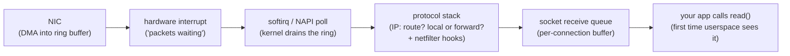
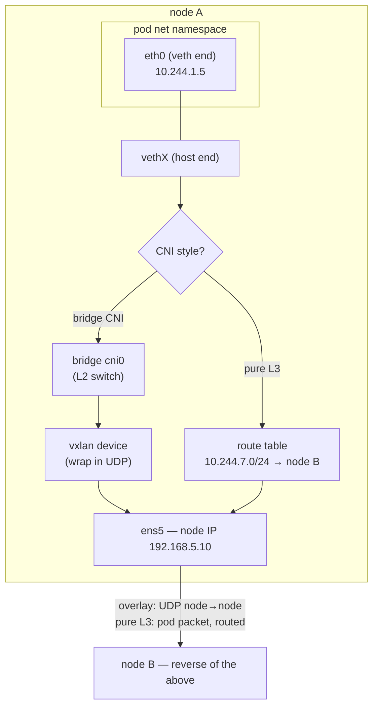

Every Kubernetes networking abstraction — pod IPs, Services, NetworkPolicies, the CNI itself — is built from three Linux primitives: **interfaces, routes, and netfilter hooks**. This article is about the first two (the third gets [its own article](/foundations/firewalls-and-netfilter/)). The payoff for learning them is blunt: when [the networking model](/networking/networking-model/) says "every pod gets an IP and every pod can reach every pod," that sentence is implemented by a veth pair, a bridge or a route, and maybe a VXLAN device — nothing else. If you can read `ip addr`, `ip route`, and `ip neigh`, you can see the entire pod network with your own eyes, and most "the network is broken" incidents become "one of three primitives is misconfigured."

[Kubernetes Is Linux](/troubleshooting/kubernetes-is-linux/) gave you the one-paragraph version: a veth pair is the cable out of the pod's network namespace. This page opens that sentence up — what an interface actually is, what a route actually is, how a packet moves between them, and why three CNI plugins that look wildly different are the same parts in three arrangements.

## A packet's journey through a host

Before interfaces and routes make sense, you need the conveyor belt they sit on. When a packet arrives at a physical NIC, roughly this happens:



Five details in that pipeline explain real symptoms:

- **The ring buffer is finite.** The NIC DMA-writes packets into a fixed-size ring; if the kernel doesn't drain it fast enough (CPU saturated, softirq starved), packets are dropped *before any counter your app can see*. This is why `ethtool -S eth0 | grep -i drop` on a node is a standard platform ask when packets vanish without explanation.
- **Packet processing is kernel CPU time.** The softirq work of moving packets through the stack is charged to the kernel, not to your pod's cgroup — heavy network load on a node degrades everyone, invisibly to per-pod CPU metrics. That's one flavor of noisy neighbor that [node-level triage](/troubleshooting/node-problems/) exists for.
- **The routing decision happens in the middle.** Once the IP layer has the packet, it asks one question: *is this destination local, or do I forward it?* Local delivery climbs the stack toward a socket; forwarding sends the packet back out another interface. **A Kubernetes node is a router** — pod traffic to other nodes is *forwarded* traffic, which is why `net.ipv4.ip_forward=1` is a hard requirement on every node.
- **Netfilter hooks are stapled onto this path** at five points — that's where Services get DNAT'ed and NetworkPolicies drop packets, covered in [the firewalls article](/foundations/firewalls-and-netfilter/).
- **The socket queue is the handoff to userspace.** Data sits in a per-connection kernel buffer until your app `read()`s it — the `Recv-Q` column in `ss`, and the physical substance of backpressure, which [the TCP article](/foundations/tcp-connections/) dissects.

The whole journey is the top half of what [Life of a Request](/routing/life-of-a-request/) walks at cluster scope: every hop in that story is one host running this pipeline.

## Interfaces: real, loopback, and the virtual menagerie

An interface is the kernel object that packets enter and leave through. `ip link show` lists them; on a Kubernetes node you'll see a zoo, and every species has a job:

| Interface | What it is | Where you meet it in Kubernetes |
|---|---|---|
| `eth0`, `ens5`, ... | a real NIC (or the VM's virtual one) | the node's actual connection to the world; node IP lives here |
| `lo` | loopback — packets to yourself, never leaves the host | `localhost` between containers in a pod (each net namespace has its **own** `lo`) |
| `veth*` | one end of a **veth pair** — two interfaces joined back-to-back | **the** container primitive: one end is the pod's `eth0`, the other sits on the node |
| `cni0`, `docker0`, `br-*` | a **bridge** — a software Ethernet switch | bridge-style CNIs (flannel, the reference `bridge` plugin) plug pod veths into it |
| `flannel.1`, `vxlan.calico` | a **VXLAN** device — encapsulates Ethernet frames in UDP | overlay CNIs use it to tunnel pod traffic between nodes |
| `tun*`/`tap*` | an interface whose other end is a **userspace process** | VPN clients, some service meshes and userspace dataplanes |
| `kube-ipvs0` | a dummy device holding addresses, forwarding nothing | IPVS-mode kube-proxy binds every ClusterIP to it — see [the dataplane deep dive](/routing/kube-proxy-and-the-dataplane/) |

Three of these deserve a longer look, because between them they *are* pod networking.

**The veth pair** ([veth(4)](https://man7.org/linux/man-pages/man4/veth.4.html)) is the simplest possible network device: two interfaces created as a unit, and **every packet transmitted into one end is received by the other**. No switching logic, no addressing decisions — a virtual patch cable. Its superpower is that the two ends can live in *different network namespaces*. The CNI plugin creates a pair, pushes one end into the pod's namespace (where it's renamed `eth0` and given the pod IP), and keeps the other end in the node's namespace. That is the entire mechanism by which an isolated [network namespace](/foundations/namespaces/) gets connectivity. From inside any pod, you can see your half — and find its partner:

```console
$ cat /sys/class/net/eth0/iflink
17
```

That number is the interface index of the *other* end; on the node, `ip link | grep '^17:'` names the host-side veth. This is the standard trick for answering "which host interface belongs to my pod" before a `tcpdump` or a NetworkPolicy investigation.

**The bridge** is a software Ethernet switch, and it behaves exactly like the physical one in your office closet: it learns which MAC addresses live behind which ports by watching source addresses on incoming frames, forwards frames to the learned port, and floods frames for unknown destinations to all ports. When a CNI plugs every pod's host-side veth into `cni0`, pods on the same node reach each other with plain L2 switching — no routing, no rules. `bridge fdb show br cni0` (on a node) dumps the learned MAC table; `bridge link` shows the attached ports.

**The VXLAN device** ([RFC 7348](https://www.rfc-editor.org/rfc/rfc7348)) solves a different problem: making pod traffic cross an underlying network that knows nothing about pod IPs. It takes an entire Ethernet frame, wraps it in a UDP packet (port 8472 or 4789) addressed node-to-node, and sends it over the real network. The receiving node's VXLAN device unwraps it and injects the inner frame as if it arrived locally. The wrapper costs 50 bytes — remember that number; it comes back in the MTU section.

## L2 vs L3: ARP, MACs, and what a route actually is

The layering that makes all of the above compose: **Ethernet (L2) delivers frames to MAC addresses on the local link; IP (L3) delivers packets to IP addresses across links.** A packet traveling from your pod to a pod on another node keeps the same source and destination *IP addresses* the whole way, but its *MAC addresses* are rewritten at every routed hop — the MAC header is scaffolding, rebuilt per link.

The glue between the layers is ARP ([RFC 826](https://www.rfc-editor.org/rfc/rfc826)): "who has IP 10.244.1.1? Tell me your MAC." Answers are cached in the neighbor table:

```console
$ ip neigh
10.244.1.1 dev eth0 lladdr ee:ee:ee:ee:ee:ee REACHABLE
169.254.1.1 dev eth0 lladdr ee:ee:ee:ee:ee:ee STALE
```

`REACHABLE` and `STALE` are healthy; **`FAILED` or a stuck `INCOMPLETE` means ARP got no answer — an L2 problem, and no amount of L3 debugging will fix it.** (That `ee:ee:ee:ee:ee:ee` address, if you see it, is Calico answering ARP by proxy for everything — a deliberate trick to force all pod traffic up to L3, where routes rule.)

So what is a route? Demystified: **a route is one row of a lookup table mapping a destination prefix to (interface, optional next-hop gateway).** Nothing more. The kernel consults it once per outgoing packet:

```console
$ ip route
default via 10.244.1.1 dev eth0
10.244.1.0/24 dev eth0 scope link
```

That's a typical view from inside a pod — refreshingly small. The second line says "my own subnet: deliver directly on `eth0`" (`scope link` = no gateway, ARP for the destination itself). The first says "everything else: hand the frame to the gateway's MAC and let it worry." The selection algorithm is **longest prefix match**: among all rows whose prefix contains the destination, the most specific (longest `/N`) wins; `default` is just `0.0.0.0/0`, the least specific row possible, which is why it matches only when nothing else does. On a Calico-style node, the table is bigger and more interesting — one `/32` or `/26` row *per pod or per pod-block*, programmed by the CNI:

```text
10.244.1.5 dev cali12ab34cd scope link       # this node's pod: straight into its veth
10.244.7.0/26 via 192.168.5.11 dev ens5      # that block lives on node .11: forward
```

Rather than eyeballing the table, ask the kernel to run the lookup for you — `ip route get` shows the exact decision, including source-address selection:

```console
$ ip route get 10.244.7.42
10.244.7.42 via 192.168.5.11 dev ens5 src 192.168.5.10 uid 0
```

One command, and "which way will this packet leave" stops being a guess. (Full grammar: [ip-route(8)](https://man7.org/linux/man-pages/man8/ip-route.8.html).) One refinement to know exists: Linux actually keeps *multiple* routing tables selected by **policy rules** (`ip rule` — match on source address, firewall mark, and more, then pick a table). Some CNIs and service meshes use marks plus extra tables to steer traffic through tunnels or sidecar proxies; when `ip route` seems to contradict observed behavior, `ip rule` is the missing piece.

## Three CNIs, one parts bin

Here is the section that makes the whole page click. Every CNI must solve the same two problems — *node-local attachment* (get packets in and out of the pod namespace) and *cross-node fabric* (get packets between nodes) — and the solutions are combinations of exactly the primitives above:

| Style (examples) | Node-local attachment | Cross-node fabric | What a cross-node packet looks like on the wire |
|---|---|---|---|
| **Bridge + overlay** (flannel VXLAN) | veth pair into bridge `cni0` | VXLAN device `flannel.1`, one route per remote node's pod CIDR | UDP between node IPs, pod packet hidden inside |
| **Pure L3 routing** (Calico in BGP mode) | veth pair, **no bridge** — a `/32` route per pod, proxy-ARP on the veth | real routes: pod CIDRs advertised between nodes (BGP), underlying network carries pod IPs natively | the pod packet itself, pod IPs visible to every hop |
| **Overlay, no bridge** (Calico VXLAN, Cilium tunnel mode) | veth + per-pod routes | VXLAN/Geneve encapsulation between nodes | UDP between node IPs, as above |

**Same primitives, three arrangements — that's the entire diversity of CNI dataplanes.** And the choice leaks into your debugging: on an overlay, a node-level `tcpdump` on the physical NIC shows UDP between node IPs and never a pod IP (capture on `flannel.1` instead); on pure L3, pod IPs are right there in the capture but the *underlying network* must be willing to route them (a cloud subnet with source/destination checks, or a corporate router that's never heard of 10.244.0.0/16, silently breaks it). eBPF dataplanes like Cilium replace the *rule* machinery but still attach pods with veth (or handle them at the tc hook) — the interfaces-and-routes layer of this article survives even there.



This is also where [NetworkPolicy](/networking/network-policies/) physically lives: the enforcement point is the pod's veth (or its eBPF equivalent) — the one choke point every packet to or from the pod must cross. And it's the ground floor under [kube-proxy and the dataplane](/routing/kube-proxy-and-the-dataplane/): Services rewrite *addresses*; the machinery on this page decides where the rewritten packet physically goes next.

## The sysctls that decide whether any of this works

The kernel's networking behavior is riddled with per-namespace knobs (the compendium is [ip-sysctl](https://docs.kernel.org/networking/ip-sysctl.html)), and three of them account for a disproportionate share of broken clusters:

- **`net.ipv4.ip_forward`** — the master switch for routing between interfaces. Must be `1` on nodes; a security-hardening script that "helpfully" sets it to 0 severs every pod on the node from the world while the node itself stays healthy. A classic, maddening failure signature.
- **`net.ipv4.conf.*.rp_filter`** — reverse-path filtering: on receiving a packet, the kernel checks "would I route the *reply* back out the interface it arrived on?" and, in strict mode (`1`), **silently drops** the packet if not. Sane anti-spoofing on simple hosts; a trap on multi-interface nodes and asymmetric CNI paths. Dropped-by-rp_filter packets appear in *no* firewall counter, which is why this sysctl is on the checklist in [the netfilter article's pathology section](/foundations/firewalls-and-netfilter/).
- **`net.ipv4.conf.*.arp_ignore` / `arp_announce`** — who answers ARP for what. CNIs and IPVS-mode kube-proxy tune these so that, e.g., every ClusterIP bound to `kube-ipvs0` doesn't get ARP-announced onto the real network.

Because each network namespace carries its **own** sysctl values, some of these are settable per pod via `securityContext.sysctls` — the reason pod-level sysctls exist as a feature at all, as [the namespaces article](/foundations/namespaces/) explains.

## See it yourself: reading the state

Everything above is inspectable with a handful of commands — from inside a pod where the image allows, via an ephemeral [debug container](/troubleshooting/debugging-toolbox/) where it doesn't, and from `/proc/net/*` when there are no tools at all ([the field guide](/troubleshooting/linux-inside-the-pod/) decodes those files line by line; command-by-command reference in [networking commands](/networking/networking-commands/)):

```bash
ip -br addr          # every interface, state, and address — one line each
ip -br link          # link layer: state, MAC, and (with -d) device type
ip route             # the routing table; add 'get <ip>' for a live lookup
ip neigh             # ARP/neighbor cache — look for FAILED/INCOMPLETE
ss -tnp              # sockets: who's connected where (TCP article covers depth)
cat /proc/net/dev    # per-interface byte/packet/error/drop counters, no tools needed
cat /sys/class/net/eth0/mtu      # this interface's MTU
cat /sys/class/net/eth0/iflink   # peer index of my veth's other end
```

Two habits worth building. First, **read counters twice**: `/proc/net/dev`'s `drop` and `errs` columns (or `ethtool -S` on a node, which exposes the NIC's own ring-buffer and missed-packet counters) only mean something as a *rate* — sample, wait ten seconds, sample again. Second, **walk the layers in order**: link up (`ip -br link`) → address present (`ip -br addr`) → route exists (`ip route get`) → neighbor resolves (`ip neigh`) → then and only then blame firewalls or DNS. That ordering is the skeleton of [Debugging Network Issues](/networking/debugging-network/), and it's the fastest way to turn "[the Service is unreachable](/troubleshooting/service-unreachable/)" into a specific broken primitive.

## MTU: the classic overlay trap

Every interface has an MTU — the largest packet it will carry, conventionally 1500 bytes on Ethernet. Now recall the VXLAN wrapper: 50 bytes of encapsulation overhead. **A pod interface on a VXLAN overlay must have an MTU of 1450 (or less), because its packets grow 50 bytes on the way out** — that's the famous 1450 you see in `ip link` output on flannel clusters, and the arithmetic behind cloud-provider variants (AWS's 9001 jumbo frames minus overhead, WireGuard-encrypted CNIs subtracting 60–80, and so on).

When the arithmetic is wrong — a pod MTU of 1500 on a 1450-capable path, or an underlay hop narrower than assumed — small packets flow and large ones die, producing the signature pathology: **connections establish, small requests work, and large responses hang forever.** The TCP handshake is tiny; the 100 KB JSON reply fills packets to the MTU and those get dropped. In theory, Path MTU Discovery ([RFC 1191](https://www.rfc-editor.org/rfc/rfc1191)) saves you: packets are sent with the don't-fragment bit set, an ICMP "fragmentation needed" message comes back from the narrow hop, and the sender shrinks. In practice, firewalls and security groups that drop all ICMP create an **ICMP black hole** — the sender never learns, and retransmits the same too-big packet into the void until timeout. Curl hanging on big responses while `curl -r 0-1000` (range request, small reply) succeeds is this bug wearing its uniform.

See it yourself, with the don't-fragment bit as a probe:

```bash
ping -M do -s 1472 <peer>   # 1472 + 28 header = 1500: does a full-size packet survive?
ping -M do -s 1422 <peer>   # 1450-sized: if this works and the above fails, MTU mismatch
```

Bisect the size and you've measured the path MTU with nothing but ping. The fix is always the same shape — make every interface on the path agree, and let ICMP through — and it's a platform-team fix, but arriving with "1422 passes, 1472 doesn't, here's the interface MTU list" turns a week of mystery into a one-line ticket.

## Where to go next

You now have the substrate: interfaces move frames, ARP glues IP to Ethernet, routes pick the next hop, and CNIs are arrangements of those parts. Two articles build directly on it — [TCP: What a Connection Actually Is](/foundations/tcp-connections/) climbs one layer up to the connections your app actually experiences, and [Firewalls: netfilter, iptables, and Beyond](/foundations/firewalls-and-netfilter/) covers the hooks bolted onto this packet path where Services and NetworkPolicies happen. For the canonical references, keep three tabs: [ip(8)](https://man7.org/linux/man-pages/man8/ip.8.html) for the tool that reads and writes all of this state, [ip-sysctl](https://docs.kernel.org/networking/ip-sysctl.html) for every knob, and [RFC 826](https://www.rfc-editor.org/rfc/rfc826) — four pages from 1982, still running your cluster.
