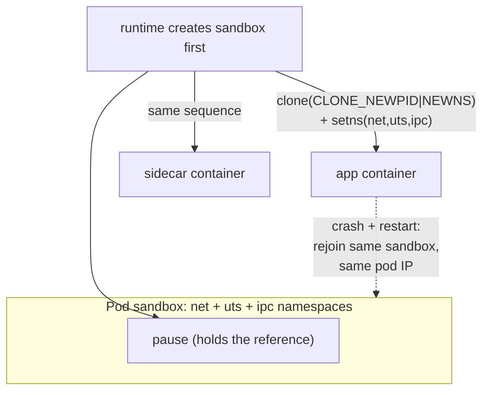
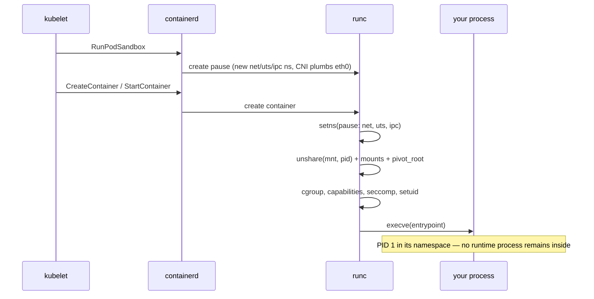

The survey page told you the punchline: [there is no such thing as a container](/troubleshooting/kubernetes-is-linux/) — only a process wearing namespaces, cgroups, an overlayfs root, and capability handcuffs. This page is the mechanism behind the first of those four words. How does the kernel actually give a process a *different view* of the machine? What are the three syscalls that do all of it? Why does every pod on earth carry a do-nothing `pause` process? And — the question that decides whether you should ever trust a container boundary with your life — what does a namespace *not* hide?

**A namespace is not a sandbox, a VM, or a security product. It is a kernel data structure that swaps one global resource table for a private copy, per process.** Everything else — pods, sidecars, `kubectl exec`, `hostNetwork: true` — is arrangements of that one trick.

## Where namespaces came from (and why they arrived in pieces)

The idea is older than Linux containers by two decades. **Plan 9 from Bell Labs** — the 1980s successor-to-Unix research system — was built on the principle that every process could have its own private view of the filesystem, assembled by per-process mounts. No global mount table at all; the *view* was the unit of composition. Linux borrowed exactly that idea first: the **mount namespace landed in kernel 2.4.19, in 2002**, years before anyone said "container," as a general-purpose isolation tool ([mount_namespaces(7)](https://man7.org/linux/man-pages/man7/mount_namespaces.7.html)).

The rest arrived one resource at a time, each contributed by whoever needed it: UTS and IPC (2006), PID and network namespaces (2008, largely driven by the OpenVZ and IBM containers work), and — hardest of all — the **user namespace, not fully usable until kernel 3.8 in 2013**, because remapping "who is root" touches every permission check in the kernel. Docker shipped in 2013 atop the finished stack. This history explains a fact that surprises people: **namespaces are not one feature. They are eight loosely-related features** ([namespaces(7)](https://man7.org/linux/man-pages/man7/namespaces.7.html)) that runtimes compose, and each has its own quirks, maturity level, and sharp edges — which is why this article walks them one by one instead of pretending they're uniform.

## The three syscalls

Every container runtime, `kubectl debug` session, and CNI plugin reduces to three system calls.

**`clone()` — create a child in new namespaces.** [clone(2)](https://man7.org/linux/man-pages/man2/clone.2.html) is `fork()` with flags, and among those flags are `CLONE_NEWPID`, `CLONE_NEWNET`, `CLONE_NEWNS` (mount — it got the generic name because it was first), `CLONE_NEWUTS`, `CLONE_NEWIPC`, `CLONE_NEWUSER`, `CLONE_NEWCGROUP`, `CLONE_NEWTIME`. Conceptually:

```c
/* "give my child its own PID and mount view" */
pid = clone(child_fn, stack, CLONE_NEWPID | CLONE_NEWNS | SIGCHLD, arg);
```

**`unshare()` — move *myself* into new namespaces.** Same flags, no child required ([unshare(2)](https://man7.org/linux/man-pages/man2/unshare.2.html)). The `unshare(1)` command wraps it, and it's the fastest way to feel a namespace with your own hands on any Linux box where you have root:

```bash
sudo unshare --pid --fork --mount-proc sh -c 'echo "I am PID $$"; ps aux'
```

```text
I am PID 1
PID   USER     TIME  COMMAND
    1 root     0:00  sh -c echo "I am PID $$"; ps aux
    2 root     0:00  ps aux
```

Two processes. The machine is running thousands, but you built a view in which they don't exist. That's a container's process isolation, minus the branding.

**`setns()` — join a namespace that already exists.** [setns(2)](https://man7.org/linux/man-pages/man2/setns.2.html) takes a file descriptor pointing at a namespace and moves the calling thread into it. This is the syscall behind every "get me inside" tool you use: `nsenter` on a node, ephemeral [debug containers](/troubleshooting/debugging-toolbox/), and `kubectl exec` itself — the runtime opens the target container's namespace files and `setns()`es into them before exec'ing your shell. **`kubectl exec` is not a login and not SSH; it is `setns()` with an API server in front of it** — the full authn/authz contrast lives in [the SSH article](/foundations/ssh/).

Where do those file descriptors come from? Namespaces are visible as files:

```console
$ ls -l /proc/self/ns/
lrwxrwxrwx 1 app app 0 ... cgroup -> 'cgroup:[4026532475]'
lrwxrwxrwx 1 app app 0 ... ipc -> 'ipc:[4026532391]'
lrwxrwxrwx 1 app app 0 ... mnt -> 'mnt:[4026532389]'
lrwxrwxrwx 1 app app 0 ... net -> 'net:[4026532394]'
lrwxrwxrwx 1 app app 0 ... pid -> 'pid:[4026532392]'
lrwxrwxrwx 1 app app 0 ... user -> 'user:[4026531837]'
lrwxrwxrwx 1 app app 0 ... uts -> 'uts:[4026532390]'
```

Each symlink names a kernel inode. **Two processes are in the same namespace if and only if these inode numbers match** — run this inside two containers of one pod and you'll see identical `net`, `uts`, and `ipc` inodes but different `mnt` and `pid` ones. That's the definition of a pod, read from the filesystem. (More in-pod reading of this kind: [Linux Inside the Pod](/troubleshooting/linux-inside-the-pod/).)

## Lifetimes, refcounting, and the reason `pause` exists

A namespace is kept alive by references: every process inside it holds one, and so does every open fd or bind mount of its `/proc/<pid>/ns/*` file. **When the last reference drops, the namespace — and everything in it — is destroyed.** For a network namespace that means the interfaces, routes, iptables rules, and sockets all evaporate.

Now put on the kubelet's hat. A pod's IP must survive its containers. Containers crash, restart, get replaced during `kubectl rollout` — if the app container held the pod's network namespace, every crash would tear down the pod's networking and force the CNI to re-plumb it. So the runtime creates one tiny process first — **`pause`, whose entire job is to hold a reference to the pod's shared namespaces and then sleep forever** — and every real container joins the sandbox via `setns()`. Kill the app; the namespaces persist; the restarted container joins the same net namespace and finds its IP exactly where it left it.

There's a second pinning mechanism worth knowing because tools use it: **bind-mounting the namespace file keeps the namespace alive with no process in it at all.** `ip netns add foo` does exactly this — it creates a net namespace and bind-mounts it under `/var/run/netns/foo` so it survives empty. Some runtimes have used the same trick for pod sandboxes. Either way, the principle is one you can reason from: **namespace lifetime is reference lifetime**, and the pause container is nothing but a live reference with a heartbeat.



## The namespaces one by one — where each will bite you

### PID: you are PID 1, whether you wanted it or not

A PID namespace gives its members a second set of process IDs. Your process is PID 34712 to the node and **PID 1 to itself** — and PID 1 is a special citizen with a bad temper: signals with default dispositions are quietly ignored, and orphans get reparented to it. The full consequences — why your app must handle SIGTERM as PID 1, why zombies accumulate without a reaper — are the subject of [Processes, Signals, and PID 1](/foundations/processes-and-signals/); here we take the namespace-mechanical facts ([pid_namespaces(7)](https://man7.org/linux/man-pages/man7/pid_namespaces.7.html)):

- **PID namespaces nest, and membership is one-way.** A parent namespace sees your process (under its node PID); you cannot see out. `unshare(CLONE_NEWPID)` doesn't move the caller — only its *children* land in the new namespace, which is why `unshare --pid` needs `--fork`.
- **When PID 1 of a namespace dies, the kernel SIGKILLs everything in it.** This is why killing the app container's main process kills its exec'd shells too, and it's half the mechanics of container teardown.
- **Orphans never cross the boundary.** A grandchild orphaned inside your container is reparented to *your* PID 1 (or the nearest subreaper) — never to the node's init. If your PID 1 doesn't call `wait()`, zombies pile up in *your* `ps` output; the node can't help you.
- **`/proc` must be remounted to match.** procfs shows the PID namespace of whoever *mounted* it. That's why `unshare --pid` without `--mount-proc` shows you the host's process list from inside your shiny new namespace — and why container runtimes always mount a fresh `/proc` as part of assembly.

And the pod-level knobs: `hostPID: true` skips creating the namespace; `shareProcessNamespace: true` gives all of a pod's containers *one* PID namespace, with `pause` as everyone's PID 1 — which incidentally fixes zombie reaping and lets a sidecar signal the app, at the cost of mutual process visibility ([graceful shutdown implications here](/workloads/graceful-shutdown/)).

### Network: a whole private network stack, not a filtered one

A network namespace is the heavyweight: each one owns its own interfaces, routing tables, ARP cache, port space, netfilter rules, and `lo` ([network_namespaces(7)](https://man7.org/linux/man-pages/man7/network_namespaces.7.html)). Three consequences that regularly surprise people:

**Each pod has its own iptables.** Rules in the pod's net namespace are completely disjoint from the node's — an init container running `iptables -A OUTPUT ...` (the old service-mesh redirect trick) affects only that pod, and node-level `iptables-save` won't show it. Conversely, the [kube-proxy chains](/routing/kube-proxy-and-the-dataplane/) live in the *node's* namespace and are invisible from your pod.

**Network sysctls are (mostly) per-namespace.** `net.ipv4.ip_local_port_range`, `net.core.somaxconn`, TCP keepalive intervals — these exist per net namespace, which is exactly why the pod spec has a `securityContext.sysctls` field: the kubelet can safely set namespaced sysctls for one pod without touching the node. Non-namespaced sysctls (most of `vm.*`, `kernel.*`) can't be pod-scoped, and that's the kernel drawing the line, not Kubernetes.

**A new net namespace contains almost nothing.** One `lo` interface, down. Everything else — the `eth0`, the routes, the pod IP — is *installed from outside* by the CNI plugin, which creates a veth pair, pushes one end through the namespace boundary, and configures it. The wiring itself is [the Linux networking article](/foundations/linux-networking/); the point here is that pod networking is not a property of the namespace but a delivery *into* it.

### Mount: private tables, and the propagation trap

Every process has a mount table; a mount namespace gives containers private ones, which is how each container sees its own image as `/` with volumes grafted in. The deep trap is **propagation**. When mount namespaces are copied, each mount point carries a propagation type ([mount_namespaces(7)](https://man7.org/linux/man-pages/man7/mount_namespaces.7.html) covers the full state machine):

| Propagation | Meaning | Where you meet it in Kubernetes |
|---|---|---|
| `private` | mount events cross in neither direction | most volume mounts in your containers |
| `rshared` | events flow both ways between copies | `mountPropagation: Bidirectional` — how a CSI driver pod's mounts become visible to the host and other pods |
| `rslave` | host-side events flow *in*, yours don't flow *out* | `mountPropagation: HostToContainer` — see new host mounts without leaking yours |

This is not trivia. **A CSI node plugin runs as a pod, in its own mount namespace, yet the filesystems it mounts must appear in *other* pods' namespaces** — that only works because the right subtrees are shared/slave, and "volume mounted in the driver but empty in my pod" is what a propagation misconfiguration looks like. The same applies to `hostPath` mounts under paths the host remounts later. Storage's fuller story — bind mounts, why `subPath` ConfigMap mounts never update — is in [the storage article](/foundations/storage-and-filesystems/).

### User: remapping "who is root"

A user namespace maps UID ranges: container UID 0 can be node UID 100000 ([user_namespaces(7)](https://man7.org/linux/man-pages/man7/user_namespaces.7.html)). Inside, you're root — you can mount, create namespaces, hold capabilities *over namespaced resources*. Outside, you're an unprivileged high UID, and a container escape lands you in nobody's shoes. It's the single strongest hardening namespace, and the reason it took until 2013 is the reason it's still rolling out in Kubernetes (`hostUsers: false`): **every file permission check now goes through a mapping**, and everything that touches on-disk UIDs — image layer ownership, volume permissions (`fsGroup`), ID ranges shared between pods — has to cooperate. Rootless container runtimes are built entirely on this namespace, and their remaining pain points (uid-mapped mounts, storage drivers) are exactly the mapping's edges. If you're deciding what your cluster's [pod security posture](/workloads/pod-security/) should require, user namespaces are the item most worth asking your platform team about.

### The short four

**UTS** holds hostname and domain name — two strings; the pod's hostname is the pod name because the sandbox's UTS namespace says so. **IPC** isolates System V IPC and POSIX message queues, making `/dev/shm` pod-private (and pod-*shared* — containers in a pod share it, a real data channel some databases exploit). **cgroup** virtualizes `/sys/fs/cgroup` so your subtree looks like the root — cosmetic but load-bearing for tools that read [the budget files](/foundations/cgroups/). **time** (kernel 5.6+) virtualizes the *monotonic and boot* clocks — for CRIU checkpoint/restore, not wall-clock time, which is why "different timezone per container" is an env var (`TZ`), not a namespace, and why a clock-skewed node poisons every pod on it.

## How runc actually assembles a container

You can now read a container's birth certificate. When the kubelet asks containerd for a container, the low-level runtime (runc) performs, in order:

1. **Open the sandbox's namespace files** (`/proc/<pause-pid>/ns/{net,uts,ipc}`) and `setns()` into them — joining the pod.
2. **`clone()`/`unshare()` the private ones** — fresh `mnt` and `pid` (and `user`, if user namespaces are on) for this container.
3. **Build the mount table**: mount the prepared overlayfs root, then bind-mount every volume, ConfigMap, Secret, and `/etc/hosts` entry the kubelet staged, then fresh `/proc` and `/sys`.
4. **`pivot_root()`** — swap the root filesystem to the overlay and unmount the old root, so the host's filesystem isn't reachable even in principle (stronger than `chroot`, which famously can be escaped by a root process; [pivot_root(2)](https://man7.org/linux/man-pages/man2/pivot_root.2.html)).
5. **Apply the cuffs and the budget**: drop capabilities, set seccomp and `no_new_privs`, join the [cgroup](/foundations/cgroups/), setuid to `runAsUser`.
6. **`execve()` your entrypoint.** From this instant there is no runtime "in" the container — just your process, wearing everything above.



That sequence is why "restarting a container" keeps the pod IP (step 1 rejoins the surviving sandbox), why volumes exist before your process does (step 3 precedes step 6), and why nothing you `kill` inside the container can hit a runtime daemon — there isn't one in there.

## See it from the node: nsenter and /proc

On a node (or in a privileged debug pod with `hostPID`), every container is just a process, and `/proc/<pid>/ns` is the directory of doors:

```bash
# find the app's node-side PID
crictl inspect <container-id> | grep -i pid    # or: pgrep -f your-app-binary

# enter just its network namespace and look around with YOUR tools
nsenter -t <pid> -n ip addr
nsenter -t <pid> -n ss -tnlp

# or everything at once — a shell "inside" the container, minus its image
nsenter -t <pid> -n -m -p -u -i sh
```

That `-n`-only trick is the underrated one: you borrow the pod's network view while keeping the node's binaries — `tcpdump` inside a distroless pod's network, no image changes. It's the manual version of what `kubectl debug --target` arranges for you, and it's the standard move when [node-level problems](/troubleshooting/node-problems/) need pod-eye views.

## What namespaces do NOT isolate

This is the section to remember when someone says "it's fine, it's in a container." **All namespaces share one kernel.** The isolation list has famous gaps:

- **The kernel itself.** Every container on the node calls into the same syscall implementations, the same TCP stack, the same filesystem drivers. A kernel bug reachable from a syscall is reachable from every container — this is *the* container escape surface, and it's why seccomp allowlists ([pod security](/workloads/pod-security/)) shrink attack surface by shrinking reachable kernel code.
- **`/proc/meminfo`, `/proc/cpuinfo`, `/proc/loadavg`.** Not namespaced. They describe the node, which is the root confusion behind every "my container sees 64 CPUs" bug ([the field guide](/troubleshooting/linux-inside-the-pod/) hammers this; the JVM story is in [JVM in containers](/java/jvm-in-containers/)).
- **The wall clock.** One `CLOCK_REALTIME` per kernel. No namespace changes it.
- **The entropy pool, the kernel keyring, kernel modules, most of `/sys`.** Shared, shared, shared, shared.
- **Time-of-check side channels and shared hardware** — CPU caches, memory bandwidth — namespaces don't even try.

**Namespaces isolate names, not the machine.** When the threat model can't accept a shared kernel — untrusted multi-tenant code — the answer is a different kernel per tenant: Kata Containers (real VMs wearing the CRI), gVisor (a userspace kernel intercepting syscalls), or plain separate nodes. That's not a failure of namespaces; it's their design honestly stated.

## The map, one line per namespace

| Namespace | Syscall flag | Pod-spec switch | The fact it explains | See it yourself |
|---|---|---|---|---|
| mnt | `CLONE_NEWNS` | volumes, `mountPropagation` | each container has its own `/`; volumes "appear" | `cat /proc/self/mounts` |
| pid | `CLONE_NEWPID` | `hostPID`, `shareProcessNamespace` | your app is PID 1; `ps` shows 3 processes | `ls -d /proc/[0-9]*` |
| net | `CLONE_NEWNET` | `hostNetwork`, `sysctls` | pod-private IP, ports, iptables | `ip addr` / `cat /proc/net/dev` |
| uts | `CLONE_NEWUTS` | `hostname`, `setHostnameAsFQDN` | hostname = pod name | `hostname` |
| ipc | `CLONE_NEWIPC` | `hostIPC` | `/dev/shm` shared within pod only | `df /dev/shm` |
| user | `CLONE_NEWUSER` | `hostUsers: false` | container root ≠ node root (when on) | `cat /proc/self/uid_map` |
| cgroup | `CLONE_NEWCGROUP` | — (runtime default) | `/sys/fs/cgroup` shows your subtree as root | `cat /proc/self/cgroup` |
| time | `CLONE_NEWTIME` | — (rare) | monotonic clock offsets for restore | `ls /proc/self/ns/time*` |

Read down the "pod-spec switch" column and a design principle emerges: **most of the pod spec's scarier fields are just instructions about which namespaces *not* to create.** Kubernetes never fights the kernel; it fills in clone flags.

Namespaces are the *different view*. What a process is allowed to *consume* inside that view is a separate machine entirely — the cgroup tree — and that's [the next article](/foundations/cgroups/). And if you want the origin story of the process doing all this wearing, start back at [Processes, Signals, and PID 1](/foundations/processes-and-signals/).
