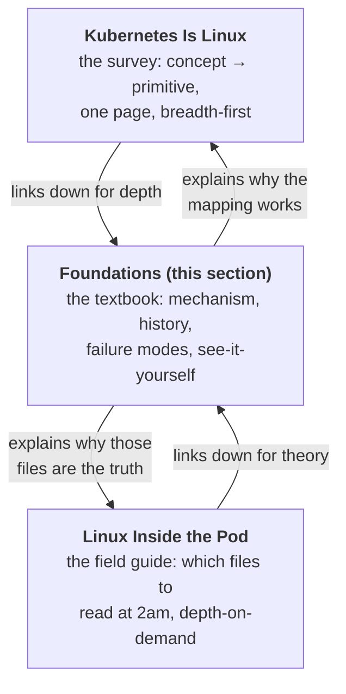

Here is the thesis of this entire section in one sentence: **Kubernetes is a control plane wearing a fifty-year-old operating system.** Every abstraction you touch through YAML — pods, limits, Services, probes, volumes, logs — bottoms out in a Linux primitive that predates Kubernetes by decades and will outlive whatever replaces it. A pod is namespaces. A limit is a cgroup file. A ClusterIP is a NAT rule. `kubectl logs` is a process reading a pipe. When something breaks at 2am, the question that decides whether you flail or diagnose is almost never "what does Kubernetes do?" — it's **"which layer owns this symptom?"** Kubernetes decides, the kubelet translates, the kernel enforces; and the kernel's half of that bargain is what this section teaches.

You don't operate the cluster — someone else patches the nodes, runs the CNI, sizes conntrack tables. But you own the applications, and **the kernel does not know the difference.** It delivers SIGTERM to your PID 1 whether or not your entrypoint script forwards it. It freezes your threads mid-request when the CFS quota runs out whether or not your dashboard shows "CPU idle." It fills a 64 KB pipe buffer and blocks your writes whether or not you think of stdout as "just logging." This section exists so that when those things happen, they are not mysteries — they are mechanisms you have already seen with your own eyes.

## How this relates to the pages you may already know

Two existing pages orbit the same idea, and it's worth being precise about the division of labor:

- [Kubernetes Is Linux](/troubleshooting/kubernetes-is-linux/) is the **survey**: one page mapping every Kubernetes concept to the kernel primitive that implements it. Namespaces, cgroups, overlayfs, netfilter, capabilities — each gets a section and a Rosetta table row. Read it first if you haven't; everything here assumes its vocabulary.
- [Linux Inside the Pod](/troubleshooting/linux-inside-the-pod/) is the **field guide**: which `/proc` and cgroup files to read once you're exec'd into a broken container, and how to interpret them on a toolless image at 2am.

This section is **the textbook behind both.** Where the survey spends one paragraph on PID 1, [Processes, Signals, and PID 1](/foundations/processes-and-signals/) spends an article: the fork/exec mechanics, why the kernel treats init specially, what a zombie actually is, and why a D-state process cannot be killed by anyone. Where the field guide tells you to read `cpu.stat`, [CPU Scheduling and the CFS](/foundations/cpu-scheduling-and-cfs/) explains the scheduler algorithm that makes those numbers mean what they mean. Survey for the map, field guide for the emergency, foundations for the understanding that makes both feel obvious.

## The twenty articles

The section reads front-to-back as a course, but every article stands alone. Here is what question each one answers and when you should reach for it.

**[Processes, Signals, and PID 1](/foundations/processes-and-signals/)** answers: what *is* a process, and why does mine ignore SIGTERM? The fork/exec model, parents and orphans, zombies and reaping, why PID 1 gets special treatment from the kernel — and therefore why your app, which *is* PID 1 in its container, inherits both the privileges and the obligations of init. This is the article behind every [graceful shutdown](/workloads/graceful-shutdown/) problem, every exit code 137 ambiguity, and every pod [stuck terminating](/troubleshooting/stuck-terminating/) on a dead NFS mount. Read it before you write another ENTRYPOINT line.

**[stdin, stdout, stderr, and File Descriptors](/foundations/stdio-and-file-descriptors/)** answers: where do my logs actually go, and why did they vanish? File descriptors as the universal handle, the three standard streams as a contract, pipe buffers and the blocking writes they cause, line-versus-block buffering (the reason Python logs "disappear"), and the full plumbing from your `printf` to `kubectl logs`. **stdout is the logging API of Kubernetes**, and this article is what that sentence means mechanically. Read it when logs lag, when you hit "too many open files," or before designing anything that writes to a stream.

**[Namespaces: The Different View](/foundations/namespaces/)** answers: how does one kernel show every pod a different machine? The syscalls (`clone`, `unshare`, `setns`), namespace lifetimes and why the pause container exists, the per-namespace quirks that generate real bugs — and, just as important, what namespaces *don't* isolate, which is the honest boundary of container security and the reason [pod security](/workloads/pod-security/) and sandboxed runtimes exist.

**[cgroups: The Budget](/foundations/cgroups/)** answers: what do requests and limits actually *do*? The v2 hierarchy as a filesystem, the kubepods.slice tree that encodes your QoS class, memory accounting (why "90% memory used" is often page cache), the OOM killer's arithmetic, and where `kubectl top` numbers really come from. The companion to [Resources & QoS](/workloads/resources-and-qos/) and the theory under every [OOMKilled](/troubleshooting/oomkilled/) incident.

**[Virtual Memory and the Page Cache](/foundations/virtual-memory/)** answers: what *is* memory usage? Virtual address spaces, page faults, and the metric zoo — VSZ vs RSS vs PSS vs working set — plus the page cache, mmap, and the no-swap world of Kubernetes. Where cgroups is about the *budget*, this is about the thing being budgeted; read it when `kubectl top`, your heap dump, and the OOM killer all disagree about how much memory you use.

**[CPU Scheduling and the CFS](/foundations/cpu-scheduling-and-cfs/)** answers: why is my app throttled while the node sits idle? Runqueues, vruntime, weights versus quotas — the difference between `requests.cpu` (a weight) and `limits.cpu` (a hard 100ms-window budget), and the classic pathology where a multi-threaded app burns its whole quota in a burst and freezes. If [It's Slow](/troubleshooting/its-slow/) is your symptom page, this is your mechanism page.

**[Linux Networking: Interfaces, Routes, and veth](/foundations/linux-networking/)** answers: what is pod networking made of? A packet's journey through a host, veth pairs as *the* container primitive, bridges, routes, and overlays — and how the same three primitives arranged three ways produce every CNI you've met. The prerequisite for the [networking model](/networking/networking-model/) and for [debugging network issues](/networking/debugging-network/) with understanding rather than incantation.

**[TCP: What a Connection Actually Is](/foundations/tcp-connections/)** answers: what is actually true when `ss` says ESTABLISHED? The 4-tuple, the handshake, backpressure as a physical fact of buffers, TIME_WAIT and CLOSE_WAIT as diagnostic signatures, and why idle connections die silently inside NAT — the kernel-level story under [long-lived connections](/networking/long-lived-connections/) and half of [service unreachable](/troubleshooting/service-unreachable/).

**[Firewalls: netfilter, iptables, and Beyond](/foundations/firewalls-and-netfilter/)** answers: what machinery evaluates every packet entering or leaving a pod? The five hooks, tables and chains, conntrack as the state engine, and how kube-proxy and NetworkPolicy are compiled onto it. It complements the [kube-proxy chain walk](/routing/kube-proxy-and-the-dataplane/) — that page walks Kubernetes' rules; this one teaches the engine those rules run on.

**[DNS Resolution on Linux: The Client Side](/foundations/dns-resolution/)** answers: why did that lookup take five seconds — or fail only in Alpine? The resolver is a library inside your process, not a daemon, and this article walks its whole decision tree: nsswitch, resolv.conf, the `ndots:5` search-path walk that turns `db` into five queries, glibc vs musl, and the UDP-drop timeout pathology. The client-side companion to the [CoreDNS deep dive](/routing/coredns-deep-dive/) and [DNS failures](/troubleshooting/dns-failures/).

**[TLS: Handshakes, Certificates, and mTLS](/foundations/tls/)** answers: what actually happens before the padlock? Asymmetric crypto in practice, certificate chains and trust stores, the TLS 1.3 handshake, SNI and ALPN, and the taxonomy of verification failures — mapped to where TLS lives in Kubernetes, from API server to webhook to ingress termination. The theory under [TLS and corporate CAs](/networking/tls-and-corporate-cas/).

**[SSH: Keys, Tunnels, and Why kubectl exec Isn't SSH](/foundations/ssh/)** answers: what does SSH actually do, and why doesn't Kubernetes use it? The protocol in layers, keys and tunnels and bastions — and the sharp contrast with [how kubectl works](/kubectl/how-kubectl-works/): `kubectl exec` is API-server-mediated, RBAC-audited, and implemented with `setns`, which is why pods don't (and shouldn't) run sshd.

**[Hashing: Digests, Integrity, and Content Addressing](/foundations/hashing/)** answers: why is `sha256:` all over my cluster? Content addressing as the big idea — image digests versus mutable tags, layer IDs, git commits, the pod-template-hash label — plus why password hashing is a different discipline entirely. The crypto floor under [supply chain security](/operations/supply-chain-security/).

**[Capabilities, seccomp, and LSMs: The Handcuffs](/foundations/security-primitives/)** answers: what does `securityContext` actually switch off? Root's power shattered into capability flags, seccomp's syscall allowlists, AppArmor and SELinux, and how the layers compose into defense in depth — with [Pod Security Standards](/workloads/pod-security/) mapped requirement-by-requirement to the kernel primitive each one turns on.

**[Storage: Block Devices, Filesystems, Mounts, and Encryption](/foundations/storage-and-filesystems/)** answers: what happens between `write()` and a platter? The stack from block device to VFS, overlayfs and tmpfs and NFS as they matter to pods, bind mounts (how ConfigMaps *appear* in your container, and why subPath mounts never update), the page cache, fsync, and encryption layers. The theory under [PVs and PVCs](/stateful/storage-pv-pvc/) and [volume failures](/troubleshooting/volume-failures/).

**[Linkers, libc, and ELF: Why Your Binary Won't Run](/foundations/linkers-libc-and-elf/)** answers: why does a binary that works in ubuntu die in alpine or distroless with "no such file or directory" — when the file is right there? ELF interpreters, dynamic linking, glibc vs musl as ABIs, static linking and `FROM scratch`, and the exec-format-error of a wrong-architecture image. The article behind a whole class of image-building pain.

**[Time: Clocks, Skew, and Why Distributed Systems Care](/foundations/time/)** answers: which clock, whose clock, and how wrong? Wall versus monotonic time, NTP slewing versus stepping, the fact that containers share the node's clocks — and the Kubernetes faces of skew: cert validity, token expiry, lease elections, CronJob schedules, and log correlation across nodes.

**[eBPF: Programs Inside the Kernel](/foundations/ebpf/)** answers: what is this thing my CNI, profiler, and mesh all quietly run on? Sandboxed programs, the verifier, maps, and hook points — why Cilium-style dataplanes replaced iptables chain walks with hash lookups, and where you meet eBPF even if you never write a line of it.

**[systemd and the Node: What Runs Under the Kubelet](/foundations/systemd-and-the-node/)** answers: when kubectl is dead, what's left? Units, slices, and the journal; the kubelet as a systemd service; how containers land in `.scope` cgroups under `kubepods.slice`; the node's boot sequence; and the `journalctl`/`crictl` moves that debug a node from below — or tell you exactly what to ask the platform team for.

Two companion deep dives live outside this section, where their siblings are: **[HTTP: Keep-Alive, HTTP/2, and Why gRPC Breaks Load Balancing](/networking/http/)** (under Networking — the application protocol on top of [TCP](/foundations/tcp-connections/), and the reason your gRPC service only uses one pod) and **[API Machinery: Watches, Informers, and Leader Election](/controllers/api-machinery/)** (under Controllers — resourceVersion, watches, informer caches, and leader election: the machinery that makes [reconciliation](/controllers/reconciliation/) work).

## Which page do I need?

Keyed by the symptom or the itch, because that's how you'll actually arrive here:

| You're seeing / wondering | Go read |
|---|---|
| My app ignores SIGTERM; pods take 30s to die | [processes-and-signals](/foundations/processes-and-signals/), then [graceful shutdown](/workloads/graceful-shutdown/) |
| Exit code 137 — OOM or kill? | [processes-and-signals](/foundations/processes-and-signals/) + [OOMKilled](/troubleshooting/oomkilled/) |
| Pod stuck Terminating forever | [processes-and-signals](/foundations/processes-and-signals/) (D-state), [stuck-terminating](/troubleshooting/stuck-terminating/) |
| Logs missing, delayed, or interleaved wrong | [stdio-and-file-descriptors](/foundations/stdio-and-file-descriptors/) |
| "Too many open files" | [stdio-and-file-descriptors](/foundations/stdio-and-file-descriptors/) |
| Two pods both bind :8080 — how? | [namespaces](/foundations/namespaces/) |
| What's the pause container for? | [namespaces](/foundations/namespaces/) |
| Pod "uses 90% memory" but the app's heap is small | [cgroups](/foundations/cgroups/) |
| Where do `kubectl top` numbers come from? | [cgroups](/foundations/cgroups/) |
| Throttled but CPU looks idle | [cpu-scheduling-and-cfs](/foundations/cpu-scheduling-and-cfs/), then [its-slow](/troubleshooting/its-slow/) |
| Should I set CPU limits at all? | [cpu-scheduling-and-cfs](/foundations/cpu-scheduling-and-cfs/) |
| What is a veth / bridge / overlay, really? | [linux-networking](/foundations/linux-networking/) |
| Idle connections die silently; resets during rollouts | [tcp-connections](/foundations/tcp-connections/), [long-lived-connections](/networking/long-lived-connections/) |
| Piles of CLOSE_WAIT in `ss` | [tcp-connections](/foundations/tcp-connections/) |
| How does NetworkPolicy actually block a packet? | [firewalls-and-netfilter](/foundations/firewalls-and-netfilter/) |
| Is `kubectl exec` SSH? Should my pod run sshd? | [ssh](/foundations/ssh/) |
| Tags vs digests; signing images | [hashing](/foundations/hashing/) |
| ConfigMap updated but the file in the pod didn't | [storage-and-filesystems](/foundations/storage-and-filesystems/) |
| `fsync` slow, disk full, inode exhaustion | [storage-and-filesystems](/foundations/storage-and-filesystems/) |
| `kubectl top`, heap dump, and OOM killer disagree | [virtual-memory](/foundations/virtual-memory/) |
| DNS slow, or flaky only in Alpine images | [dns-resolution](/foundations/dns-resolution/) |
| "certificate verify failed" / "unknown authority" | [tls](/foundations/tls/), then [tls-and-corporate-cas](/networking/tls-and-corporate-cas/) |
| What does `drop: ALL` actually drop? | [security-primitives](/foundations/security-primitives/) |
| Binary won't start in distroless: "no such file or directory" | [linkers-libc-and-elf](/foundations/linkers-libc-and-elf/) |
| Tokens rejected, certs "not yet valid", CronJob fired oddly | [time](/foundations/time/) |
| What is my CNI actually made of? | [ebpf](/foundations/ebpf/), [firewalls-and-netfilter](/foundations/firewalls-and-netfilter/) |
| Node NotReady and kubectl can't tell me why | [systemd-and-the-node](/foundations/systemd-and-the-node/) |
| gRPC traffic all lands on one pod | [http](/networking/http/) |
| "the object has been modified; please apply your changes..." | [api-machinery](/controllers/api-machinery/) |

## How to read this section

Every article follows the same contract. **Mechanism first** — what the kernel actually does, with the syscall and file names, citing [man7.org](https://man7.org/linux/man-pages/) and [docs.kernel.org](https://docs.kernel.org/) so you can go one level deeper still. **History where it illuminates** — some designs only make sense as fossils, and knowing that saves you from inventing false rationales. **Failure modes** — each primitive's characteristic pathology, tied to the Kubernetes symptom you've actually seen. And **see-it-yourself commands** throughout: things you can run inside a pod, on any Linux box, or via kubectl, because a primitive you've poked with your own hands is one you'll recognize under pressure.

If you read nothing else, read articles 2 through 5 — processes, file descriptors, namespaces, cgroups. Those four cover the anatomy of the thing you ship every day. **A container is a process; everything else is arrangements.** The rest of the section is the arrangements.
