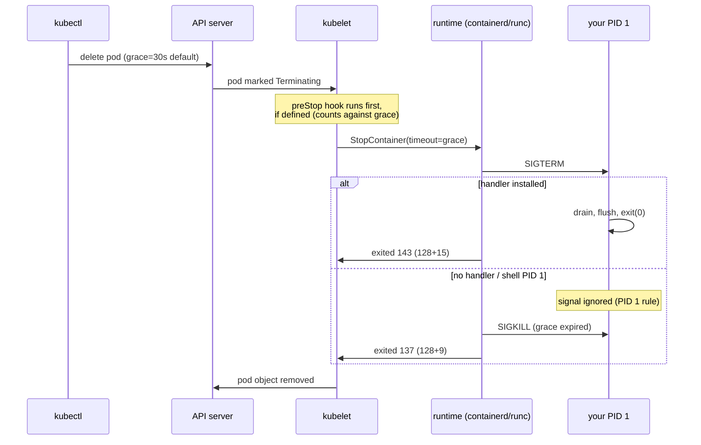
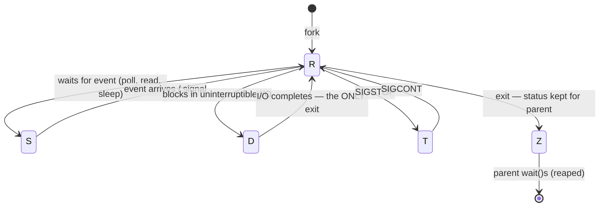

Strip away the runtime, the image, the YAML, and what Kubernetes actually manages is the oldest object in Unix: the process. **Every container is one process the kernel started, and everything Kubernetes does to a container — start it, probe it, stop it, kill it — is done in the vocabulary of processes and signals.** That vocabulary is fifty years old, it has sharp edges that predate containers by decades, and Kubernetes inherited every one of them. The pod that takes exactly 30 seconds to die, the exit code 137 that might be an OOM kill or might not, the `defunct` zombies piling up in `ps`, the pod [stuck terminating](/troubleshooting/stuck-terminating/) that even the kubelet can't kill — none of these are Kubernetes behaviors. They are Unix behaviors, and this article is the Unix you need.

The survey established the frame: [a container is a process wearing namespaces and a cgroup](/troubleshooting/kubernetes-is-linux/). This article zooms into the process itself — what it is made of, how it is born and how it dies, and why the kernel treats the process your Dockerfile starts differently from every other process on the machine.

## What a process actually is

To the kernel, a process is a `task_struct` — a big C structure in kernel memory, one per thread, holding everything the kernel needs to run and account for it. Four of its members explain most of what you'll ever debug:

| Part of the process | What it holds | Where you see it from userspace |
|---|---|---|
| the memory descriptor (`mm`) | page tables, heap, stacks, mapped files | `/proc/<pid>/maps`, `VmRSS` in `/proc/<pid>/status` |
| the file descriptor table | numbered handles to files, pipes, sockets | `/proc/<pid>/fd/` — the subject of [the next article](/foundations/stdio-and-file-descriptors/) |
| signal state | handler table, blocked mask, pending set | `SigCgt`/`SigBlk`/`SigPnd` in `/proc/<pid>/status` |
| credentials & identity | PID, PPID, uids/gids, capabilities | `/proc/<pid>/status`, [credentials(7)](https://man7.org/linux/man-pages/man7/credentials.7.html) |

Two consequences worth engraving. First, **threads are just processes that share.** A "multi-threaded process" is a group of `task_struct`s sharing one `mm` and one fd table; that's why `ls /proc/1/task | wc -l` counts your threads, and why [CPU scheduling](/foundations/cpu-scheduling-and-cfs/) treats each thread as its own schedulable unit — a fact that becomes very expensive under CFS quotas. Second, **`/proc` is the process, exported as files.** Everything the [field guide](/troubleshooting/linux-inside-the-pod/) reads at 2am — `cmdline`, `environ`, `status`, `fd` — is a live view into the `task_struct` and its attachments, documented in [proc(5)](https://man7.org/linux/man-pages/man5/proc.5.html).

See the anatomy yourself, from inside any pod:

```bash
grep -E 'Name|State|Pid|PPid|Threads|SigCgt' /proc/1/status
ls /proc/1/task            # one directory per thread
cat /proc/1/comm           # the short name the kernel uses
```

## fork and exec: how every container starts

Unix creates processes with a two-step that looks bizarre until you see what it buys. **`fork()` duplicates the calling process** — the child is a near-identical copy, same memory image (copy-on-write), same open file descriptors, same signal dispositions ([fork(2)](https://man7.org/linux/man-pages/man2/fork.2.html)). **`exec()` then replaces the program** — the process keeps its PID and its fd table but swaps in a new executable, fresh stack and heap, and resets caught signals to their defaults ([execve(2)](https://man7.org/linux/man-pages/man2/execve.2.html)). Creation and identity are decoupled: the gap *between* fork and exec is where Unix does its plumbing — redirect stdio, drop privileges, change directories — and it's exactly where a container runtime does its work.

Because here is the load-bearing fact: **a container runtime is a program that forks, arranges, and execs.** When the kubelet asks for your container, runc forks a child; the child unshares its [namespaces](/foundations/namespaces/), enters its [cgroup](/foundations/cgroups/), pivots into the image root, sets uids and capabilities, wires fds 0/1/2 to the runtime's pipes — and then `exec`s your ENTRYPOINT. Nothing container-shaped happens at exec time. Your app is the same process the runtime forked, wearing everything that was arranged in the gap. That's why `exec` in a shell script matters so much later in this article: it's the same syscall, with the same "replace me, keep my PID" semantics.

The parent/child link persists after exec, and it is not decorative. Every process records its parent (`PPid` in `/proc/<pid>/status`), and **when a child dies, the parent is expected to collect the body.**

## Death, zombies, and reaping

A process dies in two phases, and the gap between them is where zombies live. Phase one: the process exits — voluntarily via `exit()`, or involuntarily by signal. The kernel frees the big stuff (memory, fds) immediately, but keeps the `task_struct` around holding the exit status. Phase two: the parent calls `wait()`/`waitpid()` to read that status ([wait(2)](https://man7.org/linux/man-pages/man2/wait.2.html)), and *only then* is the process table entry freed. **Between exit and wait, the process is a zombie**: dead, consuming no memory worth naming, but occupying a PID and showing up in `ps` as `Z` / `<defunct>`.

A zombie is therefore not a stuck process — it cannot be killed, because it is already dead; `kill -9` on a zombie is a no-op by definition. **A zombie is evidence of a parent that isn't doing its job.** One or two transient zombies are normal (the parent will get to them). Hundreds of accumulating zombies mean the parent never calls `wait()`, and eventually the PID space or the pids cgroup limit fills and `fork` starts failing — "resource temporarily unavailable" with plenty of memory free.

And what if the parent dies first? The child becomes an **orphan**, and the kernel re-parents it to init — PID 1 — whose sacred duty is to `wait()` for anything re-parented onto it. This "orphan adoption" is why zombies don't accumulate on a normal Linux box: systemd reaps everything eventually. Hold that thought; containers are about to break it.

## Why PID 1 is special

Inside its [PID namespace](/foundations/namespaces/), your container's first process is PID 1, and PID 1 is not a normal citizen. The kernel gives init two special properties, both of which transfer to your app the moment it lands in that slot:

1. **Default signal dispositions don't apply.** For a normal process, SIGTERM with no handler installed means death — the kernel's default action. For PID 1, the kernel refuses to deliver any signal for which init has not explicitly installed a handler (see the "signal" notes in [pid_namespaces(7)](https://man7.org/linux/man-pages/man7/pid_namespaces.7.html)). The logic is ancient: init must never die by accident. The consequence in a container is anything but academic: **if your app doesn't install a SIGTERM handler, SIGTERM to your container does exactly nothing.** Not "kills it uncleanly" — *nothing*. The kubelet sends SIGTERM, your app ignores it by kernel fiat, the grace period expires, and SIGKILL — which PID 1 in a namespace *can* be killed by, but only when sent from outside the namespace — finishes the job. Every pod that "takes exactly 30 seconds to stop" is this sentence. The [field guide's PID 1 surprise](/troubleshooting/linux-inside-the-pod/) — `kill -9 1` from inside doing nothing — is the same rule from the other side.
2. **Orphan adoption stops at the namespace boundary.** Orphans inside a PID namespace are re-parented to that namespace's PID 1 — your app — not to the node's systemd. If your app forks workers, and a worker forks a helper, and the worker dies: the helper is now *your app's* child, and when it exits, *your app* must `wait()` for it. Most application code has never heard of this obligation. That is where container zombies come from.

**In a container, your app is init whether it wants to be or not.** Signal handling and corpse collection are now application responsibilities.

### tini, dumb-init, and the shell-form trap

The ecosystem's fix is to put a tiny real init in the PID 1 slot: `tini` or `dumb-init` as ENTRYPOINT (or Docker's `--init` flag; Kubernetes has no direct equivalent, so it goes in the image). These do exactly two things — forward every signal to your app (now a child, with normal signal semantics) and `wait()` for everything, reaping zombies. Twenty kilobytes of insurance.

The opposite move — the classic trap — is the **shell-form ENTRYPOINT**:

```text
ENTRYPOINT java -jar /app/app.jar        # shell form: PID 1 is /bin/sh -c
ENTRYPOINT ["java","-jar","/app/app.jar"] # exec form: PID 1 is java
```

Shell form makes PID 1 a shell running your app as a child. `sh` installs no SIGTERM forwarding: the kubelet signals the shell, the shell (as PID 1, per the rule above) ignores it, your app never hears anything, and SIGKILL arrives at grace-period end — killing the process group without a single line of your shutdown code running. **The shell eats the signal.** If you must use a wrapper script, end it with `exec java ...` — `exec` replaces the shell with your app *in the same PID 1 slot*, and signal delivery is direct again. This single Dockerfile detail is behind a startling fraction of [graceful shutdown](/workloads/graceful-shutdown/) failures.

See which world you're in, from inside the pod:

```console
$ tr '\0' ' ' < /proc/1/cmdline; echo
/bin/sh -c java -jar /app/app.jar        # trap: shell is PID 1
$ grep SigCgt /proc/1/status
SigCgt: 0000000000000000                  # and it catches nothing: SIGTERM will be ignored
```

A nonzero `SigCgt` mask with bit 15 set (SIGTERM is signal 15) means someone installed a handler. All zeros on PID 1 means your grace period is a 30-second countdown to SIGKILL.

## Signals: the vocabulary of process control

A signal is the kernel's one-word telegram: an asynchronous notification, identified by number, that either runs a handler you installed or triggers a default action ([signal(7)](https://man7.org/linux/man-pages/man7/signal.7.html) is the canonical table). The ones that matter in Kubernetes:

| Signal | Number | Catchable? | Default | Kubernetes meaning |
|---|---|---|---|---|
| SIGTERM | 15 | yes | terminate | "please shut down" — pod deletion, drain, eviction |
| SIGKILL | 9 | **no** | terminate | grace period expired; no cleanup possible |
| SIGSTOP | 19 | **no** | freeze (T state) | rare in k8s; `kubectl` has no pause — but debuggers use it |
| SIGQUIT | 3 | yes | terminate + core | JVM thread dump to stdout; nginx graceful stop |
| SIGINT | 2 | yes | terminate | Ctrl-C in `kubectl exec -it`; some runtimes' stop signal |
| SIGHUP | 1 | yes | terminate | "config reload" by convention (nginx, prometheus) |
| SIGCHLD | 17 | yes | ignore | "a child died" — the reaping trigger from earlier |

The structural fact in that table: **SIGKILL and SIGSTOP cannot be caught, blocked, or ignored.** Every other signal is a request; those two are decrees — the kernel acts without the target's participation. That's the entire difference between graceful and forced shutdown: SIGTERM runs your handler (flush buffers, finish requests, deregister); SIGKILL simply deletes the process mid-instruction. Locks stay locked, sockets die without FINs (your peers discover this per [TCP teardown rules](/foundations/tcp-connections/)), half-written files stay half-written.

There is one thing even SIGKILL cannot do, and it's the most important caveat in this article: **SIGKILL only takes effect when the process next crosses the kernel boundary in a killable state.** A process blocked in uninterruptible I/O does not respond even to SIGKILL — see the D-state section below.

## How `kubectl delete pod` becomes signals

Now assemble the pipeline. Kubernetes never "stops a container" — it asks the kubelet, which asks the runtime, which sends signals, and every step is the Unix mechanics above:



Details that bite: the grace period is `terminationGracePeriodSeconds` (default 30), a preStop hook runs *before* SIGTERM and spends the same budget, and `--grace-period=0 --force` merely skips the courtesy — the API forgets the pod while the kubelet still delivers SIGKILL behind the scenes. The full application-side choreography — readiness, endpoints, draining order — is [Graceful Shutdown](/workloads/graceful-shutdown/); the point here is that its foundation is three syscalls and a timer.

### Exit codes: reading the corpse

When a process dies, the kernel reports *how* to whoever waits — and the shell/runtime convention encodes signal deaths as **128 + signal number**. That convention is the decoder ring for `kubectl describe pod`:

| Exit code | Decodes as | Usual story |
|---|---|---|
| 0 | clean exit | normal completion |
| 1, 2, ... | app's own `exit(N)` | crash, config error — read the logs |
| 126 / 127 | not executable / not found | image or ENTRYPOINT bug, instant [CrashLoopBackOff](/troubleshooting/crashloopbackoff/) |
| 137 | 128 + 9 = SIGKILL | OOM kill **or** grace-period expiry — ambiguous! |
| 139 | 128 + 11 = SIGSEGV | segfault, native crash |
| 143 | 128 + 15 = SIGTERM | app honored SIGTERM — the *good* shutdown code |

**137 is ambiguous and the ambiguity matters.** The cgroup OOM killer and the runtime's grace-period enforcement both use SIGKILL, so exit 137 alone doesn't tell you whether you ran out of memory or out of patience. Disambiguate with the neighbors: `kubectl describe pod` showing `Reason: OOMKilled` (the kubelet read the kernel's OOM event), or a nonzero `oom_kill` counter in the cgroup's `memory.events` — the ground-truth file per [the field guide](/troubleshooting/linux-inside-the-pod/). If those are clean, your 137 is a shutdown that overstayed its grace period — a signal-handling bug, not a memory one. [OOMKilled](/troubleshooting/oomkilled/) handles the memory branch; this article's PID 1 sections handle the other.

Seeing 143 in `kubectl describe` after a rollout is not an error — it's your app confirming it heard SIGTERM and left politely. Alarming dashboards on exit 143 during deploys is alerting on success.

## Process states: R, S, D, Z, T

Every process is in exactly one scheduler state, surfaced as the letter in `ps` output and `State:` in `/proc/<pid>/status`:



**R (running/runnable)** — executing or queued for a CPU; lots of R with slow progress means CPU contention or [throttling](/foundations/cpu-scheduling-and-cfs/). **S (interruptible sleep)** — waiting for an event, wakeable by signals; a healthy server idles in S, and S is not a problem, ever. **T (stopped)** — frozen by SIGSTOP/debugger. **Z (zombie)** — dead, awaiting reap, immune to signals as covered above. And then there's D.

**D — uninterruptible sleep — is the state that breaks everyone's mental model of `kill -9`.** A D-state process is blocked inside the kernel, mid-syscall, typically waiting for I/O that the kernel promised will complete — a disk read, a page-in, or the classic: an NFS server that stopped answering with the mount in `hard` mode. Signals are not delivered in D state — *including SIGKILL*. The kill is queued, pending, and takes effect only if the I/O ever completes. If the NFS server never comes back, the process is unkillable by any userspace actor: not you, not the runtime, not the kubelet.

Follow that upward and you get one of Kubernetes' most confusing symptoms: **the pod stuck Terminating that no `--force` really kills.** SIGTERM: not delivered. Grace expires; SIGKILL: queued, not delivered. The runtime can't report the container dead because the process still exists; the kubelet retries forever; `--force` deletes the *API object* while the process haunts the node until the volume recovers or the node reboots. When [Stuck Terminating](/troubleshooting/stuck-terminating/) tells you to suspect volumes, this is the mechanism — and the storage-side story of NFS hangs lives in [the storage article](/foundations/storage-and-filesystems/).

See it yourself — safely, with a harmless D-state impersonator on any Linux box (`vfork` parks the parent in D until the child execs):

```console
$ sh -c 'cat /proc/self/status | grep State' &   # normal: R or S
$ grep -c ' D ' <(ps ax -o pid,stat,cmd) 2>/dev/null  # count D-state on a box with procps
```

and the real diagnostic, inside a pod with a suspect volume:

```bash
grep State /proc/1/status          # "State: D (disk sleep)" = this article, storage section
cat /proc/1/stack 2>/dev/null      # where in the kernel it's stuck (needs privilege)
cat /proc/1/wchan; echo            # the kernel function it's waiting in — often nfs_*
```

One more D-state fact for later: **load average counts D-state processes**, which is why a node with a dead NFS mount shows a load of 80 with idle CPUs — a story continued in [the CFS article](/foundations/cpu-scheduling-and-cfs/).

## Zombies in containers, and the shareProcessNamespace fix

Back to the reaping problem, now with all the pieces on the table. Your app is PID 1; your app forks children (or your entrypoint script did); grandchildren get orphaned onto your app; your app never calls `wait()`; zombies accumulate:

```console
$ ps ax | grep -c defunct     # or, toolless:
$ grep -l '^State:.Z' /proc/[0-9]*/status | wc -l
14
```

Three fixes, in order of preference. **Use a real init**: tini as exec-form ENTRYPOINT — reaping is its job. **Make the app reap**: handle SIGCHLD, or on Linux ignore it explicitly (`signal(SIGCHLD, SIG_IGN)` makes the kernel auto-reap — a POSIX-blessed cheat). Or **`shareProcessNamespace: true`** in the pod spec: as the [survey explains](/troubleshooting/kubernetes-is-linux/), this merges all the pod's containers into one PID namespace with the *pause* container as PID 1 — and pause's whole retirement plan is calling `wait()` in a loop. Your app stops being init, zombies get reaped by pause, and as a bonus your sidecars can see and signal your processes. The cost: process visibility across containers and a changed signal story (your app is no longer PID 1, so plain SIGTERM defaults apply again — which, for most apps, is actually the *simpler* world).

## The mapping table

The whole article as a translation between what you observe in Kubernetes and what the kernel is doing:

| You see | The kubelet / runtime did | The kernel mechanism |
|---|---|---|
| pod stops in <1s on delete | SIGTERM delivered, handler ran | signal handler + `exit()`; code 143 |
| pod takes exactly `grace` to stop | SIGTERM ignored, SIGKILL after timer | PID 1 default-disposition rule |
| exit 137 + `OOMKilled` reason | nothing — kernel acted alone | cgroup OOM killer, SIGKILL |
| exit 137, no OOM evidence | grace expired, runtime sent SIGKILL | uncatchable signal 9 |
| `<defunct>` processes piling up | nothing — it can't help | unreaped children; PID 1 never `wait()`s |
| pod stuck Terminating, `--force` useless | SIGKILL sent and queued | D-state: signal undeliverable mid-I/O |
| `kill -9 1` inside pod does nothing | n/a — you did this | in-namespace signals to init discarded |
| CrashLoopBackOff, exit 127 | started container; exec failed | `execve` returned ENOENT |

If a row in that table used to be folklore — "pods just take 30 seconds sometimes" — it should now be a mechanism with a fix attached. The next article stays inside the process and follows three particular file descriptors: [stdin, stdout, and stderr](/foundations/stdio-and-file-descriptors/), which turn out to be the entire logging architecture of Kubernetes. For the primitives themselves, keep three man pages within reach: [signal(7)](https://man7.org/linux/man-pages/man7/signal.7.html), [wait(2)](https://man7.org/linux/man-pages/man2/wait.2.html), and [pid_namespaces(7)](https://man7.org/linux/man-pages/man7/pid_namespaces.7.html) — between them, they are this article in reference form.
