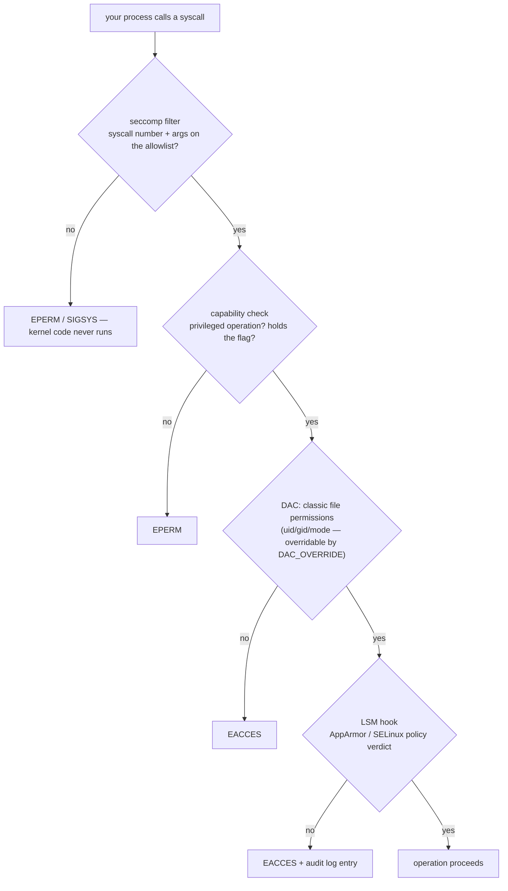

Namespaces give your process a different view; cgroups give it a budget. Neither takes away its *powers*. A process inside the most tightly namespaced, tightly metered pod could still — if it ran as unrestricted root — load kernel modules, forge raw packets, ptrace its neighbors, and remount its own filesystem read-write. The third leg of containment is subtraction: **the handcuffs are the kernel mechanisms that remove specific powers from a process, permanently, before your code runs a single instruction.** [Kubernetes Is Linux](/troubleshooting/kubernetes-is-linux/) gave them one table row each; this article is the textbook behind that row — capabilities, `no_new_privs`, seccomp, and the Linux Security Modules, and how `securityContext` YAML compiles down to each.

The theme to hold onto: every one of these is a **one-way door**. Capabilities can be dropped but not regained, `no_new_privs` can be set but never cleared, a seccomp filter can only be tightened by stacking another on top. The runtime walks through all the doors *before* `exec`ing your app — which is why a compromised app can't simply undo its own restrictions, and why the whole scheme works at all.

## Root, shattered: capabilities

Classical Unix had a binary privilege model: uid 0 passes every check, everyone else takes their chances with file permissions. That made every setuid binary and every root daemon a total-compromise risk — `ping` needed raw sockets, so `ping` ran as full root, so a bug in `ping` owned the machine.

[Capabilities](https://man7.org/linux/man-pages/man7/capabilities.7.html) (kernel 2.2, 1999) shattered root into independent flags — 41 of them at current count — each guarding one slice of the old monolith: `CAP_NET_BIND_SERVICE` for ports below 1024, `CAP_CHOWN` for changing file ownership, `CAP_KILL` for [signaling](/foundations/processes-and-signals/) arbitrary processes, `CAP_SYS_TIME` for setting the clock ([which is why you can't change time in a container](/foundations/time/)). **"Root" on modern Linux is not a uid; it's uid 0 *plus* a full capability set — and a container gives you the uid while confiscating most of the set.** That's why `whoami` says root inside a pod and `chroot`, `mount`, and `date -s` still fail with `Operation not permitted`: `EPERM` is almost always the sound of a missing capability, not a missing uid.

### Five sets per thread, not one

Capabilities are per-*thread* state (part of the `task_struct` from [the process model](/foundations/processes-and-signals/)), and each thread carries five separate bitmasks. The distinctions matter because they answer real questions — "why did my capability vanish after `su`," "why can't a file capability re-grant what the runtime dropped":

| Set | What it means | The question it answers |
|---|---|---|
| **Effective** | the caps checked when you actually do something | "can I bind port 80 *right now*?" |
| **Permitted** | caps the thread may raise into effective at will | "what could I re-enable if I asked?" |
| **Inheritable** | caps preserved across `execve` *if* the new binary's file caps also list them | "what survives into programs I run?" (almost nothing, by design) |
| **Bounding** | the hard ceiling — nothing outside it can ever be acquired, by any means | "what did the runtime make impossible forever?" |
| **Ambient** | caps that survive `execve` for non-root programs without file caps | the modern escape hatch for "capable but not root" services |

Two rules generate most of the observed behavior. First, **the bounding set is the actual handcuff**: `drop` in your `securityContext` removes capabilities from the bounding set, and once out, no setuid binary, no file capability, no syscall can bring them back for this process or any descendant. Second, on `execve` the new sets are computed from the old ones *and* the file's capabilities (binaries can carry their own capability grants, written with `setcap` and stored in an extended attribute — this is how modern distros ship `ping` without setuid). The full transformation formula is in [capabilities(7)](https://man7.org/linux/man-pages/man7/capabilities.7.html); the practical consequence is that switching to a non-root uid clears effective and permitted unless ambient capabilities carry them across — which is why "run as uid 1000 but keep `NET_BIND_SERVICE`" requires the runtime to set ambient caps, and why older setups just used port 8080 instead.

### What containers actually get

A default, unconfigured container does not start with all 41 flags. The runtime hands it a conventional subset — the mask you'll meet as `CapBnd: 00000000a80425fb` in `/proc/self/status` (the [field guide](/troubleshooting/linux-inside-the-pod/) shows the read; decode it with `capsh --decode`):

`CHOWN`, `DAC_OVERRIDE`, `FOWNER`, `FSETID`, `KILL`, `SETGID`, `SETUID`, `SETPCAP`, `NET_BIND_SERVICE`, `NET_RAW`, `SYS_CHROOT`, `MKNOD`, `AUDIT_WRITE`, `SETFCAP`

Fourteen flags, chosen circa 2013 so that typical Docker images — package managers, entrypoint scripts that `chown` volumes and `su` to app users, servers binding port 80 — work without thought. Read it critically and it's generous: `DAC_OVERRIDE` bypasses all file permission checks; `NET_RAW` allows crafting arbitrary packets — inside a pod network that means ARP and ICMP spoofing potential, which is exactly why hardened runtimes and every hardening guide drop it first. **The default set is a compatibility artifact, not a security judgment** — and the fix is one stanza:

```yaml
securityContext:
  capabilities:
    drop: ["ALL"]
```

**Dropping ALL usually breaks nothing, and that fact is worth internalizing.** A well-behaved server binds a high port, owns its own files, never changes uids, never crafts raw packets — it exercises zero capabilities from the moment it starts. What does break is legacy image *ceremony*: official images whose entrypoints `chown` data directories (needs `CHOWN`/`FOWNER`) or start as root and drop to an app user (needs `SETUID`/`SETGID`), and `ping` in images where it still relies on raw sockets. The remedies are modern unprivileged image variants, `runAsUser` instead of entrypoint `su`, and adding back precisely one flag when genuinely needed — `add: ["NET_BIND_SERVICE"]` is the only add the [restricted profile](/workloads/pod-security/) even permits.

At the dangerous end, a few flags are worth knowing by name because granting them quietly reinvents root. **`CAP_SYS_ADMIN` is the notorious catch-all — decades of "where do we put this check?" answered with "eh, SYS_ADMIN" — covering mounts, namespace administration, and dozens of unrelated operations; treat a request for it as a request for root.** `CAP_SYS_PTRACE` lets a process inspect and puppeteer other processes — legitimately wanted by [debug sidecars and profilers](/troubleshooting/debugging-toolbox/) that attach to your app, and precisely as dangerous as that sounds. `CAP_NET_ADMIN` reconfigures interfaces, routes, and firewalls (it's what CNI plugins use to build [the pod's plumbing](/foundations/linux-networking/)). `CAP_DAC_READ_SEARCH` reads every file on the system. When a vendor chart asks for one of these, the right response is "why" — and [the securing-pods checklist](/workloads/securing-pods-best-practices/) treats each add as an exception to justify.

## no_new_privs: the ratchet

Capabilities have a historical hole: even a fully de-capabilized process could run a *setuid binary* or a file-capability binary and come back stronger — that's what setuid is *for*. `no_new_privs` ([kernel docs](https://docs.kernel.org/userspace-api/no_new_privs.html)) is a one-bit process flag, set via [prctl(2)](https://man7.org/linux/man-pages/man2/prctl.2.html), that closes it: **once set, no `execve` can ever grant this process or its descendants more privilege — setuid bits are ignored, file capabilities are ignored, and the flag itself can never be cleared.** `sudo` and setuid `ping` still *run*; they just run with the caller's privileges and fail their privileged operation.

This is the entirety of `allowPrivilegeEscalation: false`. One bit, no performance cost, no compatibility cost for any normal application (containers rarely have working setuid binaries anyway — often the image has none, or `nosuid` mount options already apply). **It's the cheapest insurance in the whole `securityContext`, which is why the restricted profile simply mandates it.** It's also load-bearing for seccomp: the kernel refuses to let an unprivileged process install a seccomp filter *unless* `no_new_privs` is set — otherwise a malicious filter could subvert a setuid program by lying to it about its syscalls.

## seccomp: the syscall firewall

Capabilities gate *privileged operations*; seccomp gates the **syscall boundary itself**. A seccomp filter ([seccomp(2)](https://man7.org/linux/man-pages/man2/seccomp.2.html), [kernel filter docs](https://docs.kernel.org/userspace-api/seccomp_filter.html)) is a small classic-BPF program attached to the process; on every syscall, before any kernel logic runs, the filter inspects the syscall number and its register arguments and returns a verdict — allow, return an errno (`EPERM`), kill the thread, or notify a supervisor. Filters inherit across fork and exec, and stack: a child can add filters, never remove them. One clarification worth pinning, because the names invite confusion: **seccomp filters are *classic* BPF — a fixed, tiny, registers-only language — not [eBPF](/foundations/ebpf/)**; no maps, no helpers, and crucially no dereferencing of syscall pointer arguments (a filter can see that you called `openat`, and the flags, but not the *path*).

Kubernetes exposes three postures:

| `seccompProfile.type` | Meaning |
|---|---|
| `Unconfined` | no filter — all ~450 syscalls reachable (the historical k8s default) |
| `RuntimeDefault` | the container runtime's curated allowlist |
| `Localhost` | a custom JSON profile installed on the node — yours to author, node access required |

`RuntimeDefault` is the one that matters. The runtime's profile allows roughly 350 of the ~450 syscalls on x86-64 — everything ordinary applications use — and denies the exotic tail: `kexec_load`, `open_by_handle_at` (a famous container-escape vector), `keyctl`/`add_key` (the kernel keyring is [not namespaced](/foundations/namespaces/)), module loading, `reboot`, and namespace-creating calls like `unshare` unless the process also holds `CAP_SYS_ADMIN` — which is why `unshare -r` fails inside a normal pod, and why nested containers need special arrangements. Several profiles also removed the `io_uring` syscalls in 2023 after a run of kernel vulnerabilities — the allowlist is a living document tracking where kernel CVEs cluster.

**What breaks under `RuntimeDefault` in practice: almost nothing, and the exceptions are debugging tools, not applications.** `strace` needs `ptrace` (allowed in modern profiles on modern kernels, blocked in older ones — a classic source of "strace works on my machine, EPERM in the pod"), io_uring-based I/O engines need their syscalls back via a Localhost profile, and that's roughly the list. The asymmetry is the argument: near-zero compatibility cost against a real reduction in kernel attack surface — most kernel privilege-escalation exploits enter through syscalls no normal app calls. Check your own posture from inside any pod:

```console
$ grep -E 'Seccomp|NoNewPrivs' /proc/self/status
NoNewPrivs:     1
Seccomp:        2
Seccomp_filters:        1
```

`Seccomp: 2` means filter mode (0 = none, 1 = the ancient strict mode nobody uses); `NoNewPrivs: 1` means the ratchet is set.

## LSMs: the second opinion

The fourth layer is architectural rather than a single feature. **Linux Security Modules** are hook points wired through the kernel — several hundred of them, at every security-relevant operation — where a loaded policy engine gets a veto *after* the classic checks pass. LSMs implement *mandatory* access control: uid 0 passing the DAC check and holding the right capability can still be denied, because the policy, not the process's identity, has the last word. Two majors dominate, and **which one you're under is decided by your node's distro, not by you**:

| | AppArmor | SELinux |
|---|---|---|
| Model | **path-based**: profile per program, rules about file paths and operations | **label-based**: every process and object carries a label; policy says which label-pairs may interact |
| Typical nodes | Ubuntu, Debian, SUSE | RHEL, Fedora, Amazon Linux, Bottlerocket |
| Container integration | runtime applies a default profile (`cri-containerd.apparmor.d` and kin) denying mount, a few `/proc` and `/sys` writes | `container-selinux`: processes run as `container_t`, each container gets unique MCS category pair — container A's label can't touch container B's files even as root |
| The k8s field | `securityContext.appArmorProfile` (annotations before 1.30) | `securityContext.seLinuxOptions` |
| The classic surprise | profile denies mount inside otherwise-capable containers | **hostPath volumes**: `Permission denied` as root, because host files don't carry container-accessible labels |

The SELinux surprise deserves its paragraph because it generates real tickets: a pod mounts a hostPath, runs as root, capabilities look fine, and every read fails with `EACCES`. Nothing in `/proc/self/status` explains it — the denial happened in the LSM hook, visible only in the node's audit log (`avc: denied`). On ordinary volumes the runtime *relabels* content to match the container's label (the mechanism behind Docker's `:z`/`:Z` options and the k8s `seLinuxOptions`/fsGroup-adjacent machinery); hostPath is deliberately exempt because relabeling a host directory could break the host software that owns it. **When permissions look right and access still fails on a RHEL-family node, suspect the label, and ask whoever owns the node for the audit log** — as an application team you inherit the node's LSM policy the way you inherit its kernel, and [debugging across that boundary](/troubleshooting/debugging-toolbox/) is a conversation with your platform team.

The newest handcuff belongs to a different family: **user namespaces** map container-root to an unprivileged node uid, so that even a full breakout lands with no host privileges. That's a namespace, not an LSM — [the namespaces article](/foundations/namespaces/) covers the mapping mechanics and `hostUsers: false`; file it mentally next to these layers as the one that changes *who you are* rather than *what you may do*.

## How the layers compose

A single syscall from your process runs the whole gauntlet, outermost first:



(Conceptual order — the kernel interleaves DAC and capability checks per-operation — but the ranking holds: seccomp is the outermost gate, the LSM is the final veto.) **Defense in depth is not a slogan here; it's literally four independent subsystems that must all say yes**, maintained by different kernel communities, configured by different layers of your stack (runtime, kubelet, distro), failing in different error codes. An exploit that defeats one usually meets another — and a malicious image from a [compromised supply chain](/operations/supply-chain-security/) starts its life inside all four at once, which is why the handcuffs are your last line when scanning and signing fail.

The composition also explains error forensics: **`EPERM` with correct file permissions smells like seccomp or a capability; `EACCES` with correct permissions on a RHEL-family node smells like SELinux; either one only under `RuntimeDefault` and not `Unconfined` convicts seccomp.**

## Pod Security Standards, decompiled

The [restricted profile](/workloads/pod-security/) reads as a list of YAML commandments; decompiled, it's a policy that every handcuff in this article stays on:

| Restricted profile requires | The primitive it engages |
|---|---|
| `allowPrivilegeEscalation: false` | the `no_new_privs` bit |
| `capabilities.drop: ["ALL"]` (only `NET_BIND_SERVICE` may return) | empty capability sets, near-empty bounding set |
| `seccompProfile: RuntimeDefault` (or Localhost) | syscall allowlist attached |
| `runAsNonRoot: true` | kubelet refuses to start uid-0 processes — DAC applies with full force |
| `privileged: true` forbidden | see below |
| `hostNetwork` / `hostPID` / `hostIPC` forbidden | [namespace isolation](/foundations/namespaces/) stays intact |
| volume types restricted (no hostPath) | the mount namespace contains only sanctioned content |

And the inverse case bears stating plainly: **`privileged: true` is not "a bit more access" — it is every row of that table reversed at once.** Full capability set, no seccomp filter, LSM confinement disabled or minimized, all of `/dev`, and typically a writable view of host kernel interfaces. A privileged container is a host-equivalent process wearing a container costume, and the only honest uses live in system daemons — CNI agents, storage plugins, node monitors — that exist to manage the host anyway.

## See it yourself

Everything above is readable from inside an ordinary pod, no tools required — the kernel reports your restraints in `/proc`:

```bash
# The one-stop status read: capability masks, ratchet bit, seccomp mode
grep -E 'Cap|NoNewPrivs|Seccomp' /proc/self/status
```

```text
CapInh: 0000000000000000
CapPrm: 00000000a80425fb
CapEff: 00000000a80425fb
CapBnd: 00000000a80425fb
CapAmb: 0000000000000000
NoNewPrivs:     1
Seccomp:        2
```

All-zero `CapEff` means the handcuffs are fully on (restricted profile); `a80425fb` means the historical default set. Decode any mask on a box that has `capsh`:

```bash
capsh --decode=00000000a80425fb     # prints the 14 names
getpcaps $$                          # same story for a live pid
```

Now *trigger* the handcuffs and watch each error signature:

```bash
# Capability denials — EPERM despite uid 0
chown nobody /etc/hostname     # EPERM without CAP_CHOWN (dropped ALL)
date -s "2020-01-01"           # EPERM — CAP_SYS_TIME is never in the default set
apk add tcpdump && tcpdump -i eth0   # EPERM without CAP_NET_RAW

# seccomp denials — the syscall never runs
unshare -r echo hi             # blocked namespace creation under RuntimeDefault
keyctl show                    # keyring syscalls denied

# The ratchet — setuid neutered
ls -l /usr/bin/sudo && sudo -l # with NoNewPrivs=1, setuid grants nothing
```

This hand-rolled audit — status masks, then probing mounts, syscalls, and capabilities one by one — is exactly what container-introspection tools automate; running it manually once teaches you what their output means. Then read your own posture back in the API and check it against what the kernel says:

```bash
kubectl get pod mypod -o jsonpath='{.spec.containers[0].securityContext}'
kubectl label --dry-run=server --overwrite ns myns \
  pod-security.kubernetes.io/enforce=restricted   # would my pods survive restricted?
```

**When YAML and `/proc` disagree, `/proc` wins — it's the kernel's own account of the restraints it is enforcing.** The YAML is a request; the masks are the receipt.

The handcuffs complete the four-part costume from [the survey](/troubleshooting/kubernetes-is-linux/): a different view, a budget, a borrowed filesystem, and now the subtracted powers. What none of these layers change is *what the binary is* — and whether it can even start depends on a linker, a libc, and three bytes of magic at the top of the file: [Linkers, libc, and ELF](/foundations/linkers-libc-and-elf/).
