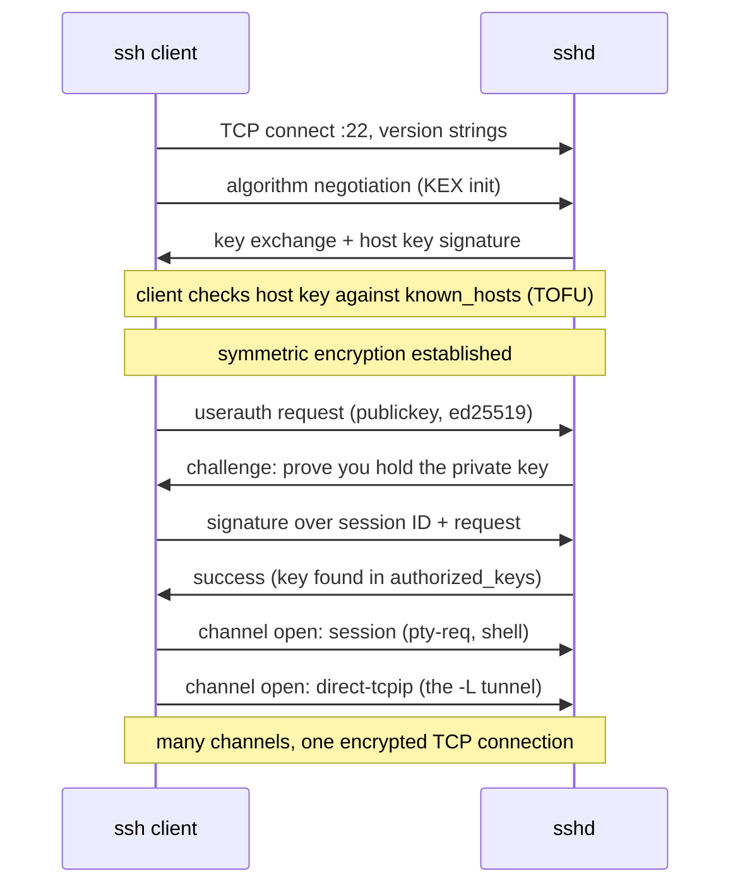

Before Kubernetes, SSH *was* the control plane. Every deploy, every debug session, every "is the box up?" was an SSH connection to a machine you knew by name. Kubernetes deliberately took that away from you — and replaced it with something that *feels* like SSH (`kubectl exec -it` gives you a prompt, `kubectl port-forward` gives you a tunnel) but shares almost nothing with it under the hood. This article does two jobs: it teaches you SSH properly, because you still need it — for nodes, bastions, git, and CI — and then it draws the sharp line between SSH and the kubectl subcommands that impersonate it. **Confusing the two is not a naming quibble; they differ in who authenticates you, who authorizes you, who audits you, and which process on which machine actually does the work.**

If you want the one-page survey of how kubectl's exec path lands in the kernel, that's in [Kubernetes Is Linux](/troubleshooting/kubernetes-is-linux/); this page goes deeper on both sides of the comparison.

## The protocol in three layers

SSH is not one protocol but a stack of three, specified in a family of RFCs ([RFC 4251](https://www.rfc-editor.org/rfc/rfc4251) is the architecture document). Each layer answers one question:

1. **Transport layer** ([RFC 4253](https://www.rfc-editor.org/rfc/rfc4253)) — *am I talking to the right server, privately?* The client and server negotiate algorithms, run a key exchange (typically Curve25519 Diffie–Hellman today) to derive a shared secret no eavesdropper can compute, and the server proves its identity by signing the exchange with its **host key**. From here on, everything is encrypted and integrity-protected.
2. **User authentication layer** ([RFC 4252](https://www.rfc-editor.org/rfc/rfc4252)) — *is this user who they claim?* Password, public key, or others — running *inside* the already-encrypted transport, which is why even password auth isn't sent in the clear.
3. **Connection layer** ([RFC 4254](https://www.rfc-editor.org/rfc/rfc4254)) — *what do you want to do?* This layer multiplexes any number of **channels** over the single encrypted connection: an interactive shell, an exec'd command, an SFTP subsystem, and any number of forwarded TCP connections, all interleaved.



That last note is worth pausing on: **an SSH "session" is one TCP connection carrying many logical channels.** Your shell, your three port-forwards, and an scp can all share one connection (that's what `ControlMaster` multiplexing exploits). It's the same design idea you'll meet again in HTTP/2 — and it means everything SSH does is subject to the ordinary rules of [TCP connections](/foundations/tcp-connections/): idle timeouts in middleboxes, keepalives (`ServerAliveInterval`), and half-open connections that die silently.

## Public-key auth: the challenge, not the key

The single most misunderstood mechanic in SSH: **your private key is never sent anywhere.** Public-key authentication is a signature challenge:

- You (or your agent) hold the private key. The server holds only the public key, one line in `~/.ssh/authorized_keys`.
- At auth time, the client *signs* a blob that includes the unique session ID from the key exchange. The server verifies the signature with the public key.
- Because the session ID is fresh per connection, the signature can't be replayed against another server or another session.

This is why compromising a server never leaks your ability to log into other servers, and why "add my public key" is safe to do over a ticket while "send me your private key" is always, without exception, wrong.

What key should you use in 2026? **ed25519, full stop** — small keys, fast, no parameter foot-guns. RSA is fine at 3072+ bits and you'll still meet it (older appliances, some git hosts' docs), but there's no reason to generate new RSA keys. See [ssh-keygen(1)](https://man7.org/linux/man-pages/man1/ssh-keygen.1.html):

```bash
ssh-keygen -t ed25519 -C "you@example.com"
cat ~/.ssh/id_ed25519.pub          # this line is what goes on servers
ssh-keygen -lf ~/.ssh/id_ed25519   # fingerprint: SHA256:...
```

That `SHA256:...` fingerprint is a hash of the public key — the same content-addressing idea that runs through container images and TLS certs, covered properly in [Hashing](/foundations/hashing/).

## known_hosts, TOFU, and the scary warning

User auth answers "who are you?" — but the transport layer already asked the mirror question: *is this server the one you meant?* SSH's answer is **trust on first use (TOFU)**: the first time you connect, you're shown the host key fingerprint and asked to accept it; it's then pinned in `~/.ssh/known_hosts`, and every later connection must present the same key.

So when you see:

```text
@@@@@@@@@@@@@@@@@@@@@@@@@@@@@@@@@@@@@@@@@@@@@@@@@@@@@@@@@@@
@    WARNING: REMOTE HOST IDENTIFICATION HAS CHANGED!     @
@@@@@@@@@@@@@@@@@@@@@@@@@@@@@@@@@@@@@@@@@@@@@@@@@@@@@@@@@@@
IT IS POSSIBLE THAT SOMEONE IS DOING SOMETHING NASTY!
```

it means the server presented a *different* host key than the pinned one. In a corporate cloud environment the boring cause is overwhelmingly likely — **the instance was rebuilt and generated fresh host keys** (autoscaled nodes do this constantly, which is why fleet SSH tooling uses SSH certificates or SSM instead of raw TOFU). But the warning exists because the non-boring cause is a machine-in-the-middle, and the honest response is to verify the new fingerprint out of band, not to reflexively delete the line. Contrast this with TLS, where a chain of certificate authorities replaces TOFU — the trade-offs are laid out in [TLS and Corporate CAs](/networking/tls-and-corporate-cas/). SSH *also* has certificates (`ssh-keygen -s` signing host and user keys against a CA) and mature fleets use them; the mechanics are in [ssh(1)](https://man7.org/linux/man-pages/man1/ssh.1.html) and [sshd_config(5)](https://man7.org/linux/man-pages/man5/sshd_config.5.html).

## The agent, and why forwarding it is spicy

Typing your key passphrase per connection gets old, so `ssh-agent` holds decrypted private keys in memory and answers signing requests over a Unix socket (`SSH_AUTH_SOCK`). The keys still never leave the agent — clients send it *things to sign*.

**Agent forwarding** (`ssh -A`) extends that socket onto the remote machine, so an SSH client *there* can hop onward using *your* keys. Convenient for `bastion → internal-host` chains — and exactly as dangerous as it sounds: **anyone with root on the intermediate machine can use your forwarded agent to sign as you** for as long as you're connected. They can't steal the key, but they don't need to. The modern advice is blunt: don't forward agents; use `ProxyJump`, which needs no agent on the bastion at all because the bastion only ever sees encrypted traffic passing through.

## Tunnels: -L, -R, -D, and ProxyJump

The connection layer's forwarded-TCP channels are SSH's second career: a general-purpose encrypted transport for *other* protocols. Three flags, three directions:

| Flag | Listens where | Connects where | Mnemonic |
|---|---|---|---|
| `-L 5432:db.internal:5432` | your machine | from the *server's* network | **L**ocal listener, remote destination |
| `-R 8080:localhost:3000` | the server | back into *your* machine | **R**everse: expose yourself remotely |
| `-D 1080` | your machine (SOCKS) | anywhere, chosen per-connection | **D**ynamic: a poor man's VPN |
| `-J bastion` (ProxyJump) | — | SSH-through-SSH to the real target | the modern bastion pattern |

Concrete, Kubernetes-adjacent uses you'll actually reach for:

```bash
# A service listening only on a node's localhost (say, a node-local
# metrics endpoint on :10248) — reach it through the bastion:
ssh -J bastion -L 10248:localhost:10248 admin@node-7
curl http://localhost:10248/healthz

# The managed database that only allows the VPC, from your laptop:
ssh -L 5432:orders-db.internal:5432 bastion
psql -h localhost -p 5432

# Chain two bastions without ever landing a key on either:
ssh -J corp-bastion,prod-bastion admin@node-7
```

`ProxyJump` deserves the emphasis: it establishes an SSH connection *to* the bastion, then opens a forwarded channel *through* it and runs a full, end-to-end-encrypted SSH connection to the target inside that channel. **The bastion relays ciphertext it cannot read.** That's the property that makes bastions auditable choke points rather than places your credentials go to be harvested.

If `-L` is giving you déjà vu: yes, `kubectl port-forward` is the same *shape* — a local listener stitched to a remote endpoint over an encrypted stream. The plumbing underneath is entirely different, which is the point of the last section.

## Files and git over SSH

`scp`, `sftp`, and `rsync -e ssh` all ride the connection layer — `sftp` as a formal subsystem channel, rsync as an exec'd command with the data flowing over stdin/stdout of the channel (the same fd plumbing described in [stdin, stdout, stderr, and File Descriptors](/foundations/stdio-and-file-descriptors/)). Use rsync for anything big or resumable; scp for one-offs.

Git-over-SSH is nothing more exotic: `git@github.com:org/repo.git` means "SSH as user `git`, exec `git-upload-pack`, speak the git protocol over the channel." That's why **deploy keys are just authorized_keys entries scoped to one repo**, and why CI systems want a private key (or better, a short-lived token) as a secret — the full CI wiring, including why you should prefer scoped deploy keys over a bot user's all-repo key, is in [GitHub Actions](/ci/github-actions/).

## Where SSH still lives in a Kubernetes world

You gave up SSH-to-the-app when you adopted Kubernetes, but the machines didn't disappear:

- **Node access.** When a node is NotReady and `kubectl debug node/` can't help — kubelet wedged, disk full, network misconfigured — someone SSHes (or SSM/IAP-tunnels, which are SSH-shaped agents with cloud IAM instead of authorized_keys) to the node itself. That escalation path and what to run once you're there are in [Node Problems](/troubleshooting/node-problems/).
- **When kubectl is dead.** The API server is down or unreachable: kubectl exec, logs, debug — all of it is gone, because *all of it* transits the API server. SSH to a control-plane node or worker is the out-of-band path that still works, which is precisely why platform teams keep it locked but alive.
- **Provisioning.** Ansible, image bake pipelines, and cluster bootstrap tooling are SSH loops with inventory.
- **CI and GitOps.** Every `git clone` in a pipeline, every deploy key, every `known_hosts` line baked into a runner image.

**What SSH is *not* for anymore: reaching your application.** Which brings us to the main event.

## kubectl exec is not SSH

`kubectl exec -it pod -- sh` hands you a prompt, so it's natural to assume there's an sshd somewhere. There isn't — no daemon in the pod, no port 22, no authorized_keys. What actually happens (the full request path is traced in [How kubectl Works](/kubectl/how-kubectl-works/)):

1. kubectl POSTs an `exec` subresource request to the **API server** over TLS, authenticated with your kubeconfig credentials.
2. The API server authorizes it with **RBAC** (`create` on `pods/exec`), records it in the **audit log**, and proxies a streaming connection (WebSocket, historically SPDY) to the **kubelet** on the pod's node.
3. The kubelet asks the container runtime to spawn your command **inside the container's namespaces** — `setns()` into the target's net/mnt/pid namespaces, the same primitive `nsenter` uses by hand ([setns(2)](https://man7.org/linux/man-pages/man2/setns.2.html)). With `-t`, the runtime allocates a PTY; the streams are pumped back through kubelet → API server → your terminal.

Line it up against SSH and the differences stop being trivia:

| | SSH to a host | `kubectl exec` into a pod |
|---|---|---|
| Listening daemon | `sshd` on the target, port 22 | none in the pod; kubelet on the node (10250) |
| Authentication | host's authorized_keys / PAM / SSH certs | your cluster identity (OIDC, client certs, cloud IAM) at the API server |
| Authorization | you have a key = you're in; granularity is Unix users | RBAC: verb `create` on `pods/exec`, per namespace, per role |
| Audit trail | sshd auth log on that one host (if shipped) | centralized API server audit log, every invocation |
| Transport | end-to-end SSH crypto, client ↔ host | TLS client ↔ API server, TLS API server ↔ kubelet — **mediated, not end-to-end** |
| Who spawns your process | sshd forks; your login shell, your uid from /etc/passwd | container runtime `setns()`s into the container; uid from the pod's securityContext |
| Network path | any route to port 22 | works even when the pod is unroutable from your laptop — only the API server needs to reach the kubelet |
| Session semantics | full login session (PAM, env, shell profile) | bare process in the container; no login machinery at all |

Two of these rows carry most of the weight. **Mediation:** every exec, every port-forward, every `kubectl cp` (which is literally `exec tar` under the hood) flows through the API server, where it can be authenticated, authorized, audited, and revoked in one place. **Process origin:** your shell is spawned *by the runtime into existing namespaces*, which is why it appears inside the pod's PID namespace next to your app, sees the pod's filesystem, and inherits the container's cgroup limits — the whole [in-pod worldview](/troubleshooting/linux-inside-the-pod/) applies to your debug shell too.

`kubectl port-forward` is the same story wearing the `-L` costume: a local listener whose bytes travel client → API server → kubelet → a socket connected to the pod. Useful reflex: **anything kubectl streams is bounded by API server health and your RBAC — and shows up in the audit log.** SSH is bounded by route-to-port-22 and shows up wherever that host's logs go.

## Why your pods should not run sshd

It's tempting — one `apt-get install openssh-server` and you have "real" access again. Resist, for reasons that are now obvious given the table:

- **It bypasses everything the API server mediates.** RBAC doesn't see SSH sessions. The audit log doesn't record them. Revoking someone's cluster access doesn't revoke their key in your image.
- **It's a second authentication system to run** — key distribution, rotation, CVE patching of sshd — inside every replica, forever.
- **It invites mutation.** SSH culture is "log in and fix it"; a container edited by hand is a pet wearing a cattle ear-tag, and the next reschedule silently discards the fix.
- **It widens the attack surface** of exactly the thing you've otherwise locked down with [pod security](/workloads/pod-security/) — a network-listening, privilege-brokering daemon in every pod.

The legitimate need behind the temptation — "my image has no shell and I need to poke around" — has a first-class answer: ephemeral debug containers and the rest of the [debugging toolbox](/troubleshooting/debugging-toolbox/), which give you tools *through* the audited exec path instead of around it.

## Hardening sshd, in one breath

For the nodes and bastions where sshd rightfully lives, the short list that covers most of the ground ([sshd_config(5)](https://man7.org/linux/man-pages/man5/sshd_config.5.html)): `PasswordAuthentication no` and `KbdInteractiveAuthentication no` (keys or certificates only), `PermitRootLogin no` (or `prohibit-password` where root is unavoidable), restrict users with `AllowGroups`, keep `X11Forwarding no`, and disable what you don't use (`AllowAgentForwarding no`, `AllowTcpForwarding no` on bastions that should only ProxyJump — note stock ProxyJump does need forwarding; scope it with `PermitOpen` instead of leaving it wide). Then stop tuning ciphers by hand: modern OpenSSH defaults are good, and hand-curated crypto lists age into liabilities.

## See it yourself

Ten minutes of experiments that make the whole page concrete:

```bash
# Watch the three layers happen: version exchange, KEX, host key,
# auth, channel open — all narrated:
ssh -vv somehost 2>&1 | grep -E 'kex|host key|Authenticat|channel'

# What the server's host key fingerprint is, from the client side:
ssh-keygen -lf /etc/ssh/ssh_host_ed25519_key.pub   # on the server
# compare with what you pinned:
ssh-keygen -lF somehost                             # from known_hosts

# Prove kubectl exec isn't SSH: no sshd, no port 22 in the pod
kubectl exec deploy/api -- sh -c 'cat /proc/net/tcp | wc -l'   # no :22 (0x16) listener
# and it's audited + RBAC-checked; watch the request itself:
kubectl exec -v=8 deploy/api -- true 2>&1 | grep -E 'POST|exec'

# Prove exec joins existing namespaces rather than logging in:
kubectl exec deploy/api -- ls -l /proc/self/ns/    # same ns inodes as PID 1
```

The takeaway to carry out: **SSH authenticates you to a machine; kubectl authenticates you to a control plane.** Use SSH for the layer Kubernetes sits on — nodes, bastions, git — and the API-mediated verbs for everything Kubernetes manages, because the audit trail, the RBAC, and the revocation story only exist on that path. The rest of this section's map is in the [overview](/foundations/overview/).
