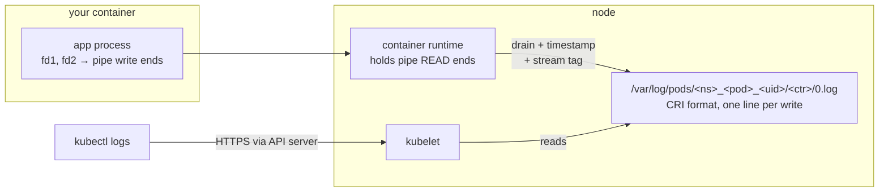

Ask where your logs go and most answers start in the middle: "the runtime picks them up." Ask why they sometimes *don't* — why a Python app's output appears only when the pod dies, why a chatty process freezes mid-request, why "too many open files" takes down a service that opens no files — and the middle isn't good enough. You need the beginning, and the beginning is a small integer. **Everything a Unix process reads or writes — files, pipes, sockets, terminals — it touches through a file descriptor, and three particular descriptors, numbered 0, 1, and 2, are the entire logging API of Kubernetes.** This article follows the bytes from your `printf` to `kubectl logs`, and every stop along the way is a place where the bytes can stall, vanish, or lie to you.

The [previous article](/foundations/processes-and-signals/) established that a container is a process; the fd table was one of the four parts of its anatomy. This is the deep dive on that part.

## The fd table: numbers as handles

When a process calls `open()`, the kernel doesn't hand back an object — it hands back an integer, and the contract is minimal: **the lowest unused slot in the process's file descriptor table** ([open(2)](https://man7.org/linux/man-pages/man2/open.2.html)). The table maps small integers to kernel-side descriptions of open things: which file, what offset, what mode. Every subsequent operation — `read`, `write`, `close` — takes the integer and means "the thing in slot N."

Three properties of that table generate everything else in this article. **It's per-process but inheritable**: `fork` copies it, so children start with the parent's open fds — and `exec` preserves it, which is the mechanism behind both shell redirection and container logging, coming below. **It's finite**: a per-process limit (`RLIMIT_NOFILE`) caps how many slots exist, and running out is a real production incident. **It's inspectable**: `/proc/<pid>/fd/` is the table as a directory of symlinks, readable from inside any pod:

```console
$ ls -l /proc/self/fd
lrwx------ 1 app app 64 ... 0 -> /dev/pts/1
lrwx------ 1 app app 64 ... 1 -> /dev/pts/1
lrwx------ 1 app app 64 ... 2 -> /dev/pts/1
lr-x------ 1 app app 64 ... 3 -> /proc/4212/fd
$ ls -l /proc/1/fd
lr-x------ 1 app app 64 ... 0 -> /dev/null
l-wx------ 1 app app 64 ... 1 -> pipe:[382140]
l-wx------ 1 app app 64 ... 2 -> pipe:[382141]
lrwx------ 1 app app 64 ... 45 -> socket:[391208]
```

Read those two listings closely, because they contain the whole story. *Your shell* (`self`) has fds 0/1/2 pointing at a pseudo-terminal — you ran `kubectl exec -it`, and `-t` allocated one. *The app* (PID 1) has stdin on `/dev/null`, stdout and stderr on **pipes** — held by the container runtime — and a socket at fd 45, because **sockets are file descriptors too**: the same table, the same integers, the same `read`/`write` calls. A connection leak and a file leak are the same disease in the same organ, and TCP gets its own article precisely because a socket is just an fd with a [state machine attached](/foundations/tcp-connections/).

## 0, 1, 2: the contract

The three standard streams are pure convention — nothing in the kernel makes fd 1 special — but it is the oldest and most load-bearing convention in Unix: **fd 0 is where you read input, fd 1 is where you write results, fd 2 is where you write commentary.** Programs are written against the numbers, not against any particular destination; the *caller* decides what the numbers point to before the program starts. That decoupling is the whole design: the gap between `fork` and `exec` (from [the process article](/foundations/processes-and-signals/)) is where the caller rewires slots 0–2, and `exec` preserves the table, so the new program inherits its streams without ever knowing what they are.

That's all shell redirection is. `cmd > file` means "between fork and exec, open the file and install it in slot 1." A pipeline installs the write end of a pipe in one process's slot 1 and the read end in the next one's slot 0. And the notorious ordering rule falls out mechanically — redirections are `dup2()` calls executed left to right ([dup(2)](https://man7.org/linux/man-pages/man2/dup.2.html)):

```bash
cmd > file 2>&1   # slot 1 := file; slot 2 := copy of slot 1 → both to file. Correct.
cmd 2>&1 > file   # slot 2 := copy of slot 1 (the TERMINAL, still); slot 1 := file.
                  # stderr goes to the screen, not the file. The classic mistake.
```

`2>&1` doesn't mean "redirect 2 wherever 1 goes from now on"; it means "copy 1's *current* target into 2, right now." Order is everything.

The stdout/stderr split earns its keep in containers. **stdout is for output, stderr is for diagnostics** — and Kubernetes preserves the distinction end to end: the runtime tags every log line with its stream, and `kubectl logs` can't filter on it but your [log collector can](/observability/log-collection/). The practical convention for services: write your structured logs to stdout, let startup noise and stack traces go to stderr, and never write logs to files inside the container — a file in the writable layer dies with the container and is invisible to the platform's collectors. This is 12-factor logging ([12factor.net/logs](https://12factor.net/logs)): treat logs as an event stream, and let the environment own transport and storage. In Kubernetes, that principle isn't advice — it's the mechanism, as the next section shows.

## Pipes: the plumbing, and where it blocks

A pipe is a kernel object with two fds — a write end and a read end — and a buffer in between, 64 KB by default on Linux ([pipe(7)](https://man7.org/linux/man-pages/man7/pipe.7.html)). Bytes written to one end sit in the buffer until read from the other. Two behaviors define everything downstream:

- **A write to a full pipe blocks.** Not "fails," not "drops" — the writing process stops, in kernel, until the reader drains space. If nothing ever reads, the writer waits forever.
- **A read from an empty pipe blocks** until bytes arrive, or returns EOF when every write end is closed — which is how `kubectl logs -f` knows your container exited.

Now the sentence that explains a genuinely weird class of production hang: **if whatever holds the read end of your stdout pipe stops draining it, your app freezes on its next `printf` after the buffer fills.** The process sits in a healthy-looking sleep inside `write(1, ...)`; no CPU, no errors, no logs (obviously), liveness probes that depend on the main loop start failing, and the incident report says "app hung for no reason." On a normal cluster the runtime's log pump is reliable and this stays theoretical; it stops being theoretical when a node's disk fills (the pump can't write [log files](/troubleshooting/node-problems/)), or when *you* build the pipeline — a sidecar consuming the app's output, a `kubectl exec ... | slow-thing`, a preStop hook piping to a stalled network call. A 64 KB budget between you and a stalled reader is not much runway for a chatty app.

See the buffer and the block with two shells on any Linux box:

```console
$ mkfifo /tmp/p
$ cat /proc/sys/fs/pipe-max-size        # ceiling a pipe *can* be resized to
1048576
$ dd if=/dev/zero of=/tmp/p bs=1k count=100 &   # no reader attached...
$ jobs                                          # dd sits blocked after ~64KB
[1]+ Running    dd if=/dev/zero of=/tmp/p ...   # until: cat /tmp/p > /dev/null
```

## Terminals vs pipes: the buffering trap

Here is the highest-frequency logging bug in Kubernetes, and it lives in userspace, in the C library, above everything discussed so far. The stdio layer (`printf`, and its descendants in most language runtimes) keeps its *own* buffer per stream and chooses a flushing policy at startup by asking one question — `isatty(fd)`: **is this fd a terminal?** ([isatty(3)](https://man7.org/linux/man-pages/man3/isatty.3.html), [setvbuf(3)](https://man7.org/linux/man-pages/man3/setvbuf.3.html)):

| Stream | Connected to a terminal | Connected to a pipe/file |
|---|---|---|
| stdout | **line-buffered** — flush at every `\n` | **fully buffered** — flush when the buffer fills (4–8 KB typical) |
| stderr | unbuffered — every write goes out now | unbuffered (by C standard mandate) |

On your laptop, stdout is a terminal: every line appears instantly, and you internalize "print = visible." In a container, stdout is a *pipe* — `isatty` says no — and the runtime silently switches to full buffering. Your app prints a line every few seconds; nothing reaches the pipe until 4 KB accumulates; `kubectl logs` shows a pod that has "logged nothing" for minutes, then dumps forty lines at once. Worse: **buffered bytes live in the process's memory, and SIGKILL doesn't flush.** The crashed pod whose logs end *before* the interesting part — the error was printed, buffered, and annihilated with the process — is this table, second column, plus [exit-code 137 mechanics](/foundations/processes-and-signals/). Meanwhile stderr, unbuffered by mandate, always arrives — which is why a mixed-stream log sometimes shows the stack trace *before* the print statements that preceded it.

The fixes are per-runtime one-liners, all meaning "flush eagerly even when not a TTY": `PYTHONUNBUFFERED=1` (or `python -u`); Java and Go are safe by default (`System.out` auto-flushes per line as configured by most logging frameworks; Go's `fmt.Println` writes straight to fd 1, unbuffered); C: `setvbuf(stdout, NULL, _IOLBF, 0)` or `stdbuf -oL cmd`; Ruby: `$stdout.sync = true`. If lines are precious — and in a crash they always are — log to stderr or use a logging framework that flushes per record. [Logging Fundamentals](/observability/logging-fundamentals/) carries the format-and-practice half of this; the mechanism half is this table.

## How container logging actually works

Assemble the pieces and the "magic" of `kubectl logs` becomes four fds and a file:



When the runtime creates your container, it builds two pipes, keeps the read ends, and installs the write ends as the container's fds 1 and 2 before the `exec` — the fork/exec gap again, doing its usual job. From then on, a per-container pump goroutine drains the pipes and appends each chunk to a file under `/var/log/pods/`, one line per entry in the CRI logging format:

```text
2026-07-18T09:14:02.113184261Z stdout F {"level":"info","msg":"payment accepted","order":"A-1041"}
2026-07-18T09:14:02.114002710Z stderr F WARN retrying upstream call
2026-07-18T09:14:02.117441005Z stdout P {"level":"info","msg":"a very long line that got split
```

Timestamp, stream tag, `F`/`P` for full-versus-partial line (long writes get split), then your bytes. `kubectl logs` never touches your pod: it asks the API server, which asks the kubelet, which reads this file — that's why logs survive a container crash (the file outlives the process) but not, by default, much history (the kubelet rotates these files at a size cap — typically 10 MB with a few rotations — so **`kubectl logs` is a window, not an archive**). Cluster log collectors are DaemonSets tailing the same directory — the [log collection](/observability/log-collection/) pipeline is downstream of the very same pipes. Everything in this paragraph is also why the rules of thumb hold: log to stdout/stderr (anything else is invisible to this entire pipeline), don't log gigabytes per minute (you're writing to the node's disk, metered against everyone), and expect ordering *between* the two streams to be approximate (two pipes, two pumps, one merged file).

See the plumbing from inside a pod, no node access required:

```bash
ls -l /proc/1/fd/1 /proc/1/fd/2      # → pipe:[inode] — the write ends
echo test > /proc/1/fd/1             # write into PID 1's stdout: this line
                                     # appears in `kubectl logs` for the pod!
```

That second command is a genuinely useful trick: it injects a line into the pod's log stream through the same pipe the app uses — handy for correlating timestamps during [debugging](/troubleshooting/debugging-toolbox/), and the JVM `kill -3 1` thread-dump-to-logs move from [the field guide](/troubleshooting/linux-inside-the-pod/) works for exactly this reason: the dump goes to PID 1's stdout, which *is* the log pipe.

## fd limits: "too many open files"

The fd table is bounded by `RLIMIT_NOFILE` ([getrlimit(2)](https://man7.org/linux/man-pages/man2/getrlimit.2.html)) — a soft limit the process may raise up to a hard limit, both inherited across fork/exec like everything else here. When the table is full, `open()`, `accept()`, `socket()`, and `pipe()` all fail with `EMFILE` — the string you'll grep for is **"too many open files"** — and an app that can't accept connections is down, no matter how healthy its CPU and memory look.

The triage is three reads, all from inside the pod:

```console
$ ls /proc/1/fd | wc -l                     # how many slots used
3987
$ grep 'open files' /proc/1/limits          # the ceiling
Max open files    4096      4096      files
$ ls -l /proc/1/fd | awk -F' -> ' '{print $2}' | cut -d: -f1 | sort | uniq -c
   3822 socket
    140 pipe
     22 /var/lib/app
```

The histogram is the diagnosis. **Mostly `socket` → a connection leak** — an HTTP client without pooling, responses never closed, or a pile of CLOSE_WAIT sockets your code abandoned ([the TCP article](/foundations/tcp-connections/) explains why CLOSE_WAIT is always your bug); mostly files → unclosed handles, often log or temp files; mostly pipes → subprocess spawning without cleanup. Raising the limit is a container/runtime setting (and worth doing for connection-heavy services — 1024 is a 1990s default), but a leak outruns any limit; the limit just decides the date of the incident.

## TTYs: what `-it` actually allocates

One loose end from the first fd listing: why did *your* exec shell get `/dev/pts/1` while the app got pipes? Because you asked for it. A pseudo-terminal ([pty(7)](https://man7.org/linux/man-pages/man7/pty.7.html)) is a kernel-provided pair — a master side and a slave side — where the slave looks exactly like a serial terminal to whoever opens it: `isatty` returns true, line editing and job control work, Ctrl-C becomes SIGINT. `kubectl exec -it` (and `kubectl attach -it`, and `tty: true` in a pod spec) tells the runtime: allocate a PTY, wire the container process's 0/1/2 to the slave side, and stream the master side back over the API-server connection. `-i` alone just keeps stdin open over a pipe; `-t` is the terminal illusion — and the reason interactive tools behave properly under `exec -it` but print garbage or die when you script them without it.

Two consequences close the loop on earlier sections. A container with `tty: true` gets *line-buffered* stdout — `isatty` says yes — so "adding tty: true fixed my logging" is the buffering table wearing a trench coat (fix the buffering instead; a TTY also merges stderr into the same stream, destroying the CRI stream tag). And Ctrl-C in your `exec -it` session kills *your shell*, not the app: the signal goes to the PTY's foreground process — the story of who receives which signal being, as always, [the previous article](/foundations/processes-and-signals/).

## The mapping table

| You observe | The fd-layer truth |
|---|---|
| logs appear in bursts, minutes late | stdout fully buffered — pipe, not TTY; `isatty` said no |
| crash logs end before the error | buffered bytes died with the process; SIGKILL doesn't flush |
| stack trace appears "too early" | stderr unbuffered, stdout buffered — two pipes, one merge |
| `kubectl logs` shows only recent history | kubelet rotates `/var/log/pods/*` at a size cap |
| "too many open files," CPU/mem fine | fd table at RLIMIT_NOFILE; histogram `/proc/1/fd` |
| thousands of `socket` fds | connection leak — see [TCP](/foundations/tcp-connections/), CLOSE_WAIT |
| app hangs, no CPU, mid-`write` | pipe buffer full; reader stalled — who holds the read end? |
| `cmd 2>&1 > file` missed stderr | `dup2` runs left to right; order is everything |
| interactive tool broken under `exec` | no PTY — you forgot `-t` |
| `echo hi > /proc/1/fd/1` shows in logs | you wrote into the runtime's log pipe — as the app does |

Fifty years ago, Unix decided that a process should not know or care where its output goes — that the caller wires the slots, and the program just writes to 1 and 2. Kubernetes is the current caller. It wires slot 1 to a pipe, the pipe to a file, the file to the kubelet, and the kubelet to you; **`kubectl logs` is the long way around to the other end of fd 1.** Next in the section: the machinery that gives each pod its own *view* of the machine — [namespaces](/foundations/namespaces/). And for the primitives here, the reference shelf is short: [open(2)](https://man7.org/linux/man-pages/man2/open.2.html), [pipe(7)](https://man7.org/linux/man-pages/man7/pipe.7.html), [setvbuf(3)](https://man7.org/linux/man-pages/man3/setvbuf.3.html), and [pty(7)](https://man7.org/linux/man-pages/man7/pty.7.html).
