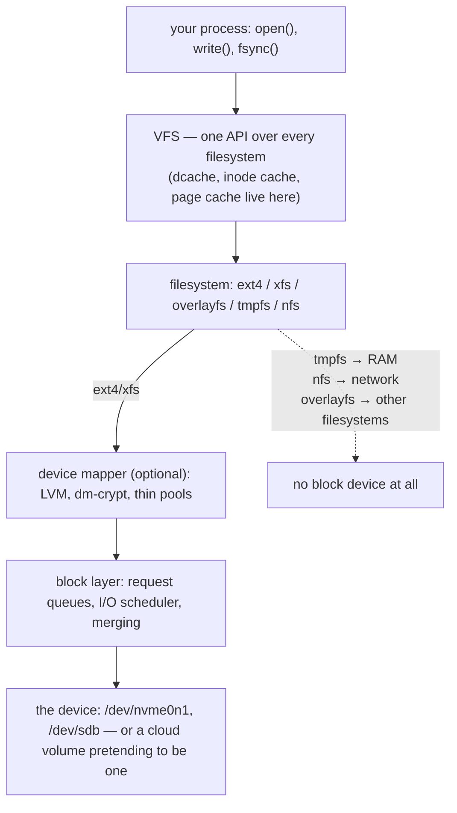
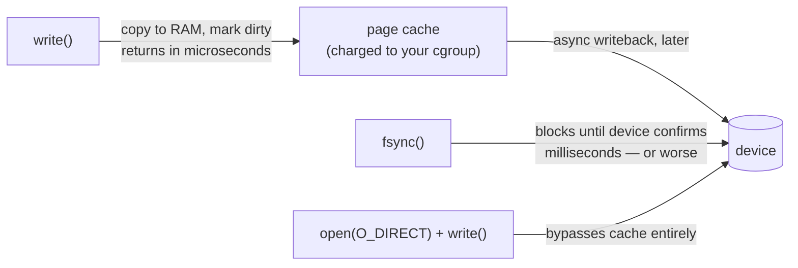

Every `write()` your application makes starts a journey down a stack that Linux has been refining for decades: through the VFS, into a filesystem, often through device mapper, into the block layer, and finally onto something that stores bits. **Kubernetes did not add a storage layer — it added a control plane that decides which existing Linux layers to assemble, then assembles them with mount syscalls.** A PersistentVolume is a block device wearing a filesystem; a ConfigMap mount is a bind mount with a symlink trick; a Secret is a tmpfs; the container image is overlayfs. When storage misbehaves — the pod stuck Terminating on a dead NFS server, the "memory leak" that's actually page cache, the ConfigMap update your subPath mount never sees — the explanation lives in one of these layers. This article walks the stack bottom-up so you know which layer owns which symptom.

The survey-level view of overlayfs and volume mounts is in [Kubernetes Is Linux](/troubleshooting/kubernetes-is-linux/); the in-pod diagnostic reads (`/proc/mounts`, `df`, deleted-but-open files) are in [Linux Inside the Pod](/troubleshooting/linux-inside-the-pod/). This page is the theory those two stand on.

## The stack, bottom-up



Two orientation facts. First, **the VFS is why everything is uniform**: one `open()`/`read()`/`write()` API regardless of what's underneath, which is what lets Kubernetes mount tmpfs, ext4, and NFS into the same pod and your app never know. Second, note the dotted arrow: **three of the filesystems that matter most in Kubernetes never touch a local block device at all** — tmpfs is RAM, NFS is a network protocol, and overlayfs is a view stitched over other filesystems. Their failure modes differ accordingly, and mapping symptom → layer is most of storage debugging.

## Block devices and device mapper

A block device is the kernel's abstraction for "addressable array of fixed-size blocks": read block N, write block N, no names, no directories. `/dev/nvme0n1`, `/dev/sdb`, and the virtual devices under `/dev/mapper/` all speak it. `lsblk` shows the tree; `/sys/block/*/queue/` shows each device's properties; `iostat -x` shows per-device throughput, IOPS, and — the number to learn — `await`, the average time an I/O spends in queue plus service. **When "the disk is slow," `await` is where that claim becomes measurable.**

Because block devices compose, Linux grew **device mapper**: a framework for stacking virtual block devices on real ones. The three targets you'll meet:

- **LVM** — carve logical volumes out of a pool of physical ones; resize online. Many on-prem CSI drivers are LVM programmers.
- **Thin provisioning** — promise more space than exists, allocate on write. Efficient, and the reason "the volume says 100Gi but the pool is full" is a real incident.
- **dm-crypt** — encrypt every block below the filesystem ([kernel dm-crypt guide](https://docs.kernel.org/admin-guide/device-mapper/dm-crypt.html)); more in the encryption section.

This is the layer much of the storage control plane ultimately programs. **What a CSI driver "does" is unglamorous and precise:** *attach* a volume to the node (cloud API call → a new block device appears), *stage* it (make a filesystem if needed, mount it once per node under `/var/lib/kubelet/plugins/...`), *publish* it (bind-mount the staged mount into the pod's volume directory). Every step bottoms out in the syscalls on this page — the choreography and its controllers are in [CSI Drivers](/controllers/csi-drivers/) and [Storage Controllers](/controllers/storage-controllers/), and the PV/PVC objects that drive it in [Storage: PV and PVC](/stateful/storage-pv-pvc/).

## The filesystems that matter in Kubernetes

A filesystem turns "array of blocks" into names, directories, permissions, and — crucially — **inodes**: the on-disk record of a file's metadata and block map. Five filesystems cover essentially every mount in a pod:

| Filesystem | Backed by | Kubernetes role | The fact that bites |
|---|---|---|---|
| ext4 | block device | default PV workhorse | fixed inode count at mkfs (see ENOSPC below) |
| xfs | block device | large volumes; some ephemeral-storage setups | no shrink, ever; project quotas enforce per-directory limits |
| overlayfs | other filesystems | **every container's root** | first write to a big lowerdir file copies the whole file up |
| tmpfs | RAM | `emptyDir.medium: Memory`, Secret mounts | **its bytes count against your memory limit** |
| nfs | network | RWX shared volumes | server gone → processes in D state, unkillable |

**ext4** ([kernel ext4 guide](https://docs.kernel.org/admin-guide/ext4.html)) is the boring, correct default: journaled metadata, decades of hardening. **xfs** shines for large files and parallel I/O and adds *project quotas* — per-directory space accounting, which is one of the mechanisms kubelets can use to enforce `ephemeral-storage` limits cheaply instead of running `du` on a timer. Its sharp edge: an xfs filesystem can grow but never shrink.

**overlayfs** ([kernel overlayfs doc](https://docs.kernel.org/filesystems/overlayfs.html)) is the container image trick — read-only image layers as `lowerdir`s, a writable `upperdir` per container, presented as one root. The survey covers the what; here is the mechanism that generates the pathologies:

- **Copy-up.** Files from lower layers are served in place until the moment you open one for writing — then the *entire file* is copied to the upperdir first, however large it is. `chown`/`chmod`/`touch` count as writes (metadata copy-up). Consequences: the first write to a 2 GB file baked into your image stalls for a full 2 GB copy; and a recursive `chown` in an entrypoint (or an fsGroup applied to a huge volume of image files) can copy up half the image and eat ephemeral-storage doing it.
- **Whiteouts.** Deleting a lower-layer file can't touch the read-only layer, so overlayfs records the deletion as a special "whiteout" entry in the upper layer. The file is hidden, but **its bytes still exist in the layer blob** — the reason `RUN rm secret.pem` in a Dockerfile removes nothing from the image, and the reason deleting files never shrinks a layer already shipped.
- **Inode identity.** A file's inode can change across copy-up (lower inode before, upper inode after). Programs that watch files by inode — `tail -f` styles of log followers, some inotify users — can silently follow the stale lower copy after something modifies the file.

**tmpfs** ([kernel tmpfs doc](https://docs.kernel.org/filesystems/tmpfs.html)) is a filesystem interface over the page cache: fast, volatile, and **memory**. Kubernetes uses it for `emptyDir.medium: Memory` and for Secret mounts (so secret bytes never rest on the node's disk). The trap is double-billing your mental model misses: a 400 MB file in a memory-backed emptyDir is 400 MB of your container's `memory.current`, exactly as if you'd malloc'd it — the accounting is laid out in [cgroups: The Budget](/foundations/cgroups/), and a tmpfs quietly filling with "temp files" is a classic [OOMKilled](/troubleshooting/oomkilled/) with no leak in the heap dump.

**NFS** puts a network round-trip inside filesystem syscalls, which imports network failure into a place applications never expect it. Two properties to respect. *Close-to-open consistency:* NFS only guarantees that a file closed by one client is consistent for another client that opens it afterward — two pods appending to one file concurrently will interleave and lose data; that's the protocol working as documented ([nfs(5)](https://man7.org/linux/man-pages/man5/nfs.5.html)). *The D-state hazard:* with default `hard` mounts, a process touching an unreachable server waits in **uninterruptible sleep** — state `D`, immune to SIGKILL, because the kernel won't abandon an in-flight I/O. An unkillable process means an unfinishable pod termination: the [stuck-terminating](/troubleshooting/stuck-terminating/) pod pinned to a dead fileserver is this exact mechanism, and the process-state background is in [Processes, Signals, and PID 1](/foundations/processes-and-signals/).

## Mounts: how volumes actually appear

Everything Kubernetes "attaches" to a pod arrives the same way: the [mount(2)](https://man7.org/linux/man-pages/man2/mount.2.html) syscall, executed by the kubelet/runtime into the container's mount namespace before your process starts. Three mount concepts explain nearly all volume behavior you've observed.

**Bind mounts** graft an existing directory (or single file) onto another path — no new filesystem, two names for one subtree. Your PVC's publish step is a bind mount from the staged node mount; a projected ServiceAccount token is a bind-mounted file; `subPath` is a bind mount of one entry inside a volume. Because a bind mount targets a specific *inode*, it follows that inode wherever the name later points — hold that thought for the ConfigMap trick below.

**Mount propagation** ([kernel shared-subtrees doc](https://docs.kernel.org/filesystems/sharedsubtree.html)) governs whether mount *events* cross namespace copies. Each mount is `private` (events don't cross — the container default), `shared` (cross both ways), or `slave` (receive from host, don't send back). This is invisible until it isn't: a CSI driver pod that mounts volumes for *other* pods needs `mountPropagation: Bidirectional` so its mounts appear on the host; a hostPath consumer that must see mounts made *after* it started needs `HostToContainer`. "The volume is mounted on the node but the pod sees an empty directory" is a propagation symptom, filed under [Volume Failures](/troubleshooting/volume-failures/). The namespace side of this machinery is in [Namespaces: The Different View](/foundations/namespaces/).

**The ConfigMap symlink dance** — the mechanism behind a FAQ. The kubelet materializes a ConfigMap volume like this:

```console
$ ls -la /etc/config/
lrwxrwxrwx  app.yaml -> ..data/app.yaml
lrwxrwxrwx  ..data   -> ..2026_07_18_09_14_02.123456789
drwxr-xr-x  ..2026_07_18_09_14_02.123456789/
```

Your files are symlinks through `..data`, which points at a timestamped directory. **On update, the kubelet writes a complete new timestamped directory and atomically swaps the `..data` symlink** — every file updates at once, readers never see a half-written state. Now the two consequences: a pod mounting the *directory* sees updates (eventually — sync is periodic, up to a minute or more); but a **`subPath` mount bind-mounts the resolved file's inode at pod start**, and no symlink swap can retarget an existing bind mount. The mounted file keeps showing the old content forever. That's not a bug to work around with prayers — it's mount semantics, and the practical guidance (mount directories, or roll the pod with the checksum-annotation trick from [Hashing](/foundations/hashing/)) is in [Config Files and Volumes](/workloads/config-files-and-volumes/). Secret mounts behave identically, with tmpfs underneath — see [Secrets](/workloads/secrets/).

## The page cache, fsync, and what "durable" costs

Here is the deal Linux makes with every ordinary `write()`: **the kernel copies your bytes into the page cache in RAM, marks the pages dirty, returns success — and writes the disk later.** Writeback happens asynchronously, seconds afterward. This deal is why writes feel free, why re-reads are instant, and why two numbers confuse everyone:

- **"My pod's memory keeps growing while it writes files."** File pages you touch are cached, and cached pages you caused are charged to your cgroup's `memory.current`. Most of it is reclaimable and doesn't OOM you — the `anon` vs `file` breakdown that separates a real leak from cache is walked in [Linux Inside the Pod](/troubleshooting/linux-inside-the-pod/) and the accounting rules in [cgroups](/foundations/cgroups/).
- **"Writes are fast but fsync is slow."** Because `write()` was never a disk write. [fsync(2)](https://man7.org/linux/man-pages/man2/fsync.2.html) is the syscall that says *actually put it on the platter and don't return until it's there* — and it costs whatever the device honestly costs.

Durability, then, is fsync's business, and **fsync latency is the heartbeat of every database you run.** Postgres fsyncs its WAL on commit; your transaction rate is bounded by it. And the most important database you *don't* run: etcd fsyncs its raft log on every consensus write, so **slow disks on control-plane nodes literally become slow Kubernetes** — leader elections, API latency, the works. When the platform team insists on provisioned-IOPS volumes for etcd, this syscall is the entire reason.

Databases that manage their own caches sidestep the double-caching with `O_DIRECT` ([open(2)](https://man7.org/linux/man-pages/man2/open.2.html)) — I/O straight between application buffers and the device, page cache bypassed. It's why a database pod can show eerily little `file` memory while hammering the disk, and why `O_DIRECT` on filesystems that don't fully support it (older overlayfs!) is a classic "works on my machine, fails in the container" bug.



## Encryption: which layer, against which attacker

"The volume is encrypted" is not one fact — it's four possible facts with different threat models, one per layer of the stack:

| Layer | Mechanism | Protects against | Does NOT protect against |
|---|---|---|---|
| below the filesystem | dm-crypt/LUKS, cloud EBS-style volume encryption | stolen disk, snapshot exfiltration, disposal mistakes | anything running on the live node — the mounted FS is cleartext |
| in the filesystem | fscrypt per-directory | other users on the box without the key | processes with the key loaded (i.e., your running workload path) |
| in the application | app encrypts fields before writing | database/volume compromise, snooping DBAs | the app itself, key compromise |
| in etcd (k8s secrets) | API-server envelope encryption / KMS | reading Secrets from raw etcd storage or backups | anyone with `get secrets` RBAC — API access sees plaintext |

The row to internalize is the first one's last column: **encryption at rest answers "what if someone takes the disk?" and nothing else.** A cloud-encrypted PV mounted in a compromised pod serves cleartext bytes to the attacker exactly as fast as to you, because decryption happens below the filesystem for every reader alike. Each layer up trades convenience for a narrower trust boundary; application-level is the only row that survives a live host compromise, and it's also the row Kubernetes can't provide for you. The etcd row is the same lesson at the control plane: envelope encryption protects the *storage* of Secrets, while RBAC protects their *use* — both, or neither, per [Secrets](/workloads/secrets/).

## When the disk fills: three different "full"s

`ENOSPC` — "No space left on device" — has three distinct causes in a pod, and `df` only shows one of them:

1. **Blocks exhausted.** The ordinary case: `df -h` shows 100%. Find the eater with `du`, or find the ghost — a deleted-but-open log file holds its blocks until the last fd closes, the classic covered step-by-step in [Linux Inside the Pod](/troubleshooting/linux-inside-the-pod/).
2. **Inodes exhausted.** `df -h` shows 40% free, writes still fail. ext4 fixes its inode count at mkfs time; millions of tiny files (build caches, npm trees, maildirs) can spend every inode with blocks to spare. **`df -i` is the check almost nobody runs first**, and "disk full but disk not full" is its signature.
3. **The kubelet's budget exhausted.** Your writable overlay layer and disk-backed emptyDirs draw on the *node's* filesystem, metered against your `ephemeral-storage` request/limit. Exceed the limit and there's no ENOSPC at all — **the kubelet evicts the pod**, which surfaces as `Evicted` with an ephemeral-storage message in `kubectl describe`, not as a write error your app ever saw. Node-level disk pressure triggers the same eviction machinery for everyone. Details and triage in [Volume Failures](/troubleshooting/volume-failures/).

## See it yourself

```bash
# The whole stack for one path: device, filesystem, mount options
findmnt -T /var/lib/app/data          # or: grep data /proc/mounts
lsblk -f                               # block tree with filesystems (node access)

# Overlay copy-up, live: watch a lower-layer file jump to the upperdir
kubectl exec -it deploy/api -- sh -c \
  'ls -i /usr/lib/somelib.so; touch /usr/lib/somelib.so; ls -i /usr/lib/somelib.so'
# inode changed = copy-up happened (and ephemeral-storage grew)

# tmpfs is memory: write to a Memory-medium emptyDir, watch the cgroup
kubectl exec -it deploy/api -- sh -c \
  'cat /sys/fs/cgroup/memory.current; dd if=/dev/zero of=/cache/blob bs=1M count=200; cat /sys/fs/cgroup/memory.current'

# The ConfigMap symlink dance, in the flesh
kubectl exec deploy/api -- ls -la /etc/config/

# Page cache vs durability: timed proof that write() isn't a disk write
kubectl exec -it deploy/api -- sh -c \
  'time dd if=/dev/zero of=/data/t bs=1M count=256; time dd if=/dev/zero of=/data/t bs=1M count=256 conv=fsync'

# The three fulls
df -h /data; df -i /data               # blocks vs inodes
kubectl describe pod api-... | grep -A2 -i ephemeral   # the kubelet's verdict
```

The layer map to carry out: **slow is the block layer, missing is the mount layer, stale is overlayfs or a subPath bind, unkillable is NFS, "memory leak" near a Memory emptyDir is tmpfs, and eviction is the kubelet's meter — not the disk.** Name the layer and you've halved the incident. Where this article sits among the twelve is in the [overview](/foundations/overview/).
