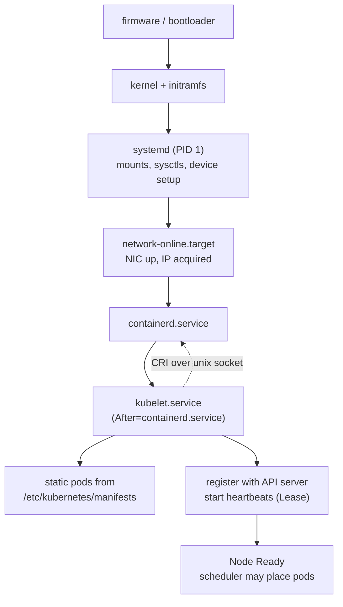

There are two init systems in your production life. One is whatever runs as PID 1 inside your containers — you met it in [Processes, Signals, and PID 1](/foundations/processes-and-signals/), and it's probably your app. The other is systemd, PID 1 of every node, and it was running before Kubernetes arrived and will be running after the kubelet crashes. **When `kubectl` goes quiet — node NotReady, API server unreachable, pods stuck and no events coming — the layer that still works is systemd**, and the debugging moves shift from `kubectl describe` to `systemctl status` and `journalctl -u`. You probably don't own the node; your platform team or cloud provider does. This article is still for you, for two reasons: the node's arrangement explains behaviors you see from the pod side (reserved resources, log loss, shutdown ordering), and when you escalate, knowing what to ask for — "can you paste `journalctl -u kubelet --since -10m`" — turns a ticket ping-pong into a diagnosis.

Kubernetes' own docs describe the node as "kubelet plus container runtime" and move on. This page is about the floor those two stand on.

## systemd in one section

systemd ([systemd(1)](https://man7.org/linux/man-pages/man1/systemd.1.html)) is the program the kernel starts as PID 1 after boot, and everything else on the node is its descendant, its cgroup tenant, or both. Its worldview is the **unit** — a named object with a small INI file describing what it is and what it needs ([systemd.unit(5)](https://man7.org/linux/man-pages/man5/systemd.unit.5.html)). The types you'll actually meet on a node:

| Unit type | What it is | On a Kubernetes node |
|---|---|---|
| `.service` | a managed daemon: how to start it, when to restart it | `kubelet.service`, `containerd.service`, `chronyd.service`, `sshd.service` |
| `.socket` | a listening socket systemd holds, activating a service on connect | `sshd.socket` on some distros; mostly quiet on nodes |
| `.timer` | a scheduled activation — systemd's cron | log rotation, cloud-agent housekeeping |
| `.mount` | a supervised mount point | `/var/lib/kubelet` on a dedicated disk, journal storage |
| `.slice` | **a node in the cgroup tree** — no process of its own, pure hierarchy | `system.slice`, `kubepods.slice` — the whole resource story below |
| `.scope` | a cgroup wrapped around processes *someone else* started | `cri-containerd-<id>.scope` — **your containers** |
| `.target` | a synchronization point, a named "phase" of boot | `multi-user.target`, `network-online.target` |

Units declare dependencies (`Requires=`, `After=`, `Wants=`), and systemd resolves the whole graph into a boot order — that's what targets are for, and why "the network is up before the kubelet starts" is a property someone had to declare rather than luck. The second thing systemd owns is **the journal**: journald captures every unit's stdout, stderr, and syslog traffic into one indexed, structured log — which is why node debugging below is mostly one command with different `-u` arguments.

And it does PID 1's classic duties for the node — the exact ones the [processes article](/foundations/processes-and-signals/) made you care about inside containers: it adopts orphans, reaps zombies, and turns "this daemon exited" into "restart it, with backoff." **systemd does for the node what a proper entrypoint does for your container.** Same job, four orders of magnitude more YAML-free.

## The units that ARE a node

Strip a Kubernetes node to its load-bearing services and you find a short list:

**`kubelet.service`** — the one Kubernetes component that is a systemd service rather than a pod. The unit file says `Restart=always`, which is why a crashing kubelet *loops* rather than dies (systemd is its CrashLoopBackOff). Its flags usually arrive via **drop-ins** — files under `/etc/systemd/system/kubelet.service.d/` that amend the unit without editing it (kubeadm ships a famous `10-kubeadm.conf` there); `systemctl cat kubelet` shows the merged result, and that's where you find what the kubelet was actually started with. Two operational corollaries: edits to unit files or drop-ins are inert until `systemctl daemon-reload`, and a "we changed a kubelet flag but nothing happened" mystery is usually a missing reload or restart. And because systemd applies restart backoff (`RestartSec`, rate limits), a badly broken kubelet can land in the terminal `failed` state — where it stops even *trying* — until someone runs `systemctl reset-failed` or restarts it by hand.

**`containerd.service`** (or CRI-O) — the container runtime, a separate daemon the kubelet talks to over a Unix socket using the CRI gRPC API. This separation is the load-bearing fact of node debugging: **kubelet and runtime fail independently.** A dead kubelet with a healthy containerd means every container keeps running while the node goes NotReady — pods don't die when the kubelet does, they just stop being *managed*.

**`chronyd.service`** (or systemd-timesyncd) — keeps the node's clock disciplined, and everything in [the time article](/foundations/time/) about cert validity and token expiry depends on it doing so quietly.

**`sshd.service`** — the door that still opens when the API server doesn't ([SSH](/foundations/ssh/) covers why node access and `kubectl exec` are entirely different machines).

Now the relationship that trips everyone: **your containers are not children of containerd in the systemd sense, and they are not services.** When the runtime starts a container, it asks systemd to create a *scope* — a cgroup, no supervision — under the kubelet's pod hierarchy. Process-tree-wise the container's PID 1 is parented by a small shim; cgroup-wise it lives in `kubepods.slice`, not `system.slice`. systemd knows your container as an entry in `systemd-cgls` output, not as something it would restart. **Restart-on-failure for containers belongs to the kubelet; restart-on-failure for the kubelet belongs to systemd.** Two supervision trees, stacked.

## Slices: the cgroup tree, seen from systemd's side

The [cgroups article](/foundations/cgroups/) walked the `kubepods.slice` hierarchy from the kubelet's point of view. From systemd's side, that hierarchy is just slices — and the top-level split is where node stability actually comes from:

| Slice | Who lives here | Who writes the limits |
|---|---|---|
| `system.slice` | kubelet, containerd, sshd, chronyd, journald | systemd, per unit file |
| `user.slice` | interactive logins (your SSH session) | systemd |
| `kubepods.slice` | every pod on the node | the kubelet — systemd delegates the subtree and never writes below it |

The kubelet's `--system-reserved` and `--kube-reserved` flags are, mechanically, this table: **Node Allocatable = capacity minus the reservations, enforced as limits on `kubepods.slice`** — so the sum of all pods physically cannot consume the memory the kubelet and containerd need to keep managing them. When that arithmetic is set wrong (or not set), you get the death spiral in [Node Problems](/troubleshooting/node-problems/): pods starve the kubelet, the kubelet misses heartbeats, the node goes NotReady with workloads still burning CPU on it. The reservation isn't Kubernetes being greedy; it's the roommate agreement between the two supervision trees.

## journald: the node's black box recorder

Every service's stdout and stderr flow into journald — the same "stdout is the logging API" contract your containers follow ([stdio and file descriptors](/foundations/stdio-and-file-descriptors/)), applied to daemons. The journal is structured (fields, not lines), indexed by unit and time, and queried with one command family ([journalctl(1)](https://man7.org/linux/man-pages/man1/journalctl.1.html)):

```bash
journalctl -u kubelet --since -10m        # THE node-debugging move
journalctl -u containerd -p err -b        # runtime errors since boot
journalctl -u kubelet -f                  # follow live, kubectl-logs style
journalctl --disk-usage                   # how much node disk the journal holds
```

Three journal behaviors have Kubernetes-visible consequences. **Persistence is a choice**: with `Storage=persistent` the journal lives in `/var/log/journal` and survives reboots; with the volatile default it lives in `/run/log/journal` — tmpfs — and **a reboot destroys exactly the evidence you wanted**, which is why "node rebooted, cause unknown" tickets die unresolved on volatile-journal nodes. **Rate limiting is on by default**: past a per-service burst threshold, journald drops messages and logs a single `Suppressed N messages` line — so a kubelet in a tight error loop can have holes in its own crash log; if you see that line, the journal is *sampling*, not lying. And **the journal is a disk tenant**: it caps itself relative to filesystem size, but on a small root disk it still contributes to the DiskPressure evictions that then evict your pods. Container logs, note, take a different road — the runtime writes them to files under `/var/log/pods/`, and the [log collection](/observability/log-collection/) pipeline reads those; journald holds the *node daemons'* story, not your app's.

## How a node boots into Ready

The dependency graph, walked in order:



Every arrow is a declared dependency, and every arrow is a place boot can stall — which is why "node is up but NotReady" decomposes cleanly: kernel up but no network (stuck before `network-online`), network up but containerd failing (kubelet logs full of CRI socket errors), kubelet up but not registering (API server unreachable, certs, [time skew](/foundations/time/)). The [triage habit](/troubleshooting/triage-methodology/) of walking layers has an exact node-boot version: walk this diagram top to bottom and find the first broken arrow.

**Static pods** are the strange loop in the middle, worth a beat because they explain how control planes exist at all. The kubelet watches a directory — `/etc/kubernetes/manifests` — and runs any pod manifest it finds there *without asking the API server*, then reports read-only "mirror pods" upward so `kubectl get pods -n kube-system` can show them. This answers the bootstrap paradox from [How Kubernetes Works](/start/how-kubernetes-works/): the API server can't schedule itself, so on kubeadm-style control planes **the API server, etcd, scheduler, and controller-manager are static pods** — files on disk, run by a systemd-supervised kubelet, no cluster required. systemd starts the kubelet; the kubelet starts the API server; only then does "Kubernetes" exist. Managed clouds hide the control plane but their nodes keep the mechanism (and platform teams use it for node-critical agents).

## When the node breaks

The recurring failure shapes, and the systemd-layer view of each:

**Kubelet crash-looping.** From the cluster: node flapping Ready/NotReady, pods still running. On the node: `systemctl status kubelet` shows `activating (auto-restart)` with an exit code, and the last screen of `journalctl -u kubelet` almost always names the cause — bad flag after an upgrade (check `systemctl cat kubelet` for the drop-in that changed), expired kubelet client cert, or the CRI socket refusing connections. Which leads to —

**Containerd down, kubelet up.** The kubelet's log fills with "failed to connect to CRI socket." The bypass tool is **`crictl`** — a CLI that speaks CRI straight to the runtime, no API server involved: `crictl ps` shows what's *actually* running when `kubectl` can't tell you, and on a broken control-plane node, `crictl ps | grep apiserver` plus `crictl logs` is how you debug the [API server itself](/troubleshooting/api-server-broken/) — the chicken-and-egg tool for when the egg is broken.

**Disk pressure with a systemd accent.** `/var/log/journal`, `/var/lib/containerd` (images), and `/var/log/pods` (container logs) are usually roommates on the root disk. When it fills, the kubelet's eviction manager starts evicting *your* pods for DiskPressure — the cause on the node's side of the fence, the symptom on yours. Worth knowing when you file the ticket.

**Shutdown, done wrong and right.** Plain systemd shutdown stops units and then kills stragglers on a short timer — historically pods got an abrupt SIGKILL when a node rebooted for patching, skipping every [graceful-shutdown](/workloads/graceful-shutdown/) hook your app carefully implemented. The fix is a genuine systemd integration: with **Graceful Node Shutdown**, the kubelet takes a systemd *inhibitor lock* — a mechanism for delaying shutdown — so when the node is told to reboot, systemd pauses, the kubelet runs pod terminations in QoS-aware order (regular pods first, critical pods last) with the configured grace, releases the lock, and shutdown proceeds. If your app's SIGTERM handling works on `kubectl delete pod` but not on node reboots, whether this feature is configured is the first question for your platform team.

## You don't own the node — what to ask for

On managed platforms you can't SSH to nodes, and mostly shouldn't want to. The escalation cheat sheet — each line is one paste from someone with node access, and together they cover most node mysteries:

```bash
systemctl status kubelet containerd        # states, uptimes, recent exits
systemctl list-units 'kube*' 'contain*'    # every k8s-adjacent unit and its state
systemctl cat kubelet                      # effective unit + drop-ins: the real flags
journalctl -u kubelet --since -30m         # the kubelet's own story
journalctl -u containerd -p warning --since -30m
systemd-cgls --no-pager | head -60         # the two supervision trees, visualized
crictl ps -a                               # runtime truth, API server not required
```

Read the answers in that order and you've walked the boot diagram backward: is the unit running, what is it configured to do, what did it say, where do its children sit in the cgroup tree, and what does the runtime believe. Most node tickets resolve inside those six pastes.

A privileged debug pod with the host filesystem mounted can read some of this (`/var/log/journal` via a chroot, the cgroup tree via `/sys/fs/cgroup`), and [the debugging toolbox](/troubleshooting/debugging-toolbox/) covers those moves — but `systemctl` wants to talk to PID 1 on its D-Bus socket, which is exactly the kind of thing pods rightly can't do. Asking precisely is the skill.

## The Rosetta table

The container concepts you know, and the node-layer machinery that rhymes with each:

| In your container/cluster | On the node | See it |
|---|---|---|
| entrypoint / tini as PID 1 | systemd as PID 1 — reaping, signals, supervision | `ps -p 1` on a node |
| `restartPolicy: Always` + CrashLoopBackOff | `Restart=always` + `activating (auto-restart)` | `systemctl status kubelet` |
| pod spec in etcd | unit file + drop-ins on disk | `systemctl cat kubelet` |
| `kubectl logs` | `journalctl -u <unit>` | `journalctl -u kubelet --since -10m` |
| resource requests/limits | slice limits; system/kube-reserved arithmetic | `systemd-cgls`; `cat /sys/fs/cgroup/kubepods.slice/memory.max` |
| container = cgroup + namespaces | `.scope` unit under `kubepods.slice` | `systemd-cgls \| grep cri-containerd` |
| preStop + SIGTERM + grace | inhibitor locks + Graceful Node Shutdown | `systemd-inhibit --list` |
| CronJob | `.timer` unit | `systemctl list-timers` |
| DaemonSet agent | ...often just a systemd service instead | `systemctl list-units --type=service` |

Read the left column top to bottom and the pattern lands: **Kubernetes didn't invent supervision, budgets, logging, or scheduled work — it re-implemented systemd's node-level answers at cluster level**, because a cluster needed answers that spanned machines. The two implementations stack: systemd keeps each node's kubelet alive; the kubelets keep your pods alive; and [the whole apparatus above them](/troubleshooting/kubernetes-is-linux/) is control loops arranging what the nodes execute. This is the last article in the foundations sequence, and it closes the loop the [overview](/foundations/overview/) opened: Kubernetes is a control plane wearing a fifty-year-old operating system — and now you've met the operating system, all the way down to PID 1.
