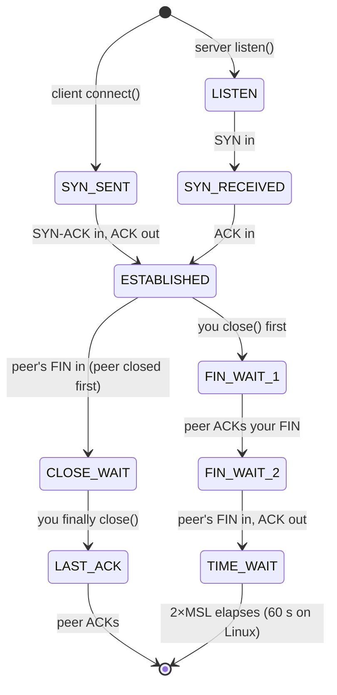

Here is the fact that reorganizes everything you know about connections: **a TCP connection does not exist on the wire.** Capture every packet between two hosts and you will find no connection object — only independent IP packets, each finding its own way through [interfaces and routes](/foundations/linux-networking/). The connection exists in exactly two places: a data structure in the client's kernel and a data structure in the server's kernel, each tracking sequence numbers, windows, timers, and a state machine, both *agreeing to pretend* there is a reliable byte stream between them. Routers in the middle neither know nor care. The only middleboxes that do care are the *stateful* ones — NAT gateways, firewalls, load balancers, and conntrack on every Kubernetes node — which keep their own third copy of the connection state, and whose copy can die while yours lives. **Most of the weird connection failures in a cluster are disagreements between these copies.**

What identifies a connection is the **4-tuple**: (source IP, source port, destination IP, destination port). That's the whole identity — which is why one server socket can serve tens of thousands of concurrent connections on port 8080 (each has a distinct client IP:port), why a client can open at most ~28,000 connections to one destination (the ephemeral port range `cat /proc/sys/net/ipv4/ip_local_port_range` is the only variable left in the tuple), and why [SNAT](/routing/nat/) is so consequential: rewriting the tuple *is* rewriting the connection's identity. A socket, meanwhile, is just a file descriptor — `read()`, `write()`, `close()` all apply, and connection leaks surface as [fd exhaustion](/foundations/stdio-and-file-descriptors/) ("too many open files") as often as anything network-shaped. The authoritative references for everything on this page: [RFC 9293](https://www.rfc-editor.org/rfc/rfc9293) (the current TCP standard, successor to RFC 793) and [tcp(7)](https://man7.org/linux/man-pages/man7/tcp.7.html) for Linux's knobs.

## The handshake: three packets to agree on a fiction

```mermaid
sequenceDiagram
    participant C as client kernel
    participant S as server kernel
    C->>S: SYN, seq=x [MSS, window scale, SACK-permitted]
    Note right of S: entry in SYN queue
    S->>C: SYN-ACK, seq=y, ack=x+1 [server's options]
    C->>S: ACK, ack=y+1
    Note right of S: moved to accept queue —<br/>waiting for the app to accept()
    Note over C,S: ESTABLISHED on both ends; data may flow
```

The client sends a SYN carrying its **initial sequence number** — randomized per connection, so an old packet from a previous connection on the same 4-tuple can't be mistaken for new data. The server answers SYN-ACK (its own ISN, plus acknowledgment); the client ACKs. Three packets, and both kernels now agree on where the byte stream starts in each direction.

The SYN and SYN-ACK also carry the options that set the connection's character for life: **MSS** (largest segment each side will accept — derived from interface MTU, and the reason [MTU mismatches](/foundations/linux-networking/) break big transfers but not handshakes), **window scale** ([RFC 7323](https://www.rfc-editor.org/rfc/rfc7323) — multiplies the 16-bit window field so modern connections can keep more than 64 KB in flight), and **SACK permitted** ([RFC 2018](https://www.rfc-editor.org/rfc/rfc2018) — lets a receiver acknowledge non-contiguous data, so one lost packet doesn't force retransmission of everything after it). **Options are negotiated once, at the handshake, and never again** — a connection's fate is partly sealed before your app even sees it.

### The two queues behind listen()

A listening socket is not a connection — it's a factory with two queues. Handshakes in progress wait in the **SYN queue**; completed handshakes wait in the **accept queue** until the application calls `accept()`. Both are bounded: the application passes a backlog to `listen()`, clamped by `net.core.somaxconn`.

The failure modes are precise and worth memorizing. **"Connection refused" (an RST reply) means the machine answered and nothing is listening on that port** — the app is down, listening on the wrong interface, or you've hit the wrong port; in Kubernetes, also a Service whose backing pod isn't ready. **A silent hang means the SYN got no reply at all** — a firewall drop, a routing black hole, a dead host, or (deliberately) an *overflowing accept queue*: when the queue is full, Linux by default drops the incoming SYN or the final ACK rather than refusing, betting the client will retransmit and the app will have caught up by then. So a slow-to-`accept()` application produces *timeouts*, not refusals — which sends you hunting for network problems when the actual problem is the app not draining its queue. Distinguishing refused from filtered from queue-overflow is half the diagnostic tree in [Service Unreachable](/troubleshooting/service-unreachable/). See the queue with your own eyes:

```console
$ ss -ltn
State   Recv-Q  Send-Q  Local Address:Port
LISTEN  12      128     0.0.0.0:8080
```

**On a LISTEN socket, `ss` repurposes the columns: `Recv-Q` is the current accept-queue depth, `Send-Q` is its limit.** 12 of 128 — fine. Pinned at 128: the app can't accept fast enough, and clients are starting to time out. Node-wide overflow evidence lives in `netstat -s | grep -i 'listen'` ("times the listen queue of a socket overflowed").

## Data transfer: windows, buffers, and what backpressure physically is

TCP delivers a reliable byte stream over an unreliable network with two mechanisms: acknowledgment (every byte is numbered; unacknowledged bytes are retransmitted) and **flow control** — the sliding window. Each ACK a receiver sends advertises how much more it's willing to accept: the free space in its **receive buffer**. The sender may have at most that much data in flight.

This makes backpressure a physical thing, not a metaphor. Trace it end to end: your app stops reading from a socket (busy on a slow query, GC pause, deadlock) → the socket's receive buffer fills → the advertised window shrinks to **zero** → the sender's kernel must stop sending → the *sender's* send buffer fills → the sending app's `write()` blocks (or the connection pool drains, or the message broker backs up). **A stalled consumer freezes its producer through nothing but two buffers and a number in an ACK header.** No error is raised anywhere — everything is working as designed, merely slowly, which is exactly why these incidents present as mysterious latency instead of exceptions.

You can see every stage of that chain in one command from inside either pod:

```console
$ ss -tn
State  Recv-Q   Send-Q   Local Address:Port    Peer Address:Port
ESTAB  318472   0        10.244.1.23:8080      10.244.3.9:41822
ESTAB  0        204800   10.244.1.23:52114     10.96.20.4:9092
```

Line one: 318 KB has arrived that **your app has not read** — the stall is local; profile your app, not the network. Line two: 200 KB written that the kernel **can't deliver** — the peer isn't draining (or the path is lossy; the `retrans` counter under `ss -tni` splits those two). This Recv-Q/Send-Q reading is the single highest-value socket diagnostic in a cluster, and it needs no privileges at all — [the field guide](/troubleshooting/linux-inside-the-pod/) shows the `/proc/net/tcp` fallback when even `ss` is missing.

One latency footnote while we're in the data path: **Nagle's algorithm** (batch small writes until the previous segment is ACKed) and **delayed ACK** (hold ACKs ~40 ms hoping to piggyback them on data) are each individually sensible and pathological together — a request/response protocol making small writes can spend 40 ms per round trip with each side politely waiting for the other. It's why latency-sensitive servers set `TCP_NODELAY` (disabling Nagle), why databases and RPC frameworks mostly do it for you, and the first suspect when a chatty protocol shows a flat ~40 ms floor per operation.

## Teardown: FIN, TIME_WAIT, and the states that accuse your app

Closing is more elaborate than opening, because each direction of the stream closes independently: one FIN/ACK exchange per direction, four packets in the fully general case. The full state machine — worth genuinely knowing, because **`ss` reports these state names and each one is a specific accusation**:



Two states on that diagram generate most of the incidents.

**TIME_WAIT is the side that closed first, waiting out 2×MSL (60 seconds on Linux) before the 4-tuple may be reused.** It exists for two good reasons: a delayed packet from the old connection must not be misread as part of a *new* connection on the same tuple, and the final ACK might need retransmitting if the peer's LAST_ACK times out. So: **thousands of TIME_WAIT sockets are normal on any busy client and are not a problem** — they hold no buffers and nearly no memory. They become a problem only through *arithmetic*: each one pins an ephemeral port to a given destination for 60 seconds, so a client churning short-lived connections to one destination caps out around (port-range ÷ 60) new connections per second — and behind [SNAT](/routing/nat/), where every pod on a node shares the *node's* ephemeral port space toward a destination, the ceiling is shared too. Connection pooling is the real fix; port exhaustion is TIME_WAIT's only genuine crime.

**CLOSE_WAIT is an app bug, full stop.** The kernel enters CLOSE_WAIT when the peer's FIN arrives, and *leaves it only when your application calls `close()`*. A pile of CLOSE_WAIT sockets means peers hung up and your code never closed its end — a missing `close()` in an error path, an HTTP client body never drained, a pool that doesn't reap dead connections. It will never resolve on its own, and it leaks an fd per socket until ["too many open files"](/foundations/stdio-and-file-descriptors/) finishes the job. Count states in one line:

```bash
ss -tan | awk 'NR>1 {print $1}' | sort | uniq -c | sort -rn
```

Mostly ESTAB with a sprinkle of TIME_WAIT: healthy. Hundreds of CLOSE_WAIT: go read your connection-handling code.

## Idle connections, keepalive, and death by middlebox

An idle TCP connection sends nothing. Zero packets — the fiction is maintained entirely by the two endpoint kernels remembering it. This is elegant right up until you recall that stateful middleboxes keep a third copy of the state *with a timeout*: conntrack on every node (5-day default for established flows, per [the sysctl reference](https://docs.kernel.org/networking/nf_conntrack-sysctl.html) — but far shorter on many appliances), cloud NAT gateways (idle timeouts of 350 s or less), corporate firewalls and load balancers (often 5–60 minutes). When the middlebox forgets first, **neither endpoint is told**. The connection dies silently: both kernels still show ESTABLISHED, and the next write sails into a void — met with an RST if you're lucky, retransmission purgatory if you're not.

TCP's built-in answer is keepalive — and here is the number that explains a decade of bugs: **the default keepalive idle time is 7200 seconds. Two hours** (`net.ipv4.tcp_keepalive_time`, and keepalive is *off* unless the app sets `SO_KEEPALIVE` at all). Every middlebox timeout in production is shorter than that, so default keepalive protects nothing. This asymmetry — endpoints remember forever, middleboxes forget in minutes — is the root cause behind "the first request after lunch always fails," behind database pools full of corpses, and behind most of the pathologies cataloged in [Long-Lived Connections](/networking/long-lived-connections/). The fixes are application-level heartbeats (gRPC pings, database pool validation, HTTP/2 PING frames) or aggressive per-socket keepalive; either way, **something must send bytes more often than the dumbest middlebox on the path forgets.**

## RST: the protocol's rudeness, cataloged

A reset is TCP saying "I have no idea what you're talking about" — no state, no negotiation, conversation over. When your app logs *connection reset by peer*, the RST had one of a few producers, and telling them apart is the diagnosis:

| RST arrives... | Producer | Typical Kubernetes cause |
|---|---|---|
| on connect (as the SYN's answer) | peer kernel: nothing listening | app crashed or not yet listening; wrong port; Service selecting a not-ready pod |
| mid-connection, peer process died | peer kernel resetting orphaned sockets | [OOMKilled](/troubleshooting/oomkilled/) or [crash-looping](/troubleshooting/crashloopbackoff/) backend — the reset is the *symptom*, the crash is the story |
| on write to a long-idle connection | middlebox that forgot the flow | conntrack/NAT/LB idle timeout — the silent-death scenario above |
| in bursts during rollouts | stale conntrack entries to deleted pods | endpoint churn; the [dataplane deep dive](/routing/kube-proxy-and-the-dataplane/) walks the race |
| after grace period expiry | dying pod's kernel or dataplane | connections outliving [graceful shutdown](/workloads/graceful-shutdown/) |

The general rule: **an RST on connect points at the destination; an RST mid-stream points at a death or a middlebox.** Correlate the timestamp with pod restarts before blaming the network.

## Retransmission: why dead hosts take so long to fail

When an ACK doesn't arrive within the **retransmission timeout**, the segment is resent and the RTO doubles — 1 s, 2 s, 4 s, 8 s... ([RFC 6298](https://www.rfc-editor.org/rfc/rfc6298); initial SYNs start at 1 s on Linux). With the default `net.ipv4.tcp_syn_retries=6`, a `connect()` to a host that silently drops packets takes about **130 seconds** to fail on its own. That's why unconfigured connect timeouts produce two-minute hangs, why a black-holing endpoint is so much worse than a refusing one (refusal is instant; silence costs the full backoff), and why every client library's timeout settings matter more than almost any other knob — the arithmetic that [Timeout Budgets](/tuning/timeout-budget/) builds on. Established connections are more patient still: ~15 retries over roughly 15 minutes before giving up. Watch it happen live: `ss -tni` shows per-connection `rto`, `retrans`, and `backoff` fields climbing while a connection is in purgatory — retransmissions visible from inside an unprivileged pod, no tcpdump required.

## ss: the five commands worth memorizing

Everything this article described is visible through [ss(8)](https://man7.org/linux/man-pages/man8/ss.8.html), which speaks the state machine natively:

```bash
ss -tn state established '( dport = :5432 )'  # who's talking to the database
ss -tn state time-wait | wc -l                # churn gauge: high = pool your connections
ss -tn state close-wait                       # each line is an unclosed socket = app bug
ss -ltn                                       # listeners + accept-queue depth (Recv-Q/Send-Q)
ss -tnie dst 10.96.44.7                       # full telemetry per connection: rtt, cwnd,
                                              #   retrans, bytes_acked, last-send time
```

That last form is the deep cut: kernel-measured RTT and retransmit counts for a connection *to a ClusterIP*, from an ordinary pod. `retrans:0/23` on an in-cluster connection means the path is dropping packets — evidence you can hand the platform team even though every hop belongs to them.

## The conntrack coda

One thread left to tie. Every connection from a pod through a Service traverses [conntrack](/routing/nat/), which mirrors this article in miniature: it watches the handshake to create an entry, tracks a simplified state machine, times entries out, and *enforces its own opinion* — a packet that doesn't fit any tracked flow can be dropped as INVALID even though both endpoints consider the connection fine. And the conntrack table is finite: when it fills, **new** connections' SYNs are dropped (the intermittent 1–3 s connect hangs [the dataplane article](/routing/kube-proxy-and-the-dataplane/) diagnoses) while established flows glide on untouched. So the full inventory of an in-cluster connection is: two endpoint kernels with real state, plus a conntrack entry on the client's node — three state machines that must agree, [firewall rules](/foundations/firewalls-and-netfilter/) consulted at every hop, all riding the [interfaces and routes](/foundations/linux-networking/) underneath. When they agree, you get the fiction of a reliable byte stream. When they disagree, you get this article's symptom catalog — and now you know which copy of the state to interrogate first.
