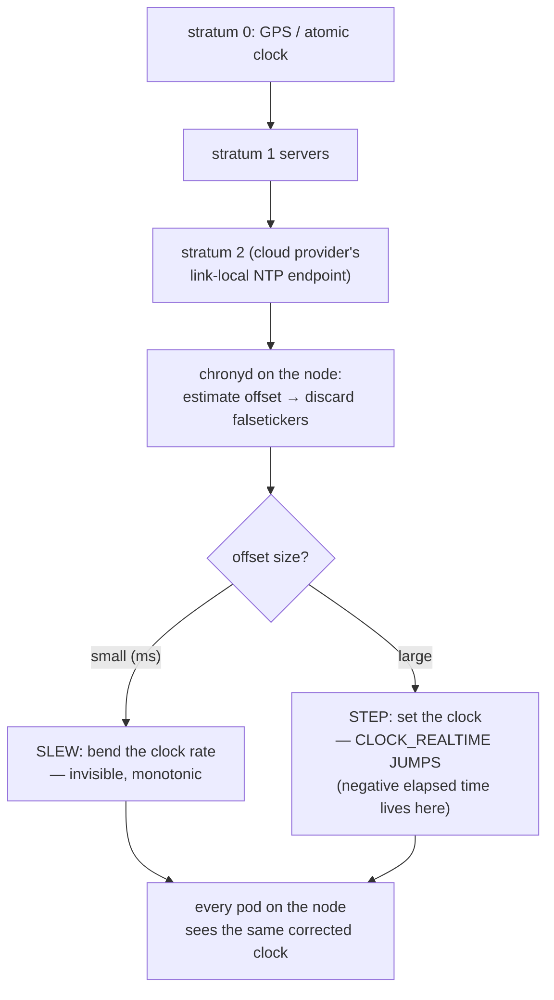

Ask Linux what time it is and you'll get different answers depending on how you ask — and the difference between those answers has broken more distributed systems than most bugs you can name. Time feels like the one thing every machine agrees on; in reality **every node keeps its own clock, every clock drifts, and Kubernetes runs on the polite fiction that they're all close enough**. Most days the fiction holds, because a daemon you've never thought about keeps nudging each clock toward consensus. The days it doesn't, you get the strangest tickets in the queue: TLS handshakes failing with valid certificates, ServiceAccount tokens rejected as "used before issued," traces where the response arrives before the request, CronJobs firing at the wrong moment. This article is about the machinery under all of that: what the clocks actually are, who disciplines them, why containers can't opt out, and the precise mechanisms by which skew becomes symptoms.

## Clocks, plural

The kernel doesn't keep "the time"; it keeps several clocks with different contracts, all read through [clock_gettime(2)](https://man7.org/linux/man-pages/man2/clock_gettime.2.html):

| Clock | What it counts | Can it jump? | Use it for |
|---|---|---|---|
| `CLOCK_REALTIME` | wall-clock time (seconds since the Unix epoch) | **yes — forward and backward** (NTP steps, manual set) | timestamps meant for humans and other machines |
| `CLOCK_MONOTONIC` | time since (roughly) boot | never backward; frequency gently adjusted by NTP; pauses in suspend | **measuring durations** — timeouts, latency, elapsed anything |
| `CLOCK_BOOTTIME` | like monotonic, but keeps counting through suspend | never backward | durations that must survive laptop-style sleep (rare on servers) |
| `CLOCK_MONOTONIC_RAW` | monotonic, with no NTP frequency adjustment | never backward | benchmarking the clock itself |

The table's load-bearing row is the first one, and the classic bug it generates deserves to be walked once in slow motion. You measure a duration the intuitive way:

```c
start = time(NULL);            /* CLOCK_REALTIME under the hood */
do_work();
elapsed = time(NULL) - start;  /* elapsed can be NEGATIVE */
```

Between the two reads, the node's NTP daemon decided the clock was 30 seconds fast and *stepped* it backward. Your "elapsed" time is −28 seconds. Depending on the code around it, that's a negative latency metric, a timer that never fires, a cache entry that never expires, or a retry loop that spins forever. **Wall time tells you *what time it is*; it makes no promise about the gap between two readings. Durations belong to `CLOCK_MONOTONIC`, which promises exactly one thing: it never goes backward.** Mature runtimes learned this the hard way — Go's `time.Now()` secretly carries both clocks and `time.Since` uses the monotonic half; Java's `System.nanoTime()` is monotonic while `System.currentTimeMillis()` is wall — but every language still lets you subtract two wall-clock dates, and every on-call rotation eventually meets the code that does.

## How a node keeps time

Underneath the clock abstractions sits a **clocksource** — the hardware counter the kernel reads. On modern x86 that's the TSC (a per-CPU cycle counter the kernel calibrates and synchronizes); on VMs it's often **kvm-clock**, a paravirtualized clock the hypervisor exports so guests don't have to fight virtualized-TSC weirdness. The kernel tells you which it trusts:

```console
$ cat /sys/devices/system/clocksource/clocksource0/current_clocksource
tsc
```

This matters operationally for one reason: **cloud nodes are VMs, and a VM's sense of time is only as good as the hypervisor's cooperation.** Live migrations, host contention, and suspended instances all perturb guest clocks in ways bare metal never sees — which is why time-sync daemons are not optional on cloud nodes, and why cloud providers ship their own NTP endpoints (link-local, ultra-close) as the default reference.

A hardware counter gives you a *rate*; it doesn't tell you what time it is, and its rate is never exactly right — commodity crystals drift on the order of parts per million, seconds per day. Something has to keep pinning the clock to reality. That something is NTP.

## NTP: the discipline loop

The Network Time Protocol ([RFC 5905](https://datatracker.ietf.org/doc/html/rfc5905)) organizes time sources into **strata**: stratum 0 is the atomic clock or GPS receiver, stratum 1 is a server directly attached to one, stratum 2 syncs from stratum 1, and so on down to your node. The client exchanges timestamped packets with several servers, estimates offset and network delay, discards liars ("falsetickers," in the RFC's charming vocabulary), and then corrects the local clock — and *how* it corrects is the part that bites:

- **Slewing**: for small offsets (tens of milliseconds), the daemon doesn't set the clock; it makes it run imperceptibly faster or slower ([adjtime(3)](https://man7.org/linux/man-pages/man3/adjtime.3.html) / `adjtimex`) until the error melts away. Time stays monotonic; nobody notices.
- **Stepping**: past a threshold (128 ms in classic ntpd; chrony's `makestep` policy, commonly "step if off by >1s, but only in the first few updates"), slewing would take hours or days — so the daemon *sets* the clock, and `CLOCK_REALTIME` visibly jumps, possibly backward. **Every negative-elapsed-time story starts with a step**, which is why sane fleets step once at boot and slew forever after — and why a node that was powered off for a while does its big jump *before* workloads start, if you're lucky.

Two daemons dominate on nodes: **chrony** (the default on RHEL-family and most cloud images — fast convergence, good on unstable VM clocks) and **systemd-timesyncd** (a minimal SNTP client, default on stock Debian/Ubuntu — fine for approximate time, less robust for tight skew). As an application team you don't pick this, but you can *read* it — `chronyc tracking` on a node is the ground truth of "how wrong is this node's clock right now," and it belongs in the [node-problems](/troubleshooting/node-problems/) toolkit.



## Containers do not have their own time

Here is the fact that surprises almost everyone at least once: **of all the resources containerization virtualizes, time is not one. Every pod on a node reads the node's clocks — same `CLOCK_REALTIME`, same `CLOCK_MONOTONIC`, no per-container offset, no isolation.** `date` in a pod is `date` on the node. A time [namespace](/foundations/namespaces/) does exist (kernel 5.6+), but it virtualizes only the *monotonic and boottime* clocks — its purpose is checkpoint/restore, not fake wall time — it cannot offset `CLOCK_REALTIME`, and Kubernetes doesn't use it anyway.

Nor can you set the clock from inside a container: `date -s` needs `CAP_SYS_TIME`, which is never in the default capability set and which no sane cluster grants — [the handcuffs article](/foundations/security-primitives/) explains why the `EPERM` you get is a capability check, not a permission bug. And this is the right design: the clock is shared node state, and a pod that could move it would be moving it *for every workload on the machine*.

The practical consequences run both directions. You can't have a "pod that thinks it's December 31st" for testing by configuration — teams that need fake time inject **libfaketime** via `LD_PRELOAD` (interposing the clock calls in userspace — [the linker article](/foundations/linkers-libc-and-elf/) is the mechanism, and note it only fools the process, not the kernel) or, better, put a clock abstraction in the application and fake it there. Conversely, **you inherit the node's skew invisibly**: your pod's idea of "now" is decided by a chrony config you've never seen, and two replicas on two nodes can legitimately disagree about what time it is. Which brings us to why that disagreement matters.

## Where skew becomes symptoms

Distributed systems care about time because **wall-clock timestamps are the only thing two machines can compare without talking to each other — and skew silently breaks the comparison.** Every entry in this catalog is the same failure wearing a different costume: machine A stamps a moment, machine B judges that stamp against its *own* clock, and the judgment embeds an assumption that the clocks agree.

| Mechanism | The comparison | Skew turns into |
|---|---|---|
| [TLS certificates](/foundations/tls/) | client checks `NotBefore ≤ now ≤ NotAfter` against *its* clock | "certificate is not yet valid" on freshly issued certs; handshake failures on one node only |
| JWTs / [ServiceAccount tokens](/workloads/serviceaccounts/) | verifier checks `iat`, `nbf`, `exp` | "token used before issued"; valid tokens rejected by a skewed API server or webhook |
| [CronJob](/workloads/jobs-and-cronjobs/) schedules | controller-manager's clock vs your mental model | jobs "late" or skipped; `startingDeadlineSeconds` misjudged |
| Leases and leader election | holder renews before others' clocks say it expired | split-brain risk at extreme skew; flapping leadership |
| [Log timestamps](/observability/log-collection/) | you, correlating events across nodes | causality reads backward; the outage "starts" at different times per node |
| [Trace spans](/observability/tracing/) | child span times reported by different hosts | children starting before parents; negative-duration spans |

A few of these deserve their mechanism spelled out.

**Certificates** are the sharpest because the failure is *per-node*: [cert-manager](/controllers/cert-manager/) issues a certificate at 14:00:00 with `NotBefore` a few minutes in the past as skew allowance; a node running four minutes slow still says "not yet valid," and you get TLS failures on exactly one node while every other node shines — a pattern that looks like anything except a clock. The reverse edge is expiry: renewal windows assume the renewing controller and the validating clients roughly agree on when "30 days before expiry" is.

**Tokens** are the same check with shorter fuses. Bound ServiceAccount tokens and OIDC id-tokens carry issued-at and expiry claims measured in minutes or hours; verifiers typically allow a small leeway (often 60 seconds or nothing at all), so a skewed verifier rejects perfectly valid credentials — and because token validation sits inside API calls, webhooks, and service-to-service auth, the surface symptom is scattered 401s with impeccable-looking configuration.

**Leases** are how Kubernetes itself consumes time. Leader election among controller replicas works by one holder repeatedly renewing a Lease object before its duration lapses, while challengers watch for it to go stale — and "stale" is judged by each observer's *own* clock against a duration, not a shared timestamp, precisely to keep modest skew survivable. The design mostly succeeds: components measure the lease window with monotonic-style timers locally. But the guarantees soften at the edges — a leader whose node's clock (or whole VM) pauses long enough can keep acting on a lease another replica already considers expired, finishing an in-flight write after losing leadership. Etcd's own leases carry the same caveat in their documentation. The honest summary: **Kubernetes is engineered to tolerate small skew, not to be immune to time going wrong.**

**CronJobs** answer a question people rarely ask until it burns them: *whose clock fires the schedule?* Not the node your pod lands on and not yours — **the controller-manager evaluates cron expressions against its own host's clock (in its own time zone, UTC in any sane control plane, unless the modern `timeZone` field says otherwise)**. Skew there shifts every schedule in the cluster; `startingDeadlineSeconds` is then judged against the same clock.

**Ordering** is the deepest one. If machine A writes at `t=100` and machine B writes at `t=99` *by their own clocks*, which write is newer? Any system that answers by comparing the timestamps has bet correctness on NTP. Databases that use time for transaction ordering guard this bet elaborately (Spanner's TrueTime bounds uncertainty with GPS and atomic clocks precisely so it can *wait out* the ambiguity) — and when the bet goes wrong the results are spectacular; this site's blog tells the war story of a database whose idea of time travel cost a weekend. For your day-to-day: **treat cross-node timestamps as approximate, centralize logs and trust *ingestion* order only cautiously, and lean on trace IDs and causal metadata rather than clock arithmetic when reconstructing an incident.**

And one calendar-scale footnote: UTC occasionally inserts a **leap second**, and a literal 23:59:60 has historically crashed enough software that large fleets now "smear" it — running clocks fractionally slow across a day so the extra second dissolves. Your cloud's NTP servers almost certainly smear; it's one more reason all nodes should sync to the *same* source family rather than a mix.

## Two timelines in your logs

The clock split from the first section resurfaces every time you read logs. Kernel messages and `dmesg` stamp with *monotonic* seconds-since-boot (`[86471.204512]`); journald stores both monotonic and wall timestamps; your app logs wall time; [`kubectl` events](/observability/log-collection/) and API objects use the wall clocks of whichever component wrote them. Correlating a kernel OOM line with an application error therefore requires converting timelines — anchor them with the boot time:

```bash
cat /proc/uptime            # seconds since boot: monotonic "now"
date +%s.%N                 # wall "now"
# wall_time_of_event ≈ (wall now) − (uptime now) + (monotonic stamp)
```

— which works precisely *because* monotonic never jumps ([the uptime plumbing](/foundations/processes-and-signals/) is shared with process start-time accounting). If the wall clock stepped since boot, the conversion is off by the step: one more reason ops folklore says "reboot after big clock changes."

## See it yourself

From inside any pod — remember, you're reading the *node's* clocks:

```bash
date -u +%s.%N              # wall clock, epoch seconds
cat /proc/uptime            # monotonic-ish: seconds since node boot
date -s "2020-01-01"        # EPERM — no CAP_SYS_TIME in a container
```

Measure real inter-node skew with two pods pinned to different nodes — crude but revealing (subtract your own round-trip feel; for sub-second work use the node's chrony instead):

```bash
for p in pod-on-node-a pod-on-node-b; do
  kubectl exec $p -- date -u +%s.%N &
done; wait
```

On a node (or via your platform team, who own this layer):

```bash
timedatectl                  # NTP on? synced? which service?
chronyc tracking             # current offset, drift rate, stratum
chronyc sources -v           # which servers, who's selected, who's a falseticker
cat /sys/devices/system/clocksource/clocksource0/current_clocksource
```

`chronyc tracking`'s "System time" line — *"0.000041 seconds slow of NTP time"* — is the single number this whole article orbits: keep it in microseconds-to-low-milliseconds and every mechanism in the catalog stays invisible.

And when TLS misbehaves on one node, interrogate the certificate's window directly against that node's clock:

```bash
openssl x509 -in cert.pem -noout -dates
# notBefore=Jul 18 14:00:00 2026 GMT
# notAfter =Oct 16 14:00:00 2026 GMT
date -u                       # is "now" inside the window ON THIS NODE?
```

**When a security artifact fails validation on some nodes and not others, check the clocks before the certificates — the clock is the input to every validity check, and it's the input nobody looks at first.** Time is the quietest dependency in the stack: no YAML declares it, no probe checks it, and everything from [the TLS handshake](/foundations/tls/) to your trace waterfalls silently assumes it. Now that you know who keeps it — a crystal, a counter, a discipline loop, and a daemon on a node you don't own — the strangest tickets in the queue get a first question worth asking: *what did each machine think the time was?*
