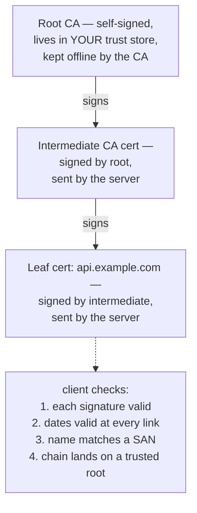
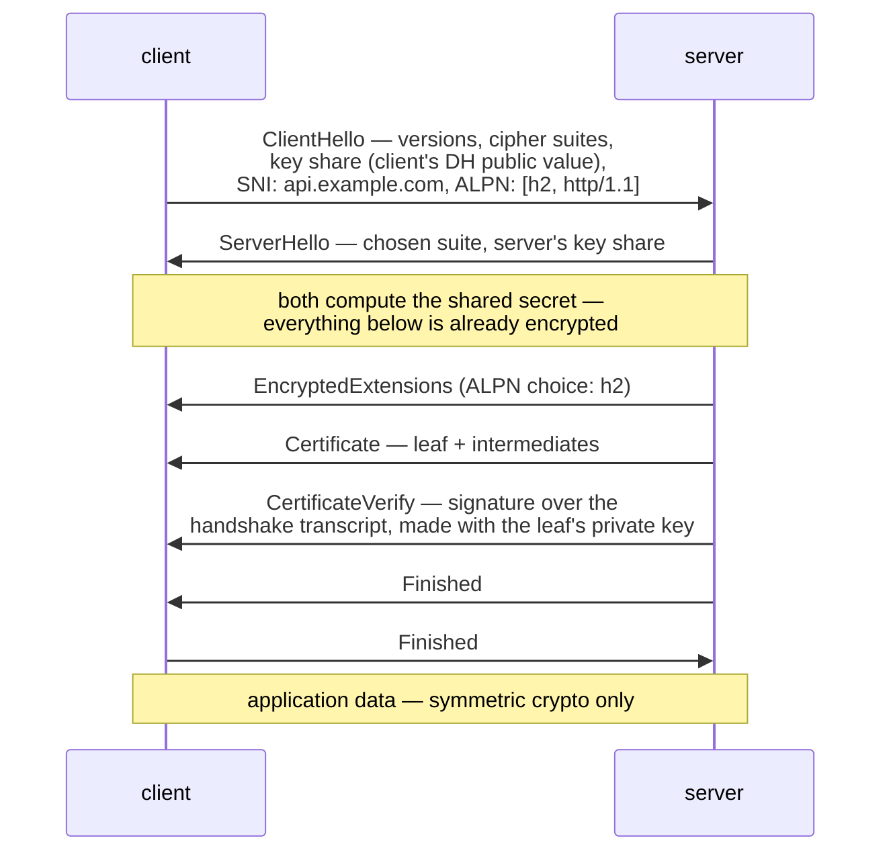

Here is the fact that reorganizes everything you know about TLS: **almost none of your encrypted traffic is encrypted with the fancy math.** Public-key cryptography — the RSA and elliptic-curve machinery that certificates are built on — is thousands of times too slow to encrypt a video stream or a database dump. So TLS uses it for milliseconds per connection, to do exactly two jobs: *prove who the server is* and *agree on a shared secret*. Then the asymmetric machinery leaves the stage, and boring, fast symmetric encryption (AES, ChaCha20) carries every byte after the handshake. **TLS is an identity ceremony that bootstraps a symmetric session** — and once you see it that way, certificates, chains, SNI, ALPN, and every `x509:` error message in your logs snap into a single coherent picture. The protocol's definitive source is [RFC 8446](https://www.rfc-editor.org/rfc/rfc8446) (TLS 1.3); certificates live in [RFC 5280](https://www.rfc-editor.org/rfc/rfc5280).

## Key pairs: sign vs encrypt

An asymmetric key pair is two mathematically-entangled numbers: what one key does, only the other can undo. That yields the two primitives everything else is assembled from:

- **Encrypt to the public key** → only the private key can decrypt. Anyone can send a secret to the keyholder.
- **Sign with the private key** → anyone with the public key can verify. Only the keyholder could have produced it.

Why not just encrypt everything this way? Because the math is brutal: an RSA private-key operation costs on the order of a millisecond of CPU, while AES with hardware support moves *gigabytes* per second per core — a four-to-five-orders-of-magnitude gap. Asymmetric operations are priced per-handshake; symmetric operations are priced per-byte. Any design that gets the economics backwards doesn't ship.

Signing in practice is *hash-then-sign*: the document is [hashed](/foundations/hashing/) and the private key operates on the digest — which is why a broken hash breaks signatures, and why cert fingerprints and signatures are cousins. **The private key never travels. Ever.** A server proves it holds the key by *performing* an operation only the keyholder can perform — the same challenge-shaped logic as [SSH's public-key auth](/foundations/ssh/), and the reason "send me your cert" is harmless while "send me your key" is a breach.

## A certificate is a signed claim, nothing more

Strip the mystique: **an X.509 certificate is a public key, a set of names, a validity window, and a CA's signature over all of it.** That's the whole artifact. Decode any cert and you'll find:

```console
$ openssl x509 -in cert.pem -noout -subject -issuer -dates -ext subjectAltName
subject=CN=api.example.com
issuer=C=US, O=Let's Encrypt, CN=R11
notBefore=Jun 20 09:15:00 2026 GMT
notAfter=Sep 18 09:14:59 2026 GMT
X509v3 Subject Alternative Name:
    DNS:api.example.com, DNS:www.api.example.com
```

Three fields do the operational work. The **SAN list** (Subject Alternative Names) is what hostname verification checks — the legacy CN field is ignored by modern clients, a fact that still surprises people minting internal certs. The **validity window** makes every certificate a slowly ticking clock — and makes TLS one of the systems that [cares deeply about your nodes' clocks](/foundations/time/): a skewed clock turns a valid cert into a `notBefore`-in-the-future handshake failure. And the **issuer's signature** is the load-bearing trust: the cert means nothing by itself; it means something because a party you already trust vouched for the binding between name and key.

### Chains and trust stores

Root CAs are too valuable to use daily, so they sign **intermediates**, which sign **leaves**. Verification walks the chain upward: leaf signed by intermediate? Intermediate signed by root? Root present in my **trust store** — the bag of pre-installed root certs my OS or runtime ships (`/etc/ssl/certs` on most Linux, `cacerts` in a JVM, a compiled-in list in Go unless told otherwise)?



Two chain facts cause most incidents. **The server must send the intermediates** — clients only hold roots, so a server that sends just its leaf breaks strict clients while browsers (which cache intermediates) shrug, producing "works in Chrome, fails in curl." And **trust stores are per-runtime, not per-machine**: updating `/etc/ssl/certs` does nothing for the JVM reading its own `cacerts`. This is precisely the corporate-CA trap — a TLS-intercepting proxy re-signs everything with a company CA that must be installed into *every* trust store in *every* container image, and [TLS and Corporate CAs](/networking/tls-and-corporate-cas/) is the practice page for that particular purgatory.

Contrast this whole apparatus with SSH: [SSH trusts keys on first use](/foundations/ssh/) (TOFU — you vouch for the host key yourself, once), while TLS delegates trust to a CA hierarchy so that *strangers* can trust each other on first contact. PKI is TOFU with the "first use" outsourced to someone with an audited signing ceremony.

## The TLS 1.3 handshake, walked



The elegance worth savoring: the client sends its ephemeral Diffie-Hellman **key share** in the very first packet, betting on the curve the server will pick, so **key agreement completes in one round trip** and the certificate itself arrives already encrypted. `CertificateVerify` is where the ceremony pays off — a signature over the entire handshake transcript, which only the holder of the certificate's private key could produce. That one signature is the moment authentication actually happens: the cert says "this key speaks for api.example.com," and the signature proves the server holds that key *for this specific handshake* (no replay possible, since the transcript includes both sides' random values).

TLS 1.2, still common in enterprise paths, differs in ways you'll notice at debug time: two round trips instead of one, key exchange negotiated *after* the hellos, certificates sent in cleartext (a middlebox can see 1.2 certs on the wire; 1.3 hides them), and a menagerie of weaker cipher suites that scanners will nag about. Session **resumption** exists in both — 1.3 uses session tickets that can even carry early data (0-RTT) — trimming repeat handshakes to nearly nothing; connection pools make it matter less than benchmark literature implies.

### SNI: many names, one address

The server needs to present a certificate *before* it knows which site the client wants — but one IP hosts hundreds of names. **SNI** ([RFC 6066](https://www.rfc-editor.org/rfc/rfc6066)) solves it: the ClientHello carries the desired hostname in cleartext, and the server picks the matching cert. This is mechanically how every [ingress controller does TLS virtual hosting](/networking/ingress-nginx/) — one LoadBalancer IP, one listener, certificate selected per-handshake by SNI — and why testing with an IP address or a hollow `openssl s_client` (no `-servername`) gets you the *default* cert and a spurious name-mismatch error. Because SNI is plaintext, it's also what corporate firewalls filter on; ECH (Encrypted ClientHello, ESNI's successor) exists to close that leak but remains sparsely deployed.

### ALPN: choosing the protocol inside

The handshake also negotiates *what will be spoken* inside the tunnel: **ALPN** ([RFC 7301](https://www.rfc-editor.org/rfc/rfc7301)). The client offers `[h2, http/1.1]`; the server picks one in EncryptedExtensions. **This is where HTTP/2 is chosen — not in HTTP itself**: browsers only speak h2 over TLS-with-ALPN, and a load balancer that terminates TLS but doesn't offer h2 silently downgrades everything behind it to HTTP/1.1. Whether that matters — and why gRPC cares desperately — is the business of [the HTTP deep dive](/networking/http/).

## Verification failures: the taxonomy

Every TLS error you've ever seen in a log is one of four checks failing. Map the strings to the check and you skip an hour of guessing:

| Check failed | curl says | Go says | Java says | Usual cause in a cluster |
|---|---|---|---|---|
| Chain doesn't reach a trusted root | `unable to get local issuer certificate` / `self-signed certificate in certificate chain` | `x509: certificate signed by unknown authority` | `PKIX path building failed` | corporate CA not in the image's trust store; server not sending intermediates; self-signed backend |
| Name not in SANs | `certificate subject name does not match target host name` | `x509: certificate is valid for X, not Y` | `No subject alternative names matching` | connecting by IP or ClusterIP instead of the cert's name; SNI not sent; cert minted with CN only |
| Validity window | `certificate has expired` | `x509: certificate has expired or is not yet valid` | `CertificateExpiredException` | rotation didn't happen; [clock skew](/foundations/time/) making valid certs "not yet valid" |
| Server rejects *client's* cert | (handshake alert from server) | `remote error: tls: bad certificate` | `Received fatal alert: bad_certificate` | mTLS endpoint and you sent no/expired client cert |

One habit converts these from mysteries to readings: the error names *which check* failed, and each check has a one-line `openssl` verification (below). The chronic offender in enterprises is row one, and its dedicated page is [TLS and Corporate CAs](/networking/tls-and-corporate-cas/).

## mTLS: the handshake, symmetrized

Everything above authenticated only the server. In **mutual TLS** the server additionally sends a `CertificateRequest`, and the client answers with its own certificate and its own `CertificateVerify` — the identical proof, run in the other direction. Now both ends know who they're talking to, cryptographically, before a byte of application data flows.

The reason you mostly *don't* hand-roll mTLS: certificate logistics squared. Every client needs a cert, a private key, rotation before expiry, and a CA both sides agree on — for every pair of services. **This is precisely the drudgery a [service mesh](/networking/service-mesh/) automates**: the mesh runs its own CA, issues short-lived certs to every workload (identity derived from the pod's ServiceAccount), rotates them hourly-ish, and terminates mTLS in the sidecar — your app speaks plaintext to localhost and the mesh wraps it. Workload identity, encryption in transit, and "which pod may call which" policy, all riding the machinery this page described.

## Where TLS lives in Kubernetes

You run more TLS than you think; a cluster is a small PKI civilization:

| Where | Who's authenticating whom | Whose problem when it breaks |
|---|---|---|
| kubectl → API server | Server cert (cluster CA); your client cert or token | kubeconfig CA data; the classic `x509: certificate signed by unknown authority` after cluster rebuilds |
| API server → kubelet | Both directions — kubelet serving certs | node join/rotation issues; usually the platform team |
| API server → [admission webhooks](/controllers/admission-webhooks/) | Webhook's serving cert, signed by a CA named in `caBundle` | the #1 webhook failure: cert rotated, caBundle stale — API calls time out or fail closed |
| Ingress → clients | The certs in your `kubernetes.io/tls` Secrets | expired ingress certs; SNI/default-cert confusion |
| [cert-manager](/controllers/cert-manager/) | Automates issuance/renewal for the above | the controller everyone deploys so rows 3–4 stop being manual |
| CRD conversion webhooks, aggregated APIs, etcd peers | Internal certs throughout | control-plane cert expiry — famously bricks unattended clusters |

Ingress deserves the one extra distinction — **where TLS terminates** decides what's encrypted where:

- **Edge termination**: the [ingress controller](/networking/ingress-and-routing/) decrypts; pod traffic behind it is plaintext HTTP. Simple; the default; means in-cluster hops are clear unless a mesh re-encrypts.
- **Re-encrypt**: terminate at the edge, then a *second* TLS connection to the backend. Two certs, two verifications, twice the expiry surface.
- **Passthrough**: the LB forwards raw TLS bytes, routing only on the cleartext SNI; the *pod* holds the cert and key. Required when the backend must see the client handshake (mTLS to the pod); costs you L7 routing, since the LB can't read anything.

The cert and key for ingress live in a Secret of type `kubernetes.io/tls` — two keys, `tls.crt` and `tls.key`, base64 like any [Secret](/workloads/secrets/) — which makes cert *rotation* a matter of updating a Secret and getting every consumer to reload it. That last clause is the pain: some controllers watch and hot-reload, some need a nudge, and a cert that rotated in the Secret but not in the serving process is a classic "we renewed it, why is it still expired" incident. [cert-manager](/controllers/cert-manager/) closes the loop end to end — ACME challenges, renewal at two-thirds lifetime, Secret updates — which is why it's near-universal furniture.

## See it yourself

`openssl s_client` is the debugger; five invocations cover the whole article:

```bash
# The handshake + full chain as sent. -servername sets SNI — omit it and
# you're testing the default vhost, not your site:
openssl s_client -connect api.example.com:443 -servername api.example.com -showcerts </dev/null

# Decode the leaf: who is it for, who signed it, when does it die?
openssl s_client -connect api.example.com:443 -servername api.example.com </dev/null 2>/dev/null \
  | openssl x509 -noout -subject -issuer -dates -ext subjectAltName

# Watch ALPN choose the protocol (look for "ALPN protocol: h2"):
openssl s_client -connect api.example.com:443 -servername api.example.com -alpn h2,http/1.1 </dev/null 2>&1 | grep ALPN

# Verify a chain the way a client would, against a specific CA:
openssl verify -CAfile corporate-root.pem server-chain.pem

# Inspect a cluster TLS secret's cert without leaving kubectl:
kubectl get secret my-tls -o jsonpath='{.data.tls\.crt}' | base64 -d \
  | openssl x509 -noout -subject -dates -ext subjectAltName
```

Two habits worth adding to the toolkit. `curl -v https://...` narrates the handshake in prose — the TLS version, the chosen cipher, ALPN result, and the full subject/issuer/dates of the presented cert — which makes it the fastest first look when you don't remember `s_client` flags. And for the expiry sweeps that prevent incidents instead of explaining them, loop the Secret inspection across a namespace:

```bash
for s in $(kubectl get secrets -o name --field-selector type=kubernetes.io/tls); do
  printf '%s: ' "$s"
  kubectl get "$s" -o jsonpath='{.data.tls\.crt}' | base64 -d \
    | openssl x509 -noout -enddate
done
```

Sixty seconds of shell that finds the certificate which would otherwise find you — at 3am, thirty days from now, when it expires.

Run the second command against anything that's failing and read it against the taxonomy table: wrong SANs, dead dates, or an issuer you don't trust — one of the three, every time. **A TLS failure is never mystical; it is one specific check, failing for one inspectable reason**, in a ceremony whose entire purpose is to let two strangers build a private channel out of nothing but math, names, and a third party's signature. The asymmetric crypto proves identity, the handshake mints a symmetric secret, and everything after that is just fast, boring encryption — exactly as designed.
