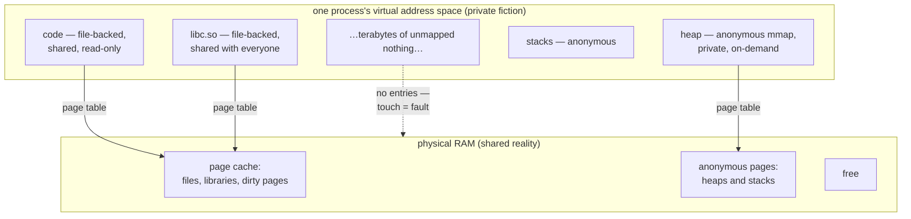

Here is the fact that reorganizes everything you know about memory: **no process has ever touched physical RAM directly.** Every pointer your application dereferences — every object on the heap, every instruction it executes — names a *virtual* address, a coordinate in a private fiction the kernel maintains per process. The hardware translates that fiction to physical reality on every single access, and the kernel exploits the gap between the two ruthlessly: it hands out address space it has no memory to back, shares one physical page among fifty processes that each believe they own it, keeps your files in RAM without telling anyone, and reclaims it all behind your back. **Nearly every confusing memory number in Kubernetes — the 4 GB VSZ on a 512 Mi pod, the "90% memory usage" that's actually fine, the `kubectl top` value that matches nothing in `ps`** — is a different accounting of this one gap between virtual promise and physical fact.

This article is the memory half of the budget story: [cgroups](/foundations/cgroups/) explains how Kubernetes *limits* memory; this one explains what memory *is*, so the numbers being limited stop being interchangeable mysteries. The primary sources for everything here: the kernel's [memory management docs](https://docs.kernel.org/admin-guide/mm/index.html), [mmap(2)](https://man7.org/linux/man-pages/man2/mmap.2.html), and [proc(5)](https://man7.org/linux/man-pages/man5/proc.5.html) for every file we'll read.

## What an address actually is

When your process reads `*p`, the CPU does not send `p` to the RAM chips. The address goes through the **MMU** (memory management unit), which walks a per-process **page table** — a radix tree the kernel maintains — mapping virtual page numbers to physical page frames. Memory is managed in **pages**, 4 KB each on x86-64 (`getconf PAGE_SIZE`), so the mapping isn't byte-by-byte but 4 KB-chunk by 4 KB-chunk. A small cache of recent translations (the TLB) makes the common case free; the page table is consulted only on a TLB miss.

Because every process has its *own* page table, every process gets the same clean fiction: a private address space, tens of terabytes wide, starting near zero, with the same libraries at the same addresses it always had. **Every process "has" the whole machine — because addresses are per-process names, not places.** Two pods can both have a heap at `0x7f2a00000000` without conflict, the same way two houses on different streets can both be number 42.

The load-bearing consequence: a page-table entry can be *empty*. Nothing forces a virtual page to have physical memory behind it — and mostly, it doesn't.

## Demand paging: memory you asked for but don't have

When you `malloc(1 GB)`, the allocator asks the kernel for address space and the kernel says yes — by writing down "this range is valid" and doing *nothing else*. No RAM moves. The first time you actually touch a page in that gigabyte, the MMU finds an empty entry and raises a **page fault**; the kernel's fault handler grabs a free physical frame, zeroes it, wires it into the page table, and restarts your instruction. You never notice. That's demand paging: **memory is allocated on first touch, one page at a time, not at malloc time.**

Faults come in two grades, and the distinction is a production diagnostic:

- A **minor fault** is resolved from RAM — a fresh zero page, or a page that was already in memory (the page cache, a shared library another process loaded). Cost: microseconds. Millions are normal.
- A **major fault** requires **disk I/O** — the page has to be read from a file or (with swap) from the swap device. Cost: milliseconds; a 1000× cliff.

Watch the split per process with `ps -o min_flt,maj_flt -p <pid>`, or live with `sar -B`. The pathology to remember: **when memory gets tight, the kernel starts evicting pages that are still needed — executable pages of your own binary included — and they fault straight back in as major faults.** The process is technically running but spends its life re-reading itself from disk. A pod near its memory limit that turns slow *before* it gets [OOMKilled](/troubleshooting/oomkilled/) is often in exactly this thrash: watch `majflt` climb, and check the pressure files ([PSI](/foundations/cgroups/)) that were built to measure precisely this.

## The memory zoo: four numbers that all claim to be "memory usage"

Because a page can be mapped-but-absent, present-and-private, or present-and-shared-with-nine-other-processes, there is no single honest number for "how much memory does this process use." There are at least four, and **most memory arguments in a team are two people quoting different rows of this table:**

| Metric | What it counts | Where to read it | When it lies |
|---|---|---|---|
| **VSZ** (virtual size) | All mapped address space — touched or not, shared or not | `ps -o vsz`, `/proc/<pid>/status` VmSize | Almost always. A JVM maps heap ceilings, thread stacks, and code caches it may never touch; Go maps a huge arena up front. **VSZ is a statement of intent, not usage — ignore it.** |
| **RSS** (resident set size) | Physical pages currently present in RAM for this process | `ps -o rss`, `/proc/<pid>/status` VmRSS, `smaps_rollup` Rss | Double-counts sharing: a 40 MB libc resident in 50 processes adds 40 MB to *each* RSS. Sum RSS across a node and you exceed the RAM you own. |
| **PSS** (proportional set size) | RSS with shared pages divided by their number of sharers | `/proc/<pid>/smaps_rollup` Pss | The honest per-process number — but expensive to compute, so nothing samples it continuously. |
| **Working set** (what `kubectl top` shows) | Cgroup's `memory.current` **minus `inactive_file`** — everything charged, less the file cache the kernel would drop first | `memory.current`, `memory.stat` in `/sys/fs/cgroup` | Counts *active* page cache and kernel objects as "usage," so it's bigger than RSS; and it's per-cgroup, not per-process. It's also **the number eviction decisions use** — the one that matters. |

Two rows deserve engraving. **PSS exists because RSS double-counts**: when you genuinely need to know which process is heavy on a crowded node, `awk '/^Pss:/ {print $2}' /proc/<pid>/smaps_rollup` is the fairest answer available. And **`kubectl top` ≈ working set**: the kubelet reports `memory.current - inactive_file`, on the theory that inactive file cache is reclaimable and shouldn't count against you — but *active* file cache still counts, which is the seed of the "90% memory" panic we'll defuse below. When you graph memory in [PromQL](/observability/promql-for-resources/), `container_memory_working_set_bytes` is this number; `container_memory_rss` is the RSS row; choosing between them *is* choosing a row of this table.

## The page cache: the kernel is hoarding your files, and you should thank it

Read a file and the kernel keeps the pages in RAM afterward — indefinitely, until something better comes along. That's the **page cache**, and on a healthy node it's most of "used" memory. This forces the fundamental split in how every physical page is classified:

- **File-backed** memory has a home on disk (the file itself). Clean copies can be dropped instantly — the data is safe on disk; re-reading it later is just a major fault. **Dropping clean page cache costs nothing now and a disk read later.**
- **Anonymous** memory — heap, stacks — has *no* backing file. It cannot be dropped, only swapped out (and Kubernetes nodes classically have no swap — see below). **Anonymous memory is a hostage; file-backed memory is a guest.**

The kernel tracks both kinds on LRU lists, split into **active** (recently referenced) and **inactive** (not lately) — visible per-cgroup in `memory.stat` as `active_anon`, `inactive_anon`, `active_file`, `inactive_file`. Under pressure, reclaim walks the inactive file list first (free wins), then active file, and only then starts on anonymous pages. This ordering is why the working-set formula subtracts `inactive_file` — it's the slice the kernel would sacrifice first and most cheaply.

Writes ride the same cache: writing to a file dirties pages in RAM, and your `write()` returns long before the disk hears about it. **Dirty pages** are flushed by background writeback (or synchronously when a database calls `fsync` — the durability story in [Storage and Filesystems](/foundations/storage-and-filesystems/), which owns the page cache's write-side consequences; we won't repeat them here). The read-side consequence belongs to this article: **a pod that reads or writes a lot of files "uses" a lot of memory, harmlessly, and its cgroup gets the bill** — file pages are charged to the cgroup that first touched them, which is how a log-heavy or file-scanning pod ends up with a scary `memory.current` made mostly of droppable cache.

## mmap: files, libraries, and where your heap actually comes from

[mmap(2)](https://man7.org/linux/man-pages/man2/mmap.2.html) is the syscall that wires all of this together: it maps a range of virtual addresses either to a file (file-backed) or to nothing (anonymous). Three uses cover nearly everything in your pods:

**File mapping.** Map a file and its pages appear in your address space, faulted in from the page cache on touch. The file *is* the memory; the page cache is the meeting point.

**Shared libraries.** Every process using glibc has it mmap'd from the same file — so the same physical pages appear in every mapper's page table. This is exactly the RSS double-count, and it's also why two containers from the same image are cheaper than two different images: same lowerdir files, same page cache pages, one physical copy.

**Your heap.** The folklore says heaps grow via `brk`; modern allocators overwhelmingly use anonymous mmap. The JVM mmaps its entire maximum heap reservation at startup (there's your gigantic VSZ, meaningless as promised — the sizing story lives in [the JVM-in-containers article](/java/jvm-in-containers/) and [its tuning companion](/tuning/jvm-memory-knobs/)); Go's runtime grows its arenas the same way. **When your app "allocates memory," it is asking mmap for address space and paying for it later, page by page, on first touch** — which is why a JVM's RSS climbs gradually toward `-Xmx` as the heap gets touched, rather than jumping there at boot.



## Swap, and why Kubernetes said no

Swap gives anonymous memory somewhere to go: under pressure, the kernel writes cold heap pages to disk and reclaims the RAM, faulting them back (majorly) on touch. It's a real mechanism with a real use — keeping truly-cold pages of oversized processes out of RAM.

Kubernetes historically required swap **off**, and the reasoning is worth respecting rather than memeing: with swap, a pod exceeding its memory budget doesn't die — it *slows down*, unpredictably, as its heap thrashes to disk, taking node-neighbors' I/O with it. Requests and limits stop meaning anything (what does `memory.max` mean if the kernel can shuffle the excess to disk?), and failures turn from crisp OOM kills — visible, attributable, restartable — into gray latency smears. **Predictable death beats unpredictable slowness** in a system built to restart things automatically; that trade is most of the answer.

The honest present tense: `NodeSwap` graduated beta and nodes *can* run with swap (`failSwapOn: false`, `swapBehavior: LimitedSwap` — only Burstable pods get swap, bounded proportionally). It exists for real reasons (memory-overcommitted edge nodes, giant cold heaps). But as of now it remains opt-in, uncommon in managed clusters, and something you should assume is **off** unless your platform team says otherwise — meaning: for your pods, anonymous memory has nowhere to go, and the memory limit is a genuine cliff.

## Overcommit: why malloc never fails and the OOM killer exists

Demand paging creates a bookkeeping question with teeth: if mappings cost nothing until touched, should the kernel let processes map more than the machine can ever back? Linux's default answer (`vm.overcommit_memory=0`, "heuristic") is *yes, within reason* — because most mappings are never fully touched (every JVM's reserved-but-unused heap, every thread stack's untouched guard pages), refusing at map time would waste enormous amounts of real RAM on unkept promises.

The consequence chain is one of the great asymmetries of Linux: **malloc almost never fails, because the check happens at promise time when everything looks affordable; the reckoning comes at *touch* time, when a page fault finds no free frame and nothing left to reclaim — and at touch time there is no error to return.** Your code isn't in a `malloc` call it could see fail; it's dereferencing a pointer it validly owns. So the kernel can't return `ENOMEM` to anyone — it has to *pick a process and kill it*. That is the OOM killer's entire reason for existing: it is the error path of overcommit, deferred from allocation to touch and converted from an errno into a SIGKILL. The full walk of *how* it picks — badness scores, `oom_score_adj`, the cgroup-scoped kill, why your whole container dies since `memory.oom.group` — lives in [the cgroups article's OOM section](/foundations/cgroups/) and the practical aftermath in [OOMKilled](/troubleshooting/oomkilled/); this article's contribution is just the *why*: **the OOM killer is not a bug or a policy choice you can argue with — it's the only possible ending for a promise the kernel made at mmap time and can't keep at fault time.**

## Transparent Huge Pages, briefly

The kernel can back mappings with 2 MB pages instead of 4 KB ones — 512× fewer TLB entries and page-table walks, a genuine throughput win for big-heap workloads. Transparent Huge Pages (THP) does this automatically, and its costs arrive as *latency*: `khugepaged` compacting memory in the background, stalls while the kernel hunts for 2 MB of contiguous free memory, and write amplification for sparse access patterns. This is why database installation guides (Redis, MongoDB, Oracle) tell you to disable THP or set it to `madvise`, and why a p99 latency mystery on a memory-heavy pod is worth one check: `cat /sys/kernel/mm/transparent_hugepage/enabled` — on the *node*, because like most of `/sys`, it's global.

## See it yourself: reading a process honestly

The one file worth memorizing is `/proc/<pid>/smaps_rollup` — per-process memory truth, readable from inside an unprivileged pod:

```console
$ cat /proc/self/smaps_rollup
Rss:              184320 kB
Pss:               98212 kB
Shared_Clean:      88104 kB
Private_Clean:      2048 kB
Private_Dirty:     94168 kB
Referenced:       160256 kB
Anonymous:         92120 kB
Swap:                  0 kB
```

Read it like a story: **Rss** 180 MB present, but **Pss** says the fair share is 98 MB — the 88 MB of **Shared_Clean** is libraries split with other processes. **Anonymous** (92 MB) is the hostage memory — heap and stacks, unreclaimable. **Private_Dirty** ≈ anonymous here: pages that are yours alone and can't be dropped. The gap between Rss and Anonymous is roughly your file-backed, mostly-droppable share. When someone asks "how big is this process *really*," Pss and Anonymous are the two defensible answers.

Then place the process in its budget — the cgroup files, from inside the pod:

```bash
cat /sys/fs/cgroup/memory.current          # everything charged to this container
cat /sys/fs/cgroup/memory.max              # the cliff
grep -E 'inactive_file|active_file|anon' /sys/fs/cgroup/memory.stat
# working set ≈ memory.current - inactive_file  ← what kubectl top shows
```

And the trap that never stops catching people: **`/proc/meminfo` is not namespaced.** `free -m` inside a pod describes the *node* — all 64 GB of it — which is why `free` in a container is nearly always the wrong tool and the cgroup files are the right one. [Linux Inside the Pod](/troubleshooting/linux-inside-the-pod/) is the field guide to which file answers which 2am question.

## The two pathologies, told apart

**The "90% memory" panic.** A dashboard shows the pod at 90% of its limit; someone pages you. Check the composition first:

```bash
awk '$1=="inactive_file"||$1=="active_file"||$1=="anon" {print}' /sys/fs/cgroup/memory.stat
```

If the bulk is `active_file`/`inactive_file`, this is page cache — the pod reads or writes files, the kernel kept them cached, the cgroup got billed. **Cache-heavy "usage" is self-limiting: under pressure the kernel reclaims it before anything drastic happens.** The working-set metric already forgave the inactive slice; active file cache can still make the number look hot while being almost as reclaimable. A cache-dominated 90% is a shrug.

**The real leak.** If `anon` is what's growing, nobody can reclaim it — only the application can free it. The two curves are distinguishable by shape and by response to pressure: cache growth plateaus and *retreats* when the cgroup nears its limit (watch `memory.stat` across a load spike — file pages fall, anon holds); a leak's `anon` line climbs monotonically through pressure until the [OOM kill](/troubleshooting/oomkilled/). Graph `container_memory_rss` (mostly anon) against `container_memory_working_set_bytes` over days: parallel lines rising — leak; working set rising alone on a flat RSS — cache. For the JVM's own many-regioned version of this investigation, [Memory Leaks and OOM](/java/memory-leaks-and-oom/) picks up where the kernel's accounting hands off.

| Symptom | Anon or file? | Verdict | Move |
|---|---|---|---|
| Usage high, flat for days | mostly file | page cache at equilibrium | nothing — this is health |
| Usage climbs, retreats under load spikes | file grows/shrinks | cache tracking I/O | nothing, or raise limit for cache headroom |
| Usage climbs monotonically, survives GC/idle | anon grows | leak (or unbounded real growth) | heap profile; [the leak walk](/java/memory-leaks-and-oom/) |
| Slow *before* OOM, majflt climbing | anon near limit | reclaim thrash — cache already gone | raise limit or shrink heap; this is the major-fault storm |

**One sentence to keep: anonymous memory is what you owe; file-backed memory is what the kernel is holding for you.** Every number in the zoo — VSZ's empty promises, RSS's double-counted residents, PSS's fair split, the working set's forgiven cache — is just a different rule for adding up those two kinds of pages, and once you can name which kind is growing, memory incidents stop being mysteries and start being arithmetic.
