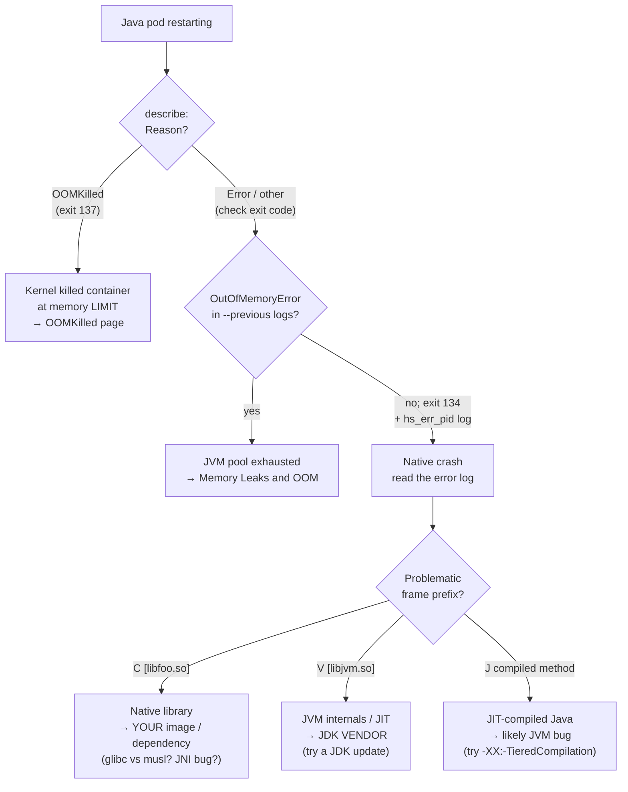

Some crashes never make it into your Java logs. The pod restarts, the last few
log lines are ordinary business, and there's no `OutOfMemoryError`, no
`OOMKilled`, no stack trace — just a gap. That's the fingerprint of a **native
JVM crash**: the JVM process itself took a fatal signal and aborted before it
could log anything through log4j. What it *did* write is a fatal error log —
`hs_err_pid<pid>.log` — and in a container that file has probably already
vanished with the restart. This page is about recognizing that case, keeping
the evidence, and reading it.

## Step zero: which "the JVM died" is this?

Three unrelated failures all present as "the Java pod keeps dying," and they
have three different owners. Spend thirty seconds here before anything else.

| Symptom | What actually happened | Exit code | Go to |
|---|---|---|---|
| `describe` shows `Reason: OOMKilled` | The **kernel** killed the container for exceeding its memory *limit* (cgroup SIGKILL) | **137** (128+9) | [OOMKilled](/troubleshooting/oomkilled/) |
| `java.lang.OutOfMemoryError` in the logs | The **JVM** threw because one of *its own* memory pools was exhausted; the container was fine | (JVM exits, often via `ExitOnOutOfMemoryError`) | [Memory Leaks and OOM](/java/memory-leaks-and-oom/) |
| No OOM of either kind; logs just stop; an `hs_err_pid*.log` exists | A **native crash** — the JVM took a fatal signal (`SIGSEGV`, `SIGBUS`; `EXCEPTION_ACCESS_VIOLATION` on Windows) and aborted | **134** (128+6, SIGABRT) | This page |

The exit code is the quickest discriminator. **137 = SIGKILL = OOMKilled** —
that's the [OOMKilled](/troubleshooting/oomkilled/) page, not this one. **134 =
SIGABRT** — the JVM caught its own fatal signal, printed the error log, and
called `abort()`. If you see 134 (or the pod just stops with no OOM evidence in
`--previous` logs), you're in the right place.

```bash
kubectl get pod $POD -o jsonpath='{range .status.containerStatuses[*]}{.name}: exit={.lastState.terminated.exitCode} reason={.lastState.terminated.reason}{"\n"}{end}'
```

```console
myapp: exit=134 reason=Error
```

`Reason: Error` (not `OOMKilled`) plus exit 134 plus a gap in the logs is the
native-crash signature. This page is the sibling of
[Memory Leaks and OOM](/java/memory-leaks-and-oom/) — that one covers the JVM
running out of *managed* memory; this one covers the JVM being *shot* at the
native level.

## The core container problem: the evidence deletes itself

By default HotSpot writes `hs_err_pid<pid>.log` to the process's **current
working directory**. In a container the CWD is on the ephemeral writable layer,
and on a fatal signal the JVM aborts, Kubernetes restarts the container, and the
[writable layer is reset](/troubleshooting/kubernetes-is-linux/). The one file
that explains the crash is gone before you can `kubectl exec` in to read it. The
default here is actively hostile to containers.

**The fix is the same volume pattern as heap dumps** — send the error log to a
mounted volume that outlives the restart:

```yaml
env:
  - name: JAVA_TOOL_OPTIONS
    value: >-
      -XX:ErrorFile=/dumps/hs_err_%p.log
volumeMounts:
  - name: dumps
    mountPath: /dumps
volumes:
  - name: dumps
    emptyDir:
      sizeLimit: 256Mi
```

`-XX:ErrorFile=/dumps/hs_err_%p.log` is real and portable across HotSpot
versions; `%p` expands to the pid, so successive crashes don't clobber each
other. An `emptyDir` survives container *restarts within the pod*; a PVC
survives pod replacement too. The fatal error log is tiny (kilobytes to low
megabytes), so 256Mi is plenty — this isn't heap-dump sizing.

:::note[Not the same flag as HeapDumpOnOutOfMemoryError]
`-XX:+HeapDumpOnOutOfMemoryError` fires on a *heap* `OutOfMemoryError` and
writes a `.hprof` (see [Heap Dumps](/java/heap-dumps-jre-only/)). It does
**nothing** for a native crash. `-XX:ErrorFile` is the native-crash equivalent,
and the two are independent — set both if you want to be covered for either
death.
:::

Getting the file to your laptop is the same plumbing as any other artifact —
`kubectl cp` (needs `tar`), a raw `kubectl exec ... cat` stream, or an ephemeral
container reaching in via `/proc/<pid>/root/dumps/...`. All of it, including the
distroless cases, is in [Getting Dumps Out](/java/getting-dumps-out/). The error
log is small enough that a plain `cat` almost always suffices:

```bash
kubectl exec $POD -- cat /dumps/hs_err_1.log > hs_err_1.log
```

## Reading the fatal error log

You do not need to understand every line — the [OpenJDK Troubleshooting Guide's
fatal-error-log chapter](https://docs.oracle.com/en/java/javase/21/troubleshoot/fatal-error-log.html)
does the exhaustive tour. Four things make you competent in about a minute.

**1. The header — the signal.** The top block names what killed the JVM:

```console
#
# A fatal error has been detected by the Java Runtime Environment:
#
#  SIGSEGV (0xb) at pc=0x00007f9c1a2b4c10, pid=7, tid=0x00007f9c00abc700
#
# JRE version: OpenJDK Runtime Environment (21.0.5+11) (build 21.0.5+11)
# Java VM: OpenJDK 64-Bit Server VM (21.0.5+11, mixed mode, ...)
```

`SIGSEGV` (segmentation fault — bad memory access) and `SIGBUS` (misaligned or
unmapped access, sometimes an mmap'd file that vanished) are the common ones.

**2. The problematic frame — *who* crashed.** This single line assigns
ownership, so read the prefix carefully:

```console
# Problematic frame:
# C  [libcrypto.so.3+0x1a2b4c]  EVP_DecryptUpdate+0x8c
```

| Prefix | Frame is in | Whose problem |
|---|---|---|
| `C  [libsomething.so...]` | a **native library** — your JNI lib, or a native dependency in your image | **Your image / dependency** |
| `V  [libjvm.so...]` | the **JVM itself** — JIT compiler, GC, runtime internals | **Likely a JVM bug** — your JDK vendor/version |
| `J  <method>` | **JIT-compiled Java** code | Usually surfaces a JIT/JVM bug; note the method |
| `j  <method>` | interpreted Java | Rare as *the* crash frame; look further down |

This prefix is the fork in the whole investigation: `C` points outward at your
image; `V` points at the runtime.

**3. The crashing thread and its stack.** Below the header, the
`Current thread` line and its native stack (`Stack: [...]` / `Native frames`)
show how you got there — the call path into the problematic frame. Read it
bottom-up; it usually names the Java code that called into the native library.

**4. The environment summary.** Further down: `Registers` and `Instructions`
(only useful if you're going deep with a vendor), then the genuinely useful
sections — command line flags, environment variables, `/proc/meminfo`, glibc
version, CPU features. These are exactly what you'll paste when you escalate.

## Common container-specific causes

Native crashes in Kubernetes cluster around a short list, most of them
container-shaped:

- **glibc vs musl (Alpine).** The single most common one. A native library or a
  JVM built against **glibc** loaded into a **musl** Alpine image (or the
  reverse) crashes in `C` frames or fails to load at all. Fix: use a glibc base
  (`eclipse-temurin:*-jammy`, Debian/Ubuntu, or a distroless glibc image), or a
  build of the native dependency compiled for musl. This is a base-image
  decision, not a JVM flag.
- **CPU instruction/feature mismatch across nodes.** A JIT or a native lib
  compiled with instructions (AVX-512, etc.) the *scheduled* node's CPU lacks →
  `SIGILL`/`SIGSEGV`. Signature: crashes only on certain nodes in a
  heterogeneous cluster. Pin node types or build for the baseline ISA.
- **A buggy JNI / native dependency.** Native compression, crypto, image
  codecs, or database drivers with a JNI component. Crash frame is `C  [thatlib]`.
- **Aggressive JIT hitting a JVM bug.** Crash in `V [libjvm.so]` or a `J` frame.
  As a *diagnostic* (not a fix), disabling tiered compilation
  (`-XX:-TieredCompilation`) or excluding the offending method can confirm the
  JIT is implicated — if it stops crashing, you've found a JVM bug to report.
- **Corrupted class metadata / bad bytecode-gen** from an aggressive
  instrumentation agent or bytecode library.
- **`sun.misc.Unsafe` / off-heap misuse.** Application or library code doing
  manual pointer arithmetic can dereference freed or out-of-bounds memory —
  `SIGSEGV` in a `C`/`j` frame near the offending class.

## Core dumps: honest expectations in a locked-down cluster

`-XX:+CreateCoredumpOnCrash` is **on by default**, so in principle a native
crash also drops a core dump you could open in `gdb`. In practice, inside a
restricted cluster you usually **can't get one**, and it's worth knowing why
before you waste time chasing it. A real core needs three things:

1. A writable location with room for it (a core ≈ the process's whole address
   space — often gigabytes) — you can arrange this with a volume.
2. A raised core-size limit (`ulimit -c unlimited`) — process/container level.
3. The host's `kernel.core_pattern`, which decides *where the kernel writes the
   core* — and this is **node/platform-level**, not something your pod can set.

Numbers 2 and 3 are outside your pod spec on a locked-down node. So the honest
posture: **rely on the `hs_err_pid` log, not on a core dump.** The error log is
designed to be self-sufficient for exactly this reason. If you genuinely need a
core, that's a conversation with your platform team about `core_pattern` and
ulimits on the node — not a flag you flip alone.

## Which death was it? — decision tree



## Escalation boundary

Native crashes cross ownership lines cleanly once you've read the frame:

- **`V [libjvm.so]` or a `J` frame** → the JVM/JIT is crashing on itself. This is
  your **JDK vendor and version's** problem. First move: try a newer JDK build —
  JIT and GC crashes are frequently already-fixed bugs. Report with the error
  log and exact build string.
- **`C [somelib.so]`** → your **image or a dependency**. Check glibc-vs-musl
  first, then whether the native lib version matches its expectations, then the
  JNI-using library.
- **`kernel.core_pattern`, `ulimit`, node CPU/memory** → your **platform team**.
  You don't set these from a pod.

Escalate with three artifacts every time: the **`hs_err_pid` log**, the exact
**JDK version/build** (from the log header), and the **image base** (glibc or
musl, distro). With those three, whoever owns it can act; without them the first
question back is always "which JDK, which base?" — so lead with the answers.
