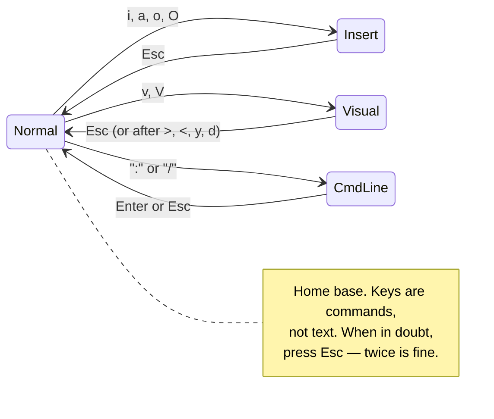
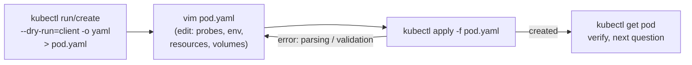

The CKAD is a terminal. Not a terminal with your dotfiles, your VS Code, your clipboard manager — a remote desktop with a shell, a browser pinned to [kubernetes.io/docs](https://kubernetes.io/docs/), and whatever editor you can drive from a keyboard. When you run `kubectl edit`, you land in Vim whether you planned to or not.

Here's the good news: the CKAD does not require Vim fluency. It requires about **twenty commands, three lines of configuration, and two habits** — and the candidates who have them consistently finish with time to spare, because every question is ultimately "produce this YAML faster than the clock." This page is that kit, tailored to the exam and nothing else. It's one part of the site's full [CKAD track](/ckad/overview/) — the [speed system](/ckad/speed-system/) covers the kubectl half, the [study plan](/ckad/study-plan/) schedules it all, and the [timed drills](/ckad/drills/) tell you when you're ready.

If you've never opened Vim in your life, run `vimtutor` in any terminal tonight — lessons 1–3 take twenty minutes and cover half of what follows. Then come back for the YAML-specific parts, because that's where exams are lost.

## Minute zero: the vimrc

Before you read a single question, spend thirty seconds in the exam terminal:

```bash
cat >> ~/.vimrc <<'EOF'
set expandtab      " Tab key inserts spaces — YAML rejects real tabs
set tabstop=2      " a tab displays as 2 columns
set shiftwidth=2   " >> and auto-indent move by 2 — one YAML level
set number         " line numbers, for 'error at line 23' moments
EOF
```

This is allowed — the [exam rules](https://docs.linuxfoundation.org/tc-docs/certification/tips-cka-and-ckad) permit configuring your environment, and this particular config is the difference between YAML that applies and YAML that doesn't. The reason is brutal and worth internalizing now:

**YAML forbids tab characters in indentation.** Press the Tab key in an unconfigured editor, save, apply, and you get:

```text
error: error parsing pod.yaml: error converting YAML to JSON: yaml: line 12:
found a character that cannot start any token
```

That error message says nothing about tabs. Under time pressure, people re-read line 12 five times, see indentation that *looks* fine (tabs are invisible), and burn ten minutes. `set expandtab` makes the mistake impossible; `shiftwidth=2` makes Vim's indent commands move in exact YAML levels, which pays off below. If you ever need to check a suspect file: `:set list` displays tabs as `^I` (turn it off with `:set nolist`).

## The mental model: modes

Every Vim disaster a beginner has comes from not knowing which mode they're in. There are only four you need:



- **Normal** — home base. Keys navigate and edit. You should spend most of your time here.
- **Insert** — keys type text, like a normal editor. Enter with `i`; leave with `Esc`.
- **Visual** — select text, then act on the selection. This is your YAML indent tool.
- **Command-line** — `:` commands (save, quit, substitute) and `/` search.

The one habit that prevents chaos: **when anything looks weird, hit `Esc`.** It's free, it's idempotent, and it always returns you to Normal mode.

## The survival set

Twenty commands. Drill these until they're reflexes and you can ignore the other 98% of Vim.

### Get in, get out

| Command | What it does |
|---|---|
| `vim pod.yaml` | open a file |
| `:w` | save |
| `:wq` | save and quit |
| `:q!` | quit, **discarding changes** — your undo button of last resort |
| `:w pod2.yaml` | save a copy under a new name (great for "create a similar pod") |

### Move

| Command | What it does |
|---|---|
| `gg` / `G` | top / bottom of file |
| `:23` | jump to line 23 (pairs with `set number` and error messages) |
| `w` / `b` | next / previous word |
| `0` / `$` | start / end of line |
| `/image` then `n` | search for "image"; `n` jumps to the next hit |

### Edit

| Command | What it does |
|---|---|
| `i` / `a` | insert before / after the cursor |
| `o` / `O` | open a new line below / above and start typing |
| `x` | delete the character under the cursor |
| `dd` / `3dd` | delete a line / three lines (they go to the clipboard-ish "register") |
| `yy` / `3yy` | copy ("yank") a line / three lines |
| `p` / `P` | paste below / above the current line |
| `cw` | change word — deletes the word, drops you in Insert mode |
| `ci"` | change everything inside the quotes — perfect for `image: "nginx:1.25"` |
| `u` / `Ctrl-r` | undo / redo — spam `u` until the YAML looks sane again |
| `.` | repeat the last change (indent one more line, delete one more block…) |

That's the whole list. Notice what's *not* here: macros, registers, splits, plugins, `hjkl` purism (arrow keys work fine — use them). None of it moves your exam score; time spent learning it is time not spent on `kubectl explain`. See [What not to learn](#what-not-to-learn) below.

## The three YAML power moves

These are the ones that separate "survived Vim" from "Vim made me faster." Each maps to something you will do multiple times per exam.

### 1. Block indent with Visual mode

You pasted a `livenessProbe` from the docs and it landed at the wrong depth. Do **not** fix it line by line with the spacebar:

```text
V        enter Visual Line mode on the first line
jjjj     extend the selection down (or 4j)
>        indent the whole block one shiftwidth (= one YAML level)
.        repeat if it needs to go deeper; use < to go the other way
gv       reselect the same block if you need another pass
```

Because you set `shiftwidth=2`, every press of `>` is exactly one nesting level. A five-line probe block gets to the right depth in three keystrokes.

### 2. Yank–put–modify

Half of CKAD tasks are "make another one of these, slightly different": a second container in a pod, a second port on a Service, a near-copy of an existing manifest. The loop:

```text
V + j's + y    select and yank the block (e.g. an entire container entry)
p              paste it below
cw / ci"       change the name, the image, the port
```

For whole-file variants: open the existing manifest, `:w new-pod.yaml`, then edit the copy — faster and safer than copy-pasting between terminal windows.

### 3. Search-and-replace with `:%s`

You copied a manifest and need every `redis` to become `redis-prod`:

```vim
:%s/redis/redis-prod/g
```

`%` means "every line", `g` means "every occurrence on the line". Add `c` (`:%s/old/new/gc`) to confirm each change — worth the extra keystrokes when the pattern might match more than you think (it will match `rediska` too; word-boundary it with `:%s/\<redis\>/redis-prod/g` if needed). Full reference: [`:help :substitute`](https://vimhelp.org/change.txt.html#%3Asubstitute).

## The two paste traps

You are allowed to copy YAML from [kubernetes.io/docs](https://kubernetes.io/docs/) during the exam, and you should — nobody types a probe spec from memory. Two things go wrong:

**The indentation cascade.** With auto-indent active, each pasted line's leading spaces get *added to* the previous line's auto-indent, and your block drifts right in a staircase. Modern Vim (8.0+, which the exam environment runs) has *bracketed paste* and usually handles terminal pastes correctly. But if you ever see the staircase:

```vim
:set paste     " before pasting — disables all auto-indenting
:set nopaste   " IMMEDIATELY after — see the second trap
```

**The `paste` hangover.** `:set paste` also silently disables `expandtab`. Forget to `:set nopaste`, keep editing, press Tab — and you've reintroduced the invisible-tab bug your vimrc was supposed to prevent. Paste mode is a raincoat: put it on to paste, take it off right after.

## Where Vim meets kubectl

The exam has one canonical editing loop, and it's worth seeing as a loop:



Generate the skeleton with kubectl so you never type boilerplate; edit in Vim only the parts the question asks for; apply; read the error *message and line number* if it fails and jump straight there with `:23`. Scaffolding recipes live in [Tips and Tricks](/kubectl/tips-and-tricks/).

Two supporting habits:

**Make `kubectl edit` use your configured Vim:**

```bash
export KUBE_EDITOR=vim   # add to ~/.bashrc in the exam terminal
```

`kubectl edit deploy/web` opens the live object; your vimrc applies, so your indent tooling works there too. If your edit fails validation, kubectl tells you it saved your changes to a temp file (e.g. `/tmp/kubectl-edit-xxxx.yaml`) — `vim` that file, fix it, and `kubectl apply -f` it rather than starting over. The mechanics of what `edit` actually does are in [How kubectl Actually Works](/kubectl/how-kubectl-works/).

**Trim the export junk fast.** `kubectl get pod web -o yaml > web.yaml` drags along `status:`, `managedFields:`, and friends. You rarely need to remove them for the exam (apply tolerates them), but when a question wants a clean manifest: `/status` to jump to the block, `V` + `G` if it's the tail of the file, `d`. Deleting from cursor to end-of-file is just `dG`.

## Five drills before exam day

Speed comes from drilling, not reading. On any practice cluster ([Lab 0](/labs/lab-0-cluster/) gives you one), each drill under two minutes:

1. **The skeleton loop.** `kubectl run web --image=nginx --dry-run=client -o yaml > pod.yaml`, open it, add `resources.requests` for cpu and memory, apply. Repeat until ~60 seconds.
2. **The probe paste.** Copy the liveness probe example from the [k8s docs](https://kubernetes.io/docs/tasks/configure-pod-container/configure-liveness-readiness-startup-probes/), paste it into your pod at the wrong indent on purpose, fix it with `V` + `>`.
3. **The second container.** Yank your pod's container block, paste it, rename it with `cw`, change its image with `ci"`. This is the sidecar-question pattern — see [init and sidecar containers](/workloads/init-and-sidecar-containers/) for the concepts.
4. **The rename.** `:w app2.yaml`, then `:%s/\<web\>/web-v2\>/g` — oops, that replacement is broken; run it, see what happens, fix it with `u` and write the correct `:%s/\<web\>/web-v2/g`. Recovering from a bad substitute is part of the drill.
5. **The tab hunt.** Have a teammate (or your past self) hide one tab character in a 40-line manifest. Find it with `:set list` and the apply error alone.

Then do a full timed run on [killer.sh](https://killer.sh/) — two sessions are included with your CKAD registration, and its environment matches the real exam's terminal closely.

## What not to learn

For the CKAD, skip: macros (`q`), named registers, marks, splits and tabs, plugins and plugin managers, `hjkl`-only navigation, ex-mode anything. All genuinely useful in a working life; all zero-point on this exam. If Vim ends up sticking with you afterward, `vimtutor` lessons 4–7 and [vimhelp.org](https://vimhelp.org/) are the honest path, and your `~/.vimrc` at home deserves more than four lines.

One honest alternative: `nano` is on the exam machines too, and if the exam is *tomorrow* and Vim is brand-new to you, `nano` with `nano -ET2` (tabs→2 spaces) loses less time than panicked mode-confusion. But given even a weekend, the Vim kit above is faster — mostly because `kubectl edit` and the temp-file recovery flow assume you can drive it.

## The exam-day card

Everything above, compressed to what you should be able to recite:

```text
Setup:    printf 'set expandtab\nset tabstop=2\nset shiftwidth=2\nset number\n' >> ~/.vimrc
          export KUBE_EDITOR=vim
Panic:    Esc Esc  →  u until sane  →  :q! if truly lost (file untouched since last :w)
Move:     gg  G  :23  /word n
Edit:     i  o  dd  yy  p  cw  ci"  u  .
YAML:     V jj >   (indent block one level)      :%s/old/new/g
Paste:    staircase? :set paste → paste → :set nopaste
Tabs:     "cannot start any token" = tab in file → :set list to see it
Recover:  kubectl edit failed → it saved a /tmp/kubectl-edit-*.yaml → fix, apply -f
```

Print the muscle memory, not the card — the exam won't let you bring it anyway.
