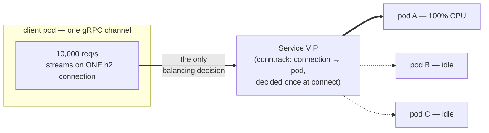
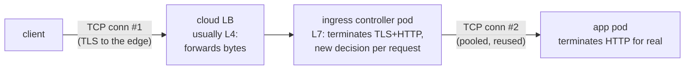

Here is the uncomfortable truth this page exists to deliver: **most Kubernetes load balancing balances connections, but modern HTTP puts many requests — sometimes *all* of a client's requests — on one connection.** A Service spreads TCP connections across pods and calls the job done; HTTP/2 then multiplexes every request a client will ever make onto a single one of those connections, and the "load balancing" you thought you had quietly becomes a coin flipped exactly once. This is not a bug in kube-proxy, or in gRPC, or in your Service. It is a collision between two layers that are both doing exactly what they were designed to do — and you can only fix it once you see both layers clearly.

So this page walks the protocol from the wire up: what an HTTP/1.1 request physically is, why keep-alive changed the economics, what HTTP/2 actually multiplexes, and precisely where the load-balancing story breaks — then the full menu of remedies, each with its price tag. It's the theory annex to [Long-Lived Connections](/networking/long-lived-connections/) (the operational page for connections that outlive the things they're connected to), and it leans on [TCP](/foundations/tcp-connections/) for everything underneath. The authoritative texts, if you want chapter and verse: [RFC 9110](https://www.rfc-editor.org/rfc/rfc9110) (HTTP semantics), [RFC 9112](https://www.rfc-editor.org/rfc/rfc9112) (HTTP/1.1 wire format), and [RFC 9113](https://www.rfc-editor.org/rfc/rfc9113) (HTTP/2).

## What a request actually is on the wire

Strip away every framework and an HTTP/1.1 exchange is startlingly small: a line of text, some `key: value` header lines, a blank line, and an optional body. You can be an HTTP client with nothing but `nc`:

```bash
printf 'GET /healthz HTTP/1.1\r\nHost: my-svc\r\nConnection: close\r\n\r\n' | nc my-svc 80
```

```text
HTTP/1.1 200 OK
Content-Type: text/plain
Content-Length: 2

ok
```

Three details in that exchange carry most of the protocol's weight. **`Host` is mandatory** — one IP serves many sites/Services, and this header is how the server (and every [ingress controller](/networking/ingress-and-routing/)) knows which one you meant; it's the L7 twin of SNI in [TLS](/foundations/tls/). **`Content-Length` is how the receiver knows where the body ends** — on a persistent connection there's no "end of file," only counted bytes. And when the sender doesn't know the length up front (a streamed response, a proxy relaying as it receives), **`Transfer-Encoding: chunked`** replaces the count with self-delimiting chunks: each prefixed with its size in hex, terminated by a zero-length chunk. Framing — knowing where one message stops and the next begins — sounds like bookkeeping, but it is the entire difference between HTTP/1.1 and HTTP/2, and getting it wrong is an attack class (request smuggling lives in the gap between two servers disagreeing about framing).

Watch the real thing with `curl -v` from any pod with curl in it: the `>` lines are the literal request bytes, the `<` lines the literal response headers. That's not a rendering — HTTP/1.1 genuinely is text.

## HTTP/1.0 → 1.1: keep-alive changes the economics

HTTP/1.0 opened a TCP connection per request and closed it after the response. Every request paid the full toll: a [three-way handshake](/foundations/tcp-connections/) (one round trip), a TLS handshake if encrypted (another round trip or two), TCP slow start ramping the window from cold — all to fetch one resource, then throw the warmed-up connection away.

**HTTP/1.1 made persistence the default: the connection stays open after a response, and the next request reuses it.** (`Connection: close` opts out; `Connection: keep-alive` was the 1.0-era opt-in you still see in old configs.) The tolls are paid once and amortized over hundreds of requests, which is why connection reuse is the single cheapest performance win in any HTTP client — and why a client that accidentally disables pooling shows up in cluster metrics as a storm of handshakes and a pile of TIME_WAIT sockets.

But HTTP/1.1 kept one strict rule: **one request at a time per connection, in order.** Send a request, wait for the complete response, then send the next. If the first response is slow, everything queued behind it waits — **head-of-line blocking at the request level**. The workarounds were crude and formative:

- **Open more connections.** Browsers settled on ~6 parallel connections per host — a convention, not a standard — and server fleets, proxies, and file-descriptor limits have been sized around that number ever since. Service-to-service clients do the same thing with connection pools.
- **Pipelining** — sending multiple requests without waiting, responses returned in order — was in the spec and died in practice: one slow response still blocks all the ones behind it, broken middleboxes corrupted pipelined streams, and browsers shipped it disabled. It survives as a cautionary tale: you can't fix head-of-line blocking without fixing *framing*.

## HTTP/2: one connection, many streams

HTTP/2 ([RFC 9113](https://www.rfc-editor.org/rfc/rfc9113)) fixed framing. The text protocol becomes **binary frames** (HEADERS, DATA, SETTINGS, PING, ...), each frame tagged with a **stream ID**. A stream is one request/response exchange; a connection carries many streams *concurrently, interleaved frame by frame*. Request 3's response can start, pause, and finish while request 1's response is still trickling — no request-level head-of-line blocking, no six-connection workaround needed. Headers are compressed with HPACK ([RFC 7541](https://www.rfc-editor.org/rfc/rfc7541)) — a shared dictionary of previously-sent headers, which is why repetitive REST/gRPC metadata costs almost nothing after the first request. (Server push, the spec's one flashy feature, is dead: Chrome removed it, and [RFC 9113](https://www.rfc-editor.org/rfc/rfc9113) itself shrugs at it. Semantics are otherwise unchanged — same methods, same status codes, per [RFC 9110](https://www.rfc-editor.org/rfc/rfc9110); HTTP/2 is a new *wire format*, not a new protocol semantics.)

The design goal, stated plainly in the RFC, is the load-bearing sentence for everything that follows: **HTTP/2 is built to need exactly one connection per client-server pair.** One connection, warm forever, all traffic multiplexed onto it. For a browser talking to an origin, this is strictly better. For a pod talking to a Service, it is about to ruin your afternoon.

## The collision: connection-level balancing meets stream-level traffic

Now stack the layers the way your cluster stacks them. A ClusterIP Service is a [DNAT rule](/routing/kube-proxy-and-the-dataplane/): when a **connection** is opened to the VIP, conntrack picks a backend pod and rewrites that flow, and every subsequent packet on the 4-tuple follows the same rewrite. **kube-proxy balances at layer 4, and the unit of balancing is the connection** — that's what [Services Deep Dive](/networking/services-deep-dive/) means when it says a Service is not a proxy.

With HTTP/1.1 and a pool of, say, 20 connections, this works out fine by accident: 20 connections land on ~20 coin flips, requests spread across the pool, and the law of large numbers does the rest. **With HTTP/2, the client's whole point is to open one connection — so the coin is flipped once, and every stream that client ever creates lands on the pod that won the flip.**

And gRPC is the case where this stops being theoretical, because **gRPC *is* HTTP/2** — protobuf-encoded messages on h2 streams, with a channel that deliberately holds one long-lived connection per target. Hence the classic incident, reported in almost these words every time: *"we scaled the backend to 10 pods and one pod is at 100% CPU while nine sit idle."* The client resolved the Service name to the ClusterIP, opened one h2 connection, conntrack pinned it to one pod, and 10,000 requests per second are now streams on that single flow. Scaling out did nothing because **the traffic never re-encounters a decision point** — the only balancing decision was made at `connect()` time, possibly days ago. Rollouts "fix" it briefly (the connection dies with the pod, the coin gets re-flipped) and then some other pod becomes the hotspot, which is exactly the sawtooth you'll see in per-pod metrics.



**The general law: load balancing happens where decisions happen, and a multiplexed protocol moves all the decisions to connect time.** Any fix must reintroduce a per-request (or at least frequent) decision point. Here is the full menu:

| Remedy | How it works | Price you pay |
|---|---|---|
| Headless Service + client-side LB | `clusterIP: None` makes DNS return every pod IP; the gRPC channel (`round_robin` policy) opens a connection *per pod* and spreads streams across them | client must re-resolve on endpoint churn (set `max_connection_age` server-side to force it); per-language client config; you've made every client a tiny load balancer |
| L7 proxy in the path (ingress / gateway) | [ingress-nginx](/networking/ingress-nginx/) or an Envoy-based [Gateway](/networking/gateway-api/) terminates the client's h2 connection and makes a **fresh backend choice per request/stream** | an extra hop; the proxy must speak h2 to the backend (annotation/config, not default everywhere); mostly solves north–south, not pod-to-pod |
| Service mesh sidecar/proxy | [the mesh](/networking/service-mesh/) puts an Envoy next to every pod; the app's one connection terminates a few microseconds away, and the proxy balances streams per request across endpoints it discovers from the control plane | you've adopted a mesh — sidecar resources, upgrade surface, debugging depth; by far the biggest hammer |
| Lookaside / xDS load balancing | the client asks a control plane (xDS API) for endpoints and policy, then connects directly — client-side LB with central brains | gRPC-specific, newer, needs an xDS server (or a mesh control plane doubling as one) |
| Server-forced connection churn | server sets `MAX_CONNECTION_AGE` (gRPC) or `keepalive_requests`-style limits, killing connections every few minutes so the coin gets re-flipped | balancing becomes "eventually roughly even," not even; churn costs handshakes; a mitigation, not a fix |
| `trafficDistribution: PreferClose` etc. | [traffic distribution](/cluster-networking/traffic-distribution/) shapes *which* backends conntrack may choose | still connection-level — shapes the coin flip, doesn't add decision points; not a gRPC fix |

The honest summary: **for serious gRPC traffic you either make the client endpoint-aware (headless + round_robin, or xDS) or you put an L7 balancer in the path (gateway or mesh).** Everything else is damage limitation.

## Where each hop terminates HTTP — or doesn't

The request's path through a cluster is a chain of hops, and the single most clarifying question you can ask about each one is: **does this hop parse HTTP (L7), or does it just forward bytes (L4)?** An L7 hop terminates the client's connection, makes per-request routing decisions, and can rewrite headers; an L4 hop copies packets and preserves the connection end-to-end. [Layers and VIPs](/networking/layers-and-vips/) builds this vocabulary; here's the typical north–south chain:



Consequences you've already met without necessarily naming them. **The app never sees the client's connection** — connection #2 belongs to the ingress, which is why "client IP" in your logs is the ingress pod's IP unless someone forwards the truth in headers: `X-Forwarded-For` (the appended chain of client IPs — trust it only as deep as you trust the proxies that wrote it), `X-Forwarded-Proto` (the client spoke https even though your pod heard http), `X-Real-IP`, and friends. **Each L7 hop has its own keep-alive, idle-timeout, and max-requests settings**, so a "connection problem" can live at any hop independently — the reason [Life of a Request](/routing/life-of-a-request/) walks the chain hop by hop. And **each L7 hop chooses its own protocol per leg**: a client can speak h2 to the ingress while the ingress speaks HTTP/1.1 to your pod (ingress-nginx's default) — which silently reintroduces request-level head-of-line blocking and, for gRPC, breaks it entirely unless you configure the h2 backend explicitly. For TLS specifically, the edge can *terminate* (decrypt, forward plaintext), *re-encrypt* (decrypt, inspect, re-dial TLS), or *passthrough* (stay L4, forward ciphertext — no per-request routing possible); [the TLS article](/foundations/tls/) maps those modes.

## ALPN: how a connection picks its protocol

Since both HTTP versions share port 443, something must choose — and that something is **ALPN** ([RFC 7301](https://www.rfc-editor.org/rfc/rfc7301)), a TLS handshake extension: the client's ClientHello lists protocols it speaks (`h2, http/1.1`), the server picks one, and the choice is sealed before the first HTTP byte. **This is why h2 adoption rode on TLS** (browsers only do h2 over TLS), why plaintext gRPC needs prior agreement (`h2c` — h2 cleartext — with no negotiation), and why a misconfigured ALPN list produces the confounding "curl works, gRPC fails against the same endpoint." See the negotiation itself:

```bash
openssl s_client -connect my-svc:443 -alpn 'h2,http/1.1' </dev/null 2>/dev/null | grep ALPN
```

```text
ALPN protocol: h2
```

## HTTP/3 and QUIC: the honest section

HTTP/2 removed head-of-line blocking at the request level but inherited it at the **packet** level: streams are independent, but they ride one TCP byte stream, and [TCP](/foundations/tcp-connections/) delivers bytes strictly in order — one lost packet stalls *every* stream until retransmission fills the gap. HTTP/3 ([RFC 9114](https://www.rfc-editor.org/rfc/rfc9114)) fixes that by abandoning TCP: it runs on QUIC ([RFC 9000](https://www.rfc-editor.org/rfc/rfc9000)), a UDP-based transport with streams *in the transport itself* (a lost packet stalls only its own stream), TLS 1.3 built into the handshake (one round trip, sometimes zero), and connection IDs that survive an IP change (your phone hops from Wi-Fi to LTE and the connection lives).

In-cluster honesty: **HTTP/3 is a last-mile technology today, not an east–west one.** Browsers and CDNs speak it enthusiastically at the edge; inside clusters, adoption is slow for unglamorous reasons — service-to-service links are low-loss (packet-level HoL blocking barely bites), the L4 dataplane and its conntrack story are TCP-shaped, QUIC's userspace stacks cost more CPU than kernel TCP, and gRPC-over-h3 is still maturing. Expect your edge LB to advertise h3 years before your pods do. And note what QUIC does *not* fix: it's still one multiplexed connection per client — **the gRPC load-balancing problem survives the transport swap untouched.**

## Timeouts, retries, and idempotency at the HTTP layer

Every hop in the chain has its own timeout budget, and HTTP adds semantics to the arithmetic that [Timeout Budgets](/tuning/timeout-budget/) does at the TCP layer. Two rules earn their keep. First, **retries are only safe for idempotent requests** — [RFC 9110](https://www.rfc-editor.org/rfc/rfc9110) blesses GET/PUT/DELETE as idempotent and POST as not, and every proxy's "retry on next upstream" feature honors that split; retrying a timed-out POST is how customers get charged twice, because *a timeout tells you nothing about whether the request executed*. Second, **naive retries amplify outages**: a struggling backend slows down, clients time out and retry, traffic doubles, the backend dies properly — the retry storm. The defenses are budgets (retry at one layer of the stack, not all of them), exponential backoff with jitter, and honoring `Retry-After` on 429/503 responses.

## Keep-alive vs the middleboxes, revisited at L7

[The TCP article](/foundations/tcp-connections/) delivered the bad news that idle connections die silently in middlebox state tables; HTTP is where you feel it, because HTTP is what keeps connections idle. A pooled HTTP/1.1 connection that sat out lunch, an h2/gRPC channel quiet overnight — the next request sails into a conntrack or NAT or LB entry that no longer exists, and the client sees a reset or a hang *on the first request after the quiet period*. The HTTP-layer defenses map one-to-one onto the layers: h2 has **PING frames** (gRPC exposes them as channel keepalive — enable them for any long-lived channel), HTTP/1.1 pools have idle-eviction and validate-before-use settings, and servers advertise their patience (`keepalive_timeout`, `Keep-Alive: timeout=n`) which your pool's idle timeout should undercut. The operational catalog — which timeout to set where, per client and proxy — is [Long-Lived Connections](/networking/long-lived-connections/); the rule to carry out of this page is the same one TCP taught: **something must send bytes more often than the forgetful-est box on the path forgets.**

## See it yourself

Everything above is observable from an ordinary pod.

**Force each protocol and read the framing.** `curl -v --http1.1 https://example.org/` shows the text protocol verbatim; `curl -v --http2 https://example.org/` shows ALPN selecting h2 (`ALPN: server accepted h2`) and streams (`[HTTP/2] [1]` stream annotations). Against a plaintext in-cluster service, `curl -v --http2-prior-knowledge http://my-svc:8080/` attempts h2c directly — an instant test of whether your backend actually speaks h2.

**Prove multiplexing with `ss`.** Drive parallel requests through one h2 client (`curl --http2 -Z`, or any gRPC load generator) and count connections:

```bash
ss -tn dst :8443 | tail -n +2 | wc -l
```

```text
1
```

One connection under full load — the whole article in one number. Repeat with `--http1.1 -Z` and watch the count jump to the pool size.

**Watch the pinning happen.** From a client pod, run a gRPC load test at a 3-replica Service while `kubectl top pods` (or your per-pod request metrics) runs alongside: one pod's line climbs, two stay flat. Then switch the client to the headless name with `round_robin` and watch the load flatten. `grpcurl -plaintext my-svc:50051 list` is the curl-of-gRPC for poking services by hand along the way.

**Be the client.** The `printf | nc` request from the top of this page, typed by hand against your own service, teaches HTTP framing more durably than any diagram — deliberately omit the blank line and watch the server wait forever for the end of your headers; that hang *is* framing, experienced firsthand.

The layer cake, fully assembled: [IP and routing](/routing/life-of-a-request/) move packets, [TCP](/foundations/tcp-connections/) fakes a byte stream, [TLS](/foundations/tls/) seals it and picks the dialect via ALPN, and HTTP frames requests onto it — one at a time in 1.1, interleaved in h2. Kubernetes balances the second layer and your traffic lives in the fourth, and every "gRPC only hits one pod" incident is that four-line summary, rediscovered the hard way.
