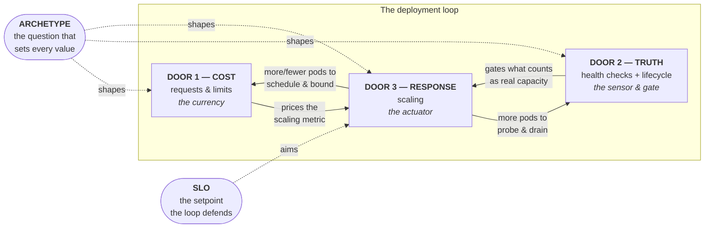
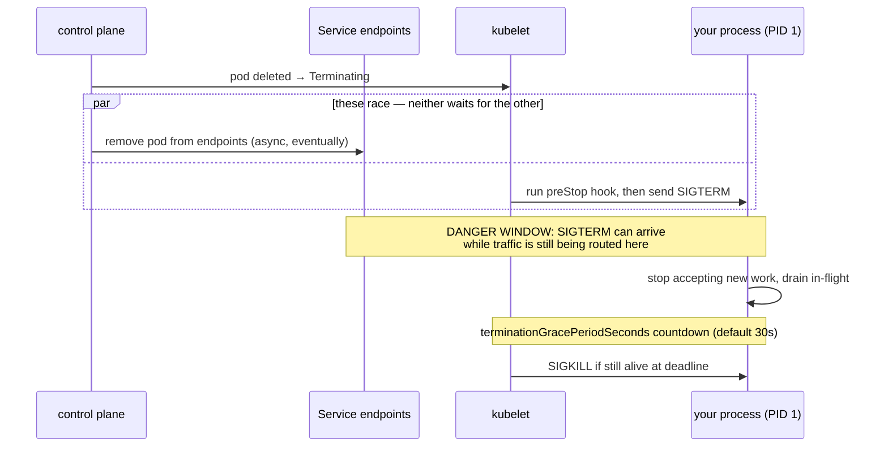
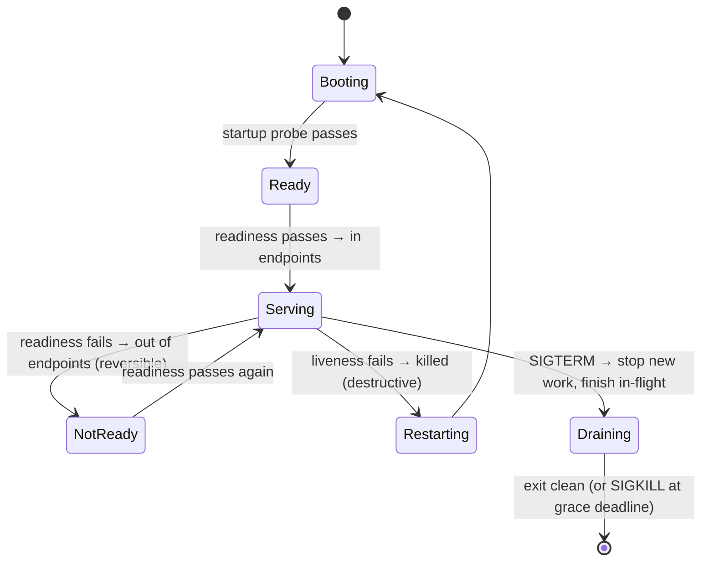

Here is a claim, and the rest of this page is its proof: **every decision you will ever make about a workload on Kubernetes walks through one of three doors — how much it costs, whether it tells the truth about itself, and how it answers load.** Requests and limits. Health checks. Scaling. You have seen these listed a hundred times as three things to remember to configure. That framing is not wrong so much as *inert* — it treats them as a checklist of independent boxes, and the checklist is exactly why teams get all three individually "correct" and still ship an outage.

The upgrade is one word. They are not a **list**. They are a **loop**. What one door decides becomes the input the next door reads, and the loop closes back on the first. Get that, and the three stop being trivia you memorize and become a machine you can reason about — one where a symptom showing up at one door is very often a mistake made at another. That coupling is the whole thesis, and it is *mechanical*, not philosophical. We will prove it.

Everything else on this site — the [tuning knobs](/tuning/overview/), the [autoscaling playbook](/autoscaling/overview/), the [troubleshooting playbooks](/troubleshooting/triage-methodology/), the [Foundations deep dives](/foundations/overview/) into the Linux underneath — is one of these three doors opened and walked through. This page is the map you hold before you open any of them.

## Why three, and why a loop

Strip Kubernetes to its job. It is a control system that takes your *desired state* and makes the cluster match it ([How Kubernetes Works](/start/how-kubernetes-works/)). To run one workload well, that system needs to know exactly three things about it, and not one more:

1. **What does it cost?** — so the scheduler can place it, the kernel can bound it, and the cluster can decide who to sacrifice under pressure.
2. **Is it telling the truth about its state?** — so the network knows when to send it traffic, and the kubelet knows when to recycle it.
3. **How should capacity respond to demand?** — so the amount of it tracks the load instead of being a fixed guess.

Cost, truth, response. There is no fourth thing the platform needs from you to run a workload — everything else is a refinement *inside* one of these. That is why there are three doors and not five.

And they form a loop because each one's output is the next one's input:



Read the solid arrows and the coupling is undeniable. The autoscaler computes utilization *as a fraction of the request* — so Door 1 literally denominates Door 3's math. The autoscaler only produces real capacity if new pods pass readiness — so Door 2 gates Door 3. And every scaling action hands more pods back to be scheduled, bounded, probed, and drained — so Door 3 feeds Doors 1 and 2 right back. Turn one knob and the other two move whether you meant them to or not. **That is the definition of a loop, and it is why "in unison" is not advice — it is the stability condition of a control system.**

The two dotted nodes are the things that sit *outside* the three doors but govern them, and they are the most common blind spots. The **SLO** is the setpoint — the number the loop exists to defend (usually latency, error rate, or freshness; almost never raw CPU). Without it, the loop can be perfectly self-consistent and still aimed at nothing. The **archetype** — is this a stateless web app, a queue consumer, a batch job, a stateful service, a leader-elected singleton? — is the question that decides the *correct value* for all three doors. Neither is a fourth pillar. The SLO is what Door 3 aims at; the archetype is the question all three answer. Hold that thought; both pay off at the end.

Now we open each door and go as deep as it goes.

## Door 1 — Cost: requests, limits, and the currency of the cluster

Pull this door and the first thing you find is that it is not really about "resources." It is about **currency**. A request is the denomination every other decision on the cluster is priced in, and a limit is the ceiling the kernel enforces. Two numbers, two completely different jobs — and conflating them is the single most common Door 1 mistake.

- **The request is a promise the scheduler reads.** It is what the scheduler subtracts from a node's allocatable capacity to decide if your pod fits ([Life of a Deployment](/start/life-of-a-deployment/)). It is *reserved* for you whether or not you use it. Critically, it is also the denominator the [autoscaler divides by](/workloads/autoscaling/) and the number the eviction ranker measures you against. The request is the currency.
- **The limit is a wall the kernel builds.** It is not scheduling input at all; it is a cgroup ceiling the node enforces at runtime ([cgroups: The Budget](/foundations/cgroups/)). Hit it and what happens depends entirely on *which* resource — and that fork is the deepest, most consequential fact behind this door.

### The asymmetry that governs everything: CPU is compressible, memory is not

CPU and memory wear the same YAML but obey opposite physics. Miss this and half of Door 1 stays mysterious forever.

| | **CPU** | **Memory** |
|---|---|---|
| Physical nature | **Compressible** — can be given in slices, taken back instantly | **Incompressible** — a byte is held or it isn't |
| Request means | A *weight*: proportional share under contention ([CFS](/foundations/cpu-scheduling-and-cfs/)) | A scheduling reservation + the eviction/OOM yardstick ([virtual memory](/foundations/virtual-memory/)) |
| Exceed the **request** | Fine — you borrow idle CPU from neighbors | Fine while free RAM exists; you're a risk under node pressure |
| Exceed the **limit** | **Throttled** — frozen until the next 100ms window. Latency, never death | **OOM-killed** — the cgroup kills the process. Death, never latency |
| Failure signature | p99 spikes while dashboards show "CPU idle" ([It's Slow](/troubleshooting/its-slow/)) | Exit code 137, `OOMKilled` in `describe` ([OOMKilled](/troubleshooting/oomkilled/)) |
| Practical rule | Set the **request** carefully; the **limit** is often best *omitted* to avoid throttling | Set request **and** limit, usually **equal**, for predictable death |

The one sentence to engrave: **a CPU limit costs you latency, a memory limit costs you the process.** Because CPU is compressible, blowing its budget just makes you wait — which is why many teams deliberately set a CPU request and no CPU limit, letting apps burst into idle cores instead of being frozen at their quota. Because memory is incompressible, there is no "wait" — the kernel's only move is to kill — which is why memory request and limit are usually set equal, so the number you reserved is the number you're killed at, with no surprising gap in between. The scheduler mechanics behind the CPU half live in [CPU Scheduling and the CFS](/foundations/cpu-scheduling-and-cfs/); the memory-accounting half (and why "90% memory" is often reclaimable page cache, not your heap) is [Virtual Memory and the Page Cache](/foundations/virtual-memory/). The applied version — turning this into actual numbers for a real service — is [Requests, Limits, and the Knobs](/tuning/requests-limits-knobs/) and the [Sizing Walkthrough](/tuning/sizing-walkthrough/).

### QoS: the class you didn't know you were choosing

The *relationship* between your requests and limits silently assigns your pod a **Quality of Service class**, and that class is a life-or-death ranking when a node runs out of memory. You never write the class; you imply it ([kubernetes.io: Pod QoS](https://kubernetes.io/docs/concepts/workloads/pods/pod-qos/), [Resources & QoS](/workloads/resources-and-qos/)):

| QoS class | How you get it | Node-pressure eviction order | Kernel `oom_score_adj` | Use it for |
|---|---|---|---|---|
| **Guaranteed** | Every container sets requests **=** limits, for both CPU and memory | Evicted **last** | ≈ −997 (hardest to OOM-kill) | Latency-critical, stateful, singletons |
| **Burstable** | At least one request or limit set, but not Guaranteed | Evicted **after** BestEffort, by how far over-request | computed between the two | Most real web apps |
| **BestEffort** | No requests or limits anywhere | Evicted **first** | ≈ 1000 (killed first) | Genuinely nothing important |

This table is a Door 1 setting reaching straight into the kernel: your QoS class becomes your position in the cgroup tree and your `oom_score_adj`, which is *the order in which the OOM killer picks victims* under node memory pressure. **BestEffort is not "flexible," it is "first to die."** A pod with no requests is invisible to the scheduler's math and top of the eviction list — the worst of both ends. The reason this whole ranking exists, read from inside a live pod, is in the [Linux Inside the Pod field guide](/troubleshooting/linux-inside-the-pod/).

### Worked example

```yaml
resources:
  requests:
    cpu: 250m        # scheduler reserves 1/4 core; HPA's denominator
    memory: 512Mi    # scheduler reserves 512Mi; the eviction yardstick
  limits:
    memory: 512Mi    # == request → incompressible, so pin it. OOM at exactly 512Mi
    # cpu limit deliberately omitted → burst into idle cores, never throttle
```

Requests set, memory request == limit, CPU limit omitted. The scheduler reserves 250m CPU and 512Mi. QoS is **Burstable** (memory matches but CPU has no limit). Under load the app bursts past 250m into spare cores with zero throttling; if it ever tries to hold more than 512Mi it is OOM-killed at a predictable line. Every number here is now a currency the other two doors will spend — most immediately, that `250m` is the denominator the autoscaler is about to divide by. **Door 1 doesn't stand alone; it *prices* Doors 2 and 3.**

## Door 2 — Truth: health checks and the whole life of a pod

Pull this door and you find it is not "add a `/healthz`." It is the **pod's contract with the cluster about its own state, across its entire life** — from the moment it boots to the moment it is asked to leave. Kubernetes is a control loop that acts on *reported* state; if a pod lies about being ready, or stays silent about shutting down, the platform makes correct decisions on false information and you get an outage that looks like anything but a probe bug.

### The three probes answer three different questions

They are not three ways to do the same thing. Each answers a distinct question and has a distinct blast radius when it fails ([kubernetes.io: probes](https://kubernetes.io/docs/concepts/configuration/liveness-readiness-startup-probes/), [Health Checks](/workloads/health-checks/)):

| Probe | Question it answers | On failure | Blast radius | The classic mistake |
|---|---|---|---|---|
| **startup** | "Am I done booting yet?" | Holds off the other two; kills the pod only after `failureThreshold × period` | Just this pod, during boot | Absent → a slow-booting app gets liveness-killed before it ever starts ([CrashLoopBackOff](/troubleshooting/crashloopbackoff/)) |
| **readiness** | "Should I receive traffic *right now*?" | Pod removed from Service endpoints. **No restart.** | Traffic routing — reversible | Checking a **shared dependency** → one blip → *every* replica goes NotReady at once |
| **liveness** | "Am I broken beyond recovery?" | kubelet **restarts** the container | Destructive — a restart | Too aggressive under load → healthy-but-slow pods get killed, *amplifying* the incident |

The load-bearing distinction: **readiness is reversible, liveness is destructive.** Readiness failing just stops traffic for a moment and lets it resume; liveness failing *kills and restarts*. This is why the deadliest Door 2 anti-pattern is a **liveness** probe that checks a downstream dependency: when that dependency hiccups, liveness fails across every replica simultaneously, the kubelet restarts them all at once, and you have converted a brief dependency blip into a full cascading restart storm — the outage that classic war story "the readiness probe that took down prod" is built on. The rule that falls out: **liveness checks only *this process's* own health; readiness may check "can I serve," but never something a restart can't fix.** The design discipline is [Health Check Design](/tuning/health-check-design/); the timing knobs are [Health Check Knobs](/tuning/health-check-knobs/).

### The far end of the door: readiness gates traffic *in*, shutdown must gate it *out*

Here is the half of Door 2 that most "add probes" advice never mentions, and it is exactly the half that scaling and rollouts hammer. Probes handle a pod *arriving* and *running*. But **scaling down and rolling updates mean pods are constantly leaving** — termination is the steady state of a healthy deployment, not an exception. And the moment a pod is told to leave, two things happen *concurrently*, which is the trap:



Endpoint removal is **eventually consistent** and races the SIGTERM. If your app hears SIGTERM and exits immediately, it can die *while the Service is still sending it requests* — every scale-down and every rolling update sheds a few connections, surfacing as intermittent, un-reproducible 5xx that correlate suspiciously with deploys. The fixes live entirely in this door: a `preStop` sleep to outlast endpoint propagation, an app that catches SIGTERM and *drains* rather than exits (which requires your app to be [PID 1 and actually receive the signal](/foundations/processes-and-signals/) — a shell-form `ENTRYPOINT` eats it), a `terminationGracePeriodSeconds` long enough to finish in-flight work, and awareness that [long-lived connections](/networking/long-lived-connections/) don't drain themselves. The full sequence and every knob is [Graceful Shutdown](/workloads/graceful-shutdown/) and [Rollout & Shutdown Knobs](/tuning/rollout-shutdown-knobs/); the authoritative source is [kubernetes.io: Pod termination](https://kubernetes.io/docs/concepts/workloads/pods/pod-lifecycle/#pod-termination).

The whole door, then, is one continuous state machine — the same contract at both ends:



Startup, readiness, liveness, and drain are not four features. They are one door — the truth a pod tells about itself from first breath to last — and **scaling is only safe because this door is honest at both ends.**

## Door 3 — Response: scaling, the goal the other two exist to make safe

Pull this door and you find the payoff — elasticity, capacity that tracks demand — and immediately behind it, two questions it forces you to answer that you cannot answer from inside Door 3 at all.

### Question one: *scale on what?* — the SLO is the setpoint

The Horizontal Pod Autoscaler is a control loop with a beautifully simple core formula ([kubernetes.io: HPA algorithm](https://kubernetes.io/docs/tasks/run-application/horizontal-pod-autoscale/#algorithm-details)):

```text
desiredReplicas = ceil( currentReplicas × (currentMetricValue / desiredMetricValue) )
```

Everything rides on the metric you choose, and the honest truth is that the default choice — CPU utilization — is usually the *wrong* thing to defend. Users do not feel CPU; they feel latency, errors, and staleness. **The metric is the SLO in numeric form**, which is why you cannot configure Door 3 without having answered "what does 'good' feel like to a user?" first ([SLOs for Scaling](/autoscaling/slos-for-scaling/), [Signals Catalog](/autoscaling/signals-catalog/)). And note *where* the CPU number comes from: utilization is `currentCPU / requestedCPU` — **summed across pods and divided by the request**. That is Door 1 reaching directly into Door 3's arithmetic. Set the request wrong and every scaling decision is computed against a wrong denominator — the loop, made concrete.

### Question two: *scale what, and should you at all?* — the archetype

Horizontal scaling assumes a workload where one more identical replica means more capacity. That assumption is true for a stateless web app and *false* for a great many things. The archetype decides not just the signal but whether Door 3 opens at all:

| Archetype | Scale on | Horizontal scaling? | Why |
|---|---|---|---|
| Stateless web/API | Latency, RPS, or CPU as proxy | Yes, freely | Replicas are interchangeable |
| Queue / async consumer | **Queue depth or lag**, not CPU | Yes — on the backlog | CPU is flat while the queue floods ([Messaging Consumers](/autoscaling/messaging-consumers/)) |
| Batch / Job | Parallelism, not an HPA | Via completions/parallelism | It finishes; it doesn't serve |
| Stateful (DB, cache) | Rarely, and carefully | Usually **no** | Identity and data gravity; scaling ≠ more capacity |
| Leader-elected singleton | Never horizontally | **No** | Two active leaders is a bug, not double capacity |

There is also a subtler Door 3 trap that lives at the boundary with the network: horizontal scaling only delivers real distribution if traffic actually spreads across the new replicas. A single long-lived **HTTP/2 or gRPC** connection pins *all* its streams to one backend, so you can scale to twenty pods and watch one of them take all the load — the connection-vs-request load-balancing problem in [HTTP](/networking/http/) and [long-lived connections](/networking/long-lived-connections/). Adding replicas is necessary but not sufficient; the traffic has to be shaped to use them.

This is why the [autoscaling playbook](/autoscaling/overview/) treats Doors 1 and 2 as **prerequisites** you must pass before enabling Door 3 at all — the [No-Assumptions Checklist](/autoscaling/prerequisites/) is, read through this lens, a list of "is Door 1 correct and Door 2 honest yet?" Because scaling is the *goal*, and the other two are the load-bearing preconditions that make it safe. Kill scaling and you are merely inelastic; plenty of healthy services run fixed replicas. Enable scaling on top of a wrong request or a dishonest probe and you have built an amplifier for your own mistakes. The applied end-to-end path — classify, measure, set the SLO, pick the signal, ship — is [Classify Your App](/autoscaling/classify-your-app/) → [Load Profile](/autoscaling/load-profile/) → [Capacity & Governance](/autoscaling/capacity-and-governance/); when the loop won't move, [HPA Not Scaling](/troubleshooting/hpa-not-scaling/) walks it outward.

And two facts about this loop deserve their own math, because they're where most autoscaling pain actually lives. The loop has a **gain** — set by Door 1, because utilization is usage ÷ *request*, so a request three times too small makes the loop react three times too hard and it overshoots then hunts. And it has **dead time** — scaling is *not* instant: between a spike and a new pod actually serving traffic sits a metrics delay, the HPA sync period, scheduling, image pull, app startup, and the readiness gate, which adds up to roughly 60–90 seconds on a warm node and several minutes if a new node must be provisioned. Get the gain wrong and you thrash; ignore the dead time and you'll discover a spike hurts long before capacity arrives. Both are worked out with numbers — the missized-request overshoot, the full scale-up latency budget, and how to measure each — in [Scaling Dynamics: Gain, Dead Time, and Why Autoscaling Isn't Instant](/autoscaling/scaling-dynamics/).

## The proof: the failure gallery

Here is where the hypothesis is won or lost. If the three doors were truly independent, then a mistake at one door would produce a symptom *at that same door* — you'd tune the thing that's broken and be done. The claim is the opposite: **because it is a loop, a mistake at one door surfaces as a symptom at another.** If that's true, the loop is real. Every row below is a mistake made behind one door showing up as pain behind a different one — and every one of these is a real, common incident:

| The symptom you see (Door) | The mistake that actually caused it (Door) | Why the loop carried it there |
|---|---|---|
| HPA never scales up; pods overloaded (**Response**) | Request set far too high (**Cost**) | Utilization = usage ÷ request; an inflated request keeps the ratio low, so the HPA thinks there's headroom |
| HPA flaps, thrashing replicas (**Response**) | Request set too low (**Cost**) | Tiny denominator → utilization swings wildly on small load changes → [the loop oscillates](/autoscaling/scaling-dynamics/) |
| "We need to scale, CPU is pegged" (**Response**) | A CPU **limit** causing throttling (**Cost**) | Throttled pods *look* CPU-bound; you scale out to escape a wall you built yourself ([throttled-but-idle](/troubleshooting/its-slow/)) |
| Intermittent 5xx correlated with deploys (**Truth**) | Scaling/rollout churn with no drain (**Response × Truth**) | Scale-down removes pods; without graceful shutdown each removal sheds in-flight requests |
| Whole service goes NotReady in an instant (**Truth**) | Readiness checks a shared dependency (**Truth**), then scaling can't help (**Response**) | One dependency blip fails every replica's probe at once; adding replicas just makes more NotReady pods |
| Cascading restart storm under load (**Truth**) | Liveness too aggressive (**Truth**) amplified by fixed capacity (**Response**) | Slow-but-healthy pods get killed; the survivors get more load and die too |
| Random pods killed first under pressure (**Cost**) | No requests set → BestEffort (**Cost**) | QoS class *is* eviction order; "no requests" means "first to die," invisible to the scheduler |
| Scaled to 20 pods, one takes all traffic (**Response**) | A long-lived h2/gRPC connection (**network**) defeats distribution | Replicas exist but the connection pins streams to one backend |

Read the middle column against the first. **Not one symptom sits at the same door as its cause.** A scaling problem is a cost problem. A truth problem becomes a scaling problem. A cost setting decides who the kernel kills. That is not a coincidence you can tune around door-by-door — it is the loop doing exactly what a loop does: propagating a disturbance at one node all the way around. The failure gallery *is* the proof of the hypothesis. Three doors, one loop, verified by the way they break.

## The setpoint, the question, and the far end

Everything I added to your original three lives *inside* the three, not beside them — that's what makes it a mental model and not a longer list:

- The **SLO** is not a fourth door. It is what Door 3 *aims at* — the target the loop defends, without which "in unison" points at nothing.
- The **archetype** is not a fourth door. It is the question that sets the *values* behind all three, answered before you turn a single knob ([Classify Your App](/autoscaling/classify-your-app/)).
- **Graceful shutdown** is not a fourth door. It is the far end of Door 2 — the last true thing a pod says about itself.

The depth is bottomless, but the surface is three questions. That is the property of a good model: graspable in one breath, and every hard conversation you'll ever have turns out to be someone opening one of the three and walking further in.

## How to use it

For any deployment, any [Helm chart](/architectures/golden-service/), any review, walk the doors in order and ask each door's question:

1. **Cost.** What does it reserve, and what happens when it exceeds? Are requests set (or it's BestEffort and top of the kill list)? Is memory request == limit (incompressible → pin it)? Is the CPU limit doing more harm than good? Is the request a *measured* number, since the HPA is about to divide by it?
2. **Truth.** Does it tell the truth arriving and leaving? Startup probe for a slow boot; readiness that gates traffic without checking things a restart can't fix; liveness that only judges *itself*; and a real drain path — `preStop`, SIGTERM handling, a grace period — so scale-downs and rollouts don't shed requests.
3. **Response.** How does capacity answer load? What's the *signal* (the SLO, not reflexive CPU)? Is the *archetype* even horizontally scalable? Are Doors 1 and 2 correct first, since scaling amplifies whatever they got wrong?

When you're debugging instead of building, run it the same way — the [triage methodology](/troubleshooting/triage-methodology/) is this model in reverse: name the door the *symptom* is at, then check the other two doors for the *cause*, because the failure gallery says that's usually where it lives.

Costs, truth, response. Three doors, one loop, one promise. Hold that, and the rest of this site is just the doors, opened.
