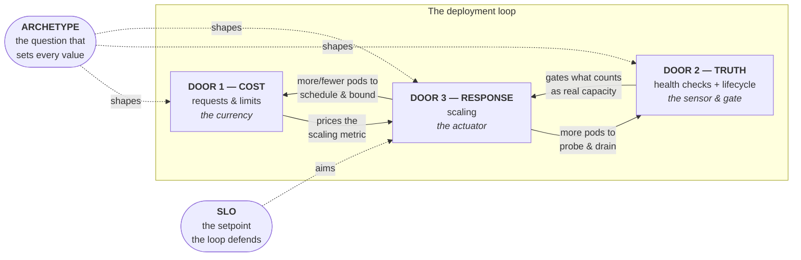
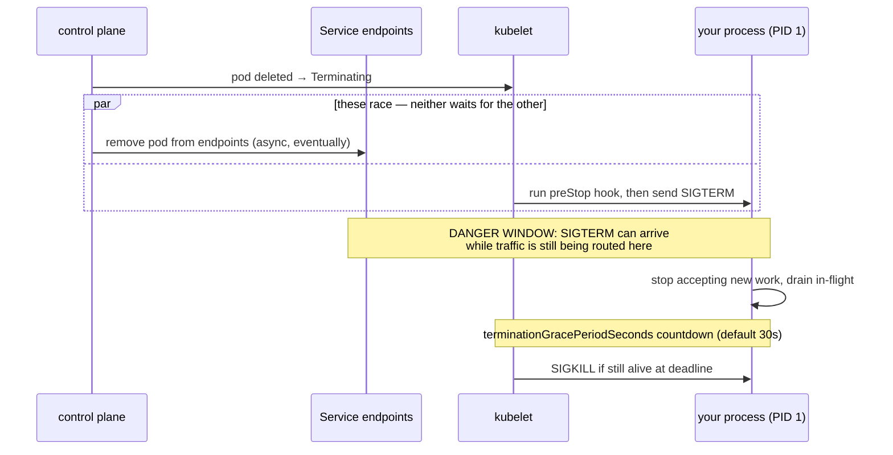
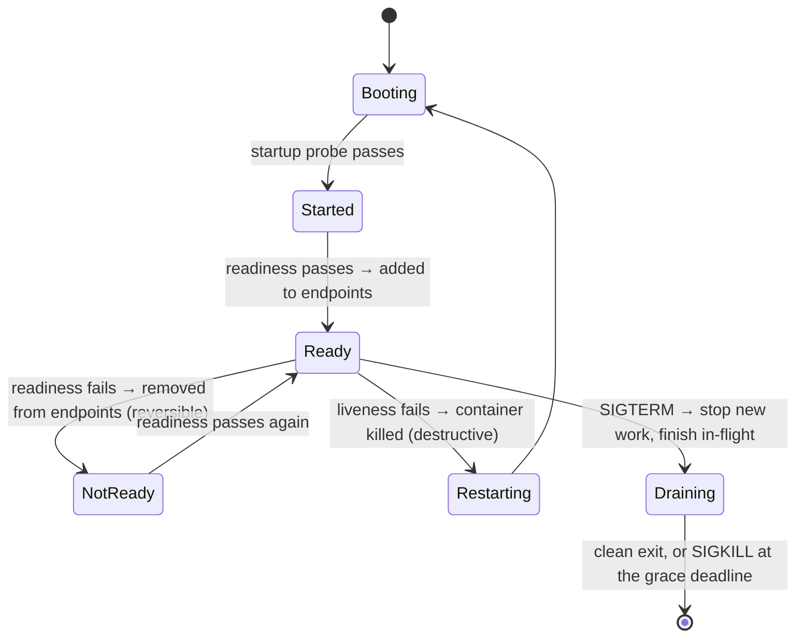
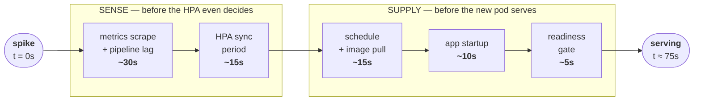

Nearly everything you will configure on a Kubernetes workload comes down to three questions: what does it cost, does it tell the truth about itself, and how does it answer load. Requests and limits. Health checks. Scaling.

You have seen those listed as three things to remember, and the list is the problem: it implies you can set each one correctly and be finished. Teams do exactly that and still ship an outage, because the three are wired to each other. What you decide behind the first door becomes the number the third one divides by. What the second one reports decides whether the third one's new pods count as capacity at all.

This page is a map, not a manual — enough structure to tell which door a problem is behind, and where to go next. The depth lives behind the links.

:::tip[The model in three questions]
For any workload, any [Helm chart](/architectures/golden-service/), any review:

1. **Cost.** What does it reserve, and what happens when it goes over? So the scheduler can place it, the kernel can bound it, and the node can decide who to sacrifice under pressure.
2. **Truth.** Does it report its own state honestly, arriving *and* leaving? So the network knows when to send it traffic, and the kubelet knows when to recycle it.
3. **Response.** How does capacity answer demand? So supply tracks load instead of being a fixed guess.

Ask them in that order. Door 3 is only as good as the answers to 1 and 2.
:::

## Why three, and why a loop

Kubernetes is a control system: you declare a desired state and it works to make the cluster match ([How Kubernetes Works](/start/how-kubernetes-works/)). Cost, truth and response are what it needs from one workload in order to do that.

They are not the only things it will ever ask you about. [Disruption budgets](/workloads/high-availability/), storage, [network policy](/networking/network-policies/), [affinity and topology rules](/workloads/scheduling/) all exist and all matter. But they refine or sit beside these three, and they are rarely where a workload goes wrong first. This is a starting frame, not a complete inventory.

The three behave as a loop because each one's output is the next one's input:


```mermaid
flowchart LR
    subgraph loop["The deployment loop"]
        cost["<b>DOOR 1 — COST</b><br/>requests & limits<br/><i>the currency</i>"]
        truth["<b>DOOR 2 — TRUTH</b><br/>health checks + lifecycle<br/><i>the sensor &amp; gate</i>"]
        resp["<b>DOOR 3 — RESPONSE</b><br/>scaling<br/><i>the actuator</i>"]
        cost -->|"prices the<br/>scaling metric"| resp
        truth -->|"gates what counts<br/>as real capacity"| resp
        resp -->|"more/fewer pods to<br/>schedule &amp; bound"| cost
        resp -->|"more pods to<br/>probe &amp; drain"| truth
    end
    slo(["<b>SLO</b><br/>the setpoint<br/>the loop defends"])
    arch(["<b>ARCHETYPE</b><br/>the question that<br/>sets every value"])
    slo -.->|"aims"| resp
    arch -.->|"shapes"| cost
    arch -.->|"shapes"| truth
    arch -.->|"shapes"| resp
```

The solid arrows are the coupling. The autoscaler computes utilization as a fraction of the request, so Door 1 denominates Door 3's arithmetic. New pods only become real capacity once they pass readiness, so Door 2 gates Door 3. Every scaling action hands more pods back to be scheduled, bounded, probed and drained. Turn one knob and the other two move whether you meant them to.

The dotted nodes govern the loop from outside it, and both are common blind spots. The **SLO** is the *setpoint*, the number the loop exists to defend. The **archetype** decides the correct *value* for all three doors. Both are picked up at the end.

## Door 1 — Cost: requests, limits, and the currency of the cluster

The first surprise behind this door is that requests and limits are not two settings for the same thing. They have different audiences.

- **The request is a promise the scheduler reads.** It is subtracted from a node's allocatable capacity to decide whether your pod fits ([Life of a Deployment](/start/life-of-a-deployment/)), and reserved for you whether or not you use it. It is also the denominator the [autoscaler divides by](/workloads/autoscaling/), and the yardstick the eviction ranker measures you against.
- **The limit is a wall the kernel builds.** It is not scheduling input at all, just a cgroup ceiling enforced at runtime ([cgroups: The Budget](/foundations/cgroups/)). What happens when you hit it depends entirely on which resource.

### CPU is compressible, memory is not

CPU and memory wear the same YAML and obey opposite physics. Miss this and half of Door 1 stays mysterious.

| | **CPU** | **Memory** |
|---|---|---|
| Physical nature | **Compressible.** Can be given in slices and taken back instantly | **Incompressible.** A byte is held or it isn't |
| Request means | A *weight*: proportional share under contention ([CFS](/foundations/cpu-scheduling-and-cfs/)) | A scheduling reservation, and the eviction yardstick ([virtual memory](/foundations/virtual-memory/)) |
| Exceed the **request** | Fine. You borrow idle CPU from neighbours | Fine while the node has free RAM; you are a risk under pressure |
| Exceed the **limit** | **Throttled.** Frozen until the next 100ms window. Latency, never death | **OOM-killed.** The cgroup kills the process. Death, never latency |
| Failure signature | p99 spikes while dashboards show "CPU idle" ([It's Slow](/troubleshooting/its-slow/)) | Exit code 137, `OOMKilled` in `describe` ([OOMKilled](/troubleshooting/oomkilled/)) |
| Practical rule | Set the **request** carefully; the **limit** is often best omitted | Set request **and** limit, usually **equal**, for predictable death |

A CPU limit costs you latency; a memory limit costs you the process. That asymmetry is why many teams set a CPU request and no CPU limit, letting an app burst into idle cores rather than freeze at its quota, and why memory request and limit are usually set equal, so the number you reserved is the number you die at with no surprising gap in between.

Mechanics: [CPU Scheduling and the CFS](/foundations/cpu-scheduling-and-cfs/) and [Virtual Memory and the Page Cache](/foundations/virtual-memory/), which also covers why "90% memory" is usually reclaimable page cache rather than your heap. Real numbers for a real service: [Requests, Limits, and the Knobs](/tuning/requests-limits-knobs/) and the [Sizing Walkthrough](/tuning/sizing-walkthrough/).

:::note[A limit with no request is not just a ceiling]
Set a limit and omit the request for the same resource, and the API server copies the limit into the request when the Pod is created. You will not see it on the Deployment, because that defaulting runs on the Pod: `kubectl get deploy -o yaml` still shows a bare limit while `kubectl get pod -o yaml` shows a request equal to it. It also takes precedence over a LimitRange's `defaultRequest`, which only fills in resources you left blank on both sides. So a `cpu: "2"` limit you meant as a ceiling is also a reservation of two whole cores from the scheduler's budget, on every replica.
:::

### QoS: the class you didn't know you were choosing

The relationship between your requests and limits silently assigns the pod a **Quality of Service class** ([kubernetes.io: Pod QoS](https://kubernetes.io/docs/concepts/workloads/pods/pod-qos/), [Resources & QoS](/workloads/resources-and-qos/)). You never write the class; you imply it.

| QoS class | How you get it | Kernel `oom_score_adj` | Under node pressure | Use it for |
|---|---|---|---|---|
| **Guaranteed** | Every container sets requests **=** limits, for both CPU and memory | ≈ −997 (hardest to OOM-kill) | Evicted last | Latency-critical, stateful, singletons |
| **Burstable** | At least one request or limit set, but not Guaranteed | computed between the two | Depends on whether you are over your request | Most real web apps |
| **BestEffort** | No requests or limits anywhere | ≈ 1000 (killed first) | Evicted first | Genuinely nothing important |

The class becomes your position in the cgroup tree and your `oom_score_adj`: the order the kernel's OOM killer picks victims in when a cgroup runs out of memory.

Node-pressure eviction ranks slightly differently, and the difference is worth knowing. The kubelet sorts by whether the pod is over its request, then by [Pod Priority](https://kubernetes.io/docs/concepts/scheduling-eviction/pod-priority-preemption/), then by how far over it is, so QoS predicts where you land rather than deciding it ([kubernetes.io: pod selection for eviction](https://kubernetes.io/docs/concepts/scheduling-eviction/node-pressure-eviction/#pod-selection-for-kubelet-eviction)). Staying under your request is what protects you.

:::caution[BestEffort is not "flexible", it is first to die]
A pod with no requests anywhere is invisible to the scheduler's arithmetic *and* at the top of the eviction list: the worst of both ends. It is also what you get by leaving the `resources:` block out of a chart. The ranking read from inside a live pod is in the [Linux Inside the Pod field guide](/troubleshooting/linux-inside-the-pod/).
:::

### Worked example

```yaml
resources:
  requests:
    cpu: 250m        # scheduler reserves 1/4 core; HPA's denominator
    memory: 512Mi    # scheduler reserves 512Mi; the eviction yardstick
  limits:
    memory: 512Mi    # == request → incompressible, so pin it. OOM at exactly 512Mi
    # cpu limit deliberately omitted → burst into idle cores, never throttle
```

The scheduler reserves 250m CPU and 512Mi. QoS is **Burstable**, because memory matches but CPU has no limit. Under load the app bursts past 250m into spare cores without throttling; if it ever holds more than 512Mi it is OOM-killed at a predictable line. That `250m` is now the number the autoscaler will divide by: Door 1 pricing Door 3 before Door 3 is configured.

## Door 2 — Truth: health checks and the whole life of a pod

This door is not "add a `/healthz`". It is the pod's contract with the cluster about its own state, from the moment it boots to the moment it is asked to leave. Kubernetes acts on *reported* state, so a pod that lies about being ready, or goes quiet while shutting down, makes the platform take correct actions on false information.

### Three probes, three different questions

Each probe answers a distinct question and has a distinct blast radius when it fails ([kubernetes.io: probes](https://kubernetes.io/docs/concepts/configuration/liveness-readiness-startup-probes/), [Health Checks](/workloads/health-checks/)).

| Probe | Question it answers | On failure | Blast radius | The classic mistake |
|---|---|---|---|---|
| **startup** | "Am I done booting yet?" | Holds off the other two; kills the pod only after `failureThreshold × period` | Just this pod, during boot | Absent, so a slow-booting app is liveness-killed before it ever starts ([CrashLoopBackOff](/troubleshooting/crashloopbackoff/)) |
| **readiness** | "Should I receive traffic right now?" | Pod removed from Service endpoints. **No restart** | Traffic routing, and reversible | Checking a **shared dependency**, so one blip takes every replica NotReady at once |
| **liveness** | "Am I broken beyond recovery?" | kubelet **restarts** the container | Destructive: a restart | Too aggressive under load, so healthy-but-slow pods get killed and the incident amplifies |

Readiness is reversible and liveness is destructive. Readiness failing stops traffic for a moment and lets it resume; liveness failing kills and restarts. Almost every Door 2 disaster is one of those two behaviours applied to the wrong question.

:::danger[Never put a dependency behind a liveness probe]
A liveness probe that checks a database, a cache or a downstream API fails on every replica at the same instant when that dependency hiccups. The kubelet restarts them all simultaneously, and a brief blip becomes a cluster-wide restart storm that outlasts the blip itself. Liveness judges only *this* process. Readiness may answer "can I serve", but never on something a restart cannot fix.
:::

The design discipline is [Health Check Design](/tuning/health-check-design/); the timing knobs are [Health Check Knobs](/tuning/health-check-knobs/).

### The far end: readiness gates traffic in, shutdown must gate it out

Probes cover a pod arriving and running. But scale-downs and rolling updates mean pods are constantly leaving, so termination is the steady state of a healthy deployment rather than an exception. The moment a pod is told to leave, two things happen concurrently.


```mermaid
sequenceDiagram
    participant CP as control plane
    participant EP as Service endpoints
    participant K as kubelet
    participant P as your process (PID 1)
    CP->>K: pod deleted → Terminating
    par these race — neither waits for the other
        CP->>EP: remove pod from endpoints (async, eventually)
    and
        K->>P: run preStop hook, then send SIGTERM
    end
    Note over EP,P: DANGER WINDOW: SIGTERM can arrive<br/>while traffic is still being routed here
    P->>P: stop accepting new work, drain in-flight
    Note over K,P: terminationGracePeriodSeconds countdown (default 30s)
    K->>P: SIGKILL if still alive at deadline
```

:::caution[Endpoint removal races SIGTERM]
Taking a pod out of a Service's endpoints is *eventually consistent* and waits for nothing. An app that hears `SIGTERM` and exits immediately can die while the Service is still routing requests to it. That is the intermittent 5xx that correlates with deploys and reproduces nowhere else.
:::

The fixes all live behind this door: a `preStop` sleep that outlasts endpoint propagation, an app that catches SIGTERM and *drains* rather than exits, a `terminationGracePeriodSeconds` long enough to finish in-flight work, and the knowledge that [long-lived connections](/networking/long-lived-connections/) don't drain themselves. Catching the signal at all requires the app to be [PID 1 and actually receive it](/foundations/processes-and-signals/), which a shell-form `ENTRYPOINT` quietly prevents. Every knob: [Graceful Shutdown](/workloads/graceful-shutdown/), [Rollout & Shutdown Knobs](/tuning/rollout-shutdown-knobs/), [kubernetes.io: Pod termination](https://kubernetes.io/docs/concepts/workloads/pods/pod-lifecycle/#pod-termination).

Startup, readiness, liveness and drain are one state machine, the same contract at both ends:


```mermaid
stateDiagram-v2
    [*] --> Booting
    Booting --> Started: startup probe passes
    Started --> Ready: readiness passes → added to endpoints
    Ready --> NotReady: readiness fails → removed from endpoints (reversible)
    NotReady --> Ready: readiness passes again
    Ready --> Restarting: liveness fails → container killed (destructive)
    Restarting --> Booting
    Ready --> Draining: SIGTERM → stop new work, finish in-flight
    Draining --> [*]: clean exit, or SIGKILL at the grace deadline
```

Scaling is only safe because this door is honest at both ends.

## Door 3 — Response: scaling, and the two questions it can't answer itself

The payoff behind this door is elasticity, capacity that tracks demand. The catch is that it forces two questions you cannot answer from inside it.

### Scale on what? The SLO is the setpoint

The Horizontal Pod Autoscaler is a control loop with a simple core ([kubernetes.io: HPA algorithm](https://kubernetes.io/docs/tasks/run-application/horizontal-pod-autoscale/#algorithm-details)):

```text
desiredReplicas = ceil( currentReplicas × (currentMetricValue / desiredMetricValue) )
```

Everything rides on the metric you pick, and the default choice of CPU utilization is usually the wrong thing to defend. Users do not feel CPU. They feel latency, errors and staleness. The metric is your SLO written as a number, which is why Door 3 cannot be configured until someone has answered "what does good feel like to a user?" ([SLOs for Scaling](/autoscaling/slos-for-scaling/), [Signals Catalog](/autoscaling/signals-catalog/)).

:::caution[The request is the HPA's denominator]
CPU utilization in the HPA is `currentCPU ÷ requestedCPU`, summed across pods. It is not a percentage of the node, of the limit, or of anything physical. Set the request wrong and every scaling decision is computed against a wrong number, which is Door 1 reaching straight into Door 3's arithmetic.
:::

### Scale what, and should you at all? The archetype

Horizontal scaling assumes one more identical replica means more capacity. That is true of a stateless web app and false of a great many other things. The archetype decides not just the signal but whether this door opens at all.

| Archetype | Scale on | Horizontal scaling? | Why |
|---|---|---|---|
| Stateless web/API | Latency, RPS, or CPU as a proxy | Yes, freely | Replicas are interchangeable |
| Queue / async consumer | **Queue depth or lag**, not CPU | Yes, on the backlog | CPU is flat while the queue floods ([Messaging Consumers](/autoscaling/messaging-consumers/)) |
| Batch / Job | Parallelism, not an HPA | Via completions/parallelism | It finishes; it doesn't serve |
| Stateful (DB, cache) | Rarely, and carefully | Usually **no** | Identity and data gravity; more replicas is not more capacity |
| Leader-elected singleton | Never horizontally | **No** | Two active leaders is a bug, not double capacity |

One more trap sits at the boundary with the network. Horizontal scaling only distributes load if the traffic actually spreads. A single long-lived **HTTP/2 or gRPC** connection pins all of its streams to one backend, so you can scale to twenty pods and watch one of them take everything ([HTTP](/networking/http/), [long-lived connections](/networking/long-lived-connections/)). Adding replicas is necessary, not sufficient.

This is why the [autoscaling playbook](/autoscaling/overview/) treats Doors 1 and 2 as prerequisites rather than companions: scaling over a wrong request or a dishonest probe is an amplifier for your own mistake. Read through this model, the [No-Assumptions Checklist](/autoscaling/prerequisites/) is just "is Door 1 correct and Door 2 honest yet?". Applied path: [Classify Your App](/autoscaling/classify-your-app/) → [Load Profile](/autoscaling/load-profile/) → [Capacity & Governance](/autoscaling/capacity-and-governance/); when the loop won't move, [HPA Not Scaling](/troubleshooting/hpa-not-scaling/).

### Gain and dead time

Two properties of this loop cause most autoscaling pain, and both are borrowed from control theory for a reason.

**Gain** is how hard the loop reacts to an error. Door 1 sets it, because utilization is usage ÷ request: a request three times too small makes the loop react three times too hard, so it overshoots and then hunts.

**Dead time** is the delay between the spike and capacity actually serving. Scaling is not instant, and the pieces add up:


```mermaid
flowchart LR
    s(["<b>spike</b><br/>t = 0s"])
    subgraph sense["SENSE — before the HPA even decides"]
        direction LR
        m["metrics scrape<br/>+ pipeline lag<br/><b>~30s</b>"] --> h["HPA sync<br/>period<br/><b>~15s</b>"]
    end
    subgraph supply["SUPPLY — before the new pod serves"]
        direction LR
        sc["schedule<br/>+ image pull<br/><b>~15s</b>"] --> b["app startup<br/><b>~10s</b>"] --> r["readiness<br/>gate<br/><b>~5s</b>"]
    end
    d(["<b>serving</b><br/>t ≈ 75s"])
    s --> m
    h --> sc
    r --> d
```

Call it 60 to 90 seconds on a warm node, and several minutes if a new node has to be provisioned first. Get the gain wrong and you thrash; ignore the dead time and a spike hurts long before help arrives. Both are worked out with numbers in [Scaling Dynamics](/autoscaling/scaling-dynamics/).

## When it breaks: the loop in the wild

If the three doors were independent, a mistake behind one would show up as a symptom at the same one, and you would tune the thing that is broken. Mostly it doesn't work that way. Every row below is a common incident where the symptom and the cause sit behind different doors.

| The symptom you see (Door) | The mistake that actually caused it (Door) | Why the loop carried it there |
|---|---|---|
| HPA never scales up; pods overloaded (**Response**) | Request set far too high (**Cost**) | Utilization = usage ÷ request; an inflated request keeps the ratio low, so the HPA sees headroom |
| HPA flaps, thrashing replicas (**Response**) | Request set too low (**Cost**) | Tiny denominator, so utilization swings wildly on small load changes and [the loop oscillates](/autoscaling/scaling-dynamics/) |
| "We need to scale, CPU is pegged" (**Response**) | A CPU **limit** causing throttling (**Cost**) | Throttled pods look CPU-bound, so you scale out to escape a wall you built yourself ([throttled-but-idle](/troubleshooting/its-slow/)) |
| Intermittent 5xx correlated with deploys (**Truth**) | Scaling and rollout churn with no drain (**Response × Truth**) | Every removal sheds in-flight requests when the app doesn't drain |
| Whole service goes NotReady in an instant (**Truth**) | Readiness checks a shared dependency (**Truth**), and scaling can't help (**Response**) | One blip fails every replica's probe at once; adding replicas just makes more NotReady pods |
| Cascading restart storm under load (**Truth**) | Liveness too aggressive (**Truth**), amplified by fixed capacity (**Response**) | Slow-but-healthy pods get killed; the survivors take more load and die too |
| Random pods killed first under pressure (**Cost**) | No requests set, so BestEffort (**Cost**) | With no request there is nothing to be "under", so you sort to the top of the eviction list |
| Scaled to 20 pods, one takes all the traffic (**Response**) | A long-lived h2/gRPC connection (**network**) defeats distribution | Replicas exist, but the connection pins streams to one backend |

Read the middle column against the first. A scaling problem is usually a cost problem. A truth problem becomes a scaling problem. A cost setting decides who the kernel kills. You cannot tune that away door by door, because the loop is doing what loops do: carrying a disturbance from where it started to somewhere else.

## What sits outside the three

Three things get mistaken for a fourth door. Putting each back where it belongs is most of what the model buys you:

- The **SLO** is what Door 3 aims at. Without it, "tune them in unison" points at nothing. Usually latency, error rate or freshness; almost never raw CPU.
- The **archetype** is the question that sets the values behind all three, answered before you turn a single knob ([Classify Your App](/autoscaling/classify-your-app/)).
- **Graceful shutdown** is the far end of Door 2: the last true thing a pod says about itself.

## Using it on a real chart

Walk the doors in order and ask each one's question.

1. **Cost.** Are requests set at all, or is this BestEffort and first in line under pressure? Is the memory request equal to its limit? Is the CPU limit buying anything, or just throttling? Is the request a *measured* number, given the HPA is about to divide by it?
2. **Truth.** A startup probe if the boot is slow. Readiness that gates traffic without checking things a restart can't fix. Liveness that judges only this process. A real drain path: `preStop`, SIGTERM handling, and a grace period long enough to finish the work.
3. **Response.** What is the signal, and is it the SLO rather than reflexive CPU? Is the archetype horizontally scalable at all? Are Doors 1 and 2 right first, given scaling amplifies whatever they got wrong?

Debugging runs the same model backwards: name the door the *symptom* is at, then check the other two for the cause, because that is usually where it lives. [Triage methodology](/troubleshooting/triage-methodology/) is this page in reverse.

Two sibling models finish the set. Every question a door asks is answered by a measurement, so the loop is only as good as its sensors: which instrument took the number, what it can't see, and why a correct number read through the wrong one is the commonest misdiagnosis on a cluster is [The Three Lenses](/start/three-lenses/). And when a door's promise breaks outright, so the pod isn't there or requests to it fail, the map of where to look first is [The Two Roads](/start/two-roads/).
