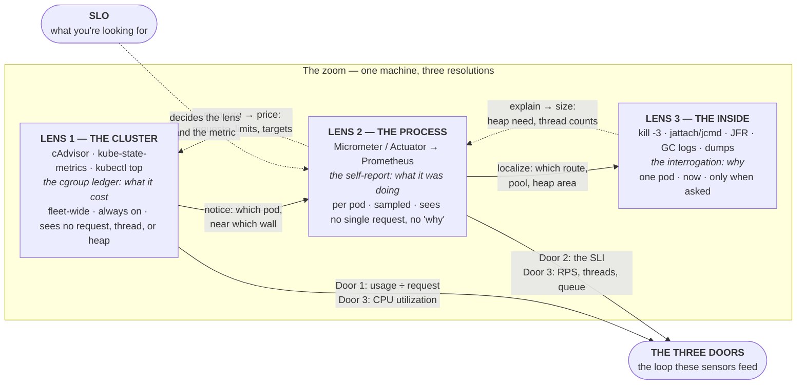

Here is a claim, and the rest of this page is its proof: **every number you will ever read about a workload on Kubernetes was taken through one of three lenses — the cluster's view of your container, the process's report about itself, or the inside view you get only by stopping and looking — and every production misreading is a number seen through one lens and explained with another lens's physics.** `kubectl top`. Prometheus and Grafana. Actuator and Micrometer. Thread dumps, heap dumps, JFR. You have seen these listed as a toolbox — pick the tool for the job. That framing is not wrong so much as *inert*: it treats them as interchangeable instruments, and the toolbox is exactly why teams read "memory at 95%" off one instrument, fix it with a knob that belongs to another, and get paged again next week.

The upgrade is one word. They are not a **toolbox**. They are a **zoom**. Each lens sees the same physical machine at a different resolution, and each lens has a blind spot that exactly the next lens fills. Get that, and the instruments stop being trivia you reach for and become one optical system you can reason about — where a number that makes no sense through one lens is very often a number that was never that lens's to explain. That coupling is the whole thesis, and it is *mechanical*: it comes from where each lens physically stands. We will prove it.

This page is the sibling of [The Three Doors](/start/three-doors/). The doors are the control loop — cost, truth, response — and a control loop is only as good as its sensors. The lenses are the sensors. Everything else on this site about measurement — [Metrics](/observability/metrics/), [PromQL for CPU and Memory](/observability/promql-for-resources/), [Java Observability](/java/java-observability/), [Actuator](/java/actuator/), the [jattach](/java/jattach-deep-dive/), [thread-dump](/java/thread-dumps-jre-only/), and [heap-dump](/java/heap-dumps-jre-only/) pages, the [signals catalog](/autoscaling/signals-catalog/) — is one of these three lenses picked up and looked through. This page is the map you hold before you pick one up.

## Why three, and why a zoom

Strip observability to its job. You want to know what a running program is doing. There are exactly three places to stand to find out, and not a fourth:

1. **Outside the process, at the kernel's ledger.** The container is a cgroup, and the kernel keeps accounts for every cgroup: CPU-seconds charged, periods throttled, bytes resident, kills delivered ([cgroups](/foundations/cgroups/)). This is what the kubelet's cAdvisor exports and what `kubectl top` and kube-state-metrics summarize. It is the **cluster's lens** — perfectly accurate about what your container *cost*, and structurally blind to what it was *doing*.
2. **Inside the process, continuously, by self-report.** The JVM measures itself — heap by pool, GC pauses, threads, classes — and the framework measures the work — requests by route, pool waits, queue depths — and publishes the lot at `/actuator/prometheus` for Prometheus to sample every few seconds. This is the **process's lens** — it knows what the container was doing, at the price of being an *aggregate*, a *sample*, and a *self-report*.
3. **Inside the process, on demand, by interrogation.** Stop the JVM at a safepoint and ask it directly: every thread's stack, every object on the heap, every byte of native memory, every allocation of the last five minutes. `kill -3`, `jattach`, `jcmd`, JFR, GC logs, async-profiler. This is the **inside lens** — it sees everything, about *one process*, *right now*, and only because you asked.

Cost, report, interrogation. There is no fourth place to stand — everything else you'll ever hear called observability (logs, traces, an APM agent, a dashboard) turns out to be one of these three with different clothes on; the [end of this page](#what-is-not-a-fourth-lens) makes that case explicitly. That is why there are three lenses and not five.

And they form a zoom because each lens's blind spot is precisely the next lens's field of view:



Read the solid arrows first. **Diagnosis walks in**: the cluster's lens tells you *that* something is wrong and *which* pod is near which wall; the process's lens tells you *what inside* — which route, which pool, heap or native; the inside lens tells you *why* — which threads, which objects, which frames. Now read the dotted arrows. **Sizing walks out**: a GC log and a thread dump (lens 3) tell you what the heap and the thread pools actually need; steady-state gauges (lens 2) turn that into a measured number; the measured number becomes a request and a limit (lens 1), and the request is the currency [Door 1](/start/three-doors/) prices everything in. Turn the zoom one way to find a cause, the other way to set a knob. **That is what makes it a zoom and not a toolbox — the lenses are ordered, and the order is the workflow.**

The two dotted nodes sit *outside* the zoom but govern it. The **Three Doors** loop is the consumer: Door 1's "how far over the request are we?" is a lens-1 read; Door 2's readiness and the SLI it protects live in lens 2; Door 3 scales on lens 1 (CPU) or lens 2 (RPS, threads, queue depth) and must never scale on lens 3. And the **SLO** is what you're looking *for* — it decides which lens and which metric before you open Grafana, exactly as it decides the scaling signal in [SLOs for Scaling](/autoscaling/slos-for-scaling/). Hold both; they pay off at the end.

## The physics that governs everything: shape dictates the verb, and a scrape is a sample

Before opening any lens, two facts about the numbers themselves — they apply to every metric on every lens, and missing either one is how careful people read a correct number wrongly.

### A metric's shape dictates the only verb you may use on it

Every Prometheus series has one of three shapes, and each shape permits exactly one kind of question. Use the wrong verb on the wrong shape and the query runs, returns a number, and lies ([Metrics](/observability/metrics/#essential-promql-for-app-teams) states the golden rule; this is why it's golden):

| Shape | What it is | The verb | Never | Examples, by lens |
|---|---|---|---|---|
| **Counter** | A **distance** — only ever goes up (resets to 0 on restart) | `rate()` / `increase()` over a window | Read it raw; average it | L1: `container_cpu_usage_seconds_total`, `container_cpu_cfs_throttled_periods_total`, `kube_pod_container_status_restarts_total` · L2: `http_server_requests_seconds_count`, `jvm_gc_memory_allocated_bytes_total` |
| **Gauge** | A **position** — a level that goes up and down | Read it; `avg_over_time`/`max_over_time` it | `rate()` it | L1: `container_memory_working_set_bytes`, `kube_pod_container_resource_requests` · L2: `jvm_memory_used_bytes`, `tomcat_threads_busy_threads`, `hikaricp_connections_pending`, `jvm_threads_live_threads` |
| **Histogram** | A **distribution** — counts of observations at-or-under each bucket edge (`_bucket{le=…}`), plus `_sum` and `_count` | `histogram_quantile()` over `rate()` of the buckets; `_sum ÷ _count` for the mean | Average a percentile; quote a percentile the buckets can't resolve | L2: `http_server_requests_seconds`, `jvm_gc_pause_seconds`, `hikaricp_connections_acquire_seconds` |

The one sentence to engrave: **rate the distance, read the position, quantile the distribution.** A counter's raw value is meaningless (it's "CPU-seconds since the container started"); its rate is the signal, and `rate()` also quietly survives the reset every restart causes — which is why a counter is the *only* shape that tolerates gaps. A gauge is already a level, so rating it produces a derivative nobody wanted. A histogram is the only shape that can answer "how bad is it for the unluckiest one in twenty," and only if its bucket edges are near the number you care about: `histogram_quantile` *interpolates* between edges, so a p95 of 480 ms read from buckets that jump from 200 ms to 500 ms is a guess wearing three significant figures. That is why the site's Spring config puts exact edges at the SLO boundary ([the `slo:` buckets](/autoscaling/getting-the-metrics/#1-make-the-app-publish)) and why a percentile quoted on this site always comes with a link to that gotcha ([percentiles in practice](/autoscaling/slos-for-scaling/#percentiles-in-practice)). And the reason averages lie is the shape too: `_sum ÷ _count` is a legitimate verb, but it collapses the distribution — ten requests at 50 ms and one at 1,700 ms average to 200 ms, and the 1,700 ms user is the one who files the ticket.

### A scrape is a sample

Lenses 1 and 2 don't watch your process; they photograph it. Prometheus opens the shutter every scrape interval — 15 or 30 seconds on most platforms — and records what it sees. Anything that starts and finishes *between* two photographs was never seen, and how much of it survives depends entirely on the shape:

```text
t=0s        scrape ── gauge: jvm_threads_states{state="blocked"}=2
                        counter: cpu_seconds=1,204.1
t=7s          ┌── 2.3 s stop-the-world GC pause ──┐        ← the event
t=30s       scrape ── gauge: blocked=2      (the pause is over; the gauge is innocent)
                        counter: cpu_seconds=1,231.9   (the seconds it burned are IN the distance)
                        histogram: jvm_gc_pause_seconds_bucket{le="2.5"} +1   (recorded, forever — if the timer publishes buckets)
                        timer max: jvm_gc_pause_seconds_max=2.3 (visible for ~2 min, then decays)
Lens 3:     -Xlog:gc* line at t=7.0s: "Pause Full (G1 Compaction Pause) 2317.4ms"   (always there)
```

A gauge read at 0 s and 30 s shows a calm process; the pause fell between the frames. The counter absorbed it — the CPU it burned is in the distance — but can't tell you it was one pause rather than steady load. The histogram bucket recorded it permanently, which is why GC pauses and request latencies are histograms and not gauges — provided the timer was configured to publish buckets at all (`percentiles-histogram` is off by default for every timer, the GC pause timer included; [the tactical toolkit](/java/lens-playbooks-diagnose/#6-histograms-for-the-four-timers-youll-quantile) turns it on for the four you'll quantile). The `_max` series Micrometer publishes is a sliding maximum that decays after about two minutes — visible if your dashboard happened to refresh, gone if it didn't. And lens 3's GC log has the exact millisecond, because a log isn't a sample. Three consequences you'll use constantly: **nothing shorter than the interval is trustworthy from a gauge**; **`rate()` windows should be at least four times the interval** (the site's `[5m]` convention on 30 s scrapes), or the window may hold too few points to compute; and **`kubectl top` is one photograph** — the newest sample from metrics-server, a different camera on the same cgroup — so "top says 300m, Prometheus says 900m" is two shutter speeds, not two facts ([Layer 1 vs Layer 2](/observability/metrics/#layer-1-metrics-server-and-kubectl-top)).

Now we pick up each lens and go as deep as it goes.

## Lens 1 — The cluster's view: the cgroup ledger

Pick up this lens and the first thing you notice is that it never saw your application. It saw a **cgroup** — a container — and it reports what the kernel charged that cgroup for. That is its strength: the numbers are not a self-report, they are the bill, and the bill is what the scheduler, the OOM killer, and the autoscaler read. It is also its limit: the ledger has no column for "request," "thread," or "heap."

Two exporters make up the lens, and you instrumented neither ([the inventory](/observability/promql-for-resources/#the-metric-inventory)):

| Source | What it proves | The series that matter |
|---|---|---|
| **cAdvisor** (inside the kubelet; the cgroup's counters, per container) | CPU actually consumed and CPU *denied* (throttling); memory actually held, three different ways; network bytes; OOM kills | `container_cpu_usage_seconds_total`, `container_cpu_cfs_throttled_periods_total` / `container_cpu_cfs_periods_total`, `container_memory_working_set_bytes`, `container_memory_rss`, `container_memory_usage_bytes`, `container_oom_events_total` |
| **kube-state-metrics** (the API server's objects, as gauges) | What you *asked for* and what happened to the pod: requests, limits, restarts, last termination reason, phase, replica counts | `kube_pod_container_resource_requests` / `_limits`, `kube_pod_container_status_restarts_total`, `kube_pod_container_status_last_terminated_reason`, `kube_pod_status_phase`, `kube_deployment_status_replicas_available` |
| **metrics-server** (`kubectl top`, the HPA's CPU/memory source) | The same cgroup numbers, latest sample only, no history | `kubectl top pod` — a photograph, not a series |

The lens answers three questions, and the site's cookbook is built on all three:

**How far from the wall?** Memory, as the OOM killer sees it — working set against the limit, the number that decides [Door 1](/start/three-doors/#door-1--cost-requests-limits-and-the-currency-of-the-cluster)'s life-or-death:

```promql
container_memory_working_set_bytes{namespace="payments", container="payments-api"}
  / on (pod, container)
kube_pod_container_resource_limits{namespace="payments", container="payments-api", resource="memory"}
```

**Is the CPU quota biting?** The number that hides behind every "CPU looks fine" — the fraction of scheduler periods in which the container wanted CPU and was refused:

```promql
rate(container_cpu_cfs_throttled_periods_total{namespace="payments", container="payments-api"}[5m])
  / rate(container_cpu_cfs_periods_total{namespace="payments", container="payments-api"}[5m])
```

**Is it dying?** Restarts, and why — kube-state-metrics keeps the last termination reason as a labeled series:

```promql
increase(kube_pod_container_status_restarts_total{namespace="payments"}[1h]) > 0
kube_pod_container_status_last_terminated_reason{namespace="payments", reason="OOMKilled"}
```

### The two traps of the first lens

**The memory zoo.** Three gauges all called "memory," and only one is the number the kernel judges you by. `container_memory_usage_bytes` includes reclaimable page cache and reads scarier than reality; `container_memory_rss` excludes cache entirely and under-reports active file mappings; **`container_memory_working_set_bytes`** — usage minus inactive cache — is what the OOM killer compares to your limit ([virtual memory and the page cache](/foundations/virtual-memory/) is the why). Read the wrong one and you'll size a limit against a number that was never going to kill you.

**The idle-looking wall.** CPU usage is an average over the rate window; CPU throttling is a *quota* enforced every 100 ms ([CFS](/foundations/cpu-scheduling-and-cfs/)). A container can average 30% of its limit and still be frozen for a quarter of every 100 ms window, and the usage graph will show a calm 30%. The throttle ratio above is the only lens-1 series that sees it, and it is the site's [number-one cause of "it's slow but green"](/troubleshooting/its-slow/#cause-1-cpu-throttling--the-1-and-the-one-your-graphs-hide). Note what this lens *still* can't tell you: whether those bursts were computation or 200 threads spinning on a lock — that is lens 2's question.

**What it costs:** nothing. It is always on, the platform runs it, and it works for every language. **What it can't see:** anything with a name your application gave it. A request. A route. A thread pool. The heap. The difference between "memory held" and "memory needed." For all of those you turn the zoom.

## Lens 2 — The process's view: the self-report

Pick up this lens and the container disappears; you're looking at a *process that measures itself* and publishes the measurements for someone to sample. On a Spring Boot service that someone is Micrometer, the surface is Actuator's `/actuator/prometheus`, and the sampler is the platform's Prometheus. Three things distinguish this lens from the first, and each is both its power and its blind spot: it is a **self-report** (the JVM says what the JVM knows), an **aggregate** (counts and sums per label set, never a single request), and a **sample** (whatever the shutter caught).

### The chain from a number to a graph

Nothing on this lens exists until four links are in place, and "no data for our pod" is almost always link two, not link one:

1. **Publish.** The dependency (`micrometer-registry-prometheus`) plus exposure (`management.endpoints.web.exposure.include: health,prometheus`) — [Actuator](/java/actuator/) owns the exposure discipline, and [the pipeline page](/autoscaling/getting-the-metrics/#1-make-the-app-publish) the exact config, including the two switches that are off by default: `percentiles-histogram` (without it, no latency buckets exist — no p95, anywhere) and `server.tomcat.mbeanregistry.enabled` (without it, no thread-pool gauges).
2. **Be scraped.** A `ServiceMonitor` or `PodMonitor` in your namespace whose labels match what the platform's Prometheus selects on (the `release: monitoring` lesson from [Lab 6](/labs/lab-6-observability/)). The proof is one query: `up{namespace="payments", job=~"payments-api.*"}` — `1` means the shutter is opening; `0` or absent means nothing downstream is real. Alert on `absent()` of it ([the dead-man's switch](/observability/alerting/#the-dead-mans-switch-absent)).
3. **Carry an identity.** The scrape stamps `pod`, `container`, `namespace` onto every series — the same labels lens 1 carries. That shared label set is the **join key between lenses**, and it's what makes the single most useful two-lens query on this site possible (below).
4. **Be read with the right verb.** Shape dictates the verb — the section above.

### What the process reports about itself

| Family | Series | What it tells you | Shape |
|---|---|---|---|
| **The work** (framework) | `http_server_requests_seconds` by `uri`, `method`, `status`, `outcome` | Rate, errors, and latency *per route* — the RED view, and the SLI your SLO is written against | histogram |
| **The waiting** (pools) | `tomcat_threads_busy_threads` vs `tomcat_threads_config_max_threads`; `hikaricp_connections_active` / `_pending` / `_max`; `executor_active_threads`, `executor_queued_tasks` | Saturation: whether requests are *waiting for a thread or a connection* rather than computing — the leading indicator lens 1's CPU can't see ([the thread entry in the signals catalog](/autoscaling/signals-catalog/#thread-pool-saturation)) | gauge |
| **The heap** | `jvm_memory_used_bytes{area="heap"}` / `_max_bytes`, by `id` (pool) | How much of the heap is live, and where; whether old-gen is ratcheting | gauge |
| **The collector** | `jvm_gc_pause_seconds` (histogram + `_max`), `jvm_gc_memory_allocated_bytes_total`, `jvm_gc_overhead_percent` | Pause length distribution, allocation rate, the fraction of wall time spent collecting | histogram / counter / gauge |
| **The threads and classes** | `jvm_threads_live_threads`, `jvm_threads_states_threads{state}`, `jvm_classes_loaded_classes`, `jvm_buffer_memory_used_bytes{id="direct"}` | Thread leaks (a staircase), blocked-thread pileups, classloader leaks, direct-buffer creep | gauge |
| **The JVM's own CPU view** | `process_cpu_usage` | The process's CPU as a *fraction of the cores the JVM believes it has* — the cgroup quota, not the node | gauge |
| **Yours** | `@Timed` on a method, a `Counter` or `Gauge` from the `MeterRegistry` — `orders_placed_total`, `dispatch_backlog` | The business number that becomes a [custom scaling signal](/autoscaling/getting-the-metrics/#custom-metrics--when-and-how) | your choice |

### The two-lens query

Because lens 1 and lens 2 share the `pod` label, you can subtract one from the other — and the difference is a number neither lens can produce alone:

```promql
# pod memory (the kernel's bill) minus JVM heap in use (the process's report) = the non-heap footprint
container_memory_working_set_bytes{namespace="payments", pod=~"payments-api.*", container="payments-api"}
  - on (pod)
sum by (pod) (jvm_memory_used_bytes{namespace="payments", pod=~"payments-api.*", area="heap"})
```

That gap is metaspace, thread stacks, code cache, direct buffers, and the collector's own overhead — [the tenants that share the container with the heap](/java/jvm-in-containers/#total-jvm-memory-heap-is-just-the-biggest-tenant). Stable, it's your non-heap budget and it sizes `MaxRAMPercentage` ([the RSS budget, worked](/tuning/jvm-memory-knobs/#the-rss-budget-worked)). Growing under flat heap, it's a native leak, and *no single lens would have shown you that* — lens 1 sees a pod that's getting fatter, lens 2 sees a heap that's fine. This query is the model in one line: the truth was in the difference between two lenses.

### The two traps of the second lens

**It's an aggregate.** `http_server_requests_seconds` knows that 11,209 requests to `/api/checkout` finished under 500 ms this hour. It does not know which ones, for whom, or why the other 340 didn't. When a p99 is on fire, lens 2 can tell you *which route* and *since when* — [the four-quadrant read](/troubleshooting/its-slow/#the-confirm-step-slow-for-everyone-or-slow-for-some) is pure lens 2 — but it cannot tell you what a slow request was *doing*. That is lens 3.

**It costs cardinality.** Every distinct label combination is a series Prometheus stores and every query scans. Micrometer tags requests with the *route template* (`uri="/api/orders/{id}"`) and not the raw path precisely so that a million order IDs don't become a million series — and Spring caps the distinct `uri` values it will accept (100 by default) and warns when you blow through it. A custom metric tagged with a user ID, a message key, or a timestamp is a cardinality bomb with a `MeterRegistry` call for a fuse. The rule: **tag with things you'd put in a `GROUP BY`, never with things you'd put in a `WHERE`.**

**What it costs:** a few percent of CPU and the cardinality you choose. **What it can't see:** an individual request, the reason for anything, anything that happened between two scrapes (the shutter), and anything nobody instrumented. For all of those you turn the zoom again.

## Lens 3 — The inside view: interrogation

Pick up this lens and the graph disappears too; you are inside one JVM at one instant, and it will tell you *anything* — because you stopped it and asked. Every instrument on this lens has the same signature: **complete, present-tense, single-process, and paid for.** Paid for in a safepoint pause (the JVM freezes while it answers), in disk (a heap dump is the size of the heap), in RBAC (`kubectl exec` and a tool in the image), and in your own attention — this lens shows you only what you thought to ask for.

| Question | Instrument | The command (JRE-only image; PID 1 when your entrypoint is exec-form) | What it costs | The page |
|---|---|---|---|---|
| What is every thread doing *right now*? | Thread dump | `kubectl exec payments-api-7c9d4f6b8-k2xvn -n payments -- kill -3 1` → read `kubectl logs` | A safepoint of milliseconds; harmless | [Thread Dumps with a JRE Only](/java/thread-dumps-jre-only/) |
| Where did the memory go, by class? | Class histogram | `… -- /tmp/jattach 1 jcmd GC.class_histogram` | Walks the whole heap: seconds of pause | [the cheaper-first step](/java/heap-dumps-jre-only/#cheaper-first-the-class-histogram) |
| What is *holding* it? | Heap dump | `… -- /tmp/jattach 1 dumpheap /dumps/payments.hprof` (or automatic on OOM: `-XX:+HeapDumpOnOutOfMemoryError`) | Pause for the write, a file the size of the heap, then [getting it out](/java/getting-dumps-out/) | [Heap Dumps with a JRE Only](/java/heap-dumps-jre-only/) |
| Where did the *non-heap* bytes go? | Native Memory Tracking | `… -- /tmp/jattach 1 jcmd "VM.native_memory summary"` — only if the JVM started with `-XX:NativeMemoryTracking=summary` | ~5–10% overhead while enabled; needs a restart to enable | [Memory Leaks and OOM](/java/memory-leaks-and-oom/#native-memory-the-heap-looks-innocent-because-it-is) |
| How is the heap laid out and sized? | `jcmd GC.heap_info`, `VM.flags` | `… -- /tmp/jattach 1 jcmd GC.heap_info` | Negligible | [jattach Deep Dive](/java/jattach-deep-dive/) |
| What happened in the last five minutes? | JFR, always-on ring buffer | `-XX:StartFlightRecording=…,maxage=…` at launch; `… jcmd JFR.dump filename=/dumps/x.jfr` when something happens | ~1–2% continuously; the one lens-3 instrument with a memory | [JFR](/java/java-observability/#jfr-the-black-box-flight-recorder-you-already-have) |
| Every pause, with a timestamp | GC log | `-Xlog:gc*:stdout:time,uptime,level,tags` — a lens-3 stream cheap enough to leave on | Log volume | [GC and Performance](/java/gc-and-performance/#gc-logging-turn-it-on-leave-it-on) |
| Which frames burn the CPU? | async-profiler via an ephemeral container | flame graph on a live pod | A few percent while sampling; platform help for `perf_events` | [async-profiler](/java/java-observability/#async-profiler-via-ephemeral-container) |

Two of those rows deserve a second look because they *change the lens's nature*. **JFR** and **GC logs** are lens-3 instruments that record continuously — which means they are the only way to give the inside lens *history*. A thread dump at 3 a.m. shows you 3 a.m.; a JFR ring buffer dumped at 3 a.m. shows you 2:55. The [layered posture](/java/java-observability/#the-layered-posture-summarized) on the Java pages is exactly this: leave the cheap always-on instruments running so that when lens 2 tells you *when*, lens 3 can already tell you *why*.

### The two traps of the third lens

**Selection bias.** You exec into a pod. Which pod? If lens 2 said the p99 is on fire fleet-wide, any pod will do. If it said one pod is 8× slower than its siblings, the thread dump from a healthy pod is a very detailed picture of nothing. Lens 3 is never where you *start*; it's where lens 2 *sends* you — to a named pod, for a named reason. And one dump is a single frame: the thread-dump page's rule is [three to five dumps, ten seconds apart](/java/thread-dumps-jre-only/#capture-35-dumps-10-seconds-apart), because a stack that's the same in all five is a stall and a stack that differs is just a busy thread.

**It costs the thing you're measuring.** A heap dump of a 6 GiB heap pauses the JVM for the write and lands a 6 GiB file on a pod that may have 200 MiB of ephemeral storage. A class histogram walks the entire heap. NMT taxes every allocation while it's on. On a pod already at the edge, the interrogation can be the push — which is why the cheap instruments (SIGQUIT, `GC.heap_info`, the histogram, a JFR dump from an existing recording) come first on every Java page, and the expensive one (the full heap dump) is either automatic-on-OOM or a deliberate decision with a place to put the file.

**What it costs:** a pause, a file, and a role. **What it can't see:** the fleet, history it wasn't recording, and anything you didn't ask. For all of those you turn the zoom back out — which is the whole point: the lenses aren't alternatives, they're a sequence.

## The proof: the misreading gallery

Here is where the hypothesis is won or lost. If the three lenses were truly a toolbox — independent instruments for independent jobs — then a confusing number would be resolved by looking harder through the *same* instrument. The claim is the opposite: **because it is a zoom, a number that makes no sense through one lens is explained by another.** Every row below is a real, common misreading: a correct number, seen through the wrong lens, fixed with a knob that belonged to a different one.

| The number you read (lens) | What was actually true (lens) | Why the first lens couldn't have told you |
|---|---|---|
| "Memory is at 95% of the limit — raise the limit" (**1**, working set) | The heap was flat at 40%; metaspace, thread stacks, and direct buffers had grown (**2**, the delta; **3**, NMT) | Lens 1 bills the cgroup; it has no column for heap vs native. [The Field Note](/blog/oomkilled-but-the-heap-was-fine/) is this row, and the fix was a JVM flag, not a limit |
| "CPU is 30%, we have headroom" (**1**, usage average) | Throttled in 40% of periods (**1**, throttle ratio) and every Tomcat thread busy (**2**) — 200 threads waiting on Oracle (**3**, thread dump) | An average hides a quota wall; usage can't tell computing from waiting. [The Field Note](/blog/the-throttled-app-that-looked-idle/) |
| "p95 is 480 ms — inside the 500 ms SLO" (**2**) | The buckets jumped from 200 ms to 500 ms; the real p95 was 700 ms | `histogram_quantile` interpolates between edges; a percentile is only as good as the bucket the SLO sits in ([the `slo:` buckets](/autoscaling/getting-the-metrics/#1-make-the-app-publish)) |
| "Average latency is 120 ms, but users complain" (**2**, `_sum ÷ _count`) | p99 on `/api/checkout` was 3.1 s (**2**, `histogram_quantile` by `uri`) | The mean collapses the distribution; the shape permitted a different verb |
| "GC looks fine on the dashboard" (**2**, gauges at 30 s) | A 2.3 s full GC every hour (**3**, GC log; **2**, `jvm_gc_pause_seconds_bucket` if you'd graphed the histogram) | The shutter: a pause shorter than the scrape interval never appears in a gauge |
| "`kubectl top` says 300m, Prometheus says 900m" (**1** vs **1**) | A burst: top is the newest 15-second sample, the query was `rate(…[5m])` | Same lens, two shutter speeds — always check the window before the number |
| "`process_cpu_usage` is 0.2 — the JVM is idle" (**2**) | cAdvisor shows 1.6 cores in use (**1**) — the JVM's 0.2 is a fraction of the *eight* cores the quota grants it | Same fact, two denominators; a ratio is meaningless without its base |
| "The thread dump shows nothing wrong" (**3**) | The stall is intermittent; you dumped a healthy moment on a healthy pod | Lens 3 has no history and no fleet — lens 2 picks the pod and the minute; JFR gives lens 3 a memory |
| "Restarts are 0, but latency spikes hourly" (**1**) | Hourly full GCs (**2**) from a cache growing without bound (**3**, class histogram) | Lens 1 records deaths, not pauses; a JVM that survives its pain is invisible there |
| "The counter dropped to zero after the deploy" (**2**, raw counter) | Nothing happened — counters reset on restart | Shape: a counter is a distance; `rate()` sees the reset, the raw value doesn't |
| "No data for our pod" (**2**) | `up == 0`: the ServiceMonitor's label didn't match the platform's selector | Nothing on lens 2 exists until the shutter opens; the fix is a label, not a metric ([Lab 6](/labs/lab-6-observability/)) |
| "OOMKilled, but the JVM never threw OutOfMemoryError" (**1**) | The container limit, not the heap limit, was hit — and `-Xmx` was fine (**2**, the delta; **3**, NMT) | Two different OOMs on two different lenses; [step zero](/java/memory-leaks-and-oom/#step-zero-which-oom-is-it) is naming which |

Read the middle column against the first. **Not one misreading was resolved by the lens it was read through.** A limit problem was a JVM-flag problem. An "idle" CPU was a saturated thread pool. A dashboard that looked fine was a shutter that never opened at the right moment. That is not a coincidence you can fix with a better dashboard — it is the zoom doing exactly what a zoom does: each lens's blind spot is real, and the truth was one turn away. The misreading gallery *is* the proof of the hypothesis. Three lenses, one machine, verified by the way they mislead.

## What is not a fourth lens

Everything you'll hear called observability lives *inside* one of the three, not beside them — that's what makes it a mental model and not a longer list:

- **Logs** are lens 2 in narrative form — the process reporting on itself, one event at a time, at infinite cardinality. That's why [structured logging](/java/java-observability/#structured-json-logging) matters: a log line with a `pod` and a `traceId` is joinable; free text is not.
- **Traces** are lens 2 stitched across process boundaries — the same self-report, with a request ID carried between services ([Tracing](/observability/tracing/)).
- **An APM agent** like Dynatrace's OneAgent is lenses 2 and 3 held by a vendor who injected itself into the process — the same physics, the same shapes, the same shutter ([Dynatrace as a signal](/autoscaling/dynatrace-signals/)).
- **Grafana** is a window, not a lens. It shows you lenses 1 and 2; it never sees anything they didn't.
- **`/actuator/health`** is lens 2 collapsed to a boolean, which is exactly what [Door 2](/start/three-doors/#door-2--truth-health-checks-and-the-whole-life-of-a-pod) needs from it.
- **The SLO** is not a lens. It is what you're looking *for* — the thing that decides which lens and which metric before you open anything, and the same setpoint the Three Doors loop defends.

The depth is bottomless, but the surface is three questions: what did it cost, what did it say it was doing, what was it actually doing. That is the property of a good model: graspable in one breath, and every hard measurement conversation you'll ever have turns out to be someone picking up one of the three and turning it.

## How to use it

**When something is wrong, walk in.** Ask each lens its question, in order, and let each answer choose the next lens:

1. **Lens 1 — which pod, near which wall?** `kubectl top` for the photograph, then the three lens-1 queries: working set vs limit, throttle ratio, restarts and their reason. This names the pod and the wall — memory, CPU quota, or death — or clears all three, which is itself an answer.
2. **Lens 2 — what inside, since when?** The four-quadrant read (p50 vs p99, one route vs all); the pool gauges (busy threads, pending connections); the heap-vs-working-set delta; the GC histogram. This names the route, the pool, or the heap area, and the minute it started — and it names the pod to interrogate.
3. **Lens 3 — why, on that pod, now?** Three thread dumps ten seconds apart, or a class histogram, or a JFR dump of the last five minutes — the instrument that answers the question lens 2 posed. Then stop: you have a cause, not a symptom.

The commands for every step — the toolkit, then eight situations walked exactly this way with the output to expect — are [Three Lenses, Tactically I: Diagnose](/java/lens-playbooks-diagnose/). The site's runbooks are this walk with the steps filled in: [It's Slow](/troubleshooting/its-slow/) is lenses 1 and 2 with lens 3 at the end of each cause; [OOMKilled](/troubleshooting/oomkilled/) and [Memory Leaks and OOM](/java/memory-leaks-and-oom/) are lens 1 → the delta → NMT or a heap dump; the [triage methodology](/troubleshooting/triage-methodology/) is the same walk one layer up.

**When you're setting a number, walk out.** Sizing runs the zoom in reverse, and it ends at Door 1:

1. **Lens 3 — what does it actually need?** GC logs say how much heap the live set wants; a thread dump under load says how many threads the pools actually reach; NMT says what the non-heap tenants take.
2. **Lens 2 — what does it steadily use?** `jvm_memory_used_bytes` after warmup, `tomcat_threads_busy_threads` at the daily peak, the delta — measured over two weeks, not guessed ([the load profile](/autoscaling/load-profile/)).
3. **Lens 1 — what should it reserve?** The request is the measured steady state plus a margin you can defend; the memory limit is heap plus the non-heap budget ([the sizing walkthrough](/tuning/sizing-walkthrough/), [JVM memory knobs](/tuning/jvm-memory-knobs/)). That number is the currency [Door 1](/start/three-doors/) prices the whole loop in. The walk out with its commands — and the no-KEDA route for proving a scaling signal — is [Three Lenses, Tactically II: Size and Scale](/java/lens-playbooks-size-and-scale/).

**When you're alerting**, the lenses split by intent ([Alerting](/observability/alerting/)): page on lens 2 *symptoms* — error rate and latency against the SLO, because that is what users feel — and ticket on lens 1 *causes* — throttle ratio, working set near the limit, restarts — because those are what the page will turn out to have been.

**When you're scaling**, Door 3 reads lens 1 (CPU utilization, the default) or lens 2 (RPS, busy threads, queue depth — [the signals catalog](/autoscaling/signals-catalog/)) and never lens 3, which is a photograph of one pod and can't drive a fleet.

Cost, report, interrogation. Three lenses, one machine, one zoom. Hold that, and the rest of the site's measurement pages are just the lenses, picked up.
