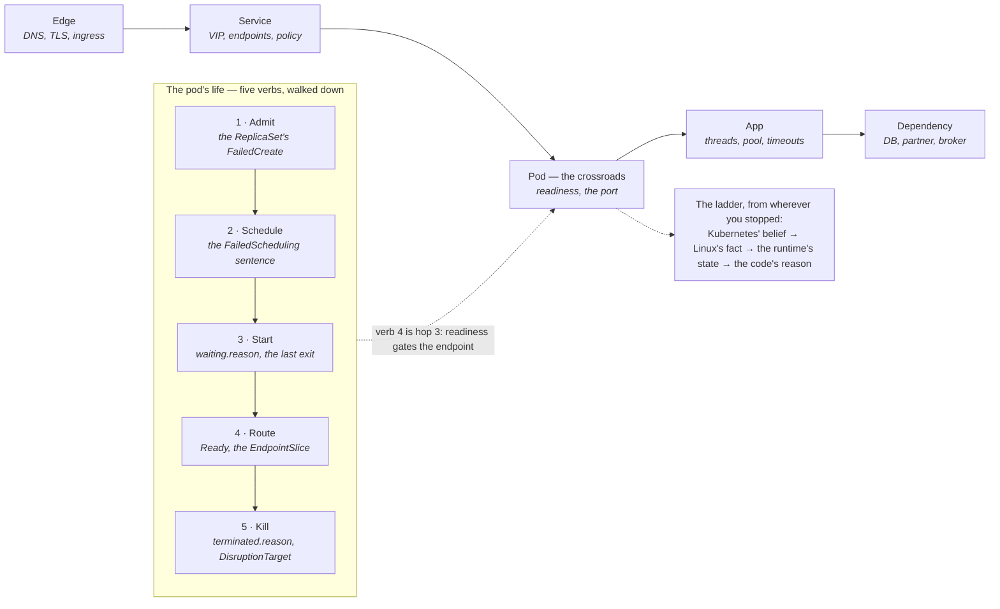

You are here if: something is broken and you want to know *where to look first* — not a list of forty commands, but the shape of the problem, so the first command is the right one; or you've read [The Three Doors](/start/three-doors/) and [The Three Lenses](/start/three-lenses/) and want the third model, the one for the day the loop breaks; or you've been handed the runbooks in [Troubleshooting](/troubleshooting/overview/) and would like to know why they're in the order they're in.

## Why two roads, and why a ladder

Every symptom a tenant ever brings to an incident channel is one of two sentences. *"My pod isn't —"* there, running, getting traffic, staying alive. Or *"requests to it —"* fail, time out, come back wrong, somewhere between the client and the database. The first sentence is about **the pod's life**: a sequence of things Kubernetes does to your pod, in a fixed order, each of which can fail, and each of which — this is the useful part — *writes down why* in exactly one place. The second sentence is about **the request's path**: a sequence of hops a request crosses, any of which can drop it, delay it, refuse it, or lie about it — and at a hop *nobody writes anything down*, so the only move is to bisect: ask the same question from two sides of the hop and see where the answer changes.

Those are the two roads. The pod's life runs *down* the page — you walk it top to bottom and stop at the first verb that failed, because every verb after a failed one looks failed too. The request's path runs *across* — you don't walk it, you cut it in half, and in half again. And they cross at one point: the moment a pod becomes Ready and Kubernetes starts sending it traffic is both the fourth verb of its life and the middle hop of every request's path. Most of the gallery at the bottom of this page is a failure on one road, seen from the other.

The ladder is the third piece. Wherever you stopped — a verb or a hop — the fault is at one of four layers: what Kubernetes *believes* (the object's status and events), what Linux *did* (the cgroup, the socket, the process), what the runtime is *doing* (the JVM's threads and heap — [the third lens](/start/three-lenses/#lens-3--the-inside-view-interrogation)), and what the code *decided* (the exception, the config value, the query). The lower three rungs are inside the container — reached through a hatch: `exec`, an ephemeral container sharing the app's process namespace, a copy of the pod, or a sidecar — and you descend one rung at a time. The rule that makes the ladder worth having is: **the rung below never lies about the rung above.** Kubernetes says `Ready`; that is the kubelet's opinion of a probe. `netstat` says nothing is listening; that is a fact.

This is the site's third model, and it fits the other two the way a map fits a machine: [The Three Doors](/start/three-doors/) is what you *set* (cost, truth, response), [The Three Lenses](/start/three-lenses/) is what you *measure*, and this is where you *look* when a door's promise or a lens's number turns out to be wrong. The [triage methodology](/troubleshooting/triage-methodology/) is the procedure — what changed, narrow the blast radius, read the actual error, test the cheapest hypothesis first — and it walks these roads; this page is the map it walks on.



## The vertical road: the pod's life in five verbs

Kubernetes can do exactly five things to your pod. It can **admit** it — accept the manifest and let the ReplicaSet create the pod object. It can **schedule** it — pick a node. It can **start** it — pull the image, mount the config, run the entrypoint, and keep it up. It can **route** to it — decide it's Ready and put its address in the Service's endpoints. And it can **kill** it — on a probe, on a limit, on a drain, on a deploy. That's the whole verb list, and it's in life order: a pod is admitted before it's scheduled, scheduled before it's started, started before it's routed to, and it can only be killed once it exists. Which is why the road is walked *down*: a pod that never started is also not Ready and also has no traffic, and if you start your investigation at "no traffic" you will spend an hour on Services for a pod that has no node.

Each verb has a **record** — the one place Kubernetes writes why it did or didn't do the thing — and the record is never the symptom you saw. That is the whole skill: the symptom tells you which verb; the verb tells you which record; the record tells you why.

| Verb | Kubernetes does | The symptom in `kubectl get` | Where the reason is written | The runbook |
|---|---|---|---|---|
| 1 · **Admit** | The API accepts the object; the ReplicaSet creates pods | `helm upgrade` succeeds but no new pod appears; `kubectl get rs` shows `DESIRED 1 CURRENT 0` | a `FailedCreate` event on the **ReplicaSet** — quota, LimitRange, Pod Security, a webhook, RBAC — because the pod never existed to carry it | [RBAC denied](/troubleshooting/rbac-denied/), [LimitRanges and quotas](/workloads/resources-and-qos/#limitranges-and-resourcequotas-the-house-rules), [pod security](/workloads/pod-security/) |
| 2 · **Schedule** | The scheduler picks a node | `Pending`, no node in `-o wide` | the `FailedScheduling` event — one sentence from the scheduler that names every reason every node said no | [Pod Pending](/troubleshooting/pod-pending/), [scheduling](/workloads/scheduling/), [where pods land](/disruption/where-pods-land/#the-n-1-check) |
| 3 · **Start** | The kubelet pulls, mounts, runs — and the process stays up | `ImagePullBackOff`, `CreateContainerConfigError`, `Init:…`, `CrashLoopBackOff`, `Error` | `status.containerStatuses[].state.waiting.reason` and `.message` (the pull error, the missing key), or `lastState.terminated.exitCode` plus `kubectl logs --previous` (the app's own last words) | [ImagePullBackOff](/troubleshooting/imagepullbackoff/), [CrashLoopBackOff](/troubleshooting/crashloopbackoff/), [config files and volumes](/workloads/config-files-and-volumes/), [JVM crashes](/java/jvm-crashes/) |
| 4 · **Route** | Readiness passes → the `Ready` condition → the EndpointSlice → the Service → the ingress | `Running` but `0/1`; a rollout stuck "waiting for 1 pods to be ready"; 503 at the edge; a Service with no endpoints | the `Unhealthy` event (the probe's exact failure text) and `kubectl get endpointslices -l kubernetes.io/service-name=<svc>` (is the address there, and is it `ready: true`?) | [health checks](/workloads/health-checks/), [Service unreachable](/troubleshooting/service-unreachable/), [front-door 5xx](/troubleshooting/front-door-5xx/) |
| 5 · **Kill** | A probe, the kernel, an eviction, a drain, a rollout, a scale-in, a deadline, a node dying | `RESTARTS` climbing; a young `AGE` on an old incident; `Terminating`; a pod that simply isn't there any more | `lastState.terminated.reason` + `exitCode` (`OOMKilled 137`, `Error 143`, `Completed 0`, `Unknown 255`), the `Killing` event's text, and the `DisruptionTarget` condition, which names who asked | [OOMKilled](/troubleshooting/oomkilled/), [stuck Terminating](/troubleshooting/stuck-terminating/), [the eviction decoder](/disruption/anatomy-of-a-drain/#the-decoder-who-killed-my-pod), [graceful shutdown](/workloads/graceful-shutdown/) |

Four things about the verbs that the table can't hold.

**Admit is the verb nobody checks, because its failure looks like nothing happened.** Helm returns success when the API server accepts the Deployment; the ReplicaSet controller then tries to create pods and is told no — by a ResourceQuota (`exceeded quota`), a LimitRange (`maximum cpu usage per Container is 1`), Pod Security (`violates PodSecurity "restricted:latest"`), or an admission webhook — and it says so on *its own* events, not on a pod, because there is no pod. The same verb refuses your ad-hoc debug pod in a namespace with a quota that requires requests: `pods "bisect" is forbidden: failed quota: verbs-quota: must specify requests.cpu for: bisect`. If a rollout "did nothing", read the ReplicaSet before anything else.

**Schedule writes one sentence, and people stop reading it at the comma.** `0/12 nodes are available: 3 Insufficient cpu, 8 node(s) had untolerated taint {dedicated: batch}, 1 node(s) didn't match Pod's node affinity/selector` is not "the cluster is full" — it's an inventory of every node's reason, and the fix is usually the one that applies to the *most* nodes. The sentence lives on the `FailedScheduling` event and on the pod's `PodScheduled` condition, and the scheduler re-issues it every few minutes, so it's also a timeline of whether the situation changed.

**Start is three different failures wearing one word.** The image didn't come (`ErrImagePull`: the record is the registry's message — `manifest unknown`, `unauthorized`, a DNS error); the container couldn't be *configured* (`CreateContainerConfigError`: a ConfigMap or Secret key that isn't there — and `kubectl logs` is empty, because the process never ran, which is exactly the trap: an empty log is not evidence about the app); or the process ran and quit (`CrashLoopBackOff`: the record is the exit code and `logs --previous`). Three records, three runbooks, one `STATUS` column.

**Kill has a reason field, and the exit code alone will lie to you.** `137` is `SIGKILL`, and `SIGKILL` has three senders: the kernel (`reason: OOMKilled`), the kubelet after a failed liveness probe and an ignored `SIGTERM` (`reason: Error`, with a `Killing … failed liveness probe` event beside it), and a node that died under the container (`reason: Unknown`, exit `255` — nobody killed it; the kubelet lost it). `143` is a `SIGTERM` the process honored — a rollout, a scale-in, a drain. And a drain or a preemption leaves a signed note that the others don't: the `DisruptionTarget` condition, whose `reason` is the decoder ([who killed my pod](/disruption/anatomy-of-a-drain/#the-decoder-who-killed-my-pod)). Read the reason, then the exit code, then the events — never the exit code alone.

### The loop: when two verbs alternate

`CrashLoopBackOff` is not a verb. It's **start and kill taking turns**: the kubelet starts the container, something ends it, the kubelet waits (10 s, 20 s, 40 s… up to five minutes) and starts it again. Which side is at fault is in the exit: the app's own exit code (`1`, `2`, `3`, `78`, whatever it uses) means *start* — the process quit, and `kubectl logs --previous` has its last words; `137 OOMKilled` means *kill* — the kernel, and the memory limit is the record; `137` or `143` with `reason: Error` and a `Killing` event about a probe means *kill* — the kubelet, and the probe is the record; `134` or `139` means the runtime crashed, and [the `hs_err_pid` file](/java/jvm-crashes/) is the record. The same loop hides in `Pending → Evicted → Pending` (kill and schedule alternating, on a node under pressure) and in a stuck rollout (route gating admit: the Deployment won't create the next pod until this one is Ready).

### One glance, one command

The four columns of `kubectl get pods` *are* the verbs, which is why the [60-second first response](/troubleshooting/overview/#the-60-second-first-response) starts there. `STATUS` is admit, schedule, and start (`Pending`, the waiting reasons, the loop); `READY` is route; `RESTARTS` is kill, with the parenthetical saying how recently; `AGE` is kill in disguise — a pod four minutes old in an incident an hour old was replaced, and the evidence died with its predecessor. Here is a namespace with one deliberately broken pod per verb — a ten-line manifest each, and a drill worth keeping in a dev namespace:

```bash
# seat: tenant
kubectl get pods -n verbs
```

```console
NAME            READY   STATUS                       RESTARTS        AGE
healthy         1/1     Running                      0               5m36s
kill-liveness   0/1     CrashLoopBackOff             6 (2m5s ago)    5m36s
kill-oom        0/1     CrashLoopBackOff             5 (2m17s ago)   5m36s
route-fail      0/1     Running                      0               5m36s
schedule-fail   0/1     Pending                      0               5m36s
start-config    0/1     CreateContainerConfigError   0               5m36s
start-crash     0/1     CrashLoopBackOff             5 (2m32s ago)   5m36s
start-image     0/1     ImagePullBackOff             0               5m36s
```

Three of them say `CrashLoopBackOff` and they are three different faults; one says `Running` and is getting no traffic; one is fine; and the admit failure isn't in the list at all, because its pod was never created. The glance tells you the verb; the record tells you why — and reading five records by hand is five `describe`s. This does it in one:

```bash
# seat: tenant — which verb failed? one line per pod (and per starved ReplicaSet): the verb, the name, the record. Needs kubectl + jq.
cat > verbs.sh <<'EOF'
#!/usr/bin/env bash
set -eo pipefail
NS=$1; SEL=${2:-}; sel=(); [ -n "$SEL" ] && sel=(-l "$SEL")
EV=$(mktemp)
kubectl get events -n "$NS" -o json | jq -c '[.items[] | select(.reason=="FailedCreate" or .reason=="FailedScheduling" or .reason=="Failed" or .reason=="Unhealthy" or .reason=="Killing")]' > "$EV"
# ADMIT — a ReplicaSet that wants more pods than exist; the reason is on ITS event, because the pod never existed
kubectl get rs -n "$NS" "${sel[@]}" -o json | jq -r --slurpfile ev "$EV" '
  def latest(kind; $name): [$ev[0][] | select(.involvedObject.name==$name and .reason==kind)] | max_by(.lastTimestamp) | .message // "";
  .items[] | select((.spec.replicas // 0) > (.status.replicas // 0)) | .metadata.name as $n
  | "ADMIT\t\($n)\t\((.spec.replicas // 0) - (.status.replicas // 0)) pod(s) never created: \(latest("FailedCreate"; $n) | sub("^\\(combined from similar events\\): "; "") | sub("^Error creating: "; "") | .[0:150])"'
# SCHEDULE → START → KILL → ROUTE, in life order; the first verb that failed owns the line
kubectl get pods -n "$NS" "${sel[@]}" -o json | jq -r --slurpfile ev "$EV" '
  def latest(kind; $name): [$ev[0][] | select(.involvedObject.name==$name and .reason==kind)] | max_by(.lastTimestamp) | .message // "";
  .items[] as $p | $p.metadata.name as $n
  | ($p.status.containerStatuses // []) as $cs | ($p.status.conditions // []) as $cond
  | (if $p.metadata.deletionTimestamp != null then
        "KILL\t\($n)\tTerminating since \($p.metadata.deletionTimestamp)\(if (($p.metadata.finalizers // []) | length) > 0 then " — finalizers: \($p.metadata.finalizers | join(","))" else "" end)"
     elif $p.spec.nodeName == null then
        "SCHEDULE\t\($n)\t\(latest("FailedScheduling"; $n) | split(". ")[0])"
     elif ($cs | map(select((.state.waiting.reason // "") == "CrashLoopBackOff" or (.state.terminated != null and $p.spec.restartPolicy == "Always"))) | length) > 0 then
        ($cs[] | select((.state.waiting.reason // "") == "CrashLoopBackOff" or .state.terminated != null) | (.lastState.terminated // .state.terminated) as $t
          | "START↔KILL\t\($n)\trestarted \(.restartCount)x — last exit \($t.exitCode) (\($t.reason))\(if latest("Killing"; $n) != "" then "; \(latest("Killing"; $n))" else "; the exit code says which side: kubectl logs --previous" end)")
     elif ($cs | map(select(.state.waiting != null and .state.waiting.reason != "ContainerCreating" and .state.waiting.reason != "PodInitializing")) | length) > 0 then
        ($cs[] | select(.state.waiting != null) | "START\t\($n)\t\(.state.waiting.reason): \((.state.waiting.message // latest("Failed"; $n)) | .[0:130])")
     elif $p.status.phase == "Failed" then
        ($cs[] | select(.state.terminated != null) | "KILL\t\($n)\tphase Failed: \(.state.terminated.reason) exit \(.state.terminated.exitCode) (restartPolicy \($p.spec.restartPolicy))")
     elif (($cond[] | select(.type=="Ready") | .status) // "False") != "True" and $p.status.phase != "Succeeded" then
        "ROUTE\t\($n)\tRunning but not Ready: \(latest("Unhealthy"; $n) | .[0:130])"
     elif ($cs | map(.restartCount) | add) > 0 then
        ($cs[] | select(.restartCount > 0) | "KILL (past)\t\($n)\thealthy now; restarted \(.restartCount)x, last: \(.lastState.terminated.reason // "?") exit \(.lastState.terminated.exitCode // "?")\(if latest("Killing"; $n) != "" then " — \(latest("Killing"; $n))" else "" end)")
     elif $p.status.phase == "Succeeded" then "OK\t\($n)\tCompleted (a Job pod)"
     else "OK\t\($n)\tadmitted, scheduled, started, Ready, not killed" end),
    (($cond[] | select(.type=="DisruptionTarget")) // empty | "KILL\t\($n)\tDisruptionTarget \(.reason): \(.message)")
'
rm -f "$EV"
EOF
chmod +x verbs.sh && ./verbs.sh verbs
```

```console
ADMIT	admit-fail-5b8969c55d	1 pod(s) never created: pods "admit-fail-5b8969c55d-rpsb6" is forbidden: exceeded quota: verbs-quota, requested: requests.cpu=2, used: requests.cpu=570m, limited: requests.cpu=1
START↔KILL	kill-liveness	restarted 5x — last exit 137 (Error); Container web failed liveness probe, will be restarted
START↔KILL	kill-oom	restarted 4x — last exit 137 (OOMKilled); the exit code says which side: kubectl logs --previous
ROUTE	route-fail	Running but not Ready: Readiness probe failed: HTTP probe failed with statuscode: 404
SCHEDULE	schedule-fail	0/1 nodes are available: 1 node(s) didn't match Pod's node affinity/selector
START	start-config	CreateContainerConfigError: configmap "payments-config" not found
START↔KILL	start-crash	restarted 4x — last exit 1 (Error); the exit code says which side: kubectl logs --previous
START	start-image	ImagePullBackOff: Back-off pulling image "docker.io/rancher/mirrored-library-busybox:1.99.0": ErrImagePull: failed to pull and unpack image "docker.
```

Every line is a verb and its record, and the three `CrashLoopBackOff`s have come apart: `137 Error` *with* a liveness event is the kubelet; `137 OOMKilled` is the kernel; `1 Error` is the app, and its log says `FATAL: config key rates.url missing`. The admit failure appeared, with the quota's own arithmetic. Two more lines the script prints on other days, both worth recognizing on sight:

```console
KILL	healthy	Terminating since 2026-09-10T10:48:47Z
KILL	healthy	DisruptionTarget EvictionByEvictionAPI: Eviction API: evicting
KILL (past)	orders-api-5f6f4fb9b7-qx8kp	healthy now; restarted 1x, last: Unknown exit 255
```

The first pair is a drain in progress — the platform asked, and the condition says so. The last is a pod that was healthy, restarted once, and whose previous container ended with no reason and exit `255`: the node went away under it (a reboot, a kubelet restart) and came back. Nothing you did, nothing to fix — but if you'd read only `RESTARTS 1` you'd be looking for a crash that never happened.

## The horizontal road: the request's path in five hops

A request that reaches a Ready pod crosses five hops on its way to an answer, and the site's runbooks already walk them at full resolution — [Service Unreachable](/troubleshooting/service-unreachable/) has twelve steps, [Debugging Network](/networking/debugging-network/) four, [Front-Door 5xx](/troubleshooting/front-door-5xx/) the ingress in detail. The map behind all of them is five hops, and at each one a request can be **dropped** (nothing answers), **delayed** (something answers late), **refused** (something answers no), or **lied about** (something answers *for* the thing you asked — an ingress minting a 503 of its own is not the app returning 503).

| Hop | What lives there | Drop / delay / refuse / lie looks like | The bisect probe | The record, if any | The runbook |
|---|---|---|---|---|---|
| 1 · **Edge** | the client's DNS, TLS, the corporate VIP, the ingress controller | `NXDOMAIN`; a certificate error; a 502/503/504 *minted by the ingress* | `curl -sv https://…` from outside; then the same from inside the cluster to the ingress Service | the ingress access log — the one place upstream of you that writes a line per request | [front-door 5xx](/troubleshooting/front-door-5xx/), [ingress-nginx](/networking/ingress-nginx/), [TLS and corporate CAs](/networking/tls-and-corporate-cas/) |
| 2 · **Service** | the ClusterIP, kube-proxy, the EndpointSlice, NetworkPolicy | `connection refused` from the VIP (no ready endpoints); a hang (a policy dropping SYNs); the wrong pod answering (a selector too wide) | from another pod: `wget http://<svc>.<ns>.svc:8080/` then `http://<pod-ip>:8080/` | the EndpointSlice's `ready` conditions; a policy has no log — its record is the *difference* between the two probes | [Service unreachable](/troubleshooting/service-unreachable/), [network policies](/networking/network-policies/), [services deep dive](/networking/services-deep-dive/) |
| 3 · **Pod** | readiness, the container port, the pod's own network namespace | `Running` `0/1`; a port in the Service that isn't the port the process opened | from inside the pod: `wget http://localhost:8080/` and the readiness path itself | the `Unhealthy` event; `netstat -ltn` inside the pod — **the crossroads** | [health checks](/workloads/health-checks/), [Linux inside the pod](/troubleshooting/linux-inside-the-pod/#is-the-network-actually-working) |
| 4 · **App** | Tomcat's threads, the connection pool, the app's own timeouts and retries | slow for one route; every thread busy; `pending` on the pool; a 500 with a stack trace | the [second lens](/start/three-lenses/#lens-2--the-processs-view-the-self-report): p50 vs p99 by route, busy threads, pool gauges — then a thread dump | the app's metrics and logs — the only hop that narrates itself | [It's Slow](/troubleshooting/its-slow/), [the symptom walks](/java/lens-playbooks-diagnose/) |
| 5 · **Dependency** | the database, the partner API, the broker — and the DNS, egress, and firewall between you and them | timeouts on one call; `429`; `ORA-00018`; a TLS handshake that stalls; "works from some pods" | from inside the pod toward the dependency: resolve the name, open the port, make the call — then the same from a pod on *another node* | the dependency's own error text; the driver's; otherwise none — bisect by node | [timeout budget](/tuning/timeout-budget/#the-audit-kit), [DNS failures](/troubleshooting/dns-failures/), [egress](/networking/egress/), [external database](/architectures/external-database/) |

**The move is bisection, and the rule is: the hop is where the answer changes.** Nobody writes a `FailedRouting` event when a request dies at hop 2 — the record at a hop is the *difference* between two probes on either side of it. So you ask the same question from three places and read where the answer flips. Here it is against the pod from the glance above that was `Running` but `0/1`:

```bash
# seat: tenant — the same request from three vantage points, innermost last
kubectl get endpointslices -n verbs -l kubernetes.io/service-name=route-fail -o custom-columns='NAME:.metadata.name,ADDRESSES:.endpoints[*].addresses[*],READY:.endpoints[*].conditions.ready'
# from another pod in the cluster → the Service (hop 2), then → the pod's IP (hop 3)
kubectl exec healthy -n verbs -- sh -c 'wget -qO- -T 3 http://route-fail.verbs.svc.cluster.local:8080/ 2>&1; echo exit=$?'
kubectl exec healthy -n verbs -- sh -c 'wget -qO- -T 3 http://10.42.0.58:8080/ 2>&1; echo exit=$?'
# from inside the pod itself → localhost, and the readiness path the probe asks for
kubectl exec route-fail -n verbs -- sh -c 'wget -qO- -T 3 http://localhost:8080/ 2>&1; echo exit=$?; wget -qO- -T 3 http://localhost:8080/actuator/health/readiness 2>&1; echo exit=$?'
```

```console
NAME               ADDRESSES    READY
route-fail-7sglm   10.42.0.58   false
wget: can't connect to remote host (10.43.36.42): Connection refused
exit=1
ok
exit=0
ok
exit=0
wget: server returned error: HTTP/1.1 404 Not Found
exit=1
```

Read it from the inside out. The process answers on `localhost` — the app is fine. The pod's IP answers from another pod — the network is fine. The Service refuses — because the EndpointSlice has the address with `ready: false`, so kube-proxy has nothing to send to and answers `Connection refused` for the VIP. And the readiness path returns `404`: the probe asks for `/actuator/health/readiness` and this container doesn't serve it. The answer changed between hop 3 and hop 2, and the reason is a verb: route. A client at the edge would have seen a 503 from the ingress and a dashboard full of nothing, and started at hop 1.

### The crossroads

That example is the point where the two roads meet, and it's where most of the confusion on this site's [error index](/troubleshooting/error-index/) comes from. **Verb 4 — route — is hop 3 — the pod.** Readiness is the gate between them: it's the last thing the pod's life has to pass, and the first thing a request needs to find. A lifecycle failure at or before verb 4 therefore *presents* as a path failure — no endpoints, refused connections, 503s at the edge — and a team that starts on the horizontal road will bisect its way back to the pod and then need the vertical road anyway.

Which gives the order of operations. When the sentence is "requests fail", glance down the vertical road *first* — one `kubectl get pods`, thirty seconds, four columns — because if any verb failed, the horizontal road is a consequence and every probe on it is a waste. Only when all five verbs pass (`Running`, `1/1`, no restarts, not young) do you bisect across. And the reverse trap exists too: a pod that passed every verb and is *still* wrong — slow, erroring, leaking — is not a lifecycle problem at all, and no amount of `describe pod` will show anything. That's the **sixth question**, and it belongs to the lenses: [the symptom walks](/java/lens-playbooks-diagnose/) start exactly where this page stops.

## The ladder: four rungs, two rules

Wherever you stopped — verb or hop — you have a *place*. You don't yet have a *cause*, because at every place there are four layers that could hold it, and each has its own instrument:

| Rung | The question | The instrument | The page |
|---|---|---|---|
| **Kubernetes' belief** | What does the control plane *think* is true? | the object's `status` and `conditions`, the events, `describe` | [How Kubernetes Works](/start/how-kubernetes-works/), [events](/observability/events/) |
| **Linux's fact** | What did the node actually *do*? | inside the pod: `netstat -ltn`, `/proc`, the cgroup files (`memory.max`, `cpu.stat`'s `nr_throttled`), `ps`; from a debug container when the image has nothing | [Kubernetes is Linux](/troubleshooting/kubernetes-is-linux/), [Linux inside the pod](/troubleshooting/linux-inside-the-pod/), [the debugging toolbox](/troubleshooting/debugging-toolbox/) |
| **The runtime's state** | What is the process *doing*? | a thread dump, a heap histogram, the GC log, JFR — [the third lens](/start/three-lenses/#lens-3--the-inside-view-interrogation) | [jattach](/java/jattach-deep-dive/), [thread dumps](/java/thread-dumps-jre-only/), [heap dumps](/java/heap-dumps-jre-only/) |
| **The code's reason** | What did the program *decide*? | the exception, the config value it actually loaded (`/actuator/env`), the query it ran, the timeout it chose | [Actuator](/java/actuator/), [the timeout budget](/tuning/timeout-budget/), [configuration](/workloads/configuration/) |

The rung below never lies about the rung above, and that asymmetry is the ladder's whole value. Kubernetes says `Ready` — that is the kubelet reporting that a probe returned 200; it is not a statement that a socket is open. Linux says a socket is open — that is a fact about the kernel's table; it is not a statement that the process behind it will answer. The runtime says 200 threads are `RUNNABLE` in a socket read — a fact about the JVM; not a statement about *why* they're waiting. Each rung down replaces an opinion with a fact and moves the question one layer closer to the reason. The `route-fail` pod above is the ladder in three rungs: Kubernetes believed *not Ready*; Linux showed `0.0.0.0:8080 LISTEN` (the socket is real); the code answered `404` on the probe path — the fault was on the fourth rung, a path in a values file, and the first rung had reported it faithfully all along.

```bash
# seat: tenant — rung two, for the same pod: is anything actually listening?
kubectl exec route-fail -n verbs -- netstat -ltn
```

```console
Active Internet connections (only servers)
Proto Recv-Q Send-Q Local Address           Foreign Address         State
tcp        0      0 0.0.0.0:8080            0.0.0.0:*               LISTEN
```

Two rules keep the ladder honest. **Don't descend before you've stopped.** A thread dump of a pod that's `Pending` is a very detailed picture of nothing; a `tcpdump` on hop 3 when the request died at hop 1 is a night's work for no result. The roads locate; the ladder explains — in that order. And **don't stop at Kubernetes' word.** The first rung is where the incident channel lives, and it is an opinion held by a controller that last looked a few seconds ago; `Ready`, `Running`, `Healthy`, `Synced` are all reports, and every row in the gallery below is a report that was true and a fact that wasn't.

## Inside the container: the hatch, and the ladder walked

The ladder's lower three rungs are all *inside* the container, and the first thing that stops people is not knowing how to get in — a JRE-only image has no `ps`, a distroless one has no shell, and `kubectl exec` answers `exec failed: unable to start container process: exec: "sh": executable file not found in $PATH`. So before the rungs, the **hatch**: four ways into a running container, and the rule for choosing.

| The hatch | When | What it gives you | The catch |
|---|---|---|---|
| `kubectl exec -it $POD -- sh` | the image has a shell, and the tool you need | the container's own view: its files, its env, its sockets, as its user | a JRE image has `sh` but no `ps`, `netstat`, `curl`; a distroless image has nothing — [where exec stops working](/troubleshooting/debugging-toolbox/#kubectl-exec--and-where-it-stops-working) |
| `kubectl debug $POD --target=<container> --image=<tools>` | the image has no shell or no tools; the container is **running** | an ephemeral container in the pod's network namespace *and* the target's process namespace: the app is PID 1 (or whatever it is), its filesystem is `/proc/1/root/`, its env is `/proc/1/environ` — with your image's tools | needs `pods/ephemeralcontainers` RBAC; under a restricted Pod Security profile it must run as the app's UID (`--profile=restricted`, and the [jattach UID rule](/java/jattach-deep-dive/#in-cluster-attaching-inside-kubernetes)); it stays in the pod spec, exited, until the pod dies — [the toolbox](/troubleshooting/debugging-toolbox/#--target-see-the-apps-processes) |
| `kubectl debug $POD --copy-to=<name> --container=<c> -- sh -c 'sleep 3600'` | the container **won't stay up** (the loop) — there is nothing to attach to | a copy of the pod with the same image, volumes, env, and Secrets, but *your* command: run the entrypoint by hand and watch it fail | it's a new pod (new IP, not in the Service); resources count against quota — [debug the crash without the crash](/troubleshooting/debugging-toolbox/#kubectl-debug---copy-to--debug-the-crash-without-the-crash) |
| a standing tools sidecar, `shareProcessNamespace: true` | incidents recur, ephemeral-container RBAC is denied, or the team wants `jattach`/`tcpdump` there before the page | the same view as `--target`, permanently, from a container that is *in the chart* and passed review | a container's worth of resources on every pod, and every process's command line and environment become pod-wide readable — [the trade-offs](/sidecars/lifecycle-and-ordering/#shareprocessnamespace-signals-across-containers) |

And a fifth that isn't a hatch but is often the fastest: `kubectl port-forward $POD 8081:8081` to the management port, where [the process reports on itself](/java/actuator/) — the config it actually loaded, its loggers, its metrics — without going in at all.

The rule: exec if you can, an ephemeral container if you can't, `--copy-to` if there's nothing running to attach to, and a sidecar only when the first two are structurally unavailable and the review has accepted the cost. Here is the second hatch against the not-Ready pod from the glance, with a tools image that has what the app's doesn't:

```bash
# seat: tenant — into the running container's process namespace, with busybox's tools; the app is PID 1
kubectl debug route-fail -n verbs --target=web --image=busybox:1.37 --container=hatch -- sh -c '
  echo "== ps";        ps -o pid,user,comm
  echo "== cmdline";   tr "\0" " " < /proc/1/cmdline; echo
  echo "== environ";   tr "\0" "\n" < /proc/1/environ | grep -E "^(HOSTNAME|.*SERVICE_PORT)"
  echo "== its files"; ls /proc/1/root/www
  echo "== sockets";   netstat -ltn | tail -n +3'
kubectl logs route-fail -n verbs -c hatch
```

```console
Targeting container "web". If you don't see processes from this container it may be because the container runtime doesn't support this feature.
== ps
PID   USER     COMMAND
    1 root     httpd
  296 root     sh
  303 root     ps
== cmdline
httpd -f -p 8080 -h /www
== environ
ROUTE_FAIL_SERVICE_PORT_HTTP=8080
KUBERNETES_SERVICE_PORT=443
HOSTNAME=route-fail
ROUTE_FAIL_SERVICE_PORT=8080
KUBERNETES_SERVICE_PORT_HTTPS=443
== its files
index.html
== sockets
tcp        0      0 0.0.0.0:8080            0.0.0.0:*               LISTEN
```

That is rung two, read through a hatch: the process that is actually running (`httpd`, with the flags it was actually given), the environment it actually has, the files it actually serves — there is no `actuator/` directory, which is the 404 from the other side — and the socket it actually opened. None of it came from the pod spec; all of it is what the kernel says. Notice the `hatch` container's output comes back through `kubectl logs -c hatch`, because an ephemeral container is a container: it has logs, and it appears in `describe` and in `status.ephemeralContainerStatuses` afterwards.

### Rung two, from inside: six facts about the process

Whichever hatch you used, these are the six things Linux will tell you that Kubernetes can only claim — the [inside-the-pod page](/troubleshooting/linux-inside-the-pod/) has the long version of each. Against a pod added to the namespace with `limits: {cpu: 100m, memory: 64Mi}`, so the cgroup files have something to say:

```bash
# seat: tenant — the six facts (exec form; from an ephemeral container, prefix the paths with /proc/1/root where noted)
kubectl exec limited -n verbs -- sh -c '
  echo "== 1 the process";   tr "\0" " " < /proc/1/cmdline; echo
  echo "== 2 its memory";    cat /sys/fs/cgroup/memory.max 2>/dev/null || cat /sys/fs/cgroup/memory/memory.limit_in_bytes; cat /sys/fs/cgroup/memory.current 2>/dev/null || cat /sys/fs/cgroup/memory/memory.usage_in_bytes
  echo "== 3 its CPU quota"; cat /sys/fs/cgroup/cpu.max 2>/dev/null || echo "$(cat /sys/fs/cgroup/cpu/cpu.cfs_quota_us) $(cat /sys/fs/cgroup/cpu/cpu.cfs_period_us)"; grep -E "nr_periods|nr_throttled" /sys/fs/cgroup/cpu.stat 2>/dev/null || grep -E "nr_periods|nr_throttled" /sys/fs/cgroup/cpu/cpu.stat
  echo "== 4 its disk";      df -h / | tail -1
  echo "== 5 its resolver";  cat /etc/resolv.conf; nslookup route-fail.verbs.svc.cluster.local 2>&1 | tail -2
  echo "== 6 its sockets";   netstat -ltn 2>/dev/null | tail -n +3'
```

```console
== 1 the process
httpd -f -p 8080 -h /www
== 2 its memory
67108864
1523712
== 3 its CPU quota
10000 100000
nr_periods 3
nr_throttled 0
== 4 its disk
overlay                 252.0G     12.8G     29.1G  31% /
== 5 its resolver
search verbs.svc.cluster.local svc.cluster.local cluster.local
nameserver 10.43.0.10
options ndots:5
Name:	route-fail.verbs.svc.cluster.local
Address: 10.43.36.42
== 6 its sockets
tcp        0      0 0.0.0.0:8080            0.0.0.0:*               LISTEN
```

Read against the spec: the limit is `64Mi` (`67108864` bytes) and the process holds 1.5 MiB of it; the quota is `100m` (`10000` of every `100000` µs) and it has never been throttled; the writable layer has room; the resolver walks three search domains before it tries the name as given (`ndots:5` — [the DNS page's first cause](/troubleshooting/dns-failures/#1-the-ndots5-search-walk-tax-slow-intermittent-mostly-external)); the socket is open on all interfaces, not `127.0.0.1` (the classic "works from inside, refused from outside"). This node runs cgroup v1, so the files are the older names; the v2 files (`memory.max`, `memory.current`, `cpu.max`, `cpu.stat`) say the same things — [the cgroup page](/troubleshooting/kubernetes-is-linux/#cgroups-the-budget) has both.

### Rung three: the runtime, through jattach

For a JVM, rung three is the [third lens](/start/three-lenses/#lens-3--the-inside-view-interrogation), and on a JRE-only image every instrument on it goes through [jattach](/java/jattach-deep-dive/) — a static binary that speaks the JVM's attach protocol, so `jcmd`, `jstack`, and `jmap` don't have to exist in the image. Three commands cover most incidents; the [symptom page's toolkit](/java/lens-playbooks-diagnose/#the-toolkit-set-up-once) sets up the variables and the full set:

```bash
# seat: tenant — exec form (jattach baked into the image or copied in); $JPID is the JVM's pid inside the container
kubectl exec $POD -n $NS -- $JATTACH $JPID threaddump > td-1.txt            # every thread, right now — three of these, ten seconds apart
kubectl exec $POD -n $NS -- $JATTACH $JPID jcmd GC.class_histogram | head   # what's on the heap, by class — a full-heap walk, seconds of pause
kubectl exec $POD -n $NS -- $JATTACH $JPID jcmd "JFR.dump filename=/dumps/now.jfr"   # the last hour, from the ring buffer that was already recording
# distroless form: the same three, from an ephemeral container sharing the app's PID namespace, running as the app's UID
kubectl debug $POD -n $NS --target=payments-api --image=registry.example.com/jvm-tools:latest --profile=restricted -- jattach 1 threaddump
```

Two rules that are really the ladder's rules again. The attach socket lives in the JVM's `/tmp`, and the JVM only answers a process with its own UID — so the hatch has to be the app's user, which is what `--profile=restricted` and a `runAsUser` on the tools image are for; `Unable to open socket file` is that rule, not a broken jattach ([the failure decoded](/java/jattach-deep-dive/#in-cluster-attaching-inside-kubernetes)). And an interrogation costs the thing you're measuring — a class histogram pauses the JVM, a heap dump writes a file the size of the live set — so the cheap instrument comes first, and on a pod already at its wall the healthy replica is the better witness ([symptom 1's caution](/java/lens-playbooks-diagnose/#1-memory-keeps-climbing-and-the-pod-gets-oomkilled)).

### Rung four: the code's reason — logs, files, and the process's own report

The bottom rung is what the program *said*, and there are three places it says things.

**`kubectl logs` is the container's stdout, and it has three switches that matter.** `--previous` is the crashed container's last words, and for a loop it is the *only* log worth reading — the current container hasn't said anything yet. `-c <container>` (or `--all-containers --prefix`) because a pod with a sidecar has more than one stdout and `logs` picks the first. And `--since=` with `--timestamps`, so the line you're reading can be placed against the events and the metrics. The trap is the empty log: a container that never *started* (`CreateContainerConfigError`, `ImagePullBackOff`) has no stdout at all, and an empty log is evidence about verb 3, not about the app.

```bash
# seat: tenant — the crashed container's last words, from the loop in the glance
kubectl logs start-crash -n verbs --previous --timestamps
```

```console
2026-09-10T10:43:36.914523107Z FATAL: config key rates.url missing
```

**Files the process wrote are inside the container, and they die with it.** An app that logs to a file instead of stdout ([the contract it's breaking](/observability/logging-fundamentals/#the-stdoutstderr-contract)) has its log in the writable layer — `kubectl exec $POD -- tail -n 200 /var/log/app/app.log`, or `/proc/1/root/var/log/app/app.log` from an ephemeral container — and so does a JVM's `hs_err_pid<pid>.log` after a native crash, a heap dump written to the working directory, a Tomcat access log. The writable layer is discarded when the container restarts, which is why [the toolkit's `/dumps` is a volume](/java/lens-playbooks-diagnose/#5-the-jvm-flags-that-make-the-inside-lens-cheap) and why the order of operations in an incident is *copy out, then restart* — [getting dumps out](/java/getting-dumps-out/) is the page for the copy, including the distroless case where `kubectl cp` has no `tar` to talk to.

**The process's own report says what it actually loaded.** `kubectl get configmap` shows what Kubernetes holds; `/proc/1/root/etc/app/application.yaml` shows what was mounted; only `/actuator/env` shows the value the running process *resolved* — after profiles, overrides, and the environment variable that beat the file. When the answer is "the config is right and the app still does the old thing", those three disagree, and the rung that disagrees is the fault ([the subPath mount that never updated](/blog/the-subpath-mount-that-never-updated/) is exactly this: right in Kubernetes, right in the file, wrong in the process). And when the log doesn't say enough, `/actuator/loggers` turns one logger to `DEBUG` on the live pod, without a rollout ([changing log levels at runtime](/observability/logging-fundamentals/#changing-log-levels-at-runtime)).

```bash
# seat: tenant — the value the process actually has, and a logger turned up for the duration of the incident
kubectl -n $NS port-forward $POD 8081:8081 >/dev/null 2>&1 & sleep 1
curl -s localhost:8081/actuator/env/rates.url | jq -r '.property.value, .property.source'
curl -s -X POST localhost:8081/actuator/loggers/com.acme.payments.rates -H 'Content-Type: application/json' -d '{"configuredLevel":"DEBUG"}'
```

**The hatch you can't open is a finding.** If the image has no shell and ephemeral containers are `Forbidden`, or the tools image with `jattach` doesn't exist yet, or `/dumps` isn't a volume, the incident is the wrong time to discover it — that is [use case 12](/java/lens-playbooks-use-cases/#12-are-we-ready-for-on-call), and the eight proofs there are mostly hatches.

## The proof: the misdiagnosis gallery

If troubleshooting were a grab-bag of runbooks, the right one would be found by matching the symptom's *words*. The claim of this page is stronger: the symptom's words are usually written at the wrong place — a road away, or a rung up — from the fault, and the map is what tells you which way to move. Every row is a real misreading: what was seen, where; what was true, where; and why the first place couldn't have shown it.

| What you saw (road · place) | What was true (road · place) | Why the first place couldn't tell you |
|---|---|---|
| A fleet-wide 503 at the edge (across · hop 1) — [the readiness probe that took down prod](/blog/the-readiness-probe-that-took-down-prod/) | Every pod failed readiness for 30 s because the probe checked a dependency (down · verb 4) | The ingress reports on the endpoint set it has; an empty set is a 503, and nothing at hop 1 says *why* it's empty |
| `0/1 CreateContainerConfigError` for an hour, "the app must be dying before it can log" (down · verb 3, read as the app's) | A renamed Secret key: the container was never created, so the process never ran (down · verb 3, the *config* record) | `kubectl logs` was empty and was read as a silent crash; the record was `state.waiting.message`, which named the key |
| Exit `137`, "OOMKilled, raise the limit" (down · verb 5) | `reason: Error` beside a `Killing … failed liveness probe` event: the kubelet, killing a JVM mid-GC-pause (down · verb 5, the other sender) | `137` is the signal, not the sender; the reason field and the event name the sender, and the fix was the probe's timeout, not memory |
| `Pending` after a deploy, "the cluster is full" (down · verb 2) | `0/12 nodes … didn't match Pod's node affinity/selector`: a node label renamed in the chart (down · verb 2, your object) | The sentence was read to its first comma; the inventory that follows named the cause on every node |
| `helm upgrade` green, "nothing changed" (down · verb 1) | `FailedCreate` on the ReplicaSet: `exceeded quota` (down · verb 1) | Helm returns when the API accepts the Deployment, not when a pod exists; the pod that would have carried the event was never created |
| "DNS is flaky", 2-second stalls to a partner (across · hop 5) — [chasing a DNS timeout](/blog/chasing-a-dns-timeout/) | `ndots:5` walking the search domains and a conntrack table under pressure (across · hop 5, rung two) | From the app, a stall is a stall; the resolver config and the conntrack counters are Linux's facts, one rung down from where the timeout was logged |
| Timeouts to the corporate database "from some pods" (across · hop 5) — [the allowlist that kept half working](/blog/the-allowlist-that-kept-half-working/) | A firewall allowlist pinned to node IPs, and a cluster that had grown a node (across · hop 5, bisected *by node*) | Inside the pod nothing distinguishes the nodes; the record was the firewall's, which you can't read — the difference between two pods on two nodes was the only record available |
| "It's slow, restart it" — and it helped, for twenty minutes (no road) — [the throttled app that looked idle](/blog/the-throttled-app-that-looked-idle/) | Nothing failed on either road: a CPU quota clipping bursts (the sixth question — [lens 1's throttle ratio](/start/three-lenses/#lens-1--the-clusters-view-the-cgroup-ledger)) | Every verb passed and every hop answered; the roads had nothing to say, and a restart only reset the symptom's clock |
| `RESTARTS 1` on every pod at once, "something crashed" (down · verb 5) | `reason: Unknown, exit 255`: the node rebooted under them (down · verb 5, nobody's kill) | A restart count is a number; only the reason distinguishes a crash from a node that went away, and the logs of a container the kubelet *lost* are the logs of a healthy process |
| "The config is right" — `kubectl get configmap` shows the new value, and the app keeps doing the old thing (rung one) — [the subPath mount that never updated](/blog/the-subpath-mount-that-never-updated/) | The file inside the container was still the old one: a `subPath` mount never propagates ConfigMap updates (rung two, `/proc/1/root/…`) | Kubernetes' belief was correct about the ConfigMap and silent about the mount; only the file the process could see settled it |
| The drain is "stuck on our pod" (down · verb 5) — [the PDB that blocked the drain](/blog/the-pdb-that-blocked-the-drain/) | `ALLOWED DISRUPTIONS 0`: a budget the fleet couldn't satisfy (down · verb 5, refused before it started) | The eviction API's `429` is written to the *drainer's* terminal, not to your pod; from your seat the pod simply keeps running |

## How to use it

**Three moves, in order.** First, *glance down*: `kubectl get pods -o wide` (or the script) — thirty seconds, the four columns as the five verbs, stop at the first that failed, read *its* record and nothing else. Second, only if every verb passed, *bisect across*: the same request from three vantage points, innermost last; the hop is where the answer changes, and the runbook for that hop is in the table. Third, at the place you stopped, *descend the ladder*: Kubernetes' belief, Linux's fact, the runtime's state, the code's reason — one rung at a time, reading the instrument at each before forming a theory, and never descending before you've stopped. The lower rungs are inside the container, so pick the hatch first — exec, an ephemeral container, a copy of the pod, or the sidecar you shipped for this — and read the six facts, the runtime through jattach, and the logs that are still there.

**Three exits.** A record that names *the platform* — a taint, a quota, a node condition, a `DisruptionTarget`, a firewall — is the [seat marker's](/disruption/overview/#who-owns-what) other side: the map has located the fault in a place you can see but not change, and the next move is [the evidence pack](/java/lens-playbooks-size-and-scale/#3-the-evidence-pack-for-the-platform-team), not another probe. Every verb passing and every hop answering, with the service still wrong, is the sixth question — the [Three Lenses](/start/three-lenses/) and [the use cases](/java/lens-playbooks-use-cases/) take it from there. And a place located with its record in hand is a runbook: the tables above name it, and the [error index](/troubleshooting/error-index/) is the same map indexed by the string on your screen.

**One habit.** Before you type anything, say which sentence you're in — *the pod isn't*, or *requests to it* — and which road that puts you on. It takes two seconds, and it is the difference between the first command being `kubectl get pods` and the first command being a `tcpdump`.

Two roads, one crossing, one ladder. The pod's life runs down; the request's path runs across; every place has four layers; the rung below never lies. Hold that, and the runbooks stop being a list and start being a map.

## Where next

- **The procedure this map is walked with:** [Triage Methodology](/troubleshooting/triage-methodology/) — what changed, narrow the blast radius, read the actual error, test the cheapest hypothesis first — and the [60-second first response](/troubleshooting/overview/#the-60-second-first-response), which is the glance down the vertical road.
- **The roads at full resolution:** [Service Unreachable](/troubleshooting/service-unreachable/) (the horizontal road, twelve hops), [Pod Pending](/troubleshooting/pod-pending/) and [CrashLoopBackOff](/troubleshooting/crashloopbackoff/) (verbs 2 and 3, cause by cause), [the eviction decoder](/disruption/anatomy-of-a-drain/#the-decoder-who-killed-my-pod) (verb 5).
- **The sixth question:** [The Three Lenses](/start/three-lenses/) — when every verb passed and every hop answered, and it's still wrong — and [the tactical use cases](/java/lens-playbooks-use-cases/) that start from the question instead of the symptom.
- **The sibling models:** [The Three Doors](/start/three-doors/) — what you set; this page is what you look at when what you set stops being true.
